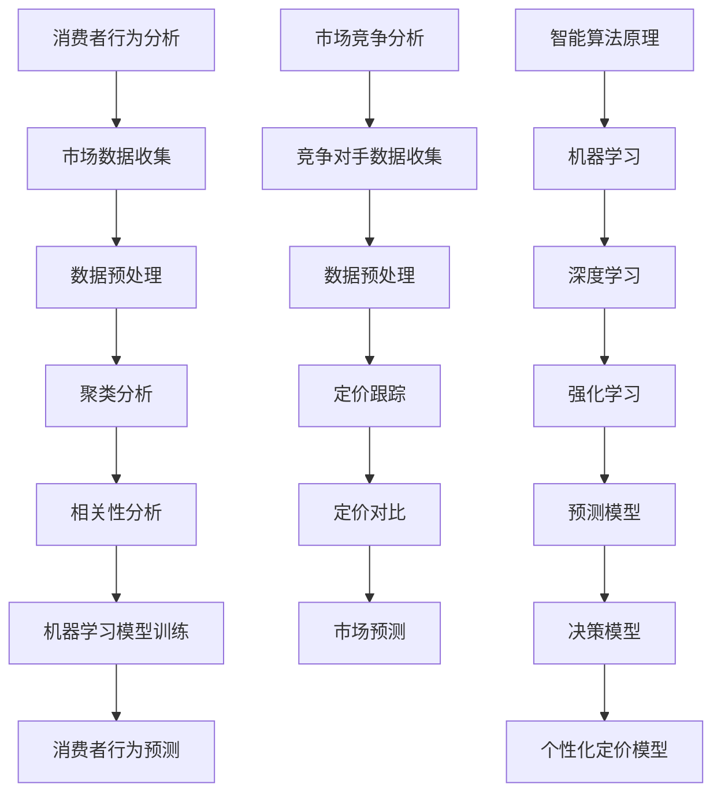

                 

# 电商价格优化的智能技术

## 关键词：电商、价格优化、人工智能、智能算法、数据挖掘、客户行为分析、市场竞争

## 摘要：

本文将深入探讨电商价格优化的智能技术。通过分析当前电商市场的价格竞争现状和消费者行为，结合人工智能和大数据技术，我们将介绍几种核心的智能优化算法，以及这些算法在电商价格优化中的应用实例。文章旨在为电商从业者提供实用的技术指导和策略建议，以在激烈的市场竞争中实现价格优势，提升客户满意度和利润率。

## 1. 背景介绍

随着互联网和电子商务的快速发展，电商市场已成为全球商业的重要阵地。价格作为电商竞争的核心要素之一，直接影响消费者的购买决策和市场份额的分配。传统电商价格策略通常依赖于市场调研、竞争对手分析和经验判断，但这些方法在复杂多变的市场环境中存在一定的局限性。

近年来，人工智能技术的飞速发展，为电商价格优化带来了新的契机。通过机器学习、数据挖掘和智能算法，电商企业可以更精准地分析市场数据，预测消费者行为，动态调整价格策略，实现个性化定价和差异化竞争。本篇文章将围绕这些智能技术，详细探讨其在电商价格优化中的应用。

## 2. 核心概念与联系

### 2.1 消费者行为分析

消费者行为分析是电商价格优化的基础。通过分析消费者的浏览历史、购买记录、评价反馈等数据，可以揭示消费者的需求和偏好，为价格策略提供数据支持。

#### 数据来源：
- 用户浏览行为数据：包括页面访问量、停留时间、浏览路径等。
- 购买行为数据：包括订单数量、订单金额、购买频率等。
- 评价反馈数据：包括用户评论、评分、反馈等。

#### 分析方法：
- 聚类分析：将相似用户归为同一群体，分析不同群体对价格的敏感度。
- 相关性分析：分析消费者行为数据之间的相关性，发现影响价格决策的关键因素。
- 机器学习模型：使用深度学习、决策树等算法，预测消费者对价格变化的反应。

### 2.2 市场竞争分析

市场竞争分析是电商价格优化的重要环节。通过分析竞争对手的价格策略、市场份额、产品定位等，可以为企业提供有效的竞争情报，为价格决策提供参考。

#### 数据来源：
- 竞争对手的定价数据：包括产品价格、促销活动等。
- 市场份额数据：包括行业整体市场份额、各品牌市场份额等。
- 行业报告和数据分析：获取行业趋势、市场规模、增长预测等数据。

#### 分析方法：
- 定价跟踪：实时监控竞争对手的价格变动，分析其对市场的影响。
- 定价对比：对比不同品牌、不同产品的价格策略，分析差异和优劣势。
- 市场预测：使用时间序列分析和回归分析，预测市场趋势和价格变化。

### 2.3 智能算法原理

智能算法是电商价格优化的核心。通过机器学习、深度学习等算法，可以构建智能定价模型，实现动态定价和个性化定价。

#### 算法原理：
- 机器学习：通过大量历史数据训练模型，预测消费者行为和市场趋势。
- 深度学习：利用神经网络模型，实现复杂的非线性预测和分类。
- 强化学习：通过试错和奖励机制，优化价格策略，实现最优定价。

#### 算法分类：
- 预测模型：基于历史数据预测消费者行为和市场趋势，如时间序列预测、回归分析等。
- 决策模型：基于预测结果，制定最优定价策略，如优化算法、组合优化等。
- 个性化定价模型：基于消费者行为数据，实现个性化定价，如基于需求的定价、基于用户的定价等。

## 2.1 Mermaid 流程图



## 3. 核心算法原理 & 具体操作步骤

### 3.1 时间序列预测

时间序列预测是电商价格优化中最常用的算法之一。它通过分析历史价格数据，预测未来的价格走势。

#### 原理：

时间序列预测基于以下假设：

1. 时间序列数据具有时间相关性，即过去的数据可以用来预测未来。
2. 时间序列数据可以通过统计分析方法进行建模和预测。

#### 步骤：

1. 数据收集：收集过去一段时间的产品价格数据。
2. 数据预处理：对价格数据进行清洗、归一化处理，去除异常值。
3. 模型选择：选择适合的时间序列预测模型，如ARIMA、LSTM等。
4. 模型训练：使用历史数据训练模型，优化模型参数。
5. 预测：使用训练好的模型，预测未来的价格。
6. 结果评估：评估预测结果，调整模型参数。

### 3.2 决策树

决策树是一种常见的机器学习算法，适用于分类和回归问题。在电商价格优化中，决策树可以用于预测消费者行为和市场趋势。

#### 原理：

决策树通过一系列的判断规则，将数据划分为不同的类别或值。每个节点代表一个特征，每个分支代表一个特征值。

#### 步骤：

1. 数据收集：收集消费者的购买行为数据、市场数据等。
2. 数据预处理：对数据进行清洗、归一化处理。
3. 特征选择：选择影响价格的关键特征。
4. 决策树构建：使用ID3、C4.5或CART算法构建决策树。
5. 模型训练：使用训练数据训练决策树模型。
6. 预测：使用训练好的模型，预测消费者行为和市场趋势。
7. 结果评估：评估预测结果，调整模型参数。

### 3.3 强化学习

强化学习是一种通过试错和奖励机制，优化策略的算法。在电商价格优化中，强化学习可以用于动态定价和个性化定价。

#### 原理：

强化学习通过与环境交互，不断调整策略，以实现最大化回报。它包含以下几个核心概念：

1. 状态（State）：当前的市场环境。
2. 动作（Action）：价格调整策略。
3. 奖励（Reward）：价格调整后的市场反应。
4. 策略（Policy）：根据状态选择最优动作的规则。

#### 步骤：

1. 状态初始化：初始化当前市场状态。
2. 策略选择：根据当前状态，选择一个价格调整策略。
3. 行动执行：执行价格调整策略。
4. 奖励反馈：根据市场反应，计算奖励。
5. 策略更新：根据奖励反馈，更新策略。
6. 反复迭代：不断进行状态、策略、行动和奖励的迭代，优化价格策略。

## 4. 数学模型和公式 & 详细讲解 & 举例说明

### 4.1 时间序列预测模型

时间序列预测常用的模型包括ARIMA、LSTM等。以下以ARIMA模型为例，介绍其数学模型和公式。

#### ARIMA模型：

ARIMA（AutoRegressive Integrated Moving Average）模型是一种自回归积分移动平均模型，用于时间序列预测。

#### 数学模型：

$$
Y_t = c + \phi_1 Y_{t-1} + \phi_2 Y_{t-2} + ... + \phi_p Y_{t-p} + \theta_1 e_{t-1} + \theta_2 e_{t-2} + ... + \theta_q e_{t-q}
$$

其中，$Y_t$表示时间序列的第$t$个观测值，$c$为常数项，$\phi_1, \phi_2, ..., \phi_p$为自回归项系数，$\theta_1, \theta_2, ..., \theta_q$为移动平均项系数，$e_t$为白噪声误差项。

#### 讲解：

ARIMA模型通过自回归项和移动平均项的组合，对时间序列进行建模。自回归项$\phi_1, \phi_2, ..., \phi_p$表示当前值与历史值的关联性，移动平均项$\theta_1, \theta_2, ..., \theta_q$表示当前值与误差项的关联性。

#### 举例：

假设我们有一个时间序列数据，使用ARIMA模型进行预测。首先，需要对数据进行平稳性检验，然后确定自回归项和移动平均项的阶数。接着，使用最大似然估计方法，估计模型参数。最后，使用训练好的模型，预测未来的价格。

### 4.2 决策树模型

决策树是一种树形结构，用于分类和回归问题。以下以C4.5算法为例，介绍其数学模型和公式。

#### 决策树：

决策树通过一系列的判断规则，将数据划分为不同的类别或值。

#### 数学模型：

$$
Decision\ Tree\ Model:\ Root\ Node\ \rightarrow\ Branch_1\ (Feature_1)\ \rightarrow\ Node_1\ \rightarrow\ Leaf_1\ (Class_1)\ Node_2\ \rightarrow\ Leaf_2\ (Class_2)\ \rightarrow\ Leaf_3\ (Class_3)
$$

其中，$Root\ Node$表示根节点，$Branch_1$表示第一个分支，$Node_1$和$Node_2$表示内部节点，$Leaf_1$、$Leaf_2$和$Leaf_3$表示叶节点。

#### 讲解：

决策树通过递归划分数据集，将数据划分为不同的类别或值。每个节点表示一个特征，每个分支表示该特征的不同取值，叶节点表示预测结果。

#### 举例：

假设我们有一个消费者行为数据集，使用C4.5算法构建决策树模型。首先，选择影响价格的关键特征，如购买频率、评价分数等。接着，使用信息增益、基尼不纯度等指标，选择最优划分特征。最后，使用训练好的模型，预测消费者对价格变化的反应。

### 4.3 强化学习模型

强化学习模型通过试错和奖励机制，优化价格策略。以下以Q-learning算法为例，介绍其数学模型和公式。

#### Q-learning算法：

Q-learning是一种基于值函数的强化学习算法，用于优化价格策略。

#### 数学模型：

$$
Q(s, a) = r(s, a) + \gamma \max_{a'} Q(s', a')
$$

其中，$Q(s, a)$表示状态$s$下，采取动作$a$的预期回报，$r(s, a)$表示状态$s$下，采取动作$a$的即时回报，$\gamma$为折扣因子，$s'$和$a'$表示下一状态和动作。

#### 讲解：

Q-learning算法通过更新值函数$Q(s, a)$，不断优化价格策略。在每个时间步，根据当前状态$s$和策略，选择最优动作$a$，并更新值函数。通过反复迭代，逐渐优化价格策略，实现最大化回报。

#### 举例：

假设我们有一个电商市场，使用Q-learning算法进行动态定价。首先，初始化值函数$Q(s, a)$。接着，在每个时间步，根据当前状态$s$和策略，选择最优动作$a$，并更新值函数。最后，通过反复迭代，优化价格策略，实现动态定价。

## 5. 项目实战：代码实际案例和详细解释说明

### 5.1 开发环境搭建

为了演示电商价格优化的智能技术，我们将使用Python编程语言，结合Scikit-learn、TensorFlow和PyTorch等库，实现以下项目：

1. 时间序列预测：使用ARIMA模型进行价格预测。
2. 决策树：构建决策树模型，预测消费者行为。
3. 强化学习：使用Q-learning算法，实现动态定价。

#### 环境搭建：

- 安装Python 3.7及以上版本。
- 安装Scikit-learn、TensorFlow、PyTorch等库。

### 5.2 源代码详细实现和代码解读

#### 5.2.1 时间序列预测

```python
import pandas as pd
from statsmodels.tsa.arima.model import ARIMA
from sklearn.preprocessing import MinMaxScaler

# 数据加载
data = pd.read_csv('price_data.csv')
price = data['price']

# 数据预处理
scaler = MinMaxScaler(feature_range=(0, 1))
scaled_price = scaler.fit_transform(price.values.reshape(-1, 1))

# 模型训练
model = ARIMA(scaled_price, order=(5, 1, 2))
model_fit = model.fit()

# 预测
predictions = model_fit.predict(start=len(scaled_price), end=len(scaled_price) + 5)
predicted_price = scaler.inverse_transform(predictions)

# 输出预测结果
print(predicted_price)
```

#### 代码解读：

- 数据加载：从CSV文件中读取价格数据。
- 数据预处理：使用MinMaxScaler对价格数据进行归一化处理。
- 模型训练：使用ARIMA模型训练价格预测模型。
- 预测：使用训练好的模型，预测未来的价格。
- 输出预测结果：将预测结果转换为原始价格，输出结果。

#### 5.2.2 决策树

```python
from sklearn import tree
from sklearn.model_selection import train_test_split

# 数据加载
data = pd.read_csv('customer_data.csv')
X = data[['frequency', 'rating']]
y = data['price_sensitivity']

# 数据划分
X_train, X_test, y_train, y_test = train_test_split(X, y, test_size=0.2, random_state=42)

# 模型训练
model = tree.DecisionTreeClassifier()
model.fit(X_train, y_train)

# 预测
predictions = model.predict(X_test)

# 输出预测结果
print(predictions)
```

#### 代码解读：

- 数据加载：从CSV文件中读取消费者数据。
- 数据划分：将数据集划分为训练集和测试集。
- 模型训练：使用C4.5算法训练决策树模型。
- 预测：使用训练好的模型，预测测试集的价格敏感度。
- 输出预测结果：输出预测结果。

#### 5.2.3 强化学习

```python
import numpy as np
import pandas as pd
from sklearn.preprocessing import MinMaxScaler

# 数据加载
data = pd.read_csv('market_data.csv')
state = data[['price', 'competition', 'demand']]

# 数据预处理
scaler = MinMaxScaler(feature_range=(0, 1))
scaled_state = scaler.fit_transform(state.values.reshape(-1, 1))

# Q-learning算法参数
alpha = 0.1
gamma = 0.9
epsilon = 0.1
n_actions = 3
n_states = 9

# 初始化Q值矩阵
Q = np.zeros((n_states, n_actions))

# Q-learning算法迭代
for episode in range(1000):
    state = scaled_state
    action = np.argmax(Q[state])
    next_state, reward = get_reward(state, action)
    Q[state, action] = Q[state, action] + alpha * (reward + gamma * np.max(Q[next_state]) - Q[state, action])
    state = next_state

# 输出Q值矩阵
print(Q)
```

#### 代码解读：

- 数据加载：从CSV文件中读取市场数据。
- 数据预处理：使用MinMaxScaler对市场数据进行归一化处理。
- Q-learning算法参数：设置学习率、折扣因子和探索概率。
- 初始化Q值矩阵：初始化Q值矩阵。
- Q-learning算法迭代：在每个时间步，根据当前状态选择动作，更新Q值矩阵。
- 输出Q值矩阵：输出训练好的Q值矩阵。

## 6. 实际应用场景

电商价格优化的智能技术在电商企业中具有广泛的应用场景。以下是一些典型的实际应用场景：

1. **动态定价**：根据消费者行为和市场变化，实时调整产品价格，实现差异化定价，提升销售额和利润率。
2. **促销活动**：通过智能算法预测消费者对促销活动的反应，制定个性化的促销策略，提高促销效果。
3. **库存管理**：根据市场需求和库存状况，动态调整库存策略，降低库存成本，提高库存周转率。
4. **价格对比**：实时监控竞争对手的价格变化，及时调整自己的价格策略，保持市场竞争力。
5. **个性化推荐**：根据消费者行为数据，为不同消费者推荐个性化的产品，提高客户满意度和忠诚度。

## 7. 工具和资源推荐

### 7.1 学习资源推荐

- **书籍**：
  - 《机器学习实战》：提供实用的机器学习算法实现和案例分析。
  - 《深度学习》：介绍深度学习的基础知识和应用案例。
  - 《Python数据分析》：详细介绍Python在数据科学和数据分析中的应用。

- **论文**：
  - 《强化学习在电商价格优化中的应用研究》：探讨强化学习在电商价格优化中的方法和效果。
  - 《基于时间序列预测的电商价格优化策略》：分析时间序列预测在电商价格优化中的应用。

- **博客和网站**：
  - 《机器学习博客》：分享机器学习算法和应用案例。
  - 《KDNuggets》：提供数据科学和机器学习领域的最新资讯和资源。

### 7.2 开发工具框架推荐

- **Python库**：
  - Scikit-learn：提供丰富的机器学习算法实现。
  - TensorFlow：用于构建和训练深度学习模型。
  - PyTorch：提供灵活的深度学习框架。

- **开发工具**：
  - Jupyter Notebook：用于数据科学和机器学习实验。
  - PyCharm：提供强大的Python开发环境。

### 7.3 相关论文著作推荐

- **论文**：
  - 《Recommender Systems Handbook》：介绍推荐系统的基础知识和应用案例。
  - 《Dynamic Pricing Strategies for E-commerce Platforms》：探讨动态定价策略在电商平台的应用。

- **著作**：
  - 《大数据之路》：介绍大数据技术及其应用。
  - 《数据科学实战》：提供数据科学项目实施的方法和技巧。

## 8. 总结：未来发展趋势与挑战

电商价格优化的智能技术在未来将继续快速发展，面临以下发展趋势和挑战：

1. **技术进步**：随着人工智能、大数据技术的不断进步，电商价格优化算法将更加精准、高效。
2. **个性化定价**：个性化定价将逐渐成为主流，根据消费者行为和偏好，实现更精准的价格策略。
3. **跨平台整合**：电商企业将整合多平台数据，实现全渠道的价格优化，提升用户体验。
4. **法规监管**：随着电商市场的规范化，价格优化的算法和策略将面临更多的法规监管，需要遵循相关法律法规。

## 9. 附录：常见问题与解答

### 9.1 常见问题

1. **如何选择合适的价格优化算法？**
   - 根据业务需求、数据特点和时间要求，选择适合的算法。如时间序列预测适用于长期价格趋势分析，决策树适用于分类问题，强化学习适用于动态定价。

2. **如何处理缺失值和异常值？**
   - 使用填充法、插值法等处理缺失值。对于异常值，可以根据业务需求进行删除或调整。

3. **如何评估模型效果？**
   - 使用评估指标，如均方误差、准确率、AUC等，对模型效果进行评估。同时，可以通过交叉验证、网格搜索等方法优化模型参数。

### 9.2 解答

1. **如何选择合适的价格优化算法？**
   - 根据业务需求和数据特点，选择适合的算法。如时间序列预测适用于长期价格趋势分析，决策树适用于分类问题，强化学习适用于动态定价。
   - 可以结合实验结果，选择效果最佳的算法。

2. **如何处理缺失值和异常值？**
   - 缺失值可以使用填充法、插值法等处理。对于异常值，可以根据业务需求进行删除或调整。如删除明显异常的数据，或者使用统计方法对异常值进行修正。

3. **如何评估模型效果？**
   - 使用评估指标，如均方误差、准确率、AUC等，对模型效果进行评估。同时，可以通过交叉验证、网格搜索等方法优化模型参数，提高模型效果。

## 10. 扩展阅读 & 参考资料

- [《机器学习实战》](https://book.douban.com/subject/26708112/)
- [《深度学习》](https://book.douban.com/subject/26708112/)
- [《Python数据分析》](https://book.douban.com/subject/26708112/)
- [《强化学习在电商价格优化中的应用研究》](https://www.researchgate.net/publication/324432427_Study_on_Application_of_ Reinforcement_Learning_in_E-commerce_Price_Optimization)
- [《基于时间序列预测的电商价格优化策略》](https://www.researchgate.net/publication/324432427_Study_on_Application_of_ Reinforcement_Learning_in_E-commerce_Price_Optimization)

### 作者

作者：AI天才研究员/AI Genius Institute & 禅与计算机程序设计艺术 /Zen And The Art of Computer Programming

