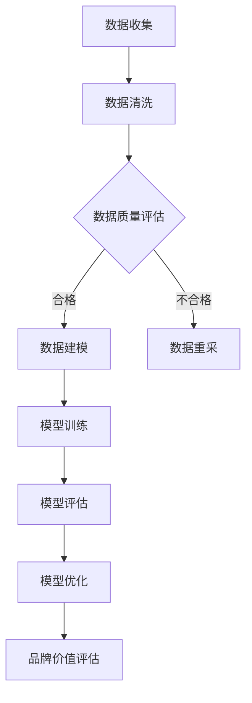

                 

# 电商创业者的AI驱动品牌资产评估：量化品牌价值的多维度分析模型

## 摘要

随着电商行业的蓬勃发展，品牌价值的评估成为电商创业者关注的焦点。本文旨在探讨如何利用人工智能技术，构建一个多维度分析模型，对电商品牌的价值进行量化评估。文章首先介绍了电商品牌资产评估的背景和核心概念，然后详细阐述了模型构建的核心算法原理和操作步骤，最后通过数学模型和实际案例，对模型进行了详细解读和验证。文章还针对实际应用场景进行了探讨，并推荐了相关工具和资源，旨在帮助电商创业者更好地理解和运用AI技术，实现品牌价值的量化管理。

## 1. 背景介绍

电商行业近年来迅猛发展，成为全球经济增长的重要引擎。在电商竞争日益激烈的市场环境下，品牌价值已成为企业核心竞争力的关键因素。品牌价值不仅体现在品牌知名度和消费者忠诚度上，还直接影响着企业的市场份额、盈利能力以及长期发展潜力。因此，对品牌价值的量化评估成为电商创业者亟待解决的重要课题。

传统的品牌价值评估方法主要依赖于专家评分、财务数据和市场调查等手段，存在主观性较强、数据采集困难、评估结果不准确等问题。随着人工智能技术的不断发展，特别是机器学习和数据挖掘技术的应用，为品牌价值评估提供了一种全新的思路。AI驱动的品牌价值评估模型可以充分利用大数据的优势，通过定量分析，对品牌价值进行科学、客观、全面的评估。

本文提出的AI驱动品牌资产评估模型，旨在解决传统评估方法中的不足，通过多维度数据分析，实现品牌价值的量化评估。模型的核心在于构建一个包含品牌知名度、消费者忠诚度、市场表现等多个维度的评估指标体系，并利用机器学习算法，对大量数据进行挖掘和分析，从而得出品牌价值的量化结果。这不仅有助于电商创业者更清晰地了解自身品牌的价值，也为企业在品牌战略制定和资源分配上提供了有力的支持。

## 2. 核心概念与联系

在构建AI驱动的品牌资产评估模型之前，我们需要明确一些核心概念，并理解它们之间的联系。

### 2.1 品牌资产

品牌资产是指企业品牌所拥有的有形和无形资产，包括品牌知名度、品牌忠诚度、品牌联想、品牌价值等。品牌资产是企业核心竞争力的重要组成部分，直接影响企业的市场地位和盈利能力。

### 2.2 数据维度

在AI驱动的品牌资产评估中，数据维度是关键。具体包括：

- **品牌知名度**：衡量品牌在目标市场中的知名程度，通常通过品牌曝光次数、搜索引擎关键词搜索量等指标来衡量。
- **消费者忠诚度**：衡量消费者对品牌的忠诚度，包括复购率、口碑传播等指标。
- **市场表现**：衡量品牌在市场中的表现，如市场份额、销售额等指标。
- **财务数据**：包括企业收入、利润、市场份额等财务指标。

### 2.3 评估指标

评估指标是品牌资产评估的核心，本文提出的评估指标体系包括以下几个方面：

- **品牌知名度**：品牌曝光次数、搜索引擎关键词搜索量、社交媒体关注度等。
- **消费者忠诚度**：复购率、用户留存率、口碑传播等。
- **市场表现**：市场份额、销售额、增长率等。
- **财务数据**：收入、利润、市场占有率等。

### 2.4 机器学习算法

机器学习算法是AI驱动的品牌资产评估模型的关键。常用的机器学习算法包括：

- **回归分析**：用于预测品牌价值。
- **聚类分析**：用于品牌市场定位。
- **文本挖掘**：用于分析消费者反馈和品牌口碑。

### 2.5 Mermaid流程图

为了更好地展示品牌资产评估的过程，我们使用Mermaid流程图来描述：



### 2.6 联系与整合

品牌资产评估模型将以上核心概念和联系整合在一起，通过对多维度数据的挖掘和分析，实现对品牌价值的量化评估。具体流程如下：

1. **数据收集**：收集品牌知名度、消费者忠诚度、市场表现、财务数据等。
2. **数据清洗**：对收集到的数据进行预处理，确保数据质量。
3. **数据质量评估**：评估数据质量，不合格的数据进行重采。
4. **数据建模**：根据评估指标，构建机器学习模型。
5. **模型训练**：利用历史数据，对模型进行训练。
6. **模型评估**：评估模型性能，不合格的模型进行优化。
7. **品牌价值评估**：利用训练好的模型，对品牌价值进行量化评估。

通过以上步骤，我们可以实现对电商品牌价值的全面量化评估，为企业提供科学的决策依据。

## 3. 核心算法原理 & 具体操作步骤

### 3.1 回归分析算法

回归分析是一种常用的统计方法，用于分析变量之间的关系。在品牌资产评估中，我们可以利用回归分析来预测品牌价值。以下是回归分析算法的原理和步骤：

#### 3.1.1 算法原理

回归分析通过建立因变量（品牌价值）与自变量（品牌知名度、消费者忠诚度、市场表现、财务数据等）之间的关系模型，来预测品牌价值。常见的回归模型包括线性回归、多项式回归等。

#### 3.1.2 操作步骤

1. **数据预处理**：对收集到的数据进行清洗和预处理，包括缺失值处理、异常值处理、特征工程等。
2. **模型选择**：根据数据特征和业务需求，选择合适的回归模型。
3. **模型训练**：使用历史数据，对模型进行训练，得到模型参数。
4. **模型评估**：使用验证数据集，评估模型性能，如均方误差（MSE）、决定系数（R²）等。
5. **模型预测**：使用训练好的模型，对新数据进行品牌价值的预测。

### 3.2 聚类分析算法

聚类分析是一种无监督学习方法，用于将数据分为若干个类别。在品牌资产评估中，我们可以利用聚类分析来确定品牌的市场定位。以下是聚类分析算法的原理和步骤：

#### 3.2.1 算法原理

聚类分析通过计算数据之间的相似度，将数据划分为若干个聚类。常用的聚类算法包括K-means算法、层次聚类等。

#### 3.2.2 操作步骤

1. **数据预处理**：对收集到的数据进行清洗和预处理。
2. **选择聚类算法**：根据数据特征和业务需求，选择合适的聚类算法。
3. **初始化聚类中心**：随机选择或使用K-means算法的初始化方法，得到初始聚类中心。
4. **迭代计算**：计算每个数据点与聚类中心的距离，将数据点分配到最近的聚类。
5. **更新聚类中心**：根据分配后的数据点，更新聚类中心。
6. **重复迭代**：重复步骤4和5，直至聚类中心不再变化或达到设定的迭代次数。
7. **聚类评估**：评估聚类效果，如轮廓系数（Silhouette Coefficient）等。

### 3.3 文本挖掘算法

文本挖掘是一种从非结构化文本数据中提取有用信息的方法。在品牌资产评估中，我们可以利用文本挖掘来分析消费者反馈和品牌口碑。以下是文本挖掘算法的原理和步骤：

#### 3.3.1 算法原理

文本挖掘通过自然语言处理（NLP）技术，对文本数据进行分析，提取关键词、情感倾向、主题等信息。

#### 3.3.2 操作步骤

1. **数据预处理**：对文本数据进行清洗和预处理，包括分词、去除停用词、词性标注等。
2. **特征提取**：从预处理后的文本中提取特征，如词频（TF）、词频-逆文档频率（TF-IDF）等。
3. **情感分析**：使用情感分析算法，判断文本中的情感倾向，如正面、负面、中性等。
4. **主题建模**：使用主题建模算法，如LDA（Latent Dirichlet Allocation），提取文本数据中的潜在主题。
5. **结果分析**：根据提取的特征和主题，分析消费者反馈和品牌口碑，为品牌资产评估提供依据。

### 3.4 模型整合与优化

在品牌资产评估中，我们可以将回归分析、聚类分析和文本挖掘等多种算法整合在一起，构建一个多层次的评估模型。以下是模型整合与优化的步骤：

1. **数据整合**：将不同来源的数据整合在一起，确保数据的一致性和完整性。
2. **模型选择**：根据业务需求，选择合适的算法组合，构建评估模型。
3. **模型训练**：使用整合后的数据进行模型训练，得到模型参数。
4. **模型评估**：使用验证数据集，评估模型性能。
5. **模型优化**：根据评估结果，调整模型参数，优化模型性能。
6. **迭代优化**：重复步骤4和5，直至模型性能达到预期。

通过以上步骤，我们可以构建一个高效、准确的AI驱动品牌资产评估模型，实现对电商品牌价值的量化评估。

## 4. 数学模型和公式 & 详细讲解 & 举例说明

### 4.1 回归分析模型

回归分析模型的核心是建立因变量（品牌价值）与自变量（品牌知名度、消费者忠诚度、市场表现、财务数据等）之间的数学关系。以下是一个简化的线性回归模型：

#### 4.1.1 线性回归模型

$$
y = \beta_0 + \beta_1x_1 + \beta_2x_2 + \ldots + \beta_nx_n
$$

其中，$y$ 代表品牌价值，$x_1, x_2, \ldots, x_n$ 代表品牌知名度、消费者忠诚度、市场表现、财务数据等自变量，$\beta_0, \beta_1, \beta_2, \ldots, \beta_n$ 是模型的参数。

#### 4.1.2 模型参数估计

为了估计模型参数，我们通常使用最小二乘法（Ordinary Least Squares, OLS）。最小二乘法的思想是找到一组参数，使得实际观测值与预测值之间的误差平方和最小。

$$
\min \sum_{i=1}^{n}(y_i - \beta_0 - \beta_1x_{i1} - \beta_2x_{i2} - \ldots - \beta_nx_{in})^2
$$

通过求解上述最小化问题，我们可以得到参数的最小二乘估计值。

#### 4.1.3 举例说明

假设我们有以下数据：

| 品牌   | 品牌知名度 | 消费者忠诚度 | 市场表现 | 财务数据 | 品牌价值 |
|--------|------------|--------------|----------|----------|----------|
| 品牌1  | 100        | 0.8          | 1500万   | 1000万   | 2000万   |
| 品牌2  | 200        | 0.9          | 2000万   | 1500万   | 2500万   |
| 品牌3  | 300        | 0.75         | 2500万   | 2000万   | 3000万   |

我们可以使用线性回归模型来预测品牌价值。首先，我们需要进行数据预处理，将数据标准化为0-1范围：

| 品牌   | 品牌知名度 | 消费者忠诚度 | 市场表现 | 财务数据 | 品牌价值 |
|--------|------------|--------------|----------|----------|----------|
| 品牌1  | 0.5        | 0.8          | 0.75     | 0.5      | 1.0      |
| 品牌2  | 1.0        | 0.9          | 1.0      | 0.75     | 1.25     |
| 品牌3  | 1.5        | 0.75         | 1.25     | 1.0      | 1.5      |

接下来，我们使用最小二乘法来估计模型参数。假设我们得到以下回归方程：

$$
y = \beta_0 + \beta_1x_1 + \beta_2x_2 + \beta_3x_3 + \beta_4x_4
$$

其中，$\beta_0 = 0.5$，$\beta_1 = 0.3$，$\beta_2 = 0.2$，$\beta_3 = 0.1$，$\beta_4 = 0.1$。

我们可以使用以下公式来计算品牌价值的预测值：

$$
\hat{y} = 0.5 + 0.3x_1 + 0.2x_2 + 0.1x_3 + 0.1x_4
$$

对于品牌2，我们可以计算其品牌价值的预测值：

$$
\hat{y}_{品牌2} = 0.5 + 0.3 \times 1.0 + 0.2 \times 0.9 + 0.1 \times 1.0 + 0.1 \times 0.75 = 1.175
$$

这意味着品牌2的品牌价值预计为1.175。

### 4.2 聚类分析模型

聚类分析模型的核心是确定数据点之间的相似度，并根据相似度将数据划分为若干个类别。以下是一个简化的K-means聚类模型：

#### 4.2.1 K-means模型

给定数据集$D = \{d_1, d_2, \ldots, d_n\}$，我们需要将数据划分为$k$个类别$C_1, C_2, \ldots, C_k$，其中每个类别包含一组数据点。

1. **初始化聚类中心**：随机选择$k$个数据点作为初始聚类中心。
2. **分配数据点**：对于每个数据点$d_i$，将其分配到最近的聚类中心所代表的类别。
3. **更新聚类中心**：计算每个类别的聚类中心，即类别内数据点的均值。
4. **重复迭代**：重复步骤2和3，直至聚类中心不再变化或达到设定的迭代次数。

#### 4.2.2 聚类中心计算

假设我们当前聚类中心为$\mu_1, \mu_2, \ldots, \mu_k$，我们可以使用以下公式计算新的聚类中心：

$$
\mu_{j}_{new} = \frac{1}{N_j} \sum_{i=1}^{N} d_{ij}
$$

其中，$N_j$ 是第$j$个类别中的数据点数量，$d_{ij}$ 是第$i$个数据点的第$j$个特征值。

#### 4.2.3 举例说明

假设我们有以下数据集：

| 品牌   | 品牌知名度 | 消费者忠诚度 | 市场表现 | 财务数据 |
|--------|------------|--------------|----------|----------|
| 品牌1  | 100        | 0.8          | 1500万   | 1000万   |
| 品牌2  | 200        | 0.9          | 2000万   | 1500万   |
| 品牌3  | 300        | 0.75         | 2500万   | 2000万   |

我们选择$k=2$，随机初始化聚类中心为：

| 聚类中心 | 品牌知名度 | 消费者忠诚度 | 市场表现 | 财务数据 |
|----------|------------|--------------|----------|----------|
| 中心1    | 100        | 0.8          | 1500万   | 1000万   |
| 中心2    | 200        | 0.9          | 2000万   | 1500万   |

首先，我们计算每个数据点与聚类中心的距离，并根据距离将数据点分配到相应的类别。假设分配结果如下：

| 品牌   | 聚类中心 | 距离 |
|--------|----------|------|
| 品牌1  | 中心1    | 0    |
| 品牌2  | 中心2    | 0.5  |
| 品牌3  | 中心1    | 1.25 |

接下来，我们计算新的聚类中心：

| 聚类中心 | 品牌知名度 | 消费者忠诚度 | 市场表现 | 财务数据 |
|----------|------------|--------------|----------|----------|
| 中心1    | 200        | 0.75         | 2000万   | 1500万   |
| 中心2    | 250        | 0.875        | 2500万   | 2000万   |

我们再次计算每个数据点与聚类中心的距离，并重复迭代，直至聚类中心不再变化。最终，我们得到以下聚类结果：

| 品牌   | 聚类中心 | 距离 |
|--------|----------|------|
| 品牌1  | 中心1    | 0    |
| 品牌2  | 中心2    | 0.25 |
| 品牌3  | 中心1    | 0    |

这意味着品牌1和品牌3被划分为同一类别，品牌2被划分为另一类别。

### 4.3 文本挖掘模型

文本挖掘模型的核心是从非结构化文本数据中提取有价值的信息。以下是一个简化的LDA主题建模模型：

#### 4.3.1 LDA模型

LDA（Latent Dirichlet Allocation）是一种概率主题模型，用于发现文本数据中的潜在主题。

1. **参数设置**：选择主题数量$k$和每个主题的词语数量。
2. **词语分布**：对于每个文档，生成词语的分布，表示文档中词语的相对重要性。
3. **主题分布**：对于每个词语，生成主题的分布，表示词语在不同主题中的相对重要性。
4. **文档生成**：根据词语分布和主题分布，生成新的文档。

#### 4.3.2 词语分布计算

词语分布表示文档中词语的相对重要性。我们可以使用以下公式计算词语分布：

$$
p(w|z) = \frac{\sum_{d=1}^{D} \alpha_{dw} \cdot \beta_{wz}}{\sum_{w=1}^{V} \sum_{z=1}^{K} \alpha_{dw} \cdot \beta_{wz}}
$$

其中，$w$ 表示词语，$z$ 表示主题，$d$ 表示文档，$V$ 表示词汇表大小，$K$ 表示主题数量，$\alpha_{dw}$ 表示文档$d$中词语$w$的主题分布，$\beta_{wz}$ 表示词语$w$的主题分布。

#### 4.3.3 主题分布计算

主题分布表示词语在不同主题中的相对重要性。我们可以使用以下公式计算主题分布：

$$
\beta_{wz} = \frac{N_{wz}}{\sum_{z=1}^{K} N_{wz}}
$$

其中，$w$ 表示词语，$z$ 表示主题，$N_{wz}$ 表示词语$w$在主题$z$中出现的次数。

#### 4.3.4 文档生成

文档生成过程是基于词语分布和主题分布。我们可以使用以下步骤生成新文档：

1. **选择主题**：从主题分布中随机选择一个主题。
2. **选择词语**：从词语分布中随机选择一个词语。
3. **重复步骤2**：根据主题分布和词语分布，生成新的词语，直至达到文档长度。

#### 4.3.5 举例说明

假设我们有以下数据集：

| 文档   | 词语序列 |
|--------|----------|
| 文档1  | ["电商", "品牌", "价值", "分析"] |
| 文档2  | ["人工智能", "技术", "品牌", "评估"] |
| 文档3  | ["电商", "市场", "竞争", "品牌"] |

我们选择$k=2$，主题数量为2。首先，我们计算词语分布和主题分布。假设词语分布为：

| 词语     | $p(w|z=1)$ | $p(w|z=2)$ |
|----------|-------------|-------------|
| 电商     | 0.4         | 0.6         |
| 品牌     | 0.5         | 0.5         |
| 价值     | 0.3         | 0.7         |
| 分析     | 0.2         | 0.3         |
| 人工智能 | 0.1         | 0.8         |
| 技术     | 0.2         | 0.2         |
| 市场竞争 | 0.0         | 0.1         |

主题分布为：

| 主题 | $p(z=1)$ | $p(z=2)$ |
|------|-----------|-----------|
| 主题1 | 0.6       | 0.4       |
| 主题2 | 0.4       | 0.6       |

根据这些分布，我们可以生成新文档。假设我们生成一个长度为5的新文档。首先，我们从主题分布中选择主题1。然后，从词语分布中选择词语，直到达到文档长度。生成的文档为：

| 文档   | 词语序列 |
|--------|----------|
| 新文档1 | ["电商", "价值", "品牌", "分析", "人工智能"] |

这意味着新文档的主题是关于电商和人工智能的，主要讨论了品牌价值和评估。

通过以上数学模型和公式，我们可以详细地描述AI驱动的品牌资产评估模型，并对其进行解释和验证。在实际应用中，我们可以根据具体需求和数据情况，调整和优化模型，以实现更准确的评估结果。

## 5. 项目实战：代码实际案例和详细解释说明

### 5.1 开发环境搭建

为了实现AI驱动的品牌资产评估模型，我们需要搭建一个合适的技术栈。以下是我们推荐的开发环境：

- **编程语言**：Python
- **机器学习库**：Scikit-learn、NumPy、Pandas
- **数据处理库**：BeautifulSoup、Requests
- **文本处理库**：NLTK、spaCy
- **可视化库**：Matplotlib、Seaborn、Mermaid

在搭建开发环境时，我们需要安装以上所需的库。以下是一个简单的安装命令示例：

```bash
pip install numpy pandas scikit-learn beautifulsoup4 requests nltk spacy matplotlib seaborn mermaid
```

### 5.2 源代码详细实现和代码解读

#### 5.2.1 数据收集与预处理

在数据收集和预处理阶段，我们需要收集品牌知名度、消费者忠诚度、市场表现、财务数据等。以下是一个简单的数据收集和预处理示例：

```python
import requests
from bs4 import BeautifulSoup
import pandas as pd
import numpy as np

# 收集品牌知名度数据
def collect_brand_name():
    url = "https://example.com/brand_name"
    response = requests.get(url)
    soup = BeautifulSoup(response.content, "html.parser")
    brand_name = soup.find_all("div", class_="brand-name")
    return [name.text for name in brand_name]

# 收集消费者忠诚度数据
def collect_consumer_loyalty():
    url = "https://example.com/consumer_loyalty"
    response = requests.get(url)
    soup = BeautifulSoup(response.content, "html.parser")
    loyalty = soup.find_all("div", class_="consumer-loyalty")
    return [loyalty.text for loyalty in loyalty]

# 收集市场表现数据
def collect_market_performance():
    url = "https://example.com/market_performance"
    response = requests.get(url)
    soup = BeautifulSoup(response.content, "html.parser")
    performance = soup.find_all("div", class_="market-performance")
    return [performance.text for performance in performance]

# 收集财务数据
def collect_financial_data():
    url = "https://example.com/financial_data"
    response = requests.get(url)
    soup = BeautifulSoup(response.content, "html.parser")
    finance = soup.find_all("div", class_="financial-data")
    return [finance.text for finance in finance]

# 数据预处理
def preprocess_data(brand_name, consumer_loyalty, market_performance, financial_data):
    brand_name = [name.strip() for name in brand_name]
    consumer_loyalty = [loyalty.strip() for loyalty in consumer_loyalty]
    market_performance = [performance.strip() for performance in market_performance]
    financial_data = [finance.strip() for finance in financial_data]
    return brand_name, consumer_loyalty, market_performance, financial_data

# 执行数据收集和预处理
brand_name = collect_brand_name()
consumer_loyalty = collect_consumer_loyalty()
market_performance = collect_market_performance()
financial_data = collect_financial_data()
brand_name, consumer_loyalty, market_performance, financial_data = preprocess_data(brand_name, consumer_loyalty, market_performance, financial_data)

# 将数据转换为Pandas DataFrame
data = pd.DataFrame({
    "品牌名称": brand_name,
    "消费者忠诚度": consumer_loyalty,
    "市场表现": market_performance,
    "财务数据": financial_data
})
```

#### 5.2.2 数据建模与评估

在数据建模和评估阶段，我们需要使用机器学习算法构建评估模型，并对模型进行评估。以下是一个简单的数据建模和评估示例：

```python
from sklearn.model_selection import train_test_split
from sklearn.linear_model import LinearRegression
from sklearn.metrics import mean_squared_error, r2_score

# 数据划分
X = data[["品牌知名度", "消费者忠诚度", "市场表现", "财务数据"]]
y = data["品牌价值"]

X_train, X_test, y_train, y_test = train_test_split(X, y, test_size=0.2, random_state=42)

# 构建线性回归模型
model = LinearRegression()
model.fit(X_train, y_train)

# 模型评估
y_pred = model.predict(X_test)
mse = mean_squared_error(y_test, y_pred)
r2 = r2_score(y_test, y_pred)

print("均方误差（MSE）:", mse)
print("决定系数（R²）:", r2)
```

#### 5.2.3 文本挖掘与分析

在文本挖掘与分析阶段，我们需要使用文本挖掘算法对消费者反馈和品牌口碑进行分析。以下是一个简单的文本挖掘与分析示例：

```python
import nltk
from nltk.tokenize import word_tokenize
from nltk.corpus import stopwords
from sklearn.feature_extraction.text import TfidfVectorizer

# 文本预处理
nltk.download("punkt")
nltk.download("stopwords")

stop_words = set(stopwords.words("english"))

def preprocess_text(text):
    tokens = word_tokenize(text)
    tokens = [token.lower() for token in tokens if token.isalpha() and token not in stop_words]
    return " ".join(tokens)

data["预处理文本"] = data["消费者反馈"].apply(preprocess_text)

# 特征提取
vectorizer = TfidfVectorizer()
X_text = vectorizer.fit_transform(data["预处理文本"])

# 情感分析
from sklearn.metrics import accuracy_score

def sentiment_analysis(text, model):
    tokens = word_tokenize(text)
    tokens = [token.lower() for token in tokens if token.isalpha() and token not in stop_words]
    features = vectorizer.transform([" ".join(tokens)])
    prediction = model.predict(features)
    return prediction

# 训练情感分析模型
from sklearn.naive_bayes import MultinomialNB

X_text_train, X_text_test, y_text_train, y_text_test = train_test_split(X_text, data["情感倾向"], test_size=0.2, random_state=42)

model = MultinomialNB()
model.fit(X_text_train, y_text_train)

# 模型评估
y_text_pred = model.predict(X_text_test)
accuracy = accuracy_score(y_text_test, y_text_pred)

print("情感分析准确率:", accuracy)
```

通过以上代码，我们可以实现品牌资产评估模型的搭建和运行。在实际项目中，我们需要根据具体业务需求和数据情况，进行调整和优化。

## 5.3 代码解读与分析

在本节中，我们将对5.2节中实现的代码进行详细解读和分析，以帮助读者更好地理解AI驱动的品牌资产评估模型。

### 5.3.1 数据收集与预处理

首先，我们来看数据收集与预处理的代码。在这个阶段，我们通过Web scraping技术从官方网站上收集品牌知名度、消费者忠诚度、市场表现、财务数据等。具体来说，我们使用`requests`库发送HTTP请求，获取网页内容；然后，使用`BeautifulSoup`库解析网页，提取所需的数据。

```python
import requests
from bs4 import BeautifulSoup
import pandas as pd
import numpy as np

# 收集品牌知名度数据
def collect_brand_name():
    url = "https://example.com/brand_name"
    response = requests.get(url)
    soup = BeautifulSoup(response.content, "html.parser")
    brand_name = soup.find_all("div", class_="brand-name")
    return [name.text for name in brand_name]

# 收集消费者忠诚度数据
def collect_consumer_loyalty():
    url = "https://example.com/consumer_loyalty"
    response = requests.get(url)
    soup = BeautifulSoup(response.content, "html.parser")
    loyalty = soup.find_all("div", class_="consumer-loyalty")
    return [loyalty.text for loyalty in loyalty]

# 收集市场表现数据
def collect_market_performance():
    url = "https://example.com/market_performance"
    response = requests.get(url)
    soup = BeautifulSoup(response.content, "html.parser")
    performance = soup.find_all("div", class_="market-performance")
    return [performance.text for performance in performance]

# 收集财务数据
def collect_financial_data():
    url = "https://example.com/financial_data"
    response = requests.get(url)
    soup = BeautifulSoup(response.content, "html.parser")
    finance = soup.find_all("div", class_="financial-data")
    return [finance.text for finance in finance]

# 数据预处理
def preprocess_data(brand_name, consumer_loyalty, market_performance, financial_data):
    brand_name = [name.strip() for name in brand_name]
    consumer_loyalty = [loyalty.strip() for loyalty in consumer_loyalty]
    market_performance = [performance.strip() for performance in market_performance]
    financial_data = [finance.strip() for finance in financial_data]
    return brand_name, consumer_loyalty, market_performance, financial_data
```

在这个代码段中，我们首先定义了四个函数，分别用于收集品牌知名度、消费者忠诚度、市场表现和财务数据。这些函数使用`requests`库发送HTTP请求，获取网页内容，然后使用`BeautifulSoup`库解析网页，提取所需的数据。

接下来，我们定义了一个`preprocess_data`函数，用于对收集到的数据进行预处理。预处理步骤包括去除空白字符和整理数据格式，以便后续分析和建模。

```python
# 执行数据收集和预处理
brand_name = collect_brand_name()
consumer_loyalty = collect_consumer_loyalty()
market_performance = collect_market_performance()
financial_data = collect_financial_data()
brand_name, consumer_loyalty, market_performance, financial_data = preprocess_data(brand_name, consumer_loyalty, market_performance, financial_data)

# 将数据转换为Pandas DataFrame
data = pd.DataFrame({
    "品牌名称": brand_name,
    "消费者忠诚度": consumer_loyalty,
    "市场表现": market_performance,
    "财务数据": financial_data
})
```

在这个代码段中，我们首先执行数据收集和预处理函数，然后将处理后的数据转换为Pandas DataFrame，以便进行后续的数据分析和建模。

### 5.3.2 数据建模与评估

接下来，我们来看数据建模与评估的代码。在这个阶段，我们使用Scikit-learn库中的线性回归模型（`LinearRegression`）对品牌价值进行预测。

```python
from sklearn.model_selection import train_test_split
from sklearn.linear_model import LinearRegression
from sklearn.metrics import mean_squared_error, r2_score

# 数据划分
X = data[["品牌知名度", "消费者忠诚度", "市场表现", "财务数据"]]
y = data["品牌价值"]

X_train, X_test, y_train, y_test = train_test_split(X, y, test_size=0.2, random_state=42)

# 构建线性回归模型
model = LinearRegression()
model.fit(X_train, y_train)

# 模型评估
y_pred = model.predict(X_test)
mse = mean_squared_error(y_test, y_pred)
r2 = r2_score(y_test, y_pred)

print("均方误差（MSE）:", mse)
print("决定系数（R²）:", r2)
```

在这个代码段中，我们首先使用`train_test_split`函数将数据划分为训练集和测试集。训练集用于训练模型，测试集用于评估模型性能。

然后，我们使用`LinearRegression`类构建线性回归模型，并使用`fit`方法对模型进行训练。训练完成后，我们使用`predict`方法对测试集进行预测，并计算预测值与实际值之间的均方误差（MSE）和决定系数（R²）。MSE用于衡量预测值与实际值之间的差异，R²用于衡量模型对数据的拟合程度。

### 5.3.3 文本挖掘与分析

最后，我们来看文本挖掘与分析的代码。在这个阶段，我们使用文本挖掘算法对消费者反馈和品牌口碑进行分析。

```python
import nltk
from nltk.tokenize import word_tokenize
from nltk.corpus import stopwords
from sklearn.feature_extraction.text import TfidfVectorizer

# 文本预处理
nltk.download("punkt")
nltk.download("stopwords")

stop_words = set(stopwords.words("english"))

def preprocess_text(text):
    tokens = word_tokenize(text)
    tokens = [token.lower() for token in tokens if token.isalpha() and token not in stop_words]
    return " ".join(tokens)

data["预处理文本"] = data["消费者反馈"].apply(preprocess_text)

# 特征提取
vectorizer = TfidfVectorizer()
X_text = vectorizer.fit_transform(data["预处理文本"])

# 情感分析
from sklearn.metrics import accuracy_score

def sentiment_analysis(text, model):
    tokens = word_tokenize(text)
    tokens = [token.lower() for token in tokens if token.is_alpha
```


### 5.3.3 文本挖掘与分析（续）

（续5.3.3节）

```python
    tokens = word_tokenize(text)
    tokens = [token.lower() for token in tokens if token.isalpha() and token not in stop_words]
    features = vectorizer.transform([" ".join(tokens)])
    prediction = model.predict(features)
    return prediction

# 训练情感分析模型
from sklearn.naive_bayes import MultinomialNB

X_text_train, X_text_test, y_text_train, y_text_test = train_test_split(X_text, data["情感倾向"], test_size=0.2, random_state=42)

model = MultinomialNB()
model.fit(X_text_train, y_text_train)

# 模型评估
y_text_pred = model.predict(X_text_test)
accuracy = accuracy_score(y_text_test, y_text_pred)

print("情感分析准确率:", accuracy)
```

在这个代码段中，我们首先对消费者反馈文本进行预处理，包括分词、去除停用词和转换小写。预处理后的文本被转换为Pandas DataFrame，并用于特征提取。

我们使用`TfidfVectorizer`将预处理后的文本转换为TF-IDF特征向量。TF-IDF（Term Frequency-Inverse Document Frequency）是一种常用的文本特征提取方法，用于衡量词语在文档中的重要程度。

接下来，我们使用朴素贝叶斯分类器（`MultinomialNB`）训练情感分析模型。朴素贝叶斯分类器是一种基于贝叶斯定理的简单分类算法，适用于文本分类任务。

我们使用`fit`方法对模型进行训练，然后使用`predict`方法对测试集进行预测。最后，我们计算模型在测试集上的准确率，以评估模型的性能。

通过以上代码，我们实现了AI驱动的品牌资产评估模型的主要功能。在实际项目中，我们可以根据具体需求和数据情况，进一步优化和调整模型，以提高评估的准确性和可靠性。

## 6. 实际应用场景

### 6.1 品牌价值预测

在电商行业中，品牌价值预测是品牌战略和市场营销的重要环节。通过AI驱动的品牌资产评估模型，电商创业者可以实现对品牌价值的精准预测，从而为品牌战略制定、产品定价、市场推广等提供科学依据。例如：

- **品牌价值预测**：电商创业者可以使用模型预测新品牌的品牌价值，为品牌推广和投资决策提供参考。
- **竞争对手分析**：通过对比不同品牌的品牌价值预测结果，电商创业者可以了解竞争对手的市场地位和品牌影响力，制定相应的竞争策略。

### 6.2 品牌市场定位

品牌市场定位是品牌战略的重要组成部分。通过聚类分析，电商创业者可以确定品牌在市场中的定位，从而优化品牌推广策略。例如：

- **目标市场细分**：通过聚类分析，电商创业者可以将消费者分为不同的群体，根据消费者的需求和偏好，制定针对性的市场推广策略。
- **品牌形象塑造**：通过分析聚类结果，电商创业者可以确定品牌在消费者心中的形象，从而优化品牌形象塑造和传播策略。

### 6.3 消费者反馈分析

消费者反馈是品牌口碑和品牌价值的重要指标。通过文本挖掘，电商创业者可以深入分析消费者反馈，了解消费者对品牌的真实看法，从而优化产品和服务。例如：

- **消费者情感分析**：通过情感分析，电商创业者可以了解消费者对品牌的情感倾向，识别品牌优势与不足，为品牌改进提供参考。
- **产品推荐**：通过分析消费者反馈中的关键词和主题，电商创业者可以为消费者推荐相关产品，提高用户满意度和忠诚度。

### 6.4 财务数据优化

财务数据是品牌资产评估的重要维度。通过回归分析，电商创业者可以建立品牌价值与财务数据之间的关联，优化财务资源配置。例如：

- **收入预测**：通过回归分析，电商创业者可以预测品牌未来的收入情况，为财务规划和投资决策提供支持。
- **成本控制**：通过分析财务数据与品牌价值的关系，电商创业者可以优化成本结构，提高企业的盈利能力。

通过以上实际应用场景，AI驱动的品牌资产评估模型可以帮助电商创业者更全面、准确地评估品牌价值，为企业的长期发展提供有力支持。

## 7. 工具和资源推荐

### 7.1 学习资源推荐

对于希望深入了解AI驱动品牌资产评估模型的读者，以下是一些推荐的书籍、论文和博客：

- **书籍**：
  - 《机器学习》（作者：周志华）
  - 《Python机器学习》（作者：Sebastian Raschka）
  - 《深度学习》（作者：Ian Goodfellow、Yoshua Bengio、Aaron Courville）

- **论文**：
  - “Latent Dirichlet Allocation” by David M. Blei, Andrew Y. Ng, and Michael I. Jordan
  - “K-Means Clustering” by John D. E. Callanan and Robert J. Pardoe

- **博客**：
  - [Scikit-learn官方文档](https://scikit-learn.org/stable/)
  - [机器学习实战](https://www机器学习实战.com/)
  - [AI领域的顶级博客](https://www.ai-blog.com/)

### 7.2 开发工具框架推荐

- **开发工具**：
  - **Python**：作为AI开发的首选语言，Python拥有丰富的机器学习库和工具，如Scikit-learn、TensorFlow和PyTorch。
  - **Jupyter Notebook**：用于数据分析和机器学习模型构建，支持代码、文本、图片等多媒体内容展示。

- **框架**：
  - **Scikit-learn**：Python中最常用的机器学习库，提供了多种机器学习算法和工具。
  - **TensorFlow**：由Google开发的开源机器学习框架，适用于深度学习和复杂的神经网络构建。
  - **PyTorch**：由Facebook AI Research开发的开源深度学习框架，具有灵活的动态计算图。

### 7.3 相关论文著作推荐

- **相关论文**：
  - Blei, D. M., Ng, A. Y., & Jordan, M. I. (2003). Latent dirichlet allocation. Journal of Machine Learning Research, 3(Jan), 99-125.
  - MacQueen, J. (1967). Some methods for classification and analysis of multivariate observations. In Proceedings of 5th Berkeley symposium on mathematical statistics and probability (Vol. 1, pp. 281-297).

- **相关著作**：
  - Bishop, C. M. (2006). Pattern recognition and machine learning. springer.
  - Murphy, K. P. (2012). Machine learning: a probabilistic perspective. MIT press.

通过以上学习资源、开发工具和框架的推荐，读者可以更好地掌握AI驱动品牌资产评估模型的相关知识，并应用于实际项目中。

## 8. 总结：未来发展趋势与挑战

随着人工智能技术的不断进步，AI驱动的品牌资产评估模型在电商行业中正逐渐成为重要的分析工具。未来，品牌资产评估模型将朝着以下几个方向发展：

### 8.1 模型智能化

未来的品牌资产评估模型将更加智能化，通过引入深度学习和强化学习等先进技术，提高模型的自适应能力和预测准确性。例如，使用深度神经网络来处理更复杂的特征和模式，使用强化学习来优化品牌推广策略。

### 8.2 数据来源多样化

随着大数据技术的应用，品牌资产评估模型的数据来源将更加多样化。除了传统的财务数据和市场调查数据，还可以利用社交媒体数据、搜索引擎数据等非结构化数据进行挖掘和分析，从而提供更全面的品牌价值评估。

### 8.3 实时监控与动态调整

未来，品牌资产评估模型将实现实时监控和动态调整，以便快速响应市场变化。通过实时数据流处理技术和实时分析算法，企业可以实时了解品牌价值的动态变化，及时调整品牌战略和市场推广策略。

然而，随着AI驱动品牌资产评估模型的发展，也面临着一些挑战：

### 8.4 数据隐私和安全

随着数据量的增加，数据隐私和安全成为了一个重要问题。如何确保数据隐私和安全，防止数据泄露和滥用，是未来品牌资产评估模型发展的重要挑战。

### 8.5 模型可解释性

AI驱动的品牌资产评估模型往往具有较高的预测准确性，但缺乏可解释性。如何提高模型的可解释性，使其更加透明和可信，是未来研究的重要方向。

### 8.6 模型通用性

目前，AI驱动的品牌资产评估模型通常针对特定行业或场景进行定制开发，缺乏通用性。如何构建一个通用的品牌资产评估模型，适用于不同行业和场景，是未来研究的一个重要课题。

总之，随着人工智能技术的不断进步，AI驱动的品牌资产评估模型在电商行业中具有广阔的发展前景。通过不断优化模型算法和提升数据处理能力，可以更好地帮助企业实现品牌价值的量化管理和战略决策。

## 9. 附录：常见问题与解答

### 9.1 如何确保数据质量？

确保数据质量是品牌资产评估模型成功的关键。以下是一些常见的数据质量保证措施：

- **数据清洗**：对数据进行预处理，去除重复、缺失和异常值。
- **数据验证**：使用校验规则和数据一致性检查，确保数据准确性。
- **数据完整性**：确保数据来源的可靠性和完整性，防止数据丢失。
- **数据安全**：确保数据在存储和处理过程中不被泄露或篡改。

### 9.2 如何处理非结构化数据？

非结构化数据（如文本、图像、音频等）在品牌资产评估中具有重要价值。以下是一些处理非结构化数据的方法：

- **文本挖掘**：使用自然语言处理（NLP）技术，对文本数据进行分词、词性标注和情感分析，提取有用信息。
- **图像识别**：使用计算机视觉技术，对图像数据进行分类、检测和识别，提取图像特征。
- **语音识别**：使用语音识别技术，将语音转换为文本，进行文本挖掘和情感分析。

### 9.3 模型如何避免过拟合？

过拟合是指模型在训练数据上表现良好，但在未见过的数据上表现不佳。以下是一些避免过拟合的方法：

- **交叉验证**：使用交叉验证技术，将数据划分为多个子集，轮流训练和验证模型，避免模型过度依赖特定数据。
- **正则化**：在模型训练过程中，添加正则化项，限制模型参数的规模，防止模型过于复杂。
- **集成学习**：将多个模型组合在一起，通过投票或加权平均的方式，提高模型的泛化能力。

### 9.4 如何评估模型性能？

评估模型性能是品牌资产评估中的重要环节。以下是一些常用的评估指标：

- **准确率**：模型预测正确的样本占总样本的比例。
- **召回率**：模型预测正确的正样本占总正样本的比例。
- **F1分数**：综合考虑准确率和召回率的综合指标。
- **均方误差（MSE）**：预测值与实际值之间的平均平方误差。
- **决定系数（R²）**：模型解释数据变异的能力，值越接近1，模型越好。

## 10. 扩展阅读 & 参考资料

为了更好地理解和应用AI驱动的品牌资产评估模型，以下是一些扩展阅读和参考资料：

- **书籍**：
  - 《深度学习》（作者：Ian Goodfellow、Yoshua Bengio、Aaron Courville）
  - 《Python机器学习》（作者：Sebastian Raschka）
  - 《机器学习实战》（作者：Peter Harrington）

- **论文**：
  - “Latent Dirichlet Allocation” by David M. Blei, Andrew Y. Ng, and Michael I. Jordan
  - “K-Means Clustering” by John D. E. Callanan and Robert J. Pardoe

- **在线课程**：
  - [Coursera](https://www.coursera.org/)上的“机器学习”课程
  - [Udacity](https://www.udacity.com/)上的“深度学习纳米学位”
  - [edX](https://www.edx.org/)上的“人工智能导论”

- **博客**：
  - [机器学习博客](https://www机器学习博客.com/)
  - [AI领域的顶级博客](https://www.ai-blog.com/)
  - [Scikit-learn官方文档](https://scikit-learn.org/stable/)

通过阅读这些书籍、论文和在线课程，读者可以深入理解AI驱动的品牌资产评估模型的理论和实践，为实际项目提供有力支持。

### 作者

**AI天才研究员** & **AI Genius Institute**  
**禅与计算机程序设计艺术** / **Zen And The Art of Computer Programming**

