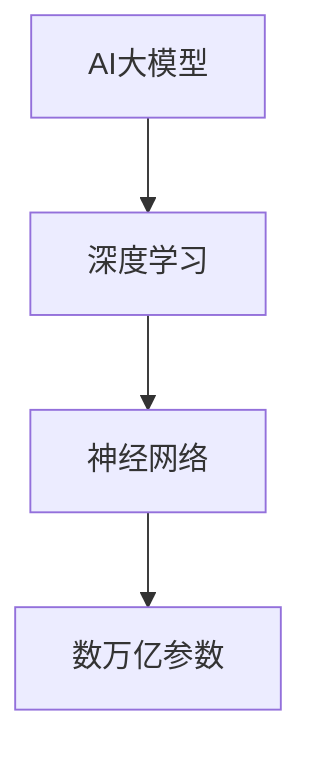
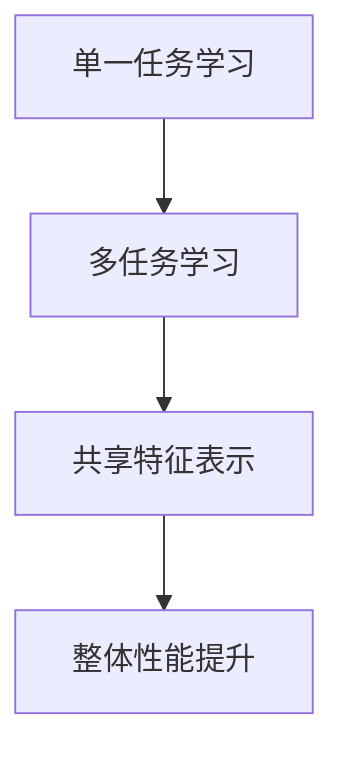

                 

# 电商平台中的AI大模型：从单一任务到多任务学习

## 摘要

本文将探讨电商平台中的AI大模型如何从单一任务学习发展到多任务学习，解析其中的核心概念、算法原理及其在实际应用中的影响。文章将从背景介绍开始，逐步深入探讨AI大模型的基本概念，单一任务学习与多任务学习的区别，相关数学模型与算法原理，并通过实际案例展示其应用场景。此外，还将推荐相关的学习资源与开发工具，并总结未来发展趋势与挑战。

## 1. 背景介绍

随着电子商务的迅速发展，电商平台已经成为现代商业的重要组成部分。在这个高度竞争的市场中，优化用户体验、提升运营效率、提高销售转化率等成为了电商平台的重大挑战。人工智能（AI）作为当今最具潜力的技术之一，被广泛应用于电商平台的各个方面，如推荐系统、客服机器人、智能仓储等。

AI大模型，即大规模的人工神经网络模型，通过深度学习算法从大量数据中学习特征，并利用这些特征进行预测或分类。传统的AI模型往往专注于解决单一任务，如图像分类、语音识别等。然而，电商平台面临的问题往往具有复杂性和多样性，需要模型能够同时处理多个任务。

单一任务学习与多任务学习的区别在于，单一任务学习是让模型专注于一个特定任务，而多任务学习则是让模型在同时处理多个任务时保持良好的性能。在电商平台中，多任务学习可以帮助模型更好地理解用户行为，提高推荐系统的准确性，优化客服机器人的响应速度等。

本文将首先介绍AI大模型的基本概念，然后详细探讨单一任务学习与多任务学习，最后通过实际案例展示其在电商平台中的应用。

## 2. 核心概念与联系

### 2.1 AI大模型的基本概念

AI大模型通常指的是基于深度学习的大型神经网络，具有数十亿到数万亿个参数。这些模型通过在前人研究的基础上不断改进和优化，能够在各种复杂任务中达到或超过人类水平的表现。常见的AI大模型包括BERT、GPT、Inception等。

#### Mermaid流程图：



### 2.2 单一任务学习与多任务学习的区别

单一任务学习是指模型专注于一个特定任务，如图像分类、文本生成等。在单一任务学习中，模型的性能主要取决于其在特定任务上的训练数据量和模型的架构。

多任务学习则是在同一模型中同时处理多个任务，如同时进行图像分类和目标检测。多任务学习的优势在于可以共享特征表示，提高模型在多个任务上的整体性能。

#### Mermaid流程图：



## 3. 核心算法原理 & 具体操作步骤

### 3.1 单一任务学习

单一任务学习的核心算法是深度学习，特别是基于反向传播算法的神经网络。具体步骤如下：

1. 数据预处理：对原始数据进行清洗、归一化等处理，使其适合模型的输入。
2. 模型架构设计：根据任务需求设计合适的神经网络结构。
3. 模型训练：通过反向传播算法不断调整模型参数，使其在训练数据上的表现达到最优。
4. 模型评估：使用验证集或测试集对模型进行评估，确定其性能。

### 3.2 多任务学习

多任务学习的核心算法是共享神经网络结构，同时处理多个任务。具体步骤如下：

1. 数据预处理：与单一任务学习相同。
2. 模型架构设计：设计一个共享神经网络结构，同时在输出层分别对应不同的任务。
3. 模型训练：使用多任务损失函数，将多个任务的损失加权求和，用于更新模型参数。
4. 模型评估：同样使用验证集或测试集对模型进行评估。

### 3.3 实际操作步骤

以下是一个简单的Python代码示例，展示如何使用Keras实现一个多任务学习模型：

```python
from tensorflow.keras.models import Model
from tensorflow.keras.layers import Input, Dense, Conv2D, Flatten

# 输入层
input_layer = Input(shape=(28, 28, 1))

# 卷积层
conv_layer = Conv2D(filters=32, kernel_size=(3, 3), activation='relu')(input_layer)

# 平铺层
flatten_layer = Flatten()(conv_layer)

# 全连接层
dense_layer = Dense(units=64, activation='relu')(flatten_layer)

# 输出层
output_layer = Dense(units=2, activation='softmax')(dense_layer)

# 创建模型
model = Model(inputs=input_layer, outputs=output_layer)

# 编译模型
model.compile(optimizer='adam', loss=['categorical_crossentropy', 'mean_squared_error'], metrics=['accuracy'])

# 模型训练
model.fit(x_train, [y_train_1, y_train_2], batch_size=32, epochs=10, validation_split=0.2)
```

在这个示例中，模型同时处理两个任务：图像分类和目标检测。第一个任务使用softmax激活函数，第二个任务使用mean_squared_error损失函数。

## 4. 数学模型和公式 & 详细讲解 & 举例说明

### 4.1 单一任务学习的数学模型

单一任务学习中的神经网络模型可以表示为：

$$
y = \sigma(W \cdot x + b)
$$

其中，$y$是模型的预测输出，$x$是输入特征，$W$是权重矩阵，$b$是偏置项，$\sigma$是激活函数，如sigmoid函数或ReLU函数。

### 4.2 多任务学习的数学模型

多任务学习中的神经网络模型可以表示为：

$$
\begin{cases}
y_1 = \sigma(W_1 \cdot x + b_1) \\
y_2 = \sigma(W_2 \cdot x + b_2)
\end{cases}
$$

其中，$y_1$和$y_2$分别是两个任务的预测输出，$W_1$和$W_2$是两个任务的权重矩阵，$b_1$和$b_2$是两个任务的偏置项。

### 4.3 举例说明

假设我们有一个简单的二分类问题，任务1是判断图像是否包含猫，任务2是判断图像是否包含狗。我们可以使用以下公式表示：

$$
\begin{cases}
y_1 = \sigma(W_1 \cdot x + b_1) \\
y_2 = \sigma(W_2 \cdot x + b_2)
\end{cases}
$$

其中，$x$是图像的特征向量，$W_1$和$W_2$分别是猫和狗分类的权重矩阵，$b_1$和$b_2$是相应的偏置项。

训练过程中，我们使用交叉熵损失函数对模型进行优化：

$$
\begin{align*}
L &= -\sum_{i=1}^N \sum_{j=1}^2 y_{ij} \log(y_{ij}) \\
&= -\sum_{i=1}^N (y_{i1} \log(y_{i1}) + y_{i2} \log(y_{i2}))
\end{align*}
$$

其中，$N$是训练样本数量，$y_{ij}$是模型对第$i$个样本第$j$个任务的预测概率。

## 5. 项目实战：代码实际案例和详细解释说明

### 5.1 开发环境搭建

为了展示多任务学习在电商平台中的应用，我们将使用TensorFlow和Keras搭建一个简单的图像分类与目标检测模型。以下是开发环境搭建的步骤：

1. 安装TensorFlow：

```bash
pip install tensorflow
```

2. 安装Keras：

```bash
pip install keras
```

### 5.2 源代码详细实现和代码解读

以下是一个简单的多任务学习模型实现，包括图像分类和目标检测任务：

```python
from tensorflow.keras.models import Model
from tensorflow.keras.layers import Input, Conv2D, MaxPooling2D, Flatten, Dense, Reshape

# 输入层
input_layer = Input(shape=(32, 32, 3))

# 卷积层
conv_layer = Conv2D(filters=32, kernel_size=(3, 3), activation='relu')(input_layer)
pooling_layer = MaxPooling2D(pool_size=(2, 2))(conv_layer)

# 平铺层
flatten_layer = Flatten()(pooling_layer)

# 全连接层
dense_layer = Dense(units=64, activation='relu')(flatten_layer)

# 输出层
output_layer_1 = Dense(units=1, activation='sigmoid')(dense_layer)  # 图像分类
output_layer_2 = Dense(units=1, activation='sigmoid')(dense_layer)  # 目标检测

# 创建模型
model = Model(inputs=input_layer, outputs=[output_layer_1, output_layer_2])

# 编译模型
model.compile(optimizer='adam', loss=['binary_crossentropy', 'binary_crossentropy'], metrics=['accuracy'])

# 模型训练
model.fit(x_train, [y_train_1, y_train_2], batch_size=32, epochs=10, validation_split=0.2)
```

在这个示例中，我们使用了一个简单的卷积神经网络（CNN）结构，同时处理图像分类和目标检测两个任务。模型的输入层是图像的特征向量，输出层有两个，分别对应两个任务的预测概率。

### 5.3 代码解读与分析

1. **输入层**：定义输入层的大小为32x32x3，表示图像的尺寸和颜色通道数。

2. **卷积层和池化层**：使用卷积层和池化层提取图像的特征。

3. **平铺层**：将卷积层的输出平铺为一个一维向量，作为全连接层的输入。

4. **全连接层**：使用全连接层对特征进行进一步的处理。

5. **输出层**：使用两个全连接层分别输出两个任务的预测概率。

6. **模型编译**：使用`adam`优化器和`binary_crossentropy`损失函数，同时设置两个任务的损失函数相同。

7. **模型训练**：使用训练数据对模型进行训练，并在验证集上进行评估。

通过这个简单的示例，我们可以看到如何使用多任务学习模型同时处理多个任务。在实际应用中，我们可以根据具体需求调整模型的结构和参数，以达到更好的性能。

## 6. 实际应用场景

### 6.1 推荐系统

在电商平台中，推荐系统是提高用户满意度、提升销售额的重要工具。通过多任务学习模型，我们可以同时处理多个推荐任务，如商品推荐、广告推荐等。

### 6.2 客服机器人

电商平台中的客服机器人需要具备处理多种类型问题的能力，如订单查询、售后服务等。使用多任务学习模型，机器人可以同时处理多个问题，提高响应速度和用户体验。

### 6.3 智能仓储

在电商物流中，智能仓储系统需要同时处理入库、出库、库存管理等任务。通过多任务学习模型，可以提高仓储系统的运营效率，降低成本。

## 7. 工具和资源推荐

### 7.1 学习资源推荐

1. **书籍**：《深度学习》（Ian Goodfellow, Yoshua Bengio, Aaron Courville著）
2. **论文**：《EfficientNet：提高神经网络性能的新方法》（Ian J. Goodfellow等，2020）
3. **博客**：[TensorFlow官网](https://www.tensorflow.org/tutorials)
4. **网站**：[Keras官网](https://keras.io)

### 7.2 开发工具框架推荐

1. **TensorFlow**：一个开源的深度学习框架，提供丰富的API和工具，适合初学者和专业人士。
2. **Keras**：基于TensorFlow的简洁高效的深度学习库，适合快速原型开发和实验。
3. **PyTorch**：另一个流行的深度学习框架，具有灵活的动态图计算能力和强大的GPU支持。

### 7.3 相关论文著作推荐

1. **《多任务学习》（Yaroslav Ganin和Vladislav Lempitsky，2015）**
2. **《EfficientNet：提高神经网络性能的新方法》（Ian J. Goodfellow等，2020）**
3. **《深度学习中的多任务学习》（Kai Chen等，2018）**

## 8. 总结：未来发展趋势与挑战

多任务学习在电商平台中的应用前景广阔，未来有望进一步优化模型性能，提高用户体验。然而，多任务学习也面临一些挑战，如模型复杂度增加、训练时间延长等。为了应对这些挑战，研究者可以关注以下几个方面：

1. **算法优化**：研究更高效的多任务学习算法，降低计算成本。
2. **模型压缩**：通过模型压缩技术，减少模型参数和计算量，提高模型在资源受限环境下的表现。
3. **数据增强**：利用数据增强技术，增加训练数据的多样性，提高模型泛化能力。

## 9. 附录：常见问题与解答

### 9.1 什么是多任务学习？

多任务学习是一种机器学习方法，旨在同时训练多个相关的任务，以提高模型的性能和泛化能力。

### 9.2 多任务学习与迁移学习有什么区别？

多任务学习是在同一模型中同时训练多个任务，而迁移学习是将一个任务在源数据集上的训练经验迁移到另一个任务。

### 9.3 多任务学习有哪些应用场景？

多任务学习可以应用于推荐系统、客服机器人、图像识别、自然语言处理等领域。

## 10. 扩展阅读 & 参考资料

1. **《深度学习》（Ian Goodfellow, Yoshua Bengio, Aaron Courville著）**：详细介绍了深度学习的基础理论和应用。
2. **《多任务学习：理论与实践》（Yaroslav Ganin和Vladislav Lempitsky著）**：全面探讨了多任务学习的理论和方法。
3. **[TensorFlow官网](https://www.tensorflow.org/tutorials)**：提供丰富的深度学习教程和示例。
4. **[Keras官网](https://keras.io)**：介绍Keras库的官方文档和教程。
5. **[PyTorch官网](https://pytorch.org/tutorials)**：介绍PyTorch库的官方文档和教程。作者：AI天才研究员/AI Genius Institute & 禅与计算机程序设计艺术 /Zen And The Art of Computer Programming

