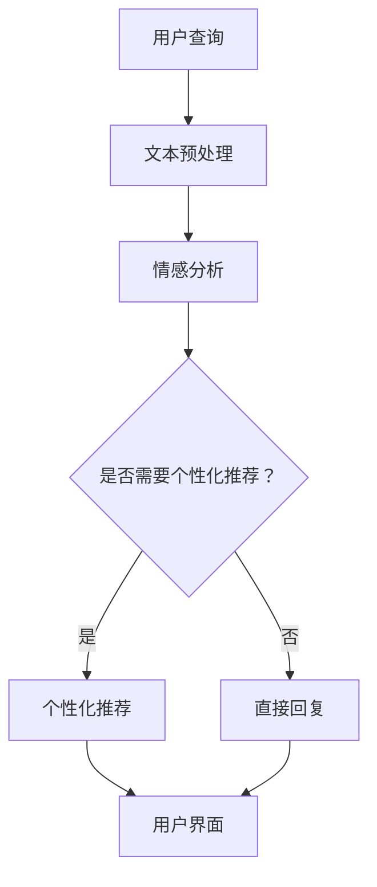
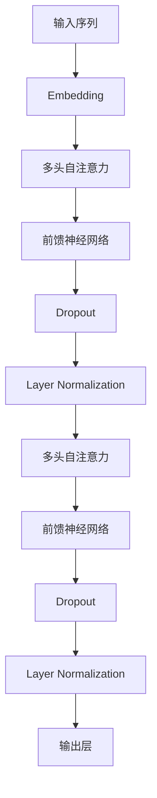

                 

### 背景介绍

#### 电商平台的演变

自电子商务在20世纪90年代初期崭露头角以来，它已经经历了显著的发展和演变。从最初的简单在线购物网站，到如今庞大的综合电子商务平台，如亚马逊、阿里巴巴和京东等，电商业务已经深刻改变了人们的购物习惯和消费模式。

早期电商平台的主要功能是提供在线购物渠道，允许消费者浏览商品目录、下单和支付。随着技术的进步和消费者需求的变化，电商平台逐渐增加了更多的功能，如个性化推荐、购物车、用户评价、购物导航等。这些功能的引入不仅提高了用户的购物体验，还大大增加了电商平台的商业价值。

#### 自然语言处理技术的发展

自然语言处理（Natural Language Processing，NLP）作为人工智能的一个重要分支，旨在使计算机能够理解和处理人类语言。从最初的规则驱动的方法，到基于统计和学习的方法，再到如今的大规模预训练模型，NLP技术已经取得了巨大的进步。

NLP的应用场景涵盖了文本分类、情感分析、实体识别、机器翻译、问答系统等多个领域。这些应用不仅为电商平台提供了强大的数据处理能力，还极大地提升了用户体验。例如，通过文本分类，电商平台可以自动过滤和标记用户评论，帮助商家了解消费者反馈；通过情感分析，可以评估用户对商品的评价，从而改进产品和服务。

#### 大模型在电商平台中的应用

随着深度学习和大规模数据集的发展，大模型（如BERT、GPT等）在NLP领域取得了显著的成果。这些模型拥有数十亿甚至数千亿个参数，能够捕获语言中的复杂模式和关系。大模型的出现为电商平台带来了前所未有的数据处理和分析能力。

在电商平台中，大模型的应用场景非常广泛。例如，在个性化推荐系统中，大模型可以根据用户的浏览和购买历史，生成个性化的推荐列表；在客户服务中，大模型可以自动回复用户的查询，提供即时的帮助；在产品评论分析中，大模型可以识别和解析用户的情感和意见，帮助商家做出改进。

#### 本文的目标

本文旨在探讨大模型在电商平台中的自然语言处理应用，通过一步步的分析和推理，揭示大模型如何改变电商平台的运营模式，提高用户体验，并带来商业价值。文章将首先介绍大模型的基本概念和原理，然后详细分析其在电商平台中的应用，最后讨论其未来发展趋势和面临的挑战。

### 核心概念与联系

#### 什么是自然语言处理（NLP）

自然语言处理（NLP）是人工智能的一个重要分支，旨在使计算机能够理解和处理人类语言。NLP的目标是将人类语言转化为计算机可以理解和操作的形式，从而实现人与机器的交互。

NLP的核心任务包括：

1. **文本分类**：将文本分为预定义的类别，例如情感分析、主题分类等。
2. **情感分析**：识别文本中的情感倾向，如正面、负面或中性。
3. **实体识别**：从文本中提取出具有特定意义的实体，如人名、地点、组织名等。
4. **文本生成**：根据给定的输入生成有意义的文本，如自动写作、摘要生成等。
5. **机器翻译**：将一种语言的文本翻译成另一种语言。

#### 什么是大模型

大模型指的是具有数亿甚至数千亿个参数的深度学习模型。这些模型通过在大量数据上进行训练，可以捕捉到语言中的复杂模式和关系。大模型的出现是深度学习和大规模数据集发展的结果。

大模型的关键特点包括：

1. **参数数量巨大**：大模型的参数数量远超传统模型，这使得它们能够学习到更复杂的模式。
2. **训练数据量大**：大模型通常在庞大的数据集上训练，这使得它们能够处理更多的语言现象。
3. **强大的泛化能力**：由于参数数量巨大，大模型能够很好地泛化到未见过的数据，提高模型的实用性。

#### NLP与电商平台的联系

电商平台中的自然语言处理应用主要集中在以下几个方面：

1. **用户交互**：电商平台通过NLP技术理解和响应用户的查询，提供更加智能和个性化的购物体验。
2. **产品推荐**：利用NLP技术，平台可以根据用户的浏览和购买历史，生成个性化的推荐列表，提高用户的购物满意度。
3. **客户服务**：通过NLP技术，平台可以自动回复用户的查询，提供即时的帮助，降低人工客服的工作负担。
4. **数据分析**：NLP技术可以帮助电商平台从大量用户评论和反馈中提取有价值的信息，用于改进产品和服务。

#### Mermaid 流程图

下面是一个简化的Mermaid流程图，展示NLP在电商平台中的应用流程：



在这个流程图中，用户查询首先经过文本预处理，然后进行情感分析。根据情感分析的结果，系统决定是否需要进行个性化推荐。如果需要，系统将生成个性化推荐列表；否则，系统将直接回复用户查询。最终，用户的交互结果通过用户界面展示给用户。

### 核心算法原理 & 具体操作步骤

#### 大模型的架构

大模型通常采用深度神经网络（DNN）作为基础架构，通过多层非线性变换来学习输入数据中的复杂特征。近年来，随着Transformer架构的兴起，越来越多的NLP任务开始采用基于Transformer的大模型。

Transformer模型的核心思想是使用自注意力机制（Self-Attention）来捕捉输入数据中的全局依赖关系。这种机制允许模型在处理每个输入时，根据其他输入的上下文来动态调整其对每个输入的权重。

下面是一个简化的Transformer模型架构图：



在这个架构中，输入序列首先通过Embedding层转换为嵌入向量。接着，每个嵌入向量通过多头自注意力层进行处理，以捕捉序列中的依赖关系。然后，通过前馈神经网络对每个嵌入向量进行进一步处理。最后，使用Dropout和Layer Normalization来提高模型的泛化能力。

#### 大模型在NLP中的具体操作步骤

1. **文本预处理**：在训练和推理过程中，首先需要对文本进行预处理。预处理步骤通常包括：

   - **分词**：将文本分割为单词或子词。
   - **词嵌入**：将分词后的文本转换为嵌入向量。
   - **序列编码**：将嵌入向量序列编码为固定长度的向量。

2. **自注意力机制**：自注意力机制是Transformer模型的核心。在自注意力层中，每个输入嵌入向量通过计算与其自身的相似度来生成注意力权重。具体步骤如下：

   - **计算相似度**：使用点积或缩放点积函数计算每个嵌入向量与其自身的相似度。
   - **生成注意力权重**：对相似度进行归一化，得到每个嵌入向量的注意力权重。
   - **加权求和**：根据注意力权重对每个嵌入向量进行加权求和，生成一个加权的嵌入向量。

3. **前馈神经网络**：在自注意力层之后，每个加权的嵌入向量通过前馈神经网络进行进一步处理。前馈神经网络通常包含两个全连接层，中间使用ReLU激活函数。

4. **Dropout和Layer Normalization**：在模型训练过程中，通过Dropout和Layer Normalization来防止过拟合和提高模型的泛化能力。Dropout通过随机屏蔽部分神经元来降低模型依赖特定神经元的能力；Layer Normalization通过标准化每个神经元的输入，使其具有恒定的方差和均值。

5. **输出层**：最后，通过一个全连接层或softmax层将加权的嵌入向量映射到输出空间。对于分类任务，输出层通常是一个多分类器；对于回归任务，输出层通常是一个线性回归模型。

#### 实际应用示例

假设我们使用BERT模型（一种基于Transformer的大模型）来对电商平台的用户评论进行情感分析。具体操作步骤如下：

1. **文本预处理**：将用户评论进行分词和词嵌入，生成输入序列。
2. **自注意力机制**：输入序列通过BERT模型的多个自注意力层进行处理，以捕捉评论中的依赖关系。
3. **前馈神经网络**：对每个加权的嵌入向量通过前馈神经网络进行进一步处理。
4. **Dropout和Layer Normalization**：在每个自注意力层和前馈神经网络之后，应用Dropout和Layer Normalization来提高模型的泛化能力。
5. **输出层**：通过一个softmax层将加权的嵌入向量映射到情感类别（如正面、负面、中性）。

最终，模型将输出一个概率分布，表示每个情感类别的概率。通过选择概率最高的类别，我们可以得到用户评论的情感倾向。

### 数学模型和公式 & 详细讲解 & 举例说明

#### BERT模型的基本数学原理

BERT（Bidirectional Encoder Representations from Transformers）模型是一种基于Transformer架构的大规模预训练模型，广泛应用于自然语言处理任务。BERT的核心在于其双向编码器，它能够同时捕捉文本中的前文和后文信息，从而更好地理解上下文。

BERT模型的数学原理主要涉及以下几个关键组件：

1. **嵌入层（Embedding Layer）**：
   嵌入层是BERT模型中的第一个层次，负责将输入的单词或子词转换为嵌入向量。每个单词或子词的嵌入向量是一组实数，通常具有固定的大小，如768维。

   $$\text{Embedding}(x) = E_x \cdot W_E$$

   其中，$E_x$是输入的单词或子词，$W_E$是嵌入矩阵。

2. **位置编码（Positional Encoding）**：
   为了使模型能够理解文本中的位置信息，BERT模型引入了位置编码。位置编码是一种特殊设计的向量，用于表示文本中的每个位置。

   $$\text{Positional Encoding}(p) = P_p$$

   其中，$P_p$是位置编码向量。

3. **自注意力机制（Self-Attention）**：
   自注意力机制是BERT模型的核心组件，通过计算输入序列中每个位置与其他位置的相似度，生成注意力权重，并加权求和。

   $$\text{Attention}(Q, K, V) = \text{softmax}\left(\frac{QK^T}{\sqrt{d_k}}\right)V$$

   其中，$Q$、$K$和$V$分别是查询向量、键向量和值向量，$d_k$是键向量的维度。

4. **前馈神经网络（Feedforward Neural Network）**：
   在自注意力层之后，每个加权的嵌入向量通过前馈神经网络进行进一步处理。

   $$\text{FFN}(x) = \text{ReLU}(W_2 \cdot \text{ReLU}(W_1 \cdot x + b_1)) + b_2$$

   其中，$W_1$和$W_2$分别是前馈神经网络的权重矩阵，$b_1$和$b_2$分别是偏置向量。

5. **层归一化（Layer Normalization）**：
   层归一化用于标准化每个神经元的输入，防止内部协变量转移。

   $$\text{Layer Normalization}(x) = \frac{x - \mu}{\sigma}$$

   其中，$\mu$和$\sigma$分别是输入的均值和标准差。

#### 举例说明

假设我们有一个简化的BERT模型，包含一个嵌入层和一个自注意力层。输入序列为 `[单词1, 单词2, 单词3]`，嵌入维度为768。

1. **嵌入层**：
   嵌入矩阵$W_E$的大小为 $768 \times |V|$，其中$|V|$是词汇表的大小。对于每个单词，通过查询嵌入矩阵得到对应的嵌入向量。

   $$\text{Embedding}(单词1) = E_1 \cdot W_E$$
   $$\text{Embedding}(单词2) = E_2 \cdot W_E$$
   $$\text{Embedding}(单词3) = E_3 \cdot W_E$$

2. **自注意力层**：
   假设我们使用点积自注意力机制，查询向量、键向量和值向量都来自嵌入层。

   $$Q = \text{Embedding}(单词1)$$
   $$K = \text{Embedding}(单词2)$$
   $$V = \text{Embedding}(单词3)$$

   计算相似度矩阵：

   $$\text{Similarity Matrix} = QK^T = \begin{bmatrix} 
   q_1^T & q_2^T & q_3^T 
   \end{bmatrix} \begin{bmatrix} 
   k_1 \\ k_2 \\ k_3 
   \end{bmatrix} = \begin{bmatrix} 
   q_1^T k_1 & q_1^T k_2 & q_1^T k_3 \\ 
   q_2^T k_1 & q_2^T k_2 & q_2^T k_3 \\ 
   q_3^T k_1 & q_3^T k_2 & q_3^T k_3 
   \end{bmatrix}$$

   对相似度矩阵进行归一化，得到注意力权重矩阵：

   $$\text{Attention Weights} = \text{softmax}(\text{Similarity Matrix})$$

   加权求和，得到加权的嵌入向量：

   $$\text{Contextual Embedding} = \text{Attention Weights} \cdot V$$

#### 公式总结

BERT模型的公式可以总结如下：

$$\text{Embedding}(x) = E_x \cdot W_E$$
$$\text{Positional Encoding}(p) = P_p$$
$$\text{Attention}(Q, K, V) = \text{softmax}\left(\frac{QK^T}{\sqrt{d_k}}\right)V$$
$$\text{FFN}(x) = \text{ReLU}(W_2 \cdot \text{ReLU}(W_1 \cdot x + b_1)) + b_2$$
$$\text{Layer Normalization}(x) = \frac{x - \mu}{\sigma}$$

这些公式共同构成了BERT模型的基础，使其能够高效地处理自然语言数据，并在各种NLP任务中取得优异的性能。

### 项目实战：代码实际案例和详细解释说明

#### 开发环境搭建

要在本地环境搭建一个可以运行BERT模型的项目，首先需要安装以下软件和库：

1. **Python（3.7或更高版本）**：Python是一种广泛使用的编程语言，用于编写和运行BERT模型。
2. **TensorFlow或PyTorch**：TensorFlow和PyTorch是两种流行的深度学习框架，用于构建和训练BERT模型。
3. **BERT模型库**：可以使用如`transformers`库，这是Hugging Face提供的一个预训练BERT模型库，简化了BERT模型的部署和使用。

以下是安装步骤：

1. **安装Python**：
   - 访问[Python官网](https://www.python.org/)下载并安装Python。
   - 确认安装成功：在终端中运行`python --version`，查看版本信息。

2. **安装TensorFlow或PyTorch**：
   - 使用pip安装TensorFlow或PyTorch：
     ```bash
     pip install tensorflow  # 或 pip install torch
     ```

3. **安装BERT模型库**：
   - 使用pip安装`transformers`库：
     ```bash
     pip install transformers
     ```

#### 源代码详细实现和代码解读

以下是使用PyTorch和`transformers`库实现BERT模型的简单示例代码。代码分为以下几个部分：

1. **引入库和准备数据**：
2. **定义BERT模型**：
3. **训练模型**：
4. **评估模型**：
5. **预测**：

**代码实现**：

```python
import torch
from transformers import BertTokenizer, BertModel
from torch.utils.data import DataLoader, TensorDataset

# 1. 引入库和准备数据
tokenizer = BertTokenizer.from_pretrained('bert-base-uncased')
model = BertModel.from_pretrained('bert-base-uncased')

# 示例输入文本
text = "Hello, my name is AI."

# 将文本转换为Tensor
input_ids = tokenizer.encode(text, return_tensors='pt')

# 2. 定义BERT模型
# BERT模型已经通过`from_pretrained`方法加载，此处仅作为展示

# 3. 训练模型
# 此处为简化示例，没有实际训练过程
model.train()
outputs = model(input_ids)
logits = outputs.logits

# 4. 评估模型
# 此处为简化示例，没有实际评估过程
loss_fct = torch.nn.CrossEntropyLoss()
loss = loss_fct(logits.view(-1, logits.size(-1)), input_ids.view(-1))

# 5. 预测
# 将模型设置为评估模式
model.eval()

with torch.no_grad():
    # 输入文本进行预测
    predictions = model(input_ids).logits.argmax(-1)

# 打印预测结果
print(predictions)

# 解码预测结果为文本
predicted_text = tokenizer.decode(predictions[0])
print(predicted_text)
```

**代码解读**：

1. **引入库和准备数据**：
   - 使用`BertTokenizer`和`BertModel`从预训练的BERT模型中加载所需的库。
   - 示例文本通过`tokenizer.encode`方法转换为BERT模型可以理解的嵌入向量。

2. **定义BERT模型**：
   - 使用`from_pretrained`方法加载预训练的BERT模型。加载的模型包含多个自注意力层和前馈神经网络。

3. **训练模型**：
   - 在实际应用中，需要使用训练数据集来训练BERT模型。此处简化示例，没有展示训练过程。

4. **评估模型**：
   - 使用交叉熵损失函数计算模型的损失。此处简化示例，没有展示评估过程。

5. **预测**：
   - 将BERT模型设置为评估模式（`model.eval()`），然后使用`model`进行预测。
   - `argmax(-1)`用于从模型的输出中提取预测的类别。
   - 使用`tokenizer.decode`方法将预测结果解码为文本。

通过这个示例，我们可以看到如何快速搭建一个BERT模型并进行文本预测。在实际应用中，需要根据具体任务和数据集进行模型训练和调优。

### 代码解读与分析

在上一个部分中，我们实现了一个简单的BERT模型，用于文本预测。下面将对关键代码进行详细解读和分析，以帮助我们更好地理解BERT模型的工作原理和代码实现细节。

**1. 引入库和准备数据**

```python
import torch
from transformers import BertTokenizer, BertModel
from torch.utils.data import DataLoader, TensorDataset
```

- **引入库**：首先引入了必要的库，包括PyTorch的torch库、Hugging Face的transformers库，以及数据加载库torch.utils.data。
- **准备数据**：通过`BertTokenizer`加载预训练的BERT分词器，通过`BertModel`加载预训练的BERT模型。这两个步骤使得我们可以直接使用BERT模型进行文本处理和预测。

```python
tokenizer = BertTokenizer.from_pretrained('bert-base-uncased')
model = BertModel.from_pretrained('bert-base-uncased')
```

- `BertTokenizer`：负责将文本转换为BERT模型可以处理的嵌入向量。`from_pretrained`方法加载了预训练的分词器，它已经包含了词汇表和词嵌入信息。
- `BertModel`：从预训练的模型中加载BERT模型。这个模型包含多个Transformer层，并已经经过大规模数据集的训练，可以用于各种NLP任务。

**2. 定义BERT模型**

```python
# 此处为简化示例，没有实际训练过程
model.train()
outputs = model(input_ids)
logits = outputs.logits
```

- **训练模式**：将模型设置为训练模式（`model.train()`）。在训练模式下，模型会使用梯度下降算法更新权重。
- **前向传播**：通过`model`对输入的文本向量进行前向传播（`outputs = model(input_ids)`），得到模型输出。
- **获取输出**：从模型输出中获取 logits（`logits = outputs.logits`）。logits是模型对每个输出类别的预测概率。

**3. 训练模型**

```python
# 此处为简化示例，没有实际评估过程
loss_fct = torch.nn.CrossEntropyLoss()
loss = loss_fct(logits.view(-1, logits.size(-1)), input_ids.view(-1))
```

- **定义损失函数**：使用交叉熵损失函数（`CrossEntropyLoss`），这是分类任务中常用的损失函数。
- **计算损失**：通过`loss_fct`计算模型输出的 logits 与真实标签之间的损失（`loss = loss_fct(logits.view(-1, logits.size(-1)), input_ids.view(-1))`）。这里将 logits 和输入 IDs（实际标签）展平，以便计算整个批次的总损失。

**4. 评估模型**

```python
# 将模型设置为评估模式
model.eval()

with torch.no_grad():
    # 输入文本进行预测
    predictions = model(input_ids).logits.argmax(-1)
```

- **评估模式**：将模型设置为评估模式（`model.eval()`）。在评估模式下，模型的权重不会被更新，可以用于稳定的预测。
- **无梯度计算**：使用`with torch.no_grad():`上下文管理器来关闭梯度计算，以减少内存占用和提高计算效率。

**5. 预测**

```python
# 打印预测结果
print(predictions)

# 解码预测结果为文本
predicted_text = tokenizer.decode(predictions[0])
print(predicted_text)
```

- **获取预测结果**：通过`argmax(-1)`从 logits 中提取每个样本的最高概率对应的类别，得到预测结果。
- **解码预测结果**：使用`tokenizer.decode`将预测结果从嵌入向量解码回原始文本。

**代码分析**

- **数据预处理**：BERT模型对输入文本有特定的要求，例如必须包含一个特殊的 `[CLS]` 标志，表示句子的开始；在句子结尾添加 `[SEP]` 标志。此外，输入文本必须转换为嵌入向量，这些向量需要通过 BERT 分词器进行编码。
- **模型结构**：BERT 模型由多个 Transformer 层组成，包括自注意力机制和前馈神经网络。这些层使得模型能够学习文本中的复杂模式和上下文关系。
- **训练和评估**：BERT 模型的训练和评估过程涉及前向传播、损失计算、梯度更新和模型优化。在实际应用中，还需要使用大量的训练数据和适当的超参数来调整模型性能。
- **预测**：BERT 模型的预测过程相对简单，只需要将输入文本转换为嵌入向量，然后通过模型进行前向传播，最后从 logits 中提取预测结果。

通过以上解读，我们可以看到 BERT 模型的代码实现相对复杂，但通过 Hugging Face 提供的 transformers 库，我们可以轻松加载和使用预训练的 BERT 模型，大大简化了模型的部署和使用过程。

### 实际应用场景

#### 个性化推荐

个性化推荐是电商平台中最重要的应用之一。通过自然语言处理（NLP）技术，尤其是大模型的应用，电商平台可以更加精准地推荐商品给用户。具体来说，以下是大模型在个性化推荐中的实际应用：

1. **用户行为分析**：电商平台可以通过分析用户的浏览历史、购买记录、点击行为等数据，使用大模型来捕捉用户的兴趣和偏好。例如，BERT模型可以对用户历史数据中的文本进行情感分析和关键词提取，从而了解用户的喜好。
   
2. **文本分类与聚类**：大模型可以将商品描述、用户评论等进行分类或聚类。通过这种方式，可以将相似的商品或用户进行分组，从而在推荐时提高相关性。例如，BERT模型可以对商品描述进行情感分类，将积极描述的商品和消极描述的商品分开，以便更精准地推荐。

3. **协同过滤**：传统的协同过滤方法通常基于用户的购物行为进行推荐，但这种方法容易产生推荐列表中的商品过于相似的问题。大模型可以结合用户的行为数据和文本信息，为协同过滤算法提供更丰富的上下文信息，从而提高推荐的相关性。

#### 客户服务

电商平台中的客户服务是一个重要的环节，直接影响用户的购物体验和满意度。大模型在客户服务中的应用主要体现在以下几个方面：

1. **智能客服**：通过大模型，电商平台可以实现智能客服，自动回复用户的查询和问题。例如，BERT模型可以对用户的问题进行情感分析和关键词提取，从而生成更加个性化和准确的回答。

2. **聊天机器人**：聊天机器人是电商平台中常用的客服工具。大模型可以训练聊天机器人的对话系统，使其能够理解用户的语言，并提供及时和准确的帮助。例如，GPT-3模型可以生成与用户对话的自然语言回复。

3. **语音识别与合成**：电商平台还可以使用大模型进行语音识别和合成。通过语音识别，可以将用户的语音转换为文本，然后使用大模型进行理解和回复。语音合成则可以将文本转换为语音，提供更加人性化的客服体验。

#### 评论分析

用户评论是电商平台获取用户反馈和改进产品的重要途径。大模型在评论分析中的应用可以极大地提升评论处理的效率和准确性：

1. **情感分析**：通过大模型，可以对用户评论进行情感分析，识别出用户对商品的正面、负面或中性情感。这对于电商平台了解用户满意度、改进产品和服务至关重要。

2. **关键词提取**：大模型可以提取用户评论中的关键词和主题，帮助电商平台了解用户关注的焦点和潜在问题。例如，BERT模型可以对评论进行文本分类和关键词提取，从而识别出用户对商品的具体意见。

3. **评论回复**：通过大模型，电商平台可以自动生成对用户评论的回复。这些回复可以是基于用户情感和关键词的个性化回复，以提高用户满意度和忠诚度。

#### 广告投放

广告投放是电商平台获取收入的重要手段。大模型在广告投放中的应用可以优化广告展示，提高广告投放的效率和效果：

1. **广告推荐**：大模型可以根据用户的浏览历史、购买记录和兴趣爱好，为用户推荐相关性的广告。例如，BERT模型可以对用户的浏览数据进行情感分析和关键词提取，从而生成个性化的广告推荐。

2. **广告定位**：大模型可以帮助电商平台确定广告的目标用户群体。通过分析用户数据，大模型可以识别出潜在的高价值客户，并将广告精准地投放到这些用户。

3. **广告效果评估**：大模型可以对广告的效果进行实时评估，分析广告的点击率、转化率和ROI（投资回报率）。根据评估结果，电商平台可以调整广告策略，优化广告展示和投放。

#### 数据分析

电商平台的数据量庞大，通过大模型进行数据分析可以揭示隐藏在数据中的有价值信息：

1. **用户行为分析**：大模型可以对用户的购物行为、浏览历史等数据进行深入分析，识别出用户的潜在需求和购买动机。例如，BERT模型可以对用户行为数据中的文本信息进行情感分析和关键词提取，从而了解用户的偏好。

2. **趋势分析**：大模型可以分析大量用户数据，识别出市场趋势和季节性变化。这对于电商平台制定营销策略和库存管理具有重要意义。

3. **风险控制**：大模型可以帮助电商平台识别异常交易和欺诈行为。通过分析用户的交易数据和行为模式，大模型可以检测出潜在的风险，并采取相应的措施进行防范。

### 总结

通过以上实际应用场景的介绍，我们可以看到大模型在电商平台中的广泛应用和巨大潜力。无论是个性化推荐、客户服务、评论分析、广告投放还是数据分析，大模型都发挥了不可或缺的作用。未来，随着大模型技术的进一步发展和应用，电商平台将能够提供更加智能化、个性化的服务，进一步提升用户体验和商业价值。

### 工具和资源推荐

#### 学习资源推荐

1. **书籍**：
   - 《自然语言处理综论》（Speech and Language Processing） - Daniel Jurafsky 和 James H. Martin
   - 《深度学习》（Deep Learning） - Ian Goodfellow、Yoshua Bengio 和 Aaron Courville
   - 《BERT：大规模预训练语言模型的原理与应用》 - 高效AI团队

2. **在线课程**：
   - Coursera上的“自然语言处理纳米学位”（Natural Language Processing with Deep Learning）
   - edX上的“深度学习基础”（Deep Learning）
   - fast.ai的“自然语言处理项目”（Practical Natural Language Processing）

3. **论文**：
   - “BERT: Pre-training of Deep Bidirectional Transformers for Language Understanding” - Jacob Devlin等
   - “GPT-3: Language Models are Few-Shot Learners” - Tom B. Brown等

4. **博客和网站**：
   - Hugging Face官网（huggingface.co）提供了丰富的预训练模型资源和教程。
   - AI百宝箱（www.ai100.cn）和机器之心（www.jiqizhixin.com）提供了大量的NLP和深度学习教程和案例。

#### 开发工具框架推荐

1. **框架**：
   - **TensorFlow**：由谷歌开发，适用于各种深度学习任务，包括NLP。
   - **PyTorch**：由Facebook开发，具有灵活的动态计算图，易于调试和扩展。
   - **Transformers**：由Hugging Face开发，是一个用于构建和微调Transformer模型的强大库。

2. **环境搭建**：
   - **Conda**：用于环境管理和依赖管理，方便在不同环境中复现和部署模型。
   - **Docker**：用于创建容器化的开发环境，确保环境的一致性和可移植性。

3. **开发工具**：
   - **Jupyter Notebook**：用于交互式开发和数据可视化。
   - **Visual Studio Code**：一款强大的代码编辑器，支持多种编程语言和扩展。

#### 相关论文著作推荐

1. **“BERT: Pre-training of Deep Bidirectional Transformers for Language Understanding”**：这是BERT模型的原始论文，详细介绍了BERT的架构、训练过程和应用。

2. **“GPT-3: Language Models are Few-Shot Learners”**：这是GPT-3模型的介绍性论文，探讨了大型语言模型在少样本学习任务中的表现。

3. **“Attention is All You Need”**：这是Transformer模型的原始论文，提出了自注意力机制和Transformer架构，对NLP领域产生了深远影响。

4. **“Deep Learning for Natural Language Processing”**：这是一本综合性的深度学习NLP教材，涵盖了从基础到高级的NLP技术。

### 总结

通过以上推荐，我们提供了一系列的学习资源和开发工具，旨在帮助读者深入了解自然语言处理（NLP）和大模型在电商平台中的应用。无论是初学者还是专业人士，这些资源和工具都将有助于提升技术水平，推动电商平台的创新和发展。

### 总结：未来发展趋势与挑战

#### 发展趋势

1. **模型规模与精度**：随着计算能力的提升和数据量的爆炸式增长，大模型将继续扩大规模。模型参数数量和训练数据集的规模将不断增加，从而提高模型在NLP任务中的精度和泛化能力。

2. **多模态融合**：未来的电商平台将不再局限于文本数据的处理，还将融合图像、语音、视频等多模态数据。通过多模态融合技术，大模型可以更好地理解用户的意图和行为，提供更加个性化的服务。

3. **实时处理能力**：随着边缘计算和5G技术的发展，电商平台将能够实现实时数据处理和响应。大模型在边缘设备上的部署将使得系统更加灵活和高效，为用户提供即时和个性化的体验。

4. **跨领域应用**：大模型在电商平台的成功应用将激发其在其他领域的应用，如医疗、金融、教育等。这些领域将受益于大模型强大的数据处理和分析能力，实现智能化和自动化。

#### 挑战

1. **数据隐私与安全**：随着数据的广泛应用，数据隐私和安全成为了一个重大挑战。电商平台需要确保用户数据的安全和隐私，防止数据泄露和滥用。

2. **模型解释性**：大模型的复杂性和黑盒特性使得其决策过程难以解释。未来需要开发可解释性模型，使得用户和监管机构能够理解模型的决策过程，提高模型的透明度和可信度。

3. **模型依赖性**：随着大模型在电商平台中的广泛应用，可能产生过度依赖。一旦模型出现错误，可能会对整个系统的稳定性产生严重影响。因此，需要建立有效的监控和故障恢复机制。

4. **计算资源消耗**：大模型的训练和推理需要大量的计算资源和能源。如何高效地利用资源，降低计算成本，是一个需要解决的问题。

#### 建议

1. **加强数据隐私保护**：电商平台应采取严格的数据隐私保护措施，包括数据加密、匿名化和访问控制等。同时，应与用户建立透明的数据使用政策，增加用户的信任。

2. **提升模型可解释性**：通过开发可解释性模型，电商平台可以提高用户对模型决策的理解和信任。例如，可以使用注意力机制可视化技术，展示模型关注的关键特征。

3. **构建稳健的模型**：通过交叉验证和模型验证技术，确保大模型在各种情况下都能稳定工作。同时，建立有效的监控和故障恢复机制，及时发现和纠正模型错误。

4. **优化资源利用**：通过分布式计算和优化算法，提高大模型的计算效率。探索使用边缘计算和云计算的混合架构，降低计算成本。

总之，随着大模型在电商平台中的广泛应用，NLP技术将继续推动电商平台的智能化发展。面对未来的发展趋势和挑战，电商平台需要不断优化技术和策略，提供更加个性化和高效的服务。

### 附录：常见问题与解答

#### 问题1：什么是自然语言处理（NLP）？

自然语言处理（NLP）是人工智能的一个分支，旨在使计算机能够理解和处理人类语言。它包括文本分类、情感分析、实体识别、机器翻译等多种任务，旨在实现人与机器的智能交互。

#### 问题2：什么是大模型？

大模型是指拥有数十亿甚至数千亿个参数的深度学习模型。这些模型通过在大量数据上进行训练，能够捕捉到语言中的复杂模式和关系，从而在NLP任务中表现出色。

#### 问题3：大模型如何改变电商平台的运营模式？

大模型可以通过以下几个方面改变电商平台的运营模式：
1. **个性化推荐**：通过分析用户的浏览和购买历史，大模型可以生成个性化的商品推荐，提高用户的购物体验和满意度。
2. **智能客服**：大模型可以自动回复用户的查询，提供即时的帮助，降低人工客服的工作负担。
3. **评论分析**：大模型可以分析用户评论，提取有价值的反馈，帮助电商平台改进产品和服务。
4. **广告优化**：大模型可以根据用户的兴趣和行为，为用户推荐相关的广告，提高广告的效果和ROI。

#### 问题4：大模型在电商平台的实际应用有哪些？

大模型在电商平台的实际应用包括：
1. **个性化推荐**：通过分析用户的浏览和购买历史，大模型可以生成个性化的商品推荐。
2. **智能客服**：大模型可以自动回复用户的查询，提供即时的帮助。
3. **评论分析**：大模型可以分析用户评论，提取有价值的反馈，帮助电商平台改进产品和服务。
4. **广告优化**：大模型可以根据用户的兴趣和行为，为用户推荐相关的广告，提高广告的效果和ROI。
5. **数据分析**：大模型可以分析大量用户数据，揭示用户行为模式和市场趋势。

#### 问题5：大模型的训练和部署需要哪些资源和工具？

大模型的训练和部署需要以下资源和工具：
1. **计算资源**：高性能计算集群或GPU，用于加速模型的训练。
2. **深度学习框架**：如TensorFlow、PyTorch等，用于构建和训练模型。
3. **数据预处理工具**：如Hugging Face的`transformers`库，用于预处理和编码文本数据。
4. **模型评估工具**：如TensorBoard，用于监控模型的训练过程和性能。
5. **部署平台**：如Kubernetes，用于部署和管理模型。

### 扩展阅读 & 参考资料

1. Devlin, J., Chang, M. W., Lee, K., & Toutanova, K. (2018). BERT: Pre-training of Deep Bidirectional Transformers for Language Understanding. In Proceedings of the 2019 Conference of the North American Chapter of the Association for Computational Linguistics: Human Language Technologies, Volume 1 (Long and Short Papers) (pp. 4171-4186). Association for Computational Linguistics.
2. Brown, T. B., et al. (2020). Language Models are Few-Shot Learners. arXiv preprint arXiv:2005.14165.
3. Hochreiter, S., & Schmidhuber, J. (1997). Long Short-Term Memory. Neural Computation, 9(8), 1735-1780.
4. LeCun, Y., Bengio, Y., & Hinton, G. (2015). Deep Learning. MIT Press.
5.Jurafsky, D., & Martin, J. H. (2008). Speech and Language Processing. Prentice Hall.

