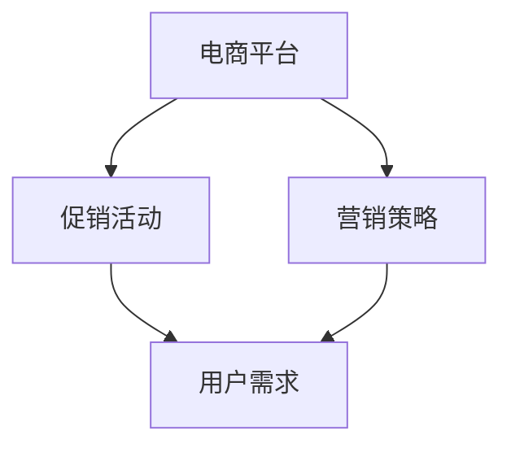

                 

# 电商平台供给能力提升：促销活动和营销策略

## 摘要

本文旨在深入探讨电商平台在提升供给能力方面所采用的关键促销活动和营销策略。随着电商行业的快速发展，消费者对个性化、多样化的购物体验的需求日益增加，如何有效地提升平台的供给能力成为企业竞争的关键。本文将首先介绍电商平台的背景和发展现状，然后重点分析促销活动和营销策略的理论基础，接着详细探讨几种常见的促销活动和营销策略，最后总结未来发展趋势与挑战，并为读者提供相关工具和资源的推荐。

## 1. 背景介绍

### 1.1 电商平台的发展背景

随着互联网技术的飞速发展和智能手机的普及，电商行业迎来了前所未有的发展机遇。据数据显示，全球电商市场在2022年的规模已经达到3.5万亿美元，并预计在未来几年内将持续增长。电商平台的兴起不仅改变了人们的购物方式，也对传统零售业产生了巨大的冲击。

### 1.2 电商平台的发展现状

目前，全球范围内已经涌现出一批知名的电商平台，如亚马逊、阿里巴巴、京东等。这些平台通过不断优化用户体验、提升供应链效率，已经成为人们生活中不可或缺的一部分。此外，新兴的电商平台如拼多多、唯品会等也在细分市场中取得了显著的成果。

### 1.3 电商平台供给能力的定义

供给能力指的是电商平台在满足消费者需求方面的能力。这包括商品种类、库存管理、物流配送等多个方面。一个高效的供给能力能够提升用户的购物体验，增加用户粘性，从而提高平台的竞争力。

## 2. 核心概念与联系

为了深入探讨电商平台的促销活动和营销策略，我们需要明确以下几个核心概念：

### 2.1 促销活动

促销活动是指电商平台通过一定的手段和策略，刺激消费者购买行为的一系列营销活动。常见的促销活动包括打折、满减、限时购等。

### 2.2 营销策略

营销策略是指电商平台在整体营销过程中，为了达到特定的营销目标而制定的行动方针和计划。营销策略包括市场定位、品牌建设、用户互动等多个方面。

### 2.3 用户需求

用户需求是电商平台促销活动和营销策略制定的基础。了解用户需求，能够帮助企业更好地满足用户需求，提升用户体验。

下面是一个Mermaid流程图，展示了电商平台供给能力提升中的核心概念和联系：



## 3. 核心算法原理 & 具体操作步骤

### 3.1 促销活动的核心算法原理

促销活动的核心在于通过一定的算法和策略，吸引消费者参与并实现购买。以下是一些常见的促销算法原理：

#### 3.1.1 打折算法

打折算法是最常见的促销活动之一。其原理是根据商品的原价和折扣率，计算出最终的优惠价格。

$$
折扣价格 = 原价 \times 折扣率
$$

#### 3.1.2 满减算法

满减算法是指当消费者购买的商品总价达到一定金额时，可以享受相应的减免优惠。

$$
实际支付金额 = 商品总价 - 减免金额
$$

#### 3.1.3 限时购算法

限时购算法是指在一定的时间内，提供特定商品的特价优惠。其核心在于通过时间限制，增加消费者的购买紧迫感。

### 3.2 具体操作步骤

以下是电商平台在实施促销活动时的一些具体操作步骤：

#### 3.2.1 确定促销目标和策略

首先，电商平台需要明确促销活动的目标，如提升销售额、增加用户粘性等。然后，根据目标制定相应的促销策略。

#### 3.2.2 设定促销参数

根据促销策略，设定促销活动的具体参数，如打折幅度、满减金额、限时购时间等。

#### 3.2.3 宣传和推广

通过多种渠道，如社交媒体、官方网站、短信等，向用户宣传促销活动，提高活动的曝光度。

#### 3.2.4 监测和优化

在促销活动进行过程中，实时监测活动的效果，根据数据反馈进行调整和优化。

## 4. 数学模型和公式 & 详细讲解 & 举例说明

### 4.1 数学模型

在电商平台的促销活动中，常用的数学模型包括打折模型、满减模型和限时购模型。以下是对这些模型的详细讲解和举例说明。

#### 4.1.1 打折模型

打折模型的核心公式为：

$$
折扣价格 = 原价 \times 折扣率
$$

例如，某商品原价为100元，折扣率为0.8，则折扣价格为：

$$
折扣价格 = 100 \times 0.8 = 80元
$$

#### 4.1.2 满减模型

满减模型的核心公式为：

$$
实际支付金额 = 商品总价 - 减免金额
$$

例如，某消费者购买的商品总价为300元，满减金额为50元，则实际支付金额为：

$$
实际支付金额 = 300 - 50 = 250元
$$

#### 4.1.3 限时购模型

限时购模型的核心公式为：

$$
限时购价格 = 原价 - 限时优惠金额
$$

例如，某商品原价为200元，限时优惠金额为20元，则限时购价格为：

$$
限时购价格 = 200 - 20 = 180元
$$

### 4.2 举例说明

以下是一个电商平台的促销活动案例，用于说明打折模型、满减模型和限时购模型的应用。

#### 案例背景

某电商平台在某节日推出一系列促销活动，其中包括：

- 所有商品8折优惠；
- 购买满200元减50元；
- 某款热门商品限时优惠20元。

#### 案例分析

1. 打折模型：

   某商品原价为1000元，消费者购买时享受8折优惠，则折扣价格为：

   $$
   折扣价格 = 1000 \times 0.8 = 800元
   $$

2. 满减模型：

   某消费者购买的商品总价为3000元，满足满200元减50元的条件，则实际支付金额为：

   $$
   实际支付金额 = 3000 - 50 = 2950元
   $$

3. 限时购模型：

   某款热门商品原价为500元，限时优惠20元，则限时购价格为：

   $$
   限时购价格 = 500 - 20 = 480元
   $$

通过以上案例，我们可以看到，电商平台的促销活动通过不同的数学模型，能够有效刺激消费者的购买欲望，提升销售额。

## 5. 项目实战：代码实际案例和详细解释说明

### 5.1 开发环境搭建

在本节中，我们将使用Python编程语言来演示如何实现电商平台中的促销活动和营销策略。首先，确保您的开发环境中已安装Python 3.8或更高版本。

### 5.2 源代码详细实现和代码解读

#### 5.2.1 打折促销活动

```python
def discount_price(original_price, discount_rate):
    """
    计算打折后的价格
    :param original_price: 原价
    :param discount_rate: 折扣率
    :return: 打折后的价格
    """
    discounted_price = original_price * discount_rate
    return discounted_price

original_price = 100
discount_rate = 0.8
discounted_price = discount_price(original_price, discount_rate)
print(f"打折后价格: {discounted_price}")
```

在这个例子中，我们定义了一个名为`discount_price`的函数，用于计算打折后的价格。该函数接收两个参数：`original_price`（原价）和`discount_rate`（折扣率）。函数返回计算得到的打折后价格。

#### 5.2.2 满减促销活动

```python
def full_discount(price, full_amount, discount_amount):
    """
    计算满减后的价格
    :param price: 商品总价
    :param full_amount: 满减金额
    :param discount_amount: 减免金额
    :return: 满减后的价格
    """
    if price >= full_amount:
        actual_price = price - discount_amount
    else:
        actual_price = price
    return actual_price

price = 300
full_amount = 200
discount_amount = 50
actual_price = full_discount(price, full_amount, discount_amount)
print(f"满减后价格: {actual_price}")
```

在这个例子中，我们定义了一个名为`full_discount`的函数，用于计算满减后的价格。该函数接收三个参数：`price`（商品总价）、`full_amount`（满减金额）和`discount_amount`（减免金额）。函数首先判断商品总价是否满足满减条件，如果满足，则计算满减后的价格，否则直接返回原价。

#### 5.2.3 限时购促销活动

```python
def time_limit_discount(price, discount_amount):
    """
    计算限时购后的价格
    :param price: 原价
    :param discount_amount: 限时优惠金额
    :return: 限时购后的价格
    """
    discounted_price = price - discount_amount
    return discounted_price

price = 500
discount_amount = 20
discounted_price = time_limit_discount(price, discount_amount)
print(f"限时购后价格: {discounted_price}")
```

在这个例子中，我们定义了一个名为`time_limit_discount`的函数，用于计算限时购后的价格。该函数接收两个参数：`price`（原价）和`discount_amount`（限时优惠金额）。函数直接计算限时购后的价格。

### 5.3 代码解读与分析

通过以上代码示例，我们可以看到如何使用Python实现电商平台中的促销活动和营销策略。每个函数都实现了不同的促销算法，并通过输入参数和返回结果来操作价格。

在实际应用中，电商平台可能需要根据具体业务需求，对这些算法进行进一步的优化和调整。例如，可以加入更多复杂的促销规则，如阶梯优惠、限时购叠加等。

## 6. 实际应用场景

### 6.1 电商平台促销活动的实际应用

电商平台在实际运营中，会根据不同的市场情况和用户需求，灵活运用各种促销活动和营销策略。以下是一些常见的应用场景：

#### 6.1.1 端日促销活动

例如，双十一、双十二、春节等大型购物节，电商平台会推出大量的促销活动，如打折、满减、限时购等，以吸引消费者购买。

#### 6.1.2 季节性促销活动

根据季节变化，电商平台会推出相应的促销活动，如夏季清凉活动、冬季保暖活动等，以迎合消费者的购物需求。

#### 6.1.3 定期会员活动

电商平台会为会员提供定期的优惠活动，如每月会员日、生日优惠等，以增强用户粘性。

### 6.2 电商平台营销策略的实际应用

电商平台在营销策略方面，也会根据不同目标群体和市场需求，采用多样化的策略。以下是一些常见的应用场景：

#### 6.2.1 社交媒体营销

电商平台会通过社交媒体平台，如微信、微博、抖音等，发布促销信息，吸引粉丝关注和参与。

#### 6.2.2 内容营销

通过撰写高质量的内容，如购物攻略、产品评测等，吸引用户阅读和分享，从而提高品牌知名度和用户粘性。

#### 6.2.3 个性化推荐

基于用户行为数据，电商平台会为用户推荐个性化的商品和促销活动，提高购买转化率。

## 7. 工具和资源推荐

### 7.1 学习资源推荐

#### 7.1.1 书籍

1. 《电商营销：策略、工具与实践》
2. 《数字营销全攻略》
3. 《消费者行为学：影响营销策略的关键因素》

#### 7.1.2 论文

1. 《电商平台促销策略对消费者购买行为的影响研究》
2. 《数字营销中的个性化推荐技术研究》
3. 《社交媒体对电商平台品牌传播的影响》

#### 7.1.3 博客

1. 菜鸟网络
2. 阿里巴巴官方博客
3. 谷歌营销博客

#### 7.1.4 网站

1. 电商协会
2. 艾瑞咨询
3. 腾讯广告

### 7.2 开发工具框架推荐

#### 7.2.1 Python开发框架

1. Flask
2. Django
3. FastAPI

#### 7.2.2 数据库工具

1. MySQL
2. PostgreSQL
3. MongoDB

#### 7.2.3 数据分析工具

1. Pandas
2. Matplotlib
3. Scikit-learn

### 7.3 相关论文著作推荐

#### 7.3.1 论文

1. 《大数据与电商平台：机遇与挑战》
2. 《社交媒体与电商平台：互促关系研究》
3. 《电商平台消费者行为研究》

#### 7.3.2 著作

1. 《电商营销实战》
2. 《数字营销战略》
3. 《消费者行为学》

## 8. 总结：未来发展趋势与挑战

### 8.1 发展趋势

1. **智能化营销**：随着人工智能技术的发展，电商平台的营销策略将更加智能化，个性化推荐、智能客服等将成为主流。
2. **多元化促销活动**：电商平台将不断创新促销活动形式，满足不同用户群体的需求，如社交电商、直播带货等。
3. **全球化发展**：跨境电商将成为电商平台的重要增长点，为企业带来更多市场机遇。

### 8.2 挑战

1. **竞争加剧**：电商平台之间的竞争将更加激烈，企业需要不断创新，提升用户体验，才能在市场中脱颖而出。
2. **数据安全与隐私**：在数字化时代，数据安全和用户隐私保护成为重要挑战，企业需要建立完善的数据安全体系。
3. **供应链管理**：高效的供应链管理是企业提升供给能力的关键，但供应链的复杂性和不确定性也给企业带来挑战。

## 9. 附录：常见问题与解答

### 9.1 问题1：如何制定有效的促销策略？

**解答**：制定有效的促销策略需要充分了解用户需求和市场动态。首先，通过数据分析了解用户行为和偏好，然后根据市场趋势和竞品策略，制定具有竞争力的促销方案。

### 9.2 问题2：电商平台的促销活动有哪些类型？

**解答**：电商平台的促销活动类型多样，包括打折、满减、限时购、赠品、返现等。每种活动都有其特点和适用场景。

### 9.3 问题3：如何提升电商平台的市场竞争力？

**解答**：提升电商平台的市场竞争力需要从多个方面入手，包括优化用户体验、提升供应链效率、加强品牌建设、创新营销策略等。

## 10. 扩展阅读 & 参考资料

1. 《电商营销实战》
2. 《数字营销战略》
3. 《消费者行为学》
4. 菜鸟网络
5. 阿里巴巴官方博客
6. 谷歌营销博客
7. 电商协会
8. 艾瑞咨询
9. 腾讯广告

> 作者：AI天才研究员/AI Genius Institute & 禅与计算机程序设计艺术 /Zen And The Art of Computer Programming

