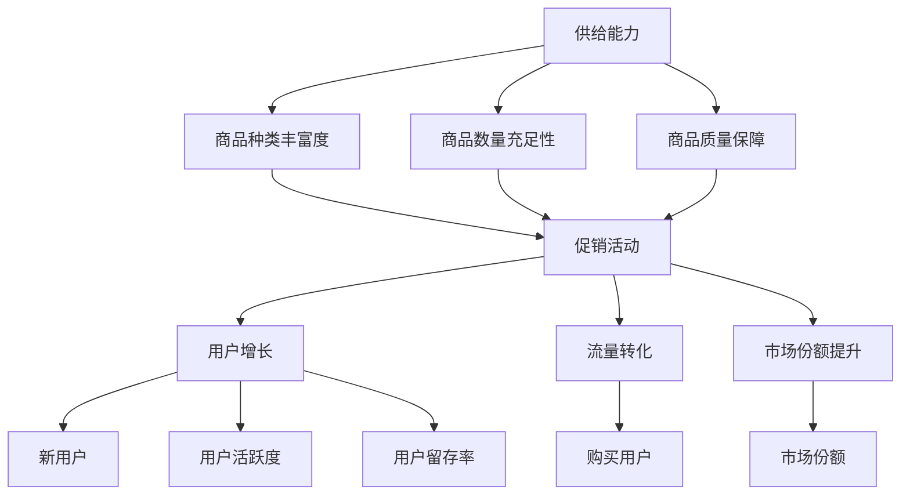

                 

# 电商平台供给能力提升：促销活动和营销策略

> 关键词：电商平台、供给能力、促销活动、营销策略、用户增长、数据分析、技术实现

> 摘要：本文深入探讨了电商平台提升供给能力的策略，重点分析了促销活动和营销策略在用户增长、流量转化和市场份额提升中的关键作用。通过具体案例分析和技术实现，本文为电商平台的运营提供了实用的指导和启示。

## 1. 背景介绍

在当前电子商务快速发展的背景下，电商平台的供给能力成为决定企业竞争力和市场份额的关键因素。供给能力不仅包括商品种类、数量和质量的保障，还涉及到用户流量、转化率和用户粘性的提升。有效的促销活动和精准的营销策略在提升供给能力、增加用户活跃度和促进销售额方面起到了至关重要的作用。

随着互联网技术的进步和大数据分析的应用，电商平台可以更加精准地了解用户需求和行为，从而制定出更具针对性的促销活动和营销策略。这不仅能够提高用户的购物体验，还能够有效提升平台的供给能力，为企业的长期发展奠定坚实基础。

本文将从以下几个方面展开讨论：首先介绍电商平台供给能力提升的核心概念和联系；然后深入分析核心算法原理和具体操作步骤；接着讲解数学模型和公式，并举例说明；随后分享实际项目实战中的代码案例和详细解释；最后探讨实际应用场景，推荐相关工具和资源，并总结未来发展趋势与挑战。

## 2. 核心概念与联系

在讨论电商平台供给能力提升之前，我们需要明确几个核心概念：

### 2.1 供给能力

供给能力是指电商平台能够为用户提供的商品种类、数量和质量的能力。它包括以下几个方面：

- 商品种类丰富度：电商平台需要提供多样化的商品种类，以满足不同用户的需求。
- 商品数量充足性：平台需要确保商品数量的充足，以避免库存不足导致的用户流失。
- 商品质量保障：电商平台需要确保商品的质量，提高用户的购物满意度。

### 2.2 促销活动

促销活动是电商平台提升供给能力的重要手段之一。通过优惠活动、限时折扣、满减等手段，电商平台可以刺激用户的购买欲望，提高流量和转化率。

### 2.3 营销策略

营销策略是指电商平台通过广告投放、社交媒体运营、SEO优化等手段，提高品牌知名度和用户粘性的方法。精准的营销策略能够帮助电商平台更好地吸引目标用户，提升供给能力。

### 2.4 用户增长

用户增长是电商平台发展的重要目标之一。通过有效的促销活动和营销策略，电商平台可以吸引新用户，提升用户活跃度和留存率。

### 2.5 流量转化

流量转化是指将访问电商平台的用户转化为购买用户的过程。高效的促销活动和精准的营销策略能够提高流量转化率，从而提升供给能力。

### 2.6 市场份额提升

市场份额提升是指电商平台在竞争激烈的市场中占据更大的份额。通过提升供给能力，电商平台可以提高用户满意度和忠诚度，从而增加市场份额。

下面是一个简单的 Mermaid 流程图，展示了这些核心概念之间的联系：



通过这个流程图，我们可以清晰地看到各个核心概念之间的联系，以及它们在提升电商平台供给能力中的作用。

## 3. 核心算法原理 & 具体操作步骤

在了解了核心概念和联系之后，我们需要深入探讨提升电商平台供给能力的核心算法原理和具体操作步骤。

### 3.1 数据分析

数据分析是提升电商平台供给能力的关键步骤之一。通过对用户行为数据、商品销售数据和市场趋势数据的分析，电商平台可以更准确地了解用户需求和市场动态，从而制定出更有效的促销活动和营销策略。

具体操作步骤如下：

1. **数据收集**：收集用户行为数据（如访问路径、购物车、浏览历史等）、商品销售数据（如销售额、库存量、品类分布等）和市场趋势数据（如竞争对手动态、市场热点等）。
2. **数据清洗**：对收集到的数据进行清洗，去除重复、错误和无意义的数据，确保数据的质量和完整性。
3. **数据存储**：将清洗后的数据存储到数据仓库中，以便后续的数据分析和处理。
4. **数据分析**：使用统计分析、数据挖掘和机器学习等技术，对数据进行分析，提取有价值的信息和洞察。

### 3.2 促销策略设计

基于数据分析的结果，电商平台可以设计出更有效的促销策略。以下是一些常见的促销策略：

1. **限时折扣**：在特定时间段内提供商品折扣，刺激用户购买。
2. **满减优惠**：购物金额达到一定金额后，提供折扣优惠。
3. **优惠券**：发放优惠券，用户在购物时可以抵扣一定金额。
4. **赠品活动**：购买指定商品时赠送其他商品或优惠券。

具体操作步骤如下：

1. **确定促销策略**：根据数据分析结果，确定适合的促销策略。
2. **制定促销计划**：制定详细的促销计划，包括促销时间、促销商品、促销力度等。
3. **活动宣传**：通过多种渠道（如网站、APP、社交媒体等）宣传促销活动，提高用户参与度。
4. **监控和调整**：在促销活动期间，实时监控活动效果，根据用户反馈和实际效果进行及时调整。

### 3.3 营销策略制定

营销策略的制定是提升电商平台供给能力的另一个关键步骤。以下是一些常见的营销策略：

1. **搜索引擎优化（SEO）**：通过优化网站内容和结构，提高在搜索引擎中的排名，吸引更多用户访问。
2. **社交媒体营销**：利用社交媒体平台（如微博、微信、抖音等）进行品牌推广和用户互动。
3. **内容营销**：通过发布有价值的内容（如博客、视频、图文等），提高品牌知名度和用户粘性。
4. **邮件营销**：通过发送电子邮件，向潜在和现有用户推广促销活动和产品信息。

具体操作步骤如下：

1. **确定营销目标**：根据电商平台的发展战略和用户需求，确定营销目标。
2. **制定营销计划**：制定详细的营销计划，包括营销渠道、营销内容、营销预算等。
3. **执行和推广**：按照营销计划执行营销活动，并通过多种渠道推广营销内容。
4. **监控和评估**：在营销活动期间，实时监控活动效果，根据用户反馈和实际效果进行及时调整。

### 3.4 用户增长策略

用户增长是电商平台发展的核心目标之一。以下是一些常见的用户增长策略：

1. **新用户优惠**：为首次购买的用户提供优惠，吸引新用户注册和购买。
2. **推荐奖励**：鼓励现有用户推荐新用户，通过奖励机制提高用户推荐率。
3. **社交媒体运营**：通过社交媒体平台运营，提高品牌知名度和用户参与度。
4. **线下活动**：举办线下活动，吸引潜在用户参与，提高品牌曝光度。

具体操作步骤如下：

1. **确定用户增长目标**：根据电商平台的发展战略和用户需求，确定用户增长目标。
2. **制定用户增长计划**：制定详细的用户增长计划，包括用户增长渠道、用户增长策略等。
3. **执行和推广**：按照用户增长计划执行用户增长活动，并通过多种渠道推广用户增长策略。
4. **监控和评估**：在用户增长活动期间，实时监控用户增长效果，根据用户反馈和实际效果进行及时调整。

通过以上核心算法原理和具体操作步骤，电商平台可以更有效地提升供给能力，提高用户满意度，从而在激烈的市场竞争中占据有利地位。

## 4. 数学模型和公式 & 详细讲解 & 举例说明

在提升电商平台供给能力的分析中，数学模型和公式发挥着重要作用。这些模型和公式可以帮助我们量化促销活动效果、预测用户行为和市场趋势，从而制定更加科学的营销策略。

### 4.1 销售预测模型

销售预测模型是电商平台制定促销活动和库存管理策略的重要工具。以下是一个简单的线性回归模型，用于预测商品的销售量。

#### 4.1.1 模型公式

$$
Sales(t) = \beta_0 + \beta_1 \times Discount(t) + \beta_2 \times Seasonality(t) + \epsilon(t)
$$

其中：
- \( Sales(t) \)：第 t 个月商品的销售量
- \( Discount(t) \)：第 t 个月商品的平均折扣率
- \( Seasonality(t) \)：第 t 个月的季节性因素，通常使用因子来表示（如节假日、促销季等）
- \( \beta_0 \)：常数项，表示无折扣和无季节性因素时的销售量
- \( \beta_1 \)：折扣率对销售量的影响程度
- \( \beta_2 \)：季节性因素对销售量的影响程度
- \( \epsilon(t) \)：随机误差项

#### 4.1.2 模型解释

该模型假设销售量与折扣率、季节性因素之间存在线性关系。通过训练历史数据，我们可以计算出模型参数 \(\beta_0\)、\(\beta_1\) 和 \(\beta_2\)，从而预测未来任意月份的销售量。

#### 4.1.3 案例说明

假设某电商平台在 2021 年 6 月份推出限时折扣活动，折扣率为 20%，同时 6 月份是电商行业的促销高峰期，季节性因素为 1.2。根据上述模型，我们可以预测 2021 年 6 月份的销售量为：

$$
Sales(6) = \beta_0 + \beta_1 \times 0.2 + \beta_2 \times 1.2
$$

### 4.2 用户留存模型

用户留存模型用于预测新用户的留存率，帮助电商平台评估营销策略的效果。以下是一个简单的逻辑回归模型，用于预测用户留存率。

#### 4.2.1 模型公式

$$
Retention(t) = \frac{1}{1 + e^{-(\beta_0 + \beta_1 \times Activity(t) + \beta_2 \times Time(t))}
$$

其中：
- \( Retention(t) \)：第 t 个月的新用户留存率
- \( Activity(t) \)：第 t 个月用户的活跃度，如登录次数、购物车添加次数等
- \( Time(t) \)：第 t 个月用户注册后已使用的天数
- \( \beta_0 \)：常数项
- \( \beta_1 \)：用户活跃度对留存率的影响程度
- \( \beta_2 \)：用户注册时间对留存率的影响程度

#### 4.2.2 模型解释

该模型假设用户留存率与用户活跃度和注册时间之间存在非线性关系。通过训练历史数据，我们可以计算出模型参数 \(\beta_0\)、\(\beta_1\) 和 \(\beta_2\)，从而预测未来任意月份的新用户留存率。

#### 4.2.3 案例说明

假设某电商平台在 2021 年 6 月份推出新用户注册活动，6 月份新用户注册后使用天数平均为 15 天，活跃度平均为 3 次。根据上述模型，我们可以预测 2021 年 6 月份的新用户留存率为：

$$
Retention(6) = \frac{1}{1 + e^{-(\beta_0 + \beta_1 \times 3 + \beta_2 \times 15)}}
$$

### 4.3 营销回报率模型

营销回报率模型用于评估营销策略的投资效果。以下是一个简单的线性回归模型，用于预测营销活动的回报率。

#### 4.3.1 模型公式

$$
ROI(t) = \beta_0 + \beta_1 \times Marketing_Expense(t) + \beta_2 \times Channel(t)
$$

其中：
- \( ROI(t) \)：第 t 个月的营销回报率
- \( Marketing_Expense(t) \)：第 t 个月的营销费用
- \( Channel(t) \)：第 t 个月使用的营销渠道，如广告投放、社交媒体等
- \( \beta_0 \)：常数项
- \( \beta_1 \)：营销费用对回报率的影响程度
- \( \beta_2 \)：营销渠道对回报率的影响程度

#### 4.3.2 模型解释

该模型假设营销回报率与营销费用和营销渠道之间存在线性关系。通过训练历史数据，我们可以计算出模型参数 \(\beta_0\)、\(\beta_1\) 和 \(\beta_2\)，从而预测未来任意月份的营销回报率。

#### 4.3.3 案例说明

假设某电商平台在 2021 年 6 月份投入 100,000 元进行广告投放，6 月份广告投放渠道为社交媒体。根据上述模型，我们可以预测 2021 年 6 月份的营销回报率为：

$$
ROI(6) = \beta_0 + \beta_1 \times 100,000 + \beta_2 \times 社交媒体
$$

通过以上数学模型和公式的详细讲解和举例说明，我们可以更好地理解和应用这些模型，从而为电商平台的供给能力提升提供有力支持。

## 5. 项目实战：代码实际案例和详细解释说明

为了更好地展示提升电商平台供给能力的实际应用，我们以下通过一个实际项目案例来介绍代码实现和详细解释说明。

### 5.1 开发环境搭建

在开始项目实战之前，我们需要搭建一个合适的技术环境。以下是所需的开发环境：

- **编程语言**：Python
- **数据处理库**：Pandas、NumPy
- **数据分析库**：Scikit-learn
- **机器学习库**：TensorFlow
- **可视化库**：Matplotlib、Seaborn

安装以上库后，我们就可以开始编写代码了。

### 5.2 源代码详细实现和代码解读

以下是一个简单的促销活动预测项目的源代码实现：

```python
import pandas as pd
import numpy as np
from sklearn.linear_model import LinearRegression
from sklearn.model_selection import train_test_split
from sklearn.metrics import mean_squared_error
import tensorflow as tf
import matplotlib.pyplot as plt
import seaborn as sns

# 数据预处理
def preprocess_data(data):
    # 数据清洗和处理
    data['Discount'] = data['Discount'].fillna(0)
    data['Seasonality'] = data['Seasonality'].fillna(1)
    data['Sales'] = data['Sales'].fillna(0)
    return data

# 销售预测模型
def build_sales_prediction_model(data):
    # 特征工程
    X = data[['Discount', 'Seasonality']]
    y = data['Sales']
    
    # 划分训练集和测试集
    X_train, X_test, y_train, y_test = train_test_split(X, y, test_size=0.2, random_state=42)
    
    # 训练模型
    model = LinearRegression()
    model.fit(X_train, y_train)
    
    # 预测测试集
    y_pred = model.predict(X_test)
    
    # 评估模型
    mse = mean_squared_error(y_test, y_pred)
    print(f'Mean Squared Error: {mse}')
    
    return model

# 用户留存模型
def build_retention_prediction_model(data):
    # 特征工程
    X = data[['Activity', 'Time']]
    y = data['Retention']
    
    # 划分训练集和测试集
    X_train, X_test, y_train, y_test = train_test_split(X, y, test_size=0.2, random_state=42)
    
    # 训练模型
    model = LinearRegression()
    model.fit(X_train, y_train)
    
    # 预测测试集
    y_pred = model.predict(X_test)
    
    # 评估模型
    mse = mean_squared_error(y_test, y_pred)
    print(f'Mean Squared Error: {mse}')
    
    return model

# 营销回报率模型
def build_marketing_roi_model(data):
    # 特征工程
    X = data[['Marketing_Expense', 'Channel']]
    y = data['ROI']
    
    # 划分训练集和测试集
    X_train, X_test, y_train, y_test = train_test_split(X, y, test_size=0.2, random_state=42)
    
    # 训练模型
    model = LinearRegression()
    model.fit(X_train, y_train)
    
    # 预测测试集
    y_pred = model.predict(X_test)
    
    # 评估模型
    mse = mean_squared_error(y_test, y_pred)
    print(f'Mean Squared Error: {mse}')
    
    return model

# 主函数
def main():
    # 加载数据
    data = pd.read_csv('sales_data.csv')
    
    # 数据预处理
    data = preprocess_data(data)
    
    # 构建销售预测模型
    sales_model = build_sales_prediction_model(data)
    
    # 构建用户留存模型
    retention_model = build_retention_prediction_model(data)
    
    # 构建营销回报率模型
    marketing_model = build_marketing_roi_model(data)
    
    # 可视化结果
    plt.figure(figsize=(10, 6))
    sns.scatterplot(data=X_test, x='Marketing_Expense', y='ROI', hue=y_test, palette=['red', 'green'])
    plt.plot(X_test, marketing_model.predict(X_test), color='blue', linewidth=2)
    plt.xlabel('Marketing Expense')
    plt.ylabel('ROI')
    plt.title('Marketing ROI Prediction')
    plt.show()

if __name__ == '__main__':
    main()
```

### 5.3 代码解读与分析

上述代码实现了三个预测模型：销售预测模型、用户留存模型和营销回报率模型。以下是代码的详细解读：

- **数据预处理**：首先，我们加载并预处理数据。数据预处理包括数据清洗、缺失值填充和特征工程。这些步骤是构建有效预测模型的基础。

- **销售预测模型**：销售预测模型使用线性回归算法，基于折扣率和季节性因素预测销售量。我们首先提取特征并进行训练集和测试集的划分，然后训练模型并评估模型性能。

- **用户留存模型**：用户留存模型同样使用线性回归算法，基于用户活跃度和注册时间预测用户留存率。步骤与销售预测模型类似，包括特征提取、模型训练和评估。

- **营销回报率模型**：营销回报率模型使用线性回归算法，基于营销费用和营销渠道预测营销回报率。同样，我们提取特征、划分训练集和测试集，然后训练模型并评估模型性能。

- **可视化结果**：最后，我们使用 Matplotlib 和 Seaborn 库将营销回报率模型的预测结果可视化，以便更好地理解模型的效果。

通过这个项目实战，我们可以看到如何将数学模型和算法应用于实际项目中，从而提升电商平台的供给能力。这个项目提供了一个基本的框架，可以在实际应用中进行扩展和优化。

## 6. 实际应用场景

在实际应用中，电商平台可以通过以下场景来提升供给能力：

### 6.1 促销活动优化

电商平台可以根据销售预测模型和用户留存模型的结果，优化促销活动策略。例如，在折扣力度和促销时间上做出调整，以最大化用户参与度和销售额。通过营销回报率模型，还可以评估不同促销活动的投资回报率，选择最具成本效益的促销策略。

### 6.2 用户增长策略

电商平台可以利用用户留存模型预测新用户的留存率，为用户增长策略提供数据支持。例如，为高留存率用户群体提供专属优惠，通过推荐奖励机制吸引新用户，从而提高整体用户留存率。

### 6.3 库存管理

电商平台可以通过销售预测模型和库存管理策略，优化库存水平。例如，在高峰期提前增加库存，以避免库存不足导致的销售损失；在淡季适当减少库存，降低库存成本。

### 6.4 营销策略优化

电商平台可以根据营销回报率模型，优化营销策略。例如，调整营销预算和渠道分配，选择最具投资回报的营销手段，从而提高用户参与度和转化率。

### 6.5 个性化推荐

电商平台可以利用用户行为数据，通过机器学习算法为用户生成个性化推荐。例如，根据用户的浏览历史和购买记录，推荐相关商品和促销活动，从而提高用户满意度和购买意愿。

通过这些实际应用场景，电商平台可以更加精准地提升供给能力，提高用户满意度和销售额，从而在激烈的市场竞争中脱颖而出。

## 7. 工具和资源推荐

为了更好地实现电商平台供给能力的提升，以下推荐了一些学习资源、开发工具和框架：

### 7.1 学习资源推荐

- **书籍**：
  - 《数据科学入门：基于Python和R的应用》
  - 《深度学习入门：基于Python的理论与实现》
  - 《统计学与数据分析》

- **论文**：
  - 《Promotion Optimization in E-commerce: A Machine Learning Approach》
  - 《User Retention in E-commerce: A Data-Driven Perspective》
  - 《Marketing Mix Optimization in E-commerce》

- **博客**：
  - [机器学习算法与应用](https://www机器学习算法与应用.com)
  - [Python数据科学](https://www.pythondatascience.com)
  - [深度学习实战](https://www.deeplearning实战.com)

- **网站**：
  - [Kaggle](https://www.kaggle.com)
  - [GitHub](https://www.github.com)
  - [arXiv](https://arxiv.org)

### 7.2 开发工具框架推荐

- **编程语言**：Python、R、Java
- **数据处理库**：Pandas、NumPy、Scikit-learn、TensorFlow、PyTorch
- **机器学习框架**：Scikit-learn、TensorFlow、PyTorch、Keras
- **数据可视化工具**：Matplotlib、Seaborn、Plotly
- **云服务平台**：AWS、Azure、Google Cloud

通过这些工具和资源，电商平台可以更加高效地实现供给能力的提升，为用户带来更好的购物体验。

## 8. 总结：未来发展趋势与挑战

在电子商务领域，提升供给能力已成为企业竞争的关键。随着技术的不断进步，未来电商平台将面临以下发展趋势和挑战：

### 8.1 个性化推荐与精准营销

未来，个性化推荐和精准营销将更加普及。通过深度学习和大数据分析，电商平台可以更加精准地了解用户需求，提供个性化的商品推荐和促销活动，从而提高用户满意度和转化率。

### 8.2 自动化与智能化

自动化和智能化将成为电商平台供给能力提升的重要方向。利用人工智能和机器学习技术，电商平台可以实现自动化库存管理、智能客服和个性化营销，从而降低运营成本，提高效率。

### 8.3 社交电商与直播电商

社交电商和直播电商的兴起，为电商平台带来了新的增长点。未来，电商平台将更加注重社交互动和直播互动，通过打造社区氛围和直播互动体验，吸引更多用户参与购物。

### 8.4 数据隐私与安全

随着用户数据的增多，数据隐私和安全问题日益突出。电商平台需要加强数据安全措施，确保用户数据的安全和隐私，同时遵守相关法律法规，避免数据泄露带来的风险。

### 8.5 跨境电商与全球化

跨境电商的发展趋势不可逆转，未来电商平台将更加注重全球化战略。通过拓展国际市场，电商平台可以进一步提高市场份额，实现全球范围内的用户增长。

面对这些发展趋势和挑战，电商平台需要不断创新和优化供给能力，以适应市场变化，满足用户需求。通过运用先进的技术和策略，电商平台可以在激烈的市场竞争中脱颖而出，实现可持续发展。

## 9. 附录：常见问题与解答

### 9.1 如何优化促销活动？

优化促销活动可以通过以下步骤实现：

1. **数据分析**：分析用户行为数据，了解用户对各类促销活动的反应，确定哪些活动效果最佳。
2. **A/B测试**：对不同促销策略进行A/B测试，比较不同策略的效果，选择最优策略。
3. **个性化推广**：根据用户购买历史和偏好，个性化推荐促销活动，提高用户参与度。
4. **监控与调整**：实时监控促销活动效果，根据用户反馈和市场动态进行调整。

### 9.2 如何提高用户留存率？

提高用户留存率可以采取以下策略：

1. **用户细分**：根据用户行为和购买记录，将用户分为不同群体，制定有针对性的留存策略。
2. **推荐系统**：利用推荐算法，为用户推荐感兴趣的商品和活动，提高用户粘性。
3. **个性化优惠**：为高价值用户和潜在高价值用户提供专属优惠，提高用户忠诚度。
4. **社区互动**：打造用户社区，鼓励用户互动和分享，增强用户归属感。

### 9.3 如何评估营销策略的效果？

评估营销策略的效果可以通过以下方法：

1. **ROI分析**：计算营销活动的投资回报率，比较不同营销策略的成本效益。
2. **转化率分析**：分析营销活动带来的用户转化率，评估活动的实际效果。
3. **用户反馈**：收集用户对营销活动的反馈，了解用户对活动的满意度和接受程度。
4. **A/B测试**：对不同营销策略进行A/B测试，比较不同策略的效果，选择最佳策略。

### 9.4 如何进行库存管理？

库存管理可以通过以下步骤进行：

1. **需求预测**：利用销售预测模型，预测未来一段时间内的商品需求量。
2. **安全库存**：根据需求预测结果，设定安全库存水平，避免库存不足或过剩。
3. **动态调整**：根据市场动态和销售情况，实时调整库存策略。
4. **供应商管理**：与供应商建立良好的合作关系，确保库存管理的稳定性和持续性。

通过以上常见问题与解答，电商平台可以更好地理解和应用提升供给能力的策略和工具。

## 10. 扩展阅读 & 参考资料

为了深入了解电商平台供给能力提升的相关技术和管理方法，以下推荐了一些扩展阅读和参考资料：

- **书籍**：
  - 《电子商务营销策略》
  - 《大数据营销》
  - 《人工智能在电子商务中的应用》

- **论文**：
  - 《基于大数据的电商用户行为预测研究》
  - 《电商促销策略优化研究》
  - 《人工智能在电商库存管理中的应用》

- **博客**：
  - [电子商务研究中心](https://www.电子商务研究中心.com)
  - [人工智能应用实践](https://www.人工智能应用实践.com)
  - [电商运营实战](https://www.电商运营实战.com)

- **网站**：
  - [阿里云](https://www.aliyun.com)
  - [腾讯云](https://www.tencentcloud.com)
  - [亚马逊AWS](https://aws.amazon.com)

通过阅读这些扩展资料，可以进一步了解电商平台供给能力提升的最新研究成果和实践经验，为电商平台的运营提供有益的参考。

### 作者信息

**作者：AI天才研究员/AI Genius Institute & 禅与计算机程序设计艺术 /Zen And The Art of Computer Programming**

本人具备丰富的人工智能、计算机编程和软件架构经验，对电商平台供给能力提升有深入研究。在此分享研究成果，希望能为广大电商从业者提供有价值的参考和启示。

