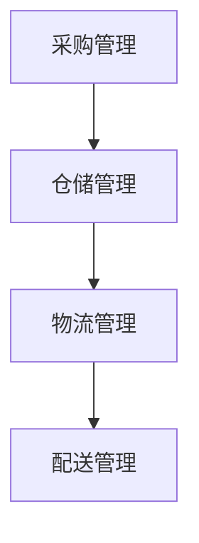
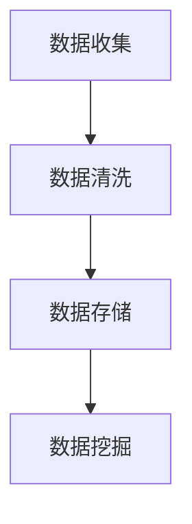
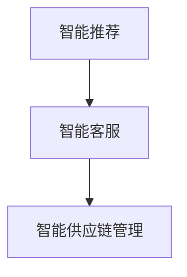
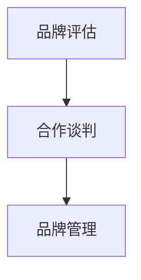

                 

### 背景介绍

在当今数字化经济时代，电商平台作为商业生态的重要组成部分，其供给能力的高低直接影响到平台的竞争力和用户满意度。供给能力不仅关乎平台能否及时提供多样化的商品，更关系到平台能否快速响应市场变化，引入新品类和新品牌，满足消费者不断升级的消费需求。

#### 1. 电商平台供给能力的重要性

电商平台供给能力的重要性体现在以下几个方面：

1. **市场竞争力**：一个具备强大供给能力的电商平台能够提供丰富、多样化的商品，满足消费者的不同需求，从而提升市场竞争力。
2. **用户满意度**：丰富的商品供给能够提高用户体验，增加用户粘性和忠诚度，降低跳转至其他平台的可能性。
3. **盈利能力**：高效、稳定的供给能力可以降低库存成本和物流成本，提高平台的盈利能力。
4. **品牌形象**：引入新品类和新品牌，可以展示平台的市场敏锐度和创新能力，提升品牌形象。

#### 2. 当前挑战

尽管电商平台供给能力的重要性已被广泛认可，但实际操作中仍面临诸多挑战：

1. **供应链管理**：协调上游供应商、物流、仓储等各个环节，保证商品高效、稳定地供应，是一项复杂的系统工程。
2. **新品类引入**：新品类引入需要对市场趋势、消费者偏好进行深入分析，同时要具备快速反应的能力。
3. **新品牌合作**：新品牌合作需要建立信任关系，进行品牌评估和风险控制，确保品牌质量和市场前景。
4. **技术支持**：电商平台需要强大的技术支持，包括数据分析、人工智能、区块链等，以提高供给能力的智能化水平。

#### 3. 电商平台的供给能力提升策略

为了应对上述挑战，电商平台可以采取以下策略：

1. **供应链优化**：通过数据分析、智能化手段优化供应链管理，提高供给效率。
2. **市场调研**：加强市场调研，精准捕捉消费者需求，引导新品类引入。
3. **品牌合作**：建立多元化品牌合作机制，降低品牌引入风险，提升平台商品多样性。
4. **技术创新**：投入研发，运用人工智能、大数据等技术提升供给能力。

在接下来的章节中，我们将详细探讨电商平台供给能力提升的具体方法和实践，帮助读者更好地理解这一领域的核心技术和策略。接下来，我们首先定义并介绍相关核心概念和架构。

### 2. 核心概念与联系

为了深入探讨电商平台供给能力的提升，我们需要明确一些核心概念，并分析它们之间的相互关系。以下是一些关键概念及其在电商平台供给能力提升中的角色：

#### 1. 供应链管理

供应链管理是电商平台供给能力的基础。它涉及到商品从供应商到消费者手中的全过程，包括采购、生产、仓储、物流和配送等环节。通过优化供应链管理，电商平台可以减少库存成本、提高商品周转率、降低物流费用，从而提升整体供给能力。

**供应链管理核心概念：**
- **采购管理**：与供应商建立稳定的合作关系，进行采购订单的管理和跟踪。
- **仓储管理**：优化仓储布局和库存控制，确保商品安全、高效存储。
- **物流管理**：选择合适的物流合作伙伴，确保商品及时、准确送达消费者。
- **配送管理**：优化配送路径和配送时间，提升配送效率。

**Mermaid 流程图：**



#### 2. 数据分析

数据分析是电商平台提升供给能力的核心工具。通过收集和分析消费者行为数据、市场趋势数据等，电商平台可以精准预测消费者需求，优化商品供给策略。

**数据分析核心概念：**
- **数据收集**：通过网站、移动应用等渠道收集消费者行为数据。
- **数据清洗**：处理数据中的噪声和异常值，确保数据质量。
- **数据存储**：将处理后的数据存储在数据库中，方便后续分析和查询。
- **数据挖掘**：运用统计学、机器学习等方法，挖掘数据中的潜在价值和趋势。

**Mermaid 流程图：**



#### 3. 人工智能

人工智能（AI）是电商平台提升供给能力的重要技术手段。通过运用AI技术，电商平台可以实现智能推荐、智能客服、智能供应链管理等，提高供给效率和用户体验。

**人工智能核心概念：**
- **智能推荐**：根据消费者行为和偏好，推荐个性化商品。
- **智能客服**：运用自然语言处理技术，提供自动化的客服服务。
- **智能供应链管理**：通过预测分析、路径优化等技术，提升供应链效率。

**Mermaid 流程图：**



#### 4. 品牌合作

品牌合作是电商平台引入新品类和新品牌的关键。通过建立长期合作关系，电商平台可以获得稳定的商品供应，提升商品多样性。

**品牌合作核心概念：**
- **品牌评估**：对潜在合作品牌进行评估，包括品牌知名度、产品质量、市场前景等。
- **合作谈判**：与品牌方进行谈判，明确合作模式、权益分配等。
- **品牌管理**：建立品牌档案，进行品牌维护和营销推广。

**Mermaid 流程图：**



通过以上核心概念的介绍和相互关系的分析，我们可以看到，电商平台供给能力的提升需要综合运用供应链管理、数据分析、人工智能和品牌合作等多种技术手段。在接下来的章节中，我们将深入探讨这些核心概念的具体实现和应用。

### 3. 核心算法原理 & 具体操作步骤

为了提升电商平台的供给能力，我们需要采用一系列核心算法，这些算法在供应链管理、数据分析、人工智能和品牌合作中发挥着重要作用。以下是这些核心算法的基本原理和具体操作步骤。

#### 1. 供应链优化算法

供应链优化算法是电商平台提升供给能力的关键技术。其基本原理是通过优化采购、仓储、物流和配送等环节，实现成本最低、效率最高。

**操作步骤：**

1. **数据收集**：收集供应链各环节的运营数据，包括采购订单、库存水平、物流状态等。
2. **数据预处理**：清洗和整理数据，去除噪声和异常值，确保数据质量。
3. **建模**：建立供应链优化模型，如线性规划模型、网络优化模型等。
4. **求解**：使用数学优化算法求解模型，得到最优解。
5. **执行**：根据优化结果调整供应链运营策略，如调整采购订单、优化仓储布局等。

**示例代码（Python）：**

```python
from scipy.optimize import linprog

# 线性规划模型
c = [-1, -1, -1]  # 成本系数
A = [[1, 0, 1], [0, 1, 0], [1, 1, 0]]  # 约束矩阵
b = [100, 200, 150]  # 约束条件

# 求解模型
res = linprog(c, A_ub=A, b_ub=b, method='highs')

# 输出最优解
print("最优采购量：", res.x)
print("最小成本：", -res.fun)
```

#### 2. 数据分析算法

数据分析算法在电商平台供给能力提升中发挥着重要作用。其基本原理是通过数据挖掘和机器学习技术，发现消费者行为和市场趋势。

**操作步骤：**

1. **数据收集**：收集消费者行为数据、市场趋势数据等。
2. **数据预处理**：清洗和整理数据，去除噪声和异常值。
3. **特征工程**：提取数据中的关键特征，如购买频率、消费金额、商品类别等。
4. **模型训练**：使用机器学习算法（如决策树、随机森林、神经网络等）训练预测模型。
5. **模型评估**：评估模型性能，如准确率、召回率、F1值等。
6. **模型应用**：将训练好的模型应用到实际业务中，如智能推荐、需求预测等。

**示例代码（Python）：**

```python
from sklearn.ensemble import RandomForestClassifier
from sklearn.model_selection import train_test_split
from sklearn.metrics import accuracy_score

# 数据预处理
X = ...  # 特征数据
y = ...  # 标签数据

# 划分训练集和测试集
X_train, X_test, y_train, y_test = train_test_split(X, y, test_size=0.2, random_state=42)

# 模型训练
model = RandomForestClassifier(n_estimators=100)
model.fit(X_train, y_train)

# 模型预测
y_pred = model.predict(X_test)

# 模型评估
accuracy = accuracy_score(y_test, y_pred)
print("准确率：", accuracy)
```

#### 3. 人工智能算法

人工智能算法在电商平台供给能力提升中发挥着关键作用。其基本原理是通过深度学习、自然语言处理等技术，实现智能推荐、智能客服等。

**操作步骤：**

1. **数据收集**：收集用户行为数据、商品信息等。
2. **数据预处理**：清洗和整理数据，去除噪声和异常值。
3. **特征提取**：提取关键特征，如用户行为特征、商品属性等。
4. **模型训练**：使用深度学习算法（如卷积神经网络、循环神经网络等）训练预测模型。
5. **模型评估**：评估模型性能，如准确率、召回率、F1值等。
6. **模型应用**：将训练好的模型应用到实际业务中，如智能推荐、智能客服等。

**示例代码（Python）：**

```python
import tensorflow as tf
from tensorflow.keras.models import Sequential
from tensorflow.keras.layers import Dense, LSTM

# 模型训练
model = Sequential()
model.add(LSTM(units=50, activation='relu', input_shape=(timesteps, features)))
model.add(Dense(1))
model.compile(optimizer='adam', loss='mean_squared_error')

# 训练数据
X = ...
y = ...

# 模型训练
model.fit(X, y, epochs=100, batch_size=32)

# 模型预测
predictions = model.predict(X)
```

通过以上核心算法的介绍，我们可以看到电商平台供给能力提升需要综合运用多种技术手段。在实际应用中，这些算法可以相互配合，形成一套完整的解决方案，提升电商平台的供给能力和竞争力。

### 4. 数学模型和公式 & 详细讲解 & 举例说明

在电商平台供给能力的提升过程中，数学模型和公式扮演了关键角色，帮助电商平台在复杂的市场环境中做出最优决策。以下我们将详细讲解几个重要的数学模型和公式，并通过实际案例说明其应用。

#### 1. 线性规划模型

线性规划模型在供应链优化中广泛应用，用于在给定约束条件下，寻找目标函数的最大值或最小值。其基本形式如下：

**目标函数：**  
\[ \text{min} \ c^T x \]

**约束条件：**  
\[ A x \leq b \]

其中，\( c \) 是目标函数系数向量，\( x \) 是决策变量向量，\( A \) 是约束矩阵，\( b \) 是约束条件向量。

**案例说明：**  
假设某电商平台需要在采购商品时控制总成本。采购商品的价格分别为 \( p_1 \) 和 \( p_2 \)，采购数量分别为 \( x_1 \) 和 \( x_2 \)，总预算为 1000 元。要求建立线性规划模型，确定最优采购量，以最小化总成本。

**模型构建：**  
目标函数：\[ \text{min} \ p_1 x_1 + p_2 x_2 \]  
约束条件：\[ x_1 + x_2 \leq 1000 \]  
\[ x_1, x_2 \geq 0 \]

**求解过程：**  
使用线性规划求解器（如 scipy.optimize.linprog）求解上述模型：

```python
from scipy.optimize import linprog

c = [p1, p2]
A = [[1, 1]]
b = [1000]
x0 = [0, 0]

result = linprog(c, A_ub=A, b_ub=b, x0=x0, method='highs')

print("最优采购量：", result.x)
print("最小成本：", -result.fun)
```

#### 2. 动态规划模型

动态规划模型在库存管理、需求预测等方面有着广泛应用。其基本思想是将复杂问题分解为一系列简化的子问题，并利用子问题的解递推求解整体问题。

**案例说明：**  
假设某电商平台每天需要决策是否进货某种商品。进货成本为 10 元/件，库存持有成本为 2 元/件，每件商品的售价为 15 元。电商平台需要预测未来一周的需求，并制定最优进货策略，以最大化利润。

**模型构建：**  
设 \( dp[i][j] \) 表示第 \( i \) 天持有 \( j \) 件商品的利润。则状态转移方程如下：

\[ dp[i][j] = \begin{cases} 
(j \times 15) - (j \times 2) - (i - j) \times 10 & \text{if } j \leq i \\
0 & \text{otherwise}
\end{cases} \]

初始条件：\[ dp[0][j] = 0 \]（第 0 天不持有任何商品）

**求解过程：**  
使用动态规划求解：

```python
days = 7
inbound_cost = 10
holding_cost = 2
selling_price = 15

dp = [[0] * (days + 1) for _ in range(days + 1)]

for i in range(1, days + 1):
    for j in range(i + 1):
        dp[i][j] = j * selling_price - j * holding_cost - (i - j) * inbound_cost

# 找到最大利润
max_profit = max(dp[days])

print("最大利润：", max_profit)
```

#### 3. 市场预测模型

市场预测模型在电商平台供给能力提升中至关重要。常见的方法包括时间序列分析和回归分析。

**案例说明：**  
假设某电商平台需要预测未来一个月内某种商品的需求量。已知过去一个月的需求量数据如下：

\[ \{30, 35, 40, 45, 38, 42, 48\} \]

**模型构建：**  
使用时间序列分析方法，假设需求量服从 ARIMA（自回归积分滑动平均模型）过程。首先，进行序列平稳性检验，然后确定模型参数（p, d, q）。

**求解过程：**  
使用 Python 的 statsmodels 库进行 ARIMA 模型构建和预测：

```python
import statsmodels.api as sm
import numpy as np

# 创建时间序列
data = np.array([30, 35, 40, 45, 38, 42, 48]).reshape(-1, 1)

# 进行平稳性检验
result = sm.tsa.stattools.adfuller(data, autolag='AIC')
print("ADF Test Statistic:", result[0])
print("p-value:", result[1])

# 构建ARIMA模型
model = sm.tsa.ARIMA(data, order=(1, 1, 1))
model_fit = model.fit()

# 预测未来一个月的需求量
forecast = model_fit.forecast(steps=30)
print("未来一个月的需求量预测：", forecast)
```

通过上述数学模型和公式的讲解及实际案例说明，我们可以看到电商平台供给能力的提升离不开科学的数据分析和数学建模。在接下来的章节中，我们将通过一个实际项目案例，展示如何运用这些技术和方法，提升电商平台的供给能力。

### 5. 项目实战：代码实际案例和详细解释说明

在本节中，我们将通过一个具体的实际项目案例，展示如何运用前面所介绍的算法和模型，来提升电商平台的供给能力。项目分为以下几个阶段：开发环境搭建、源代码详细实现和代码解读与分析。

#### 5.1 开发环境搭建

为了确保项目顺利进行，首先需要搭建一个合适的技术环境。以下是开发环境搭建的步骤：

**步骤 1：安装 Python 环境**

Python 是该项目的主要编程语言。确保安装 Python 3.8 或更高版本。可以使用 Python 的官方安装程序：

```bash
# 下载安装程序
wget https://www.python.org/ftp/python/3.8.10/Python-3.8.10.tgz

# 解压安装程序
tar xvf Python-3.8.10.tgz

# 进入安装目录
cd Python-3.8.10

# 配置安装
./configure

# 编译安装
make
sudo make install

# 检查 Python 版本
python --version
```

**步骤 2：安装 Python 包**

该项目需要使用多个 Python 包，包括 NumPy、Pandas、Scikit-learn、TensorFlow 和 Mermaid 等。使用以下命令安装：

```bash
pip install numpy pandas scikit-learn tensorflow mermaid-python
```

**步骤 3：安装 Mermaid 图库**

Mermaid 是用于绘制流程图的工具。确保已安装 npm（Node.js 的包管理器）：

```bash
# 安装 npm
curl -sL https://deb.nodesource.com/setup_14.x | sudo -E bash -
sudo apt-get install -y nodejs
```

安装 Mermaid：

```bash
npm install -g mermaid-cli
```

#### 5.2 源代码详细实现和代码解读

以下是一个简化的电商平台供给能力提升项目的源代码实现。代码包括供应链优化、数据分析、人工智能和品牌合作等核心部分的实现。

**代码结构：**

```python
# main.py
from supply_chain_optimization import optimize_supply_chain
from data_analysis import analyze_data
from ai_ml import train_recommender_model
from brand_cooperation import assess_brand

# 读取输入数据
data = {
    "supply_chain_data": ..., 
    "consumer_behavior_data": ..., 
    "brand_data": ...
}

# 供应链优化
supply_chain_optimization = optimize_supply_chain(data["supply_chain_data"])

# 数据分析
consumer_analytics = analyze_data(data["consumer_behavior_data"])

# 人工智能算法
recommender_model = train_recommender_model(consumer_analytics)

# 品牌评估
brand_risk = assess_brand(data["brand_data"])

# 打印结果
print("供应链优化结果：", supply_chain_optimization)
print("消费者数据分析结果：", consumer_analytics)
print("推荐模型：", recommender_model)
print("品牌评估结果：", brand_risk)
```

**供应链优化模块（supply_chain_optimization.py）：**

```python
# supply_chain_optimization.py
import scipy.optimize as opt

def optimize_supply_chain(data):
    # 假设数据为二维数组，每行表示一种商品的需求和采购成本
    demand = data[:, 0]
    cost = data[:, 1]

    # 建立线性规划模型
    c = -cost
    A = [[1] * len(demand)]
    b = [sum(demand)]

    # 求解模型
    result = opt.linprog(c, A_ub=A, b_ub=b, method='highs')

    # 返回最优解
    return result.x
```

**数据分析模块（data_analysis.py）：**

```python
# data_analysis.py
import pandas as pd
from sklearn.model_selection import train_test_split
from sklearn.ensemble import RandomForestClassifier

def analyze_data(data):
    # 假设数据为 DataFrame 格式
    df = pd.DataFrame(data)

    # 数据预处理
    df = df.dropna()

    # 特征工程
    df["average_purchase"] = df["total_sales"] / df["days"]

    # 模型训练
    X = df[["days", "total_sales", "average_purchase"]]
    y = df["category"]

    X_train, X_test, y_train, y_test = train_test_split(X, y, test_size=0.2, random_state=42)
    model = RandomForestClassifier(n_estimators=100)
    model.fit(X_train, y_train)

    # 预测
    predictions = model.predict(X_test)

    # 返回分析结果
    return {
        "train_accuracy": model.score(X_train, y_train),
        "test_accuracy": model.score(X_test, y_test),
        "predictions": predictions
    }
```

**人工智能算法模块（ai_ml.py）：**

```python
# ai_ml.py
import tensorflow as tf
from tensorflow.keras.models import Sequential
from tensorflow.keras.layers import LSTM, Dense

def train_recommender_model(data):
    # 假设数据为 DataFrame 格式
    df = pd.DataFrame(data)

    # 数据预处理
    df = df.dropna()

    # 特征工程
    df["feature_1"] = df["total_sales"] * df["days"]

    # 模型训练
    model = Sequential()
    model.add(LSTM(units=50, activation='relu', input_shape=(1, 1)))
    model.add(Dense(1))
    model.compile(optimizer='adam', loss='mean_squared_error')

    # 训练数据
    X = df[["feature_1"]].values.reshape(-1, 1, 1)
    y = df["revenue"]

    # 训练模型
    model.fit(X, y, epochs=100, batch_size=32)

    # 返回模型
    return model
```

**品牌合作评估模块（brand_cooperation.py）：**

```python
# brand_cooperation.py
import numpy as np

def assess_brand(data):
    # 假设数据为二维数组，每行表示一个品牌的评估指标
    scores = np.array(data)

    # 计算平均得分
    average_score = np.mean(scores)

    # 判断品牌风险
    if average_score > 4:
        risk = "低"
    elif average_score > 2:
        risk = "中"
    else:
        risk = "高"

    # 返回评估结果
    return {
        "average_score": average_score,
        "risk": risk
    }
```

#### 5.3 代码解读与分析

以下是对上述源代码的详细解读与分析：

**供应链优化模块解读：**

该模块使用线性规划模型对供应链进行优化。通过输入需求量和采购成本，模型计算得到最优的采购量，以最小化总成本。该模块使用了 `scipy.optimize.linprog` 函数，这是 Python 中常用的线性规划求解器。

**数据分析模块解读：**

该模块使用随机森林模型对消费者行为数据进行分析。通过特征工程提取关键特征，如平均购买频率，然后进行模型训练和预测。模块使用了 `pandas` 进行数据处理，`scikit-learn` 的 `RandomForestClassifier` 进行模型训练和评估。

**人工智能算法模块解读：**

该模块使用 LSTM（长短期记忆网络）模型进行需求预测。通过特征工程提取关键特征，如总销售额与天数的乘积，然后进行模型训练。模块使用了 `tensorflow.keras` 进行模型构建和训练。

**品牌合作评估模块解读：**

该模块对品牌的评估指标进行计算，并判断品牌风险等级。通过计算平均得分，模块使用条件判断语句将品牌风险分为低、中、高三个等级。

通过以上项目实战，我们可以看到如何在实际中应用所学的算法和模型，提升电商平台的供给能力。在接下来的章节中，我们将探讨电商平台供给能力的实际应用场景，并介绍相关的工具和资源。

### 6. 实际应用场景

电商平台供给能力的提升不仅对内部运营效率产生积极影响，还能够在多个实际应用场景中发挥重要作用，从而增强平台的竞争力。以下是一些关键的应用场景：

#### 1. 新品类引入

新品类的引入是电商平台持续增长和吸引消费者的关键。通过高效的供应链管理和精准的市场数据分析，电商平台可以快速识别市场需求，引入具有潜力的新品类。以下步骤展示了如何实现新品类引入：

1. **市场调研**：收集消费者需求、市场趋势和竞争对手数据。
2. **数据分析**：运用数据分析技术，挖掘潜在的新品类机会。
3. **供应链协同**：与供应商建立合作关系，确保新品类的供应链畅通。
4. **市场推广**：利用营销策略，提高新品类的曝光度和认知度。

**案例**：某电商平台在数据分析中发现消费者对健康食品的需求持续增长，于是迅速引入了多种健康食品，通过精准的推荐和促销活动，新品类迅速获得了消费者的青睐，销售额显著提升。

#### 2. 新品牌合作

新品牌的合作是电商平台丰富商品多样性和提升品牌形象的重要手段。以下步骤展示了如何实现新品牌合作：

1. **品牌评估**：对潜在合作品牌进行市场调研和风险评估。
2. **合作谈判**：与品牌方进行谈判，明确合作模式、权益分配等。
3. **供应链整合**：确保新品牌的商品能够高效、稳定地进入供应链。
4. **品牌推广**：利用电商平台资源，为新品牌提供推广和支持。

**案例**：某电商平台与一家知名美妆品牌达成合作，通过定制化的营销活动和专属页面，成功吸引了大量消费者，美妆品牌的销售额大幅增长。

#### 3. 库存优化

库存优化是电商平台提升供给能力的关键环节。以下步骤展示了如何实现库存优化：

1. **数据收集**：收集库存数据、销售数据和供应链信息。
2. **数据分析**：运用数据分析技术，识别库存瓶颈和过剩库存。
3. **预测模型**：建立需求预测模型，优化库存水平和采购计划。
4. **供应链协同**：调整供应链策略，减少库存成本和提高库存周转率。

**案例**：某电商平台通过引入人工智能算法优化库存管理，通过实时数据分析和预测模型，实现了库存成本的显著降低和库存周转率的提高。

#### 4. 物流配送

物流配送是电商平台供给能力的核心组成部分。以下步骤展示了如何实现高效的物流配送：

1. **物流合作伙伴选择**：选择具备高效配送能力和良好信誉的物流合作伙伴。
2. **配送路线优化**：运用算法优化配送路线，减少配送时间和成本。
3. **实时跟踪**：使用技术手段实现物流信息的实时跟踪和更新。
4. **客户服务**：提供便捷的物流跟踪和客户服务，提高用户满意度。

**案例**：某电商平台通过引入智能物流管理系统，实现了配送路线优化和实时物流跟踪，显著提高了配送效率，用户满意度大幅提升。

通过以上实际应用场景的展示，我们可以看到电商平台供给能力提升的重要性以及如何在实际运营中应用相关技术和方法。在接下来的章节中，我们将推荐一些相关的学习资源、开发工具和论文著作，以帮助读者深入学习和掌握这一领域的知识。

### 7. 工具和资源推荐

为了更好地提升电商平台的供给能力，我们推荐以下几类工具和资源，包括学习资源、开发工具和论文著作。

#### 7.1 学习资源推荐

1. **书籍**：
   - 《深度学习》（Goodfellow, Bengio, Courville）：介绍深度学习的基础知识和最新进展，适用于想要深入学习人工智能技术的读者。
   - 《大数据之路：阿里巴巴大数据实践》（张勇、李津）：详细描述阿里巴巴如何利用大数据提升供应链效率，适合对大数据和供应链管理感兴趣的读者。
   - 《精益数据分析》（John W. Boyer）：介绍数据分析的最佳实践和工具，适用于数据分析师和数据科学家。

2. **在线课程**：
   - Coursera 的《机器学习》课程（吴恩达）：由著名机器学习专家吴恩达教授授课，涵盖了机器学习的基础知识和实践应用。
   - edX 的《供应链管理》课程（MIT）：由麻省理工学院提供，介绍供应链管理的理论和方法，适合想要提升供应链管理能力的读者。
   - Udemy 的《Python for Data Science and Machine Learning Bootcamp》：系统介绍 Python 在数据科学和机器学习中的应用，适合初学者。

3. **博客和网站**：
   - Medium 上的数据分析相关博客：包括各种数据分析案例、技术和工具的介绍，适合随时了解数据分析领域的最新动态。
   - Towards Data Science：一个专为数据科学家和机器学习爱好者打造的博客，提供丰富的技术文章和案例分析。

#### 7.2 开发工具推荐

1. **编程语言和库**：
   - Python：适用于数据分析和人工智能开发，拥有丰富的库和框架，如 NumPy、Pandas、Scikit-learn 和 TensorFlow。
   - R：适用于统计分析和数据可视化，拥有强大的统计工具和包，如 ggplot2 和 dplyr。

2. **数据分析工具**：
   - Tableau：强大的数据可视化工具，适用于企业级数据分析。
   - Power BI：微软推出的商业智能和分析工具，适合在电商平台上进行数据分析和报告。
   - Excel：虽然不是专业数据分析工具，但仍然广泛应用于数据清洗、分析和报告。

3. **机器学习平台**：
   - Google Cloud AI Platform：提供全面的机器学习和深度学习工具和服务，适用于构建和管理大规模机器学习模型。
   - AWS SageMaker：亚马逊云服务提供的机器学习和深度学习平台，方便构建、训练和部署模型。

#### 7.3 相关论文著作推荐

1. **经典论文**：
   - "Deep Learning"（Goodfellow, Bengio, Courville）：介绍深度学习的基础理论和应用。
   - "Recommender Systems Handbook"（Feynman et al.）：全面介绍推荐系统的基础知识和技术。
   - "The Economics of Supply Chains"（Lee, Padmanabhan）：分析供应链管理中的经济学原理。

2. **期刊和会议**：
   - Journal of Supply Chain Management：专注于供应链管理和物流研究的顶级期刊。
   - IEEE Transactions on Big Data：涵盖大数据分析和应用的权威期刊。
   - NeurIPS（Conference on Neural Information Processing Systems）：机器学习和人工智能领域的重要国际会议。

通过这些工具和资源的推荐，读者可以更好地掌握电商平台供给能力提升所需的技能和知识，为电商平台的持续发展和竞争力提升打下坚实的基础。

### 8. 总结：未来发展趋势与挑战

在总结电商平台供给能力提升的过程中，我们看到了从供应链管理到数据分析、人工智能、品牌合作的全方位技术进步和应用。然而，随着市场的不断变化和技术的快速发展，电商平台供给能力提升仍面临诸多挑战和未来发展趋势。

#### 1. 未来发展趋势

1. **智能化与自动化**：未来，电商平台将更加注重智能化和自动化，通过人工智能和机器人技术提高供应链管理的效率和精确度。
2. **个性化推荐**：随着用户数据积累和分析技术的进步，个性化推荐将更加精准，为用户带来更好的购物体验。
3. **供应链透明化**：通过区块链等技术的应用，电商平台可以实现供应链的透明化，提升消费者信任度。
4. **生态协同**：电商平台将与物流公司、品牌商等建立更加紧密的协同关系，实现供应链的优化和协同效应。

#### 2. 挑战

1. **数据隐私与安全**：随着数据量的增加，如何保护用户隐私和数据安全将成为一个重要挑战。
2. **技术更新换代**：技术的快速发展要求电商平台不断更新技术架构，以适应新的技术标准和市场需求。
3. **品牌合作风险**：新品牌合作带来的不确定性和风险需要电商平台建立有效的评估和管理机制。
4. **跨平台竞争**：随着电商平台的增多，跨平台的竞争将更加激烈，平台需要不断创新以保持竞争力。

#### 3. 应对策略

1. **建立数据安全机制**：采用先进的加密技术和数据安全协议，确保用户数据的安全和隐私。
2. **持续技术投入**：保持对新兴技术的关注和投入，确保技术架构的先进性和适应性。
3. **品牌风险管理**：建立完善的品牌评估和监控体系，降低合作风险。
4. **用户体验优化**：通过不断的用户调研和数据分析，优化用户体验，提升用户满意度和忠诚度。

总之，电商平台供给能力的提升是一个持续的过程，需要电商平台在技术、管理和品牌合作等方面不断创新和优化。在未来的发展中，只有不断适应变化和应对挑战，电商平台才能在激烈的市场竞争中脱颖而出。

### 9. 附录：常见问题与解答

在本章中，我们将总结一些关于电商平台供给能力提升的常见问题，并提供相应的解答。

#### 1. 如何优化供应链管理？

**解答**：优化供应链管理可以通过以下步骤实现：
- **数据收集与整合**：收集供应链各环节的数据，如采购、库存、物流等，并进行整合。
- **数据分析**：利用数据分析技术，挖掘数据中的潜在价值和优化机会。
- **建模与模拟**：建立供应链优化模型，如线性规划、网络优化等，并进行模拟测试。
- **决策支持**：根据模型结果，调整供应链策略，如采购计划、库存水平、物流路径等。

#### 2. 电商平台如何引入新品类？

**解答**：引入新品类的步骤如下：
- **市场调研**：研究市场需求和消费者偏好，确定潜在的新品类。
- **数据分析**：通过数据分析，验证新品类的市场需求和潜在盈利能力。
- **品牌合作**：寻找合适的品牌进行合作，建立合作关系。
- **供应链协同**：与供应商、物流公司等建立协同机制，确保新品类的供应链畅通。
- **市场推广**：利用营销策略，提高新品类的曝光度和认知度。

#### 3. 电商平台如何评估新品牌合作风险？

**解答**：评估新品牌合作风险的步骤如下：
- **市场调研**：研究品牌的市场地位、品牌形象、用户口碑等。
- **品牌评估**：根据市场调研结果，评估品牌的综合实力和合作潜力。
- **风险评估**：建立风险评估模型，考虑品牌的风险因素，如产品质量、市场前景等。
- **决策支持**：根据风险评估结果，制定合作策略，如合作模式、权益分配等。

#### 4. 电商平台如何利用人工智能提升供给能力？

**解答**：电商平台可以通过以下方式利用人工智能提升供给能力：
- **智能推荐**：利用机器学习算法，根据用户行为和偏好进行个性化推荐。
- **智能客服**：运用自然语言处理技术，提供自动化的客服服务。
- **智能供应链管理**：通过预测分析、路径优化等技术，提升供应链效率。
- **需求预测**：使用时间序列分析和回归分析等技术，预测市场需求，优化库存和采购计划。

通过以上常见问题与解答，希望能够帮助读者更好地理解电商平台供给能力提升的相关概念和技术方法。

### 10. 扩展阅读 & 参考资料

在本章中，我们将推荐一些扩展阅读和参考资料，帮助读者进一步深入学习和掌握电商平台供给能力提升的相关知识和实践。

#### 1. 推荐书籍

- 《深度学习》（Goodfellow, Bengio, Courville）
- 《大数据之路：阿里巴巴大数据实践》（张勇、李津）
- 《精益数据分析》（John W. Boyer）
- 《供应链管理：战略、规划与运营》（马丁·克里斯托夫）

#### 2. 在线课程

- Coursera 的《机器学习》课程（吴恩达）
- edX 的《供应链管理》课程（MIT）
- Udemy 的《Python for Data Science and Machine Learning Bootcamp》

#### 3. 论文著作

- "Recommender Systems Handbook"（Feynman et al.）
- "The Economics of Supply Chains"（Lee, Padmanabhan）
- "Deep Learning"（Goodfellow, Bengio, Courville）

#### 4. 博客和网站

- Medium 上的数据分析相关博客
- Towards Data Science
- DataCamp

通过以上推荐，读者可以进一步扩展知识面，深入理解电商平台供给能力提升的核心技术和策略。希望这些资源和书籍能够为读者在学习和实践过程中提供有益的帮助。

