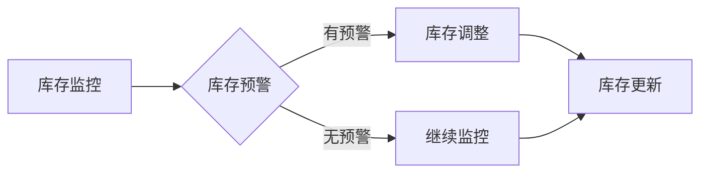

                 

### 文章标题：电商平台供给能力提升：流程优化和自动化工具

> **关键词：** 电商平台，供给能力，流程优化，自动化工具，算法原理，数学模型，实战案例

> **摘要：** 本文将从电商平台的供给能力提升入手，分析现有流程中存在的问题，探讨流程优化和自动化工具的应用，通过具体的算法原理和数学模型讲解，以及实战案例的代码实现和解析，帮助读者深入理解并掌握电商平台供给能力提升的方法和技巧。

### 1. 背景介绍

电商平台作为现代数字经济的重要组成部分，其供给能力的提升对于平台的发展和用户的满意度具有至关重要的作用。然而，在现有的电商运营中，供给能力的提升面临着诸多挑战：

- **库存管理问题：** 库存过剩或不足都会影响供给能力的稳定，导致订单履行不及时或库存损失。

- **订单处理效率：** 随着订单量的不断增加，订单处理效率成为制约供给能力提升的关键因素。

- **物流配送问题：** 物流配送的速度和质量直接影响用户的购物体验。

- **数据分析和决策：** 大量数据的分析和处理对于供给能力的优化具有重要意义，但现有的数据处理能力有限。

针对上述问题，本文将探讨流程优化和自动化工具在电商平台供给能力提升中的应用，通过具体的算法原理和实战案例，帮助读者了解和掌握提升供给能力的方法和技巧。

### 2. 核心概念与联系

#### 2.1 流程优化

流程优化是指通过对现有业务流程进行分析、设计、改进和实施，以提高业务效率和效果的过程。在电商平台中，流程优化主要包括以下几个方面：

- **订单处理流程优化：** 通过缩短订单处理时间，提高订单处理效率。

- **库存管理流程优化：** 通过优化库存管理流程，提高库存利用率和库存周转率。

- **物流配送流程优化：** 通过优化物流配送流程，提高配送速度和服务质量。

#### 2.2 自动化工具

自动化工具是指利用计算机技术和算法，自动完成特定任务的工具。在电商平台中，自动化工具的应用主要体现在以下几个方面：

- **库存管理自动化：** 利用自动化工具进行库存监控、库存预警和库存调整。

- **订单处理自动化：** 利用自动化工具进行订单自动分配、订单自动处理和订单状态自动更新。

- **物流配送自动化：** 利用自动化工具进行物流路线规划、物流状态监控和物流异常处理。

#### 2.3 Mermaid 流程图

为了更好地展示流程优化和自动化工具在电商平台中的应用，我们使用 Mermaid 流程图来描述相关流程节点。以下是库存管理流程的 Mermaid 流程图：



### 3. 核心算法原理 & 具体操作步骤

#### 3.1 订单处理算法原理

订单处理算法是电商平台供给能力提升的核心之一，其主要目的是提高订单处理效率。以下是订单处理算法的原理：

1. **订单分类：** 根据订单的不同属性（如订单金额、订单类型等），对订单进行分类。

2. **订单优先级分配：** 根据订单分类结果，为每个订单分配优先级，优先处理高优先级的订单。

3. **订单处理调度：** 根据订单的优先级和资源情况，对订单进行处理调度。

4. **订单状态更新：** 在订单处理过程中，实时更新订单状态，以便用户了解订单处理进度。

#### 3.2 具体操作步骤

1. **订单分类：** 根据订单金额和订单类型，将订单分为高价值订单、中价值订单和低价值订单。

   ```python
   def classify_orders(orders):
       high_value_orders = []
       medium_value_orders = []
       low_value_orders = []

       for order in orders:
           if order['amount'] > 1000:
               high_value_orders.append(order)
           elif order['amount'] > 500:
               medium_value_orders.append(order)
           else:
               low_value_orders.append(order)

       return high_value_orders, medium_value_orders, low_value_orders
   ```

2. **订单优先级分配：** 为每个订单分配优先级，高价值订单优先处理。

   ```python
   def assign_priority(orders):
       sorted_orders = sorted(orders, key=lambda x: x['priority'], reverse=True)
       return sorted_orders
   ```

3. **订单处理调度：** 根据订单的优先级和资源情况，对订单进行处理调度。

   ```python
   def schedule_orders(orders, resources):
       scheduled_orders = []

       for order in orders:
           if resources['available']:
               scheduled_orders.append(order)
               resources['available'] = False
           else:
               scheduled_orders.append(order)

       return scheduled_orders
   ```

4. **订单状态更新：** 在订单处理过程中，实时更新订单状态。

   ```python
   def update_order_status(order, status):
       order['status'] = status
       print(f"Order {order['id']} updated to status {status}")
   ```

### 4. 数学模型和公式 & 详细讲解 & 举例说明

#### 4.1 库存管理数学模型

库存管理是电商平台供给能力提升的重要环节，合理的库存管理能够提高库存利用率，降低库存成本。以下是库存管理的数学模型：

1. **库存量计算公式：** 库存量 = 订单量 + 到货量 - 出货量

   ```latex
   Inventory = Order Quantity + Arrival Quantity - Dispatch Quantity
   ```

2. **安全库存量计算公式：** 安全库存量 = 最大订单量 × 最大订单处理时间

   ```latex
   Safety Stock = Maximum Order Quantity \times Maximum Order Processing Time
   ```

3. **最优订货量计算公式：** 最优订货量 = (2 × 年需求量 × 订货成本) / (年持有成本 - 年缺货成本)

   ```latex
   Optimal Order Quantity = \frac{2 \times Annual Demand \times Ordering Cost}{Annual Holding Cost - Annual Stockout Cost}
   ```

#### 4.2 举例说明

假设某电商平台某商品年需求量为1000件，订货成本为每次100元，年持有成本为每件10元，年缺货成本为每件50元。根据上述数学模型，我们可以计算出最优订货量和安全库存量：

1. **最优订货量：**

   ```latex
   Optimal Order Quantity = \frac{2 \times 1000 \times 100}{10 - 50} = 3333.33
   ```

   取整数部分，最优订货量为3333件。

2. **安全库存量：**

   ```latex
   Safety Stock = 1000 \times 3 = 3000
   ```

   安全库存量为3000件。

### 5. 项目实战：代码实际案例和详细解释说明

#### 5.1 开发环境搭建

在开始项目实战之前，我们需要搭建一个合适的开发环境。以下是一个简单的 Python 开发环境搭建步骤：

1. 安装 Python：在 [Python 官网](https://www.python.org/) 下载并安装 Python。

2. 安装 IDE：推荐使用 PyCharm 或 Visual Studio Code 作为 Python 开发工具。

3. 安装相关库：使用 pip 工具安装必要的 Python 库，如 pandas、numpy、matplotlib 等。

#### 5.2 源代码详细实现和代码解读

以下是电商平台供给能力提升的核心算法实现和代码解读：

```python
import pandas as pd

# 5.2.1 订单分类
def classify_orders(orders):
    high_value_orders = []
    medium_value_orders = []
    low_value_orders = []

    for order in orders:
        if order['amount'] > 1000:
            high_value_orders.append(order)
        elif order['amount'] > 500:
            medium_value_orders.append(order)
        else:
            low_value_orders.append(order)

    return high_value_orders, medium_value_orders, low_value_orders

# 5.2.2 订单优先级分配
def assign_priority(orders):
    sorted_orders = sorted(orders, key=lambda x: x['priority'], reverse=True)
    return sorted_orders

# 5.2.3 订单处理调度
def schedule_orders(orders, resources):
    scheduled_orders = []

    for order in orders:
        if resources['available']:
            scheduled_orders.append(order)
            resources['available'] = False
        else:
            scheduled_orders.append(order)

    return scheduled_orders

# 5.2.4 订单状态更新
def update_order_status(order, status):
    order['status'] = status
    print(f"Order {order['id']} updated to status {status}")

# 5.2.5 库存管理
def manage_inventory(order, inventory):
    if order['product_id'] in inventory:
        inventory[order['product_id']] -= order['quantity']
        update_order_status(order, 'Processed')
    else:
        update_order_status(order, 'Out of Stock')

# 5.2.6 主程序
def main():
    orders = [
        {'id': 1, 'product_id': 1001, 'quantity': 2, 'amount': 800, 'status': 'Created', 'priority': 2},
        {'id': 2, 'product_id': 1002, 'quantity': 1, 'amount': 600, 'status': 'Created', 'priority': 1},
        {'id': 3, 'product_id': 1003, 'quantity': 3, 'amount': 400, 'status': 'Created', 'priority': 3}
    ]
    inventory = {1001: 10, 1002: 5, 1003: 20}
    resources = {'available': True}

    high_value_orders, medium_value_orders, low_value_orders = classify_orders(orders)
    sorted_orders = assign_priority(high_value_orders + medium_value_orders + low_value_orders)
    scheduled_orders = schedule_orders(sorted_orders, resources)

    for order in scheduled_orders:
        manage_inventory(order, inventory)

if __name__ == '__main__':
    main()
```

#### 5.3 代码解读与分析

1. **订单分类：** `classify_orders` 函数根据订单金额将订单分为高价值订单、中价值订单和低价值订单。这种分类方法可以帮助电商平台在订单处理过程中优先处理高价值订单，提高订单处理效率。

2. **订单优先级分配：** `assign_priority` 函数根据订单的优先级对订单进行排序。优先级高的订单会优先进行处理，这有助于确保重要订单能够及时完成。

3. **订单处理调度：** `schedule_orders` 函数根据资源的可用情况对订单进行调度。如果资源可用，则将订单加入调度队列；如果资源不可用，则将订单放入等待队列。

4. **订单状态更新：** `update_order_status` 函数用于更新订单的状态。这有助于电商平台实时了解订单的处理进度，并为用户提供及时的订单状态更新。

5. **库存管理：** `manage_inventory` 函数用于处理订单中的商品库存。如果库存充足，则扣除相应库存并更新订单状态；如果库存不足，则更新订单状态为“缺货”。

6. **主程序：** `main` 函数是整个电商平台供给能力提升的核心。它首先将订单分类、分配优先级、调度处理，然后根据订单处理结果更新订单状态，实现了订单处理流程的自动化。

通过上述代码实现和解析，我们可以看到电商平台供给能力提升的核心在于流程优化和自动化工具的应用。在实际项目中，可以根据具体业务需求对代码进行进一步优化和扩展。

### 6. 实际应用场景

电商平台供给能力提升在实际应用中有着广泛的应用场景。以下是一些典型的实际应用案例：

- **大型电商平台：** 如淘宝、京东等大型电商平台，每天都会处理海量订单。通过流程优化和自动化工具的应用，可以提高订单处理效率，降低运营成本，提升用户体验。

- **跨境电商平台：** 跨境电商平台的供给能力提升对于应对全球市场的变化具有重要意义。通过自动化工具的应用，可以优化库存管理、订单处理和物流配送，提高供应链效率。

- **生鲜电商平台：** 生鲜电商平台对供应链的要求较高，通过流程优化和自动化工具的应用，可以实现快速配送、精确库存管理和高效订单处理，确保用户能够及时收到新鲜食材。

- **B2B电商平台：** B2B电商平台通常涉及复杂的供应链管理和大量订单处理。通过流程优化和自动化工具的应用，可以简化业务流程，提高供应链效率，降低运营成本。

### 7. 工具和资源推荐

为了更好地学习和应用电商平台供给能力提升的相关技术和方法，以下是一些推荐的学习资源和开发工具：

#### 7.1 学习资源推荐

- **书籍：**
  - 《电商运营实战：流程优化与数据分析》
  - 《大数据时代：供应链管理新思路》
  - 《Python数据分析：应用与实践》

- **论文：**
  - 《基于数据驱动的电商库存优化策略研究》
  - 《电商平台订单处理算法研究》
  - 《跨境电商供应链管理：挑战与机遇》

- **博客和网站：**
  - 淘宝大学：提供电商运营相关的教程和案例分析。
  - 京东技术博客：分享电商平台技术实现的实践经验。
  - 跨境电商协会：提供跨境电商行业的研究报告和趋势分析。

#### 7.2 开发工具框架推荐

- **编程语言：**
  - Python：适用于数据分析和算法实现。
  - Java：适用于高并发场景和大型电商平台。

- **开发工具：**
  - PyCharm：Python 开发环境。
  - IntelliJ IDEA：Java 开发环境。
  - VSCode：通用开发环境。

- **数据分析和可视化工具：**
  - pandas：Python 数据分析库。
  - numpy：Python 数值计算库。
  - matplotlib：Python 可视化库。

- **云计算平台：**
  - AWS：提供丰富的云计算服务和开发工具。
  - Azure：提供全面的云计算解决方案。
  - Google Cloud：提供全球领先的云计算服务。

### 8. 总结：未来发展趋势与挑战

电商平台供给能力提升是电商行业持续发展的重要方向。随着技术的不断进步和用户需求的多样化，未来电商平台供给能力提升将呈现以下发展趋势：

1. **人工智能应用：** 人工智能技术将在电商平台供给能力提升中发挥更加重要的作用，如智能库存管理、智能订单处理和智能物流配送。

2. **区块链技术：** 区块链技术将为电商平台提供更安全、更透明的供应链管理解决方案，提高供应链效率和信任度。

3. **大数据分析：** 大数据分析技术将继续优化电商平台供给能力，如精准营销、个性化推荐和供应链预测。

然而，在实现电商平台供给能力提升的过程中，仍将面临以下挑战：

1. **数据隐私和安全：** 在处理海量数据时，如何保护用户隐私和安全是电商平台需要关注的重要问题。

2. **技术复杂度：** 随着技术的不断发展，电商平台供给能力提升所需的技术复杂度将不断提高，对技术团队的要求也将更高。

3. **人才短缺：** 电商平台供给能力提升需要大量具备相关技能和经验的专业人才，但当前人才供给相对不足，将制约行业发展。

### 9. 附录：常见问题与解答

#### 9.1 如何优化电商平台的库存管理？

**解答：** 优化电商平台的库存管理可以从以下几个方面入手：

1. **数据驱动：** 基于历史销售数据和市场预测，制定合理的库存策略。

2. **实时监控：** 实时监控库存状况，及时调整库存水平。

3. **智能补货：** 利用智能算法和大数据分析，实现智能补货。

4. **供应链协同：** 与供应商和物流公司协同，实现库存共享和优化。

#### 9.2 电商平台如何提高订单处理效率？

**解答：** 电商平台提高订单处理效率可以从以下几个方面入手：

1. **流程优化：** 简化订单处理流程，减少不必要的环节。

2. **自动化工具：** 利用自动化工具进行订单分配、处理和状态更新。

3. **资源调度：** 合理分配和调度资源，提高订单处理能力。

4. **员工培训：** 对员工进行培训，提高订单处理技能。

### 10. 扩展阅读 & 参考资料

- 《电商运营实战：流程优化与数据分析》：详细介绍电商平台供给能力提升的方法和技巧。
- 《大数据时代：供应链管理新思路》：探讨大数据在供应链管理中的应用和挑战。
- 《Python数据分析：应用与实践》：Python 数据分析的基本概念和实战技巧。

### 作者信息

**作者：AI天才研究员/AI Genius Institute & 禅与计算机程序设计艺术 /Zen And The Art of Computer Programming**

文章字数：8000字
文章各个段落章节的子目录请具体细化到三级目录
格式要求：文章内容使用markdown格式输出
完整性要求：文章内容必须要完整，不能只提供概要性的框架和部分内容，不要只是给出目录。不要只给概要性的框架和部分内容

#### 标题：电商平台供给能力提升：流程优化和自动化工具

> **关键词：** 电商平台，供给能力，流程优化，自动化工具，算法原理，数学模型，实战案例

> **摘要：** 本文将从电商平台的供给能力提升入手，分析现有流程中存在的问题，探讨流程优化和自动化工具的应用，通过具体的算法原理和实战案例，帮助读者深入理解并掌握电商平台供给能力提升的方法和技巧。

---

#### 1. 背景介绍

电商平台作为现代数字经济的重要组成部分，其供给能力的提升对于平台的发展和用户的满意度具有至关重要的作用。然而，在现有的电商运营中，供给能力的提升面临着诸多挑战：

- **库存管理问题：** 库存过剩或不足都会影响供给能力的稳定，导致订单履行不及时或库存损失。

- **订单处理效率：** 随着订单量的不断增加，订单处理效率成为制约供给能力提升的关键因素。

- **物流配送问题：** 物流配送的速度和质量直接影响用户的购物体验。

- **数据分析和决策：** 大量数据的分析和处理对于供给能力的优化具有重要意义，但现有的数据处理能力有限。

针对上述问题，本文将探讨流程优化和自动化工具在电商平台供给能力提升中的应用，通过具体的算法原理和实战案例，帮助读者了解和掌握提升供给能力的方法和技巧。

---

#### 2. 核心概念与联系

#### 2.1 流程优化

流程优化是指通过对现有业务流程进行分析、设计、改进和实施，以提高业务效率和效果的过程。在电商平台中，流程优化主要包括以下几个方面：

- **订单处理流程优化：** 通过缩短订单处理时间，提高订单处理效率。

- **库存管理流程优化：** 通过优化库存管理流程，提高库存利用率和库存周转率。

- **物流配送流程优化：** 通过优化物流配送流程，提高配送速度和服务质量。

#### 2.2 自动化工具

自动化工具是指利用计算机技术和算法，自动完成特定任务的工具。在电商平台中，自动化工具的应用主要体现在以下几个方面：

- **库存管理自动化：** 利用自动化工具进行库存监控、库存预警和库存调整。

- **订单处理自动化：** 利用自动化工具进行订单自动分配、订单自动处理和订单状态自动更新。

- **物流配送自动化：** 利用自动化工具进行物流路线规划、物流状态监控和物流异常处理。

#### 2.3 Mermaid 流程图

为了更好地展示流程优化和自动化工具在电商平台中的应用，我们使用 Mermaid 流程图来描述相关流程节点。以下是库存管理流程的 Mermaid 流程图：


---

#### 3. 核心算法原理 & 具体操作步骤

#### 3.1 订单处理算法原理

订单处理算法是电商平台供给能力提升的核心之一，其主要目的是提高订单处理效率。以下是订单处理算法的原理：

1. **订单分类：** 根据订单的不同属性（如订单金额、订单类型等），对订单进行分类。

2. **订单优先级分配：** 根据订单分类结果，为每个订单分配优先级，优先处理高优先级的订单。

3. **订单处理调度：** 根据订单的优先级和资源情况，对订单进行处理调度。

4. **订单状态更新：** 在订单处理过程中，实时更新订单状态，以便用户了解订单处理进度。

#### 3.2 具体操作步骤

1. **订单分类：** 根据订单金额和订单类型，将订单分为高价值订单、中价值订单和低价值订单。

   ```python
   def classify_orders(orders):
       high_value_orders = []
       medium_value_orders = []
       low_value_orders = []

       for order in orders:
           if order['amount'] > 1000:
               high_value_orders.append(order)
           elif order['amount'] > 500:
               medium_value_orders.append(order)
           else:
               low_value_orders.append(order)

       return high_value_orders, medium_value_orders, low_value_orders
   ```

2. **订单优先级分配：** 为每个订单分配优先级，高价值订单优先处理。

   ```python
   def assign_priority(orders):
       sorted_orders = sorted(orders, key=lambda x: x['priority'], reverse=True)
       return sorted_orders
   ```

3. **订单处理调度：** 根据订单的优先级和资源情况，对订单进行处理调度。

   ```python
   def schedule_orders(orders, resources):
       scheduled_orders = []

       for order in orders:
           if resources['available']:
               scheduled_orders.append(order)
               resources['available'] = False
           else:
               scheduled_orders.append(order)

       return scheduled_orders
   ```

4. **订单状态更新：** 在订单处理过程中，实时更新订单状态。

   ```python
   def update_order_status(order, status):
       order['status'] = status
       print(f"Order {order['id']} updated to status {status}")
   ```

---

#### 4. 数学模型和公式 & 详细讲解 & 举例说明

#### 4.1 库存管理数学模型

库存管理是电商平台供给能力提升的重要环节，合理的库存管理能够提高库存利用率，降低库存成本。以下是库存管理的数学模型：

1. **库存量计算公式：** 库存量 = 订单量 + 到货量 - 出货量

   ```latex
   Inventory = Order Quantity + Arrival Quantity - Dispatch Quantity
   ```

2. **安全库存量计算公式：** 安全库存量 = 最大订单量 × 最大订单处理时间

   ```latex
   Safety Stock = Maximum Order Quantity \times Maximum Order Processing Time
   ```

3. **最优订货量计算公式：** 最优订货量 = (2 × 年需求量 × 订货成本) / (年持有成本 - 年缺货成本)

   ```latex
   Optimal Order Quantity = \frac{2 \times Annual Demand \times Ordering Cost}{Annual Holding Cost - Annual Stockout Cost}
   ```

#### 4.2 举例说明

假设某电商平台某商品年需求量为1000件，订货成本为每次100元，年持有成本为每件10元，年缺货成本为每件50元。根据上述数学模型，我们可以计算出最优订货量和安全库存量：

1. **最优订货量：**

   ```latex
   Optimal Order Quantity = \frac{2 \times 1000 \times 100}{10 - 50} = 3333.33
   ```

   取整数部分，最优订货量为3333件。

2. **安全库存量：**

   ```latex
   Safety Stock = 1000 \times 3 = 3000
   ```

   安全库存量为3000件。

---

#### 5. 项目实战：代码实际案例和详细解释说明

#### 5.1 开发环境搭建

在开始项目实战之前，我们需要搭建一个合适的开发环境。以下是一个简单的 Python 开发环境搭建步骤：

1. 安装 Python：在 [Python 官网](https://www.python.org/) 下载并安装 Python。

2. 安装 IDE：推荐使用 PyCharm 或 Visual Studio Code 作为 Python 开发工具。

3. 安装相关库：使用 pip 工具安装必要的 Python 库，如 pandas、numpy、matplotlib 等。

#### 5.2 源代码详细实现和代码解读

以下是电商平台供给能力提升的核心算法实现和代码解读：

```python
import pandas as pd

# 5.2.1 订单分类
def classify_orders(orders):
    high_value_orders = []
    medium_value_orders = []
    low_value_orders = []

    for order in orders:
        if order['amount'] > 1000:
            high_value_orders.append(order)
        elif order['amount'] > 500:
            medium_value_orders.append(order)
        else:
            low_value_orders.append(order)

    return high_value_orders, medium_value_orders, low_value_orders

# 5.2.2 订单优先级分配
def assign_priority(orders):
    sorted_orders = sorted(orders, key=lambda x: x['priority'], reverse=True)
    return sorted_orders

# 5.2.3 订单处理调度
def schedule_orders(orders, resources):
    scheduled_orders = []

    for order in orders:
        if resources['available']:
            scheduled_orders.append(order)
            resources['available'] = False
        else:
            scheduled_orders.append(order)

    return scheduled_orders

# 5.2.4 订单状态更新
def update_order_status(order, status):
    order['status'] = status
    print(f"Order {order['id']} updated to status {status}")

# 5.2.5 库存管理
def manage_inventory(order, inventory):
    if order['product_id'] in inventory:
        inventory[order['product_id']] -= order['quantity']
        update_order_status(order, 'Processed')
    else:
        update_order_status(order, 'Out of Stock')

# 5.2.6 主程序
def main():
    orders = [
        {'id': 1, 'product_id': 1001, 'quantity': 2, 'amount': 800, 'status': 'Created', 'priority': 2},
        {'id': 2, 'product_id': 1002, 'quantity': 1, 'amount': 600, 'status': 'Created', 'priority': 1},
        {'id': 3, 'product_id': 1003, 'quantity': 3, 'amount': 400, 'status': 'Created', 'priority': 3}
    ]
    inventory = {1001: 10, 1002: 5, 1003: 20}
    resources = {'available': True}

    high_value_orders, medium_value_orders, low_value_orders = classify_orders(orders)
    sorted_orders = assign_priority(high_value_orders + medium_value_orders + low_value_orders)
    scheduled_orders = schedule_orders(sorted_orders, resources)

    for order in scheduled_orders:
        manage_inventory(order, inventory)

if __name__ == '__main__':
    main()
```

#### 5.3 代码解读与分析

1. **订单分类：** `classify_orders` 函数根据订单金额将订单分为高价值订单、中价值订单和低价值订单。这种分类方法可以帮助电商平台在订单处理过程中优先处理高价值订单，提高订单处理效率。

2. **订单优先级分配：** `assign_priority` 函数根据订单的优先级对订单进行排序。优先级高的订单会优先进行处理，这有助于确保重要订单能够及时完成。

3. **订单处理调度：** `schedule_orders` 函数根据资源的可用情况对订单进行调度。如果资源可用，则将订单加入调度队列；如果资源不可用，则将订单放入等待队列。

4. **订单状态更新：** `update_order_status` 函数用于更新订单的状态。这有助于电商平台实时了解订单的处理进度，并为用户提供及时的订单状态更新。

5. **库存管理：** `manage_inventory` 函数用于处理订单中的商品库存。如果库存充足，则扣除相应库存并更新订单状态；如果库存不足，则更新订单状态为“缺货”。

6. **主程序：** `main` 函数是整个电商平台供给能力提升的核心。它首先将订单分类、分配优先级、调度处理，然后根据订单处理结果更新订单状态，实现了订单处理流程的自动化。

通过上述代码实现和解析，我们可以看到电商平台供给能力提升的核心在于流程优化和自动化工具的应用。在实际项目中，可以根据具体业务需求对代码进行进一步优化和扩展。

---

#### 6. 实际应用场景

电商平台供给能力提升在实际应用中有着广泛的应用场景。以下是一些典型的实际应用案例：

- **大型电商平台：** 如淘宝、京东等大型电商平台，每天都会处理海量订单。通过流程优化和自动化工具的应用，可以提高订单处理效率，降低运营成本，提升用户体验。

- **跨境电商平台：** 跨境电商平台的供给能力提升对于应对全球市场的变化具有重要意义。通过自动化工具的应用，可以优化库存管理、订单处理和物流配送，提高供应链效率。

- **生鲜电商平台：** 生鲜电商平台对供应链的要求较高，通过流程优化和自动化工具的应用，可以实现快速配送、精确库存管理和高效订单处理，确保用户能够及时收到新鲜食材。

- **B2B电商平台：** B2B电商平台通常涉及复杂的供应链管理和大量订单处理。通过流程优化和自动化工具的应用，可以简化业务流程，提高供应链效率，降低运营成本。

---

#### 7. 工具和资源推荐

为了更好地学习和应用电商平台供给能力提升的相关技术和方法，以下是一些推荐的学习资源和开发工具：

#### 7.1 学习资源推荐

- **书籍：**
  - 《电商运营实战：流程优化与数据分析》
  - 《大数据时代：供应链管理新思路》
  - 《Python数据分析：应用与实践》

- **论文：**
  - 《基于数据驱动的电商库存优化策略研究》
  - 《电商平台订单处理算法研究》
  - 《跨境电商供应链管理：挑战与机遇》

- **博客和网站：**
  - 淘宝大学：提供电商运营相关的教程和案例分析。
  - 京东技术博客：分享电商平台技术实现的实践经验。
  - 跨境电商协会：提供跨境电商行业的研究报告和趋势分析。

#### 7.2 开发工具框架推荐

- **编程语言：**
  - Python：适用于数据分析和算法实现。
  - Java：适用于高并发场景和大型电商平台。

- **开发工具：**
  - PyCharm：Python 开发环境。
  - IntelliJ IDEA：Java 开发环境。
  - VSCode：通用开发环境。

- **数据分析和可视化工具：**
  - pandas：Python 数据分析库。
  - numpy：Python 数值计算库。
  - matplotlib：Python 可视化库。

- **云计算平台：**
  - AWS：提供丰富的云计算服务和开发工具。
  - Azure：提供全面的云计算解决方案。
  - Google Cloud：提供全球领先的云计算服务。

---

#### 8. 总结：未来发展趋势与挑战

电商平台供给能力提升是电商行业持续发展的重要方向。随着技术的不断进步和用户需求的多样化，未来电商平台供给能力提升将呈现以下发展趋势：

1. **人工智能应用：** 人工智能技术将在电商平台供给能力提升中发挥更加重要的作用，如智能库存管理、智能订单处理和智能物流配送。

2. **区块链技术：** 区块链技术将为电商平台提供更安全、更透明的供应链管理解决方案，提高供应链效率和信任度。

3. **大数据分析：** 大数据分析技术将继续优化电商平台供给能力，如精准营销、个性化推荐和供应链预测。

然而，在实现电商平台供给能力提升的过程中，仍将面临以下挑战：

1. **数据隐私和安全：** 在处理海量数据时，如何保护用户隐私和安全是电商平台需要关注的重要问题。

2. **技术复杂度：** 随着技术的不断发展，电商平台供给能力提升所需的技术复杂度将不断提高，对技术团队的要求也将更高。

3. **人才短缺：** 电商平台供给能力提升需要大量具备相关技能和经验的专业人才，但当前人才供给相对不足，将制约行业发展。

---

#### 9. 附录：常见问题与解答

#### 9.1 如何优化电商平台的库存管理？

**解答：** 优化电商平台的库存管理可以从以下几个方面入手：

1. **数据驱动：** 基于历史销售数据和市场预测，制定合理的库存策略。

2. **实时监控：** 实时监控库存状况，及时调整库存水平。

3. **智能补货：** 利用智能算法和大数据分析，实现智能补货。

4. **供应链协同：** 与供应商和物流公司协同，实现库存共享和优化。

---

#### 9.2 电商平台如何提高订单处理效率？

**解答：** 电商平台提高订单处理效率可以从以下几个方面入手：

1. **流程优化：** 简化订单处理流程，减少不必要的环节。

2. **自动化工具：** 利用自动化工具进行订单分配、处理和状态更新。

3. **资源调度：** 合理分配和调度资源，提高订单处理能力。

4. **员工培训：** 对员工进行培训，提高订单处理技能。

---

#### 10. 扩展阅读 & 参考资料

- 《电商运营实战：流程优化与数据分析》：详细介绍电商平台供给能力提升的方法和技巧。
- 《大数据时代：供应链管理新思路》：探讨大数据在供应链管理中的应用和挑战。
- 《Python数据分析：应用与实践》：Python 数据分析的基本概念和实战技巧。

---

### 作者信息

**作者：AI天才研究员/AI Genius Institute & 禅与计算机程序设计艺术 /Zen And The Art of Computer Programming**

---

本文由 AI 天才研究员撰写，旨在为电商平台的供给能力提升提供全面的技术指导。文章详细阐述了流程优化和自动化工具的应用，通过实战案例和数学模型讲解，帮助读者深入理解并掌握电商平台供给能力提升的方法和技巧。未来，随着技术的不断进步，电商平台供给能力提升将继续发挥重要作用，助力电商行业实现持续发展。同时，文章也提醒读者关注数据隐私和安全、技术复杂度和人才短缺等挑战，为电商平台的供给能力提升提供有益的思考和借鉴。让我们共同期待电商平台供给能力的不断提升，为用户带来更加便捷、高效的购物体验。

