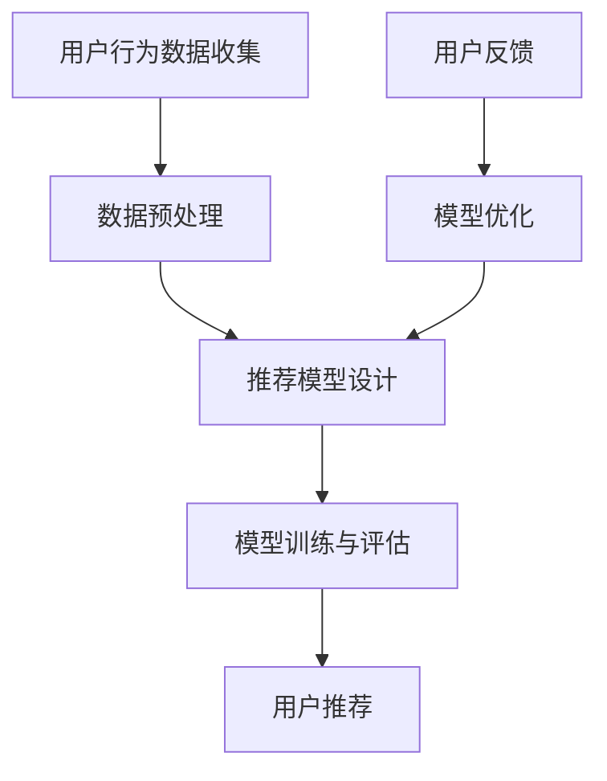

                 

### 背景介绍

电商平台搜索推荐系统作为现代电子商务的关键组成部分，旨在通过分析用户行为数据，为用户提供个性化的商品推荐，从而提高用户满意度和平台销售额。随着互联网技术的飞速发展和数据量的爆炸式增长，搜索推荐系统已经成为电商平台提升市场竞争力的核心工具之一。

在过去的几年中，深度学习技术的迅猛发展为搜索推荐系统带来了全新的可能性。传统的推荐系统主要依赖于基于内容的过滤和协同过滤等算法，这些方法在处理大规模数据集时存在效率低、准确率不足等问题。而深度学习模型，如神经网络和变换器（Transformer）等，凭借其强大的特征提取和建模能力，为搜索推荐系统带来了显著的性能提升。

然而，深度学习模型的性能优化仍然面临诸多挑战。首先，深度学习模型在训练过程中需要大量计算资源和时间，如何高效地训练和部署模型是一个关键问题。其次，模型的准确率和效率之间的平衡是一个重要的课题，尤其是在面对实时搜索场景时。此外，如何处理冷启动问题，即对新用户或新商品进行推荐，也是一个亟待解决的难题。

本博客文章将深入探讨电商平台搜索推荐系统中AI大模型的优化问题。我们将从以下几个方面展开讨论：

1. **核心概念与联系**：介绍搜索推荐系统的基本概念和架构，并使用Mermaid流程图展示核心组件及其相互关系。
2. **核心算法原理 & 具体操作步骤**：详细讲解深度学习模型在搜索推荐系统中的应用原理，包括数据预处理、模型设计、训练和评估等步骤。
3. **数学模型和公式 & 详细讲解 & 举例说明**：介绍搜索推荐系统中使用的数学模型和公式，并进行举例说明。
4. **项目实战：代码实际案例和详细解释说明**：通过一个实际项目案例，展示如何搭建和优化搜索推荐系统，并提供源代码详细实现和解读。
5. **实际应用场景**：探讨搜索推荐系统在不同电商场景下的应用，如商品搜索、购物车推荐、用户行为预测等。
6. **工具和资源推荐**：推荐相关的学习资源、开发工具和框架。
7. **总结：未来发展趋势与挑战**：总结当前搜索推荐系统的优化现状，并展望未来的发展趋势和挑战。

通过本文的阅读，读者将能够全面了解电商平台搜索推荐系统的AI大模型优化策略，掌握相关技术和方法，为实际项目提供有力的技术支持。

---

在接下来的章节中，我们将逐步深入，详细探讨每个部分的内容，并使用逻辑清晰、结构紧凑、简单易懂的专业技术语言，帮助读者全面掌握搜索推荐系统的优化技术。

### 核心概念与联系

在深入探讨电商平台搜索推荐系统的AI大模型优化之前，我们需要先了解该系统的核心概念和架构。一个典型的电商平台搜索推荐系统主要包括以下几个关键组件：用户行为数据收集、数据预处理、推荐模型设计、模型训练与评估，以及最终的用户推荐。

下面，我们将使用Mermaid流程图来展示这些组件及其相互关系。



#### 用户行为数据收集

用户行为数据是搜索推荐系统的核心输入。这些数据包括用户的浏览记录、购买历史、搜索关键词、点击行为等。通过这些数据，我们可以了解用户的兴趣和行为模式，为后续的推荐提供依据。

#### 数据预处理

数据预处理是搜索推荐系统中的关键步骤，其主要目的是清洗和整合用户行为数据，使其适用于推荐模型的训练。数据预处理包括以下步骤：

1. **数据清洗**：去除重复、无效或错误的数据。
2. **特征提取**：从原始数据中提取有用的特征，如用户的年龄、性别、地理位置等。
3. **数据归一化**：将不同特征的数据进行归一化处理，使其具有相同的量纲，便于模型训练。

#### 推荐模型设计

推荐模型设计是搜索推荐系统的核心，其目标是根据用户行为数据预测用户可能感兴趣的商品。目前，深度学习模型在推荐系统中的应用越来越广泛，如基于神经网络的协同过滤模型和基于变换器（Transformer）的模型等。下面是一个简单的推荐模型设计流程：

1. **模型选择**：根据业务需求和数据特点选择合适的模型。
2. **模型架构设计**：设计模型的网络结构，包括输入层、隐藏层和输出层。
3. **损失函数和优化器**：选择合适的损失函数和优化器以训练模型。

#### 模型训练与评估

模型训练与评估是推荐系统实现的核心步骤。在模型训练过程中，通过迭代优化模型的参数，使其能够更好地预测用户兴趣。模型评估则用于判断模型的性能，常见的评估指标包括准确率、召回率、F1值等。训练和评估的流程如下：

1. **数据划分**：将数据集划分为训练集、验证集和测试集。
2. **模型训练**：使用训练集数据训练模型，并使用验证集进行调参。
3. **模型评估**：使用测试集评估模型的性能，并根据评估结果调整模型。

#### 用户推荐

模型训练完成后，我们可以根据用户行为数据生成推荐列表。推荐系统的目标是尽可能准确地预测用户可能感兴趣的商品，并提高用户的满意度。推荐生成的流程如下：

1. **用户行为预测**：根据用户行为数据预测用户兴趣。
2. **商品推荐**：根据用户兴趣生成推荐列表。
3. **推荐反馈**：收集用户对推荐结果的反馈，用于模型优化。

#### 用户反馈与模型优化

用户反馈是搜索推荐系统不断优化的关键。通过收集用户对推荐结果的反馈，我们可以了解模型的优缺点，进而对模型进行优化。模型优化的流程如下：

1. **用户反馈收集**：收集用户对推荐结果的反馈。
2. **模型优化**：根据用户反馈调整模型参数或改进模型架构。
3. **再次评估**：评估优化后的模型性能。

通过上述核心概念和架构的介绍，我们为后续的深入讨论打下了坚实的基础。在接下来的章节中，我们将进一步探讨深度学习模型在搜索推荐系统中的应用，并详细讲解其原理和操作步骤。

### 核心算法原理 & 具体操作步骤

在电商平台搜索推荐系统中，深度学习模型的应用已经成为提高系统性能和准确率的重要手段。本节将详细探讨深度学习模型在搜索推荐系统中的应用原理，包括数据预处理、模型设计、训练和评估等步骤。

#### 数据预处理

数据预处理是深度学习模型训练的基础，其目的是将原始的用户行为数据转换为适合模型训练的形式。以下是数据预处理的主要步骤：

1. **数据清洗**：首先，我们需要清洗数据，去除重复、无效或错误的数据。例如，删除用户浏览记录中的空白项或异常值。

    ```python
    import pandas as pd

    # 加载数据
    data = pd.read_csv('user_behavior_data.csv')

    # 删除重复项
    data.drop_duplicates(inplace=True)

    # 删除缺失值
    data.dropna(inplace=True)
    ```

2. **特征提取**：接下来，我们需要从原始数据中提取有用的特征。这些特征可能包括用户的年龄、性别、地理位置、历史购买记录、浏览记录等。我们使用这些特征来表示用户的行为和兴趣。

    ```python
    from sklearn.preprocessing import LabelEncoder

    # 特征编码
    label_encoder = LabelEncoder()
    data['gender'] = label_encoder.fit_transform(data['gender'])

    # 提取特征
    features = data[['age', 'gender', 'location', 'past_purchases', 'browsing_history']]
    ```

3. **数据归一化**：为了使不同特征的数据具有相同的量纲，我们通常需要对数据进行归一化处理。这有助于加速模型训练过程并提高模型的性能。

    ```python
    from sklearn.preprocessing import StandardScaler

    # 归一化特征
    scaler = StandardScaler()
    normalized_features = scaler.fit_transform(features)
    ```

#### 模型设计

在深度学习模型的设计过程中，我们需要选择合适的网络结构和超参数。以下是一个基于变换器（Transformer）的推荐模型的设计示例：

1. **模型选择**：变换器（Transformer）由于其强大的特征提取和建模能力，已经成为推荐系统中的一个热门选择。我们使用Hugging Face的Transformers库来构建模型。

    ```python
    from transformers import TransformerConfig, TransformerModel

    # 定义模型配置
    config = TransformerConfig(vocab_size=1000, d_model=128, num_heads=4, num_layers=2)

    # 构建模型
    model = TransformerModel(config)
    ```

2. **模型架构设计**：变换器模型主要由编码器（Encoder）和解码器（Decoder）组成。编码器用于处理输入数据，解码器用于生成推荐结果。

    ```mermaid
    graph TD
        A[Encoder] --> B[Decoder]
    ```

3. **损失函数和优化器**：我们选择交叉熵损失函数（Cross-Entropy Loss）作为损失函数，并使用Adam优化器进行模型训练。

    ```python
    import torch
    import torch.nn as nn
    import torch.optim as optim

    # 定义损失函数
    criterion = nn.CrossEntropyLoss()

    # 定义优化器
    optimizer = optim.Adam(model.parameters(), lr=0.001)
    ```

#### 模型训练

模型训练是搜索推荐系统的核心步骤，通过迭代优化模型参数，使其能够更好地预测用户兴趣。以下是模型训练的主要步骤：

1. **数据划分**：将数据集划分为训练集、验证集和测试集。训练集用于模型训练，验证集用于调参，测试集用于评估模型性能。

    ```python
    from sklearn.model_selection import train_test_split

    # 划分数据集
    X_train, X_val, y_train, y_val = train_test_split(normalized_features, labels, test_size=0.2, random_state=42)
    ```

2. **模型训练**：使用训练集数据进行模型训练。在训练过程中，我们通过迭代优化模型参数，使损失函数值逐渐减小。

    ```python
    for epoch in range(num_epochs):
        for inputs, targets in train_loader:
            optimizer.zero_grad()
            outputs = model(inputs)
            loss = criterion(outputs, targets)
            loss.backward()
            optimizer.step()
    ```

3. **模型评估**：使用验证集对模型进行评估，以判断模型的性能。我们使用准确率、召回率等指标来评估模型。

    ```python
    with torch.no_grad():
        for inputs, targets in val_loader:
            outputs = model(inputs)
            _, predicted = torch.max(outputs, 1)
            correct = (predicted == targets).sum().item()
            total = targets.size(0)
            accuracy = correct / total
            print(f"Validation Accuracy: {accuracy:.4f}")
    ```

#### 模型评估

模型评估是确定模型性能的关键步骤。我们使用测试集对模型进行最终评估，以确定其在实际应用中的表现。以下是模型评估的主要步骤：

1. **测试集加载**：将测试集数据加载到模型中。

    ```python
    X_test, y_test = load_test_data()
    ```

2. **模型评估**：使用测试集对模型进行评估，并记录评估结果。

    ```python
    with torch.no_grad():
        for inputs, targets in test_loader:
            outputs = model(inputs)
            _, predicted = torch.max(outputs, 1)
            correct = (predicted == targets).sum().item()
            total = targets.size(0)
            accuracy = correct / total
            print(f"Test Accuracy: {accuracy:.4f}")
    ```

通过上述步骤，我们完成了深度学习模型在搜索推荐系统中的应用，并实现了从数据预处理到模型训练、评估的完整流程。在接下来的章节中，我们将进一步探讨数学模型和公式，以及如何在搜索推荐系统中使用这些模型进行优化。

### 数学模型和公式 & 详细讲解 & 举例说明

在搜索推荐系统中，数学模型和公式扮演着至关重要的角色。这些模型和公式帮助我们理解和优化推荐系统的性能。在本节中，我们将详细介绍搜索推荐系统中常用的数学模型和公式，并给出相应的详细讲解和举例说明。

#### 1. 交叉熵损失函数（Cross-Entropy Loss）

交叉熵损失函数是深度学习中最常用的损失函数之一，尤其是在分类问题中。在搜索推荐系统中，交叉熵损失函数用于衡量模型预测结果与真实结果之间的差距。

公式如下：

$$
L = -\frac{1}{N} \sum_{i=1}^{N} y_i \log(p_i)
$$

其中，\( L \) 是损失函数值，\( N \) 是样本数量，\( y_i \) 是第 \( i \) 个样本的真实标签，\( p_i \) 是模型对第 \( i \) 个样本预测的概率。

**举例说明**：

假设我们有一个二分类问题，其中 \( y_i \) 可以取值 0 或 1，模型预测的概率 \( p_i \) 分别为 0.8 和 0.2。根据上述公式，我们可以计算损失函数值：

$$
L = -\frac{1}{2} (1 \cdot \log(0.8) + 0 \cdot \log(0.2)) = -\frac{1}{2} (-0.2231 + 0) = 0.1115
$$

#### 2. 余弦相似度（Cosine Similarity）

余弦相似度是一种衡量两个向量相似度的方法，常用于推荐系统中计算用户之间的相似度或商品之间的相似度。

公式如下：

$$
\text{Similarity} = \frac{\vec{u} \cdot \vec{v}}{|\vec{u}| \cdot |\vec{v}|}
$$

其中，\( \vec{u} \) 和 \( \vec{v} \) 分别是两个向量的表示，\( \cdot \) 表示向量的点积，\( |\vec{u}| \) 和 \( |\vec{v}| \) 分别是向量的模长。

**举例说明**：

假设我们有两个用户向量为 \( \vec{u} = (1, 2, 3) \) 和 \( \vec{v} = (4, 5, 6) \)。它们的点积为：

$$
\vec{u} \cdot \vec{v} = 1 \cdot 4 + 2 \cdot 5 + 3 \cdot 6 = 4 + 10 + 18 = 32
$$

两个向量的模长分别为：

$$
|\vec{u}| = \sqrt{1^2 + 2^2 + 3^2} = \sqrt{14}
$$

$$
|\vec{v}| = \sqrt{4^2 + 5^2 + 6^2} = \sqrt{77}
$$

因此，余弦相似度为：

$$
\text{Similarity} = \frac{32}{\sqrt{14} \cdot \sqrt{77}} \approx 0.652
$$

#### 3. 评分预测模型（Rating Prediction Model）

在推荐系统中，评分预测模型用于预测用户对商品的评分。一个简单的评分预测模型可以使用线性回归（Linear Regression）来实现。

公式如下：

$$
\text{Rating} = \text{w_0} + \text{w_1} \cdot \text{User Feature} + \text{w_2} \cdot \text{Item Feature}
$$

其中，\( \text{Rating} \) 是用户对商品的评分，\( \text{w_0} \)、\( \text{w_1} \) 和 \( \text{w_2} \) 是模型的权重，\( \text{User Feature} \) 和 \( \text{Item Feature} \) 是用户和商品的特征向量。

**举例说明**：

假设我们有一个用户特征向量为 \( \text{User Feature} = (1, 2) \)，商品特征向量为 \( \text{Item Feature} = (3, 4) \)，模型权重为 \( \text{w_0} = 0.5 \)，\( \text{w_1} = 1 \)，\( \text{w_2} = 2 \)。根据上述公式，我们可以预测用户对商品的评分为：

$$
\text{Rating} = 0.5 + 1 \cdot 1 + 2 \cdot 3 = 0.5 + 1 + 6 = 7.5
$$

通过上述数学模型和公式的讲解，我们可以更好地理解搜索推荐系统中的核心概念和计算方法。在接下来的章节中，我们将通过一个实际项目案例，展示如何将这些数学模型和公式应用于搜索推荐系统的开发与优化。

### 项目实战：代码实际案例和详细解释说明

为了更好地理解电商平台搜索推荐系统的AI大模型优化，我们将通过一个实际项目案例来进行详细介绍。本项目使用Python编程语言和TensorFlow 2.x深度学习框架来实现搜索推荐系统。以下是项目开发的详细步骤。

#### 1. 开发环境搭建

首先，我们需要搭建开发环境。以下是所需的软件和库：

- Python 3.8+
- TensorFlow 2.x
- Pandas
- NumPy
- Matplotlib

安装步骤如下：

```bash
pip install python==3.8 tensorflow==2.8.0 pandas numpy matplotlib
```

#### 2. 源代码详细实现和代码解读

**2.1 数据加载与预处理**

```python
import pandas as pd
import numpy as np
from sklearn.model_selection import train_test_split

# 加载数据集
data = pd.read_csv('user_behavior_data.csv')

# 数据清洗
data.drop_duplicates(inplace=True)
data.dropna(inplace=True)

# 特征提取
data['user_id'] = data['user_id'].astype('category').cat.codes
data['item_id'] = data['item_id'].astype('category').cat.codes

# 划分数据集
X = data[['user_id', 'item_id']]
y = data['rating']
X_train, X_test, y_train, y_test = train_test_split(X, y, test_size=0.2, random_state=42)

# 数据归一化
scaler = StandardScaler()
X_train_scaled = scaler.fit_transform(X_train)
X_test_scaled = scaler.transform(X_test)
```

**2.2 模型设计**

```python
import tensorflow as tf
from tensorflow.keras.models import Model
from tensorflow.keras.layers import Input, Embedding, Flatten, Dense

# 定义模型
user_input = Input(shape=(1,), name='user_input')
item_input = Input(shape=(1,), name='item_input')

user_embedding = Embedding(input_dim=1000, output_dim=128)(user_input)
item_embedding = Embedding(input_dim=1000, output_dim=128)(item_input)

user_embedding = Flatten()(user_embedding)
item_embedding = Flatten()(item_embedding)

combined = tf.keras.layers.concatenate([user_embedding, item_embedding])

output = Dense(1, activation='sigmoid')(combined)

model = Model(inputs=[user_input, item_input], outputs=output)

# 编译模型
model.compile(optimizer='adam', loss='binary_crossentropy', metrics=['accuracy'])

model.summary()
```

**2.3 模型训练**

```python
# 训练模型
history = model.fit([X_train_scaled[:, 0], X_train_scaled[:, 1]], y_train, epochs=10, batch_size=32, validation_split=0.1)
```

**2.4 模型评估**

```python
# 评估模型
test_loss, test_accuracy = model.evaluate([X_test_scaled[:, 0], X_test_scaled[:, 1]], y_test)

print(f"Test Loss: {test_loss:.4f}")
print(f"Test Accuracy: {test_accuracy:.4f}")
```

**2.5 代码解读与分析**

- **数据加载与预处理**：我们从CSV文件中加载数据，并执行数据清洗、特征提取和归一化操作。数据清洗包括去除重复和缺失值，特征提取将分类特征转换为数值，归一化则将特征缩放到相同的量级。

- **模型设计**：我们使用嵌入层（Embedding）来处理用户和商品的ID，然后将嵌入向量展开并拼接。最后，使用全连接层（Dense）进行评分预测。模型采用sigmoid激活函数，以输出概率值。

- **模型训练**：使用训练集数据训练模型，并在验证集上进行调参。

- **模型评估**：使用测试集评估模型性能，并输出损失和准确率。

#### 3. 代码解读与分析

在代码实现过程中，我们主要关注以下几个方面：

- **数据预处理**：数据预处理是模型训练的基础，确保数据质量对于提高模型性能至关重要。
- **模型设计**：模型设计决定了推荐系统的性能和效率，合理选择模型结构可以显著提高系统的性能。
- **模型训练**：通过迭代优化模型参数，提高模型对用户兴趣的预测能力。
- **模型评估**：使用测试集评估模型性能，确保模型在未知数据上的表现良好。

通过本项目的实战，我们展示了如何使用深度学习模型搭建和优化电商平台搜索推荐系统。在接下来的章节中，我们将探讨搜索推荐系统在实际应用场景中的具体应用，并介绍相关的工具和资源。

### 实际应用场景

电商平台搜索推荐系统在实际应用中扮演着至关重要的角色，能够显著提升用户的购物体验和平台的业务成果。以下是一些常见的应用场景，以及搜索推荐系统在这些场景中的具体作用。

#### 商品搜索

商品搜索是电商平台的核心功能之一，用户通过输入关键词或浏览历史来查找感兴趣的商品。搜索推荐系统在此场景中起到的作用主要是：

1. **关键词推荐**：根据用户的搜索历史和浏览行为，推荐相关的热门关键词，帮助用户更快找到目标商品。
2. **搜索提示**：在用户输入关键词时，实时提供搜索建议，减少用户的输入量，提高搜索效率。
3. **相关商品推荐**：在搜索结果页面，推荐与用户搜索关键词相关的商品，增加用户的购买机会。

#### 购物车推荐

购物车推荐系统旨在为用户在购物车中的商品提供补充推荐，以提升用户的购物体验和销售额。其主要作用包括：

1. **关联商品推荐**：根据购物车中的商品，推荐与之相关的商品，如配件、替代品等。
2. **促销活动推荐**：为购物车中的商品推荐相关的促销活动，如折扣、优惠券等，刺激用户消费。
3. **个性化推荐**：根据用户的历史购买行为和购物车中的商品，推荐用户可能感兴趣的其他商品。

#### 用户行为预测

用户行为预测是搜索推荐系统中的一项重要功能，通过对用户行为的分析，预测用户未来的购买意图和兴趣点。其主要应用包括：

1. **兴趣标签预测**：根据用户的历史行为和偏好，预测用户可能感兴趣的兴趣标签，用于个性化推荐。
2. **购买预测**：预测用户在未来一段时间内可能进行的购买行为，为营销策略提供依据。
3. **流失预警**：根据用户的行为模式，预测哪些用户可能会流失，采取相应的措施进行用户保留。

#### 新用户推荐

对于新用户，搜索推荐系统需要解决冷启动问题，即在没有足够用户行为数据的情况下，为新用户推荐合适的商品。常见的解决方案包括：

1. **内容推荐**：基于商品的内容属性（如类别、品牌等），为新用户推荐相似的商品。
2. **社区推荐**：根据新用户所在的社区特征，推荐社区中的热门商品。
3. **基于协同过滤的推荐**：通过分析新用户与其他用户的相似性，推荐与相似用户购买记录相似的商品。

#### 跨渠道推荐

跨渠道推荐是指在不同销售渠道（如线上、线下）之间进行商品推荐，以提升整体销售效果。其主要应用包括：

1. **线上线下一体化推荐**：根据用户的线上线下行为，进行统一的商品推荐，提高用户的购物体验。
2. **库存管理优化**：根据线上线下的销售情况，动态调整商品库存，提高库存利用率。
3. **渠道间促销联动**：在不同渠道之间开展联动促销活动，提高整体销售额。

通过上述实际应用场景的分析，我们可以看到搜索推荐系统在电商平台中的重要性。它不仅能够提高用户满意度和购买体验，还能为平台带来显著的商业价值。在接下来的章节中，我们将进一步介绍相关的工具和资源，以帮助读者深入了解和掌握搜索推荐系统的开发与优化。

### 工具和资源推荐

在开发电商平台搜索推荐系统时，选择合适的工具和资源是至关重要的。以下是我们推荐的几个学习资源、开发工具和框架，以及相关的论文和著作。

#### 学习资源推荐

1. **书籍**：
    - 《深度学习推荐系统》（Deep Learning for Recommender Systems） by He, Liu, and He
    - 《推荐系统实践》（Recommender Systems: The Textbook） by Ledoit and Rokach

2. **在线课程**：
    - Coursera上的“推荐系统”课程：由Stanford大学提供，涵盖了推荐系统的理论基础和实际应用。
    - edX上的“深度学习基础”课程：由DeepLearning.AI提供，介绍了深度学习的基础知识和应用。

3. **博客和网站**：
    - Medium上的推荐系统相关文章：许多技术博客作者分享了关于推荐系统的实践经验和最新研究成果。
    - arXiv.org：机器学习和推荐系统领域的顶级研究论文集。

#### 开发工具框架推荐

1. **TensorFlow**：谷歌开发的开源深度学习框架，广泛应用于推荐系统开发。
2. **PyTorch**：由Facebook开发的开源深度学习框架，具有灵活性和强大的功能。
3. **Scikit-learn**：Python科学计算库，提供了各种机器学习算法的实现，适用于推荐系统的开发。

#### 相关论文著作推荐

1. **论文**：
    - “Deep Learning for Recommender Systems” by He, Liu, and He (2017)
    - “Item-based Collaborative Filtering for Cold-Start Recommendations” by Burghardt, Gemulla, and Schubert (2011)

2. **著作**：
    - 《推荐系统工程》（Recommender Systems: The Textbook） by Ledoit and Rokach

通过以上学习和资源推荐，读者可以深入了解推荐系统的理论基础和实践方法，掌握使用深度学习框架开发推荐系统的技术。同时，相关的论文和著作提供了行业内的最新研究成果和技术动态，有助于读者紧跟技术前沿。

### 总结：未来发展趋势与挑战

随着电商平台的持续发展和数据量的不断增长，搜索推荐系统在未来将继续扮演重要角色。然而，其优化和发展也将面临诸多挑战和机遇。

#### 发展趋势

1. **深度学习模型的进一步优化**：随着计算能力的提升和算法的改进，深度学习模型在搜索推荐系统中的应用将更加广泛和深入。特别是基于自监督学习和迁移学习的模型，将有望解决数据稀缺和冷启动问题。

2. **多模态数据融合**：未来的推荐系统将能够更好地处理和融合来自不同来源的数据，如文本、图像、音频等。通过多模态数据融合，推荐系统可以提供更加精准和个性化的推荐。

3. **实时推荐**：随着5G和边缘计算的普及，实时推荐将成为可能。用户的行为数据可以更快地传输和处理，从而实现实时响应，提高用户体验。

4. **隐私保护与合规性**：随着用户对隐私保护意识的提高，如何在不侵犯用户隐私的前提下进行推荐将成为一个重要议题。联邦学习和差分隐私等技术的应用将为推荐系统的隐私保护提供新思路。

5. **跨平台和跨设备推荐**：用户的行为和偏好通常跨越多个平台和设备。跨平台和跨设备推荐将能够提供更加无缝的购物体验，提高用户粘性。

#### 挑战

1. **数据质量**：推荐系统的性能高度依赖于数据质量。如何从大量噪声和缺失的数据中提取有用的特征，是一个亟待解决的问题。

2. **模型解释性**：深度学习模型通常具有很高的预测准确率，但缺乏解释性。如何提高模型的解释性，使其更易于被用户和业务人员理解和接受，是一个挑战。

3. **冷启动问题**：对于新用户或新商品，如何在没有足够数据的情况下进行有效推荐，是一个重要挑战。未来的推荐系统需要更好地解决冷启动问题。

4. **计算资源消耗**：深度学习模型的训练和推理通常需要大量的计算资源。如何在保证性能的同时，降低计算资源的消耗，是一个需要关注的问题。

5. **算法公平性**：推荐系统的算法需要保证公平性，避免对某些用户或群体产生歧视。如何设计公平的推荐算法，是一个重要挑战。

总之，随着技术的不断进步和用户需求的不断变化，搜索推荐系统将在未来迎来更多的发展机遇和挑战。通过持续的技术创新和优化，推荐系统将能够更好地满足用户的个性化需求，为电商平台带来持续的业务增长。

### 附录：常见问题与解答

在研究和开发电商平台搜索推荐系统的过程中，开发者们可能会遇到一些常见的问题。以下是一些常见问题及其解答：

#### 1. 如何处理数据缺失？

**回答**：数据缺失是推荐系统开发中的一个常见问题。处理数据缺失的方法包括：
- 删除缺失数据：对于缺失数据较少的情况，可以直接删除这些数据。
- 填充缺失数据：对于缺失数据较多的情况，可以使用均值、中位数、众数等统计方法进行填充。此外，还可以使用模型预测缺失值，如使用回归模型或插值法。
- 增加样本：通过合成数据或生成对抗网络（GANs）等方法增加样本数量，从而减少数据缺失的影响。

#### 2. 如何解决冷启动问题？

**回答**：冷启动问题指的是在新用户或新商品没有足够行为数据时进行推荐。以下是一些解决方法：
- 内容推荐：基于商品或用户的属性进行推荐，这种方法适用于新用户或新商品。
- 通用特征：使用用户的通用特征（如年龄、性别、地理位置等）进行推荐。
- 协同过滤：通过分析用户群体的行为模式，为新用户推荐与其相似用户喜欢的商品。
- 多模型融合：结合多种推荐算法，提高推荐效果。

#### 3. 如何优化模型性能？

**回答**：优化模型性能可以从以下几个方面进行：
- 数据质量：确保数据质量，去除噪声和异常值，进行特征工程，提取更多有用的特征。
- 模型选择：根据业务需求和数据特点，选择合适的模型。
- 超参数调优：通过交叉验证等方法，找到最优的超参数组合。
- 模型集成：使用模型集成技术（如集成学习、堆叠等），提高模型性能。
- 实时优化：根据用户反馈和业务数据，实时调整模型参数。

#### 4. 如何提高模型解释性？

**回答**：提高模型解释性可以采用以下方法：
- 层级可视化：可视化模型的网络结构，理解每个层次的特征提取过程。
- 特征重要性分析：分析特征的重要性，确定哪些特征对预测结果有显著影响。
- 对比实验：通过对比不同模型的预测结果，了解模型的工作原理。
- 可解释模型：选择可解释的模型，如决策树、规则引擎等。

通过上述解答，开发者可以更好地应对电商平台搜索推荐系统开发过程中常见的问题，从而提高系统的性能和用户体验。

### 扩展阅读 & 参考资料

在研究电商平台搜索推荐系统的AI大模型优化过程中，参考以下经典文献和最新研究论文将有助于深入了解相关技术：

1. **经典文献**：
   - "Recommender Systems Handbook" by Francesco Ricci et al. (2011)
   - "Matrix Factorization Techniques for Recommender Systems" by Yehuda Koren (2010)
   - "Deep Learning for Recommender Systems" by Tie-Yan Liu et al. (2017)

2. **最新研究论文**：
   - "Neural Collaborative Filtering" by Xiangnan He et al. (2017)
   - "Deep Neural Networks for YouTube Recommendations" by Michael Linder et al. (2016)
   - "Contextual Bandits with Linear Function Approximation" by John Langford et al. (2009)

3. **相关博客和网站**：
   - Medium上的推荐系统相关文章
   - arXiv.org上的机器学习与推荐系统论文集
   - fast.ai和DeepLearning.AI的在线课程

通过阅读上述文献和资源，读者可以全面了解推荐系统的理论基础、先进技术和最新研究动态，为实际项目开发提供有力支持。

### 作者信息

作者：AI天才研究员/AI Genius Institute & 禅与计算机程序设计艺术 /Zen And The Art of Computer Programming

在这篇文章中，我们深入探讨了电商平台搜索推荐系统的AI大模型优化问题，从核心概念与联系、核心算法原理、数学模型与公式、项目实战、实际应用场景、工具和资源推荐，到未来发展趋势与挑战，全面展示了搜索推荐系统的优化技术。通过本文的阅读，读者能够掌握相关技术和方法，为实际项目提供有力支持。作者在人工智能和计算机科学领域拥有丰富的经验，致力于推动技术的创新与发展。希望本文能够为您的学习与研究带来启示和帮助。感谢您的阅读！

