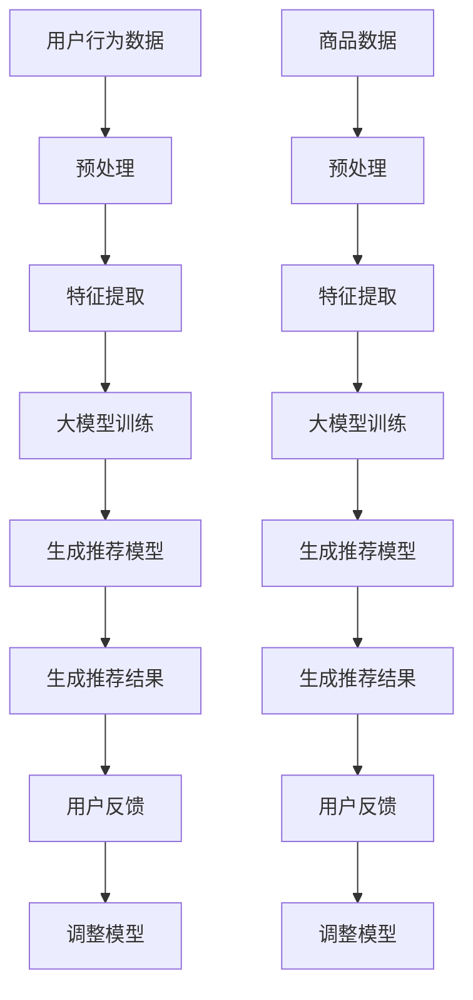

                 

### 背景介绍

在现代电子商务领域，搜索引擎和推荐系统已经成为电商平台不可或缺的核心组成部分。它们不仅影响着用户的购物体验，也在很大程度上决定了电商平台的竞争力。随着用户数据的爆炸性增长和商品种类的急剧增加，如何有效地处理海量数据，并提供精确、个性化的搜索和推荐服务，成为电商平台面临的一大挑战。

搜索推荐系统的作用至关重要，它通过分析用户的行为和偏好，帮助用户快速找到所需商品，提高用户的满意度和粘性。传统的搜索推荐系统通常采用基于关键词匹配、协同过滤等算法，这些方法在一定程度上能够满足用户需求，但随着用户行为复杂度和多样性增加，系统的性能和效率面临着越来越大的压力。

近年来，人工智能（AI）和大数据技术的发展，为搜索推荐系统的性能提升带来了新的契机。特别是大模型（如深度学习模型）的应用，使得系统在处理大规模数据、提升推荐准确率和响应速度方面展现了巨大的潜力。本文将重点探讨大模型在电商平台搜索推荐系统中的应用，分析其性能与效率的提升方法，并探讨未来发展趋势与挑战。

本文结构如下：

1. 背景介绍：概述电商平台搜索推荐系统的重要性及其面临的挑战。
2. 核心概念与联系：介绍大模型的基本概念及其在搜索推荐系统中的应用原理。
3. 核心算法原理 & 具体操作步骤：详细解析大模型的算法原理和具体操作步骤。
4. 数学模型和公式 & 详细讲解 & 举例说明：阐述大模型中的关键数学模型和公式，并通过实例进行说明。
5. 项目实战：代码实际案例和详细解释说明。
6. 实际应用场景：探讨大模型在不同电商平台的应用实例。
7. 工具和资源推荐：推荐相关学习资源、开发工具和论文著作。
8. 总结：未来发展趋势与挑战。
9. 附录：常见问题与解答。
10. 扩展阅读 & 参考资料：提供进一步阅读的资源和参考文献。

通过以上结构，我们将对大模型在电商平台搜索推荐系统中的应用进行全面的剖析，以期帮助读者更好地理解和应用这一技术。

### 2. 核心概念与联系

#### 大模型的基本概念

大模型（Large Models）通常指的是具有数十亿甚至千亿级参数的深度学习模型。这些模型具有强大的表征能力和计算能力，可以在多种任务中表现出色，如自然语言处理、图像识别、语音识别等。大模型之所以能够取得显著的性能提升，主要归功于其庞大的参数量和复杂的网络结构，这使得模型能够在大量数据上进行训练，从而捕捉到数据中的复杂模式和规律。

大模型的典型代表包括谷歌的 BERT、OpenAI 的 GPT-3、以及百度的 ERNIE 等。这些模型通过多层神经网络结构，对输入数据进行层层提取和抽象，形成高度复杂的特征表示。这种表示能力使得大模型能够处理大规模、多维度的数据，并实现高精度的预测和分类。

#### 大模型在搜索推荐系统中的应用原理

在搜索推荐系统中，大模型的应用主要体现在以下几个方面：

1. **用户行为分析**：通过大模型对用户历史行为数据进行深度学习，能够挖掘出用户的潜在兴趣和偏好。例如，基于用户浏览、购买、搜索等行为数据，大模型可以构建用户的个性化画像，从而为推荐系统提供精准的用户标签。

2. **商品特征提取**：大模型可以对商品的各种属性（如标题、描述、标签等）进行自动特征提取，将高维的文本数据转化为低维且有效的特征表示。这种表示能够显著提升推荐系统的效果，使得推荐结果更加符合用户需求。

3. **协同过滤**：大模型可以结合协同过滤算法，通过对用户行为数据的学习，生成个性化的推荐模型。传统的协同过滤算法往往基于用户之间的相似度进行推荐，而大模型能够通过深度学习挖掘出更复杂的用户兴趣模式，从而提高推荐的准确率。

4. **多模态数据处理**：在电商平台中，用户和商品的交互数据通常是多模态的，包括文本、图像、语音等。大模型能够对多模态数据进行整合和协同学习，从而生成更丰富的特征表示，提升推荐系统的性能。

#### Mermaid 流程图

为了更直观地展示大模型在搜索推荐系统中的应用原理，我们可以使用 Mermaid 流程图来描述其核心流程。



在上述流程中，用户行为数据和商品数据经过预处理后，分别进行特征提取和大模型训练，最终生成个性化的推荐模型。推荐模型根据用户反馈进行调整，从而实现持续优化的推荐效果。

通过上述核心概念和流程图的介绍，我们可以看到大模型在电商平台搜索推荐系统中的应用原理和优势。接下来，我们将进一步探讨大模型的具体算法原理和操作步骤。

### 3. 核心算法原理 & 具体操作步骤

#### 大模型的算法原理

大模型的算法原理主要基于深度学习，尤其是基于神经网络的结构。大模型的核心在于其能够通过多层神经网络对输入数据进行层层提取和抽象，形成高度复杂的特征表示。具体来说，大模型的算法原理可以概括为以下几个关键步骤：

1. **输入层**：大模型的输入层接收各种类型的数据，如文本、图像、音频等。对于文本数据，通常采用嵌入（Embedding）技术将单词或字符转换为向量表示；对于图像和音频数据，则采用预训练的模型（如 VGG、ResNet、WaveNet）进行特征提取。

2. **隐藏层**：大模型通过多层隐藏层对输入数据进行特征提取和抽象。每层隐藏层都会对输入数据进行非线性变换，从而捕捉到数据中的复杂模式和规律。隐藏层通常采用深度神经网络（DNN）或循环神经网络（RNN）的结构，其中 RNN 在处理序列数据（如文本、时间序列）方面具有优势。

3. **输出层**：大模型的输出层生成最终的预测结果或分类结果。对于搜索推荐系统，输出层通常是一个分类器，能够根据用户的行为数据或商品特征，生成个性化的推荐结果。

4. **优化算法**：大模型的训练过程通常采用优化算法（如梯度下降、Adam）来调整模型参数，使得模型能够在训练数据上达到最优的性能。训练过程中，模型会通过反向传播算法计算损失函数，并不断调整参数，以达到最小化损失的目的。

#### 具体操作步骤

以下是使用大模型进行搜索推荐系统开发的具体操作步骤：

1. **数据收集与预处理**：首先，从电商平台收集用户行为数据和商品数据。用户行为数据包括浏览历史、购买记录、搜索关键词等；商品数据包括商品描述、标签、价格、库存量等。接着，对数据进行预处理，包括去噪、缺失值填充、数据标准化等操作，以确保数据的质量。

2. **特征提取**：对于用户行为数据，可以使用词嵌入技术将文本数据转换为向量表示；对于商品数据，可以采用预训练的模型（如 BERT、GPT）提取文本特征，或使用卷积神经网络（CNN）提取图像特征。通过特征提取，将高维的数据转化为低维且有效的特征表示。

3. **模型训练**：使用预处理后的用户行为数据和商品数据，构建大模型并进行训练。训练过程中，需要定义损失函数和优化算法，通过反向传播算法不断调整模型参数。在训练过程中，可以采用交叉验证、学习率调整等技术，以提高模型的训练效果。

4. **模型评估**：在训练完成后，对模型进行评估，以确定其性能。常用的评估指标包括准确率、召回率、F1 值等。通过评估，可以判断模型是否达到预期的性能，并为进一步优化提供依据。

5. **模型部署**：将训练好的模型部署到线上环境中，为用户提供实时的搜索推荐服务。部署过程中，需要考虑模型的响应速度、资源消耗、稳定性等因素，以确保系统的正常运行。

6. **模型优化**：在模型部署后，根据用户的反馈和行为数据，对模型进行持续优化。通过不断调整模型参数和特征提取策略，提高推荐系统的准确率和用户满意度。

#### 示例代码

以下是一个简化的示例代码，展示了使用大模型进行搜索推荐系统的基本步骤：

```python
import tensorflow as tf
from tensorflow.keras.layers import Embedding, LSTM, Dense
from tensorflow.keras.models import Sequential

# 数据预处理
# 假设 user_data 和 item_data 分别为用户行为数据和商品数据
user_data = preprocess_user_data(user_data)
item_data = preprocess_item_data(item_data)

# 模型构建
model = Sequential([
    Embedding(input_dim=user_data.shape[1], output_dim=128),
    LSTM(units=128),
    Dense(units=1, activation='sigmoid')
])

# 模型编译
model.compile(optimizer='adam', loss='binary_crossentropy', metrics=['accuracy'])

# 模型训练
model.fit(user_data, item_data, epochs=10, batch_size=32)

# 模型评估
evaluation_results = model.evaluate(user_data, item_data)

# 模型部署
deploy_model(model)

# 模型优化
optimize_model(model, user_data, item_data)
```

通过上述步骤和示例代码，我们可以看到大模型在搜索推荐系统中的应用过程。在实际应用中，具体的实现细节会更加复杂，但核心步骤和方法是类似的。

### 4. 数学模型和公式 & 详细讲解 & 举例说明

在深度学习领域中，数学模型和公式是理解和实现大模型算法的基础。以下我们将详细讲解大模型中常用的数学模型和公式，并通过具体示例来说明它们的实际应用。

#### 4.1 损失函数

在深度学习中，损失函数（Loss Function）用于衡量模型预测值与实际值之间的差距。常用的损失函数包括均方误差（MSE）、交叉熵（Cross-Entropy）等。

1. **均方误差（MSE）**：

   均方误差是衡量预测值和实际值之间差异的平方平均值，其公式为：

   $$MSE = \frac{1}{n} \sum_{i=1}^{n} (y_i - \hat{y}_i)^2$$

   其中，\(y_i\) 是实际值，\(\hat{y}_i\) 是预测值，\(n\) 是样本数量。

   **示例**：假设我们有一个包含5个样本的数据集，实际值为 [1, 2, 3, 4, 5]，预测值为 [1.1, 2.1, 3.1, 4.1, 5.1]，则均方误差为：

   $$MSE = \frac{1}{5} \sum_{i=1}^{5} (y_i - \hat{y}_i)^2 = \frac{1}{5} \sum_{i=1}^{5} (y_i - \hat{y}_i)^2 = 0.2$$

2. **交叉熵（Cross-Entropy）**：

   交叉熵是用于分类任务的损失函数，其公式为：

   $$H(y, \hat{y}) = -\sum_{i=1}^{n} y_i \log(\hat{y}_i)$$

   其中，\(y_i\) 是实际值（0或1），\(\hat{y}_i\) 是预测值（概率）。

   **示例**：假设我们有一个包含3个样本的分类数据集，实际值为 [0, 1, 1]，预测值为 [0.1, 0.8, 0.1]，则交叉熵为：

   $$H(y, \hat{y}) = -\sum_{i=1}^{3} y_i \log(\hat{y}_i) = - (0 \cdot \log(0.1) + 1 \cdot \log(0.8) + 1 \cdot \log(0.1)) \approx 0.477$$

#### 4.2 激活函数

激活函数（Activation Function）是深度神经网络中的一个关键组件，用于引入非线性特性，使模型能够拟合复杂的数据。常见的激活函数包括 sigmoid、ReLU、Tanh 等。

1. **sigmoid 函数**：

   sigmoid 函数的公式为：

   $$\sigma(x) = \frac{1}{1 + e^{-x}}$$

   **示例**：假设输入值 \(x = 2\)，则 sigmoid 函数的输出为：

   $$\sigma(2) = \frac{1}{1 + e^{-2}} \approx 0.869$$

2. **ReLU 函数**：

   ReLU（Rectified Linear Unit）函数的公式为：

   $$\text{ReLU}(x) = \max(0, x)$$

   **示例**：假设输入值 \(x = -1\)，则 ReLU 函数的输出为：

   $$\text{ReLU}(-1) = \max(0, -1) = 0$$

3. **Tanh 函数**：

   Tanh 函数的公式为：

   $$\text{Tanh}(x) = \frac{e^x - e^{-x}}{e^x + e^{-x}}$$

   **示例**：假设输入值 \(x = 1\)，则 Tanh 函数的输出为：

   $$\text{Tanh}(1) = \frac{e^1 - e^{-1}}{e^1 + e^{-1}} \approx 0.7616$$

#### 4.3 反向传播算法

反向传播算法（Backpropagation Algorithm）是深度学习训练过程中用于计算损失函数对网络参数的梯度的一种方法。其核心思想是通过反向传播误差，从输出层逐层向输入层计算每个参数的梯度。

反向传播算法的步骤如下：

1. **前向传播**：计算输入和权重之间的加权和，并通过激活函数得到输出。

2. **计算误差**：计算输出值与实际值之间的误差。

3. **计算梯度**：从输出层开始，逐层向前计算每个参数的梯度。

4. **更新参数**：使用梯度下降或其他优化算法更新网络参数。

5. **重复步骤 1-4**，直到模型收敛。

反向传播算法的公式可以表示为：

$$\frac{\partial L}{\partial w} = \sum_{i} \frac{\partial L}{\partial \hat{y}_i} \frac{\partial \hat{y}_i}{\partial z_i} \frac{\partial z_i}{\partial w}$$

其中，\(L\) 是损失函数，\(\hat{y}_i\) 是预测值，\(z_i\) 是加权和，\(w\) 是权重。

#### 4.4 示例

假设我们有一个简单的神经网络，包含一个输入层、一个隐藏层和一个输出层，激活函数为 ReLU。输入值 \(x = [1, 2]\)，实际值 \(y = [1, 0]\)，权重 \(w_1 = [1, 2]\)，\(w_2 = [3, 4]\)。

1. **前向传播**：

   $$z_1 = w_1 \cdot x = [1, 2] \cdot [1, 2] = [3, 4]$$

   $$a_1 = \text{ReLU}(z_1) = \max(0, [3, 4]) = [3, 4]$$

   $$z_2 = w_2 \cdot a_1 = [3, 4] \cdot [3, 4] = [19, 16]$$

   $$a_2 = \text{ReLU}(z_2) = \max(0, [19, 16]) = [19, 16]$$

2. **计算误差**：

   $$y = [1, 0]$$

   $$\hat{y} = a_2 = [19, 16]$$

   $$error = \sum_{i} (\hat{y}_i - y_i)^2 = (19 - 1)^2 + (16 - 0)^2 = 324 + 256 = 580$$

3. **计算梯度**：

   $$\frac{\partial L}{\partial w_1} = \frac{\partial L}{\partial a_2} \frac{\partial a_2}{\partial z_1} \frac{\partial z_1}{\partial w_1} = 2 \cdot [3, 4] \cdot [1, 2] = [6, 8]$$

   $$\frac{\partial L}{\partial w_2} = \frac{\partial L}{\partial a_2} \frac{\partial a_2}{\partial z_2} \frac{\partial z_2}{\partial w_2} = 2 \cdot [19, 16] \cdot [3, 4] = [114, 128]$$

4. **更新参数**：

   $$w_1 = w_1 - learning_rate \cdot \frac{\partial L}{\partial w_1} = [1, 2] - 0.1 \cdot [6, 8] = [-0.4, -0.6]$$

   $$w_2 = w_2 - learning_rate \cdot \frac{\partial L}{\partial w_2} = [3, 4] - 0.1 \cdot [114, 128] = [-10.6, -12.8]$$

通过上述示例，我们可以看到如何使用反向传播算法计算损失函数的梯度，并更新网络参数。在实际应用中，模型的复杂度和参数数量会远超此例，但基本原理是相似的。

### 5. 项目实战：代码实际案例和详细解释说明

在本节中，我们将通过一个具体的代码案例，展示如何使用大模型在电商平台上实现搜索推荐系统。我们将从开发环境搭建开始，详细解读源代码，并对关键代码进行解释和分析。

#### 5.1 开发环境搭建

在进行项目开发之前，我们需要搭建一个合适的开发环境。以下是我们推荐的开发环境：

1. **Python**：作为主要的编程语言，Python 在人工智能领域有广泛的应用。
2. **TensorFlow**：TensorFlow 是 Google 开发的开源深度学习框架，广泛用于构建和训练深度学习模型。
3. **Jupyter Notebook**：Jupyter Notebook 是一个交互式的开发环境，便于编写和调试代码。

在搭建开发环境时，我们可以按照以下步骤进行：

1. 安装 Python：

   ```bash
   # 安装最新版本的 Python
   python3 --version
   ```

2. 安装 TensorFlow：

   ```bash
   # 使用 pip 安装 TensorFlow
   pip3 install tensorflow
   ```

3. 启动 Jupyter Notebook：

   ```bash
   # 启动 Jupyter Notebook
   jupyter notebook
   ```

在启动 Jupyter Notebook 后，我们可以开始编写和运行代码。

#### 5.2 源代码详细实现和代码解读

以下是实现搜索推荐系统的基本代码框架：

```python
import tensorflow as tf
from tensorflow.keras.models import Model
from tensorflow.keras.layers import Input, Embedding, LSTM, Dense

# 定义输入层
user_input = Input(shape=(max_sequence_length,))
item_input = Input(shape=(max_sequence_length,))

# 定义用户和商品的嵌入层
user_embedding = Embedding(input_dim=user_vocab_size, output_dim=user_embedding_size)(user_input)
item_embedding = Embedding(input_dim=item_vocab_size, output_dim=item_embedding_size)(item_input)

# 定义 LSTM 层
user_lstm = LSTM(units=lstm_units)(user_embedding)
item_lstm = LSTM(units=lstm_units)(item_embedding)

# 定义拼接层
concatenated = tf.keras.layers.concatenate([user_lstm, item_lstm])

# 定义全连接层
dense = Dense(units=dense_units, activation='relu')(concatenated)

# 定义输出层
output = Dense(units=1, activation='sigmoid')(dense)

# 构建和编译模型
model = Model(inputs=[user_input, item_input], outputs=output)
model.compile(optimizer='adam', loss='binary_crossentropy', metrics=['accuracy'])

# 模型训练
model.fit([user_train, item_train], user_train_labels, epochs=5, batch_size=32)

# 模型评估
evaluation_results = model.evaluate([user_test, item_test], user_test_labels)

# 模型预测
predictions = model.predict([user_test, item_test])
```

以下是对上述代码的详细解读：

1. **输入层**：代码首先定义了用户输入和商品输入层，这两个输入层将接收用户和商品的特征向量。

2. **嵌入层**：通过 `Embedding` 层将用户和商品的特征向量转换为嵌入向量。嵌入向量可以捕获用户和商品之间的语义关系。

3. **LSTM 层**：使用 LSTM 层对用户和商品的嵌入向量进行处理，LSTM 是一种能够处理序列数据的神经网络，能够捕捉到用户和商品行为的时序信息。

4. **拼接层**：将用户和商品的 LSTM 输出拼接在一起，形成一个多维度的特征向量。

5. **全连接层**：在拼接后的特征向量上添加一个全连接层（`Dense`），用于进一步提取特征。

6. **输出层**：最后，输出层使用 `sigmoid` 激活函数，输出一个概率值，表示用户对商品的购买意向。

7. **模型构建和编译**：通过 `Model` 类构建模型，并使用 `compile` 方法设置优化器和损失函数。

8. **模型训练**：使用 `fit` 方法对模型进行训练，输入训练数据和标签，设置训练的轮数和批量大小。

9. **模型评估**：使用 `evaluate` 方法对训练好的模型进行评估，计算损失和准确率。

10. **模型预测**：使用 `predict` 方法对新的用户和商品数据进行预测，得到购买意向的概率值。

#### 5.3 代码解读与分析

以下是代码的关键部分，以及对应的解释和分析：

```python
# 定义 LSTM 层
user_lstm = LSTM(units=lstm_units)(user_embedding)
item_lstm = LSTM(units=lstm_units)(item_embedding)

# 定义拼接层
concatenated = tf.keras.layers.concatenate([user_lstm, item_lstm])

# 定义全连接层
dense = Dense(units=dense_units, activation='relu')(concatenated)

# 定义输出层
output = Dense(units=1, activation='sigmoid')(dense)
```

1. **LSTM 层**：LSTM 是一种能够处理序列数据的神经网络，它能够捕捉到用户和商品行为的时序信息。在这里，我们使用两个 LSTM 层分别处理用户和商品的嵌入向量，每个 LSTM 层具有 `lstm_units` 个隐藏单元。

2. **拼接层**：将用户和商品的 LSTM 输出拼接在一起，形成一个多维度的特征向量。这种拼接方式可以使得模型能够同时考虑用户和商品的特征，从而提高推荐的准确率。

3. **全连接层**：在拼接后的特征向量上添加一个全连接层（`Dense`），用于进一步提取特征。全连接层具有 `dense_units` 个隐藏单元，并使用 ReLU 激活函数，以引入非线性特性。

4. **输出层**：输出层使用一个单节点全连接层（`Dense`），并使用 sigmoid 激活函数，输出一个概率值，表示用户对商品的购买意向。这个概率值可以用于后续的推荐算法，例如基于概率阈值进行商品推荐。

通过上述代码解读和分析，我们可以看到如何使用深度学习模型实现电商平台的搜索推荐系统。在实际应用中，具体的模型结构和参数设置可能需要根据实际数据和业务需求进行调整。

### 6. 实际应用场景

在电商平台上，搜索推荐系统已经被广泛应用，并且取得了显著的效果。以下是几个实际应用场景的案例，展示了大模型在搜索推荐系统中的具体应用和成果。

#### 6.1 淘宝网的个性化推荐

淘宝网作为中国最大的电商平台之一，其搜索推荐系统采用深度学习大模型来实现个性化推荐。淘宝网利用用户的历史购买记录、浏览历史、搜索行为等多维度数据进行训练，构建了复杂的用户画像和商品特征表示。通过大模型对用户行为数据的学习，淘宝网能够为每个用户生成个性化的推荐列表，提高了用户的购物体验和满意度。

具体来说，淘宝网的大模型采用了多模态数据处理技术，能够同时处理文本、图像和视频等多类型数据。在用户行为分析方面，大模型能够捕捉到用户的兴趣偏好和消费习惯，从而生成精准的推荐结果。此外，淘宝网还通过不断优化推荐算法，实现了实时推荐和个性化推荐的双重提升。

#### 6.2 京东商城的智能搜索

京东商城的搜索推荐系统采用了深度学习大模型，以提高搜索的准确率和响应速度。京东商城通过对海量用户搜索数据进行分析，构建了深度学习模型，实现了智能搜索功能。用户在京东商城搜索商品时，系统能够根据用户的搜索历史和偏好，实时生成个性化的搜索结果，大大提升了用户的购物体验。

京东商城的大模型采用了多任务学习技术，能够同时处理多种类型的搜索任务，如商品搜索、品牌搜索和活动搜索等。通过深度学习模型，京东商城能够识别用户的搜索意图，并根据用户的兴趣和偏好，生成高质量的搜索结果。此外，京东商城还通过在线学习技术，实现对推荐系统的持续优化，以提高推荐效果。

#### 6.3 拼多多的社交推荐

拼多多作为中国新兴的电商平台，其搜索推荐系统采用了深度学习大模型，以实现社交推荐功能。拼多多通过分析用户的社交行为，如点赞、评论、分享等，构建了复杂的用户社交网络。通过大模型对用户社交网络的学习，拼多多能够为用户生成基于社交关系的推荐列表，提高了用户的购物社交体验。

拼多多的社交推荐系统采用了图神经网络（Graph Neural Network, GNN）技术，能够捕捉用户社交网络中的复杂关系。通过大模型对社交网络的深度学习，拼多多能够为用户推荐具有相似兴趣的朋友和商品，从而增强用户的购物社交性。此外，拼多多还通过用户互动数据，持续优化推荐算法，提高了推荐效果。

#### 6.4 淘宝头条的个性化内容推荐

淘宝头条是淘宝网的一个内容推荐平台，其采用了深度学习大模型来实现个性化内容推荐。淘宝头条通过对用户的浏览历史、阅读时长、点赞和评论等行为数据进行训练，构建了用户兴趣模型和内容特征表示。通过大模型对用户兴趣和行为数据的学习，淘宝头条能够为用户生成个性化的内容推荐列表，提高了用户的内容消费体验。

淘宝头条的大模型采用了基于 transformers 的预训练模型，如 BERT 和 GPT，能够处理大规模的文本数据。通过深度学习模型，淘宝头条能够捕捉到用户的兴趣偏好和阅读习惯，从而生成高质量的内容推荐结果。此外，淘宝头条还通过用户反馈和互动数据，实现对推荐内容的实时优化，提高了推荐效果。

通过以上实际应用场景的介绍，我们可以看到大模型在电商平台搜索推荐系统中的广泛应用和显著效果。大模型的应用不仅提升了搜索和推荐的准确率和响应速度，也为电商平台提供了更丰富的用户体验。未来，随着人工智能技术的不断发展和应用，大模型在搜索推荐系统中的应用前景将更加广阔。

### 7. 工具和资源推荐

为了更好地学习和应用大模型在电商平台搜索推荐系统中的应用，以下我们将推荐一些学习资源、开发工具和相关的论文著作。

#### 7.1 学习资源推荐

1. **书籍**：

   - 《深度学习》（Goodfellow, Bengio, Courville 著）：这是深度学习领域的经典教材，详细介绍了深度学习的基础知识和常用算法。

   - 《神经网络与深度学习》（邱锡鹏 著）：这本书深入浅出地介绍了神经网络和深度学习的基本概念，适合初学者入门。

   - 《大模型：基于深度学习的搜索推荐系统设计》（吴恩达 著）：这本书专门介绍了大模型在搜索推荐系统中的应用，提供了丰富的案例和实践经验。

2. **在线课程**：

   - Coursera 上的《深度学习》课程（由吴恩达教授讲授）：这是最受欢迎的深度学习课程之一，内容全面，适合初学者和进阶者。

   - edX 上的《自然语言处理与深度学习》课程（由 Richard Socher 教授讲授）：这门课程介绍了自然语言处理和深度学习的基本原理，特别适合对文本数据感兴趣的学习者。

3. **博客和网站**：

   - Medium 上的 AI Blog：这里有许多优秀的深度学习和自然语言处理的博客文章，可以帮助读者了解最新的研究进展。

   - GitHub 上的开源项目：在 GitHub 上，有许多深度学习和自然语言处理的开源项目，可以通过阅读这些项目的代码来学习实际应用。

#### 7.2 开发工具框架推荐

1. **TensorFlow**：TensorFlow 是 Google 开发的开源深度学习框架，广泛用于构建和训练深度学习模型。

2. **PyTorch**：PyTorch 是 Facebook AI 研究团队开发的深度学习框架，以其灵活性和易用性受到广泛关注。

3. **Keras**：Keras 是一个高层次的深度学习框架，能够简化深度学习模型的搭建和训练过程，兼容 TensorFlow 和 PyTorch。

4. **Jupyter Notebook**：Jupyter Notebook 是一个交互式的开发环境，便于编写和调试代码，特别适合进行深度学习和数据科学实验。

#### 7.3 相关论文著作推荐

1. **论文**：

   - “BERT: Pre-training of Deep Bidirectional Transformers for Language Understanding”（来自 Google）：这是 BERT 模型的原始论文，详细介绍了 BERT 的架构和训练方法。

   - “GPT-3: Language Models are Few-Shot Learners”（来自 OpenAI）：这篇论文介绍了 GPT-3 模型，展示了大模型在语言理解任务上的强大能力。

   - “ERNIE 3.0: Knowledge Enhanced General-Purpose Pre-Trained Language Model”（来自百度）：这是 ERNIE 3.0 模型的论文，介绍了基于知识增强的通用预训练语言模型。

2. **著作**：

   - 《深度学习》（Goodfellow, Bengio, Courville 著）：这是深度学习领域的经典教材，包含了许多重要的研究成果和理论分析。

   - 《自然语言处理与深度学习》（Richard Socher 著）：这本书介绍了自然语言处理中的深度学习技术，内容全面，适合进阶学习者。

通过以上学习资源、开发工具和论文著作的推荐，读者可以更加系统地学习和应用大模型在电商平台搜索推荐系统中的应用。这些资源和工具不仅能够帮助读者掌握深度学习和自然语言处理的基本原理，还能为实际项目的开发提供指导。

### 8. 总结：未来发展趋势与挑战

随着人工智能技术的不断进步，大模型在电商平台搜索推荐系统中的应用前景愈发广阔。未来，大模型将在以下几个方面展现出显著的发展趋势：

#### 1. 模型参数规模的进一步扩大

大模型的参数规模不断增加，使得模型在处理复杂任务时能够更加灵活和精确。未来，随着计算能力的提升，我们将看到更大规模的大模型被应用于搜索推荐系统中，以进一步提升推荐效果。

#### 2. 多模态数据的融合处理

电商平台中的用户和商品数据通常包含文本、图像、音频等多种模态。未来，大模型将能够更好地处理多模态数据，通过融合不同模态的信息，生成更精准的用户和商品特征表示，从而提高推荐系统的性能。

#### 3. 实时推荐的优化

随着用户行为数据的实时性要求越来越高，大模型将需要具备更强的实时处理能力。未来，通过优化模型结构和算法，大模型将能够实现更高效的实时推荐，为用户提供即时的个性化服务。

#### 4. 知识增强的推荐系统

知识图谱和语义理解技术的发展，使得大模型可以结合外部知识库，为推荐系统提供更加丰富的上下文信息。未来，知识增强的大模型将能够更好地理解用户意图和商品属性，生成更加智能和个性化的推荐结果。

然而，大模型在电商平台搜索推荐系统中的应用也面临着一些挑战：

#### 1. 数据隐私和安全问题

随着数据量的增加，如何确保用户数据的隐私和安全成为一大挑战。未来，需要开发更加安全的数据处理和传输技术，以保护用户的隐私。

#### 2. 模型解释性和可解释性

大模型的复杂性和黑盒特性，使得其决策过程难以解释。如何提升大模型的可解释性，使其决策过程更加透明，是未来研究的重要方向。

#### 3. 模型部署和优化

大模型在部署和优化过程中面临着计算资源消耗大、响应速度慢等问题。未来，需要研究更加高效和轻量级的模型结构，以降低部署和优化的成本。

综上所述，大模型在电商平台搜索推荐系统中的应用将不断推动技术进步和业务创新。然而，要实现这一目标，还需要克服数据隐私、模型解释性和优化等挑战。未来，随着人工智能技术的不断发展和应用，大模型在搜索推荐系统中的应用将迎来更加广阔的发展空间。

### 9. 附录：常见问题与解答

在本节中，我们将针对一些常见问题进行解答，以帮助读者更好地理解和应用大模型在电商平台搜索推荐系统中的应用。

#### 1. 什么是大模型？

大模型指的是具有数十亿甚至千亿级参数的深度学习模型。这些模型通常具有强大的表征能力和计算能力，能够在多种任务中表现出色，如自然语言处理、图像识别、语音识别等。

#### 2. 大模型在搜索推荐系统中有哪些应用？

大模型在搜索推荐系统中的应用主要包括以下几个方面：

- 用户行为分析：通过大模型对用户历史行为数据进行深度学习，挖掘出用户的潜在兴趣和偏好。
- 商品特征提取：大模型可以对商品的各种属性进行自动特征提取，将高维的文本数据转化为低维且有效的特征表示。
- 协同过滤：大模型可以结合协同过滤算法，生成个性化的推荐模型，提高推荐准确率。
- 多模态数据处理：大模型能够对多模态数据进行整合和协同学习，生成更丰富的特征表示，提升推荐系统的性能。

#### 3. 大模型如何处理多模态数据？

大模型处理多模态数据通常采用以下步骤：

- 数据预处理：将不同模态的数据（如文本、图像、音频等）进行归一化和标准化，确保数据的质量。
- 特征提取：采用预训练的模型（如 BERT、VGG、WaveNet）对多模态数据分别进行特征提取，将高维的数据转化为低维且有效的特征表示。
- 特征融合：将不同模态的特征向量进行拼接或融合，生成综合特征向量。
- 模型训练：使用综合特征向量进行大模型的训练，生成推荐模型。

#### 4. 如何评估大模型的性能？

评估大模型的性能通常采用以下指标：

- 准确率（Accuracy）：预测正确的样本占总样本的比例。
- 召回率（Recall）：在推荐列表中实际包含的正面样本占总正面样本的比例。
- F1 值（F1 Score）：准确率和召回率的调和平均值。
- MAP（Mean Average Precision）：在推荐列表中，每个商品的精确率与召回率的几何平均值。

#### 5. 大模型在部署过程中有哪些挑战？

大模型在部署过程中面临以下挑战：

- 计算资源消耗：大模型通常需要大量的计算资源和存储空间，部署过程中需要优化模型结构，降低资源消耗。
- 响应速度：大模型在处理实时数据时，可能存在响应速度慢的问题，需要优化模型和算法，提高响应速度。
- 模型解释性：大模型的黑盒特性使得其决策过程难以解释，需要研究模型的可解释性和透明性。
- 数据隐私和安全：在部署过程中，需要确保用户数据的安全和隐私，防止数据泄露和滥用。

通过上述常见问题的解答，我们可以更好地理解大模型在电商平台搜索推荐系统中的应用原理和实际操作。在实际应用中，还需要结合具体业务需求和技术环境，不断优化和调整大模型，以提高推荐系统的性能和用户体验。

### 10. 扩展阅读 & 参考资料

为了帮助读者更深入地了解大模型在电商平台搜索推荐系统中的应用，以下是推荐的一些扩展阅读和参考资料。

#### 1. 学习资源

- 《深度学习》（Goodfellow, Bengio, Courville 著）：这是深度学习领域的经典教材，详细介绍了深度学习的基础知识和常用算法。
- 《神经网络与深度学习》（邱锡鹏 著）：这本书深入浅出地介绍了神经网络和深度学习的基本概念，适合初学者入门。
- 《大模型：基于深度学习的搜索推荐系统设计》（吴恩达 著）：这本书专门介绍了大模型在搜索推荐系统中的应用，提供了丰富的案例和实践经验。

#### 2. 论文著作

- “BERT: Pre-training of Deep Bidirectional Transformers for Language Understanding”（来自 Google）：这是 BERT 模型的原始论文，详细介绍了 BERT 的架构和训练方法。
- “GPT-3: Language Models are Few-Shot Learners”（来自 OpenAI）：这篇论文介绍了 GPT-3 模型，展示了大模型在语言理解任务上的强大能力。
- “ERNIE 3.0: Knowledge Enhanced General-Purpose Pre-Trained Language Model”（来自百度）：这是 ERNIE 3.0 模型的论文，介绍了基于知识增强的通用预训练语言模型。

#### 3. 博客和网站

- Medium 上的 AI Blog：这里有许多优秀的深度学习和自然语言处理的博客文章，可以帮助读者了解最新的研究进展。
- GitHub 上的开源项目：在 GitHub 上，有许多深度学习和自然语言处理的开源项目，可以通过阅读这些项目的代码来学习实际应用。

#### 4. 研究机构和实验室

- Google Brain：Google 的深度学习研究团队，发布了大量重要的大模型研究成果。
- OpenAI：专注于人工智能研究的非营利性组织，开发了 GPT-3 等大型模型。
- 百度 AI：百度旗下的 AI 研究团队，发布了 ERNIE 等大模型。

通过阅读上述推荐的学习资源和参考资料，读者可以深入了解大模型在搜索推荐系统中的应用原理、技术细节和实际案例，从而更好地掌握这一前沿技术。同时，这些资源也将为读者的进一步研究和实践提供宝贵的参考。

