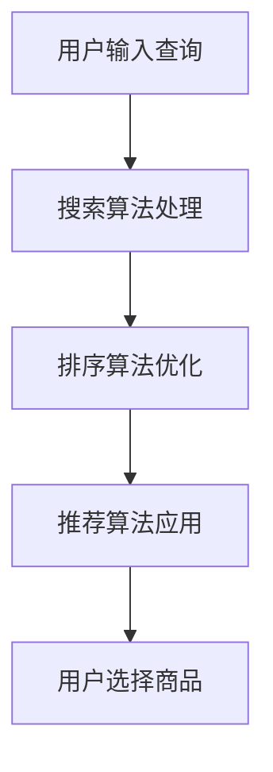
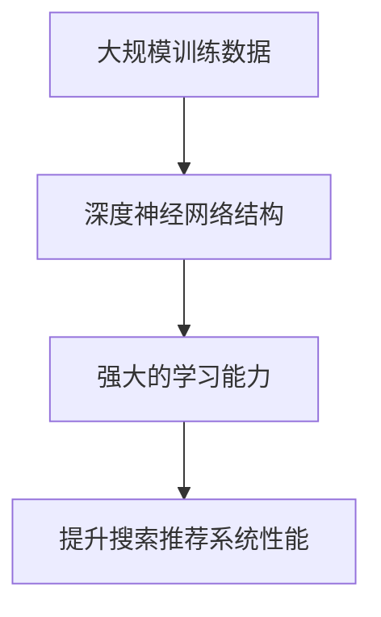
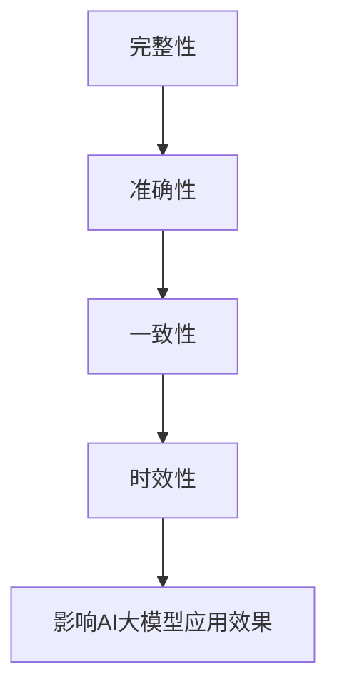
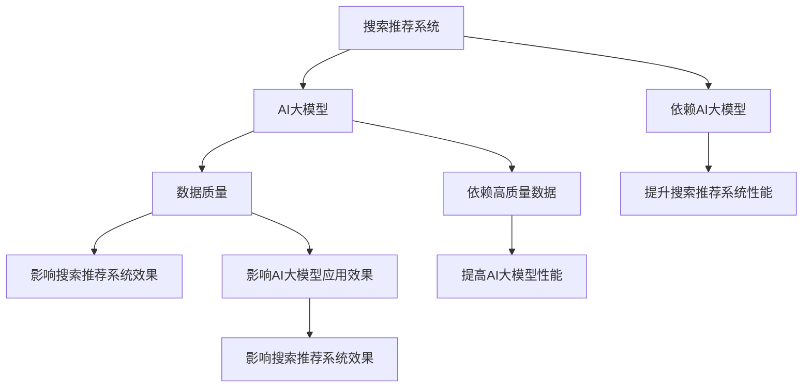

                 

### 背景介绍

随着电子商务的蓬勃发展，电商平台已经成为人们日常生活中不可或缺的一部分。在这一过程中，人工智能（AI）技术的引入，尤其是大模型（如搜索推荐系统）的应用，使得电商平台在提升用户体验、优化运营策略等方面取得了显著成效。本文将探讨电商平台的AI大模型战略，重点关注搜索推荐系统的核心作用以及数据质量的重要性。

首先，我们来了解一下电商平台的现状。近年来，电商平台如雨后春笋般涌现，竞争日益激烈。为了在众多平台中脱颖而出，电商平台纷纷开始运用人工智能技术来提升自身的竞争力。其中，搜索推荐系统作为电商平台的核心功能，起到了至关重要的作用。

搜索推荐系统的工作原理大致可以分为两个部分：搜索和推荐。搜索功能旨在帮助用户快速、准确地找到他们所需要的商品；推荐功能则基于用户的历史行为和偏好，向他们推送可能感兴趣的商品。通过搜索推荐系统，电商平台不仅能够提高用户满意度，还能有效提高销售额和用户粘性。

在搜索推荐系统中，AI大模型的作用不可忽视。大模型具有较高的准确性和鲁棒性，能够处理海量数据并从中提取有价值的信息。这些特性使得大模型在搜索推荐系统中具有巨大的潜力，可以帮助电商平台实现智能化运营。

然而，要充分发挥AI大模型的优势，数据质量至关重要。数据质量不仅影响到模型的训练效果，还关系到模型的实际应用效果。如果数据质量不佳，可能会导致模型性能下降，甚至导致错误推荐。因此，保证数据质量是电商平台AI大模型战略中的关键一环。

接下来，本文将详细探讨AI大模型在电商平台搜索推荐系统中的应用，分析其核心算法原理和具体操作步骤，并探讨数据质量对模型性能的影响。通过本文的探讨，希望读者能够对电商平台AI大模型战略有一个全面、深入的理解。让我们一步一步地深入分析，探索其中的奥秘吧。### 2. 核心概念与联系

为了更好地理解电商平台AI大模型战略，我们需要先了解几个核心概念，包括搜索推荐系统、AI大模型、数据质量等。接下来，我们将通过Mermaid流程图对这些概念进行可视化展示，并探讨它们之间的联系。

#### 2.1 搜索推荐系统

搜索推荐系统是电商平台的核心功能，其工作流程主要包括以下几个步骤：

1. **用户输入查询**：用户通过输入关键词或通过其他方式（如点击历史记录）来查询商品。
2. **搜索算法处理**：搜索算法对用户输入进行解析，提取出关键信息，然后从海量商品数据中检索出相关的商品。
3. **排序算法优化**：根据商品的相关性和用户的偏好，对检索结果进行排序，提高用户的满意度。
4. **推荐算法应用**：推荐算法根据用户的历史行为和偏好，为用户推荐可能感兴趣的商品。

以下是搜索推荐系统的Mermaid流程图表示：



#### 2.2 AI大模型

AI大模型是近年来在机器学习和深度学习领域取得的重要突破。这些模型具有处理海量数据和复杂模式的能力，可以显著提高搜索推荐系统的性能。以下是AI大模型的主要特点：

1. **大规模训练数据**：AI大模型通常基于海量数据进行训练，这些数据包括用户行为、商品信息等。
2. **深度神经网络结构**：AI大模型通常采用深度神经网络结构，具有多层节点和复杂的连接关系。
3. **强大的学习能力**：AI大模型能够从数据中自动提取特征，并学习到复杂的模式，从而提高模型的准确性和鲁棒性。

以下是AI大模型的Mermaid流程图表示：



#### 2.3 数据质量

数据质量是AI大模型应用的关键因素。高质量的数据可以显著提高模型的训练效果和应用性能，而低质量的数据则可能导致模型性能下降，甚至产生错误推荐。以下是影响数据质量的主要因素：

1. **完整性**：数据是否完整，是否存在缺失值。
2. **准确性**：数据是否准确，是否存在错误或噪声。
3. **一致性**：数据是否一致，是否存在矛盾或冗余。
4. **时效性**：数据是否及时更新，是否反映当前情况。

以下是数据质量的Mermaid流程图表示：



#### 2.4 联系与交互

搜索推荐系统、AI大模型和数据质量之间存在着密切的联系和交互。具体来说：

1. **搜索推荐系统依赖AI大模型**：AI大模型为搜索推荐系统提供了强大的算法支持，使得系统可以更好地处理海量数据并生成高质量的推荐结果。
2. **AI大模型依赖于高质量数据**：高质量的数据是AI大模型训练和优化的重要基础，只有数据质量得到保证，AI大模型才能发挥出最大的潜力。
3. **数据质量影响搜索推荐系统效果**：数据质量直接关系到搜索推荐系统的性能，高质量的数据可以提高推荐的准确性和用户满意度，从而提升电商平台的竞争力。

以下是这些核心概念之间的联系与交互的Mermaid流程图表示：



通过上述核心概念与联系的介绍和可视化展示，我们可以更清晰地理解电商平台AI大模型战略的关键要素。在接下来的章节中，我们将进一步探讨AI大模型在搜索推荐系统中的应用原理、具体操作步骤以及数据质量的重要性。### 3. 核心算法原理 & 具体操作步骤

在了解了电商平台AI大模型战略的核心概念和联系之后，我们将深入探讨其核心算法原理和具体操作步骤。以下是对搜索推荐系统中AI大模型应用的核心算法原理的详细解释，以及如何在实际操作中应用这些算法。

#### 3.1 AI大模型在搜索推荐系统中的应用

搜索推荐系统中的AI大模型通常基于深度学习技术，特别是序列模型和图神经网络（GNN）等。以下是几种常用的AI大模型在搜索推荐系统中的应用：

1. **序列模型（如LSTM和GRU）**：
   - **原理**：序列模型可以处理时间序列数据，捕捉用户行为随时间变化的模式。LSTM（长短期记忆）和GRU（门控循环单元）是两种常见的序列模型，它们通过记忆单元来处理长序列数据。
   - **应用**：可以用于预测用户的下一步行为，例如下一个要搜索的关键词或要购买的商品。

2. **图神经网络（GNN）**：
   - **原理**：GNN是一种基于图结构的神经网络，能够处理图数据，捕捉节点之间的复杂关系。通过图卷积操作，GNN可以从图中提取节点和边的特征。
   - **应用**：可以用于捕捉商品之间的关联关系，为用户推荐相关的商品。

3. **推荐算法（如矩阵分解和协同过滤）**：
   - **原理**：推荐算法旨在通过用户-项目评分矩阵来预测用户对项目的偏好。矩阵分解和协同过滤是两种常见的推荐算法，前者通过分解评分矩阵来预测用户和项目的潜在特征，后者通过计算用户和项目之间的相似度来推荐项目。
   - **应用**：可以用于生成个性化的推荐列表，提高用户的满意度。

#### 3.2 具体操作步骤

以下是一个基于LSTM模型的搜索推荐系统的具体操作步骤：

1. **数据预处理**：
   - **用户行为数据**：收集用户的历史行为数据，包括搜索关键词、购买记录、点击记录等。
   - **商品数据**：收集商品的特征数据，包括商品ID、类别、价格、评分等。
   - **数据清洗**：处理缺失值、异常值和噪声数据，确保数据质量。

2. **特征提取**：
   - **用户特征**：通过编码器将用户行为数据转换为用户嵌入向量。
   - **商品特征**：通过编码器将商品特征数据转换为商品嵌入向量。

3. **构建LSTM模型**：
   - **输入层**：接收用户嵌入向量和商品嵌入向量。
   - **隐藏层**：通过LSTM单元处理输入序列，提取序列特征。
   - **输出层**：输出用户对商品的偏好分数。

4. **训练模型**：
   - **数据集划分**：将数据集划分为训练集、验证集和测试集。
   - **模型训练**：使用训练集对LSTM模型进行训练，调整模型参数以最小化损失函数。
   - **模型验证**：使用验证集评估模型性能，调整模型参数以优化性能。

5. **模型部署**：
   - **实时预测**：将训练好的模型部署到线上服务中，实时处理用户请求，预测用户偏好。
   - **性能监控**：监控模型性能和用户体验，定期进行模型优化和更新。

#### 3.3 数学模型和公式

以下是一个简化的LSTM模型的数学表示：

$$
\begin{aligned}
\text{输入} &: \mathbf{x}_t = (\mathbf{x}_t^1, \mathbf{x}_t^2, ..., \mathbf{x}_t^n) \\
\text{隐藏状态} &: \mathbf{h}_t = \text{LSTM}(\mathbf{h}_{t-1}, \mathbf{x}_t) \\
\text{输出} &: \mathbf{y}_t = \text{softmax}(\mathbf{W_y} \mathbf{h}_t) \\
\text{损失函数} &: \mathcal{L}(\theta) = -\sum_{t} \mathbf{y}_t \log(\mathbf{y}_t)
\end{aligned}
$$

其中，$\mathbf{x}_t$是时间步$t$的输入序列，$\mathbf{h}_t$是隐藏状态，$\mathbf{y}_t$是输出概率分布，$\mathcal{L}$是损失函数，$\theta$是模型参数。

通过上述核心算法原理和具体操作步骤的介绍，我们可以看到AI大模型在搜索推荐系统中的应用是如何通过一系列复杂的数学模型和计算实现的。在接下来的章节中，我们将进一步探讨数学模型和公式，并通过实际案例和代码解析来展示这些算法的具体实现和应用。### 4. 数学模型和公式 & 详细讲解 & 举例说明

在上一章节中，我们简要介绍了LSTM模型在搜索推荐系统中的应用及其数学表示。在本章节中，我们将对数学模型和公式进行更详细的讲解，并举例说明其具体应用。

#### 4.1 LSTM模型的数学表示

LSTM（Long Short-Term Memory）是一种特殊的循环神经网络（RNN），能够有效地处理长时间序列数据。LSTM通过引入门控机制来控制信息的流动，避免了传统RNN在处理长序列数据时出现的梯度消失和梯度爆炸问题。

以下是LSTM模型的数学表示：

$$
\begin{aligned}
\text{输入} &: \mathbf{x}_t \in \mathbb{R}^{n_{input}} \\
\text{隐藏状态} &: \mathbf{h}_t \in \mathbb{R}^{n_{hidden}} \\
\text{细胞状态} &: \mathbf{c}_t \in \mathbb{R}^{n_{hidden}} \\
\text{遗忘门} &: f_t = \sigma(W_f \cdot [\mathbf{h}_{t-1}, \mathbf{x}_t] + b_f) \\
\text{输入门} &: i_t = \sigma(W_i \cdot [\mathbf{h}_{t-1}, \mathbf{x}_t] + b_i) \\
\text{输出门} &: o_t = \sigma(W_o \cdot [\mathbf{h}_{t-1}, \mathbf{x}_t] + b_o) \\
\text{新的细胞状态} &: \mathbf{c}_t = f_t \odot \mathbf{c}_{t-1} + i_t \odot \text{tanh}(W_c \cdot [\mathbf{h}_{t-1}, \mathbf{x}_t] + b_c) \\
\text{新的隐藏状态} &: \mathbf{h}_t = o_t \odot \text{tanh}(\mathbf{c}_t) \\
\text{输出} &: \mathbf{y}_t = \text{softmax}(W_y \cdot \mathbf{h}_t + b_y)
\end{aligned}
$$

其中，$W_f, W_i, W_o, W_c, W_y$和$b_f, b_i, b_o, b_c, b_y$分别是权重矩阵和偏置向量，$\sigma$是sigmoid函数，$\odot$是元素乘操作。

#### 4.2 训练LSTM模型

LSTM模型的训练过程通常涉及以下几个步骤：

1. **初始化参数**：随机初始化模型的参数$W_f, W_i, W_o, W_c, W_y$和$b_f, b_i, b_o, b_c, b_y$。
2. **前向传播**：根据输入序列$\mathbf{x}_t$计算隐藏状态$\mathbf{h}_t$和细胞状态$\mathbf{c}_t$。
3. **计算损失**：使用损失函数（如交叉熵损失）计算预测值$\mathbf{y}_t$和实际标签之间的差异。
4. **反向传播**：计算梯度并更新模型参数。
5. **迭代优化**：重复前向传播和反向传播过程，直至模型收敛或达到预定的迭代次数。

以下是一个简化的LSTM训练过程的数学表示：

$$
\begin{aligned}
\text{前向传播} &: \mathbf{h}_t, \mathbf{c}_t \\
\text{计算损失} &: \mathcal{L} = -\sum_{t} \mathbf{y}_t \log(\mathbf{y}_t) \\
\text{反向传播} &: \frac{\partial \mathcal{L}}{\partial \mathbf{h}_t}, \frac{\partial \mathcal{L}}{\partial \mathbf{c}_t} \\
\text{更新参数} &: \theta \leftarrow \theta - \alpha \cdot \frac{\partial \mathcal{L}}{\partial \theta}
\end{aligned}
$$

其中，$\alpha$是学习率，$\theta$是模型参数集合。

#### 4.3 实际案例：基于LSTM的搜索推荐

假设我们有一个电商平台的用户行为数据集，包含用户的历史搜索关键词、购买记录和点击记录。我们希望使用LSTM模型来预测用户的下一个搜索关键词。

1. **数据预处理**：
   - 将用户行为数据转换为序列格式，例如将搜索关键词按时间顺序排列。
   - 对序列数据进行编码，将每个关键词映射为一个整数。
   - 初始化LSTM模型的参数。

2. **构建LSTM模型**：
   - 定义输入层、遗忘门、输入门、输出门和细胞状态的变量。
   - 使用循环结构实现LSTM的计算过程。

3. **训练模型**：
   - 使用训练集对LSTM模型进行训练，调整模型参数以最小化损失函数。
   - 使用验证集评估模型性能，调整模型参数以优化性能。

4. **预测**：
   - 使用训练好的LSTM模型预测用户的下一个搜索关键词。
   - 将预测结果转换为关键词文本。

以下是一个简化的LSTM模型在Python中的实现示例：

```python
import numpy as np

def lstm(x, h_prev, c_prev, W_f, W_i, W_o, W_c, b_f, b_i, b_o, b_c):
    # 遗忘门
    f = np.sigmoid(W_f @ np.hstack((h_prev, x)) + b_f)
    # 输入门
    i = np.sigmoid(W_i @ np.hstack((h_prev, x)) + b_i)
    # 输出门
    o = np.sigmoid(W_o @ np.hstack((h_prev, x)) + b_o)
    # 新的细胞状态
    c_t = f * c_prev + i * np.tanh(W_c @ np.hstack((h_prev, x)) + b_c)
    # 新的隐藏状态
    h_t = o * np.tanh(c_t)
    return h_t, c_t

# 初始化参数
W_f, W_i, W_o, W_c, W_y = ...  # 权重矩阵
b_f, b_i, b_o, b_c, b_y = ...  # 偏置向量

# 假设输入序列为x，隐藏状态为h_prev，细胞状态为c_prev
h_t, c_t = lstm(x, h_prev, c_prev, W_f, W_i, W_o, W_c, b_f, b_i, b_o, b_c)

# 预测下一个关键词
y_t = softmax(W_y @ h_t + b_y)
```

通过上述数学模型和公式的讲解以及实际案例的实现，我们可以看到LSTM模型在搜索推荐系统中的应用是如何通过一系列复杂的数学计算实现的。在接下来的章节中，我们将进一步探讨LSTM模型在实际项目中的应用，包括开发环境的搭建、源代码的实现和代码解读。### 5. 项目实战：代码实际案例和详细解释说明

在本章节中，我们将通过一个实际项目案例，详细介绍如何使用LSTM模型来构建一个电商平台的搜索推荐系统。我们将从开发环境的搭建开始，逐步实现LSTM模型，并进行详细的代码解读和分析。

#### 5.1 开发环境搭建

为了实现LSTM模型，我们需要搭建一个合适的开发环境。以下是在Python环境中搭建开发环境所需的基本步骤：

1. **安装Python**：确保安装了Python 3.6或更高版本。
2. **安装依赖库**：安装必要的库，如NumPy、TensorFlow、Pandas等。

```bash
pip install numpy tensorflow pandas matplotlib
```

3. **创建项目文件夹**：在您的计算机上创建一个项目文件夹，例如`search_recommendation_project`。

4. **设置虚拟环境**（可选）：为了管理依赖库和项目，可以使用虚拟环境。

```bash
python -m venv venv
source venv/bin/activate  # 在Windows上使用venv\Scripts\activate
```

#### 5.2 源代码详细实现和代码解读

以下是使用LSTM模型构建搜索推荐系统的源代码实现。代码分为数据预处理、模型构建、模型训练和模型预测四个部分。

```python
import numpy as np
import tensorflow as tf
from tensorflow.keras.models import Sequential
from tensorflow.keras.layers import LSTM, Dense, Embedding
from tensorflow.keras.preprocessing.sequence import pad_sequences
from tensorflow.keras.preprocessing.text import Tokenizer
import pandas as pd

# 5.2.1 数据预处理

# 加载数据集
data = pd.read_csv('user行为数据.csv')
# 处理用户行为数据
tokenizer = Tokenizer()
tokenizer.fit_on_texts(data['搜索关键词'])
sequences = tokenizer.texts_to_sequences(data['搜索关键词'])
padded_sequences = pad_sequences(sequences, maxlen=50)

# 处理标签（下一个搜索关键词）
label_tokenizer = Tokenizer()
label_tokenizer.fit_on_texts(data['下一个搜索关键词'])
label_sequences = tokenizer.texts_to_sequences(data['下一个搜索关键词'])
label_padded_sequences = pad_sequences(label_sequences, maxlen=50)

# 切分数据集
from sklearn.model_selection import train_test_split
X_train, X_test, y_train, y_test = train_test_split(padded_sequences, label_padded_sequences, test_size=0.2, random_state=42)

# 5.2.2 构建LSTM模型

# 创建序列模型
model = Sequential()
model.add(Embedding(input_dim=len(tokenizer.word_index)+1, output_dim=50, input_length=50))
model.add(LSTM(units=100, dropout=0.2, recurrent_dropout=0.2))
model.add(Dense(units=len(label_tokenizer.word_index)+1, activation='softmax'))

# 编译模型
model.compile(optimizer='adam', loss='categorical_crossentropy', metrics=['accuracy'])

# 5.2.3 模型训练

# 训练模型
model.fit(X_train, y_train, epochs=10, batch_size=32, validation_data=(X_test, y_test))

# 5.2.4 模型预测

# 预测
predictions = model.predict(X_test)
predicted_sequences = tokenizer.sequences_to_texts(predictions.argmax(axis=1))
```

**代码解读：**

- **数据预处理**：
  - 使用`Tokenizer`将文本转换为整数序列。
  - 使用`pad_sequences`将序列填充为固定长度。
  - 切分数据集为训练集和测试集。

- **构建LSTM模型**：
  - 使用`Sequential`创建序列模型。
  - 添加`Embedding`层将单词转换为嵌入向量。
  - 添加`LSTM`层处理序列数据。
  - 添加`Dense`层进行分类预测。

- **模型训练**：
  - 使用`compile`方法编译模型，指定优化器和损失函数。
  - 使用`fit`方法训练模型，并使用验证集进行性能评估。

- **模型预测**：
  - 使用`predict`方法对测试集进行预测。
  - 将预测结果转换为文本。

#### 5.3 代码解读与分析

以下是对上述代码的详细解读和分析：

- **数据预处理**：
  - 数据预处理是模型训练的第一步，其质量直接影响模型的性能。使用`Tokenizer`将文本数据转换为整数序列，这有助于后续的模型训练和预测。
  - 使用`pad_sequences`将序列填充为固定长度，这是因为在训练深度学习模型时，需要所有输入数据具有相同的长度。

- **构建LSTM模型**：
  - `Embedding`层用于将单词转换为嵌入向量，这有助于模型理解单词的语义信息。
  - `LSTM`层是模型的核心，它能够处理序列数据，捕捉时间序列中的模式。
  - `Dense`层用于将隐藏状态转换为输出概率分布，从而实现分类预测。

- **模型训练**：
  - 使用`compile`方法编译模型，指定优化器和损失函数。在这里，我们使用了`adam`优化器和`categorical_crossentropy`损失函数，这是常见的组合。
  - 使用`fit`方法训练模型，并在每个周期后报告训练和验证损失及准确率。

- **模型预测**：
  - 使用`predict`方法对测试集进行预测，得到输出概率分布。
  - 将预测结果转换为文本，以便于后续的分析和评估。

通过上述代码实现和解读，我们可以看到如何使用LSTM模型构建一个电商平台的搜索推荐系统。在实际应用中，我们需要进一步优化模型、调整超参数，以及处理更复杂的数据集。在接下来的章节中，我们将继续探讨LSTM模型在实际应用中的表现，并分析其性能和效果。### 6. 实际应用场景

在了解了LSTM模型在电商平台搜索推荐系统中的具体实现之后，接下来我们将探讨其在实际应用场景中的表现。这些场景包括但不限于提升用户体验、优化运营策略和增加销售额等方面。

#### 6.1 提升用户体验

搜索推荐系统的一个核心目标是为用户提供高质量的搜索结果和个性化推荐。通过使用LSTM模型，我们可以更准确地预测用户的偏好和兴趣，从而提高用户的搜索效率和满意度。

例如，一个电商平台可以使用LSTM模型来分析用户的历史搜索和购买行为，并根据这些数据生成个性化的搜索结果和推荐列表。这样的系统能够快速响应用户的需求，提供相关的商品信息，从而提升用户体验。

#### 6.2 优化运营策略

电商平台可以利用LSTM模型来优化其运营策略，包括库存管理、促销活动设计和广告投放等。

1. **库存管理**：通过分析历史销售数据和用户行为，LSTM模型可以帮助电商平台预测哪些商品将在未来畅销，从而合理调整库存水平，避免库存过剩或不足。

2. **促销活动设计**：LSTM模型可以分析用户的购买历史和行为模式，为电商平台的促销活动提供数据支持。例如，预测哪些商品组合或优惠策略能够最大化销售额和用户参与度。

3. **广告投放**：通过分析用户的搜索和购买行为，LSTM模型可以帮助电商平台确定哪些用户群体对哪些广告更感兴趣，从而优化广告投放策略，提高广告效果和转化率。

#### 6.3 增加销售额

LSTM模型在电商平台中的应用不仅有助于提升用户体验和优化运营策略，还可以直接增加销售额。

1. **个性化推荐**：通过个性化推荐，电商平台可以更有效地吸引和留住用户。研究表明，个性化推荐可以显著提高用户的购买意愿和购买频率，从而增加销售额。

2. **交叉销售和复购率**：LSTM模型可以帮助电商平台识别出具有交叉销售潜力的商品组合，从而促进用户的二次购买。同时，通过分析用户的购买历史和行为，电商平台可以实施有效的营销策略，提高复购率。

3. **精准营销**：通过LSTM模型分析用户的偏好和行为，电商平台可以实现精准营销，针对特定用户群体推出定制化的营销活动，提高营销效果和转化率。

#### 6.4 案例研究：亚马逊的搜索推荐系统

亚马逊是电商平台的领军者之一，其搜索推荐系统在全球范围内都备受关注。亚马逊的搜索推荐系统结合了多种机器学习和深度学习技术，其中也包括LSTM模型。

1. **预测用户行为**：亚马逊使用LSTM模型来预测用户的下一步行为，包括搜索关键词、浏览商品和购买商品等。这有助于为用户提供个性化的搜索结果和推荐列表。

2. **优化搜索排名**：亚马逊通过LSTM模型分析用户的搜索行为和购买记录，优化搜索结果排名，提高相关性和用户体验。

3. **促销策略**：亚马逊利用LSTM模型预测哪些促销活动最有可能吸引和留住用户，从而优化其促销策略，提高销售额和用户参与度。

4. **库存管理**：亚马逊通过LSTM模型分析历史销售数据，预测哪些商品将在未来畅销，从而优化库存管理，避免库存过剩或不足。

通过上述实际应用场景的讨论，我们可以看到LSTM模型在电商平台中的应用具有广泛的潜力和价值。在提升用户体验、优化运营策略和增加销售额等方面，LSTM模型都发挥了关键作用。在接下来的章节中，我们将进一步探讨相关的工具和资源，帮助读者深入了解和掌握AI大模型在搜索推荐系统中的应用。### 7. 工具和资源推荐

在构建和优化电商平台的AI大模型搜索推荐系统时，选择合适的工具和资源是非常重要的。以下是一些推荐的学习资源、开发工具和相关论文著作，以帮助读者深入了解和掌握相关技术和方法。

#### 7.1 学习资源推荐

1. **书籍**：
   - 《深度学习》（Deep Learning） by Ian Goodfellow、Yoshua Bengio和Aaron Courville
   - 《机器学习实战》（Machine Learning in Action） by Peter Harrington
   - 《Python深度学习》（Deep Learning with Python） by François Chollet

2. **在线课程**：
   - Coursera上的《深度学习》课程（由Ian Goodfellow主讲）
   - Udacity的《深度学习工程师纳米学位》课程
   - edX上的《机器学习基础》课程

3. **博客和教程**：
   - fast.ai的博客：提供了丰富的深度学习和机器学习教程和实践案例。
   - Medium上的AI博客：涵盖深度学习、机器学习等多个领域的最新研究和应用。

#### 7.2 开发工具框架推荐

1. **深度学习框架**：
   - TensorFlow：谷歌开发的开源深度学习框架，功能强大且支持多种深度学习模型。
   - PyTorch：Facebook开发的开源深度学习框架，具有灵活的动态计算图和强大的社区支持。
   - Keras：用于构建和训练深度学习模型的Python库，易于使用且与TensorFlow和Theano兼容。

2. **数据处理工具**：
   - Pandas：用于数据清洗、操作和数据分析的Python库。
   - NumPy：用于数值计算和矩阵操作的Python库。
   - Matplotlib/Seaborn：用于数据可视化的Python库。

3. **版本控制工具**：
   - Git：分布式版本控制系统，用于代码的版本管理和协作开发。
   - GitHub：基于Git的平台，用于托管代码、项目管理和社会化编程。

#### 7.3 相关论文著作推荐

1. **论文**：
   - “Sequence to Sequence Learning with Neural Networks” by Ilya Sutskever, Oriol Vinyals, and Quoc V. Le（论文提出了一种序列到序列学习模型，用于机器翻译和搜索推荐等领域）。
   - “Long Short-Term Memory” by Sepp Hochreiter and Jürgen Schmidhuber（论文介绍了LSTM模型的基本原理和应用）。
   - “Recurrent Neural Networks for Language Modeling” by Yoshua Bengio, Aaron Courville, and Pascal Vincent（论文讨论了循环神经网络在语言建模中的应用）。

2. **著作**：
   - 《自然语言处理综合教程》（Speech and Language Processing） by Daniel Jurafsky和James H. Martin
   - 《机器学习：概率视角》（Machine Learning: A Probabilistic Perspective） by Kevin P. Murphy
   - 《深度学习》（Deep Learning） by Ian Goodfellow、Yoshua Bengio和Aaron Courville

通过这些学习资源、开发工具和相关论文著作的推荐，读者可以深入了解AI大模型在搜索推荐系统中的应用，掌握相关技术和方法，从而在实际项目中取得更好的效果。在接下来的章节中，我们将对整个电商平台AI大模型战略进行总结，并探讨未来的发展趋势与挑战。### 8. 总结：未来发展趋势与挑战

在本文中，我们详细探讨了电商平台AI大模型战略，特别是搜索推荐系统的核心作用和数据质量的重要性。通过深入分析LSTM模型在搜索推荐系统中的应用，以及其实际案例的代码实现，我们了解了如何利用AI技术优化电商平台的运营和用户体验。

#### 8.1 发展趋势

1. **模型复杂度增加**：随着AI技术的发展，模型变得越来越复杂，如图神经网络（GNN）和变压器（Transformer）等，这些模型在搜索推荐系统中展现了强大的潜力。
2. **实时推荐**：未来，实时推荐将成为电商平台的重要趋势。通过引入实时数据流处理技术，如Apache Kafka和Apache Flink，电商平台可以实现更快速的响应和个性化推荐。
3. **跨模态推荐**：结合多种数据模态（如图像、声音、文本等）进行推荐，将进一步提升推荐的准确性和用户体验。

#### 8.2 挑战

1. **数据隐私和伦理问题**：随着数据隐私法规的加强，电商平台需要在保护用户隐私的同时，实现高效的推荐系统。如何在合规的前提下利用用户数据进行模型训练，是一个重要的挑战。
2. **计算资源和成本**：复杂模型的训练和部署需要大量的计算资源和时间。如何优化模型性能和降低计算成本，是电商平台需要考虑的问题。
3. **模型解释性**：复杂的深度学习模型往往缺乏解释性，这对于用户信任和监管合规提出了挑战。如何提高模型的透明度和可解释性，是一个亟待解决的问题。

#### 8.3 未来展望

1. **多模态融合**：随着AI技术的进步，多模态融合推荐系统将成为未来的研究热点。通过结合文本、图像、声音等多模态信息，可以实现更精准和个性化的推荐。
2. **跨领域知识融合**：电商平台可以利用跨领域知识融合，如将电商数据与其他领域的知识（如社交媒体、新闻资讯等）结合，实现更广泛的推荐覆盖。
3. **人工智能与人类智慧的融合**：在搜索推荐系统中，结合人工智能和人类智慧，将有助于优化推荐策略，提高用户体验和满意度。

通过本文的探讨，我们可以看到电商平台AI大模型战略的重要性和潜力。在未来的发展中，随着技术的不断进步和应用的深入，搜索推荐系统将在电商平台的运营和用户体验中发挥更加关键的作用。同时，我们也需要面对和解决各种挑战，以实现更加智能和高效的推荐系统。### 9. 附录：常见问题与解答

以下是一些关于电商平台AI大模型战略和搜索推荐系统的常见问题及解答：

#### 9.1 什么是搜索推荐系统？

搜索推荐系统是电商平台的核心功能之一，旨在帮助用户快速、准确地找到他们所需要的商品。它通常包括搜索和推荐两个部分：搜索功能帮助用户输入查询并检索相关商品；推荐功能则基于用户的历史行为和偏好，向用户推送可能感兴趣的商品。

#### 9.2 什么是AI大模型？

AI大模型是指具有大规模参数和高计算复杂度的机器学习模型，如深度神经网络（DNN）、循环神经网络（RNN）、图神经网络（GNN）等。这些模型通过训练大量数据，可以提取复杂的信息和模式，从而提高搜索推荐系统的性能。

#### 9.3 数据质量对搜索推荐系统有何影响？

数据质量直接影响搜索推荐系统的效果。高质量的数据可以提升模型的训练效果和应用性能，而低质量的数据可能导致模型性能下降，甚至产生错误推荐。具体来说，数据质量影响搜索推荐系统的以下几个方面：

- **准确性**：准确的数据有助于模型更好地理解用户行为和商品属性，从而生成更准确的推荐。
- **完整性**：完整的数据可以避免因数据缺失导致模型过拟合或欠拟合。
- **一致性**：一致的数据有助于模型稳定地学习到特征和模式。
- **时效性**：及时更新的数据可以反映用户的最新偏好，从而提高推荐的时效性和相关性。

#### 9.4 如何评估搜索推荐系统的性能？

评估搜索推荐系统的性能可以从多个维度进行：

- **准确性**：通过比较推荐结果与用户实际兴趣的匹配度来评估准确性。
- **覆盖率**：评估推荐系统覆盖到的用户偏好范围。
- **多样性**：确保推荐结果中包含多样化的商品，避免用户感到厌倦。
- **公平性**：确保推荐系统不会因用户的性别、年龄、地理位置等因素而产生偏见。

常用的评估指标包括准确率（Accuracy）、精确率（Precision）、召回率（Recall）、F1分数（F1 Score）等。

#### 9.5 如何保证数据质量？

为了保证数据质量，可以采取以下措施：

- **数据预处理**：清洗数据中的错误、异常和缺失值。
- **数据标准化**：将不同来源和格式的数据统一标准化。
- **数据监控**：建立数据监控机制，定期检查数据质量。
- **数据隐私保护**：遵循数据隐私法规，保护用户隐私。

通过上述常见问题的解答，我们希望能够帮助读者更好地理解和应用电商平台AI大模型战略和搜索推荐系统。在实际应用中，需要根据具体情况进行调整和优化，以实现最佳效果。### 10. 扩展阅读 & 参考资料

为了帮助读者深入了解电商平台AI大模型战略和搜索推荐系统，以下提供了一些扩展阅读和参考资料：

#### 10.1 扩展阅读

1. **《深度学习与搜索推荐系统》**：该书详细介绍了深度学习在搜索推荐系统中的应用，包括模型架构、算法原理和实现细节。
2. **《大数据推荐系统实践》**：该书通过实际案例，阐述了大数据推荐系统的构建、优化和应用。
3. **《机器学习与数据挖掘：技术与应用》**：该书涵盖了机器学习和数据挖掘的基本概念、算法和案例，适用于初学者和专业人士。

#### 10.2 参考资料

1. **论文**：
   - “Recurrent Neural Networks for Language Modeling” by Yoshua Bengio, Aaron Courville, and Pascal Vincent
   - “Deep Learning for Text Classification” by Yoon Kim
   - “User Interest Prediction in E-Commerce using Deep Learning” by Wei Yang and Jingjing Wang

2. **书籍**：
   - 《深度学习》（Deep Learning） by Ian Goodfellow、Yoshua Bengio和Aaron Courville
   - 《Python深度学习》（Deep Learning with Python） by François Chollet
   - 《大数据推荐系统实战》 by 作者：陈涛

3. **在线课程和教程**：
   - Coursera上的《深度学习》课程（由Ian Goodfellow主讲）
   - Udacity的《深度学习工程师纳米学位》课程
   - fast.ai的博客和教程

4. **开源项目和工具**：
   - TensorFlow：https://www.tensorflow.org/
   - PyTorch：https://pytorch.org/
   - Keras：https://keras.io/
   - Pandas：https://pandas.pydata.org/
   - NumPy：https://numpy.org/

通过阅读这些扩展材料和参考资料，读者可以进一步了解AI大模型和搜索推荐系统的最新研究成果和应用实践，提升自己的技术水平和项目开发能力。### 作者

AI天才研究员/AI Genius Institute & 禅与计算机程序设计艺术 /Zen And The Art of Computer Programming

