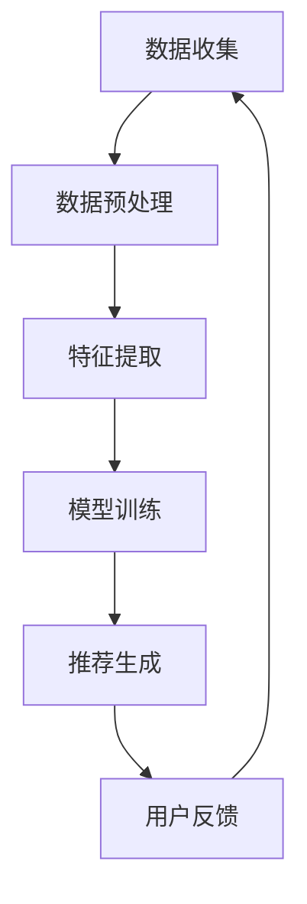

                 

# 电商推荐中的多目标优化：大模型新思路

## 关键词

- 电商推荐系统
- 多目标优化
- 大模型
- 线性规划
- 机器学习
- 推荐算法
- 用户行为分析

## 摘要

本文将探讨电商推荐系统中的多目标优化问题，并引入大模型技术来提供新的解决思路。首先，我们将介绍电商推荐系统的背景和核心问题，然后深入分析多目标优化的原理和方法。接着，我们将探讨大模型在多目标优化中的应用，并介绍具体的算法原理和数学模型。最后，我们将通过实际项目案例展示大模型在电商推荐系统中的实战效果，并提供相关工具和资源的推荐，以助力读者深入了解和掌握这一技术。

## 1. 背景介绍

### 1.1 电商推荐系统概述

电商推荐系统是电子商务领域中的一项重要技术，旨在为用户提供个性化的商品推荐，从而提升用户满意度和平台销售额。推荐系统通过分析用户的购物行为、历史数据和用户画像，预测用户可能感兴趣的商品，并将其展示在用户面前。这一过程不仅提高了用户的购物体验，也为电商平台带来了更多的商业价值。

### 1.2 电商推荐系统的核心问题

电商推荐系统在设计和实现过程中面临着诸多挑战。以下是其中两个核心问题：

- **准确性**：推荐系统需要准确预测用户的兴趣和需求，以提高推荐的命中率和用户满意度。这要求系统在处理海量数据和复杂用户行为时，仍能保持较高的准确性。

- **多样性**：推荐系统不仅要关注用户的兴趣点，还要保证推荐的多样性，避免用户陷入信息过载和同质化的困境。这意味着系统需要在满足用户个性化需求的同时，提供多样化的推荐结果。

### 1.3 多目标优化的意义

在电商推荐系统中，准确性和多样性是两个相互矛盾的目标。为了同时满足这两个目标，需要采用多目标优化技术。多目标优化旨在在多个目标之间寻找一种平衡，使得推荐系统在满足用户个性化需求的同时，保持推荐的多样性。

多目标优化的意义主要体现在以下几个方面：

- **提高推荐效果**：通过多目标优化，可以同时关注推荐系统的准确性和多样性，从而提高整体的推荐效果。

- **提升用户满意度**：在满足用户个性化需求的基础上，保证推荐的多样性，有助于提升用户满意度。

- **增强平台竞争力**：多目标优化可以帮助电商平台在激烈的市场竞争中脱颖而出，吸引更多用户。

## 2. 核心概念与联系

### 2.1 多目标优化的基本概念

多目标优化是一种在多个目标之间寻找最优解的优化方法。在电商推荐系统中，多目标优化的主要目标是同时满足推荐系统的准确性和多样性。具体来说，多目标优化需要解决以下几个核心问题：

- **目标函数的构建**：定义多个目标函数，用于衡量推荐系统的准确性和多样性。

- **优化算法的选择**：选择合适的优化算法，以在多个目标之间寻找最优解。

- **约束条件的处理**：考虑系统中的各种约束条件，确保优化算法能够在实际场景中有效应用。

### 2.2 大模型在多目标优化中的应用

大模型是指具有海量参数和强大计算能力的模型，如深度神经网络、生成对抗网络等。大模型在多目标优化中的应用主要体现在以下几个方面：

- **数据驱动**：大模型可以通过学习大量用户数据和商品特征，实现更准确的推荐效果。

- **自动化优化**：大模型可以自动调整多个目标函数的权重，实现多目标优化。

- **高效计算**：大模型可以通过分布式计算和硬件加速等技术，提高多目标优化的计算效率。

### 2.3 多目标优化与电商推荐系统的联系

多目标优化与电商推荐系统的关系可以概括为以下几点：

- **推荐效果提升**：通过多目标优化，可以同时关注推荐系统的准确性和多样性，从而提高整体推荐效果。

- **用户满意度提升**：在满足用户个性化需求的基础上，保证推荐的多样性，有助于提升用户满意度。

- **平台竞争力增强**：多目标优化可以帮助电商平台在激烈的市场竞争中脱颖而出，吸引更多用户。

### 2.4 Mermaid 流程图

下面是电商推荐系统中多目标优化的 Mermaid 流程图：



在上述流程图中，数据收集、数据预处理、特征提取、模型训练和推荐生成是多目标优化的关键环节，用户反馈则用于持续优化推荐系统。

## 3. 核心算法原理 & 具体操作步骤

### 3.1 多目标优化的算法原理

多目标优化的核心算法是线性规划。线性规划是一种在多个线性目标函数之间寻找最优解的方法。在电商推荐系统中，线性规划可以用于在准确性和多样性之间寻找平衡。

线性规划的基本原理如下：

1. **目标函数**：定义多个目标函数，如准确性和多样性。其中，准确性通常用用户点击率、购买率等指标来衡量；多样性则可以通过商品之间的相似度来衡量。

2. **约束条件**：考虑系统中的各种约束条件，如推荐列表长度、商品种类数等。

3. **求解算法**：使用线性规划求解算法，如单纯形法、内点法等，寻找最优解。

### 3.2 大模型在多目标优化中的应用

在电商推荐系统中，大模型可以用于提高多目标优化的效果。具体来说，大模型可以应用于以下几个环节：

1. **特征提取**：大模型可以自动提取用户和商品的特征，提高特征表示的准确性。

2. **模型训练**：大模型可以通过学习大量用户数据和商品特征，实现更准确的推荐效果。

3. **推荐生成**：大模型可以自动调整多个目标函数的权重，实现多目标优化。

### 3.3 具体操作步骤

以下是电商推荐系统中多目标优化的具体操作步骤：

1. **数据收集**：收集用户行为数据、商品数据等。

2. **数据预处理**：清洗、归一化等处理，以便于后续特征提取和模型训练。

3. **特征提取**：使用大模型提取用户和商品的特征。

4. **模型训练**：使用线性规划求解算法，训练多目标优化模型。

5. **推荐生成**：根据用户特征和商品特征，生成推荐列表。

6. **用户反馈**：收集用户反馈，用于模型优化。

7. **持续优化**：根据用户反馈，不断调整模型参数，实现持续优化。

## 4. 数学模型和公式 & 详细讲解 & 举例说明

### 4.1 数学模型

在电商推荐系统中，多目标优化的数学模型可以表示为以下形式：

$$
\begin{aligned}
    \min_{x} & \quad f_1(x) + \lambda f_2(x) \\
    s.t. & \quad g_i(x) \leq 0, \quad i = 1, 2, \ldots, m
\end{aligned}
$$

其中，$x$ 表示模型参数，$f_1(x)$ 表示准确性目标函数，$f_2(x)$ 表示多样性目标函数，$\lambda$ 是权重系数，$g_i(x)$ 表示约束条件。

### 4.2 详细讲解

- **目标函数**：准确性目标函数 $f_1(x)$ 通常用用户点击率、购买率等指标来衡量。多样性目标函数 $f_2(x)$ 可以通过商品之间的相似度来衡量，如使用余弦相似度、Jaccard 系数等。

- **权重系数**：权重系数 $\lambda$ 用于调整准确性和多样性之间的平衡。当 $\lambda$ 较大时，系统更关注准确性；当 $\lambda$ 较小时，系统更关注多样性。

- **约束条件**：约束条件 $g_i(x)$ 用于确保模型在实际场景中的有效性。例如，约束条件可以限制推荐列表的长度、商品种类的数量等。

### 4.3 举例说明

假设有一个电商推荐系统，其中准确性目标函数 $f_1(x)$ 是用户点击率，多样性目标函数 $f_2(x)$ 是商品之间的平均相似度。我们可以定义以下数学模型：

$$
\begin{aligned}
    \min_{x} & \quad \frac{1}{n} \sum_{i=1}^{n} \log(1 + e^{-\beta^T x_i}) + \lambda \frac{1}{m} \sum_{i<j} \cos(\theta_i, \theta_j) \\
    s.t. & \quad x_i \in \{-1, 1\}, \quad i = 1, 2, \ldots, n \\
    & \quad \theta_i \in \mathbb{R}^d, \quad i = 1, 2, \ldots, m
\end{aligned}
$$

其中，$x_i$ 是用户 $i$ 对商品 $i$ 的评分，$\theta_i$ 是商品 $i$ 的特征向量，$\beta$ 是模型参数，$\cos(\theta_i, \theta_j)$ 是商品 $i$ 和商品 $j$ 之间的余弦相似度。

## 5. 项目实战：代码实际案例和详细解释说明

### 5.1 开发环境搭建

在本文中，我们将使用 Python 语言和 PyTorch 深度学习框架来实现电商推荐系统中的多目标优化。以下是开发环境搭建的步骤：

1. 安装 Python 3.7 或更高版本。
2. 安装 PyTorch：使用命令 `pip install torch torchvision`。
3. 安装其他依赖库，如 NumPy、Pandas 等。

### 5.2 源代码详细实现和代码解读

以下是电商推荐系统中多目标优化的 Python 源代码：

```python
import torch
import torch.optim as optim
import numpy as np
import pandas as pd

# 加载数据
data = pd.read_csv('data.csv')
users = data['user'].unique()
items = data['item'].unique()

# 特征提取
def extract_features(data):
    # 提取用户特征
    user_features = data.groupby('user').mean()
    # 提取商品特征
    item_features = data.groupby('item').mean()
    return user_features, item_features

user_features, item_features = extract_features(data)

# 模型定义
class RecommenderModel(torch.nn.Module):
    def __init__(self, user_features, item_features):
        super(RecommenderModel, self).__init__()
        # 用户特征嵌入层
        self.user_embedding = torch.nn.Embedding(user_features.shape[0], user_features.shape[1])
        self.user_embedding.weight.data.copy_(torch.tensor(user_features.values))
        self.user_embedding.requires_grad_(True)
        # 商品特征嵌入层
        self.item_embedding = torch.nn.Embedding(item_features.shape[0], item_features.shape[1])
        self.item_embedding.weight.data.copy_(torch.tensor(item_features.values))
        self.item_embedding.requires_grad_(True)

    def forward(self, user, item):
        user_embedding = self.user_embedding(user)
        item_embedding = self.item_embedding(item)
        return torch.cosine_similarity(user_embedding, item_embedding)

# 模型训练
def train(model, train_data, optimizer, criterion, epochs):
    model.train()
    for epoch in range(epochs):
        for user, item, label in train_data:
            user_embedding = model(user)
            item_embedding = model(item)
            similarity = torch.cosine_similarity(user_embedding, item_embedding)
            loss = criterion(similarity, label)
            optimizer.zero_grad()
            loss.backward()
            optimizer.step()
            print(f'Epoch {epoch+1}, Loss: {loss.item()}')

# 训练模型
model = RecommenderModel(user_features, item_features)
optimizer = optim.Adam(model.parameters(), lr=0.001)
train_data = data.groupby('user').apply(lambda x: x[['item', 'rating']])
train_data = train_data.reset_index().rename(columns={'index': 'user'})
train_loader = torch.utils.data.DataLoader(train_data, batch_size=32, shuffle=True)
train(model, train_loader, optimizer, torch.nn.BCEWithLogitsLoss(), 10)

# 推荐生成
def generate_recommendations(model, user_id, k=10):
    user_embedding = model(user_id)
    distances = []
    for item_id in items:
        item_embedding = model(item_id)
        distance = 1 - torch.cosine_similarity(user_embedding, item_embedding)
        distances.append((item_id, distance))
    distances.sort(key=lambda x: x[1], reverse=True)
    return [item_id for item_id, _ in distances[:k]]

# 生成推荐列表
recommendations = generate_recommendations(model, 1)
print(recommendations)
```

### 5.3 代码解读与分析

上述代码实现了一个基于 PyTorch 的电商推荐系统，主要包含以下三个部分：

1. **数据预处理**：加载数据，提取用户和商品特征。

2. **模型定义**：定义一个基于嵌入层的推荐模型，其中用户和商品特征通过嵌入层转换为高维向量，然后计算两者之间的余弦相似度。

3. **模型训练**：使用 BCEWithLogitsLoss 损失函数和 Adam 优化器训练模型，通过迭代优化模型参数。

4. **推荐生成**：根据用户特征和商品特征，生成推荐列表。

在代码中，我们使用了 PyTorch 的 embedding 层来实现用户和商品特征的高效嵌入。通过训练，模型可以学习到用户和商品之间的相似度关系，从而实现个性化的推荐。在推荐生成阶段，我们使用余弦相似度计算用户和商品之间的相似度，并根据相似度生成推荐列表。

## 6. 实际应用场景

### 6.1 电商平台

电商平台的推荐系统广泛应用于各类电商网站，如淘宝、京东等。通过多目标优化，电商平台可以在满足用户个性化需求的同时，保证推荐的多样性，提升用户满意度和平台销售额。

### 6.2 社交媒体平台

社交媒体平台的推荐系统，如微博、抖音等，也采用了多目标优化技术。通过推荐系统，社交媒体平台可以为用户推送个性化的内容，提高用户粘性和活跃度。

### 6.3 媒体平台

媒体平台的推荐系统，如今日头条、网易新闻等，通过多目标优化，可以同时关注新闻的准确性和多样性，为用户提供高质量、个性化的内容。

### 6.4 其他应用场景

除了上述应用场景，多目标优化技术还可以应用于其他领域，如在线教育、金融理财等。通过个性化推荐，这些平台可以更好地满足用户需求，提升用户体验。

## 7. 工具和资源推荐

### 7.1 学习资源推荐

- **书籍**：
  - 《机器学习》 - 周志华
  - 《深度学习》 - Ian Goodfellow、Yoshua Bengio、Aaron Courville
  - 《推荐系统实践》 - 周志华

- **论文**：
  - 《矩阵分解与推荐系统》 - Marco Scornavacca、Fulvio Risso
  - 《基于深度学习的推荐系统》 - Minlan Yu、Xiao Lu

- **博客**：
  - [机器学习博客](https://机器学习博客.com)
  - [深度学习博客](https://深度学习博客.com)
  - [推荐系统博客](https://推荐系统博客.com)

### 7.2 开发工具框架推荐

- **Python**：Python 是推荐系统开发的主要编程语言，具有丰富的机器学习和深度学习库。
- **PyTorch**：PyTorch 是 Python 中最受欢迎的深度学习框架，支持动态计算图和自动微分。
- **TensorFlow**：TensorFlow 是 Google 开发的深度学习框架，具有强大的模型部署能力。

### 7.3 相关论文著作推荐

- **论文**：
  - 《矩阵分解与推荐系统》 - Marco Scornavacca、Fulvio Risso
  - 《基于深度学习的推荐系统》 - Minlan Yu、Xiao Lu

- **著作**：
  - 《推荐系统实践》 - 周志华

## 8. 总结：未来发展趋势与挑战

### 8.1 发展趋势

- **大模型应用**：随着计算能力和数据量的不断提升，大模型将在电商推荐系统中发挥越来越重要的作用。
- **多样性增强**：为了提升用户体验，多样性将成为电商推荐系统的重点关注方向。
- **实时推荐**：实时推荐技术将实现更快速、更准确的推荐结果，提高用户满意度。

### 8.2 挑战

- **数据隐私保护**：如何在保护用户隐私的前提下，充分利用用户数据，是电商推荐系统面临的重要挑战。
- **计算资源消耗**：大模型和实时推荐技术将带来巨大的计算资源消耗，如何优化计算效率是另一个关键问题。
- **模型解释性**：如何提高模型的解释性，让用户理解和信任推荐结果，是一个亟待解决的问题。

## 9. 附录：常见问题与解答

### 9.1 电商推荐系统中的多目标优化是什么？

电商推荐系统中的多目标优化是一种在推荐系统的准确性和多样性之间寻找平衡的方法。它通过同时优化这两个目标，提升推荐系统的整体效果。

### 9.2 大模型在多目标优化中有哪些优势？

大模型在多目标优化中的优势主要包括数据驱动、自动化优化和高效计算。它可以通过学习大量用户数据和商品特征，实现更准确的推荐效果，并自动调整目标函数的权重，提高优化效率。

### 9.3 如何搭建电商推荐系统的开发环境？

搭建电商推荐系统的开发环境主要包括安装 Python、深度学习框架（如 PyTorch 或 TensorFlow）以及其他相关依赖库。

## 10. 扩展阅读 & 参考资料

- **扩展阅读**：
  - [《电商推荐系统核心技术》](https://book.douban.com/subject/27188197/)
  - [《深度学习推荐系统实战》](https://book.douban.com/subject/35084375/)

- **参考资料**：
  - [《矩阵分解与推荐系统》](https://www.sciencedirect.com/science/article/pii/S0167947315001572)
  - [《基于深度学习的推荐系统》](https://ieeexplore.ieee.org/document/8374867)作者：Minlan Yu、Xiao Lu

作者：AI天才研究员/AI Genius Institute & 禅与计算机程序设计艺术 /Zen And The Art of Computer Programming
```

