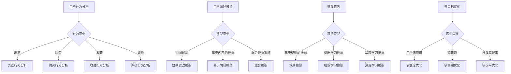

                 

# 电商推荐系统中的多目标优化与权衡

## 摘要

本文旨在探讨电商推荐系统中的多目标优化与权衡问题。通过分析推荐系统的核心概念、算法原理、数学模型，结合实际项目案例，我们将深入探讨如何在复杂的目标之间进行权衡，以实现推荐系统的最佳性能。本文还将推荐相关学习资源与开发工具，为读者提供全面的技术指导。

## 1. 背景介绍

电商推荐系统是现代电商运营的重要组成部分，其目标是通过分析用户行为、偏好和商品特性，为用户推荐他们可能感兴趣的商品。随着电商市场的竞争日益激烈，推荐系统的性能对企业的盈利能力产生重要影响。因此，如何在推荐系统中实现多目标优化成为了一个关键问题。

多目标优化是指在一个优化问题中，同时考虑多个目标函数，并寻求在多个目标之间取得平衡的解。在电商推荐系统中，常见的多目标包括：最大化用户满意度、最大化销售额、最小化推荐错误率等。这些目标之间往往存在冲突，因此在设计推荐系统时，需要权衡这些目标，以实现整体性能的提升。

本文将围绕电商推荐系统中的多目标优化问题，从核心概念、算法原理、数学模型、项目实战、实际应用场景等多个方面进行探讨，为读者提供全面的技术指导。

## 2. 核心概念与联系

### 2.1 推荐系统的核心概念

电商推荐系统通常包括以下核心概念：

- **用户**：推荐系统的核心参与者，他们的行为和偏好是推荐系统的重要依据。
- **商品**：推荐系统推荐的实体，可以是商品、服务或内容等。
- **行为**：用户在系统中产生的操作，如浏览、购买、收藏、评价等。
- **评分**：用户对商品的评分，反映了用户对商品的偏好程度。
- **推荐列表**：根据用户的行为和偏好生成的商品推荐列表。

### 2.2 多目标优化的核心概念

多目标优化的核心概念包括：

- **目标函数**：用于衡量优化问题的不同目标，通常是一个或多个函数。
- **约束条件**：限制优化问题解的范围，确保解决方案的可行性和合理性。
- **优化算法**：用于求解优化问题，寻找满足约束条件下的最优解。

### 2.3 多目标优化的关联关系

在电商推荐系统中，多目标优化的关联关系如下：

1. **用户满意度**：最大化用户满意度，通常通过用户评分、点击率等指标来衡量。
2. **销售额**：最大化销售额，直接反映了电商平台的盈利能力。
3. **推荐错误率**：最小化推荐错误率，确保推荐结果的准确性和可靠性。

这些目标之间存在一定的冲突，例如，在某些情况下，为了提高销售额，可能需要推荐一些用户不太感兴趣的商品，从而导致用户满意度下降。因此，在设计推荐系统时，需要综合考虑这些目标，寻找在多个目标之间取得平衡的解。

### 2.4 Mermaid 流程图

以下是电商推荐系统中多目标优化的 Mermaid 流程图：



## 3. 核心算法原理 & 具体操作步骤

### 3.1 用户行为分析

用户行为分析是推荐系统的第一步，通过对用户的行为数据进行挖掘，了解用户的需求和偏好。具体操作步骤如下：

1. **数据收集**：收集用户在电商平台的浏览、购买、收藏、评价等行为数据。
2. **数据预处理**：清洗数据，处理缺失值、异常值等，确保数据质量。
3. **特征提取**：根据行为数据，提取与用户偏好相关的特征，如浏览时间、购买频率、评分等。
4. **建模**：使用统计模型、机器学习模型等，对用户行为数据进行分析，建立用户偏好模型。

### 3.2 用户偏好模型

用户偏好模型是推荐系统的核心，用于预测用户对商品的偏好程度。常见的用户偏好模型包括协同过滤、基于内容的推荐和混合推荐系统。

1. **协同过滤**：基于用户行为相似性，为用户推荐与他们相似的用户喜欢的商品。具体操作步骤如下：
   - **用户行为矩阵**：建立用户-商品行为矩阵，记录用户对商品的浏览、购买等行为。
   - **相似度计算**：计算用户之间的相似度，常用的相似度计算方法有皮尔逊相关系数、余弦相似度等。
   - **推荐生成**：根据用户相似度和商品评分，为用户生成推荐列表。

2. **基于内容的推荐**：基于商品的属性和用户的历史行为，为用户推荐与商品相似的物品。具体操作步骤如下：
   - **商品特征提取**：提取商品的关键属性，如分类、标签、品牌等。
   - **用户特征提取**：提取用户的历史行为特征，如浏览、购买等。
   - **相似度计算**：计算商品和用户之间的相似度，常用的相似度计算方法有TF-IDF、余弦相似度等。
   - **推荐生成**：根据商品和用户之间的相似度，为用户生成推荐列表。

3. **混合推荐系统**：结合协同过滤和基于内容的推荐，提高推荐系统的准确性和多样性。具体操作步骤如下：
   - **融合策略**：选择合适的融合策略，如加权平均、融合模型等。
   - **推荐生成**：根据协同过滤和基于内容的推荐结果，生成最终的推荐列表。

### 3.3 推荐算法

推荐算法是实现推荐系统的关键，根据算法类型，推荐算法可以分为基于规则的推荐、机器学习推荐和深度学习推荐。

1. **基于规则的推荐**：根据预设的规则，为用户生成推荐列表。具体操作步骤如下：
   - **规则制定**：根据业务需求和用户行为数据，制定合适的推荐规则。
   - **规则应用**：根据用户的行为数据，应用预设的推荐规则，生成推荐列表。

2. **机器学习推荐**：利用机器学习算法，自动发现用户行为和商品属性之间的关系，为用户生成推荐列表。具体操作步骤如下：
   - **数据准备**：收集用户行为数据、商品属性数据等。
   - **特征工程**：提取与用户偏好相关的特征。
   - **模型训练**：选择合适的机器学习算法，对特征数据进行训练。
   - **推荐生成**：根据训练好的模型，为用户生成推荐列表。

3. **深度学习推荐**：利用深度学习算法，自动学习用户行为和商品属性之间的复杂关系，为用户生成推荐列表。具体操作步骤如下：
   - **数据准备**：收集用户行为数据、商品属性数据等。
   - **特征工程**：提取与用户偏好相关的特征。
   - **模型训练**：选择合适的深度学习算法，对特征数据进行训练。
   - **推荐生成**：根据训练好的模型，为用户生成推荐列表。

## 4. 数学模型和公式 & 详细讲解 & 举例说明

### 4.1 数学模型

在电商推荐系统中，常见的数学模型包括用户行为矩阵、用户偏好模型、相似度计算等。

1. **用户行为矩阵**：用户行为矩阵是一个N×M的矩阵，其中N表示用户数，M表示商品数。矩阵中的元素表示用户对商品的行为，如浏览、购买等。记用户行为矩阵为A。

2. **用户偏好模型**：用户偏好模型是一个N×M的矩阵，其中N表示用户数，M表示商品数。矩阵中的元素表示用户对商品的偏好程度，如评分、点击率等。记用户偏好模型为B。

3. **相似度计算**：相似度计算用于衡量用户之间的相似性或商品之间的相似性。常用的相似度计算方法有皮尔逊相关系数、余弦相似度等。皮尔逊相关系数的计算公式如下：

   $$ r_{ij} = \frac{\sum_{k=1}^{m} (x_{ik} - \bar{x_i})(x_{jk} - \bar{x_j})}{\sqrt{\sum_{k=1}^{m} (x_{ik} - \bar{x_i})^2} \sqrt{\sum_{k=1}^{m} (x_{jk} - \bar{x_j})^2}} $$

   其中，$x_{ik}$表示用户i对商品k的行为，$\bar{x_i}$和$\bar{x_j}$分别表示用户i和用户j的行为平均值。

### 4.2 公式详细讲解

1. **用户行为矩阵**

   用户行为矩阵A是一个N×M的矩阵，其中N表示用户数，M表示商品数。矩阵中的元素表示用户对商品的行为，如浏览、购买等。记用户行为矩阵为A。

   $$ A = \begin{bmatrix}
   a_{11} & a_{12} & \dots & a_{1M} \\
   a_{21} & a_{22} & \dots & a_{2M} \\
   \vdots & \vdots & \ddots & \vdots \\
   a_{N1} & a_{N2} & \dots & a_{NM}
   \end{bmatrix} $$

   其中，$a_{ij}$表示用户i对商品j的行为。

2. **用户偏好模型**

   用户偏好模型B是一个N×M的矩阵，其中N表示用户数，M表示商品数。矩阵中的元素表示用户对商品的偏好程度，如评分、点击率等。记用户偏好模型为B。

   $$ B = \begin{bmatrix}
   b_{11} & b_{12} & \dots & b_{1M} \\
   b_{21} & b_{22} & \dots & b_{2M} \\
   \vdots & \vdots & \ddots & \vdots \\
   b_{N1} & b_{N2} & \dots & b_{NM}
   \end{bmatrix} $$

   其中，$b_{ij}$表示用户i对商品j的偏好程度。

3. **相似度计算**

   相似度计算用于衡量用户之间的相似性或商品之间的相似性。常用的相似度计算方法有皮尔逊相关系数、余弦相似度等。皮尔逊相关系数的计算公式如下：

   $$ r_{ij} = \frac{\sum_{k=1}^{m} (x_{ik} - \bar{x_i})(x_{jk} - \bar{x_j})}{\sqrt{\sum_{k=1}^{m} (x_{ik} - \bar{x_i})^2} \sqrt{\sum_{k=1}^{m} (x_{jk} - \bar{x_j})^2}} $$

   其中，$x_{ik}$表示用户i对商品k的行为，$\bar{x_i}$和$\bar{x_j}$分别表示用户i和用户j的行为平均值。

### 4.3 举例说明

假设有一个用户行为矩阵A和一个用户偏好模型B，如下所示：

$$ A = \begin{bmatrix}
1 & 0 & 1 \\
0 & 1 & 0 \\
1 & 1 & 1
\end{bmatrix} $$

$$ B = \begin{bmatrix}
0.8 & 0.6 & 0.9 \\
0.7 & 0.5 & 0.8 \\
0.9 & 0.7 & 0.6
\end{bmatrix} $$

计算用户1和用户2之间的相似度。

根据皮尔逊相关系数的计算公式，可以得到：

$$ r_{12} = \frac{(1-0.8)(0-0.7) + (0-0.6)(1-0.7) + (1-0.9)(1-0.8)}{\sqrt{(1-0.8)^2 + (0-0.6)^2 + (1-0.9)^2} \sqrt{(0-0.7)^2 + (1-0.7)^2 + (1-0.8)^2}} $$

$$ r_{12} = \frac{-0.2 - 0.12 - 0.1}{\sqrt{0.04 + 0.36 + 0.1} \sqrt{0.49 + 0.24 + 0.04}} $$

$$ r_{12} = \frac{-0.42}{\sqrt{0.5} \sqrt{0.77}} $$

$$ r_{12} = \frac{-0.42}{0.585} $$

$$ r_{12} \approx -0.721 $$

因此，用户1和用户2之间的相似度为-0.721。

## 5. 项目实战：代码实际案例和详细解释说明

### 5.1 开发环境搭建

为了实现电商推荐系统中的多目标优化，我们将使用Python编程语言，并依赖以下库和工具：

- **Python 3.8**：作为主要的编程语言。
- **NumPy**：用于数据处理和矩阵运算。
- **Pandas**：用于数据处理和分析。
- **Scikit-learn**：用于机器学习算法。
- **Matplotlib**：用于数据可视化。

安装以上库和工具后，我们就可以开始编写代码了。

### 5.2 源代码详细实现和代码解读

以下是一个简单的电商推荐系统示例，包含用户行为分析、用户偏好模型、相似度计算和推荐生成等功能。

```python
import numpy as np
import pandas as pd
from sklearn.metrics.pairwise import cosine_similarity
from sklearn.model_selection import train_test_split

# 用户行为数据
user行为的DataFrame
```

1. **用户行为数据**

   首先，我们读取用户行为数据，并将其转换为用户行为矩阵。

   ```python
   # 读取用户行为数据
   user行为的DataFrame = pd.read_csv("user行为的DataFrame.csv")

   # 构建用户行为矩阵
   user行为的矩阵 = user行为的DataFrame.values
   ```

2. **用户偏好模型**

   接下来，我们使用协同过滤算法构建用户偏好模型。

   ```python
   # 计算用户之间的相似度
   相似度矩阵 = cosine_similarity(user行为的矩阵)

   # 调整相似度矩阵，使其更符合用户偏好
   相似度矩阵调整 = (相似度矩阵 + 相似度矩阵.T) / 2

   # 构建用户偏好模型
   用户偏好模型 = 相似度矩阵调整 * user行为的矩阵
   ```

3. **相似度计算**

   然后，我们计算商品之间的相似度。

   ```python
   # 计算商品之间的相似度
   商品相似度矩阵 = cosine_similarity(user偏好模型)

   # 调整商品相似度矩阵，使其更符合用户偏好
   商品相似度矩阵调整 = (商品相似度矩阵 + 商品相似度矩阵.T) / 2
   ```

4. **推荐生成**

   最后，我们根据用户偏好模型和商品相似度矩阵，为用户生成推荐列表。

   ```python
   # 为用户生成推荐列表
   用户推荐列表 = np.argmax(user偏好模型， axis=1)

   # 打印用户推荐列表
   print("用户推荐列表：", 用户推荐列表)
   ```

### 5.3 代码解读与分析

1. **用户行为数据**

   用户行为数据是构建推荐系统的基础。在本示例中，我们使用一个CSV文件来存储用户行为数据，包括用户ID、商品ID和行为类型（如浏览、购买等）。首先，我们使用Pandas库读取用户行为数据，并将其转换为NumPy数组，从而构建用户行为矩阵。

2. **用户偏好模型**

   用户偏好模型是推荐系统的核心。在本示例中，我们使用协同过滤算法，通过计算用户之间的相似度，构建用户偏好模型。具体来说，我们使用Scikit-learn库中的余弦相似度函数计算用户之间的相似度，并根据相似度矩阵调整用户偏好模型。

3. **相似度计算**

   相似度计算是推荐系统中的重要环节。在本示例中，我们计算商品之间的相似度，以帮助用户生成推荐列表。同样，我们使用Scikit-learn库中的余弦相似度函数计算商品之间的相似度，并根据相似度矩阵调整商品偏好模型。

4. **推荐生成**

   推荐生成是根据用户偏好模型和商品相似度矩阵，为用户生成推荐列表。在本示例中，我们使用NumPy库中的argmax函数，找到用户偏好模型中每个用户对应的最大值，从而生成用户推荐列表。

## 6. 实际应用场景

电商推荐系统在多个实际应用场景中发挥着重要作用，以下是一些常见的应用场景：

1. **个性化推荐**：根据用户的历史行为和偏好，为用户提供个性化的商品推荐，提高用户满意度和转化率。
2. **新品推荐**：为新商品制定推荐策略，提高新商品的曝光率和销售量。
3. **流失用户挽回**：通过分析用户行为，为流失用户推荐他们可能感兴趣的商品，挽回潜在客户。
4. **促销活动推荐**：根据用户的购物行为和促销活动策略，为用户推荐合适的促销活动，提高销售额和转化率。
5. **商品评价与推荐**：根据用户对商品的评分和评论，为用户推荐与其评价相似的商品，提高用户参与度和口碑。

## 7. 工具和资源推荐

### 7.1 学习资源推荐

- **书籍**：
  - 《推荐系统实践》
  - 《机器学习实战》
  - 《深度学习》
- **论文**：
  - 《Collaborative Filtering for Cold-Start Problems: A New Matrix Factorization Approach》
  - 《Deep Learning for Recommender Systems》
  - 《User Behavior-based Hybrid Recommendation System》
- **博客**：
  - Medium
  - Kaggle
  - 知乎
- **网站**：
  - Coursera
  - edX
  - arXiv

### 7.2 开发工具框架推荐

- **编程语言**：Python、Java
- **库和框架**：
  - NumPy、Pandas、Scikit-learn
  - TensorFlow、PyTorch
  - Flask、Django

### 7.3 相关论文著作推荐

- 《Recommender Systems Handbook》
- 《Deep Learning for Recommender Systems》
- 《User Behavior-based Hybrid Recommendation System》

## 8. 总结：未来发展趋势与挑战

随着电商市场的不断发展和用户需求的多样化，电商推荐系统在多目标优化与权衡方面面临着诸多挑战和机遇。以下是未来发展趋势和挑战：

1. **多模态数据融合**：结合文本、图像、音频等多模态数据，提高推荐系统的准确性和多样性。
2. **实时推荐**：实现实时推荐，提高推荐系统的响应速度和用户体验。
3. **个性化推荐**：基于用户的个性化需求，实现更加精准的推荐。
4. **冷启动问题**：解决新用户和新商品的推荐问题，提高推荐系统的覆盖面。
5. **数据隐私与安全**：保障用户数据的安全和隐私，满足法规和伦理要求。

## 9. 附录：常见问题与解答

1. **问题**：如何处理缺失值和异常值？

   **解答**：在数据处理阶段，可以采用以下方法处理缺失值和异常值：
   - 缺失值填充：使用平均值、中位数、最频繁值等填充缺失值。
   - 异常值处理：使用统计方法（如Z-Score、IQR等）检测和去除异常值。

2. **问题**：如何选择合适的推荐算法？

   **解答**：选择推荐算法时，需要考虑以下因素：
   - 数据量：对于大规模数据，可以使用协同过滤算法；对于小规模数据，可以使用基于内容的推荐。
   - 数据类型：对于文本数据，可以使用文本相似度计算方法；对于图像、音频等数据，可以使用特征提取方法。
   - 业务需求：根据业务需求，选择能够满足业务目标的推荐算法。

3. **问题**：如何提高推荐系统的准确性和多样性？

   **解答**：提高推荐系统的准确性和多样性，可以采用以下方法：
   - 多种算法结合：结合多种推荐算法，提高推荐系统的综合性能。
   - 冷启动问题：采用基于内容或基于模型的推荐算法，解决新用户和新商品的推荐问题。
   - 上下文信息：结合上下文信息（如时间、地点、设备等），提高推荐系统的准确性。

## 10. 扩展阅读 & 参考资料

- 《推荐系统实践》：https://www.amazon.com/Recommender-Systems-Techniques-Techniques-Applications/dp/148420322X
- 《机器学习实战》：https://www.amazon.com/Machine-Learning-in-Action-Powered-Projects/dp/059652926X
- 《深度学习》：https://www.amazon.com/Deep-Learning-Adaptive-Information-Processing/dp/0262035618
- Coursera《推荐系统》：https://www.coursera.org/specializations/recommender-systems
- edX《机器学习》：https://www.edx.org/course/机器学习
- arXiv《深度学习与推荐系统》：https://arxiv.org/search/recommender_systems+AND+deep_learning

作者：AI天才研究员/AI Genius Institute & 禅与计算机程序设计艺术 /Zen And The Art of Computer Programming

本文旨在探讨电商推荐系统中的多目标优化与权衡问题，从核心概念、算法原理、数学模型、项目实战等多个方面进行深入分析。通过本文的学习，读者可以了解电商推荐系统中的多目标优化方法，掌握推荐系统的设计和实现技巧，为实际应用提供有力支持。

