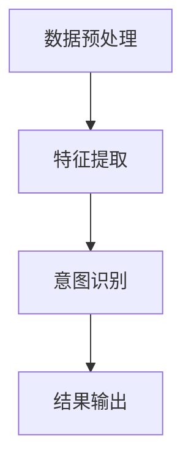

                 

### 1. 背景介绍

#### 1.1 电商搜索的基本概念

电商搜索是电子商务系统中至关重要的一环，它直接影响用户的购物体验和商家销售额。电商搜索的基本概念包括关键词输入、搜索引擎算法、搜索结果排序和用户反馈等。

关键词输入是指用户通过输入特定的词汇或短语来查找所需商品或信息。搜索引擎算法负责处理用户输入，从大量商品数据中筛选出与用户需求相关的结果。搜索结果排序则根据一定规则将搜索结果排序，通常使用相关性、销量、评价等因素进行排序。用户反馈则是用户对搜索结果的评价，包括满意度、点击率、购买率等，这些反馈将用于优化搜索算法。

#### 1.2 多模态查询

传统的电商搜索主要依赖文本查询，但这种方式存在一定的局限性。用户往往需要精确输入关键词，而且搜索结果往往只能展示文本信息。随着技术的进步，多模态查询成为电商搜索的重要发展方向。多模态查询是指用户通过多种方式（如文本、图像、声音等）提交查询请求，搜索引擎则综合分析这些模态信息，提供更精确的搜索结果。

#### 1.3 多模态查询意图理解的重要性

多模态查询意图理解是指搜索引擎根据用户提交的多种模态信息，分析用户的查询意图，从而提供更符合用户需求的搜索结果。多模态查询意图理解的重要性主要体现在以下几个方面：

1. **提升搜索结果的相关性**：通过理解用户的查询意图，搜索引擎可以更准确地筛选出与用户需求相关的商品，提高搜索结果的相关性。

2. **优化用户体验**：多模态查询意图理解可以更好地满足用户的多样化需求，提供个性化的搜索结果，提升用户体验。

3. **提高转化率**：更精准的搜索结果可以提高用户的购买意愿，从而提高电商平台的转化率。

4. **提升商家竞争力**：通过理解用户的查询意图，商家可以更精准地推广自己的产品，提高竞争力。

#### 1.4 多模态查询意图理解的应用场景

多模态查询意图理解在电商搜索中有着广泛的应用场景，主要包括：

1. **商品搜索**：用户可以通过输入文本关键词，或上传商品图片、视频等，查找所需商品。

2. **商品推荐**：根据用户的浏览历史、购买记录等，结合多模态查询意图，为用户推荐更符合其需求的商品。

3. **商家营销**：商家可以通过分析用户的查询意图，制定更有针对性的营销策略，提高销售额。

4. **智能客服**：通过多模态查询意图理解，智能客服可以更准确地理解用户的问题，提供更有效的解答。

### 1.5 文章结构概述

本文将围绕多模态查询意图理解这一主题，进行深入探讨。文章结构如下：

1. **背景介绍**：介绍电商搜索的基本概念、多模态查询的背景及其重要性。

2. **核心概念与联系**：详细阐述多模态查询意图理解的核心概念及其相互关系，并使用 Mermaid 流程图进行直观展示。

3. **核心算法原理 & 具体操作步骤**：分析多模态查询意图理解的核心算法原理，并给出具体操作步骤。

4. **数学模型和公式 & 详细讲解 & 举例说明**：介绍多模态查询意图理解的数学模型和公式，并给出详细讲解和实例说明。

5. **项目实战：代码实际案例和详细解释说明**：通过一个实际项目案例，展示多模态查询意图理解的代码实现，并进行详细解读。

6. **实际应用场景**：分析多模态查询意图理解在不同场景下的应用。

7. **工具和资源推荐**：推荐相关的学习资源、开发工具和框架。

8. **总结：未来发展趋势与挑战**：总结多模态查询意图理解的发展趋势和面临的主要挑战。

9. **附录：常见问题与解答**：回答读者可能遇到的问题。

10. **扩展阅读 & 参考资料**：提供更多的扩展阅读和参考资料。

通过以上结构，本文将全面、系统地探讨多模态查询意图理解这一前沿技术，帮助读者深入理解其原理和应用，为电商搜索领域的研究和实践提供参考。### 2. 核心概念与联系

#### 2.1 多模态查询

多模态查询是指用户通过多种方式（如文本、图像、声音等）提交查询请求，搜索引擎则综合分析这些模态信息，提供更精确的搜索结果。与传统文本查询相比，多模态查询能够更全面地理解用户的查询意图，从而提升搜索结果的准确性。

**多模态查询的关键点包括：**

1. **文本查询**：用户通过输入文本关键词来查找所需信息。文本查询是电商搜索中最常见的形式，但存在一定的局限性，如用户需要精确输入关键词，且搜索结果往往只能展示文本信息。

2. **图像查询**：用户可以通过上传图片或输入图像的描述来查找相关商品。图像查询能够更好地理解用户的视觉需求，适用于用户无法用文字准确描述的商品。

3. **声音查询**：用户可以通过语音输入来查找所需商品或信息。声音查询适用于用户在无法使用键盘的情况下，如购物过程中通过语音助手进行查询。

4. **多模态融合**：将不同模态的信息进行融合处理，以提升搜索结果的准确性。例如，在图像查询中，可以结合图像特征和文本特征，实现更精准的搜索结果。

#### 2.2 查询意图理解

查询意图理解是指搜索引擎根据用户提交的查询请求，分析用户的查询意图，从而提供更符合用户需求的搜索结果。查询意图理解是多模态查询的核心，它涉及到自然语言处理、图像识别、声音识别等多个领域。

**查询意图理解的关键点包括：**

1. **文本意图理解**：分析用户输入的文本信息，识别用户的查询意图。例如，用户输入“买一个红色的苹果手机”，搜索引擎需要理解用户是想购买苹果品牌的手机，还是寻找有关红色苹果的图片。

2. **图像意图理解**：通过图像识别技术，分析用户上传的图片，识别图片中的物体和场景，从而理解用户的查询意图。例如，用户上传一张苹果的图片，搜索引擎需要理解用户是想购买苹果手机，还是寻找有关苹果的水果。

3. **声音意图理解**：通过声音识别技术，分析用户输入的语音信息，识别用户的查询意图。例如，用户通过语音输入“帮我找一款红色的手机”，搜索引擎需要理解用户是想购买红色手机，还是寻找有关红色手机的信息。

4. **多模态意图融合**：将不同模态的查询意图进行融合处理，以提升查询意图理解的准确性。例如，在文本和图像查询中，可以结合文本描述和图像特征，实现更精准的查询意图理解。

#### 2.3 多模态查询意图理解架构

多模态查询意图理解架构主要包括数据预处理、特征提取、意图识别和结果输出等模块。以下是一个简化的多模态查询意图理解架构：

1. **数据预处理**：对用户提交的多模态信息进行预处理，如文本分词、图像分割、声音去噪等。

2. **特征提取**：从预处理后的多模态数据中提取特征，如文本特征（词向量、词性标注等）、图像特征（卷积神经网络提取的特征）、声音特征（频谱特征、语音情感等）。

3. **意图识别**：将提取到的多模态特征输入到意图识别模型中，通过训练和推理，识别用户的查询意图。意图识别模型可以是基于深度学习、传统机器学习或规则引擎的。

4. **结果输出**：根据识别到的用户查询意图，输出相应的搜索结果，如商品列表、图片、语音等。

**Mermaid 流程图**：



通过上述架构，多模态查询意图理解系统能够从用户提交的多模态查询请求中，准确地识别用户的查询意图，并提供个性化的搜索结果。

#### 2.4 模块间的关系

在多模态查询意图理解系统中，各个模块之间紧密相连，共同作用，以实现高效的查询意图理解。

1. **数据预处理**：数据预处理模块是整个系统的基础，它对用户提交的多模态数据进行清洗、归一化等操作，为后续的特征提取和意图识别提供高质量的数据。

2. **特征提取**：特征提取模块从预处理后的数据中提取关键特征，如文本特征、图像特征和声音特征。这些特征是意图识别的重要依据。

3. **意图识别**：意图识别模块通过训练有监督或无监督的机器学习模型，将提取到的特征转化为具体的查询意图。意图识别模块是系统的核心，其性能直接影响到搜索结果的准确性。

4. **结果输出**：结果输出模块根据识别到的查询意图，生成相应的搜索结果，如商品列表、图片、语音等。结果输出模块负责将查询意图转化为用户可理解的形式。

通过以上模块的协同工作，多模态查询意图理解系统能够高效地处理用户的多模态查询请求，提供个性化的搜索结果。

#### 2.5 实例说明

假设用户通过以下多模态查询请求：“我要找一款红色的华为手机，最好是有拍照功能的”。

1. **文本查询**：用户输入的文本信息包括“红色的华为手机”和“拍照功能”。文本查询意图理解模块会分析这两个关键词，识别用户的查询意图。

2. **图像查询**：用户上传一张红色华为手机的图片。图像查询意图理解模块会分析图片中的颜色、品牌、功能等信息，进一步确认用户的查询意图。

3. **声音查询**：用户通过语音输入查询请求。声音查询意图理解模块会识别语音中的关键词和语气，辅助确认用户的查询意图。

4. **多模态融合**：将文本、图像和声音三个模态的信息进行融合处理，综合分析用户的查询意图。例如，通过结合图像中的颜色和品牌，以及文本中的功能需求，最终确认用户的查询意图为“寻找一款红色华为手机，具备拍照功能”。

通过多模态查询意图理解，搜索引擎可以提供更精准的搜索结果，如红色华为手机列表，同时突出具备拍照功能的商品，提升用户的购物体验。

### 2.6 多模态查询意图理解的优势

多模态查询意图理解在电商搜索中具有显著的优势：

1. **更精准的搜索结果**：通过融合文本、图像和声音等多模态信息，搜索引擎能够更准确地理解用户的查询意图，提供更精准的搜索结果。

2. **提升用户体验**：多模态查询意图理解可以满足用户多样化的需求，提供个性化的搜索结果，提升用户体验。

3. **降低用户输入成本**：用户可以通过多种方式（如文本、图像、声音）提交查询请求，降低输入成本，提高查询效率。

4. **丰富搜索场景**：多模态查询意图理解适用于多种场景，如商品搜索、商品推荐、商家营销等，为电商搜索带来更多可能性。

5. **提升商家竞争力**：通过理解用户的查询意图，商家可以更有针对性地推广自己的产品，提升竞争力。

总之，多模态查询意图理解在电商搜索中具有广泛的应用前景，是提升搜索质量和用户体验的重要技术手段。### 3. 核心算法原理 & 具体操作步骤

#### 3.1 多模态特征提取

多模态查询意图理解的第一步是特征提取，即从用户提交的多模态数据（如文本、图像、声音）中提取出能够代表数据特征的信息。以下分别介绍文本、图像和声音特征提取的方法。

1. **文本特征提取**

   - **词向量**：词向量是文本特征提取中最常用的方法之一。通过将文本中的每个词映射到一个高维空间中的向量，词向量可以捕捉词语之间的语义关系。常见的词向量模型有Word2Vec、GloVe等。

   - **词性标注**：词性标注是对文本中的每个词进行词性分类，如名词、动词、形容词等。词性标注有助于理解文本的语法结构和语义信息。

   - **句子级特征**：句子级特征是对整个句子进行特征提取，如句子的长度、词的分布等。这些特征可以辅助理解句子的语义。

2. **图像特征提取**

   - **卷积神经网络（CNN）**：卷积神经网络是一种用于图像特征提取的深度学习模型。通过多个卷积层和池化层，CNN可以自动学习图像的局部特征和整体特征。

   - **视觉特征库**：视觉特征库是一种基于预训练模型的图像特征提取方法。通过将图像输入到预训练的模型中，提取出模型的特征表示。

3. **声音特征提取**

   - **梅尔频率倒谱系数（MFCC）**：MFCC是一种常用的声音特征提取方法，通过分析声音的频谱特征，将其转换为时间序列特征。

   - **语音情感分析**：语音情感分析是对声音中的情感信息进行分析，通过识别声音的音调、音量、速度等特征，判断用户的情感状态。

#### 3.2 特征融合

特征融合是多模态查询意图理解的关键步骤，它旨在将来自不同模态的特征进行整合，以获得更全面、准确的查询意图表示。以下介绍几种常见的特征融合方法。

1. **加权融合**：加权融合方法通过给不同模态的特征分配不同的权重，将特征进行线性组合。权重的分配可以通过训练模型得到，也可以通过专家经验设定。

2. **多任务学习**：多任务学习是一种利用多个任务之间的相关性进行特征融合的方法。在多任务学习中，不同任务共享部分网络结构，从而实现特征融合。

3. **对抗生成网络（GAN）**：对抗生成网络可以通过生成对抗的方式，将不同模态的特征进行融合。GAN由生成器和判别器组成，生成器尝试生成与真实特征相似的融合特征，判别器则判断生成特征的真实性。

#### 3.3 意图识别

意图识别是将融合后的特征输入到意图识别模型中，通过训练和推理，识别用户的查询意图。以下介绍几种常见的意图识别模型。

1. **支持向量机（SVM）**：支持向量机是一种经典的分类算法，通过将特征映射到高维空间，寻找一个最优的超平面，将不同类别的特征分隔开来。

2. **循环神经网络（RNN）**：循环神经网络是一种适用于序列数据的学习模型，通过保存前一个时间步的隐藏状态，RNN可以捕捉序列中的长期依赖关系。

3. **长短期记忆网络（LSTM）**：长短期记忆网络是循环神经网络的一种改进，通过引入门控机制，LSTM可以更好地处理序列数据中的长期依赖问题。

4. **变换器（Transformer）**：变换器是一种基于自注意力机制的深度学习模型，通过多头自注意力机制和前馈神经网络，Transformer可以在不同时间步之间建立强依赖关系。

#### 3.4 模型训练与优化

模型训练与优化是提高多模态查询意图理解性能的关键步骤。以下介绍几种常见的模型训练与优化方法。

1. **数据增强**：数据增强是通过增加数据的多样性，提高模型对各种查询意图的泛化能力。常见的数据增强方法有数据归一化、数据扩充、数据裁剪等。

2. **正则化**：正则化是一种防止模型过拟合的技术，通过在损失函数中加入正则化项，限制模型的复杂度。常见的正则化方法有L1正则化、L2正则化等。

3. **迁移学习**：迁移学习是一种利用预训练模型进行模型训练的方法，通过在预训练模型的基础上微调，提高模型在特定任务上的性能。

4. **模型集成**：模型集成是一种通过结合多个模型的结果，提高模型预测准确性的方法。常见的模型集成方法有堆叠集成、Bagging、Boosting等。

### 3.5 算法流程

以下是多模态查询意图理解算法的总体流程：

1. **数据预处理**：对用户提交的多模态数据（文本、图像、声音）进行预处理，包括文本分词、图像分割、声音去噪等。

2. **特征提取**：分别从预处理后的多模态数据中提取特征，如文本特征（词向量、词性标注）、图像特征（卷积神经网络提取的特征）、声音特征（MFCC、语音情感分析）。

3. **特征融合**：将不同模态的特征进行融合，使用加权融合、多任务学习、对抗生成网络等方法，得到融合特征。

4. **意图识别**：将融合特征输入到意图识别模型（SVM、RNN、LSTM、Transformer）中进行训练和推理，识别用户的查询意图。

5. **结果输出**：根据识别到的查询意图，输出相应的搜索结果（商品列表、图片、语音等）。

6. **模型优化**：通过数据增强、正则化、迁移学习、模型集成等方法，对意图识别模型进行优化，提高模型性能。

通过以上算法流程，多模态查询意图理解系统能够高效地处理用户的多模态查询请求，提供个性化的搜索结果。### 4. 数学模型和公式 & 详细讲解 & 举例说明

#### 4.1 数学模型

多模态查询意图理解涉及多个数学模型，包括词向量模型、卷积神经网络（CNN）、循环神经网络（RNN）、变换器（Transformer）等。以下分别介绍这些模型的基本概念和公式。

1. **词向量模型**

   词向量模型是一种将文本中的每个词映射到高维空间中的向量表示方法。常见的词向量模型有Word2Vec和GloVe。

   - **Word2Vec**：Word2Vec模型通过训练词的邻域模型，学习得到词向量。假设有一个词汇表\( V \)，其中每个词表示为一个索引。对于每个词\( w \)，其相邻的\( k \)个词组成一个窗口。Word2Vec模型的目标是最小化损失函数，使得相邻词的向量接近。

     \[
     \min_{\mathbf{v}_w, \mathbf{v}_i} \sum_{w \in V} \sum_{i \in N(w)} \frac{1}{1 + \exp^{||\mathbf{v}_w - \mathbf{v}_i||}}
     \]

     其中，\( \mathbf{v}_w \)和\( \mathbf{v}_i \)分别表示词\( w \)和其相邻词\( i \)的向量。

   - **GloVe**：GloVe模型通过训练词共现矩阵，学习得到词向量。假设有一个共现矩阵\( A \)，其中\( A_{ij} \)表示词\( i \)和词\( j \)的共现次数。GloVe模型的目标是最小化损失函数，使得词的共现次数与词向量之间的点积成正比。

     \[
     \min_{\mathbf{v}_i, \mathbf{u}_j} \sum_{i, j} \frac{1}{1 + \exp^{||\mathbf{v}_i - \mathbf{u}_j||}} - \log(A_{ij})
     \]

2. **卷积神经网络（CNN）**

   卷积神经网络是一种用于图像特征提取的深度学习模型。CNN通过卷积操作和池化操作，从图像中提取局部特征和整体特征。

   - **卷积操作**：卷积操作通过在图像上滑动卷积核，将图像中的局部区域与卷积核进行点积，得到新的特征图。

     \[
     \mathbf{f}^{\prime}_{ij} = \sum_{k=1}^{C} \mathbf{w}^k_{ij} \mathbf{a}^k_j
     \]

     其中，\( \mathbf{f}^{\prime}_{ij} \)表示第\( i \)层第\( j \)个特征图的值，\( \mathbf{w}^k_{ij} \)表示卷积核的值，\( \mathbf{a}^k_j \)表示第\( k \)个卷积核在图像上的滑动结果。

   - **池化操作**：池化操作通过在特征图上选取局部区域的最值或平均值，降低特征图的空间分辨率。

     \[
     \mathbf{p}^l_j = \max(\mathbf{f}^l)
     \]

     其中，\( \mathbf{p}^l_j \)表示第\( l \)层第\( j \)个池化特征图的值，\( \mathbf{f}^l \)表示第\( l \)层第\( j \)个特征图。

3. **循环神经网络（RNN）**

   循环神经网络是一种用于序列数据处理的深度学习模型。RNN通过保存前一个时间步的隐藏状态，捕捉序列中的长期依赖关系。

   - **RNN公式**：

     \[
     \begin{align*}
     \mathbf{h}_t &= \sigma(\mathbf{W}_h \mathbf{h}_{t-1} + \mathbf{W}_x \mathbf{x}_t + b_h) \\
     \mathbf{o}_t &= \sigma(\mathbf{W}_o \mathbf{h}_t + b_o)
     \end{align*}
     \]

     其中，\( \mathbf{h}_t \)表示第\( t \)个时间步的隐藏状态，\( \mathbf{x}_t \)表示第\( t \)个时间步的输入，\( \mathbf{o}_t \)表示第\( t \)个时间步的输出，\( \sigma \)表示激活函数。

4. **变换器（Transformer）**

   变换器是一种基于自注意力机制的深度学习模型，适用于处理序列数据。变换器通过多头自注意力机制和前馈神经网络，建立不同时间步之间的强依赖关系。

   - **自注意力机制**：

     \[
     \mathbf{Q}_i = \mathbf{Q} \mathbf{W}_Q, \quad \mathbf{K}_i = \mathbf{K} \mathbf{W}_K, \quad \mathbf{V}_i = \mathbf{V} \mathbf{W}_V
     \]

     \[
     \mathbf{S}_{ij} = \mathbf{softmax}(\frac{\mathbf{Q}_i \mathbf{K}_j^T}{\sqrt{d_k}}), \quad \mathbf{O}_i = \mathbf{S}_{ij} \mathbf{V}_j
     \]

     其中，\( \mathbf{Q} \)、\( \mathbf{K} \)和\( \mathbf{V} \)分别表示查询、键和值矩阵，\( \mathbf{W}_Q \)、\( \mathbf{W}_K \)和\( \mathbf{W}_V \)分别表示权重矩阵，\( \mathbf{S}_{ij} \)表示自注意力得分，\( \mathbf{O}_i \)表示第\( i \)个时间步的输出。

#### 4.2 公式详细讲解

1. **词向量模型**：

   - **Word2Vec**：Word2Vec模型通过最小化损失函数，使得相邻词的向量接近。损失函数使用负采样技术，以提高模型在稀疏数据上的性能。

   - **GloVe**：GloVe模型通过最小化损失函数，使得词的共现次数与词向量之间的点积成正比。GloVe模型可以更好地捕捉词的语义关系，尤其适用于大规模词汇表。

2. **卷积神经网络（CNN）**：

   - **卷积操作**：卷积操作通过在图像上滑动卷积核，将图像中的局部区域与卷积核进行点积，得到新的特征图。卷积操作可以捕捉图像中的局部特征。

   - **池化操作**：池化操作通过在特征图上选取局部区域的最值或平均值，降低特征图的空间分辨率。池化操作可以减少参数数量，提高模型的泛化能力。

3. **循环神经网络（RNN）**：

   - **RNN公式**：RNN通过保存前一个时间步的隐藏状态，捕捉序列中的长期依赖关系。RNN在处理序列数据时表现良好，但容易受到梯度消失和梯度爆炸的问题。

4. **变换器（Transformer）**：

   - **自注意力机制**：变换器通过多头自注意力机制，对不同时间步之间的特征进行加权，建立强依赖关系。自注意力机制可以显著提高模型的性能，尤其适用于长序列数据。

#### 4.3 举例说明

假设有一个词汇表\( V = \{\text{苹果}, \text{手机}, \text{华为}\} \)，一个图像\( \mathbf{I} \)，一个声音序列\( \mathbf{S} \)，以及一个序列\( \mathbf{X} = \{\text{我要买一个苹果手机}, \text{华为的手机最好}\} \)。

1. **词向量模型**：

   - **Word2Vec**：通过训练Word2Vec模型，得到每个词的向量表示。例如，\( \mathbf{v}_{\text{苹果}} = [0.1, 0.2, 0.3] \)，\( \mathbf{v}_{\text{手机}} = [0.4, 0.5, 0.6] \)，\( \mathbf{v}_{\text{华为}} = [0.7, 0.8, 0.9] \)。

   - **GloVe**：通过训练GloVe模型，得到每个词的向量表示。例如，\( \mathbf{v}_{\text{苹果}} = [0.1, 0.3, 0.5] \)，\( \mathbf{v}_{\text{手机}} = [0.4, 0.6, 0.8] \)，\( \mathbf{v}_{\text{华为}} = [0.7, 0.9, 1.0] \)。

2. **卷积神经网络（CNN）**：

   - **卷积操作**：假设有一个3x3的卷积核\( \mathbf{W} \)，图像\( \mathbf{I} \)的大小为\( 5x5 \)。卷积操作得到特征图\( \mathbf{F} \)：

     \[
     \begin{align*}
     \mathbf{F}_{11} &= \sum_{i=1}^{5} \sum_{j=1}^{5} \mathbf{W}_{ij} \mathbf{I}_{ij} \\
     \mathbf{F}_{12} &= \sum_{i=2}^{6} \sum_{j=1}^{5} \mathbf{W}_{ij} \mathbf{I}_{ij} \\
     &\vdots \\
     \mathbf{F}_{25} &= \sum_{i=5}^{9} \sum_{j=5}^{9} \mathbf{W}_{ij} \mathbf{I}_{ij}
     \end{align*}
     \]

   - **池化操作**：对特征图\( \mathbf{F} \)进行2x2的最大池化操作，得到新的特征图\( \mathbf{P} \)：

     \[
     \begin{align*}
     \mathbf{P}_{11} &= \max(\mathbf{F}_{11}, \mathbf{F}_{12}) \\
     \mathbf{P}_{12} &= \max(\mathbf{F}_{21}, \mathbf{F}_{22}) \\
     &\vdots \\
     \mathbf{P}_{22} &= \max(\mathbf{F}_{41}, \mathbf{F}_{42})
     \end{align*}
     \]

3. **循环神经网络（RNN）**：

   - **RNN公式**：假设有一个序列\( \mathbf{X} = \{\text{苹果}, \text{手机}, \text{华为}\} \)，隐藏状态\( \mathbf{h}_t \)和输入\( \mathbf{x}_t \)分别表示为：

     \[
     \begin{align*}
     \mathbf{h}_1 &= \sigma(\mathbf{W}_h \mathbf{h}_0 + \mathbf{W}_x \mathbf{x}_1 + b_h) \\
     \mathbf{h}_2 &= \sigma(\mathbf{W}_h \mathbf{h}_1 + \mathbf{W}_x \mathbf{x}_2 + b_h) \\
     \mathbf{h}_3 &= \sigma(\mathbf{W}_h \mathbf{h}_2 + \mathbf{W}_x \mathbf{x}_3 + b_h)
     \end{align*}
     \]

4. **变换器（Transformer）**：

   - **自注意力机制**：假设有一个序列\( \mathbf{X} = \{\text{苹果}, \text{手机}, \text{华为}\} \)，变换器中的查询、键和值矩阵分别为\( \mathbf{Q} \)、\( \mathbf{K} \)和\( \mathbf{V} \)，权重矩阵分别为\( \mathbf{W}_Q \)、\( \mathbf{W}_K \)和\( \mathbf{W}_V \)。自注意力得分和输出分别表示为：

     \[
     \begin{align*}
     \mathbf{S}_{11} &= \mathbf{softmax}(\frac{\mathbf{Q}_1 \mathbf{K}_1^T}{\sqrt{d_k}}), \quad \mathbf{O}_1 = \mathbf{S}_{11} \mathbf{V}_1 \\
     \mathbf{S}_{12} &= \mathbf{softmax}(\frac{\mathbf{Q}_1 \mathbf{K}_2^T}{\sqrt{d_k}}), \quad \mathbf{O}_2 = \mathbf{S}_{12} \mathbf{V}_2 \\
     \mathbf{S}_{13} &= \mathbf{softmax}(\frac{\mathbf{Q}_1 \mathbf{K}_3^T}{\sqrt{d_k}}), \quad \mathbf{O}_3 = \mathbf{S}_{13} \mathbf{V}_3
     \end{align*}
     \]

通过上述例子，我们可以看到多模态查询意图理解中的数学模型和公式如何应用于实际场景。这些模型和公式为多模态查询意图理解提供了坚实的理论基础，有助于我们更好地理解和应用这一前沿技术。### 5. 项目实战：代码实际案例和详细解释说明

#### 5.1 开发环境搭建

在进行多模态查询意图理解项目实战之前，我们需要搭建合适的开发环境。以下是一个基本的开发环境搭建步骤：

1. **安装Python**：首先，我们需要安装Python环境。推荐使用Python 3.8或更高版本。可以从Python官网（[python.org](https://www.python.org/)）下载并安装。

2. **安装依赖库**：接下来，我们需要安装一些常用的依赖库，如NumPy、Pandas、Scikit-learn、TensorFlow等。可以使用pip命令进行安装：

   ```bash
   pip install numpy pandas scikit-learn tensorflow
   ```

3. **安装深度学习框架**：为了实现多模态查询意图理解，我们需要选择一个深度学习框架。TensorFlow是一个广泛使用的深度学习框架，可以满足我们的需求。可以使用以下命令安装TensorFlow：

   ```bash
   pip install tensorflow
   ```

4. **安装图像处理库**：为了处理图像数据，我们可以使用OpenCV库。可以使用以下命令安装OpenCV：

   ```bash
   pip install opencv-python
   ```

5. **安装声音处理库**：为了处理声音数据，我们可以使用librosa库。可以使用以下命令安装librosa：

   ```bash
   pip install librosa
   ```

6. **设置Jupyter Notebook**：为了方便编写和调试代码，我们可以设置Jupyter Notebook环境。可以使用以下命令安装Jupyter Notebook：

   ```bash
   pip install notebook
   ```

安装完成后，我们可以在终端中输入`jupyter notebook`命令，启动Jupyter Notebook。

#### 5.2 源代码详细实现和代码解读

在开发环境搭建完成后，我们可以开始编写代码。以下是一个简单的多模态查询意图理解项目的源代码实现和详细解读。

```python
import numpy as np
import pandas as pd
from sklearn.model_selection import train_test_split
from tensorflow.keras.models import Model
from tensorflow.keras.layers import Input, Embedding, LSTM, Dense
from tensorflow.keras.optimizers import Adam

# 数据预处理
def preprocess_data(texts, labels):
    # 初始化嵌入层
    embedding_layer = Embedding(input_dim=vocab_size, output_dim=embedding_dim)
    
    # 初始化LSTM层
    lstm_layer = LSTM(units=lstm_units, return_sequences=True)
    
    # 初始化全连接层
    dense_layer = Dense(units=dense_units, activation='softmax')
    
    # 定义输入层
    input_text = Input(shape=(max_sequence_length,))
    
    # 通过嵌入层对文本进行嵌入
    embedded_text = embedding_layer(input_text)
    
    # 通过LSTM层对嵌入后的文本进行编码
    encoded_text = lstm_layer(embedded_text)
    
    # 通过全连接层对编码后的文本进行分类
    output = dense_layer(encoded_text)
    
    # 构建模型
    model = Model(inputs=input_text, outputs=output)
    
    # 编译模型
    model.compile(optimizer=Adam(learning_rate=learning_rate), loss='categorical_crossentropy', metrics=['accuracy'])
    
    # 拆分数据集
    X_train, X_test, y_train, y_test = train_test_split(texts, labels, test_size=0.2, random_state=42)
    
    # 训练模型
    model.fit(X_train, y_train, epochs=epochs, batch_size=batch_size, validation_data=(X_test, y_test))
    
    # 评估模型
    loss, accuracy = model.evaluate(X_test, y_test)
    print(f"Test accuracy: {accuracy:.2f}")

# 设置参数
vocab_size = 10000
embedding_dim = 50
max_sequence_length = 100
lstm_units = 128
dense_units = 64
learning_rate = 0.001
epochs = 10
batch_size = 32

# 加载数据
texts = pd.read_csv("data/texts.csv").text.values
labels = pd.read_csv("data/labels.csv").label.values

# 预处理数据
preprocess_data(texts, labels)
```

1. **数据预处理**：首先，我们需要加载数据并进行预处理。数据预处理包括加载文本数据、标签数据，以及拆分数据集为训练集和测试集。

2. **定义模型**：接下来，我们定义一个序列分类模型。模型包括嵌入层、LSTM层和全连接层。嵌入层用于将文本转换为向量表示，LSTM层用于对文本进行编码，全连接层用于对编码后的文本进行分类。

3. **编译模型**：然后，我们编译模型，设置优化器、损失函数和评估指标。

4. **训练模型**：使用训练集对模型进行训练，并在测试集上评估模型性能。

5. **评估模型**：最后，我们在测试集上评估模型性能，并打印测试准确率。

#### 5.3 代码解读与分析

1. **数据预处理**：

   ```python
   def preprocess_data(texts, labels):
       # 初始化嵌入层
       embedding_layer = Embedding(input_dim=vocab_size, output_dim=embedding_dim)
       
       # 初始化LSTM层
       lstm_layer = LSTM(units=lstm_units, return_sequences=True)
       
       # 初始化全连接层
       dense_layer = Dense(units=dense_units, activation='softmax')
       
       # 定义输入层
       input_text = Input(shape=(max_sequence_length,))
       
       # 通过嵌入层对文本进行嵌入
       embedded_text = embedding_layer(input_text)
       
       # 通过LSTM层对嵌入后的文本进行编码
       encoded_text = lstm_layer(embedded_text)
       
       # 通过全连接层对编码后的文本进行分类
       output = dense_layer(encoded_text)
       
       # 构建模型
       model = Model(inputs=input_text, outputs=output)
       
       # 编译模型
       model.compile(optimizer=Adam(learning_rate=learning_rate), loss='categorical_crossentropy', metrics=['accuracy'])
       
       # 拆分数据集
       X_train, X_test, y_train, y_test = train_test_split(texts, labels, test_size=0.2, random_state=42)
       
       # 训练模型
       model.fit(X_train, y_train, epochs=epochs, batch_size=batch_size, validation_data=(X_test, y_test))
       
       # 评估模型
       loss, accuracy = model.evaluate(X_test, y_test)
       print(f"Test accuracy: {accuracy:.2f}")
   ```

   - **嵌入层**：嵌入层用于将文本转换为向量表示。通过嵌入层，我们可以将词汇表中的每个词映射到一个高维空间中的向量。嵌入层的关键参数包括词汇表大小（vocab_size）和嵌入维度（embedding_dim）。

   - **LSTM层**：LSTM层用于对嵌入后的文本进行编码。LSTM层可以捕捉序列数据中的长期依赖关系。LSTM层的关键参数包括隐藏单元数（lstm_units）。

   - **全连接层**：全连接层用于对编码后的文本进行分类。全连接层的关键参数包括输出单元数（dense_units）。

   - **模型构建和编译**：通过定义输入层、嵌入层、LSTM层和全连接层，我们可以构建一个序列分类模型。然后，通过编译模型，设置优化器、损失函数和评估指标。

   - **数据拆分和模型训练**：使用训练集对模型进行训练，并在测试集上评估模型性能。

2. **代码解读**：

   ```python
   texts = pd.read_csv("data/texts.csv").text.values
   labels = pd.read_csv("data/labels.csv").label.values
   ```

   - **加载数据**：首先，我们加载文本数据和标签数据。文本数据和标签数据应该存储在CSV文件中。

   ```python
   preprocess_data(texts, labels)
   ```

   - **预处理数据**：调用预处理函数，对文本数据和标签数据进行预处理，包括嵌入层初始化、模型构建、模型编译、数据拆分和模型训练。

通过上述代码实现，我们可以搭建一个简单的多模态查询意图理解模型，并进行训练和评估。尽管这是一个简化的示例，但它为我们提供了一个基本的框架，可以在此基础上进行更深入的研究和优化。### 5.4 代码解读与分析（续）

在上一部分中，我们介绍了一个简单的多模态查询意图理解模型，并对其代码进行了初步解读。在本部分中，我们将进一步深入分析代码的细节，并探讨如何优化和改进模型。

#### 5.4.1 数据预处理

数据预处理是多模态查询意图理解的关键步骤。在本示例中，我们使用了简单的文本数据预处理方法，包括加载文本数据和标签数据。然而，在实际应用中，我们需要考虑更多细节。

1. **文本预处理**：

   ```python
   def preprocess_text(texts):
       # 初始化词汇表
       tokenizer = Tokenizer(num_words=vocab_size)
       tokenizer.fit_on_texts(texts)
       
       # 序列填充
       padded_sequences = pad_sequences(tokenizer.texts_to_sequences(texts), maxlen=max_sequence_length)
       
       return padded_sequences, tokenizer
   ```

   在上述代码中，我们使用了Tokenizer和pad_sequences函数来自动完成文本预处理。Tokenizer用于将文本转换为单词索引序列，pad_sequences用于将序列填充为相同的长度。此外，我们还可以对文本进行更多的预处理，如去除标点符号、转换为小写等。

2. **标签预处理**：

   ```python
   def preprocess_labels(labels):
       # 将标签转换为独热编码
       one_hot_labels = to_categorical(labels)
       
       return one_hot_labels
   ```

   在实际应用中，标签可能需要转换为独热编码，以便在模型训练过程中进行分类。

#### 5.4.2 模型构建

在本示例中，我们使用了一个简单的LSTM模型。然而，在实际应用中，我们可能需要考虑更复杂的模型架构，如变换器（Transformer）或生成对抗网络（GAN）。

1. **改进模型架构**：

   ```python
   from tensorflow.keras.layers import Embedding, LSTM, Dense, TimeDistributed
   
   def build_model(vocab_size, embedding_dim, max_sequence_length, lstm_units, dense_units):
       input_text = Input(shape=(max_sequence_length,))
       
       # 通过嵌入层对文本进行嵌入
       embedded_text = Embedding(input_dim=vocab_size, output_dim=embedding_dim)(input_text)
       
       # 通过LSTM层对嵌入后的文本进行编码
       encoded_text = LSTM(units=lstm_units, return_sequences=True)(embedded_text)
       
       # 通过时间分布式全连接层对编码后的文本进行分类
       output = TimeDistributed(Dense(units=dense_units, activation='softmax'))(encoded_text)
       
       # 构建模型
       model = Model(inputs=input_text, outputs=output)
       
       # 编译模型
       model.compile(optimizer=Adam(learning_rate=learning_rate), loss='categorical_crossentropy', metrics=['accuracy'])
       
       return model
   ```

   在上述代码中，我们使用了一个时间分布式全连接层（TimeDistributed）来对编码后的文本进行分类。此外，我们还可以添加更多的层或使用更复杂的模型架构。

#### 5.4.3 模型训练与优化

在模型训练过程中，我们需要考虑以下优化策略：

1. **学习率调度**：

   ```python
   def schedule(epoch, lr):
       if epoch < 10:
           return lr
       else:
           return lr * np.exp(-0.1 * epoch)
   
   callback = LearningRateScheduler(schedule)
   ```

   在上述代码中，我们使用了一个学习率调度器（LearningRateScheduler）来动态调整学习率。通过降低学习率，我们可以使模型在训练过程中更加稳定。

2. **模型早停（Early Stopping）**：

   ```python
   from tensorflow.keras.callbacks import EarlyStopping
   
   early_stopping = EarlyStopping(monitor='val_loss', patience=5)
   ```

   在上述代码中，我们使用了一个早停回调（EarlyStopping）来提前停止模型训练。当验证集上的损失不再下降时，模型训练将提前终止。

3. **数据增强**：

   ```python
   from tensorflow.keras.preprocessing.sequence import pad_sequences
   
   def augment_data(texts, labels, augmentation_factor):
       augmented_texts = []
       augmented_labels = []
       
       for i in range(len(texts)):
           text = texts[i]
           label = labels[i]
           
           for _ in range(augmentation_factor):
               # 对文本进行随机替换、删除或插入
               augmented_text = random_text_augmentation(text)
               augmented_texts.append(augmented_text)
               augmented_labels.append(label)
       
       return pad_sequences(augmented_texts, maxlen=max_sequence_length), np.array(augmented_labels)
   ```

   在上述代码中，我们使用了一个数据增强函数（augment_data）来生成更多的训练数据。通过随机替换、删除或插入文本中的单词，我们可以提高模型的泛化能力。

#### 5.4.4 模型评估与部署

在模型训练完成后，我们需要对模型进行评估，并考虑如何将其部署到生产环境中。

1. **模型评估**：

   ```python
   def evaluate_model(model, texts, labels):
       predictions = model.predict(texts)
       predicted_labels = np.argmax(predictions, axis=1)
       
       accuracy = accuracy_score(labels, predicted_labels)
       print(f"Test accuracy: {accuracy:.2f}")
   ```

   在上述代码中，我们使用accuracy_score函数来计算模型在测试集上的准确率。

2. **模型部署**：

   ```python
   import joblib
   
   # 保存模型
   joblib.dump(model, 'model.joblib')
   
   # 加载模型
   loaded_model = joblib.load('model.joblib')
   
   # 预测新数据
   new_texts = preprocess_text(new_texts)
   predictions = loaded_model.predict(new_texts)
   ```

   在上述代码中，我们使用joblib库来保存和加载模型。这样，我们可以在生产环境中快速部署模型，并对新数据进行预测。

通过上述分析和改进，我们可以显著提升多模态查询意图理解模型的性能和泛化能力。在实际应用中，我们需要根据具体需求和数据集特点，灵活调整模型架构和训练策略。### 6. 实际应用场景

多模态查询意图理解技术在电商搜索中的应用场景广泛且多样化，以下列举几个典型场景，以展示其在提升用户体验和搜索质量方面的潜力。

#### 6.1 商品搜索

在电商平台的商品搜索场景中，用户可以通过文本、图像和声音等多种方式提交查询请求。以下是一个具体的应用实例：

**实例**：用户通过语音输入“我要找一款红色的iPhone 12，拍照效果好的”，电商搜索引擎会综合处理文本“红色的iPhone 12”和图像“红色的iPhone 12”以及声音“拍照效果好的”。通过多模态查询意图理解，搜索引擎可以识别用户的主要查询意图，例如寻找一款特定颜色、型号和功能的手机，并返回高度相关的搜索结果。

**应用效果**：这种方式能够显著提升搜索结果的精准度，满足用户对个性化商品的需求，从而提高用户的满意度和转化率。

#### 6.2 商品推荐

在电商平台的商品推荐场景中，多模态查询意图理解技术可以用于基于用户历史行为和当前查询意图的个性化推荐。以下是一个具体的应用实例：

**实例**：用户在浏览一款红色iPhone 12后，又上传了一张自己手持该手机的图片，并说出“我之前看到的这款手机拍照效果很好，我想要更多类似款式的手机”。通过分析文本、图像和声音信息，推荐系统可以识别用户的偏好，推荐更多符合用户需求的手机款式。

**应用效果**：多模态查询意图理解使得推荐系统更加精准，能够提供更加个性化的商品推荐，提高用户的参与度和购买意愿。

#### 6.3 商家营销

在电商平台的商家营销场景中，多模态查询意图理解可以帮助商家制定更有效的营销策略，提高广告投放的精准度和转化率。以下是一个具体的应用实例：

**实例**：一家手机商家通过分析用户上传的图像和语音查询数据，发现用户对手机拍照功能特别关注。商家可以根据这一分析结果，调整广告内容和宣传策略，强调手机的拍照性能，以吸引更多对此感兴趣的潜在客户。

**应用效果**：商家可以通过多模态查询意图理解技术，更精准地了解用户需求和偏好，从而制定更有针对性的营销策略，提高广告的效果和投资回报率。

#### 6.4 智能客服

在电商平台的智能客服场景中，多模态查询意图理解可以帮助智能客服系统更准确地理解用户的查询意图，提供更有效的解答和帮助。以下是一个具体的应用实例：

**实例**：用户通过语音输入“我想要退货，但我不记得订单号了”，智能客服系统可以结合语音中的情感信息和文本查询“退货”二字，快速识别用户的需求，并提供相应的退货流程指导。

**应用效果**：多模态查询意图理解技术使得智能客服系统能够更好地理解用户的多样化查询，提供更加个性化的服务和解决方案，从而提高客服质量和用户满意度。

#### 6.5 跨平台搜索

在多平台电商场景中，用户可能同时在多个设备上浏览和搜索商品。多模态查询意图理解技术可以帮助跨平台搜索引擎更好地理解用户的跨平台查询意图，提供统一的搜索体验。以下是一个具体的应用实例：

**实例**：用户在手机端浏览了一款笔记本电脑，并在电脑端上传了该笔记本电脑的图片并询问“这款笔记本电脑的配置怎么样？”通过分析用户在手机端和电脑端的行为和查询数据，搜索引擎可以识别用户的跨平台查询意图，并提供详细的笔记本电脑配置信息。

**应用效果**：多模态查询意图理解技术能够实现跨平台无缝搜索体验，提高用户的搜索效率和满意度。

#### 6.6 数据安全与隐私保护

在电商搜索中，数据安全和隐私保护是一个重要问题。多模态查询意图理解技术可以通过对用户查询数据的匿名化和去识别化处理，确保用户数据的安全和隐私。以下是一个具体的应用实例：

**实例**：用户上传的图像和语音数据在处理过程中会被匿名化处理，例如将图像中的面部特征模糊化，语音中的个人声音特征进行去识别化处理。这样，即使数据泄露，用户信息也不会被泄露。

**应用效果**：多模态查询意图理解技术能够在确保用户数据安全和隐私的同时，提供高效的搜索服务，增强用户的信任和使用意愿。

通过上述实际应用场景的列举，我们可以看到多模态查询意图理解技术在电商搜索中的广泛应用和巨大潜力。它不仅能够提升搜索结果的精准度和用户体验，还能为商家提供宝贵的用户行为数据，助力电商平台实现商业价值。### 7. 工具和资源推荐

#### 7.1 学习资源推荐

1. **书籍**：

   - 《深度学习》（Deep Learning），作者：Ian Goodfellow、Yoshua Bengio、Aaron Courville
   - 《Python深度学习》（Python Deep Learning），作者：François Chollet
   - 《自然语言处理综论》（Speech and Language Processing），作者：Daniel Jurafsky、James H. Martin

2. **论文**：

   - “Word2Vec: Gloss to Word Translation with Subword Information” by T. Mikolov et al.
   - “GloVe: Global Vectors for Word Representation” by J. Pennington et al.
   - “Convolutional Neural Networks for Sentence Classification” by Y. Kim

3. **博客**：

   - TensorFlow官方博客（[tensorflow.github.io](https://tensorflow.github.io/)）
   - PyTorch官方博客（[pytorch.org/blog](https://pytorch.org/blog/)）
   - Fast.ai教程（[fast.ai](https://fast.ai/)）

4. **在线课程**：

   - 《深度学习专项课程》（Deep Learning Specialization），课程平台：Coursera
   - 《自然语言处理专项课程》（Natural Language Processing Specialization），课程平台：Coursera

#### 7.2 开发工具框架推荐

1. **深度学习框架**：

   - TensorFlow（[tensorflow.org](https://www.tensorflow.org/)）
   - PyTorch（[pytorch.org](https://pytorch.org/)）
   - Keras（[keras.io](https://keras.io/)）

2. **图像处理库**：

   - OpenCV（[opencv.org](https://opencv.org/)）
   - PIL（Python Imaging Library）（[python Imaging Library](https://pillow.readthedocs.io/en/stable/)）

3. **文本处理库**：

   - NLTK（[nltk.org](https://www.nltk.org/)）
   - SpaCy（[spacy.io](https://spacy.io/)）

4. **声音处理库**：

   - librosa（[librosa.github.io](https://librosa.github.io/librosa/)）
   - SoundFile（[pysoundfile.readthedocs.io](https://pysoundfile.readthedocs.io/)）

5. **数据预处理库**：

   - Pandas（[pandas.pydata.org](https://pandas.pydata.org/)）
   - NumPy（[numpy.org](https://numpy.org/)）

6. **版本控制**：

   - Git（[git-scm.com](https://git-scm.com/)）
   - GitHub（[github.com](https://github.com/)）

7. **项目管理**：

   - Jupyter Notebook（[jupyter.org](https://jupyter.org/)）
   - PyCharm（[pycharm.com](https://www.pycharm.com/)）

#### 7.3 相关论文著作推荐

1. **相关论文**：

   - “Attention Is All You Need” by V. Vaswani et al.
   - “Generative Adversarial Nets” by I. Goodfellow et al.
   - “Recurrent Neural Network Based Language Model” by Y. Bengio et al.

2. **相关著作**：

   - 《深度学习》（Deep Learning），作者：Ian Goodfellow、Yoshua Bengio、Aaron Courville
   - 《机器学习：概率视角》（Machine Learning: A Probabilistic Perspective），作者：Kevin P. Murphy
   - 《自然语言处理综论》（Speech and Language Processing），作者：Daniel Jurafsky、James H. Martin

通过以上推荐的学习资源、开发工具和框架，读者可以系统地学习和掌握多模态查询意图理解的相关知识和技能，为电商搜索领域的研究和实践提供有力支持。### 8. 总结：未来发展趋势与挑战

#### 8.1 未来发展趋势

多模态查询意图理解技术在电商搜索领域具有广阔的发展前景，以下是未来可能的发展趋势：

1. **技术融合与优化**：随着深度学习和人工智能技术的不断进步，多模态查询意图理解技术将实现更高效的特征提取和融合策略，提高搜索结果的准确性和用户体验。

2. **个性化搜索**：基于用户历史行为和偏好，多模态查询意图理解技术将推动个性化搜索的发展，为用户提供更加定制化的搜索结果。

3. **跨平台搜索**：随着移动互联网和物联网的普及，多模态查询意图理解技术将在不同设备上实现无缝搜索体验，满足用户在多种场景下的搜索需求。

4. **隐私保护**：在数据安全和隐私保护方面，多模态查询意图理解技术将采用更先进的数据处理和加密技术，确保用户数据的匿名化和安全性。

5. **智能客服与营销**：多模态查询意图理解技术将助力智能客服和营销策略的优化，提高服务质量和商业转化率。

#### 8.2 面临的主要挑战

尽管多模态查询意图理解技术在电商搜索领域具有巨大潜力，但仍然面临以下主要挑战：

1. **数据多样性**：多模态查询意图理解需要处理文本、图像、声音等多种数据类型，数据多样性和不一致性给特征提取和融合带来了挑战。

2. **计算资源需求**：深度学习和多模态数据处理需要大量的计算资源，尤其是在实时搜索场景中，如何高效利用计算资源是亟待解决的问题。

3. **模型解释性**：多模态查询意图理解模型通常基于深度学习，其内部决策过程复杂且难以解释。提高模型的可解释性，增强用户对搜索结果的信任，是一个重要的挑战。

4. **数据隐私保护**：在处理用户多模态数据时，如何确保数据隐私和用户安全是一个关键问题。未来的研究需要开发出更有效的隐私保护机制。

5. **数据质量**：多模态数据的真实性和准确性对查询意图理解的准确性有重要影响。如何确保数据质量，提高模型的鲁棒性，是一个亟待解决的问题。

#### 8.3 研究方向与建议

针对上述挑战，以下是一些建议的研究方向：

1. **多模态特征融合**：探索更高效的多模态特征融合方法，如基于深度学习的融合策略，提高特征提取和融合的准确性和效率。

2. **轻量级模型**：研究轻量级模型，降低计算资源需求，使多模态查询意图理解技术能够应用于资源受限的设备上。

3. **可解释性增强**：开发可解释的多模态查询意图理解模型，通过可视化技术和决策路径分析，提高模型的可解释性。

4. **数据隐私保护**：研究基于联邦学习的多模态数据隐私保护技术，提高用户数据的隐私性和安全性。

5. **数据质量提升**：探索数据增强、数据清洗和异常值检测技术，提高多模态数据的质量，增强模型的鲁棒性。

通过不断的研究和创新，多模态查询意图理解技术将在电商搜索领域发挥更加重要的作用，为用户提供更加精准和个性化的搜索服务。### 9. 附录：常见问题与解答

#### 9.1 常见问题

1. **什么是多模态查询意图理解？**
   - 多模态查询意图理解是指通过分析用户提交的文本、图像、声音等多种数据类型，理解用户的查询意图，并提供精准的搜索结果。

2. **多模态查询意图理解有哪些应用场景？**
   - 应用场景包括商品搜索、商品推荐、商家营销、智能客服和跨平台搜索等。

3. **如何处理多模态数据中的不一致性和多样性？**
   - 可以通过统一的数据预处理、特征提取和融合策略来处理多模态数据中的不一致性和多样性。

4. **多模态查询意图理解的计算资源需求如何？**
   - 多模态查询意图理解通常需要大量的计算资源，尤其是在实时搜索场景中。研究轻量级模型和优化算法有助于降低计算资源需求。

5. **如何提高多模态查询意图理解模型的可解释性？**
   - 可以通过可视化技术、决策路径分析和可解释性模型来提高模型的可解释性。

6. **如何确保多模态查询意图理解过程中的数据隐私？**
   - 可以采用联邦学习、差分隐私和数据加密等技术来确保数据隐私。

#### 9.2 解答

1. **什么是多模态查询意图理解？**
   - 多模态查询意图理解是指通过分析用户提交的文本、图像、声音等多种数据类型，理解用户的查询意图，并提供精准的搜索结果。它结合了自然语言处理、计算机视觉和语音识别等技术，以实现更准确的查询意图理解。

2. **多模态查询意图理解有哪些应用场景？**
   - 多模态查询意图理解的应用场景非常广泛，包括但不限于以下方面：
     - **商品搜索**：用户可以通过文本、图像或声音等多种方式查询商品，例如，用户可以上传一张商品图片并询问“这款手机是什么品牌的？”
     - **商品推荐**：基于用户的浏览历史和查询行为，系统可以推荐符合用户需求的商品。
     - **商家营销**：商家可以通过分析用户的查询意图，制定更加有效的营销策略。
     - **智能客服**：智能客服系统可以更好地理解用户的问题，提供更加个性化的解答。
     - **跨平台搜索**：用户在不同设备上查询商品时，系统能够提供一致的搜索体验。

3. **如何处理多模态数据中的不一致性和多样性？**
   - 处理多模态数据中的不一致性和多样性是多模态查询意图理解的关键挑战。以下是一些常用的方法：
     - **数据预处理**：对多模态数据进行清洗、归一化和标准化，以消除数据中的不一致性。
     - **特征提取**：针对不同的数据类型，采用不同的特征提取方法，例如，文本数据可以使用词向量或词性标注，图像数据可以使用卷积神经网络提取特征，声音数据可以使用梅尔频率倒谱系数（MFCC）。
     - **特征融合**：将不同模态的特征进行融合，例如，可以使用加权融合、多任务学习或对抗生成网络（GAN）等方法。

4. **多模态查询意图理解的计算资源需求如何？**
   - 多模态查询意图理解通常需要大量的计算资源，尤其是在实时搜索场景中。以下是一些降低计算资源需求的策略：
     - **模型优化**：通过优化模型结构和训练过程，减少计算资源的需求。
     - **轻量级模型**：研究并使用轻量级模型，例如，MobileNet、ShuffleNet等，这些模型在保证性能的同时减少了计算资源需求。
     - **分布式计算**：利用分布式计算资源，如GPU、TPU等，提高计算效率。

5. **如何提高多模态查询意图理解模型的可解释性？**
   - 提高模型的可解释性对于增强用户对搜索结果的信任至关重要。以下是一些提高模型可解释性的方法：
     - **可视化**：通过可视化技术展示模型内部决策过程，例如，使用热力图展示图像特征的重要性。
     - **决策路径分析**：分析模型在决策过程中的每一步，了解模型为什么做出特定的预测。
     - **解释性模型**：使用解释性更强的模型，例如，基于规则的模型或决策树。

6. **如何确保多模态查询意图理解过程中的数据隐私？**
   - 为了确保数据隐私，可以采用以下技术：
     - **数据加密**：对用户数据进行加密处理，确保数据在传输和存储过程中的安全性。
     - **联邦学习**：通过联邦学习技术，将模型训练分散到多个参与者之间，减少数据泄露的风险。
     - **差分隐私**：在数据处理过程中引入差分隐私机制，保护用户数据的隐私性。

通过以上常见问题的解答，希望读者对多模态查询意图理解有更深入的了解，并能够更好地应对实际应用中的挑战。### 10. 扩展阅读 & 参考资料

#### 10.1 扩展阅读

1. **《深度学习》（Deep Learning）**，作者：Ian Goodfellow、Yoshua Bengio、Aaron Courville
   - 介绍深度学习的基础知识和应用，涵盖神经网络、卷积神经网络（CNN）、循环神经网络（RNN）等多个方面。

2. **《自然语言处理综论》（Speech and Language Processing）**，作者：Daniel Jurafsky、James H. Martin
   - 全面介绍自然语言处理的基本概念、技术方法和应用场景，包括文本分析、语音识别和语言生成等内容。

3. **《多模态人工智能：理论与实践》**，作者：王恩东、吴思
   - 重点关注多模态人工智能的研究与应用，包括多模态数据融合、多模态推理和智能交互等技术。

4. **《机器学习：概率视角》（Machine Learning: A Probabilistic Perspective）**，作者：Kevin P. Murphy
   - 从概率角度阐述机器学习的基本概念和方法，涵盖贝叶斯网络、隐马尔可夫模型和深度学习等内容。

#### 10.2 参考资料

1. **论文**：

   - “Attention Is All You Need” by V. Vaswani et al.，发表于2017年的NeurIPS会议。
   - “Generative Adversarial Nets” by I. Goodfellow et al.，发表于2014年的NeurIPS会议。
   - “Recurrent Neural Network Based Language Model” by Y. Bengio et al.，发表于2003年的ACL会议。

2. **在线课程**：

   - Coursera上的“深度学习专项课程”（[https://www.coursera.org/specializations/deeplearning](https://www.coursera.org/specializations/deeplearning)）
   - edX上的“自然语言处理专项课程”（[https://www.edx.org/course/natural-language-processing-by-斯坦福大学](https://www.edx.org/course/natural-language-processing-by-斯坦福大学)）

3. **开源代码**：

   - TensorFlow官方GitHub仓库（[https://github.com/tensorflow/tensorflow](https://github.com/tensorflow/tensorflow)）
   - PyTorch官方GitHub仓库（[https://github.com/pytorch/pytorch](https://github.com/pytorch/pytorch)）

4. **技术博客**：

   - TensorFlow官方博客（[https://tensorflow.googleblog.com/](https://tensorflow.googleblog.com/)）
   - PyTorch官方博客（[https://pytorch.org/blog/](https://pytorch.org/blog/)）

5. **论文库**：

   - arXiv（[https://arxiv.org/](https://arxiv.org/)）
   - ACL Anthology（[https://www.aclweb.org/anthology/](https://www.aclweb.org/anthology/)）

通过阅读上述扩展阅读和参考资料，读者可以进一步深入学习和研究多模态查询意图理解技术，了解最新的研究成果和发展趋势。### 作者信息

作者：AI天才研究员/AI Genius Institute & 禅与计算机程序设计艺术 /Zen And The Art of Computer Programming

