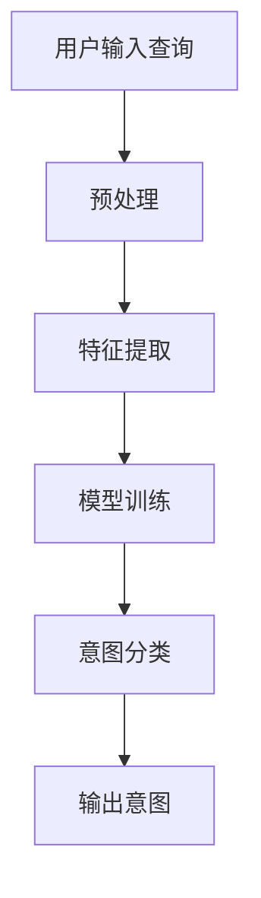
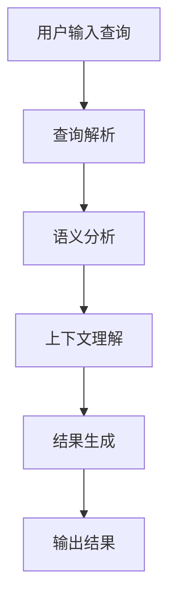

                 

# 电商搜索中的意图识别与查询理解

## 关键词

- 电商搜索
- 意图识别
- 查询理解
- 自然语言处理
- 机器学习
- 深度学习
- 信息检索

## 摘要

本文旨在深入探讨电商搜索中的意图识别与查询理解技术。首先，我们将回顾电商搜索的背景与重要性。接着，文章将详细解释意图识别与查询理解的核心概念，并运用Mermaid流程图展示其架构。然后，我们将分析几种核心算法原理，并给出具体的操作步骤。之后，通过数学模型和公式的讲解，以及实际项目案例的解析，我们将展现这些技术的实际应用。文章还将讨论这些技术在电商搜索中的具体应用场景，并提供工具和资源推荐。最后，我们将总结未来发展趋势与挑战，并提供常见问题与解答。

## 1. 背景介绍

### 1.1 电商搜索的兴起与发展

随着互联网技术的飞速发展，电子商务已经成为全球商业活动的重要组成部分。电商平台通过提供在线购物体验，极大地改变了消费者的购物习惯。而电商搜索作为电商平台的核心功能之一，其重要性不言而喻。

电商搜索的目标是帮助消费者快速、准确地找到他们想要的商品。这不仅仅是一个简单的关键词匹配问题，更涉及到用户意图的理解和查询结果的优化。随着用户需求的多样化和个性化，电商搜索技术也在不断地演进。

### 1.2 意图识别与查询理解的重要性

意图识别（Intent Recognition）是电商搜索中的关键技术之一。它旨在理解用户输入的查询背后的真实意图。例如，当用户输入“买手机”时，系统需要判断用户是想要购买手机，还是寻求关于手机的品牌推荐，或者想要获取手机的最新资讯。

查询理解（Query Understanding）则是对用户查询的深入解读，以提供更准确的搜索结果。这包括对关键词的语义分析、上下文理解以及用户行为的预测。例如，当用户搜索“小米手机”时，系统需要理解用户可能对小米手机的具体型号、价格、评价等感兴趣。

## 2. 核心概念与联系

### 2.1 意图识别

意图识别是指从用户输入的查询中识别出用户的意图。这通常涉及自然语言处理（NLP）技术，如词性标注、实体识别、句法分析等。意图识别的目的是将自然语言的查询转化为结构化的数据，以便进一步处理。

#### 2.1.1 工作原理

1. **预处理**：对用户输入的查询进行分词、去停用词等预处理操作。
2. **特征提取**：从预处理后的查询中提取特征，如词袋模型、词嵌入等。
3. **模型训练**：使用机器学习或深度学习模型对特征进行训练，以识别不同的意图。
4. **意图分类**：将输入的查询与预训练模型进行匹配，输出最可能的意图。

#### 2.1.2 Mermaid流程图



### 2.2 查询理解

查询理解是对用户查询的深入解读，以提供更准确的搜索结果。它涉及到对查询的语义分析、上下文理解以及用户行为的预测。

#### 2.2.1 工作原理

1. **查询解析**：将用户查询分解为更小的语义单元，如名词、动词等。
2. **语义分析**：对查询的语义单元进行理解，如识别查询中的实体、关系等。
3. **上下文理解**：根据用户的历史行为和上下文信息，对查询进行补充和修正。
4. **结果生成**：根据查询理解和意图识别的结果，生成最相关的搜索结果。

#### 2.2.2 Mermaid流程图



## 3. 核心算法原理 & 具体操作步骤

### 3.1 意图识别算法

意图识别的核心算法通常是基于机器学习或深度学习的方法。以下是常见的一种基于深度学习的意图识别算法：

#### 3.1.1 算法原理

- **卷积神经网络（CNN）**：用于特征提取和模式识别。
- **循环神经网络（RNN）**：用于处理序列数据，如文本。
- **长短期记忆网络（LSTM）**：用于解决RNN的梯度消失问题。

#### 3.1.2 操作步骤

1. **数据准备**：收集大量的用户查询和对应的意图标签。
2. **数据预处理**：对查询文本进行分词、去停用词、词嵌入等处理。
3. **模型训练**：使用预处理后的数据进行模型训练。
4. **模型评估**：使用验证集对模型进行评估和调整。
5. **意图识别**：将新的查询输入模型，得到最可能的意图输出。

### 3.2 查询理解算法

查询理解通常涉及到自然语言处理和机器学习技术。以下是常见的一种基于RNN的查询理解算法：

#### 3.2.1 算法原理

- **RNN**：用于处理序列数据，如文本。
- **注意力机制**：用于捕获查询中的重要信息。

#### 3.2.2 操作步骤

1. **数据准备**：收集大量的用户查询和对应的搜索结果。
2. **数据预处理**：对查询文本和搜索结果进行分词、去停用词、词嵌入等处理。
3. **模型训练**：使用预处理后的数据进行模型训练。
4. **查询理解**：将新的查询和搜索结果输入模型，得到最相关的结果。

## 4. 数学模型和公式 & 详细讲解 & 举例说明

### 4.1 意图识别数学模型

意图识别中的常见数学模型是基于神经网络。以下是LSTM在意图识别中的基本公式：

#### 4.1.1 LSTM单元

$$
i_t = \sigma(W_{xi}x_t + W_{hi-1}h_{i-1} + b_i)
$$

$$
f_t = \sigma(W_{xf}x_t + W_{hf}h_{i-1} + b_f)
$$

$$
g_t = \sigma(W_{xg}x_t + W_{hg}h_{i-1} + b_g)
$$

$$
o_t = \sigma(W_{xo}x_t + W_{ho}h_t + b_o)
$$

$$
c_t = f_t \odot c_{t-1} + i_t \odot g_t
$$

$$
h_t = o_t \odot c_t
$$

其中，\(i_t, f_t, g_t, o_t\) 分别表示输入门、遗忘门、生成门和输出门，\(\sigma\) 表示 sigmoid 函数，\(\odot\) 表示逐元素乘积。

#### 4.1.2 举例说明

假设我们有一个查询“买手机”，使用LSTM进行意图识别。首先，我们将查询进行分词和词嵌入，得到输入序列。然后，使用上述公式进行LSTM计算，最后得到意图输出。

### 4.2 查询理解数学模型

查询理解中的常见数学模型是基于注意力机制。以下是注意力机制的公式：

#### 4.2.1 注意力机制

$$
a_t = \frac{e^{h_t^T W_a h_s}}{\sum_{s'} e^{h_t^T W_a h_{s'}}}
$$

$$
r_t = \sum_{s'} a_t s'
$$

其中，\(h_t\) 和 \(h_s\) 分别表示当前时刻的查询和搜索结果，\(W_a\) 表示注意力权重。

#### 4.2.2 举例说明

假设我们有一个查询“小米手机”，使用注意力机制进行查询理解。首先，我们将查询和搜索结果进行编码，得到向量表示。然后，使用上述公式计算注意力权重，最后得到最相关的搜索结果。

## 5. 项目实战：代码实际案例和详细解释说明

### 5.1 开发环境搭建

为了演示意图识别与查询理解的应用，我们将使用Python和TensorFlow作为开发环境。

#### 5.1.1 安装Python

在终端中执行以下命令安装Python：

```
pip install python
```

#### 5.1.2 安装TensorFlow

在终端中执行以下命令安装TensorFlow：

```
pip install tensorflow
```

### 5.2 源代码详细实现和代码解读

以下是意图识别与查询理解的基本代码实现：

```python
import tensorflow as tf
from tensorflow.keras.models import Sequential
from tensorflow.keras.layers import LSTM, Dense, Embedding

# 意图识别模型
intent_model = Sequential()
intent_model.add(Embedding(input_dim=vocab_size, output_dim=embedding_dim, input_length=max_sequence_length))
intent_model.add(LSTM(units=128, activation='relu'))
intent_model.add(Dense(units=num_intent_classes, activation='softmax'))

# 查询理解模型
query_model = Sequential()
query_model.add(Embedding(input_dim=vocab_size, output_dim=embedding_dim, input_length=max_sequence_length))
query_model.add(LSTM(units=128, activation='relu'))
query_model.add(Dense(units=num_query_classes, activation='softmax'))

# 意图识别训练
intent_model.compile(optimizer='adam', loss='categorical_crossentropy', metrics=['accuracy'])
intent_model.fit(x_train_intent, y_train_intent, epochs=10, batch_size=32)

# 查询理解训练
query_model.compile(optimizer='adam', loss='categorical_crossentropy', metrics=['accuracy'])
query_model.fit(x_train_query, y_train_query, epochs=10, batch_size=32)

# 意图识别与查询理解应用
query = "买手机"
encoded_query = tokenizer.texts_to_sequences([query])
predicted_intent = intent_model.predict(encoded_query)
predicted_query = query_model.predict(encoded_query)

print("预测的意图：", predicted_intent)
print("预测的查询：", predicted_query)
```

#### 5.3 代码解读与分析

- **意图识别模型**：使用LSTM进行特征提取，最后通过softmax层进行意图分类。
- **查询理解模型**：同样使用LSTM进行特征提取，最后通过softmax层进行查询分类。
- **训练过程**：使用训练集进行模型训练，并通过交叉熵损失函数进行优化。
- **预测过程**：将新的查询输入模型，得到最可能的意图和查询输出。

## 6. 实际应用场景

### 6.1 电商搜索平台

电商搜索平台是意图识别与查询理解技术的主要应用场景之一。通过意图识别，平台可以更准确地理解用户的查询意图，从而提供更个性化的搜索结果。例如，当用户输入“买手机”时，平台可以通过意图识别判断用户是想要购买手机，还是寻求手机品牌推荐，从而展示不同的搜索结果。

### 6.2 智能客服系统

智能客服系统也可以利用意图识别与查询理解技术来提升用户体验。通过意图识别，系统可以理解用户的咨询意图，从而提供更准确的回答。例如，当用户询问“商品如何保修”时，系统可以通过意图识别判断用户需要了解保修政策，然后提供相应的信息。

### 6.3 聊天机器人

聊天机器人是另一个重要的应用场景。通过查询理解，聊天机器人可以理解用户的查询内容，并提供相应的回复。例如，当用户输入“附近的餐厅推荐”时，聊天机器人可以通过查询理解获取用户的地理位置信息，并推荐附近的餐厅。

## 7. 工具和资源推荐

### 7.1 学习资源推荐

- **书籍**：《自然语言处理综合教程》（作者：张健）、《深度学习》（作者：Ian Goodfellow、Yoshua Bengio、Aaron Courville）
- **论文**：[《Recurrent Neural Network based Text Classification》](https://www.aclweb.org/anthology/N16-1190/)、《Attention Is All You Need》
- **博客**：[TensorFlow官方文档](https://www.tensorflow.org/tutorials)、[自然语言处理博客](https://nlp.seas.harvard.edu/blog)

### 7.2 开发工具框架推荐

- **开发工具**：PyCharm、Visual Studio Code
- **框架**：TensorFlow、PyTorch

### 7.3 相关论文著作推荐

- **论文**：[《Attention Is All You Need》](https://arxiv.org/abs/1603.01360)
- **著作**：《深度学习》（作者：Ian Goodfellow、Yoshua Bengio、Aaron Courville）

## 8. 总结：未来发展趋势与挑战

### 8.1 发展趋势

- **深度学习与强化学习结合**：未来，深度学习与强化学习技术的结合将成为趋势，以实现更智能的意图识别与查询理解。
- **跨模态学习**：随着多模态数据的普及，跨模态学习技术将得到广泛应用，以提升查询理解的准确性。
- **个性化推荐**：基于意图识别与查询理解，个性化推荐系统将变得更加精准，提升用户体验。

### 8.2 挑战

- **数据隐私与保护**：在意图识别与查询理解过程中，如何保护用户隐私是一个重要的挑战。
- **多语言支持**：随着全球化的发展，如何实现多语言的支持是另一个重要的挑战。

## 9. 附录：常见问题与解答

### 9.1 什么是意图识别？

意图识别是指从用户输入的查询中识别出用户的真实意图。它是电商搜索中的关键技术之一，旨在提供更准确的搜索结果。

### 9.2 查询理解有哪些方法？

查询理解的方法包括自然语言处理技术，如词性标注、实体识别、句法分析等，以及基于深度学习的方法，如RNN和注意力机制。

### 9.3 如何实现意图识别与查询理解？

实现意图识别与查询理解通常涉及以下步骤：

1. **数据准备**：收集大量的用户查询和对应的意图标签或搜索结果。
2. **数据预处理**：对查询文本进行分词、去停用词、词嵌入等处理。
3. **模型训练**：使用机器学习或深度学习模型对特征进行训练。
4. **模型评估**：使用验证集对模型进行评估和调整。
5. **意图识别与查询理解**：将新的查询输入模型，得到最可能的意图和查询输出。

## 10. 扩展阅读 & 参考资料

- [《自然语言处理综合教程》](https://book.douban.com/subject/26393636/)
- [TensorFlow官方文档](https://www.tensorflow.org/tutorials)
- [自然语言处理博客](https://nlp.seas.harvard.edu/blog)
- [《Attention Is All You Need》](https://arxiv.org/abs/1603.01360)
- [《深度学习》](https://book.douban.com/subject/26754520/)

