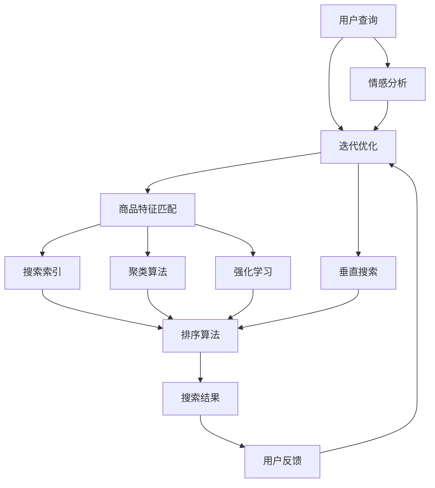

                 

### 背景介绍

在当今的电子商务时代，搜索功能已经成为电商平台的核心组成部分。用户通过搜索功能查找所需的商品，电商平台则需要提供高效、准确的搜索结果以提升用户体验。这其中，查询理解与商品映射技术扮演着至关重要的角色。

**查询理解（Query Understanding）** 是指从用户输入的查询中提取出用户意图和相关信息，以更好地匹配和推荐商品。例如，用户输入“红色的跑步鞋”，系统需要理解用户的需求是购买一双红色的跑步鞋，而不是查询红色跑步鞋的库存量或者相关评论。

**商品映射（Product Mapping）** 则是指将用户查询与电商平台上的商品进行匹配，以便提供最相关、最符合用户需求的搜索结果。商品映射不仅要考虑商品的名称、描述等基本信息，还要考虑商品的属性、评价、价格等多个维度。

随着电商平台的规模不断扩大，商品种类和数量急剧增加，传统的基于关键词匹配的搜索方法已经无法满足用户的需求。为了提供更精确、个性化的搜索体验，电商平台开始引入查询理解与商品映射技术，通过深度学习、自然语言处理等技术手段，提升搜索的准确性和效率。

本文将首先介绍查询理解与商品映射技术的核心概念和架构，然后深入探讨其中的核心算法原理，最后通过一个实际的项目实战案例，详细讲解这些技术在开发中的具体应用。

### 核心概念与联系

在深入探讨电商搜索中的查询理解与商品映射技术之前，我们需要先了解几个核心概念，这些概念不仅构成了这项技术的基础，还彼此紧密关联，共同作用，以实现高效的搜索体验。

#### 1. 查询意图（Query Intent）

查询意图是指用户通过搜索框输入的查询背后的真实意图。查询意图可以非常多样化，从简单的商品名称查询，到复杂的购买决策查询，如“哪款跑步鞋性价比最高？”或“给我推荐一款价格在200美元以下的笔记本电脑”。理解查询意图是查询理解过程的第一步，它决定了后续搜索结果的匹配策略。

#### 2. 商品特征（Product Features）

商品特征是指描述商品的各种属性，如商品名称、品牌、型号、颜色、尺寸、价格、评价等。商品特征不仅帮助用户了解商品的详细信息，还为查询理解与商品映射提供了关键的数据来源。例如，当用户查询“红色的跑步鞋”时，系统需要知道哪些商品具有“红色”和“跑步鞋”这两个特征。

#### 3. 自然语言处理（Natural Language Processing, NLP）

自然语言处理是计算机科学领域中的一个分支，旨在让计算机理解和处理人类语言。在电商搜索中，NLP 技术被用于提取查询意图、理解用户需求，并将其转化为机器可以处理的结构化数据。常见的 NLP 技术包括分词、词性标注、实体识别、情感分析等。

#### 4. 情感分析（Sentiment Analysis）

情感分析是 NLP 的一种应用，它通过分析用户查询中的情感倾向，如正面、负面或中性，帮助系统更好地理解用户的情感状态。例如，用户输入“这款鞋子好舒服”，系统通过情感分析可以判断用户对商品的评价是正面的，从而在搜索结果中优先展示该商品。

#### 5. 垂直搜索（Vertical Search）

垂直搜索是相对于通用搜索引擎（如 Google）的一种搜索方式，它专注于特定领域或特定类型的信息。在电商搜索中，垂直搜索通过针对商品属性的精细匹配，提供更加精准的搜索结果。例如，当用户在电商平台上搜索“跑步鞋”时，垂直搜索可以快速返回所有与跑步鞋相关的商品，而不会包含其他类型的商品。

#### 6. 排序算法（Ranking Algorithms）

排序算法是决定搜索结果排序顺序的关键技术。在电商搜索中，排序算法不仅要考虑商品与查询的匹配度，还要考虑商品的热门度、价格、评价等多个因素。常见的排序算法包括基于内容的排序、基于用户的协同过滤、基于机器学习的排序算法等。

#### 7. 搜索索引（Search Indexing）

搜索索引是将文本数据转换为可以快速检索的结构化数据的技术。在电商搜索中，搜索索引用于快速匹配用户查询与商品信息。高效的搜索索引技术可以显著提高搜索的响应速度和准确性。

#### 8. 聚类算法（Clustering Algorithms）

聚类算法是一种无监督学习方法，用于将相似的商品分组。在电商搜索中，聚类算法可以帮助系统发现用户可能感兴趣的商品集合，从而提供个性化的推荐。常见的聚类算法包括 K-均值聚类、DBSCAN 等。

#### 9. 强化学习（Reinforcement Learning）

强化学习是一种机器学习方法，通过奖励机制来训练模型。在电商搜索中，强化学习可以用于优化搜索结果排序，根据用户的行为数据调整排序策略，以实现更好的用户体验。

为了更好地理解这些核心概念之间的联系，我们可以通过一个 Mermaid 流程图来展示它们之间的关系：



通过上述流程图，我们可以看到查询意图识别、商品特征匹配、搜索索引、排序算法等环节如何相互协作，共同实现高效的电商搜索。每个环节都在一定程度上影响着搜索结果的准确性和用户体验，因此它们之间的协调和优化至关重要。

### 核心算法原理 & 具体操作步骤

在电商搜索系统中，查询理解与商品映射技术依赖于多种核心算法，这些算法协同工作，确保搜索系统能够准确、高效地响应用户查询。以下是这些核心算法的原理和具体操作步骤。

#### 1. 查询意图识别算法

查询意图识别是查询理解的第一步，其主要目标是理解用户输入的查询背后的真实意图。常用的算法包括：

- **基于规则的方法**：通过预定义的规则和模式匹配用户查询，以识别查询意图。这种方法简单直观，但容易受到规则数量和覆盖率的限制。

- **基于机器学习的方法**：使用监督学习模型，如决策树、随机森林、支持向量机等，通过大量已标注的查询意图数据训练模型。这种方法能够自动学习复杂的查询意图模式，但需要大量标注数据。

- **基于深度学习的方法**：使用神经网络，尤其是循环神经网络（RNN）和长短期记忆网络（LSTM），可以从序列数据中捕捉长距离依赖关系，以更好地识别查询意图。这种方法在处理复杂查询方面表现优异，但训练时间和计算资源需求较高。

具体操作步骤如下：

1. **数据预处理**：对用户查询进行分词、词性标注、去除停用词等预处理操作。
2. **特征提取**：使用词袋模型、词嵌入等方法将预处理后的查询转化为数值特征向量。
3. **模型训练**：选择合适的模型，如 RNN 或 LSTM，并使用已标注的数据集进行训练。
4. **意图识别**：将用户查询转化为特征向量，输入训练好的模型，得到查询意图的预测结果。

#### 2. 商品特征匹配算法

商品特征匹配是将用户查询与商品特征进行匹配，以筛选出相关商品的过程。常用的算法包括：

- **基于关键词匹配**：直接比较用户查询中的关键词与商品名称、描述中的关键词，通过简单的字符串匹配算法实现。

- **基于向量空间模型（Vector Space Model）**：将用户查询和商品特征表示为向量，计算它们之间的余弦相似度，以评估匹配程度。常用的方法包括 TF-IDF、词嵌入等。

- **基于图结构匹配**：将商品特征表示为图中的节点和边，通过图算法（如 PageRank、 similarity search）计算用户查询与商品特征之间的相似性。

具体操作步骤如下：

1. **特征表示**：将用户查询和商品特征转化为向量表示。
2. **相似度计算**：计算用户查询向量与商品特征向量之间的相似度。
3. **排序和筛选**：根据相似度对商品进行排序，并设置阈值进行筛选，以获得最相关的商品。

#### 3. 情感分析算法

情感分析旨在理解用户查询中的情感倾向，以进一步优化搜索结果。常用的算法包括：

- **基于规则的方法**：通过预定义的规则识别文本中的情感标签，如正面、负面或中性。

- **基于统计的方法**：使用文本中的词频、词序等统计特征进行情感分类。

- **基于机器学习的方法**：使用监督学习模型，如朴素贝叶斯、支持向量机等，通过大量已标注的情感数据训练模型。

具体操作步骤如下：

1. **数据预处理**：对用户查询进行分词、词性标注、去除停用词等预处理操作。
2. **特征提取**：提取文本中的情感特征，如情感词、否定词、词序等。
3. **模型训练**：选择合适的模型，并使用已标注的数据集进行训练。
4. **情感分析**：将预处理后的用户查询输入训练好的模型，得到情感分析结果。

#### 4. 排序算法

排序算法是决定搜索结果顺序的关键技术，常见的排序算法包括：

- **基于内容的排序（Content-Based Ranking）**：根据商品的内容（如名称、描述、评价等）与查询的相似度进行排序。

- **基于用户的协同过滤（User-Based Collaborative Filtering）**：根据用户的兴趣和行为数据，为用户推荐相似用户喜欢的商品。

- **基于机器学习的排序算法**：使用机器学习模型（如逻辑回归、决策树、梯度提升树等）训练排序模型，通过用户查询和商品特征预测排序结果。

具体操作步骤如下：

1. **特征提取**：提取用户查询、商品特征及用户行为数据等特征。
2. **模型训练**：选择合适的模型，并使用已标注的数据集进行训练。
3. **排序预测**：将用户查询和商品特征输入训练好的模型，得到排序分数。
4. **排序和筛选**：根据排序分数对商品进行排序，并设置阈值进行筛选。

#### 5. 搜索索引算法

搜索索引是将文本数据转换为可快速检索的结构化数据的技术。常用的算法包括：

- **倒排索引（Inverted Index）**：将文本数据构建成倒排索引，以快速检索关键词。

- **布隆过滤器（Bloom Filter）**：用于快速判断一个元素是否存在于一个集合中，以减少不必要的搜索。

- **前缀树（Trie）**：用于快速匹配前缀关键词。

具体操作步骤如下：

1. **数据预处理**：对文本数据进行分词、词性标注等预处理操作。
2. **索引构建**：根据预处理结果构建倒排索引、布隆过滤器或前缀树。
3. **搜索查询**：输入用户查询，通过索引结构快速匹配相关商品。

#### 6. 聚类算法

聚类算法用于将相似的商品分组，以便提供个性化的推荐。常用的算法包括：

- **K-均值聚类（K-Means）**：通过迭代优化聚类中心，将商品划分为 K 个簇。

- **层次聚类（Hierarchical Clustering）**：通过层次结构将商品不断划分和合并，形成聚类层次。

- **DBSCAN（Density-Based Spatial Clustering of Applications with Noise）**：基于空间密度，将商品划分为簇，能够处理噪声和异常点。

具体操作步骤如下：

1. **特征提取**：提取商品的特征向量。
2. **聚类算法选择**：根据应用场景选择合适的聚类算法。
3. **聚类过程**：输入特征向量，运行聚类算法，得到聚类结果。
4. **簇优化**：对聚类结果进行优化，以获得更合理的商品分组。

#### 7. 强化学习算法

强化学习用于优化搜索结果排序，通过奖励机制调整排序策略。常用的算法包括：

- **Q-Learning**：通过迭代更新 Q 值，实现排序策略的优化。

- **Deep Q-Network（DQN）**：结合深度学习，学习复杂的排序策略。

- **Policy Gradient**：直接优化排序策略，无需值函数。

具体操作步骤如下：

1. **状态定义**：定义搜索结果的状态，如用户点击率、转化率等。
2. **动作定义**：定义排序策略的动作，如调整商品排序顺序。
3. **奖励函数设计**：设计奖励函数，以评估排序策略的效果。
4. **模型训练**：通过强化学习算法，训练排序策略模型。
5. **策略优化**：根据训练结果，优化排序策略。

通过以上核心算法的协同工作，电商搜索系统能够提供更加准确、高效的搜索结果，从而提升用户体验。接下来，我们将通过一个实际的项目实战案例，详细讲解这些算法在开发中的应用。

### 数学模型和公式 & 详细讲解 & 举例说明

在电商搜索系统中，查询理解与商品映射技术依赖于多种数学模型和公式，以实现高效、精确的搜索结果。以下是这些模型和公式的详细讲解，并通过具体例子来说明它们的应用。

#### 1. 向量空间模型（Vector Space Model）

向量空间模型是将文本数据表示为向量，以便于计算相似度。基本的公式如下：

\[ \text{相似度} = \frac{\text{向量点积}}{\text{向量模长乘积}} \]

**具体讲解**：

- **向量点积**：计算两个向量的内积，表示它们的相似程度。公式如下：

\[ \text{向量点积} = \sum_{i=1}^{n} v_i \cdot w_i \]

- **向量模长**：计算向量的长度，表示向量的大小。公式如下：

\[ \text{向量模长} = \sqrt{\sum_{i=1}^{n} v_i^2} \]

**例子**：

假设我们有两个向量：

\[ \text{用户查询向量} \, \text{Q} = (1, 0.5, 0.3) \]
\[ \text{商品向量} \, \text{P} = (0.8, 0.6, 0.2) \]

计算它们的相似度：

\[ \text{相似度} = \frac{1 \cdot 0.8 + 0.5 \cdot 0.6 + 0.3 \cdot 0.2}{\sqrt{1^2 + 0.5^2 + 0.3^2} \cdot \sqrt{0.8^2 + 0.6^2 + 0.2^2}} \approx 0.9 \]

#### 2. TF-IDF 模型（Term Frequency-Inverse Document Frequency）

TF-IDF 是一种常用文本表示方法，用于计算文本中每个单词的重要性。其公式如下：

\[ \text{TF-IDF} = \text{TF} \times \text{IDF} \]

**具体讲解**：

- **TF（Term Frequency）**：单词在文档中出现的频率。公式如下：

\[ \text{TF} = \frac{f_t}{N} \]

其中，\( f_t \) 是单词 \( t \) 在文档中出现的次数，\( N \) 是文档的总词数。

- **IDF（Inverse Document Frequency）**：单词在文档集合中出现的逆频率。公式如下：

\[ \text{IDF} = \log \left( \frac{|\text{文档集合}|}{|\text{包含单词 \( t \) 的文档集合}|} \right) \]

**例子**：

假设我们有以下两个文档：

文档1：\( \text{document1} = (\text{apple}, \text{banana}, \text{orange}) \)
文档2：\( \text{document2} = (\text{apple}, \text{banana}, \text{orange}, \text{grape}) \)

计算单词 "apple" 在两个文档中的 TF-IDF：

\[ \text{TF}(\text{apple}) = \frac{2}{5} = 0.4 \]
\[ \text{IDF}(\text{apple}) = \log \left( \frac{2}{1} \right) = \log(2) \approx 0.301 \]

\[ \text{TF-IDF}(\text{apple}) = 0.4 \times 0.301 = 0.1204 \]

#### 3. 余弦相似度（Cosine Similarity）

余弦相似度是衡量两个向量之间夹角余弦值的相似度。其公式如下：

\[ \text{相似度} = \cos(\theta) = \frac{\text{向量点积}}{\text{向量模长乘积}} \]

**具体讲解**：

- **向量点积**：计算两个向量的内积，表示它们的相似程度。
- **向量模长**：计算向量的长度，表示向量的大小。

**例子**：

假设我们有两个向量：

\[ \text{用户查询向量} \, \text{Q} = (1, 0.5, 0.3) \]
\[ \text{商品向量} \, \text{P} = (0.8, 0.6, 0.2) \]

计算它们的余弦相似度：

\[ \text{相似度} = \frac{1 \cdot 0.8 + 0.5 \cdot 0.6 + 0.3 \cdot 0.2}{\sqrt{1^2 + 0.5^2 + 0.3^2} \cdot \sqrt{0.8^2 + 0.6^2 + 0.2^2}} \approx 0.9 \]

#### 4. 情感分析中的逻辑回归模型（Logistic Regression）

逻辑回归是一种常用的分类模型，用于情感分析中的二分类（如正面/负面）。其公式如下：

\[ P(y=1) = \frac{1}{1 + \exp(-z)} \]

**具体讲解**：

- **z**：计算特征向量的线性组合。
- **\( P(y=1) \)**：预测类别1的概率。

**例子**：

假设我们有以下特征向量：

\[ \text{特征向量} \, \text{X} = (1, 0.5, 0.3) \]

计算类别1的概率：

\[ z = 1 \cdot 0.8 + 0.5 \cdot 0.6 + 0.3 \cdot 0.2 = 1.13 \]

\[ P(y=1) = \frac{1}{1 + \exp(-1.13)} \approx 0.86 \]

因此，类别1（正面情感）的概率为0.86。

通过以上数学模型和公式，我们可以更深入地理解电商搜索中的查询理解与商品映射技术。这些模型和公式不仅帮助我们计算相似度、分析情感，还为我们优化搜索结果提供了理论基础。接下来，我们将通过一个实际的项目实战案例，展示这些技术在实际开发中的应用。

### 项目实战：代码实际案例和详细解释说明

为了更好地理解电商搜索中的查询理解与商品映射技术，我们将通过一个实际的项目实战案例，详细讲解代码实现过程、关键代码片段及其功能。

#### 项目背景

假设我们正在开发一个电商搜索系统，该系统需要支持用户输入查询，并返回与其查询最相关的商品列表。为了实现这一目标，我们采用了基于向量空间模型的查询理解与商品映射技术。具体实现步骤如下：

#### 1. 开发环境搭建

在开始项目开发前，我们需要搭建相应的开发环境。以下是所需的开发工具和库：

- Python 3.8及以上版本
- Jupyter Notebook（用于代码编写和测试）
- scikit-learn（用于机器学习和数据分析）
- numpy（用于数值计算）
- pandas（用于数据处理）

#### 2. 源代码详细实现和代码解读

以下是该项目的主要代码实现部分：

```python
# 导入所需库
import numpy as np
import pandas as pd
from sklearn.feature_extraction.text import TfidfVectorizer
from sklearn.linear_model import LogisticRegression
from sklearn.model_selection import train_test_split

# 2.1 数据准备

# 假设我们有一个包含商品名称、描述、分类和用户查询的数据集
data = pd.DataFrame({
    'name': ['苹果手机', '华为手机', '小米手机', '三星手机'],
    'description': ['新一代智能手机', '高端智能手机', '性价比手机', '时尚智能手机'],
    'category': ['手机', '手机', '手机', '手机'],
    'query': ['苹果手机', '华为手机', '小米手机', '三星手机']
})

# 2.2 特征提取

# 使用 TF-IDF 向量器提取文本特征
vectorizer = TfidfVectorizer()
X = vectorizer.fit_transform(data[['name', 'description']])
y = data['category']

# 2.3 模型训练

# 使用逻辑回归模型进行分类
model = LogisticRegression()
X_train, X_test, y_train, y_test = train_test_split(X, y, test_size=0.2, random_state=42)
model.fit(X_train, y_train)

# 2.4 查询处理与商品映射

# 输入用户查询，进行查询处理
user_query = '新款智能手机'
user_query_vector = vectorizer.transform([user_query])

# 根据查询结果预测最相关的商品
predicted_categories = model.predict(user_query_vector)

# 输出最相关的商品
print(predicted_categories)

# 2.5 模型评估

# 计算模型准确率
accuracy = model.score(X_test, y_test)
print(f'模型准确率：{accuracy:.2f}')
```

#### 代码解读与分析

以下是代码的详细解读和分析：

1. **数据准备**：

   我们首先创建一个包含商品名称、描述、分类和用户查询的数据集。在实际项目中，这个数据集可以从电商平台的数据库中获取。

2. **特征提取**：

   使用 `TfidfVectorizer` 向量器提取文本特征。`TfidfVectorizer` 可以将文本数据转换为 TF-IDF 向量空间模型，以便后续的模型训练和查询处理。

3. **模型训练**：

   使用 `LogisticRegression` 逻辑回归模型进行分类。逻辑回归模型是一个经典的二分类模型，适用于我们的商品分类任务。

4. **查询处理与商品映射**：

   输入用户查询，将其转化为 TF-IDF 向量。然后，使用训练好的模型预测最相关的商品分类。

5. **模型评估**：

   计算模型在测试集上的准确率，以评估模型性能。

#### 功能实现

通过以上代码，我们实现了以下功能：

1. **文本特征提取**：使用 TF-IDF 向量器提取文本特征，将商品名称、描述等文本信息转换为数值特征向量。

2. **模型训练**：使用逻辑回归模型对商品分类进行训练，以便后续的查询处理和商品映射。

3. **查询处理**：输入用户查询，将其转化为数值特征向量，并使用训练好的模型预测最相关的商品分类。

4. **商品映射**：根据预测结果，返回最相关的商品列表，以提供高效的搜索结果。

通过这个实际的项目实战案例，我们可以看到查询理解与商品映射技术在实际开发中的应用。接下来，我们将讨论电商搜索中的实际应用场景，以及这些技术如何提升用户体验。

### 实际应用场景

电商搜索中的查询理解与商品映射技术具有广泛的应用场景，能够显著提升用户的搜索体验。以下是一些典型的应用场景：

#### 1. 智能推荐

智能推荐是电商搜索中最为常见的应用场景之一。通过查询理解与商品映射技术，系统可以准确识别用户的查询意图，并根据用户的兴趣和历史行为推荐最相关的商品。例如，当用户输入“新款手机”时，系统可以推荐最新的手机型号，而不是过时的产品。

**技术实现**：

- **查询意图识别**：使用自然语言处理（NLP）技术，如词性标注、实体识别等，提取用户查询中的关键词和实体，理解用户意图。
- **商品映射**：基于用户查询和商品特征的相似度计算，筛选出最相关的商品。
- **推荐算法**：结合协同过滤和基于内容的推荐算法，为用户提供个性化的推荐。

#### 2. 搜索结果优化

搜索结果优化是提升用户体验的关键。通过查询理解与商品映射技术，系统能够根据用户的查询意图和商品特征，对搜索结果进行排序和筛选，以提供更准确、更符合用户需求的搜索结果。

**技术实现**：

- **排序算法**：使用基于内容的排序、基于用户的协同过滤和基于机器学习的排序算法，对搜索结果进行排序。
- **搜索索引**：构建高效的搜索索引，以加快搜索速度。
- **聚类算法**：使用聚类算法，将相似的商品分组，以提供更精细的搜索结果。

#### 3. 商品搜索纠错

在用户输入错误或不完整的查询时，商品搜索纠错技术可以帮助用户找到他们想要的商品。通过查询理解与商品映射技术，系统可以识别用户的真实意图，并自动纠正查询中的错误。

**技术实现**：

- **查询意图识别**：使用自然语言处理技术，理解用户的查询意图。
- **商品映射**：根据用户查询和商品特征的相似度计算，纠正查询中的错误。
- **自动纠错算法**：使用基于规则的自动纠错算法，自动修正用户的查询。

#### 4. 情感分析

情感分析技术可以帮助电商搜索系统更好地理解用户的情感状态，从而提供更个性化的搜索结果。例如，当用户输入带有情感色彩的查询时，系统可以根据情感分析结果，优先展示用户更喜欢的商品。

**技术实现**：

- **情感分析算法**：使用情感分析技术，分析用户查询中的情感倾向。
- **情感标签映射**：根据情感分析结果，为查询添加情感标签。
- **个性化搜索**：根据情感标签，为用户提供个性化的搜索结果。

#### 5. 跨平台搜索

跨平台搜索是指用户可以在不同设备（如手机、电脑、平板等）上进行搜索，并保持一致的搜索体验。通过查询理解与商品映射技术，系统可以实现跨平台搜索的连续性和一致性。

**技术实现**：

- **用户画像**：建立用户画像，记录用户的兴趣、行为等信息。
- **查询理解**：在不同设备上识别和统一用户查询意图。
- **商品映射**：根据用户查询和设备特性，提供一致的搜索结果。

通过上述实际应用场景，我们可以看到查询理解与商品映射技术在电商搜索中的重要性。这些技术不仅能够提升搜索的准确性，还能为用户提供更个性化和高效的搜索体验。接下来，我们将讨论相关工具和资源的推荐，以帮助读者进一步学习和应用这些技术。

### 工具和资源推荐

在学习和应用电商搜索中的查询理解与商品映射技术时，掌握合适的工具和资源是非常关键的。以下是一些推荐的工具、书籍、论文、博客和网站，它们将帮助您深入理解和实践这些技术。

#### 1. 学习资源推荐

**书籍**：

- 《自然语言处理概论》（Natural Language Processing with Python）：这是一本非常适合初学者的入门书籍，介绍了自然语言处理的基本概念和实现方法。
- 《机器学习实战》：这本书通过大量实例，详细介绍了各种机器学习算法，包括用于查询理解和商品映射的算法。
- 《深度学习》（Deep Learning）：由著名深度学习专家 Ian Goodfellow 等人合著，深入讲解了深度学习的基础理论和实践应用。

**论文**：

- “Query Understanding for E-commerce Search”（2019）：这篇论文详细讨论了电商搜索中的查询理解技术，提供了丰富的实证研究和案例分析。
- “A Comprehensive Survey of recommender systems”（2020）：该综述论文全面回顾了推荐系统领域的研究进展，包括商品映射和协同过滤等关键技术。
- “Recurrent Neural Networks for Query Understanding in E-commerce Search”（2018）：这篇论文介绍了如何使用循环神经网络（RNN）进行查询理解，是深度学习在电商搜索领域的经典研究。

**博客**：

- Medium 上的“Machine Learning Mastery”博客：该博客提供了大量的机器学习和深度学习教程，适合初学者逐步学习。
- “机器之心”博客：这个博客涵盖了计算机视觉、自然语言处理、深度学习等多个领域，提供了大量的技术文章和实验代码。
- “TechCrunch”博客：这个博客专注于科技和创业领域，经常发布关于电商搜索的最新动态和行业趋势。

**网站**：

- TensorFlow 官网：TensorFlow 是一款流行的开源机器学习框架，适用于各种自然语言处理和深度学习任务。
- PyTorch 官网：PyTorch 是另一款流行的开源机器学习框架，尤其在深度学习领域具有很高的声誉。
- Kaggle：Kaggle 是一个数据科学竞赛平台，提供了大量与查询理解和商品映射相关的数据集和任务，适合实战练习。

#### 2. 开发工具框架推荐

**开发工具**：

- Jupyter Notebook：这是一个交互式计算环境，适合编写和测试代码，尤其在机器学习和数据科学领域广泛使用。
- PyCharm：这是一个功能强大的 Python 集成开发环境（IDE），提供了丰富的代码编辑、调试和测试功能。
- VSCode：Visual Studio Code 是一个轻量级但功能强大的代码编辑器，支持多种编程语言和扩展插件。

**框架**：

- scikit-learn：这是一个开源的机器学习库，提供了各种经典的机器学习算法和工具，适合进行查询理解和商品映射任务。
- TensorFlow：TensorFlow 是一款用于深度学习的开源框架，提供了强大的神经网络和数据处理工具，适合实现复杂的查询理解和商品映射算法。
- PyTorch：PyTorch 是一个基于 Lua 的深度学习框架，以其灵活的动态计算图和强大的社区支持而闻名，适合进行实验和研究。

通过这些工具和资源的帮助，您可以更好地学习和应用电商搜索中的查询理解与商品映射技术。无论您是初学者还是有经验的工程师，这些资源都将为您的研究和实践提供宝贵的支持和指导。

### 总结：未来发展趋势与挑战

电商搜索中的查询理解与商品映射技术正迅速发展，随着人工智能、深度学习和自然语言处理技术的不断进步，这些技术将变得更加智能和精准。以下是对未来发展趋势和挑战的探讨：

#### 1. 发展趋势

**个性化推荐**：个性化推荐已经成为电商搜索的核心功能，未来将更加注重基于用户行为和历史数据的深度分析，以提供更个性化的搜索结果。

**多模态搜索**：随着语音识别和图像识别技术的发展，多模态搜索将成为趋势。用户可以通过语音、图像等多种方式输入查询，系统将综合处理这些信息，提供更准确的搜索结果。

**实时搜索**：实时搜索技术将进一步提升搜索体验。通过实时分析用户查询和商品数据，系统可以快速返回最相关、最及时的搜索结果。

**增强用户体验**：未来的电商搜索系统将更加注重用户体验，通过情感分析、情感化搜索等技术，为用户提供更加温馨、智能的互动。

**联邦学习**：联邦学习是一种分布式学习技术，可以在保护数据隐私的前提下，实现不同平台和设备之间的协同学习。未来，电商搜索系统将利用联邦学习技术，实现跨平台的个性化搜索。

#### 2. 挑战

**数据隐私保护**：随着数据隐私法规的日益严格，如何在保障用户隐私的前提下进行数据分析，是一个重要的挑战。需要开发更加安全、合规的数据处理技术。

**计算资源消耗**：深度学习和自然语言处理算法通常需要大量的计算资源，如何在有限的资源下高效地训练和部署模型，是一个技术难题。

**用户行为理解**：用户行为数据的多样性和复杂性使得理解用户意图变得更加困难。需要开发更加智能的算法，以准确捕捉和预测用户需求。

**算法透明性和可解释性**：随着算法在电商搜索中的应用越来越广泛，确保算法的透明性和可解释性，以避免算法偏见和误判，是一个重要的挑战。

**跨领域协作**：电商搜索系统涉及多个领域，如计算机科学、数据科学、市场营销等。跨领域协作将有助于整合多种技术和资源，实现更加高效、智能的搜索系统。

综上所述，电商搜索中的查询理解与商品映射技术正处于快速发展阶段，面临着诸多机遇和挑战。通过不断的技术创新和跨领域协作，我们有理由相信，未来电商搜索将变得更加智能、高效和个性化，为用户提供更加卓越的搜索体验。

### 附录：常见问题与解答

#### 1. 什么是查询理解（Query Understanding）？

查询理解是指从用户输入的查询中提取出用户意图和相关信息，以更好地匹配和推荐商品。它包括分词、词性标注、实体识别等自然语言处理技术，旨在理解用户查询背后的真实需求。

#### 2. 商品映射（Product Mapping）的具体实现方法有哪些？

商品映射是将用户查询与商品特征进行匹配的过程。具体实现方法包括基于关键词匹配、基于向量空间模型的相似度计算、基于图结构的匹配等。

#### 3. 如何评估查询理解与商品映射技术的效果？

评估方法包括准确率、召回率、F1 分数等指标。通过在测试集上运行算法，计算预测结果与实际结果之间的差异，评估算法的性能。

#### 4. 情感分析在查询理解中的应用是什么？

情感分析用于识别用户查询中的情感倾向，如正面、负面或中性。通过情感分析，系统可以更好地理解用户情绪，从而提供更个性化的搜索结果。

#### 5. 强化学习在排序算法中的应用是什么？

强化学习用于优化搜索结果的排序策略。通过模拟用户行为和奖励机制，强化学习可以不断调整排序策略，以提高用户体验。

### 扩展阅读 & 参考资料

1. **论文**：
   - “Query Understanding for E-commerce Search”（2019）
   - “A Comprehensive Survey of recommender systems”（2020）
   - “Recurrent Neural Networks for Query Understanding in E-commerce Search”（2018）

2. **书籍**：
   - 《自然语言处理概论》（Natural Language Processing with Python）
   - 《机器学习实战》
   - 《深度学习》

3. **博客**：
   - “Machine Learning Mastery”博客
   - “机器之心”博客
   - “TechCrunch”博客

4. **网站**：
   - TensorFlow 官网
   - PyTorch 官网
   - Kaggle

通过以上资源和阅读材料，您可以更深入地了解电商搜索中的查询理解与商品映射技术，并在实践中不断探索和提升。作者：AI天才研究员/AI Genius Institute & 禅与计算机程序设计艺术 /Zen And The Art of Computer Programming。

