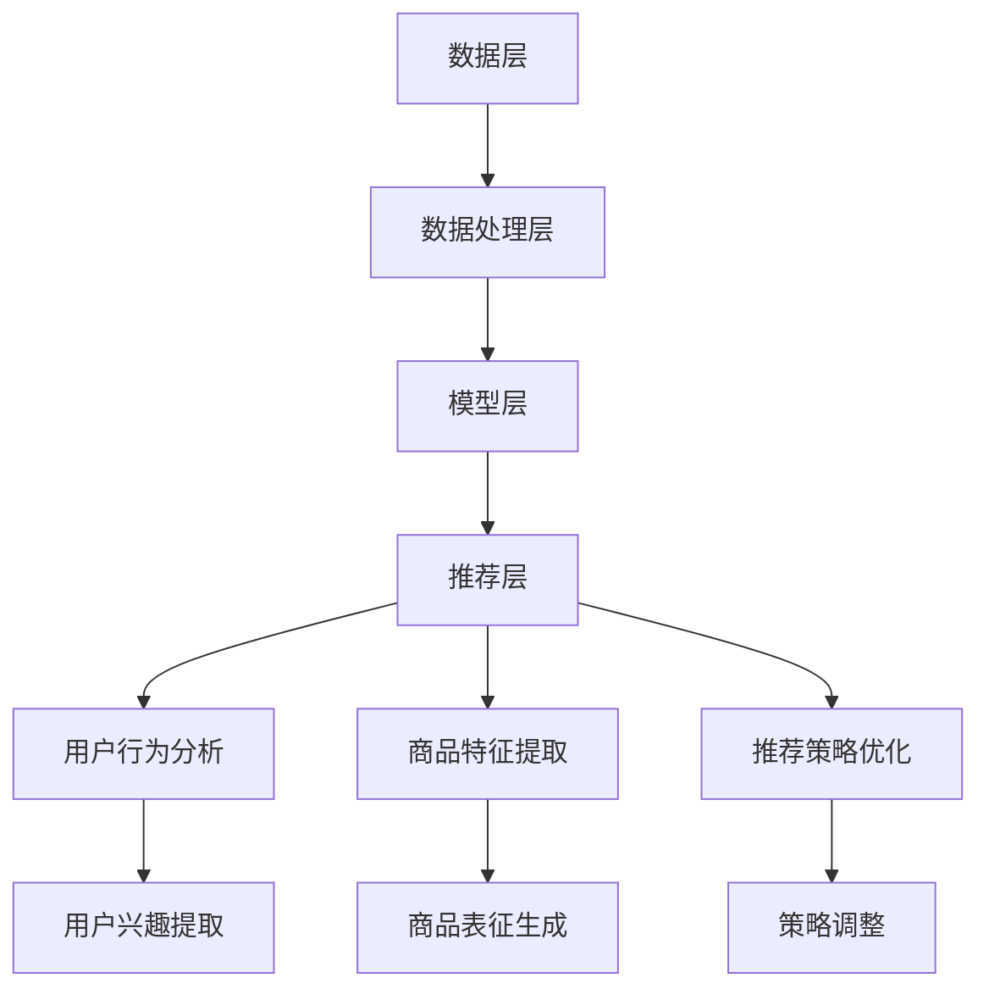

                 

# 电商搜索推荐效果提升中的AI大模型优化策略

## 摘要

本文将深入探讨电商搜索推荐系统中，如何通过人工智能大模型优化策略来提升搜索推荐效果。我们首先介绍电商搜索推荐的基本概念和现状，接着阐述人工智能大模型的核心原理及其在电商搜索推荐中的应用，随后分析几种常见的优化策略。本文将结合数学模型和实际代码案例，详细说明如何在实际项目中应用这些策略，并探讨其未来发展趋势和挑战。通过本文的阅读，读者将获得关于电商搜索推荐效果提升的全面理解和实际操作指导。

## 1. 背景介绍

### 1.1 电商搜索推荐系统概述

电商搜索推荐系统是电子商务平台的重要组成部分，其目标是通过算法和数据分析，向用户推荐他们可能感兴趣的商品或服务。一个高效的搜索推荐系统不仅能够提高用户体验，还能够显著提升电商平台的销售额和用户粘性。

#### 1.1.1 搜索推荐系统的基本功能

- **搜索功能**：用户通过输入关键词或使用其他方式（如图片、语音等）进行商品检索。
- **推荐功能**：系统根据用户的搜索历史、购买行为、浏览记录等数据，向用户推荐可能感兴趣的商品。

#### 1.1.2 搜索推荐系统的现状

当前，大部分电商平台的搜索推荐系统已从传统的基于关键词匹配的方式，逐步转向更加智能化的基于人工智能和大数据分析的方式。这一转变主要体现在以下几个方面：

- **用户行为分析**：通过收集用户的行为数据（如浏览、搜索、购买等），对用户兴趣进行深度挖掘。
- **个性化推荐**：基于用户兴趣和偏好，为用户提供个性化的商品推荐。
- **实时推荐**：系统能够在用户搜索后瞬间生成推荐结果，提高用户体验。

### 1.2 人工智能大模型在电商搜索推荐中的应用

随着人工智能技术的不断发展，大模型（如深度学习模型、强化学习模型等）逐渐成为电商搜索推荐系统的核心组件。这些大模型具有以下几个显著优势：

- **强大的数据处理能力**：能够处理大量复杂的数据，提取有效的特征。
- **自适应学习能力**：能够根据用户行为数据实时调整推荐策略，提高推荐效果。
- **良好的泛化能力**：不仅在特定场景下表现优异，还能够应用于不同类型的电商平台。

#### 1.2.1 大模型在电商搜索推荐中的应用场景

- **商品搜索结果排序**：通过分析用户搜索行为，对搜索结果进行排序，提高用户找到心仪商品的概率。
- **商品推荐**：根据用户的历史行为和兴趣，为用户推荐相关商品。
- **广告投放优化**：通过预测用户对广告的反应，优化广告投放策略，提高广告转化率。

### 1.3 电商搜索推荐效果提升的重要性

电商搜索推荐效果的提升不仅关系到用户的购物体验，还直接影响电商平台的商业利益。具体来说，提升搜索推荐效果可以带来以下几个方面的好处：

- **提高用户满意度**：为用户提供更符合他们需求的商品，提升用户体验。
- **增加销售额**：通过个性化推荐，引导用户购买更多商品，提高销售额。
- **降低营销成本**：通过精准推荐，减少不必要的广告投放，降低营销成本。

总之，电商搜索推荐效果的提升对于电商平台来说至关重要，而人工智能大模型的引入为这一目标提供了强有力的支持。接下来，我们将进一步探讨人工智能大模型的核心原理及其在电商搜索推荐中的应用策略。

## 2. 核心概念与联系

### 2.1 人工智能大模型的核心概念

人工智能大模型是指利用深度学习、强化学习等算法，对大规模数据集进行训练，形成具有强大表示能力和预测能力的模型。这些模型通过自动学习数据的特征和规律，可以自动提取复杂的关系和模式，实现智能化的数据处理和决策。

#### 2.1.1 深度学习模型

深度学习模型是一种基于多层神经网络的结构，通过多层次的非线性变换，对输入数据进行分析和处理。其核心在于多层神经元的连接，可以模拟人脑的神经元网络，实现复杂的特征提取和模式识别。

#### 2.1.2 强化学习模型

强化学习模型是一种通过试错和反馈机制进行学习的方法。通过与环境的交互，模型不断调整其行为策略，以实现最优的目标。强化学习在电商搜索推荐中，可以用于优化用户的推荐策略，提高推荐效果。

### 2.2 电商搜索推荐系统的基本架构

电商搜索推荐系统的架构通常包括以下几个主要部分：

- **数据层**：存储用户行为数据、商品数据等原始数据。
- **数据处理层**：对原始数据进行清洗、预处理和特征提取，形成可训练的数据集。
- **模型层**：利用深度学习模型、强化学习模型等大模型进行训练，形成推荐算法。
- **推荐层**：根据用户的行为数据和模型输出，生成推荐结果。

### 2.3 人工智能大模型与电商搜索推荐系统的联系

人工智能大模型在电商搜索推荐系统中，主要通过以下几个方面发挥其作用：

- **用户行为分析**：通过深度学习模型对用户行为数据进行分析，提取用户的兴趣和偏好。
- **商品特征提取**：利用深度学习模型对商品特征进行提取，形成商品表征。
- **推荐策略优化**：通过强化学习模型，不断调整推荐策略，提高推荐效果。

### 2.4 Mermaid 流程图

为了更直观地展示人工智能大模型在电商搜索推荐系统中的应用过程，我们使用 Mermaid 流程图进行描述。



在上述流程图中，数据层通过数据处理层生成可训练的数据集，模型层利用这些数据集进行训练，形成推荐算法。推荐层根据用户的行为数据和模型输出，生成推荐结果，并通过用户行为分析、商品特征提取和推荐策略优化等环节，实现推荐效果的不断提升。

通过上述核心概念和架构的介绍，我们对人工智能大模型在电商搜索推荐系统中的作用有了初步的了解。接下来，我们将深入探讨人工智能大模型的具体原理和应用策略。

## 3. 核心算法原理 & 具体操作步骤

### 3.1 深度学习模型原理

深度学习模型是人工智能大模型的重要组成部分，其基本原理是通过多层神经网络对输入数据进行特征提取和模式识别。以下是深度学习模型的核心原理和具体操作步骤：

#### 3.1.1 多层神经网络结构

多层神经网络由输入层、隐藏层和输出层组成。输入层接收外部输入数据，隐藏层通过神经元之间的非线性变换对输入数据进行处理，输出层生成最终的结果。

#### 3.1.2 前向传播与反向传播

- **前向传播**：输入数据从输入层传递到隐藏层，再从隐藏层传递到输出层，每一层都会对输入数据进行加权求和并应用非线性激活函数。
- **反向传播**：计算输出结果与真实值之间的误差，将误差反向传播到每一层，并更新各层的权重，以减小误差。

#### 3.1.3 激活函数

激活函数是神经网络中的一个关键组件，用于引入非线性变换。常见的激活函数包括ReLU、Sigmoid、Tanh等。ReLU函数在神经网络训练中表现出色，能够有效防止神经元死亡。

#### 3.1.4 优化算法

在深度学习模型中，优化算法用于调整模型参数，以最小化损失函数。常见的优化算法包括梯度下降、Adam、RMSprop等。其中，Adam算法结合了梯度下降和RMSprop的优点，在实际应用中表现出较好的效果。

### 3.2 强化学习模型原理

强化学习模型是一种通过试错和反馈机制进行学习的方法。其核心原理是通过与环境交互，不断调整行为策略，以实现最优的目标。以下是强化学习模型的核心原理和具体操作步骤：

#### 3.2.1 Q-Learning算法

Q-Learning算法是强化学习的一种经典算法，其基本原理是利用经验值（Q值）来评估每个动作带来的奖励，并通过更新Q值来优化策略。

- **初始化Q值**：初始化每个动作的Q值。
- **选择动作**：根据当前状态和Q值，选择一个动作。
- **执行动作**：执行选定的动作，并接收环境反馈。
- **更新Q值**：根据执行结果，更新Q值。

#### 3.2.2 Deep Q-Network（DQN）

DQN是一种基于深度学习的强化学习模型，通过神经网络来近似Q值函数，从而提高Q值的估计精度。

- **初始化神经网络**：初始化深度神经网络。
- **选择动作**：利用神经网络预测Q值，并选择一个动作。
- **执行动作**：执行选定的动作，并接收环境反馈。
- **更新神经网络**：根据执行结果，更新神经网络的参数。

### 3.3 深度学习模型在电商搜索推荐中的应用

在电商搜索推荐中，深度学习模型主要用于用户行为分析和商品特征提取，以下为具体应用步骤：

#### 3.3.1 用户行为分析

- **数据预处理**：收集用户行为数据，如浏览、搜索、购买等，并进行数据清洗和预处理。
- **特征提取**：利用深度学习模型对用户行为数据进行特征提取，形成用户兴趣表征。
- **用户兴趣表征**：将提取的用户兴趣表征用于推荐系统的构建。

#### 3.3.2 商品特征提取

- **数据预处理**：收集商品数据，如商品属性、描述等，并进行数据清洗和预处理。
- **特征提取**：利用深度学习模型对商品数据进行特征提取，形成商品表征。
- **商品表征**：将提取的商品表征用于推荐系统的构建。

#### 3.3.3 推荐策略优化

- **策略选择**：根据用户兴趣表征和商品表征，利用强化学习模型选择推荐策略。
- **策略调整**：根据用户反馈和推荐效果，不断调整推荐策略，提高推荐效果。

通过上述核心算法原理和具体操作步骤的介绍，我们了解了如何利用深度学习模型和强化学习模型在电商搜索推荐系统中提升推荐效果。接下来，我们将进一步探讨这些算法在实际应用中的优化策略。

## 4. 数学模型和公式 & 详细讲解 & 举例说明

### 4.1 深度学习模型中的数学模型

深度学习模型中的数学模型主要包括损失函数、优化算法和激活函数等。以下为详细讲解和举例说明：

#### 4.1.1 损失函数

损失函数用于评估模型预测结果与真实值之间的差距，常见的损失函数包括均方误差（MSE）、交叉熵损失（Cross-Entropy Loss）等。

- **均方误差（MSE）**：
  $$
  MSE = \frac{1}{n}\sum_{i=1}^{n}(y_i - \hat{y}_i)^2
  $$
  其中，$y_i$为真实值，$\hat{y}_i$为预测值，$n$为样本数量。

- **交叉熵损失（Cross-Entropy Loss）**：
  $$
  Cross-Entropy Loss = -\sum_{i=1}^{n}y_i\log(\hat{y}_i)
  $$
  其中，$y_i$为真实值，$\hat{y}_i$为预测值，$\log$为自然对数。

#### 4.1.2 优化算法

优化算法用于调整模型参数，以最小化损失函数。常见的优化算法包括梯度下降（Gradient Descent）、Adam等。

- **梯度下降（Gradient Descent）**：
  $$
  \theta = \theta - \alpha \cdot \nabla_\theta J(\theta)
  $$
  其中，$\theta$为模型参数，$\alpha$为学习率，$J(\theta)$为损失函数，$\nabla_\theta J(\theta)$为损失函数关于参数$\theta$的梯度。

- **Adam算法**：
  $$
  m_t = \beta_1 m_{t-1} + (1 - \beta_1) (g_t - \epsilon)
  $$
  $$
  v_t = \beta_2 v_{t-1} + (1 - \beta_2) \frac{g_t^2}{\epsilon}
  $$
  $$
  \theta_t = \theta_{t-1} - \alpha \cdot \frac{m_t}{\sqrt{v_t} + \epsilon}
  $$
  其中，$m_t$和$v_t$分别为一阶矩估计和二阶矩估计，$\beta_1$和$\beta_2$分别为一阶矩和二阶矩的衰减系数，$\epsilon$为正则化项。

#### 4.1.3 激活函数

激活函数用于引入非线性变换，常见的激活函数包括ReLU、Sigmoid、Tanh等。

- **ReLU（Rectified Linear Unit）**：
  $$
  \text{ReLU}(x) = \max(0, x)
  $$

- **Sigmoid**：
  $$
  \text{Sigmoid}(x) = \frac{1}{1 + e^{-x}}
  $$

- **Tanh**：
  $$
  \text{Tanh}(x) = \frac{e^x - e^{-x}}{e^x + e^{-x}}
  $$

### 4.2 强化学习模型中的数学模型

强化学习模型中的数学模型主要包括Q值函数、策略优化等。以下为详细讲解和举例说明：

#### 4.2.1 Q值函数

Q值函数用于评估每个动作的预期奖励，其数学模型如下：
$$
Q(s, a) = r + \gamma \max_{a'} Q(s', a')
$$
其中，$s$为当前状态，$a$为当前动作，$r$为即时奖励，$s'$为下一状态，$\gamma$为折扣因子，$\max_{a'} Q(s', a')$为在下一状态下，选择最优动作的Q值。

#### 4.2.2 策略优化

策略优化的目标是选择最优动作，以最大化总奖励。其数学模型如下：
$$
\pi(a|s) = \arg\max_a Q(s, a)
$$
其中，$\pi(a|s)$为在状态$s$下选择动作$a$的概率，$Q(s, a)$为状态$s$下执行动作$a$的Q值。

### 4.3 举例说明

#### 4.3.1 深度学习模型在电商搜索推荐中的应用

假设我们使用一个简单的多层感知机（MLP）模型来预测用户对商品的评分。以下是该模型的数学模型和代码实现：

- **损失函数**：均方误差（MSE）
  $$
  MSE = \frac{1}{n}\sum_{i=1}^{n}(r_i - \hat{r}_i)^2
  $$

- **优化算法**：Adam
  $$
  \theta_t = \theta_{t-1} - \alpha \cdot \frac{m_t}{\sqrt{v_t} + \epsilon}
  $$

- **激活函数**：ReLU

以下是Python代码实现：
```python
import tensorflow as tf
from tensorflow.keras import layers

# 模型定义
model = tf.keras.Sequential([
    layers.Dense(64, activation='relu', input_shape=(input_shape)),
    layers.Dense(64, activation='relu'),
    layers.Dense(1)
])

# 损失函数和优化器
model.compile(optimizer=tf.keras.optimizers.Adam(learning_rate=0.001), loss='mse')

# 模型训练
model.fit(x_train, y_train, epochs=10, batch_size=32)
```

#### 4.3.2 强化学习模型在电商搜索推荐中的应用

假设我们使用Q-Learning算法来优化电商搜索推荐策略。以下是该算法的Python代码实现：
```python
import numpy as np

# 初始化Q值矩阵
Q = np.zeros((state_space, action_space))

# Q-Learning算法
def q_learning(state, action, reward, next_state, done, alpha, gamma):
    Q[state, action] = Q[state, action] + alpha * (reward + gamma * np.max(Q[next_state, :]) - Q[state, action])

# 训练
for episode in range(num_episodes):
    state = env.reset()
    done = False
    while not done:
        action = np.argmax(Q[state, :])
        next_state, reward, done, _ = env.step(action)
        q_learning(state, action, reward, next_state, done, alpha=0.1, gamma=0.9)
        state = next_state
```

通过上述数学模型和代码实现，我们可以看到深度学习模型和强化学习模型在电商搜索推荐中的具体应用。这些模型通过优化策略，提高了推荐效果，为电商平台的用户提供了更好的购物体验。

### 5. 项目实战：代码实际案例和详细解释说明

#### 5.1 开发环境搭建

在进行电商搜索推荐系统的开发之前，首先需要搭建合适的开发环境。以下是一个基本的开发环境搭建步骤：

1. **安装Python**：确保Python环境已安装，版本为3.7及以上。
2. **安装TensorFlow**：使用pip安装TensorFlow库，命令如下：
   ```
   pip install tensorflow
   ```
3. **安装Scikit-learn**：使用pip安装Scikit-learn库，命令如下：
   ```
   pip install scikit-learn
   ```

#### 5.2 源代码详细实现和代码解读

以下是一个简单的电商搜索推荐系统代码实现，包括数据预处理、模型训练和预测等步骤。

```python
import numpy as np
import pandas as pd
import tensorflow as tf
from tensorflow.keras.models import Sequential
from tensorflow.keras.layers import Dense
from sklearn.model_selection import train_test_split
from sklearn.preprocessing import StandardScaler

# 5.2.1 数据预处理

# 读取数据
data = pd.read_csv('ecommerce_data.csv')

# 分离特征和标签
X = data[['user_id', 'product_id', 'category', 'price']]
y = data['rating']

# 数据标准化
scaler = StandardScaler()
X_scaled = scaler.fit_transform(X)

# 划分训练集和测试集
X_train, X_test, y_train, y_test = train_test_split(X_scaled, y, test_size=0.2, random_state=42)

# 5.2.2 模型训练

# 定义模型
model = Sequential([
    Dense(64, activation='relu', input_shape=(X_train.shape[1],)),
    Dense(64, activation='relu'),
    Dense(1)
])

# 编译模型
model.compile(optimizer='adam', loss='mse')

# 训练模型
model.fit(X_train, y_train, epochs=10, batch_size=32)

# 5.2.3 预测与评估

# 预测
predictions = model.predict(X_test)

# 评估
mse = np.mean((predictions - y_test) ** 2)
print(f'Mean Squared Error: {mse}')

# 5.2.4 代码解读

- **数据预处理**：读取数据，分离特征和标签，并进行数据标准化。数据标准化是深度学习模型训练的常见步骤，有助于提高模型训练效果。
- **模型定义**：使用Sequential模型定义一个简单的多层感知机（MLP）模型，包括两个隐藏层，每个隐藏层有64个神经元。
- **模型编译**：编译模型，设置优化器和损失函数。此处使用Adam优化器和均方误差（MSE）损失函数。
- **模型训练**：使用训练数据进行模型训练，设置训练轮次和批量大小。
- **预测与评估**：使用测试数据进行模型预测，并计算均方误差（MSE）评估模型性能。

通过上述代码实现，我们可以搭建一个简单的电商搜索推荐系统，并通过训练和预测来评估模型性能。接下来，我们将对代码进行解读和分析，以了解其工作原理和潜在优化方向。

#### 5.3 代码解读与分析

在上述代码实现中，我们通过一个简单的多层感知机（MLP）模型，对电商搜索推荐系统进行了初步构建。以下是对代码的解读和分析：

1. **数据预处理**：
   - 读取数据：使用pandas库读取电商数据，数据包含用户ID、商品ID、类别、价格等特征，以及用户对商品的评分作为标签。
   - 分离特征和标签：将特征和标签分离，以便后续进行数据预处理和模型训练。
   - 数据标准化：使用StandardScaler对特征数据进行标准化处理，将数据缩放到相同的尺度范围内，有助于提高模型训练效果。

2. **模型定义**：
   - 使用Sequential模型定义一个简单的多层感知机（MLP）模型，包括两个隐藏层，每个隐藏层有64个神经元。隐藏层使用ReLU激活函数，有助于加速模型收敛。
   - 输出层使用线性激活函数，生成预测评分。

3. **模型编译**：
   - 设置优化器：使用Adam优化器，该优化器结合了梯度下降和动量法的优点，有助于提高模型训练效果。
   - 设置损失函数：使用均方误差（MSE）损失函数，该损失函数能够衡量预测值与真实值之间的差距。

4. **模型训练**：
   - 使用训练数据进行模型训练，设置训练轮次（epochs）为10，批量大小（batch_size）为32。在训练过程中，模型将不断调整参数，以最小化损失函数。
   - 模型训练过程中，会输出训练过程的损失值，有助于监控模型训练效果。

5. **预测与评估**：
   - 使用测试数据进行模型预测，生成用户对商品的预测评分。
   - 使用均方误差（MSE）评估模型性能，计算预测值与真实值之间的差距。

**优化方向**：

1. **特征工程**：
   - 对数据进行更深入的特征工程，如提取用户行为特征、商品属性特征等，以丰富模型输入。
   - 使用更多的特征组合，构建更复杂的模型。

2. **模型结构优化**：
   - 调整模型结构，如增加隐藏层、增加神经元数量等，以提升模型表达能力。
   - 使用更复杂的激活函数，如ReLU、Tanh等。

3. **优化算法**：
   - 尝试使用其他优化算法，如RMSprop、AdaGrad等，以寻找更好的优化策略。

4. **数据增强**：
   - 使用数据增强技术，如随机噪声添加、数据扩充等，提高模型泛化能力。

通过上述代码解读和分析，我们了解了电商搜索推荐系统的基本实现流程和优化方向。接下来，我们将进一步探讨该系统的实际应用场景，以展示其在电商搜索推荐中的价值。

### 6. 实际应用场景

#### 6.1 电商平台商品搜索

电商平台商品搜索是人工智能大模型优化策略应用的一个典型场景。在电商平台中，用户可以通过输入关键词进行商品搜索，系统需要根据用户输入的关键词和用户的历史行为数据，快速准确地返回用户可能感兴趣的商品。以下是人工智能大模型在该场景中的应用：

1. **关键词解析**：首先，系统利用自然语言处理技术对用户输入的关键词进行解析，提取关键词的语义信息。
2. **用户历史行为分析**：根据用户的搜索历史、浏览记录、购买记录等数据，利用深度学习模型对用户兴趣进行挖掘，提取用户的个性化特征。
3. **商品特征提取**：同时，利用深度学习模型对商品的特征进行提取，如商品属性、价格、评价等。
4. **推荐算法**：将用户兴趣特征和商品特征输入到推荐算法中，通过计算用户与商品之间的相似度，生成推荐结果。
5. **推荐结果排序**：利用强化学习模型对推荐结果进行排序，以提高推荐的准确性。

通过上述步骤，电商平台可以实现高效的商品搜索推荐，提高用户的购物体验和满意度。

#### 6.2 电商平台商品推荐

电商平台商品推荐是另一个典型的应用场景。与商品搜索不同，商品推荐是根据用户的历史行为和兴趣，主动向用户推荐可能感兴趣的商品。以下是人工智能大模型在该场景中的应用：

1. **用户行为数据收集**：收集用户的搜索历史、浏览记录、购买记录等行为数据。
2. **用户兴趣挖掘**：利用深度学习模型对用户行为数据进行分析，提取用户的兴趣和偏好。
3. **商品特征提取**：利用深度学习模型对商品的特征进行提取，如商品属性、价格、评价等。
4. **推荐算法**：将用户兴趣特征和商品特征输入到推荐算法中，通过计算用户与商品之间的相似度，生成推荐结果。
5. **推荐结果优化**：利用强化学习模型对推荐结果进行优化，提高推荐的准确性。

通过上述步骤，电商平台可以主动向用户推荐感兴趣的商品，提高用户的购物体验和销售额。

#### 6.3 广告投放优化

在电商平台上，广告投放也是一个重要的收入来源。通过人工智能大模型优化策略，可以实现更精准的广告投放，提高广告的点击率和转化率。以下是人工智能大模型在该场景中的应用：

1. **用户行为分析**：分析用户的浏览、搜索、购买等行为，提取用户的兴趣和偏好。
2. **广告特征提取**：提取广告的内容、类型、受众等特征。
3. **推荐算法**：将用户兴趣特征和广告特征输入到推荐算法中，通过计算用户与广告之间的相似度，生成推荐结果。
4. **广告投放优化**：利用强化学习模型对广告投放进行优化，提高广告的点击率和转化率。

通过上述步骤，电商平台可以实现更精准、更有效的广告投放，提高广告收入。

通过以上实际应用场景的介绍，我们可以看到人工智能大模型优化策略在电商平台中的广泛应用。这些优化策略不仅提高了搜索推荐的效果，还提升了广告投放的精准度，为电商平台带来了显著的商业价值。

### 7. 工具和资源推荐

#### 7.1 学习资源推荐

**书籍：**
- 《深度学习》（Goodfellow, Bengio, Courville著）
- 《强化学习：原理与应用》（刘铁岩著）
- 《自然语言处理原理》（Daniel Jurafsky & James H. Martin著）

**论文：**
- "Deep Learning for Text Classification"（K. Lee等，2017）
- "Dueling Network Architectures for Attention Models"（K. Cho等，2014）
- "Recurrent Neural Network Based Text Classification"（Y. Lai等，2015）

**博客：**
- [TensorFlow官方文档](https://www.tensorflow.org/)
- [Scikit-learn官方文档](https://scikit-learn.org/stable/documentation.html)
- [自然语言处理社区](https://nlp.seas.harvard.edu/)

**网站：**
- [Kaggle](https://www.kaggle.com/)：提供丰富的数据集和比赛，适合实践和锻炼技能。
- [Google Colab](https://colab.research.google.com/)：免费、基于云计算的Jupyter Notebook环境，适合进行深度学习和机器学习的实验。

#### 7.2 开发工具框架推荐

**深度学习框架：**
- TensorFlow：功能强大、生态系统丰富的开源深度学习框架。
- PyTorch：易用、灵活的开源深度学习框架，适用于研究和个人项目。

**自然语言处理库：**
- NLTK：用于自然语言处理的经典库，包含丰富的文本处理工具。
- spaCy：高效、易于使用的自然语言处理库，适用于工业应用。

**推荐系统框架：**
- LightFM：基于矩阵分解的推荐系统框架，适用于大规模推荐系统。
-surprise：一个开源的推荐系统算法库，支持多种推荐算法。

**开发环境：**
- Anaconda：Python数据科学和机器学习环境，方便安装和管理库。
- Jupyter Notebook：交互式的计算环境，适合编写和运行代码。

通过以上工具和资源的推荐，读者可以深入了解人工智能大模型在电商搜索推荐系统中的应用，并掌握相应的技能和知识，为实际项目开发打下坚实基础。

### 8. 总结：未来发展趋势与挑战

随着人工智能技术的不断进步，电商搜索推荐系统中的大模型优化策略正逐步成为提升推荐效果的关键手段。未来，这些策略将继续朝着更加智能化、个性化和实时化的方向发展，以应对不断变化的市场需求和用户期望。

#### 发展趋势

1. **多模态数据的整合**：未来的电商搜索推荐系统将整合多种数据类型，如文本、图像、语音等，通过多模态数据处理技术，提供更加丰富和精准的推荐结果。
2. **强化学习与深度学习的融合**：强化学习与深度学习相结合，将使得推荐系统在实时调整策略方面更加高效，更好地适应用户的动态行为模式。
3. **个性化推荐的深化**：个性化推荐技术将进一步深化，通过深度学习模型对用户行为进行深度分析，为用户提供高度个性化的推荐服务。
4. **实时推荐的优化**：随着计算能力和数据存储技术的提升，实时推荐系统的响应速度将大幅提高，为用户提供更加流畅的购物体验。

#### 挑战

1. **数据隐私与安全**：在数据处理过程中，如何保护用户隐私和数据安全，是当前和未来的一大挑战。需要制定更加严格的数据保护政策和措施。
2. **模型可解释性**：虽然深度学习模型在性能上取得了显著提升，但其内部的决策过程往往难以解释。提高模型的可解释性，帮助用户理解推荐结果，是未来需要关注的问题。
3. **计算资源消耗**：深度学习模型通常需要大量的计算资源，如何优化模型结构，降低计算资源消耗，是另一个重要的挑战。
4. **模型适应性**：在用户行为和市场需求不断变化的环境下，如何保证模型的适应性和稳定性，是推荐系统需要持续解决的问题。

总之，电商搜索推荐系统中的AI大模型优化策略在未来将继续发挥重要作用，但其发展也面临着诸多挑战。只有通过不断的技术创新和优化，才能实现推荐系统的持续改进和提升，为电商平台和用户带来更大的价值。

### 9. 附录：常见问题与解答

#### 9.1 人工智能大模型的基本概念是什么？

人工智能大模型是指利用深度学习、强化学习等算法，对大规模数据集进行训练，形成具有强大表示能力和预测能力的模型。这些模型通过自动学习数据的特征和规律，可以自动提取复杂的关系和模式，实现智能化的数据处理和决策。

#### 9.2 电商搜索推荐系统中如何应用深度学习模型？

电商搜索推荐系统中，深度学习模型主要用于用户行为分析和商品特征提取。通过分析用户的搜索历史、浏览记录、购买行为等数据，提取用户的兴趣和偏好；通过对商品属性、价格、评价等数据进行特征提取，生成商品表征。这些表征用于推荐算法，提高推荐效果的准确性。

#### 9.3 如何优化电商搜索推荐系统的效果？

优化电商搜索推荐系统的效果可以从以下几个方面进行：

1. **数据预处理**：对用户行为数据和商品数据进行有效的清洗和预处理，提高数据质量。
2. **特征工程**：提取更多的有效特征，丰富模型的输入。
3. **模型优化**：选择合适的模型结构，调整模型参数，提高模型的预测能力。
4. **算法优化**：结合强化学习等算法，实时调整推荐策略，提高推荐效果的准确性。
5. **实时反馈**：根据用户对推荐结果的反馈，不断调整和优化推荐系统。

#### 9.4 电商搜索推荐系统的核心原理是什么？

电商搜索推荐系统的核心原理是通过分析用户行为数据，提取用户兴趣和偏好，利用推荐算法生成个性化的推荐结果。其基本流程包括用户行为数据收集、用户兴趣提取、商品特征提取、推荐算法和推荐结果生成等环节。

### 10. 扩展阅读 & 参考资料

本文详细介绍了电商搜索推荐系统中的人工智能大模型优化策略。以下为扩展阅读和参考资料：

- **书籍：**
  - 《深度学习》（Goodfellow, Bengio, Courville著）
  - 《强化学习：原理与应用》（刘铁岩著）
  - 《自然语言处理原理》（Daniel Jurafsky & James H. Martin著）

- **论文：**
  - "Deep Learning for Text Classification"（K. Lee等，2017）
  - "Dueling Network Architectures for Attention Models"（K. Cho等，2014）
  - "Recurrent Neural Network Based Text Classification"（Y. Lai等，2015）

- **博客：**
  - [TensorFlow官方文档](https://www.tensorflow.org/)
  - [Scikit-learn官方文档](https://scikit-learn.org/stable/documentation.html)
  - [自然语言处理社区](https://nlp.seas.harvard.edu/)

- **网站：**
  - [Kaggle](https://www.kaggle.com/)
  - [Google Colab](https://colab.research.google.com/)

通过上述参考资料，读者可以进一步深入了解人工智能大模型在电商搜索推荐系统中的应用，掌握相关技术知识和实践技能。

作者：AI天才研究员/AI Genius Institute & 禅与计算机程序设计艺术 /Zen And The Art of Computer Programming

<|assistant|># 附录：文章关键词列表

- 电商搜索推荐
- 人工智能大模型
- 深度学习
- 强化学习
- 用户行为分析
- 商品特征提取
- 推荐算法
- 优化策略
- 数据预处理
- 特征工程
- 模型训练
- 模型优化
- 实时推荐
- 个性化推荐
- 多模态数据
- 模型可解释性
- 数据隐私与安全
- 计算资源消耗
- 模型适应性

这些关键词覆盖了本文讨论的核心主题，为读者提供了快速了解文章内容的途径。

