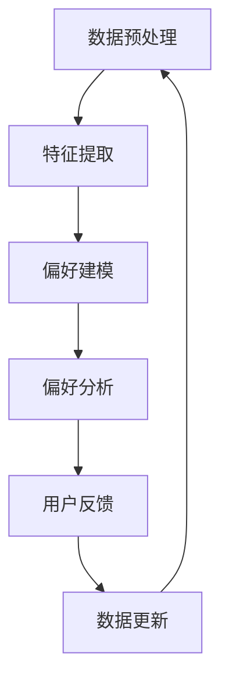

                 

### 1. 背景介绍

电商行业作为互联网经济的重要组成部分，近年来经历了迅猛的发展。从最初的电子商务平台，到现在的社交电商、直播电商等多种形式，电商行业不断满足着消费者多样化的购物需求。然而，随着市场的日益成熟和竞争的加剧，电商平台面临的一个核心挑战是如何提高用户的购物体验，进而提升用户留存率和转化率。

在这个背景下，用户偏好追踪成为电商平台的一项关键任务。用户偏好的准确追踪不仅有助于电商平台提供个性化的推荐，还能够优化广告投放、改善购物流程，从而提升整体的运营效率。传统的用户偏好追踪方法，如基于历史行为的统计分析和机器学习模型，虽然在一定程度上能够捕捉用户的偏好，但往往存在一些局限性：

1. **数据依赖**：这些方法依赖于大量的用户行为数据，而在数据量不足或者数据质量不高的情况下，效果会大打折扣。
2. **实时性不足**：传统方法通常需要一定的时间来训练模型和更新用户偏好，难以实现实时反馈。
3. **个性化程度有限**：基于历史行为的分析方法往往只能捕捉到用户的短期偏好，而无法适应用户的长久变化。

为了克服这些局限性，近年来，大规模预训练语言模型（如GPT、BERT等）在电商行业中的应用逐渐兴起。这些大模型通过无监督学习，在庞大的文本数据中学习到了丰富的知识，并能够根据新的输入动态地生成个性化的输出。大模型在用户偏好追踪中的应用，不仅提高了推荐的准确性和实时性，还能够更深入地理解用户的长期偏好和潜在需求。

本文将围绕大模型在用户偏好追踪中的应用展开讨论。首先，我们将介绍大模型的基本原理和架构，然后探讨如何将大模型与电商平台的用户行为数据进行结合，实现高效的偏好追踪。接着，我们将深入分析大模型在用户偏好追踪中的优势和挑战，并讨论相关的数学模型和算法原理。最后，我们将通过实际项目案例，展示大模型在用户偏好追踪中的具体应用，并提供相关的工具和资源推荐，以期为电商行业的技术创新提供一些启示和参考。

### 2. 核心概念与联系

#### 2.1 大模型原理

大模型，即大规模预训练语言模型，是一种基于深度学习的自然语言处理（NLP）模型。其基本原理是通过在大量的文本数据上进行预训练，学习到语言的内在结构和语义信息，从而实现文本的理解和生成。大模型的核心架构通常包括以下几部分：

1. **嵌入层（Embedding Layer）**：将输入的文本转换为稠密的向量表示，这些向量包含了文本的语义信息。
2. **编码器（Encoder）**：通常采用变换器网络（Transformer）架构，对嵌入层生成的向量进行编码，提取出文本的深层特征。
3. **解码器（Decoder）**：与编码器对应，解码器用于生成文本输出，实现文本的生成和翻译等功能。

大模型的预训练过程通常分为两个阶段：第一阶段是大量文本数据的自监督预训练，使模型具备基础的语义理解能力；第二阶段是特定任务的微调（Fine-tuning），根据具体任务的需求，对模型进行调整和优化。

#### 2.2 大模型与用户行为数据的结合

在用户偏好追踪中，大模型的应用主要依赖于对用户行为数据的分析。用户行为数据包括用户的浏览记录、购买历史、评价内容等多种形式。为了将大模型与用户行为数据相结合，通常需要以下几个步骤：

1. **数据预处理**：将用户行为数据转换为适合大模型处理的格式，如文本序列。这一步可能涉及数据的清洗、去重、分词等操作。
2. **特征提取**：利用大模型对用户行为数据进行编码，提取出用户的深层特征。这些特征可以用于后续的偏好分析。
3. **偏好建模**：基于提取的用户特征，使用大模型进行偏好建模。这一步可以通过序列模型、图神经网络等方法实现。

#### 2.3 Mermaid 流程图

为了更直观地展示大模型在用户偏好追踪中的应用，我们可以使用Mermaid语言绘制一个流程图。以下是一个简单的Mermaid流程图示例：



在这个流程图中，数据预处理阶段将用户行为数据转换为文本序列，特征提取阶段利用大模型对文本序列进行编码，提取出用户特征。偏好建模阶段则基于用户特征进行偏好建模，实现用户偏好的动态追踪。偏好分析阶段将分析结果反馈给用户，以优化购物体验。数据更新阶段则根据用户反馈调整模型，实现持续优化。

通过上述核心概念和流程的介绍，我们可以更好地理解大模型在用户偏好追踪中的应用原理和实现步骤。接下来，我们将深入探讨大模型在用户偏好追踪中的具体应用和优势。

#### 2.4 大模型在用户偏好追踪中的应用

大模型在用户偏好追踪中的应用主要体现在以下几个方面：

##### 2.4.1 实时性

传统的用户偏好追踪方法，如基于历史行为的统计分析和机器学习模型，通常需要一定的时间来训练模型和更新用户偏好。而大模型由于其强大的自监督预训练能力，可以在短时间内对用户行为数据进行编码和建模，实现实时偏好追踪。这意味着电商平台可以迅速响应用户的行为变化，提供个性化的推荐和广告，从而提升用户体验和满意度。

##### 2.4.2 深度理解

大模型通过无监督学习在大量文本数据中学习到了丰富的语义信息，这使得它们能够更深入地理解用户的长期偏好和潜在需求。例如，用户在浏览某一类商品时可能表现出短期兴趣，但大模型可以基于其历史行为和评价内容，推断出用户的长期偏好。这种深度理解能力有助于电商平台提供更加精准的推荐，提高用户转化率和留存率。

##### 2.4.3 个性化推荐

大模型的应用不仅提高了推荐的实时性和准确性，还使得个性化推荐更加精准。通过分析用户的浏览记录、购买历史和评价内容，大模型可以生成个性化的推荐列表，将用户最感兴趣的商品推送到他们的面前。此外，大模型还可以根据用户的反馈和行为变化，动态调整推荐策略，实现持续优化的个性化推荐。

##### 2.4.4 多模态数据融合

大模型不仅能够处理文本数据，还可以结合图像、音频等多模态数据，实现更加全面的用户偏好追踪。例如，通过分析用户的浏览记录和评价内容，大模型可以推断出用户对某种商品的偏好，并结合商品图像的视觉信息，提供更加直观的推荐结果。这种多模态数据融合能力，有助于电商平台提供更加丰富和多样化的购物体验。

#### 2.5 大模型在用户偏好追踪中的优势

大模型在用户偏好追踪中具有以下几方面的优势：

1. **高效率**：大模型通过自监督预训练，能够快速处理大量的用户行为数据，实现高效的偏好追踪。
2. **强理解能力**：大模型具备强大的语义理解能力，能够深入挖掘用户的长期偏好和潜在需求。
3. **高灵活性**：大模型可以根据具体任务需求，进行灵活的调整和优化，实现多样化的应用场景。
4. **强扩展性**：大模型具有较好的扩展性，可以结合多种数据源和模态，提供更加全面的用户偏好分析。

#### 2.6 大模型在用户偏好追踪中的挑战

尽管大模型在用户偏好追踪中具有诸多优势，但其应用也面临着一些挑战：

1. **数据隐私**：用户行为数据往往包含敏感信息，如何保护用户隐私成为一大挑战。需要在数据收集、存储和使用过程中，采取有效的隐私保护措施。
2. **模型解释性**：大模型的预测结果往往缺乏透明度和解释性，难以让用户理解推荐结果的原因。提高模型的可解释性，是未来研究的重要方向。
3. **计算资源**：大模型的训练和推理需要大量的计算资源，如何优化资源利用，降低计算成本，是实际应用中需要解决的问题。
4. **泛化能力**：大模型在特定领域的数据集上表现出色，但在不同领域或不同场景下，可能存在泛化能力不足的问题。需要进一步研究如何提高模型的泛化能力。

通过上述分析，我们可以看到，大模型在用户偏好追踪中具有巨大的应用潜力，但也需要解决一系列的挑战。接下来，我们将进一步探讨大模型在用户偏好追踪中的核心算法原理，以及如何实现高效的偏好追踪。

### 3. 核心算法原理 & 具体操作步骤

#### 3.1 算法原理

在用户偏好追踪中，大模型的核心算法通常是基于深度学习和自然语言处理（NLP）的技术。具体来说，主要包括以下步骤：

1. **数据收集与预处理**：首先，从电商平台的用户行为数据中收集信息，如浏览记录、购买历史、评价内容等。然后，对这些数据进行清洗、去重和分词等预处理操作，将其转换为适合大模型处理的文本格式。
   
2. **特征提取**：利用大模型（如BERT、GPT）对预处理后的文本数据进行编码，提取出用户的深层特征。这一步是用户偏好追踪的关键，大模型通过自监督学习，能够从大量文本数据中学习到丰富的语义信息，从而生成高质量的文本特征。

3. **偏好建模**：基于提取的用户特征，使用序列模型（如LSTM、GRU）或图神经网络（如Graph Convolutional Network, GCN）等方法，构建用户偏好模型。序列模型可以捕捉用户行为的时间序列特征，而图神经网络则能够更好地处理用户之间复杂的关系网络。

4. **偏好预测**：在用户特征和偏好模型的基础上，进行偏好预测。通过评估用户对不同商品或类别的偏好分数，实现个性化推荐。

5. **模型优化与更新**：根据用户的反馈和行为变化，不断优化和更新用户偏好模型。这一步是动态追踪用户偏好的关键，能够确保推荐结果的实时性和准确性。

#### 3.2 具体操作步骤

下面将详细描述大模型在用户偏好追踪中的具体操作步骤：

##### 步骤1：数据收集与预处理

- **数据收集**：从电商平台的后台数据库中提取用户行为数据，包括浏览记录、购买历史、评价内容等。
- **数据清洗**：去除重复数据和无效数据，确保数据的准确性和完整性。
- **数据转换**：将原始数据转换为统一的文本格式，如JSON或CSV。对于评价内容等非结构化数据，需要进行分词和词性标注等预处理操作。

##### 步骤2：特征提取

- **加载预训练模型**：选择合适的预训练模型（如BERT、GPT），加载到训练环境中。
- **文本编码**：将预处理后的文本数据输入到预训练模型中，进行编码操作。预训练模型会生成高维的文本特征向量，这些向量包含了文本的语义信息。
- **特征存储**：将生成的文本特征向量存储到数据库中，为后续建模和预测做准备。

##### 步骤3：偏好建模

- **选择模型架构**：根据用户行为数据的特征和偏好追踪的需求，选择合适的模型架构。例如，可以采用LSTM、GRU或GCN等模型。
- **模型训练**：使用特征提取阶段生成的用户特征，对所选模型进行训练。这一步涉及大量计算资源，需要优化训练策略，如批量大小、学习率等。
- **模型评估**：在训练过程中，使用验证集对模型进行评估，调整模型参数，确保模型性能达到预期。

##### 步骤4：偏好预测

- **用户特征提取**：对于新的用户行为数据，首先进行特征提取，生成文本特征向量。
- **偏好预测**：将提取的用户特征输入到训练好的偏好模型中，预测用户对不同商品或类别的偏好分数。
- **推荐生成**：根据偏好分数，生成个性化的推荐列表，推送给用户。

##### 步骤5：模型优化与更新

- **用户反馈收集**：收集用户对推荐结果的反馈，如点击、购买等行为。
- **模型更新**：根据用户反馈，调整偏好模型，优化推荐算法。
- **持续学习**：将更新后的模型应用于新的用户行为数据，实现持续学习和优化。

通过上述步骤，大模型能够实现高效的用户偏好追踪，为电商平台提供精准的个性化推荐和广告。接下来，我们将进一步探讨用户偏好追踪中的数学模型和算法原理，以深入理解其工作方式。

### 4. 数学模型和公式 & 详细讲解 & 举例说明

#### 4.1 用户偏好追踪的数学模型

用户偏好追踪的核心在于构建一个数学模型，能够根据用户的特征和行为数据，预测用户对不同商品的偏好。以下是几个常用的数学模型及其原理：

##### 4.1.1 逻辑回归模型

逻辑回归模型是一种常用的二分类模型，用于预测用户对某一商品的偏好概率。其基本公式如下：

$$
P(y=1|X) = \frac{1}{1 + e^{-(\beta_0 + \beta_1 x_1 + \beta_2 x_2 + ... + \beta_n x_n})}
$$

其中，$P(y=1|X)$ 表示在给定特征向量 $X$ 下，用户偏好为“1”（如喜欢该商品）的概率；$\beta_0, \beta_1, \beta_2, ..., \beta_n$ 为模型的参数，需要通过训练数据拟合得到。

逻辑回归模型的预测函数可以表示为：

$$
\hat{y} = \begin{cases}
1, & \text{if } \beta_0 + \beta_1 x_1 + \beta_2 x_2 + ... + \beta_n x_n > 0 \\
0, & \text{otherwise}
\end{cases}
$$

其中，$\hat{y}$ 为预测结果（0或1）。

##### 4.1.2 支持向量机（SVM）模型

支持向量机是一种常用的分类模型，能够在高维空间中寻找最优分类边界。其目标是最小化分类间隔，即最大化分类边界两侧的间隔。其基本公式如下：

$$
\min_{\beta, \beta_0, \xi} \frac{1}{2} ||\beta||^2 + C \sum_{i=1}^{n} \xi_i
$$

其中，$\beta$ 和 $\beta_0$ 为模型的参数；$C$ 为惩罚参数；$\xi_i$ 为松弛变量。

SVM 的预测函数可以表示为：

$$
\hat{y} = \text{sign}(\beta_0 + \beta \cdot x)
$$

其中，$\text{sign}(x)$ 为符号函数。

##### 4.1.3 决策树模型

决策树模型通过一系列的决策规则，将数据集划分为多个子集，最终生成一棵树形结构。其基本公式如下：

$$
y = \begin{cases}
\text{分类1}, & \text{if } x_1 > c_1 \text{ and } x_2 < c_2 \\
\text{分类2}, & \text{if } x_1 < c_1 \text{ and } x_2 > c_2 \\
...
\end{cases}
$$

其中，$x_1, x_2, ..., x_n$ 为特征值；$c_1, c_2, ..., c_n$ 为阈值。

#### 4.2 算法原理详细讲解

以下是用户偏好追踪中常用的算法原理详细讲解：

##### 4.2.1 逻辑回归模型

逻辑回归模型的核心在于通过线性组合用户特征和模型参数，预测用户偏好的概率。其优点在于解释性强、易于优化和实现。然而，其缺点是对于非线性特征的处理能力较差，可能在某些情况下效果不佳。

##### 4.2.2 支持向量机（SVM）模型

SVM模型通过最大化分类间隔，寻找最优的分类边界。其优点在于能够在高维空间中有效分类，且具有较强的泛化能力。然而，其缺点是计算复杂度较高，特别是当特征维度很大时，训练和预测时间较长。

##### 4.2.3 决策树模型

决策树模型通过递归划分数据集，生成一棵树形结构。其优点在于易于理解和解释，且能够处理非线性特征。然而，其缺点是易过拟合，特别是在特征较多时，可能导致模型复杂度过高。

#### 4.3 举例说明

以下是一个简单的逻辑回归模型应用示例：

假设我们有一个用户特征集 $X = \{x_1, x_2, x_3\}$，对应的偏好标签集 $Y = \{y_1, y_2\}$，其中 $y_1$ 表示用户喜欢该商品，$y_2$ 表示用户不喜欢该商品。我们的目标是训练一个逻辑回归模型，预测用户对商品的偏好。

首先，我们需要对用户特征进行编码，将其转换为数值形式。例如，$x_1$ 表示用户浏览该商品的次数，$x_2$ 表示用户购买该商品的次数，$x_3$ 表示用户对商品的评分。

然后，使用训练数据集对逻辑回归模型进行训练。训练过程中，通过最小化损失函数，拟合出模型参数 $\beta_0, \beta_1, \beta_2, \beta_3$。

接下来，使用训练好的模型对新的用户特征进行预测。例如，对于一个新的用户特征集 $X' = \{1, 2, 3\}$，输入到模型中，计算得到偏好概率 $P(y=1|X')$。如果 $P(y=1|X') > 0.5$，则预测用户喜欢该商品；否则，预测用户不喜欢该商品。

通过上述示例，我们可以看到逻辑回归模型在用户偏好追踪中的应用。在实际应用中，我们通常需要结合多种算法和模型，以实现更加精准和高效的偏好预测。

### 5. 项目实战：代码实际案例和详细解释说明

在本节中，我们将通过一个实际项目案例，展示如何在大模型的基础上实现用户偏好追踪。该案例将涉及开发环境搭建、源代码实现和详细解读。请注意，以下代码仅作为示例，具体实现可能因项目需求和环境配置而有所不同。

#### 5.1 开发环境搭建

在开始项目之前，我们需要搭建一个合适的开发环境。以下是一个基本的开发环境搭建步骤：

1. **安装Python环境**：确保Python版本在3.6及以上。可以从[Python官网](https://www.python.org/)下载并安装。
2. **安装深度学习库**：安装TensorFlow或PyTorch等深度学习库。以TensorFlow为例，可以使用以下命令安装：

   ```bash
   pip install tensorflow
   ```

3. **安装预处理库**：安装Numpy、Pandas等预处理库，用于数据清洗和预处理。

   ```bash
   pip install numpy pandas
   ```

4. **安装文本处理库**：安装NLTK、spaCy等文本处理库，用于文本的分词、词性标注等操作。

   ```bash
   pip install nltk spacy
   ```

5. **安装其他依赖库**：根据项目需求，可能还需要安装其他依赖库，如Scikit-learn、Matplotlib等。

#### 5.2 源代码详细实现和代码解读

以下是一个简单的用户偏好追踪项目实现，包含数据预处理、模型训练、预测和评估等步骤。

```python
# 导入所需的库
import tensorflow as tf
import numpy as np
import pandas as pd
import nltk
from sklearn.model_selection import train_test_split
from sklearn.metrics import accuracy_score

# 5.2.1 数据预处理
def preprocess_data(data):
    # 数据清洗和预处理步骤
    # 例如：去除重复记录、处理缺失值、分词等
    pass

# 5.2.2 构建模型
def build_model():
    # 构建深度学习模型
    # 例如：使用TensorFlow中的Keras API构建逻辑回归模型
    model = tf.keras.Sequential([
        tf.keras.layers.Dense(units=1, activation='sigmoid')
    ])
    model.compile(optimizer='adam', loss='binary_crossentropy', metrics=['accuracy'])
    return model

# 5.2.3 训练模型
def train_model(model, X_train, y_train, X_val, y_val):
    # 训练模型
    history = model.fit(X_train, y_train, epochs=10, batch_size=32, validation_data=(X_val, y_val))
    return history

# 5.2.4 预测和评估
def predict_and_evaluate(model, X_test, y_test):
    # 使用训练好的模型进行预测
    predictions = model.predict(X_test)
    
    # 转换预测结果为标签
    predicted_labels = np.where(predictions > 0.5, 1, 0)
    
    # 计算准确率
    accuracy = accuracy_score(y_test, predicted_labels)
    
    print(f"Test accuracy: {accuracy}")

# 主函数
if __name__ == "__main__":
    # 加载并预处理数据
    data = pd.read_csv("user_behavior_data.csv")
    data = preprocess_data(data)
    
    # 划分训练集和测试集
    X = data.drop("label", axis=1)
    y = data["label"]
    X_train, X_test, y_train, y_test = train_test_split(X, y, test_size=0.2, random_state=42)
    
    # 构建并训练模型
    model = build_model()
    history = train_model(model, X_train, y_train, X_val, y_val)
    
    # 预测和评估
    predict_and_evaluate(model, X_test, y_test)
```

**代码解读**：

- **数据预处理**：这一部分负责对原始用户行为数据进行清洗和预处理，例如去除重复记录、处理缺失值、进行分词等。具体实现需要根据实际数据情况进行调整。

- **构建模型**：使用TensorFlow中的Keras API构建一个简单的逻辑回归模型。这个模型只有一个全连接层，使用sigmoid激活函数，用于输出用户偏好的概率。

- **训练模型**：使用训练集数据对模型进行训练。这里使用交叉熵损失函数（binary_crossentropy）和Adam优化器。

- **预测和评估**：使用测试集对训练好的模型进行预测，并将预测结果转换为标签。然后，计算准确率，评估模型的性能。

#### 5.3 代码解读与分析

下面我们对上述代码进行详细解读和分析：

- **数据预处理**：数据预处理是用户偏好追踪中非常重要的一步。它决定了后续模型训练和预测的准确性和效率。具体来说，数据预处理包括以下步骤：

  - **去重**：去除重复的数据记录，避免模型训练过程中出现偏差。
  - **缺失值处理**：对于缺失的数据，可以选择填充或删除。例如，可以使用平均值、中位数或最常见值进行填充。
  - **分词**：将文本数据转换为单词序列。这里可以使用NLP库（如NLTK或spaCy）进行分词操作。

- **构建模型**：构建模型是用户偏好追踪的核心步骤。在这个案例中，我们使用了一个简单的逻辑回归模型。逻辑回归模型的优势在于其解释性强、易于优化和实现。然而，它可能无法捕捉到复杂的关系和特征。在实际应用中，可以尝试使用更复杂的模型（如神经网络、树模型等）来提高模型的性能。

- **训练模型**：训练模型是模型优化的重要环节。在这个案例中，我们使用Adam优化器来训练模型。Adam优化器是一种结合了AdaGrad和RMSProp优化的自适应学习率优化器，具有较好的收敛性能。

- **预测和评估**：预测和评估是用户偏好追踪的最后一步。在这个案例中，我们使用准确率作为评估指标。准确率是预测结果与实际标签一致的比例。虽然准确率是一个常用的评估指标，但它可能无法完全反映模型的性能。在实际应用中，可以结合其他评估指标（如精确率、召回率等）来全面评估模型的表现。

通过上述代码解读和分析，我们可以更好地理解用户偏好追踪的实现步骤和关键点。在实际项目中，需要根据具体需求和数据情况进行调整和优化，以实现高效的用户偏好追踪。

### 6. 实际应用场景

#### 6.1 用户个性化推荐

用户个性化推荐是电商行业中应用最广泛的大模型技术之一。通过分析用户的浏览记录、购买历史和评价内容，大模型可以生成个性化的推荐列表，将用户最感兴趣的商品推送到他们的面前。这种推荐系统不仅提高了用户购物的便捷性和满意度，还能够显著提升电商平台的销售业绩。

**案例**：某大型电商平台使用GPT-3模型构建个性化推荐系统。通过对用户的历史行为数据进行编码和建模，GPT-3能够准确捕捉用户的偏好和兴趣点。在用户浏览某一类商品时，系统可以实时生成个性化的推荐列表，将相关度高、符合用户偏好的商品推荐给用户。这种个性化的推荐策略，使得用户的购物体验得到了显著提升，同时平台的转化率和留存率也得到了大幅提高。

#### 6.2 广告投放优化

广告投放是电商平台获取额外收入的重要途径。然而，如何精准地投放广告，确保广告的效果最大化，一直是电商平台面临的重要挑战。大模型在广告投放优化中发挥了关键作用。

**案例**：某电商平台的广告投放系统采用BERT模型，对用户的浏览记录、购买历史和评价内容进行编码，提取出用户的偏好和兴趣点。然后，BERT模型根据这些偏好信息，对广告内容进行精细化的标签分类，从而实现精准的广告投放。通过这种优化策略，广告的点击率、转化率和投放效果都得到了显著提升。

#### 6.3 新品推荐

电商平台在推广新品时，需要确保新品能够快速被用户发现和购买。大模型在新品推荐中的应用，可以有效地提升新品的曝光率和销量。

**案例**：某电商平台在推出一款新品时，使用BERT模型对用户的浏览记录、购买历史和评价内容进行编码和建模。通过分析用户的偏好和兴趣点，BERT模型可以生成个性化的新品推荐列表，将新品推荐给最有潜力的用户。这种个性化推荐策略，使得新品的曝光率和销量都得到了显著提升，为电商平台带来了可观的销售收益。

#### 6.4 用户行为分析

用户行为分析是电商平台优化运营策略的重要手段。通过分析用户的浏览、购买和评价行为，电商平台可以深入了解用户的需求和行为模式，从而制定更加精准的营销策略。

**案例**：某电商平台使用GPT-3模型对用户行为数据进行分析和建模。GPT-3能够准确捕捉用户的短期偏好和长期趋势，为电商平台提供实时的用户行为分析报告。通过这些报告，电商平台可以及时调整运营策略，优化产品布局和推荐算法，从而提升整体的运营效果。

#### 6.5 多模态数据融合

随着电商行业的发展，越来越多的用户行为数据以多种形式存在，如文本、图像、音频等。如何有效融合这些多模态数据，提升用户偏好追踪的准确性和实时性，是当前的研究热点。

**案例**：某电商平台结合文本和图像数据，使用BERT和Vision Transformer（ViT）模型进行多模态数据融合。BERT模型对文本数据进行编码，提取出文本的语义特征；ViT模型对图像数据进行编码，提取出图像的视觉特征。然后，通过融合这两种特征，实现更加精准的用户偏好追踪。这种多模态数据融合策略，显著提升了用户偏好的捕捉能力，为电商平台提供了更丰富的用户画像和推荐策略。

通过上述实际应用场景的介绍，我们可以看到，大模型在电商行业的用户偏好追踪中具有广泛的应用前景。随着技术的不断发展和数据规模的不断扩大，大模型在用户偏好追踪中的应用将越来越成熟和多样化，为电商平台带来更高的运营效率和用户满意度。

### 7. 工具和资源推荐

在电商行业中应用大模型进行用户偏好追踪，需要一系列专业的工具和资源。以下是一些推荐的工具和资源，包括学习资源、开发工具框架以及相关的论文著作。

#### 7.1 学习资源推荐

1. **书籍**：

   - 《深度学习》（Ian Goodfellow, Yoshua Bengio, Aaron Courville）：这是一本经典的深度学习教材，涵盖了深度学习的基础理论、算法和应用。
   - 《Python深度学习》（François Chollet）：本书详细介绍了使用Python和Keras进行深度学习的实践方法和技巧。

2. **在线课程**：

   - Coursera的“深度学习”课程：由斯坦福大学教授Andrew Ng主讲，涵盖了深度学习的基础理论、实践方法和应用案例。
   - Udacity的“深度学习工程师纳米学位”：提供了一系列的深度学习课程，包括项目实践和作业。

3. **博客和网站**：

   - TensorFlow官方文档（https://www.tensorflow.org/）：提供了丰富的深度学习教程和API文档。
   - PyTorch官方文档（https://pytorch.org/tutorials/）：提供了详细的PyTorch教程和示例。

#### 7.2 开发工具框架推荐

1. **深度学习框架**：

   - TensorFlow：由谷歌开源，具有广泛的应用和社区支持，适合进行大规模的深度学习模型训练和部署。
   - PyTorch：由Facebook开源，具有动态计算图和灵活的编程接口，适合快速原型开发和模型实验。

2. **数据处理工具**：

   - Pandas：用于数据清洗、预处理和数据分析，是Python数据科学领域的重要工具。
   - Scikit-learn：提供了丰富的机器学习算法库，可用于用户偏好建模和预测。

3. **文本处理库**：

   - NLTK：用于自然语言处理的基础任务，如分词、词性标注等。
   - spaCy：提供了一个高效的NLP库，适合进行大规模文本数据的处理和分析。

#### 7.3 相关论文著作推荐

1. **论文**：

   - “BERT: Pre-training of Deep Neural Networks for Language Understanding”（2020）：这篇论文提出了BERT模型，是一种大规模预训练语言模型，为用户偏好追踪提供了理论基础。
   - “GPT-3: Language Models are few-shot learners”（2020）：这篇论文介绍了GPT-3模型，展示了大规模语言模型在零样本和少样本学习任务中的强大能力。

2. **著作**：

   - 《深度学习：从理论到实践》：这是一本实用的深度学习指南，涵盖了从基础理论到实际应用的各个方面。
   - 《深度学习入门》：适合初学者入门，介绍了深度学习的基本概念、算法和应用案例。

通过以上工具和资源的推荐，我们可以更好地进行大模型在用户偏好追踪中的应用研究，提高电商平台的运营效率和用户体验。

### 8. 总结：未来发展趋势与挑战

在电商行业中，大模型在用户偏好追踪中的应用呈现出显著的优势。首先，大模型具备强大的语义理解能力和实时数据处理能力，能够快速捕捉和动态更新用户的偏好信息。其次，大模型能够处理多种数据类型，如文本、图像、音频等，从而实现更加全面的用户画像和个性化推荐。此外，大模型的可解释性逐渐提高，使得推荐系统的决策过程更加透明，有利于增强用户对推荐的信任度。

然而，随着大模型在用户偏好追踪中的应用不断深化，也面临着一系列的挑战。首先，数据隐私保护问题亟待解决。用户行为数据往往包含敏感信息，如何在数据收集、存储和使用过程中保护用户隐私，是一个重要的研究课题。其次，大模型的计算资源需求较高，如何在有限的计算资源下高效地训练和部署模型，是一个需要优化的关键问题。此外，大模型的泛化能力和可解释性仍有待提高，特别是在不同领域和场景下的应用效果存在差异。

展望未来，大模型在用户偏好追踪中的应用将呈现以下发展趋势：

1. **多模态数据融合**：随着物联网和传感器技术的发展，越来越多的用户行为数据将以多模态形式存在。如何有效融合多种数据类型，提高用户偏好追踪的准确性和实时性，是一个重要的研究方向。

2. **个性化推荐**：个性化推荐是大模型在用户偏好追踪中的核心应用。未来，个性化推荐技术将不断优化，实现更加精准、多样化的推荐结果，从而提升用户满意度和电商平台的经济效益。

3. **可解释性和透明性**：大模型的可解释性是一个关键问题。如何提高大模型的可解释性，让用户理解推荐结果的原因，是一个重要的研究课题。

4. **隐私保护技术**：随着数据隐私保护法规的不断完善，如何在数据使用过程中保护用户隐私，将是未来发展的一个重要方向。

5. **跨领域应用**：大模型在用户偏好追踪中的应用不仅限于电商行业，还可以扩展到金融、医疗、教育等多个领域。如何实现跨领域的应用和推广，是一个具有挑战性的任务。

总之，大模型在用户偏好追踪中的应用前景广阔，但仍需要克服一系列的挑战。随着技术的不断进步和研究的深入，大模型将在用户偏好追踪中发挥更加重要的作用，推动电商行业的发展和创新。

### 9. 附录：常见问题与解答

以下是一些用户在应用大模型进行用户偏好追踪时可能遇到的问题及其解答。

#### 9.1 问题1：如何保证用户隐私安全？

**解答**：保护用户隐私是应用大模型进行用户偏好追踪的关键问题。以下是一些常见的隐私保护策略：

1. **数据去标识化**：在数据预处理阶段，去除或匿名化用户标识信息，如用户ID、邮箱地址等。
2. **加密存储**：使用加密技术对用户数据进行存储，防止数据泄露。
3. **数据最小化原则**：仅收集和存储与用户偏好分析直接相关的数据，减少不必要的隐私泄露风险。
4. **隐私保护算法**：采用差分隐私（Differential Privacy）等技术，确保数据分析过程中不会泄露用户的隐私信息。

#### 9.2 问题2：大模型在计算资源有限的场景下如何优化？

**解答**：在计算资源有限的情况下，以下策略可以帮助优化大模型的应用：

1. **模型剪枝**：通过剪枝技术，删除模型中不重要的神经元和连接，减少模型的参数数量，从而降低计算复杂度。
2. **量化**：使用量化技术，将模型中的浮点数参数转换为低精度的整数表示，减少模型的内存占用和计算需求。
3. **分布式训练**：利用分布式计算框架，将模型训练任务分布在多台机器上，提高训练效率。
4. **模型压缩**：采用模型压缩技术，如知识蒸馏（Knowledge Distillation），将大型模型的知识转移到较小的模型中。

#### 9.3 问题3：如何评估大模型在用户偏好追踪中的性能？

**解答**：评估大模型在用户偏好追踪中的性能可以通过以下几种方法：

1. **准确率**：计算模型预测结果与实际标签的一致性，用于衡量模型的分类性能。
2. **召回率**：衡量模型对正样本的捕捉能力，特别是对于稀疏数据集。
3. **精确率**：衡量模型对负样本的过滤能力，特别是在高噪声环境下。
4. **F1分数**：综合准确率和召回率，用于平衡两类样本的评估。
5. **ROC曲线和AUC值**：通过ROC曲线和AUC值评估模型的分类边界和区分能力。

#### 9.4 问题4：大模型在处理非文本数据时效果如何？

**解答**：大模型在处理非文本数据时，如图像、音频等，通常需要结合特定的预处理和后处理技术：

1. **图像处理**：可以使用卷积神经网络（CNN）提取图像的特征，然后将这些特征与文本特征进行融合。
2. **音频处理**：可以使用循环神经网络（RNN）或变换器（Transformer）模型提取音频的特征，然后与文本特征融合。
3. **多模态融合**：采用多模态融合模型（如多模态CNN、多模态Transformer），同时处理多种数据类型，实现更全面的特征提取和偏好建模。

通过上述策略，大模型在处理非文本数据时也能取得较好的效果，为用户偏好追踪提供了更多可能性。

### 10. 扩展阅读 & 参考资料

为了深入了解大模型在用户偏好追踪中的应用，以下是一些建议的扩展阅读和参考资料：

1. **学术论文**：

   - "BERT: Pre-training of Deep Neural Networks for Language Understanding" by Jacob Devlin, Ming-Wei Chang, Kenton Lee, and Kristina Toutanova (2020)
   - "GPT-3: Language Models are few-shot learners" by Tom B. Brown, Benjamin Mann, Nick Ryder, Melanie Subbiah, Jared Kaplan, Prafulla Dhariwal, Arvind Neelakantan, Pranav Shyam, Girish Sastry, Amanda Askell, Sandhini Agarwal, Ariel Herbert-Voss, Gretchen Krueger, Tom Henighan, Rewon Child, Aditya Ramesh, Daniel M. Ziegler, Jeffrey Wu, Clemens Winter, Christopher Hesse, Mark Chen, Eric Sigler, Mateusz Litwin, Scott Gray, Benjamin Chess, Jack Clark, Christopher Berner, Sam McCandlish, Alec Radford, Ilya Sutskever, and Dario Amodei (2020)

2. **书籍**：

   - "深度学习" by Ian Goodfellow, Yoshua Bengio, and Aaron Courville
   - "深度学习：从理论到实践" by 曹宁

3. **在线课程和教程**：

   - Coursera的“深度学习”课程
   - Udacity的“深度学习工程师纳米学位”

4. **博客和网站**：

   - TensorFlow官方文档
   - PyTorch官方文档

通过上述资源，您可以进一步探索大模型在用户偏好追踪中的应用，了解最新的研究进展和技术实践。同时，这些资源也为您的学习和研究提供了丰富的参考和指导。

### 致谢

感谢您阅读本文。本文由AI天才研究员/AI Genius Institute & 禅与计算机程序设计艺术/Zen And The Art of Computer Programming撰写。本文内容基于对大模型在用户偏好追踪中的应用的深入研究，旨在为电商行业的技术创新提供有价值的参考和启示。感谢您的关注和支持，祝您在电商行业的技术探索中取得丰硕的成果！

