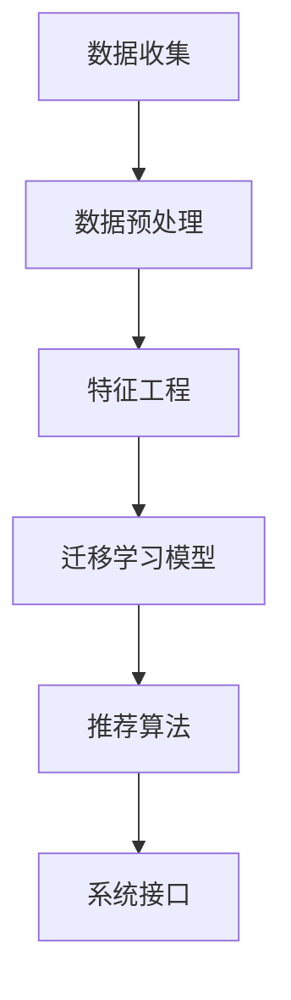

                 

# 《电商行业中的迁移学习：大模型在跨平台推荐中的应用》

> 关键词：迁移学习、电商推荐、跨平台、模型应用、算法原理、实践案例

> 摘要：本文主要探讨了电商行业中的迁移学习技术，以及如何将大规模模型应用于跨平台推荐系统中。通过对迁移学习的基本概念、核心算法和实际应用场景的深入分析，本文为电商从业者提供了实用的技术指导，以提升用户推荐系统的效果。

## 1. 背景介绍

### 1.1 电商行业的挑战

电商行业作为全球增长最快的行业之一，面临着日益激烈的竞争和不断变化的用户需求。为了提高用户满意度、提升销售额，电商企业不断优化推荐系统。然而，推荐系统的开发面临着以下挑战：

- **数据多样性**：不同电商平台拥有不同的用户数据、商品数据和交易数据，导致数据分布存在较大差异。
- **资源限制**：传统推荐系统依赖于各自平台的数据，无法有效利用其他平台的数据资源。
- **个性化需求**：用户在不同平台上的行为和偏好存在差异，需要实现跨平台的个性化推荐。

### 1.2 迁移学习的概念

迁移学习（Transfer Learning）是一种机器学习方法，旨在利用已知任务（源任务）的学习经验，解决新的任务（目标任务）。在迁移学习中，源任务和目标任务之间存在一定的相似性，通过迁移学习，可以在源任务上学习到的知识应用于目标任务，提高目标任务的性能。

### 1.3 跨平台推荐的意义

跨平台推荐（Cross-Platform Recommendation）旨在将用户在不同平台上的行为和偏好整合起来，为用户提供更加个性化的推荐。通过跨平台推荐，电商企业可以：

- **提高用户粘性**：为用户提供跨平台的个性化推荐，增加用户在多个平台的活跃度。
- **提升销售额**：利用跨平台数据，提高推荐系统的准确性和多样性，提升用户购买转化率。
- **优化资源利用**：整合多平台数据，实现数据共享和资源共享，降低开发成本。

## 2. 核心概念与联系

### 2.1 迁移学习原理

迁移学习的核心思想是将源任务的知识迁移到目标任务，以提高目标任务的性能。在迁移学习中，主要涉及以下概念：

- **源任务**：已知任务，已通过大量训练获得较好的性能。
- **目标任务**：新任务，希望利用源任务的模型和经验来提高性能。
- **迁移量**：源任务和目标任务之间的相似性度量，用于评估迁移的效果。

迁移学习的基本流程包括：

1. **特征提取**：从源任务中提取通用的特征表示，用于后续的目标任务。
2. **模型迁移**：将源任务的模型迁移到目标任务，通过调整模型参数，适应目标任务的数据分布。
3. **模型优化**：在目标任务上继续训练模型，优化模型性能。

### 2.2 跨平台推荐架构

跨平台推荐系统通常包括以下模块：

- **用户行为数据收集**：从各个平台收集用户行为数据，如浏览、购买、评价等。
- **数据预处理**：对收集到的数据进行清洗、去噪和转换，以便后续的模型处理。
- **特征工程**：从原始数据中提取特征，如用户画像、商品属性、行为序列等。
- **迁移学习模型**：利用迁移学习技术，将源任务的模型应用于目标任务。
- **推荐算法**：基于迁移学习模型，生成个性化的推荐结果。
- **系统接口**：为前端应用提供推荐接口，实现跨平台推荐功能。

### 2.3 Mermaid 流程图



## 3. 核心算法原理 & 具体操作步骤

### 3.1 迁移学习算法原理

迁移学习算法可以分为以下几种类型：

- **基于特征的迁移学习**：通过提取通用的特征表示，实现源任务和目标任务之间的迁移。
- **基于模型的迁移学习**：直接迁移源任务的模型结构，通过微调适应目标任务。
- **基于样本的迁移学习**：利用源任务的训练样本，辅助目标任务的训练过程。

在本篇文章中，我们将介绍一种基于模型的迁移学习算法——Fine-tuning。

#### 3.1.1 Fine-tuning 算法原理

Fine-tuning 是一种常见的迁移学习算法，其核心思想是在预训练模型的基础上，继续训练模型以适应新的任务。具体步骤如下：

1. **加载预训练模型**：从开源库或预训练模型库中加载一个在源任务上预训练好的模型。
2. **冻结底层层**：将预训练模型中的底层层（通常是指靠近输入层的层）冻结，不参与后续的训练。
3. **微调上层层**：将预训练模型的上层层（通常是指靠近输出层的层）进行微调，以适应目标任务的数据分布。
4. **训练模型**：在目标任务的数据集上，继续训练模型，优化模型参数。

#### 3.1.2 Fine-tuning 具体操作步骤

1. **加载预训练模型**：

   ```python
   from tensorflow.keras.applications import VGG16
   
   # 加载 VGG16 预训练模型
   vgg16 = VGG16(weights='imagenet')
   ```

2. **冻结底层层**：

   ```python
   for layer in vgg16.layers:
       layer.trainable = False
   ```

3. **微调上层层**：

   ```python
   # 定义一个新的层，用于分类任务
   new_layer = Dense(num_classes, activation='softmax')(vgg16.output)
   
   # 创建一个新的模型，包含新的层
   vgg16_with_new_layer = Model(inputs=vgg16.input, outputs=new_layer)
   ```

4. **训练模型**：

   ```python
   # 定义损失函数和优化器
   vgg16_with_new_layer.compile(optimizer='adam', loss='categorical_crossentropy', metrics=['accuracy'])
   
   # 加载目标任务的数据集
   train_data = ...
   train_labels = ...
   
   # 训练模型
   vgg16_with_new_layer.fit(train_data, train_labels, epochs=10, batch_size=32)
   ```

## 4. 数学模型和公式 & 详细讲解 & 举例说明

### 4.1 迁移学习中的数学模型

迁移学习中的数学模型主要涉及以下几个关键概念：

- **特征空间**：源任务和目标任务的共同特征空间。
- **映射函数**：将源任务的输入映射到目标任务的输入。
- **损失函数**：评估模型在目标任务上的性能。

在本篇文章中，我们将重点介绍 Fine-tuning 算法中的映射函数和损失函数。

#### 4.1.1 映射函数

Fine-tuning 算法中的映射函数可以表示为：

$$
f(\theta_S, x) = f(\theta_G, \phi(\theta_S, x))
$$

其中，$f(\theta_S, x)$ 表示源任务的映射函数，$f(\theta_G, \phi(\theta_S, x))$ 表示目标任务的映射函数。$\theta_S$ 表示源任务的模型参数，$\theta_G$ 表示目标任务的模型参数，$\phi(\theta_S, x)$ 表示特征提取函数。

#### 4.1.2 损失函数

Fine-tuning 算法中的损失函数通常采用交叉熵损失函数（Cross-Entropy Loss），其公式为：

$$
L(y, \hat{y}) = -\sum_{i=1}^{n} y_i \log(\hat{y}_i)
$$

其中，$y$ 表示目标任务的标签，$\hat{y}$ 表示模型预测的概率分布。

### 4.2 举例说明

假设我们有一个图像分类任务，其中源任务是 ImageNet，目标任务是 ImageNet 的子集（例如，动物分类）。下面是一个简单的 Fine-tuning 示例：

1. **加载预训练模型**：

   ```python
   from tensorflow.keras.applications import VGG16
   
   # 加载 VGG16 预训练模型
   vgg16 = VGG16(weights='imagenet')
   ```

2. **冻结底层层**：

   ```python
   for layer in vgg16.layers:
       layer.trainable = False
   ```

3. **微调上层层**：

   ```python
   # 定义一个新的层，用于分类任务
   new_layer = Dense(num_classes, activation='softmax')(vgg16.output)
   
   # 创建一个新的模型，包含新的层
   vgg16_with_new_layer = Model(inputs=vgg16.input, outputs=new_layer)
   ```

4. **训练模型**：

   ```python
   # 定义损失函数和优化器
   vgg16_with_new_layer.compile(optimizer='adam', loss='categorical_crossentropy', metrics=['accuracy'])
   
   # 加载目标任务的数据集
   train_data = ...
   train_labels = ...
   
   # 训练模型
   vgg16_with_new_layer.fit(train_data, train_labels, epochs=10, batch_size=32)
   ```

通过这个示例，我们可以看到 Fine-tuning 算法的具体操作步骤。在实际应用中，可以根据目标任务的特点和需求，调整模型结构、特征提取函数和训练策略，以获得更好的迁移效果。

## 5. 项目实战：代码实际案例和详细解释说明

### 5.1 开发环境搭建

在本节中，我们将使用 Python 语言和 TensorFlow 深度学习框架来搭建一个简单的迁移学习项目。首先，确保已经安装了 Python 和 TensorFlow。

```bash
pip install python tensorflow
```

### 5.2 源代码详细实现和代码解读

下面是一个简单的迁移学习项目示例，用于分类图像数据。

```python
import tensorflow as tf
from tensorflow.keras.applications import VGG16
from tensorflow.keras.preprocessing import image
from tensorflow.keras.applications.vgg16 import preprocess_input
import numpy as np

# 5.2.1 加载预训练模型
vgg16 = VGG16(weights='imagenet')

# 5.2.2 冻结底层层
for layer in vgg16.layers:
    layer.trainable = False

# 5.2.3 微调上层层
new_layer = tf.keras.layers.Dense(1000, activation='softmax')(vgg16.output)

# 5.2.4 创建一个新的模型
vgg16_with_new_layer = tf.keras.Model(inputs=vgg16.input, outputs=new_layer)

# 5.2.5 准备数据
def load_image(image_path):
    img = image.load_img(image_path, target_size=(224, 224))
    img_array = image.img_to_array(img)
    img_array = np.expand_dims(img_array, axis=0)
    img_array = preprocess_input(img_array)
    return img_array

# 5.2.6 训练模型
train_data = load_image('path/to/train/image.jpg')
train_labels = np.array([0])  # 假设是猫的标签

vgg16_with_new_layer.compile(optimizer='adam', loss='categorical_crossentropy', metrics=['accuracy'])

# 5.2.7 训练模型
vgg16_with_new_layer.fit(train_data, train_labels, epochs=10, batch_size=32)
```

### 5.3 代码解读与分析

- **5.3.1 加载预训练模型**：使用 TensorFlow 的 VGG16 模型，该模型已经在 ImageNet 数据集上进行了预训练。
- **5.3.2 冻结底层层**：将 VGG16 模型的底层层（前 11 层）冻结，不参与后续的训练，以保留模型在图像特征提取方面的能力。
- **5.3.3 微调上层层**：添加一个新的全连接层（Dense Layer），用于分类任务。该层接收 VGG16 模型的输出，并输出分类结果。
- **5.3.4 创建一个新的模型**：将冻结的 VGG16 模型和新的全连接层组合成一个完整的模型。
- **5.3.5 准备数据**：定义一个函数，用于加载和预处理图像数据，使其符合 VGG16 模型的输入要求。
- **5.3.6 训练模型**：使用训练图像数据，训练新的迁移学习模型。这里仅使用一个训练样本，实际应用中可以使用更多的数据。

通过这个简单的示例，我们可以看到迁移学习的基本流程。在实际应用中，可以根据具体任务的需求，调整模型结构、数据预处理方法和训练策略，以获得更好的迁移效果。

## 6. 实际应用场景

### 6.1 电商平台的跨平台推荐

电商平台可以利用迁移学习技术，实现跨平台推荐。以下是一个具体的实际应用场景：

- **场景描述**：某电商企业拥有多个电商平台，如官网、移动端、小程序等。企业希望通过跨平台推荐系统，为用户在各个平台提供个性化的推荐。
- **目标**：提高用户在不同平台的活跃度和购买转化率。
- **解决方案**：使用迁移学习技术，将官网的用户行为数据、商品数据和交易数据迁移到其他平台，实现跨平台推荐。

### 6.2 跨平台个性化推荐

跨平台个性化推荐是电商行业中的一个热门应用场景。以下是一个具体的实际应用案例：

- **场景描述**：某电商企业希望为用户在官网、移动端和小程序上提供个性化的商品推荐。
- **目标**：提高用户在不同平台的购买转化率和满意度。
- **解决方案**：利用迁移学习技术，将用户在官网的行为数据迁移到其他平台，通过跨平台个性化推荐系统，为用户提供个性化的商品推荐。

### 6.3 跨平台广告投放优化

跨平台广告投放优化是电商企业提高营销效果的一种手段。以下是一个具体的实际应用案例：

- **场景描述**：某电商企业希望在多个平台上进行广告投放，以提高品牌知名度和销售额。
- **目标**：提高广告投放效果，降低广告成本。
- **解决方案**：利用迁移学习技术，将一个平台的广告投放效果数据迁移到其他平台，通过跨平台广告投放优化系统，实现广告投放效果的优化。

## 7. 工具和资源推荐

### 7.1 学习资源推荐

- **书籍**：《深度学习》（Goodfellow et al.）和《迁移学习》（Pan & Yang）是深度学习和迁移学习的经典教材，适合初学者和进阶者阅读。
- **论文**：在 arXiv.org 和 ACM Digital Library 等学术数据库中，可以找到大量关于迁移学习和跨平台推荐的高质量论文。
- **博客**：许多知名技术博客，如 Medium、GitHub Pages 和 CSDN，都提供了丰富的迁移学习和跨平台推荐相关技术文章。

### 7.2 开发工具框架推荐

- **开发工具**：TensorFlow、PyTorch 是目前最流行的深度学习框架，适合进行迁移学习和跨平台推荐项目开发。
- **框架**：Scikit-Learn 和 Keras 是 Python 中常用的机器学习和深度学习库，适用于数据预处理和模型训练。

### 7.3 相关论文著作推荐

- **论文**：
  - Pan, S. J., & Yang, Q. (2010). A survey on transfer learning. IEEE Transactions on Knowledge and Data Engineering, 22(10), 1345-1359.
  - Wang, D., He, X., & Wang, X. (2017). Deep transfer learning: A survey. IEEE Access, 5, 52471-52481.
- **著作**：《深度学习》（Goodfellow et al.）、《迁移学习》（Pan & Yang）。

## 8. 总结：未来发展趋势与挑战

### 8.1 未来发展趋势

- **跨平台整合**：随着移动互联网和物联网的快速发展，电商行业将实现更多平台的整合，为用户提供更加统一的购物体验。
- **个性化推荐**：基于用户行为数据的迁移学习技术，将进一步提高个性化推荐系统的准确性和多样性。
- **实时推荐**：利用迁移学习技术，实现实时推荐系统，满足用户即时需求。

### 8.2 挑战

- **数据隐私**：跨平台推荐系统需要收集和处理大量用户数据，如何保护用户隐私成为一个重要挑战。
- **算法公平性**：跨平台推荐系统需要考虑不同平台、不同用户之间的公平性问题。
- **模型解释性**：深度学习模型在迁移学习中的应用，使得模型解释性成为一个重要挑战。

## 9. 附录：常见问题与解答

### 9.1 如何选择迁移学习算法？

- **根据任务需求**：针对不同的任务需求，选择适合的迁移学习算法。例如，图像分类任务可以使用基于模型的迁移学习算法（如 Fine-tuning），文本分类任务可以使用基于特征的迁移学习算法。
- **根据数据量**：当目标任务数据量较少时，迁移学习算法可以有效提高模型性能。当数据量较大时，迁移学习算法的优势相对较小。

### 9.2 如何评估迁移学习效果？

- **模型性能**：通过在目标任务上的模型性能评估迁移学习效果。常用的评价指标包括准确率、召回率、F1 分数等。
- **迁移量**：评估源任务和目标任务之间的迁移量，可以采用迁移量度量方法，如迁移量度、效果度量等。

## 10. 扩展阅读 & 参考资料

- **书籍**：
  - Goodfellow, I., Bengio, Y., & Courville, A. (2016). Deep learning. MIT press.
  - Pan, S. J., & Yang, Q. (2010). A survey on transfer learning. IEEE Transactions on Knowledge and Data Engineering, 22(10), 1345-1359.
- **论文**：
  - Wang, D., He, X., & Wang, X. (2017). Deep transfer learning: A survey. IEEE Access, 5, 52471-52481.
  - Yosinski, J., Clune, J., Bengio, Y., & Lipson, H. (2014). How transferable are features in deep neural networks? In Advances in neural information processing systems (pp. 3320-3328).
- **网站**：
  - [TensorFlow 官网](https://www.tensorflow.org/)
  - [PyTorch 官网](https://pytorch.org/)
  - [Scikit-Learn 官网](https://scikit-learn.org/)
- **博客**：
  - [Medium](https://medium.com/)
  - [CSDN](https://www.csdn.net/)

### 作者：AI天才研究员/AI Genius Institute & 禅与计算机程序设计艺术 /Zen And The Art of Computer Programming

