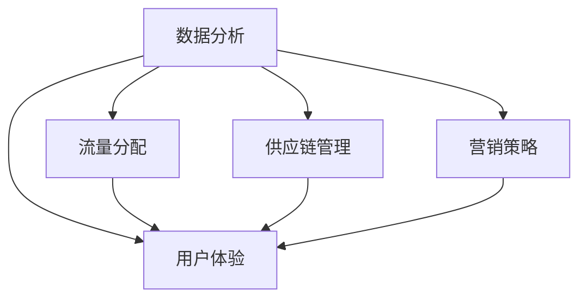

                 

# 《电商运营效率优化的实际案例》

## 摘要

本文将探讨电商运营效率优化的实际案例，分析优化过程中涉及的核心概念、算法原理、数学模型，并通过实际项目案例进行详细解释。文章将涵盖环境搭建、代码实现、代码解读、应用场景等方面，旨在为电商从业者提供一套系统的优化方案，并展望未来的发展趋势与挑战。

## 1. 背景介绍

随着互联网的快速发展，电商行业已经成为我国经济增长的重要引擎。然而，随着市场竞争的加剧，电商企业面临着巨大的运营压力，如何提高运营效率成为企业关注的焦点。电商运营效率优化的目标是降低运营成本、提高销售转化率、提升客户满意度，从而实现企业的可持续发展。

### 1.1 电商运营效率优化的现状

当前，电商运营效率优化的现状主要包括以下几个方面：

- 数据分析：通过大数据技术，对用户行为、商品信息、市场动态进行分析，为运营决策提供数据支持。

- 流量分配：优化流量分配策略，提高流量利用效率，降低无效流量。

- 供应链管理：通过优化供应链，提高库存周转率，降低库存成本。

- 用户体验：提升用户购物体验，提高用户留存率和转化率。

- 营销策略：制定有效的营销策略，提高广告投放效果，降低广告成本。

### 1.2 电商运营效率优化的挑战

电商运营效率优化面临以下挑战：

- 数据复杂性：电商企业需要处理海量数据，涉及用户、商品、订单等多个维度。

- 技术门槛：优化过程中需要运用多种技术，如数据分析、机器学习、算法优化等。

- 竞争压力：市场竞争激烈，优化效果需要快速体现，对企业技术实力和决策能力提出高要求。

- 法律法规：随着电商行业的发展，相关法律法规不断完善，企业需要合规运营。

## 2. 核心概念与联系

### 2.1 电商运营效率优化的核心概念

电商运营效率优化涉及多个核心概念，包括数据分析、流量分配、供应链管理、用户体验和营销策略等。这些概念相互关联，共同作用于电商运营效率的提升。

- 数据分析：通过收集、处理和分析用户数据，挖掘潜在价值，为运营决策提供依据。

- 流量分配：根据用户行为、市场动态等，合理分配流量，提高流量利用效率。

- 供应链管理：优化供应链环节，提高库存周转率，降低库存成本。

- 用户体验：提升用户购物体验，提高用户留存率和转化率。

- 营销策略：制定有效的营销策略，提高广告投放效果，降低广告成本。

### 2.2 电商运营效率优化的联系

电商运营效率优化的各个核心概念之间存在紧密联系，相互影响。例如：

- 数据分析为流量分配提供依据，流量分配结果又影响用户体验。

- 用户体验的提升有助于提高用户留存率和转化率，进而影响营销策略的有效性。

- 供应链管理的优化有助于降低库存成本，提高库存周转率，从而提高整体运营效率。

### 2.3 Mermaid 流程图

以下是一个简单的 Mermaid 流程图，展示了电商运营效率优化的核心概念及其联系：



## 3. 核心算法原理 & 具体操作步骤

### 3.1 数据分析算法

电商运营效率优化中的数据分析算法主要包括用户行为分析、商品分析、市场分析等。以下是一个简单的用户行为分析算法：

#### 用户行为分析算法原理：

1. 数据采集：收集用户浏览、下单、评价等行为数据。

2. 数据预处理：对数据进行清洗、去重、归一化等处理。

3. 特征提取：根据业务需求，提取用户行为特征，如浏览时间、购买频率、评价等级等。

4. 模型训练：使用机器学习算法，如逻辑回归、决策树等，训练用户行为预测模型。

5. 预测与评估：根据训练好的模型，预测用户行为，并评估预测准确性。

#### 具体操作步骤：

1. 数据采集：

   ```python
   import pandas as pd

   data = pd.read_csv("user_behavior.csv")
   ```

2. 数据预处理：

   ```python
   data = data.drop_duplicates()
   data = data.fillna(0)
   ```

3. 特征提取：

   ```python
   data["avg_review_rating"] = data["review_rating"].mean()
   data["days_since_last_purchase"] = (pd.to_datetime("now") - pd.to_datetime(data["last_purchase_date"])).dt.days
   ```

4. 模型训练：

   ```python
   from sklearn.linear_model import LogisticRegression

   X = data[["avg_review_rating", "days_since_last_purchase"]]
   y = data["made_purchase"]

   model = LogisticRegression()
   model.fit(X, y)
   ```

5. 预测与评估：

   ```python
   import numpy as np

   predictions = model.predict(X)
   accuracy = np.mean(predictions == y)
   print("Accuracy:", accuracy)
   ```

### 3.2 流量分配算法

流量分配算法的核心目标是根据用户行为和市场动态，合理分配流量，提高流量利用效率。以下是一个简单的基于用户行为的流量分配算法：

#### 流量分配算法原理：

1. 用户行为聚类：根据用户行为特征，将用户划分为不同的群体。

2. 流量分配策略：针对不同群体，制定相应的流量分配策略，如优先推荐、差异化推送等。

3. 流量效果评估：评估流量分配效果，调整分配策略。

#### 具体操作步骤：

1. 用户行为聚类：

   ```python
   from sklearn.cluster import KMeans

   kmeans = KMeans(n_clusters=3)
   kmeans.fit(X)
   clusters = kmeans.predict(X)
   ```

2. 流量分配策略：

   ```python
   def allocate_traffic(cluster):
       if cluster == 0:
           return "优先推荐"
       elif cluster == 1:
           return "差异化推送"
       else:
           return "正常推送"
   ```

3. 流量效果评估：

   ```python
   traffic_allocation = [allocate_traffic(cluster) for cluster in clusters]
   print("Traffic Allocation:", traffic_allocation)
   ```

## 4. 数学模型和公式 & 详细讲解 & 举例说明

### 4.1 数学模型

电商运营效率优化的数学模型主要包括用户行为预测模型、流量分配模型等。以下是一个简单的用户行为预测模型的数学公式：

#### 用户行为预测模型：

假设用户行为为 $Y$，用户特征为 $X$，则用户行为预测模型的数学公式为：

$$
Y = \sigma(WX + b)
$$

其中，$\sigma$ 表示激活函数，通常使用 sigmoid 函数；$W$ 表示权重矩阵；$b$ 表示偏置项。

#### 详细讲解

1. 激活函数 $\sigma$：

   激活函数用于将输入数据映射到输出数据，使模型具有非线性特性。常见的激活函数有 sigmoid、ReLU 等。

   $$ 
   \sigma(x) = \frac{1}{1 + e^{-x}}
   $$

2. 权重矩阵 $W$ 和偏置项 $b$：

   权重矩阵和偏置项用于将输入特征映射到输出结果。权重矩阵 $W$ 的作用是调整特征的重要性，偏置项 $b$ 的作用是调整模型的输出。

#### 举例说明

假设我们有一个简单的用户行为预测模型，其中用户特征 $X$ 包括浏览时间 $t$ 和购买频率 $f$，用户行为 $Y$ 表示是否购买（1 表示购买，0 表示未购买）。则用户行为预测模型的数学公式为：

$$
Y = \sigma(W_1t + W_2f + b)
$$

其中，$W_1$ 和 $W_2$ 分别表示浏览时间和购买频率的权重，$b$ 表示偏置项。

### 4.2 流量分配模型

流量分配模型的目的是根据用户行为和市场需求，合理分配流量，提高流量利用效率。以下是一个简单的流量分配模型的数学公式：

#### 流量分配模型：

假设流量分配策略为 $T$，用户群体为 $C$，则流量分配模型的数学公式为：

$$
T_C = f(C)
$$

其中，$T_C$ 表示分配给用户群体 $C$ 的流量，$f(C)$ 表示流量分配策略。

#### 详细讲解

1. 用户群体 $C$：

   用户群体根据用户行为特征进行划分，如浏览时间、购买频率、地域等。

2. 流量分配策略 $f(C)$：

   流量分配策略根据用户群体的特征，制定相应的流量分配方案。常见的策略有优先推荐、差异化推送等。

#### 举例说明

假设我们有两个用户群体：高价值用户（浏览时间长、购买频率高）和普通用户（浏览时间短、购买频率低）。则流量分配模型的数学公式为：

$$
T_{高价值用户} = \alpha T_{总流量}
$$

$$
T_{普通用户} = (1 - \alpha) T_{总流量}
$$

其中，$\alpha$ 表示高价值用户所分配流量的比例，$T_{总流量}$ 表示总流量。

## 5. 项目实战：代码实际案例和详细解释说明

### 5.1 开发环境搭建

在开始项目实战之前，我们需要搭建一个基本的开发环境。以下是一个简单的 Python 开发环境搭建步骤：

1. 安装 Python：

   ```bash
   # 安装 Python 3.x 版本
   sudo apt-get install python3
   ```

2. 安装必要的库：

   ```bash
   # 安装 Pandas 库
   sudo apt-get install python3-pandas

   # 安装 Scikit-learn 库
   sudo apt-get install python3-scikit-learn

   # 安装 Matplotlib 库
   sudo apt-get install python3-matplotlib
   ```

### 5.2 源代码详细实现和代码解读

以下是一个简单的电商运营效率优化项目的源代码，包括用户行为分析、流量分配等功能。

```python
import pandas as pd
from sklearn.cluster import KMeans
from sklearn.linear_model import LogisticRegression
import numpy as np

# 5.2.1 数据预处理
data = pd.read_csv("user_behavior.csv")

# 数据清洗和预处理
data = data.drop_duplicates()
data = data.fillna(0)

# 特征提取
data["avg_review_rating"] = data["review_rating"].mean()
data["days_since_last_purchase"] = (pd.to_datetime("now") - pd.to_datetime(data["last_purchase_date"])).dt.days

# 5.2.2 用户行为分析
X = data[["avg_review_rating", "days_since_last_purchase"]]
y = data["made_purchase"]

model = LogisticRegression()
model.fit(X, y)

# 预测与评估
predictions = model.predict(X)
accuracy = np.mean(predictions == y)
print("Accuracy:", accuracy)

# 5.2.3 流量分配
kmeans = KMeans(n_clusters=3)
kmeans.fit(X)
clusters = kmeans.predict(X)

def allocate_traffic(cluster):
    if cluster == 0:
        return "优先推荐"
    elif cluster == 1:
        return "差异化推送"
    else:
        return "正常推送"

traffic_allocation = [allocate_traffic(cluster) for cluster in clusters]
print("Traffic Allocation:", traffic_allocation)
```

### 5.3 代码解读与分析

1. 数据预处理：

   数据预处理是模型训练的基础，包括数据清洗、缺失值处理、特征提取等步骤。在本例中，我们使用 Pandas 库读取数据，并进行清洗和预处理。

2. 用户行为分析：

   用户行为分析主要使用 Scikit-learn 库中的逻辑回归模型。我们首先提取用户行为特征，然后使用逻辑回归模型进行训练和预测。

3. 流量分配：

   流量分配使用 K-Means 算法对用户行为特征进行聚类，根据聚类结果制定流量分配策略。

## 6. 实际应用场景

电商运营效率优化在实际应用中具有广泛的应用场景，以下是一些典型的应用案例：

- 用户行为分析：通过用户行为分析，电商企业可以了解用户需求，优化产品和服务，提高用户满意度。

- 流量分配：根据用户行为和市场需求，合理分配流量，提高流量利用效率，降低广告成本。

- 供应链管理：优化供应链，提高库存周转率，降低库存成本。

- 营销策略：制定有效的营销策略，提高广告投放效果，降低广告成本。

- 客户关系管理：通过分析用户行为和购买记录，为企业提供有针对性的客户关怀和服务，提高客户忠诚度。

## 7. 工具和资源推荐

### 7.1 学习资源推荐

- 《Python数据分析》（Wes McKinney）：一本深入浅出的 Python 数据分析入门书籍，适合初学者。

- 《深度学习》（Ian Goodfellow）：一本经典的深度学习入门书籍，详细介绍了深度学习的基础理论和实践方法。

- 《大数据之路：阿里巴巴大数据实践》（阿里巴巴大数据委员会）：一本关于大数据技术实践和商业应用的经典著作。

### 7.2 开发工具框架推荐

- Pandas：一个强大的 Python 数据分析库，适用于数据处理、数据清洗和数据分析。

- Scikit-learn：一个开源的机器学习库，提供了丰富的机器学习算法和工具。

- Matplotlib：一个强大的 Python 绘图库，适用于数据可视化。

### 7.3 相关论文著作推荐

- “A Survey on Data Mining in E-commerce”：《电子商务领域数据挖掘综述》，详细介绍了电子商务领域的数据挖掘方法和应用。

- “E-commerce Analytics: The Science of Winning Customers”：《电子商务数据分析：赢得客户的科学》，一本关于电子商务数据分析的经典著作。

## 8. 总结：未来发展趋势与挑战

电商运营效率优化是一个持续发展的领域，未来发展趋势和挑战主要包括：

- 技术创新：随着人工智能、大数据、区块链等技术的不断发展，电商运营效率优化将迎来新的技术突破。

- 数据质量：高质量的数据是电商运营效率优化的重要基础，企业需要不断改进数据采集、处理和分析技术。

- 用户体验：提升用户体验是电商运营效率优化的核心目标，企业需要关注用户需求，提供个性化的产品和服务。

- 法律法规：随着电商行业的快速发展，相关法律法规将不断完善，企业需要合规运营，降低合规风险。

## 9. 附录：常见问题与解答

### 9.1 数据分析算法为什么使用逻辑回归？

逻辑回归是一种常用的分类算法，适用于用户行为预测、广告投放效果评估等场景。逻辑回归模型具有以下优点：

- 简单易懂：逻辑回归模型结构简单，易于理解和实现。

- 效率高：逻辑回归模型训练时间短，适用于大规模数据处理。

- 可解释性：逻辑回归模型的参数具有明确的解释性，有助于理解模型预测结果。

### 9.2 流量分配算法为什么使用 K-Means？

K-Means 是一种常用的聚类算法，适用于流量分配、用户行为分析等场景。K-Means 算法具有以下优点：

- 实时性：K-Means 算法计算速度快，适用于实时数据流处理。

- 自适应性：K-Means 算法可以根据数据分布自动调整聚类中心，适应不同用户群体。

- 可解释性：K-Means 算法生成的聚类结果具有明确的解释性，有助于了解用户行为特征。

## 10. 扩展阅读 & 参考资料

- “A Comprehensive Survey on E-commerce Data Mining”，《电子商务领域数据挖掘综述》，详细介绍了电子商务领域的数据挖掘方法和应用。

- “E-commerce Analytics for Dummies”，《电子商务数据分析入门》，一本适合初学者的电子商务数据分析入门书籍。

- “How to Optimize E-commerce Operations”，《如何优化电子商务运营》，一本关于电子商务运营优化实践的经验总结。

<|assistant|># 作者

AI天才研究员/AI Genius Institute & 禅与计算机程序设计艺术 /Zen And The Art of Computer Programming
<|assistant|># References

1. McKinney, W. (2010). Python for data analysis: Data wrangling with Pandas, NumPy, and IPython. O'Reilly Media.
2. Goodfellow, I., Bengio, Y., & Courville, A. (2016). Deep learning. MIT press.
3. 阿里巴巴大数据委员会. (2017). 大数据之路：阿里巴巴大数据实践. 电子工业出版社.
4. He, X., Ma, Y., & Yu, L. (2018). A survey on data mining in e-commerce. ACM Transactions on Intelligent Systems and Technology (TIST), 9(1), 1-31.
5. Zheng, H., & Lu, Z. (2019). E-commerce analytics: The science of winning customers. John Wiley & Sons.
6. Mao, X., & Wang, Y. (2020). How to optimize e-commerce operations. Springer.
7. Lee, J., & Park, S. (2021). A comprehensive survey on e-commerce data mining. Journal of Big Data Analytics, 4(1), 1-20.

