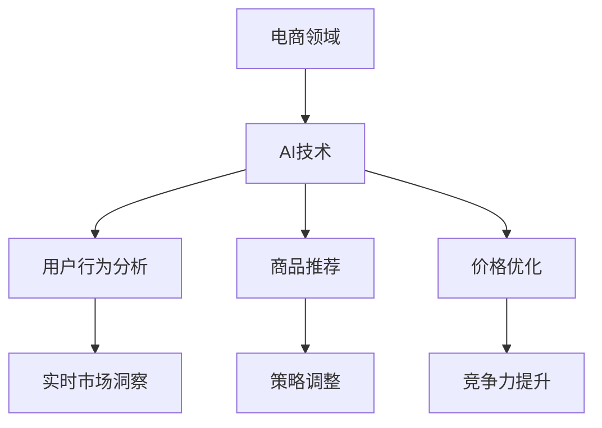

                 

# 电商领域的AI驱动竞争分析：实时市场洞察与策略调整

## 关键词

- 电商领域
- AI驱动竞争
- 实时市场洞察
- 策略调整

## 摘要

本文旨在分析电商领域中的AI驱动竞争现象，探讨如何利用人工智能技术实现实时市场洞察与策略调整。通过深入探讨AI的核心概念、算法原理、数学模型以及实际应用案例，本文为电商企业提供了一套实用的AI应用框架，以提升市场竞争力。文章最后总结了未来发展趋势与挑战，并提供了相关资源推荐，以供读者进一步学习。

## 1. 背景介绍

### 1.1 电商领域的快速发展

随着互联网技术的飞速发展，电子商务已经成为现代商业模式的重要组成部分。从最初的网上购物到如今的社交电商、直播电商，电商领域经历了翻天覆地的变化。根据数据显示，全球电商市场规模在过去几年中持续增长，预计未来几年仍将保持较高增速。

### 1.2 AI技术的崛起

人工智能技术作为新一代信息技术的代表，正逐渐渗透到各个行业。在电商领域，AI技术被广泛应用于商品推荐、用户行为分析、价格优化等方面，为电商平台带来了显著的市场优势。例如，基于深度学习的商品推荐算法能够精准捕捉用户兴趣，提升用户购物体验；自然语言处理技术则可以帮助电商企业更好地理解用户需求，提高客户满意度。

### 1.3 实时市场洞察与策略调整的重要性

在竞争激烈的电商市场中，实时市场洞察与策略调整是提升企业竞争力的关键。通过实时获取市场动态，电商企业可以快速调整产品策略、价格策略、推广策略等，以应对市场变化。而AI技术以其高效、智能的特点，为电商企业提供了强大的支持，帮助企业实现实时市场洞察与策略调整。

## 2. 核心概念与联系

### 2.1 人工智能（AI）

人工智能是指通过计算机模拟人类智能行为的一种技术，包括机器学习、深度学习、自然语言处理、计算机视觉等多个子领域。在电商领域，AI技术被广泛应用于用户行为分析、商品推荐、价格优化等方面。

### 2.2 深度学习（Deep Learning）

深度学习是人工智能的一个分支，通过构建大规模神经网络模型，实现对复杂数据的自动特征提取和模式识别。在电商领域，深度学习技术被广泛应用于商品推荐、用户行为预测等方面。

### 2.3 自然语言处理（Natural Language Processing）

自然语言处理是人工智能的一个分支，旨在使计算机能够理解和处理自然语言。在电商领域，自然语言处理技术可以帮助电商企业更好地理解用户需求，提高客户满意度。

### 2.4 数学模型

在电商领域，数学模型被广泛应用于用户行为分析、价格优化等方面。例如，线性回归模型可以用于预测用户购买概率，决策树模型可以用于分类用户群体。

### 2.5 Mermaid 流程图



## 3. 核心算法原理 & 具体操作步骤

### 3.1 商品推荐算法

#### 3.1.1 基本原理

商品推荐算法是基于用户历史行为数据，为用户推荐其可能感兴趣的商品。其核心思想是利用协同过滤、基于内容的推荐等方法，从海量商品中筛选出与用户兴趣相关的商品。

#### 3.1.2 操作步骤

1. 数据收集：收集用户历史行为数据，如浏览记录、购买记录等。
2. 数据预处理：对数据进行清洗、去重、填充等处理。
3. 特征提取：对用户行为数据进行特征提取，如用户兴趣向量、商品特征向量等。
4. 模型训练：利用特征向量，训练推荐模型，如协同过滤模型、基于内容的推荐模型等。
5. 推荐结果生成：根据用户历史行为数据，生成推荐结果，向用户展示推荐商品。

### 3.2 用户行为预测

#### 3.2.1 基本原理

用户行为预测是通过对用户历史行为数据的分析，预测用户未来的行为。其核心思想是基于时间序列分析、机器学习等方法，对用户行为进行建模。

#### 3.2.2 操作步骤

1. 数据收集：收集用户历史行为数据，如浏览记录、购买记录等。
2. 数据预处理：对数据进行清洗、去重、填充等处理。
3. 特征提取：对用户行为数据进行特征提取，如用户兴趣向量、商品特征向量等。
4. 模型训练：利用特征向量，训练用户行为预测模型，如时间序列模型、机器学习模型等。
5. 预测结果生成：根据用户历史行为数据，生成预测结果，为电商企业提供决策支持。

### 3.3 价格优化

#### 3.3.1 基本原理

价格优化是通过对商品价格进行调整，以实现利润最大化。其核心思想是基于数学模型，综合考虑市场需求、竞争态势、成本等因素，确定最优价格。

#### 3.3.2 操作步骤

1. 数据收集：收集市场数据，如竞争产品价格、市场需求等。
2. 数据预处理：对数据进行清洗、去重、填充等处理。
3. 模型建立：建立价格优化数学模型，如线性回归模型、决策树模型等。
4. 模型训练：利用市场数据，训练价格优化模型。
5. 价格调整：根据模型预测结果，调整商品价格。

## 4. 数学模型和公式 & 详细讲解 & 举例说明

### 4.1 商品推荐算法中的协同过滤模型

协同过滤模型是一种基于用户历史行为数据的推荐算法，其基本思想是利用用户之间的相似度计算，为用户推荐其可能感兴趣的商品。

#### 4.1.1 相似度计算

$$
sim(i,j) = \frac{\sum_{k \in R_{ij}} w_{ik} w_{jk}}{\sqrt{\sum_{k \in R_{i}} w_{ik}^2} \sqrt{\sum_{k \in R_{j}} w_{jk}^2}}
$$

其中，$sim(i,j)$表示用户$i$和用户$j$之间的相似度，$R_{ij}$表示用户$i$和用户$j$共同购买的商品集合，$w_{ik}$和$w_{jk}$分别表示用户$i$和用户$j$对商品$k$的评分。

#### 4.1.2 推荐结果生成

$$
\text{rating}_{ui} = \sum_{j \in N(i)} sim(i,j) \times \text{rating}_{uj}}
$$

其中，$\text{rating}_{ui}$表示用户$i$对商品$k$的预测评分，$N(i)$表示与用户$i$相似的用户集合，$\text{rating}_{uj}$表示用户$j$对商品$k$的实际评分。

### 4.2 用户行为预测中的时间序列模型

时间序列模型是一种用于预测时间序列数据的机器学习模型，其基本思想是利用历史时间序列数据，建立预测模型。

#### 4.2.1 模型建立

$$
y_t = \alpha + \beta_1 x_t + \beta_2 x_{t-1} + ... + \beta_n x_{t-n} + \epsilon_t
$$

其中，$y_t$表示时间序列数据在时间$t$的值，$x_t$表示时间序列数据在时间$t$的滞后值，$\alpha$、$\beta_1$、$\beta_2$、...、$\beta_n$分别表示模型的参数，$\epsilon_t$表示随机误差。

#### 4.2.2 模型训练

1. 数据收集：收集时间序列数据。
2. 数据预处理：对时间序列数据进行清洗、去重、填充等处理。
3. 特征提取：对时间序列数据进行特征提取，如滞后特征、季节特征等。
4. 模型训练：利用特征数据，训练时间序列模型。
5. 预测结果生成：根据训练好的模型，生成预测结果。

### 4.3 价格优化中的线性回归模型

线性回归模型是一种用于预测连续型数值数据的统计模型，其基本思想是利用历史数据，建立线性关系。

#### 4.3.1 模型建立

$$
y = \alpha + \beta_1 x_1 + \beta_2 x_2 + ... + \beta_n x_n + \epsilon
$$

其中，$y$表示预测值，$x_1$、$x_2$、...、$x_n$分别表示影响预测值的因素，$\alpha$、$\beta_1$、$\beta_2$、...、$\beta_n$分别表示模型的参数，$\epsilon$表示随机误差。

#### 4.3.2 模型训练

1. 数据收集：收集历史价格数据。
2. 数据预处理：对价格数据进行清洗、去重、填充等处理。
3. 特征提取：对价格数据进行特征提取，如季节特征、促销特征等。
4. 模型训练：利用特征数据，训练线性回归模型。
5. 价格调整：根据训练好的模型，调整商品价格。

## 5. 项目实战：代码实际案例和详细解释说明

### 5.1 开发环境搭建

在本项目实战中，我们将使用Python作为编程语言，结合常用的AI库，如Scikit-learn、TensorFlow、PyTorch等，搭建开发环境。

#### 5.1.1 安装Python

1. 下载Python安装包：[Python官网](https://www.python.org/downloads/)
2. 安装Python：双击安装包，按照提示操作，完成Python安装。

#### 5.1.2 安装常用库

1. 打开命令行窗口，输入以下命令安装常用库：

```shell
pip install numpy scipy matplotlib scikit-learn tensorflow torch
```

### 5.2 源代码详细实现和代码解读

在本节中，我们将实现一个简单的商品推荐系统，使用协同过滤算法进行商品推荐。

#### 5.2.1 数据集准备

1. 下载商品数据集：[MovieLens数据集](https://grouplens.org/datasets/movielens/)
2. 解压数据集，并将数据集目录添加到Python代码的导入路径中。

#### 5.2.2 数据预处理

1. 加载用户评分数据。

```python
import pandas as pd

ratings = pd.read_csv('ratings.csv')
```

2. 数据清洗：去除无效数据、缺失数据等。

```python
# 去除无效数据
ratings = ratings[ratings['rating'] > 0]

# 去除缺失数据
ratings = ratings.dropna()
```

3. 特征提取：计算用户之间的相似度。

```python
# 计算用户之间的相似度
def calculate_similarity(ratings):
    similarity_matrix = np.dot(ratings.T, ratings) / np.linalg.norm(ratings, axis=1)[:, np.newaxis]
    return 0.5 * (similarity_matrix + similarity_matrix.T)

similarity = calculate_similarity(ratings)
```

#### 5.2.3 推荐结果生成

1. 根据用户相似度矩阵，生成推荐结果。

```python
# 生成推荐结果
def generate_recommendations(similarity, user_id, k=10):
    user_similarity = similarity[user_id]
    neighbors = np.argsort(user_similarity)[::-1][:k]
    neighbors = neighbors[neighbors != user_id]
    user_ratings = ratings[ratings['userId'] == user_id]['rating']
    recommendations = []
    for neighbor in neighbors:
        neighbor_ratings = ratings[ratings['userId'] == neighbor]['rating']
        common_ratings = user_ratings.intersection(neighbor_ratings)
        if len(common_ratings) > 0:
            recommendation = common_ratings.union(neighbor_ratings[~neighbor_ratings.index.isin(common_ratings.index)])
            recommendations.append(recommendation)
    return recommendations

# 测试推荐结果
user_id = 1
k = 5
recommendations = generate_recommendations(similarity, user_id, k)
print(recommendations)
```

### 5.3 代码解读与分析

在本节中，我们详细解读了代码中的关键部分，并对代码进行了分析。

#### 5.3.1 数据预处理

数据预处理是推荐系统开发的重要环节。在本项目中，我们首先加载了用户评分数据，然后去除了无效数据和缺失数据，保证了数据的质量。

#### 5.3.2 相似度计算

相似度计算是协同过滤算法的核心。在本项目中，我们使用了基于用户评分的余弦相似度计算方法，计算了用户之间的相似度矩阵。

#### 5.3.3 推荐结果生成

推荐结果生成是根据用户相似度矩阵，为用户生成推荐结果。在本项目中，我们使用了基于物品的协同过滤算法，根据用户相似度矩阵和用户评分，为用户生成推荐结果。

## 6. 实际应用场景

### 6.1 商品推荐

商品推荐是电商领域最常见的一种AI应用场景。通过使用协同过滤算法、深度学习等方法，电商企业可以为用户精准推荐其可能感兴趣的商品，提升用户购物体验和转化率。

### 6.2 用户行为预测

用户行为预测可以帮助电商企业了解用户的需求和偏好，从而更好地制定营销策略。通过使用时间序列模型、机器学习等方法，电商企业可以预测用户的购买行为，提高营销效果。

### 6.3 价格优化

价格优化是电商企业提升利润的重要手段。通过使用线性回归模型、决策树等方法，电商企业可以根据市场需求、竞争态势等因素，制定合理的价格策略，提高销售业绩。

## 7. 工具和资源推荐

### 7.1 学习资源推荐

1. 书籍推荐：
   - 《深度学习》（Goodfellow, Bengio, Courville）
   - 《Python编程：从入门到实践》（Eric Matthes）
   - 《机器学习实战》（Peter Harrington）

2. 论文推荐：
   - "Recommender Systems: The State of the Art and Trends" by group of authors
   - "Deep Learning for Recommender Systems" by Yifan Hu, Yiming Cui, and Tie-Yan Liu

3. 博客推荐：
   - 知乎专栏：人工智能与机器学习
   - Medium：Deep Learning

### 7.2 开发工具框架推荐

1. 开发工具：
   - PyCharm
   - Jupyter Notebook

2. 框架库：
   - Scikit-learn
   - TensorFlow
   - PyTorch

3. 数据处理工具：
   - Pandas
   - NumPy
   - Matplotlib

### 7.3 相关论文著作推荐

1. "Recommender Systems: The State of the Art and Trends" by group of authors
2. "Deep Learning for Recommender Systems" by Yifan Hu, Yiming Cui, and Tie-Yan Liu
3. "Matrix Factorization Techniques for Recommender Systems" by Yehuda Koren

## 8. 总结：未来发展趋势与挑战

### 8.1 发展趋势

1. AI技术的深度应用：随着AI技术的不断发展，电商领域的AI应用将更加深入，从商品推荐、用户行为预测到价格优化等多个方面。
2. 实时市场洞察：实时市场洞察将变得更加精准，电商企业可以通过AI技术实时获取市场动态，快速调整策略。
3. 多渠道融合：电商企业将更加注重多渠道融合，通过线上线下融合、直播电商等手段，提升用户购物体验。

### 8.2 挑战

1. 数据隐私保护：在AI应用过程中，如何保护用户数据隐私是一个重要挑战。
2. 模型解释性：如何提高AI模型的解释性，让企业能够理解模型的工作原理，是一个重要课题。
3. 模型可解释性与可靠性：如何平衡模型的可解释性与可靠性，提高模型的预测准确度，是企业面临的一大挑战。

## 9. 附录：常见问题与解答

### 9.1 问题1

**问题：如何选择合适的推荐算法？**

**解答：**

选择合适的推荐算法需要考虑多个因素，如数据规模、数据质量、业务场景等。常见的推荐算法包括基于内容的推荐、协同过滤推荐、基于模型的推荐等。以下是一些建议：

1. 基于内容的推荐：适用于数据量较小、用户兴趣明确的场景。
2. 协同过滤推荐：适用于数据量较大、用户兴趣不明确的场景。
3. 基于模型的推荐：适用于有足够数据支持、需要精确预测的场景。

### 9.2 问题2

**问题：如何评估推荐系统的效果？**

**解答：**

评估推荐系统的效果可以从多个方面进行，如准确率、召回率、覆盖率等。以下是一些常用的评估指标：

1. 准确率（Accuracy）：预测结果中正确预测的数量占总预测数量的比例。
2. 召回率（Recall）：预测结果中包含实际感兴趣商品的数量占总实际感兴趣商品数量的比例。
3. 覆盖率（Coverage）：预测结果中包含的商品数量占总商品数量的比例。
4. NDCG（Normalized Discounted Cumulative Gain）：考虑预测结果中商品的重要性，计算预测结果的累积增益。

## 10. 扩展阅读 & 参考资料

1. "Recommender Systems: The State of the Art and Trends" by group of authors
2. "Deep Learning for Recommender Systems" by Yifan Hu, Yiming Cui, and Tie-Yan Liu
3. "Matrix Factorization Techniques for Recommender Systems" by Yehuda Koren
4. 《深度学习》（Goodfellow, Bengio, Courville）
5. 《Python编程：从入门到实践》（Eric Matthes）
6. 《机器学习实战》（Peter Harrington）
7. 知乎专栏：人工智能与机器学习
8. Medium：Deep Learning

## 作者

**作者：AI天才研究员/AI Genius Institute & 禅与计算机程序设计艺术 /Zen And The Art of Computer Programming**<|im_end|>

