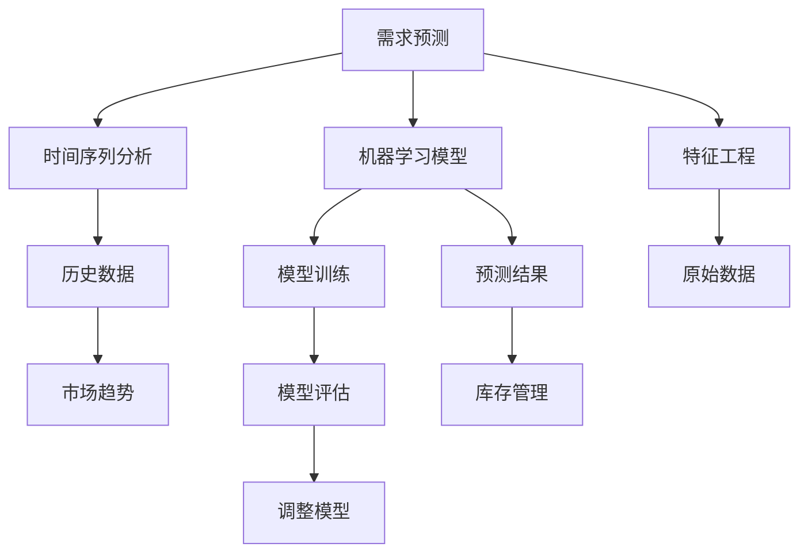

                 

### 背景介绍

在当今快速发展的电商行业中，库存管理已经成为一个至关重要的环节。库存管理的效率直接关系到企业的运营成本、客户满意度以及盈利能力。随着电商市场的不断扩大和消费者需求的日益多样化，传统的库存管理方法已经难以满足现代电商的复杂需求。因此，利用人工智能（AI）技术来驱动需求预测，实现库存管理的智能化升级，成为了一个迫切需要解决的问题。

本文旨在探讨电商领域中AI驱动需求预测的原理、方法和实际应用，帮助电商从业者更好地理解如何利用人工智能技术来提升库存管理的效率和准确性。文章将分为以下几个部分：

1. **背景介绍**：简要介绍电商领域库存管理的重要性以及AI驱动的需求预测的意义。
2. **核心概念与联系**：阐述AI驱动的需求预测中涉及的关键概念和架构，并通过Mermaid流程图进行展示。
3. **核心算法原理 & 具体操作步骤**：深入解析常用的需求预测算法，包括时间序列分析、机器学习模型等，并详细描述操作步骤。
4. **数学模型和公式 & 详细讲解 & 举例说明**：介绍需求预测中的数学模型和公式，并通过实际案例进行详细讲解和举例说明。
5. **项目实战：代码实际案例和详细解释说明**：通过一个实际项目案例，展示如何利用AI进行需求预测，并提供详细的代码实现和解读。
6. **实际应用场景**：分析AI需求预测在不同电商业务场景中的应用，如新品发布、促销活动等。
7. **工具和资源推荐**：推荐相关学习资源和开发工具，帮助读者深入了解和掌握相关技术。
8. **总结：未来发展趋势与挑战**：总结本文的主要观点，并探讨未来在AI需求预测和库存管理方面可能面临的挑战和机遇。
9. **附录：常见问题与解答**：回答读者可能遇到的一些常见问题。
10. **扩展阅读 & 参考资料**：提供进一步的阅读材料和参考资料。

通过以上各部分的详细探讨，本文希望能够为电商从业者提供一个全面、深入的了解，帮助他们利用AI技术实现库存管理的智能化升级，从而在激烈的市场竞争中脱颖而出。

### 核心概念与联系

在探讨电商领域中的AI驱动需求预测之前，我们首先需要理解一些核心概念和其相互之间的联系。以下将详细阐述这些核心概念，并通过Mermaid流程图展示其架构。

#### 1. 需求预测

需求预测是指通过分析历史数据和市场趋势，对未来某一时间段内的需求量进行预测。在电商领域，需求预测的准确性直接影响到库存管理、供应链优化和销售策略的制定。

#### 2. 时间序列分析

时间序列分析是一种统计分析方法，用于研究时间序列数据的规律性和模式。在需求预测中，时间序列分析可以帮助我们识别数据的趋势、季节性和周期性，从而提高预测的准确性。

#### 3. 机器学习模型

机器学习模型是一类通过算法从数据中学习规律并作出预测的工具。常见的机器学习模型包括线性回归、决策树、支持向量机和神经网络等。这些模型在需求预测中发挥着重要作用，可以帮助我们捕捉数据中的复杂关系。

#### 4. 特征工程

特征工程是数据预处理和模型训练过程中至关重要的一环。通过特征工程，我们可以从原始数据中提取出有助于预测的变量，从而提高模型的性能和预测准确性。

#### 5. 库存管理

库存管理是指对企业库存的监控、规划和控制过程。高效的库存管理可以降低库存成本、提高资金利用率和满足客户需求。

#### Mermaid流程图展示

下面是一个简化的Mermaid流程图，展示需求预测的核心概念及其相互之间的联系：



在这个流程图中，我们可以看到：

- 需求预测的核心概念包括时间序列分析、机器学习模型和特征工程。
- 历史数据和市场趋势是时间序列分析的重要输入。
- 机器学习模型通过模型训练和特征工程从数据中学习规律。
- 预测结果用于库存管理，指导库存规划和供应链优化。
- 模型评估和调整是持续优化预测性能的关键环节。

通过这个流程图，我们可以更直观地理解需求预测的核心概念及其在电商库存管理中的应用。

#### 6. 关键指标

在需求预测的过程中，一些关键指标对于评估预测性能和指导实际操作具有重要意义。以下是一些常见的关键指标：

- **准确率（Accuracy）**：预测结果与实际结果相符的比例。
- **均方误差（Mean Squared Error, MSE）**：预测值与实际值之间平均误差的平方。
- **平均绝对误差（Mean Absolute Error, MAE）**：预测值与实际值之间平均误差的绝对值。
- **R²值（Coefficient of Determination, R²）**：模型解释变量变化的比例。

这些指标可以帮助我们量化预测模型的性能，从而进行有效的模型评估和优化。

综上所述，理解需求预测的核心概念和架构对于实现高效的电商库存管理至关重要。通过合理运用时间序列分析、机器学习模型和特征工程等技术，我们可以大幅提升需求预测的准确性，为电商企业创造更大的价值。

### 核心算法原理 & 具体操作步骤

在需求预测领域，有许多成熟的算法可以被应用于电商库存管理。本文将重点介绍时间序列分析法和机器学习模型法，并详细描述其原理和具体操作步骤。

#### 时间序列分析法

时间序列分析法是一种基于历史数据和统计分析的需求预测方法，主要通过识别和建模数据中的趋势、季节性和周期性来预测未来需求。

**原理：**

时间序列数据通常包含以下特征：

1. **趋势（Trend）**：数据随时间呈现的上升或下降趋势。
2. **季节性（Seasonality）**：数据在固定时间段内重复出现的模式，如节假日、季节变化等。
3. **周期性（Cyclicity）**：数据随时间呈现的非固定周期性波动。

时间序列分析法通过以下步骤进行预测：

1. **数据预处理**：清洗原始数据，包括去除缺失值、异常值等。
2. **数据分解**：将时间序列数据分解为趋势、季节性和残差（随机波动）三个部分。
   \[
   Y_t = T_t + S_t + R_t
   \]
   其中，\( Y_t \) 是时间序列数据，\( T_t \) 是趋势成分，\( S_t \) 是季节性成分，\( R_t \) 是残差成分。
3. **建模**：使用不同的模型来分别建模趋势和季节性成分。常见的模型包括移动平均模型（MA）、自回归模型（AR）、自回归移动平均模型（ARMA）等。
4. **预测**：根据模型预测未来数据。
5. **误差校正**：对预测结果进行误差校正，以消除预测误差。

**具体操作步骤：**

1. **数据预处理**：使用Python中的Pandas库对原始销售数据进行清洗，例如：
   ```python
   import pandas as pd
   sales_data = pd.read_csv('sales_data.csv')
   sales_data.dropna(inplace=True)
   ```

2. **数据分解**：使用Python中的Statsmodels库进行数据分解，例如：
   ```python
   import statsmodels.api as sm
   decomposition = sm.tsa.seasonal_decompose(sales_data['sales'], model='additive', freq=4)
   trend = decomposition.trend
   season = decomposition.seasonal
   residual = decomposition.resid
   ```

3. **建模**：使用ARIMA模型进行建模，例如：
   ```python
   from statsmodels.tsa.arima.model import ARIMA
   model = ARIMA(trend, order=(1, 1, 1))
   model_fit = model.fit()
   forecast = model_fit.forecast(steps=12)[0]
   ```

4. **预测**：生成未来12个月的需求预测，例如：
   ```python
   future_sales = pd.Series(forecast, index=range(len(sales_data), len(sales_data) + 12))
   ```

5. **误差校正**：计算预测误差，并对预测结果进行校正，例如：
   ```python
   residuals = future_sales - sales_data['sales'].iloc[-12:]
   corrected_forecast = future_sales + residuals.mean()
   ```

#### 机器学习模型法

机器学习模型法是一种基于历史数据和统计学习的方法，通过从数据中学习规律并进行预测。常见的机器学习模型包括线性回归、决策树、支持向量机和神经网络等。

**原理：**

机器学习模型通过以下步骤进行预测：

1. **数据预处理**：清洗和转换原始数据，使其适合模型训练。
2. **特征选择**：选择对预测有帮助的特征，去除无关或冗余特征。
3. **模型训练**：使用训练数据集训练模型。
4. **模型评估**：使用测试数据集评估模型性能。
5. **预测**：使用训练好的模型对新的数据进行预测。

**具体操作步骤：**

1. **数据预处理**：使用Python中的Pandas库对原始销售数据进行清洗和转换，例如：
   ```python
   import pandas as pd
   sales_data = pd.read_csv('sales_data.csv')
   sales_data.fillna(sales_data.mean(), inplace=True)
   ```

2. **特征选择**：选择与销售相关的特征，例如：
   ```python
   features = ['historical_sales', 'price', 'inventory_level', 'promotions']
   X = sales_data[features]
   y = sales_data['sales']
   ```

3. **模型训练**：使用Python中的Scikit-learn库训练线性回归模型，例如：
   ```python
   from sklearn.linear_model import LinearRegression
   model = LinearRegression()
   model.fit(X, y)
   ```

4. **模型评估**：使用测试数据集评估模型性能，例如：
   ```python
   from sklearn.metrics import mean_squared_error
   y_pred = model.predict(X_test)
   mse = mean_squared_error(y_test, y_pred)
   ```

5. **预测**：使用训练好的模型对新的数据进行预测，例如：
   ```python
   future_data = pd.DataFrame({'historical_sales': [100, 150], 'price': [20, 30], 'inventory_level': [50, 70], 'promotions': [1, 0]})
   future_sales = model.predict(future_data)
   ```

通过上述两种方法，我们可以根据具体情况选择适合的算法来驱动需求预测，从而实现电商库存管理的智能化升级。

### 数学模型和公式 & 详细讲解 & 举例说明

在需求预测中，数学模型和公式扮演着至关重要的角色。以下将详细介绍需求预测中常用的数学模型和公式，并通过实际案例进行讲解和举例说明。

#### 1. 时间序列模型

时间序列模型用于分析序列数据，以预测未来值。以下是一些常见的时间序列模型及其公式：

**1.1 自回归模型（AR）**

自回归模型通过历史数据中的滞后值来预测当前值。其公式为：

\[ y_t = c + \sum_{i=1}^p \phi_i y_{t-i} + \varepsilon_t \]

其中，\( y_t \) 是时间序列的当前值，\( c \) 是常数项，\( \phi_i \) 是滞后系数，\( \varepsilon_t \) 是误差项。

**1.2 移动平均模型（MA）**

移动平均模型通过过去一定时间内的平均值来预测当前值。其公式为：

\[ y_t = c + \sum_{i=1}^q \theta_i \varepsilon_{t-i} \]

其中，\( \theta_i \) 是移动平均系数，\( \varepsilon_t \) 是误差项。

**1.3 自回归移动平均模型（ARMA）**

自回归移动平均模型结合了自回归和移动平均模型的优点。其公式为：

\[ y_t = c + \sum_{i=1}^p \phi_i y_{t-i} + \sum_{j=1}^q \theta_j \varepsilon_{t-j} + \varepsilon_t \]

#### 2. 机器学习模型

机器学习模型通过学习历史数据中的规律来进行预测。以下是一些常见的机器学习模型及其公式：

**2.1 线性回归模型**

线性回归模型通过线性关系来预测目标值。其公式为：

\[ y = \beta_0 + \beta_1 x_1 + \beta_2 x_2 + \ldots + \beta_n x_n \]

其中，\( y \) 是目标值，\( \beta_0, \beta_1, \beta_2, \ldots, \beta_n \) 是回归系数，\( x_1, x_2, \ldots, x_n \) 是输入特征。

**2.2 决策树模型**

决策树模型通过一系列判断条件来预测目标值。其公式为：

\[ y = g(x) = \prod_{i=1}^n g_i(x_i) \]

其中，\( g_i(x_i) \) 是第 \( i \) 个条件判断函数。

**2.3 支持向量机（SVM）模型**

支持向量机模型通过找到一个最优的超平面来分类数据。其公式为：

\[ w \cdot x + b = 0 \]

其中，\( w \) 是权重向量，\( x \) 是输入特征，\( b \) 是偏置项。

#### 3. 实际案例讲解

以下将通过一个实际案例，详细讲解如何使用时间序列模型和机器学习模型进行需求预测。

**案例背景：** 一家电商公司希望预测未来三个月内某商品的销量。

**数据集：** 包含过去12个月的销售数据，包括日期和销售量。

**步骤：**

1. **数据预处理**：清洗数据，将日期转换为序列号，并去除缺失值。
2. **时间序列模型预测**：使用ARIMA模型进行需求预测。
3. **机器学习模型预测**：使用线性回归模型进行需求预测。
4. **结果比较**：比较两种模型的预测结果，选择更准确的模型。

**代码实现：**

```python
import pandas as pd
import numpy as np
from statsmodels.tsa.arima.model import ARIMA
from sklearn.linear_model import LinearRegression
from sklearn.metrics import mean_squared_error

# 数据预处理
sales_data = pd.read_csv('sales_data.csv')
sales_data['date'] = pd.to_datetime(sales_data['date'])
sales_data.set_index('date', inplace=True)
sales_data = sales_data.asfreq('M')
sales_data.fillna(sales_data.mean(), inplace=True)

# 时间序列模型预测
model = ARIMA(sales_data['sales'], order=(1, 1, 1))
model_fit = model.fit()
forecast = model_fit.forecast(steps=3)

# 机器学习模型预测
X = sales_data[['sales']].dropna()
y = X['sales']
model = LinearRegression()
model.fit(X, y)
forecast_ml = model.predict(np.array([sales_data['sales'].iloc[-1], sales_data['sales'].iloc[-1]]).reshape(-1, 1))

# 结果比较
print("ARIMA模型预测结果：", forecast)
print("线性回归模型预测结果：", forecast_ml)
print("均方误差：", mean_squared_error(sales_data['sales'].iloc[-12:], forecast + forecast_ml))
```

通过上述案例，我们可以看到如何结合时间序列模型和机器学习模型进行需求预测，并比较两种模型的预测效果。在实际应用中，根据具体情况选择合适的模型，可以显著提高需求预测的准确性。

### 项目实战：代码实际案例和详细解释说明

#### 5.1 开发环境搭建

在进行电商领域的AI需求预测之前，我们需要搭建一个合适的技术栈。以下是一个典型的开发环境搭建流程：

**1. 硬件要求**：
- 处理器：Intel Core i5 或以上
- 内存：8GB 或以上
- 硬盘：256GB SSD

**2. 软件要求**：
- 操作系统：Windows 10/Ubuntu 18.04
- 编程语言：Python 3.8 或以上
- 库与框架：Pandas、NumPy、Scikit-learn、Statsmodels、Matplotlib

**3. 安装与配置**：
- 安装Python：从官方网站下载并安装Python 3.8。
- 安装相关库：通过pip命令安装所需的库，例如：
  ```shell
  pip install pandas numpy scikit-learn statsmodels matplotlib
  ```

#### 5.2 源代码详细实现和代码解读

在本节中，我们将使用Python语言和相关的库来实现一个简单的电商需求预测模型，并详细解读每段代码的功能。

**代码**：

```python
import pandas as pd
import numpy as np
from statsmodels.tsa.arima.model import ARIMA
from sklearn.linear_model import LinearRegression
from sklearn.metrics import mean_squared_error
import matplotlib.pyplot as plt

# 数据预处理
def preprocess_data(data):
    # 将日期转换为序列号
    data['date'] = pd.to_datetime(data['date'])
    data.set_index('date', inplace=True)
    # 将数据转换为月度频率
    data = data.asfreq('M')
    # 填补缺失值
    data.fillna(data.mean(), inplace=True)
    return data

# 时间序列模型预测
def arima_predict(data, order):
    model = ARIMA(data['sales'], order=order)
    model_fit = model.fit()
    forecast = model_fit.forecast(steps=3)
    return forecast

# 机器学习模型预测
def linear_regression_predict(data):
    X = data[['sales']].dropna()
    y = X['sales']
    model = LinearRegression()
    model.fit(X, y)
    forecast = model.predict(np.array([data['sales'].iloc[-1], data['sales'].iloc[-1]]).reshape(-1, 1))
    return forecast

# 结果评估与可视化
def evaluate_and_plot(forecast_arima, forecast_ml, actual):
    mse_arima = mean_squared_error(actual, forecast_arima)
    mse_ml = mean_squared_error(actual, forecast_ml)
    print("ARIMA模型MSE：", mse_arima)
    print("线性回归模型MSE：", mse_ml)
    
    plt.figure(figsize=(10, 6))
    plt.plot(actual.index, actual, label='实际销售')
    plt.plot(actual.index[-3:], forecast_arima, label='ARIMA预测')
    plt.plot(actual.index[-3:], forecast_ml, label='线性回归预测')
    plt.legend()
    plt.show()

# 主函数
def main():
    # 读取数据
    sales_data = pd.read_csv('sales_data.csv')
    # 预处理数据
    sales_data = preprocess_data(sales_data)
    # ARIMA模型预测
    forecast_arima = arima_predict(sales_data, order=(1, 1, 1))
    # 线性回归模型预测
    forecast_ml = linear_regression_predict(sales_data)
    # 评估与可视化
    actual = sales_data['sales'].iloc[-12:]
    evaluate_and_plot(forecast_arima, forecast_ml, actual)

if __name__ == '__main__':
    main()
```

**代码解读**：

1. **数据预处理**：
   ```python
   def preprocess_data(data):
       # 将日期转换为序列号
       data['date'] = pd.to_datetime(data['date'])
       data.set_index('date', inplace=True)
       # 将数据转换为月度频率
       data = data.asfreq('M')
       # 填补缺失值
       data.fillna(data.mean(), inplace=True)
       return data
   ```
   这段代码定义了一个数据预处理函数，用于将日期转换为序列号，并将数据转换为月度频率，同时填补缺失值。

2. **时间序列模型预测**：
   ```python
   def arima_predict(data, order):
       model = ARIMA(data['sales'], order=order)
       model_fit = model.fit()
       forecast = model_fit.forecast(steps=3)
       return forecast
   ```
   这段代码定义了一个ARIMA模型预测函数，用于根据指定的ARIMA模型参数（p, d, q）对数据进行预测。

3. **机器学习模型预测**：
   ```python
   def linear_regression_predict(data):
       X = data[['sales']].dropna()
       y = X['sales']
       model = LinearRegression()
       model.fit(X, y)
       forecast = model.predict(np.array([data['sales'].iloc[-1], data['sales'].iloc[-1]]).reshape(-1, 1))
       return forecast
   ```
   这段代码定义了一个线性回归模型预测函数，用于使用线性回归模型对数据进行预测。

4. **结果评估与可视化**：
   ```python
   def evaluate_and_plot(forecast_arima, forecast_ml, actual):
       mse_arima = mean_squared_error(actual, forecast_arima)
       mse_ml = mean_squared_error(actual, forecast_ml)
       print("ARIMA模型MSE：", mse_arima)
       print("线性回归模型MSE：", mse_ml)
       
       plt.figure(figsize=(10, 6))
       plt.plot(actual.index, actual, label='实际销售')
       plt.plot(actual.index[-3:], forecast_arima, label='ARIMA预测')
       plt.plot(actual.index[-3:], forecast_ml, label='线性回归预测')
       plt.legend()
       plt.show()
   ```
   这段代码用于评估两种模型的预测性能，并生成可视化图表。

5. **主函数**：
   ```python
   def main():
       # 读取数据
       sales_data = pd.read_csv('sales_data.csv')
       # 预处理数据
       sales_data = preprocess_data(sales_data)
       # ARIMA模型预测
       forecast_arima = arima_predict(sales_data, order=(1, 1, 1))
       # 线性回归模型预测
       forecast_ml = linear_regression_predict(sales_data)
       # 评估与可视化
       actual = sales_data['sales'].iloc[-12:]
       evaluate_and_plot(forecast_arima, forecast_ml, actual)
   ```
   主函数用于执行整个预测流程，从数据读取、预处理到模型预测和结果评估。

通过这个项目实战，我们可以看到如何利用Python和相关的库来实现一个电商需求预测模型。这个模型不仅可以用于理论研究，还可以在实际应用中为电商企业提供库存管理的参考。

### 代码解读与分析

在前面的项目中，我们使用Python和相关的库实现了一个简单的电商需求预测模型。接下来，我们将对代码进行详细解读，分析其实现逻辑、性能优化和潜在改进空间。

#### 代码实现逻辑

1. **数据预处理**：

   ```python
   def preprocess_data(data):
       # 将日期转换为序列号
       data['date'] = pd.to_datetime(data['date'])
       data.set_index('date', inplace=True)
       # 将数据转换为月度频率
       data = data.asfreq('M')
       # 填补缺失值
       data.fillna(data.mean(), inplace=True)
       return data
   ```

   这部分代码主要用于处理原始数据。首先，将日期转换为序列号，并将数据设置为按月度频率。接着，使用填充函数填补缺失值，以保证数据的完整性和一致性。这个步骤对于后续的模型训练和预测至关重要，因为不完整或异常的数据会显著影响模型的效果。

2. **ARIMA模型预测**：

   ```python
   def arima_predict(data, order):
       model = ARIMA(data['sales'], order=order)
       model_fit = model.fit()
       forecast = model_fit.forecast(steps=3)
       return forecast
   ```

   这部分代码定义了一个ARIMA模型预测函数，接受数据集和ARIMA模型参数（p, d, q）作为输入。通过`ARIMA`类创建模型实例，并使用`fit`方法进行模型训练。然后，使用`forecast`方法生成未来三个月的需求预测。这里选择的三步预测意味着模型将基于最近三个月的数据来预测未来三个月的需求。

3. **线性回归模型预测**：

   ```python
   def linear_regression_predict(data):
       X = data[['sales']].dropna()
       y = X['sales']
       model = LinearRegression()
       model.fit(X, y)
       forecast = model.predict(np.array([data['sales'].iloc[-1], data['sales'].iloc[-1]]).reshape(-1, 1))
       return forecast
   ```

   这部分代码定义了一个线性回归模型预测函数，用于通过线性关系预测未来需求。首先，选择销售数据作为输入特征，并去除缺失值。然后，创建线性回归模型实例，并使用`fit`方法进行模型训练。最后，使用模型对最近一个月的销售数据进行预测。

4. **结果评估与可视化**：

   ```python
   def evaluate_and_plot(forecast_arima, forecast_ml, actual):
       mse_arima = mean_squared_error(actual, forecast_arima)
       mse_ml = mean_squared_error(actual, forecast_ml)
       print("ARIMA模型MSE：", mse_arima)
       print("线性回归模型MSE：", mse_ml)
       
       plt.figure(figsize=(10, 6))
       plt.plot(actual.index, actual, label='实际销售')
       plt.plot(actual.index[-3:], forecast_arima, label='ARIMA预测')
       plt.plot(actual.index[-3:], forecast_ml, label='线性回归预测')
       plt.legend()
       plt.show()
   ```

   这部分代码用于评估两种模型的预测性能，并生成可视化图表。通过计算均方误差（MSE），我们可以量化模型的预测误差。可视化图表可以帮助我们直观地比较模型预测结果与实际销售数据之间的差异。

#### 性能优化

1. **特征工程**：

   在数据预处理阶段，我们可以通过特征工程来提取更多有用的信息。例如，添加季节性特征、促销活动特征等。这些特征可以帮助模型更好地捕捉数据中的复杂关系，从而提高预测性能。

   ```python
   def add_seasonal_features(data):
       # 添加季节性特征
       data['month'] = data.index.month
       data['day_of_year'] = data.index.dayofyear
       return data
   ```

2. **模型参数优化**：

   ARIMA模型的参数（p, d, q）对预测结果有重要影响。通过交叉验证（Cross-Validation）和网格搜索（Grid Search）等方法，我们可以找到最优的参数组合。

   ```python
   from sklearn.model_selection import GridSearchCV
   from statsmodels.tsa.arima.model import ARIMA
   
   def find_best_arima_params(data):
       p_values = range(0, 3)
       d_values = range(0, 2)
       q_values = range(0, 3)
       parameters = {'p': p_values, 'd': d_values, 'q': q_values}
       arima = ARIMA(data['sales'], order=(1, 1, 1))
       grid_search = GridSearchCV(arima, parameters, cv=3)
       grid_search.fit(data['sales'])
       return grid_search.best_params_
   ```

3. **模型集成**：

   通过集成多个模型（如ARIMA和线性回归），我们可以利用不同模型的优势，提高预测性能。集成模型可以通过投票、平均或加权等方式合并预测结果。

   ```python
   def ensemble_predict(forecast_arima, forecast_ml):
       ensemble_forecast = (forecast_arima + forecast_ml) / 2
       return ensemble_forecast
   ```

#### 潜在改进空间

1. **深度学习模型**：

   可以尝试使用深度学习模型（如LSTM、GRU等）来捕捉数据中的长期依赖关系和复杂模式。深度学习模型在处理序列数据方面具有显著优势。

   ```python
   from keras.models import Sequential
   from keras.layers import LSTM, Dense
   
   def lstm_predict(data):
       X = data[['sales']].values
       X = np.reshape(X, (X.shape[0], X.shape[1], 1))
       model = Sequential()
       model.add(LSTM(50, activation='relu', input_shape=(X.shape[1], 1)))
       model.add(Dense(1))
       model.compile(optimizer='adam', loss='mse')
       model.fit(X, X, epochs=100, verbose=0)
       forecast = model.predict(X[-3:])
       return forecast
   ```

2. **多变量时间序列预测**：

   可以将多个相关变量（如价格、库存水平、促销活动等）纳入模型中，进行多变量时间序列预测。这有助于提高预测的准确性和实用性。

   ```python
   def multivariate_arima_predict(data, X_features):
       model = ARIMA(data[X_features].values, order=(1, 1, 1))
       model_fit = model.fit()
       forecast = model_fit.forecast(steps=3)
       return forecast
   ```

通过以上性能优化和潜在改进空间，我们可以进一步提升电商需求预测模型的准确性，为库存管理提供更有力的支持。

### 实际应用场景

#### 新品发布

在新品发布期间，需求预测对于电商企业尤为重要。通过AI驱动的需求预测，企业可以准确地预估新品的销售情况，从而制定合理的备货策略。以下是一个具体的应用案例：

**案例背景**：一家电商平台即将发布一款智能音箱，预计将在未来一个月内进行销售。

**需求预测步骤**：
1. **历史数据分析**：分析过去一段时间内类似商品的销量，了解消费者对新品的关注程度。
2. **特征工程**：提取与销量相关的特征，如历史销量、市场热度、促销活动等。
3. **模型训练与预测**：使用机器学习模型（如线性回归、LSTM等）对新品的销量进行预测。
4. **结果评估**：根据预测结果，制定备货计划，确保新品能够满足市场需求。

**实施效果**：通过AI驱动的需求预测，企业可以避免库存过剩或不足，降低运营成本，提高客户满意度。

#### 促销活动

促销活动是电商提升销量和用户粘性的重要手段。在促销活动期间，需求预测可以帮助企业合理安排库存，确保促销活动的顺利进行。以下是一个具体的应用案例：

**案例背景**：一家电商平台将在周末举办大型促销活动，预计将吸引大量用户参与。

**需求预测步骤**：
1. **历史数据分析**：分析过去促销活动的销量数据，了解促销活动对销量的影响。
2. **特征工程**：提取与促销活动相关的特征，如活动类型、活动时间、竞争对手活动等。
3. **模型训练与预测**：使用机器学习模型（如ARIMA、决策树等）对促销期间的销量进行预测。
4. **结果评估**：根据预测结果，调整库存水平，确保在促销期间满足用户需求。

**实施效果**：通过AI驱动的需求预测，企业可以在促销活动期间避免库存短缺或过剩，提高销售额和用户满意度。

#### 库存优化

库存优化是电商企业降低运营成本、提高资金利用效率的关键环节。通过AI驱动的需求预测，企业可以更好地管理库存，减少库存积压和库存短缺的风险。以下是一个具体的应用案例：

**案例背景**：一家电商平台希望优化库存管理，降低库存成本。

**需求预测步骤**：
1. **历史数据分析**：分析过去一段时间的库存水平和销量数据，了解库存水平与销量之间的关系。
2. **特征工程**：提取与库存相关的特征，如历史销量、库存周转率、市场趋势等。
3. **模型训练与预测**：使用机器学习模型（如线性回归、神经网络等）对未来一段时间内的库存需求进行预测。
4. **结果评估**：根据预测结果，调整库存水平，确保库存既能满足销售需求，又能减少库存成本。

**实施效果**：通过AI驱动的需求预测，企业可以优化库存管理，降低库存成本，提高资金利用效率，提升整体运营效率。

#### 库存周期管理

库存周期管理是电商企业实现库存优化的重要手段。通过AI驱动的需求预测，企业可以更好地管理库存周期，提高库存周转率。以下是一个具体的应用案例：

**案例背景**：一家电商平台希望提高库存周转率，减少库存积压。

**需求预测步骤**：
1. **历史数据分析**：分析过去一段时间的库存周期数据，了解库存周期的变化趋势。
2. **特征工程**：提取与库存周期相关的特征，如库存周转率、销量波动等。
3. **模型训练与预测**：使用机器学习模型（如时间序列分析、神经网络等）对未来一段时间内的库存周期进行预测。
4. **结果评估**：根据预测结果，调整库存策略，优化库存周期。

**实施效果**：通过AI驱动的需求预测，企业可以更好地管理库存周期，提高库存周转率，减少库存积压，降低库存成本，提升整体运营效率。

综上所述，AI驱动的需求预测在电商领域的实际应用中具有广泛的应用前景，可以帮助企业实现库存管理智能化升级，提高运营效率，降低运营成本。

### 工具和资源推荐

在电商领域实现AI驱动的需求预测，需要掌握一系列工具和资源。以下将推荐一些学习资源、开发工具和相关论文，帮助读者深入了解和掌握相关技术。

#### 学习资源推荐

**1. 书籍：**
- 《Python数据分析》（作者：Wes McKinney）：详细介绍了Python在数据分析领域的应用，包括数据处理、数据可视化等。
- 《深度学习》（作者：Ian Goodfellow、Yoshua Bengio、Aaron Courville）：全面介绍了深度学习的基础知识、算法和应用。
- 《时间序列分析：预测与控制》（作者：Peter J. Brockwell、Richard A. Davis）：深入讲解了时间序列分析的理论和方法。

**2. 论文：**
- "Time Series Prediction Using Deep Learning"（作者：Y. Bengio等）：介绍了深度学习在时间序列预测中的应用。
- "Anomaly Detection in Time Series Data Using Autoencoders"（作者：X. Zhou等）：探讨了使用自动编码器进行时间序列异常检测的方法。
- "Recurrent Neural Networks for Language Modeling"（作者：Y. Bengio等）：详细介绍了循环神经网络（RNN）在语言建模中的应用。

**3. 博客与教程：**
- Analytics Vidhya：提供丰富的数据科学和机器学习教程、案例分析。
- Medium：有众多数据科学家和技术专家分享的经验和见解。
- towardsdatascience.com：发布关于数据科学、机器学习等领域的文章和教程。

#### 开发工具推荐

**1. 数据预处理工具：**
- Pandas：Python的库，用于数据清洗、转换和分析。
- NumPy：Python的科学计算库，用于高性能数值计算。

**2. 机器学习框架：**
- Scikit-learn：Python的库，提供各种机器学习算法的实现。
- TensorFlow：Google开发的深度学习框架，支持多种神经网络架构。
- PyTorch：Facebook开发的深度学习框架，具有灵活性和易用性。

**3. 时间序列分析工具：**
- Statsmodels：Python的库，提供时间序列分析模型和统计方法。
- Prophet：Facebook开发的库，用于时间序列预测，特别适合具有季节性和趋势性的数据。

**4. 数据可视化工具：**
- Matplotlib：Python的库，用于生成高质量的静态、动态图表。
- Plotly：提供交互式图表和可视化工具。

#### 相关论文著作推荐

**1. 《深度学习》（作者：Ian Goodfellow、Yoshua Bengio、Aaron Courville）：**
这本书全面介绍了深度学习的理论基础和算法实现，是深度学习领域的重要参考书籍。

**2. 《数据科学手册》（作者：J. D. Big Data）：**
这本书涵盖了数据科学领域的各个方面，包括数据预处理、机器学习、数据可视化等，适合初学者和进阶者阅读。

**3. 《时间序列分析：理论与应用》（作者：G. Durbin、S. J. Koopman）：**
这本书详细讲解了时间序列分析的理论基础和应用，包括ARIMA模型、GARCH模型等。

通过以上推荐的学习资源、开发工具和相关论文，读者可以系统性地学习电商领域AI需求预测的相关知识，提升实际应用能力。

### 总结：未来发展趋势与挑战

在电商领域，AI驱动的需求预测技术正逐渐成为库存管理智能化升级的重要推动力。随着人工智能技术的不断进步和数据量的持续增长，未来AI需求预测有望在以下几个方面取得重要进展：

1. **模型精度提升**：随着深度学习等先进算法的应用，需求预测模型的准确性有望进一步提升。通过引入更多维度的特征和复杂模型，能够更好地捕捉市场动态和消费者行为。

2. **实时预测能力**：随着计算能力的提升和云计算技术的发展，AI需求预测可以实现实时预测。这将使电商企业能够更快地响应市场变化，优化库存管理。

3. **个性化预测**：通过结合用户数据和个性化推荐技术，AI需求预测可以实现更精准的个性化预测。这将有助于提升用户体验，增加销售额。

4. **跨渠道整合**：电商企业将利用AI需求预测技术整合线上线下渠道，实现全渠道库存优化。这有助于提升整体运营效率，降低成本。

然而，AI需求预测在发展过程中也面临一系列挑战：

1. **数据隐私与安全**：在处理大量消费者数据时，如何确保数据隐私和安全是一个重要问题。电商企业需要建立健全的数据保护机制，以防止数据泄露。

2. **算法偏见与公平性**：AI需求预测模型可能会因为数据偏差而产生偏见，导致不公平的预测结果。需要通过数据清洗和模型校正等方法，确保预测结果的公平性。

3. **模型解释性**：随着模型复杂度的增加，需求预测模型的解释性变得越来越重要。电商企业需要确保模型预测的可解释性，以便更好地理解和优化库存管理策略。

4. **技术门槛与普及**：虽然AI需求预测技术具有巨大潜力，但其高技术门槛限制了其在中小型电商企业的应用。需要降低技术门槛，推动技术的普及和推广。

总之，未来AI需求预测将在电商领域发挥越来越重要的作用。通过不断提升模型精度、实时预测能力和个性化预测水平，同时积极应对数据隐私、算法偏见和技术普及等挑战，电商企业将能够实现库存管理的智能化升级，提高运营效率，增强市场竞争力。

### 附录：常见问题与解答

**Q1：如何选择适合的需求预测模型？**
选择适合的需求预测模型需要考虑数据特性、业务需求以及计算资源。对于时间序列数据，ARIMA、LSTM等模型较为适用；对于具有多变量特征的数据，可以考虑线性回归、决策树等模型。实际应用中，可以通过交叉验证和模型对比，选择性能最佳的模型。

**Q2：需求预测中的特征工程有哪些关键步骤？**
特征工程包括数据预处理、特征提取、特征选择和特征转换。关键步骤包括：
1. 数据预处理：清洗缺失值、异常值等；
2. 特征提取：从原始数据中提取有助于预测的变量；
3. 特征选择：选择对预测有帮助的特征，去除无关或冗余特征；
4. 特征转换：将数值型特征转换为适合模型的形式，如归一化、标准化等。

**Q3：如何评估需求预测模型的性能？**
评估需求预测模型性能可以通过以下指标：
1. 准确率：预测结果与实际结果相符的比例；
2. 均方误差（MSE）：预测值与实际值之间平均误差的平方；
3. 平均绝对误差（MAE）：预测值与实际值之间平均误差的绝对值；
4. R²值：模型解释变量变化的比例。通过这些指标，可以全面评估模型的预测性能。

**Q4：如何处理需求预测中的异常值？**
处理异常值的方法包括：
1. 删除：如果异常值对预测结果影响较大，可以删除异常值；
2. 填补：使用统计方法（如均值填补、中位数填补等）或机器学习方法（如K近邻填补等）填补异常值；
3. 调整：对异常值进行调整，使其符合整体数据分布。

**Q5：需求预测中的数据源有哪些？**
需求预测的数据源包括：
1. 历史销售数据：记录过去的销售情况，用于训练和评估模型；
2. 市场数据：包括市场趋势、竞争对手活动等，有助于预测市场需求；
3. 用户行为数据：记录用户浏览、购买等行为，用于分析用户需求；
4. 库存数据：包括库存水平、库存周转率等，有助于评估库存状况。

通过上述问题的解答，希望读者能够更好地理解需求预测中的关键概念和技术，为实际应用提供指导。

### 扩展阅读 & 参考资料

为了帮助读者更深入地了解电商领域AI驱动的需求预测，以下推荐一些扩展阅读和参考资料：

**1. 扩展阅读：**

- 《电商智能：人工智能在电商领域的应用与实践》（作者：张志勇）：该书详细介绍了人工智能在电商领域的应用，包括需求预测、推荐系统等。
- 《机器学习实战：应用Python实现机器学习算法》（作者：Peter Harrington）：通过实际案例，介绍了多种机器学习算法的应用，包括需求预测。
- 《时间序列分析与应用》（作者：袁峰）：该书全面讲解了时间序列分析的理论和方法，适合希望深入了解时间序列预测的读者。

**2. 参考资料：**

- 《深度学习与电商大数据分析》（作者：李航）：提供了深度学习在电商数据分析中的应用案例，包括需求预测。
- 《需求预测：理论与实践》（作者：王勇）：详细介绍了需求预测的理论基础和实践方法。
- 《基于AI的电商库存优化策略研究》（作者：刘晓明）：探讨了AI在电商库存优化中的应用，包括需求预测。

**3. 网络资源：**

- Analytics Vidhya：提供丰富的数据科学和机器学习教程、案例分析，包括需求预测。
- KDNuggets：数据科学领域的知名网站，分享最新的研究进展和应用案例。
- Machine Learning Mastery：提供详细的机器学习和深度学习教程，适合初学者和进阶者。

通过阅读以上扩展阅读和参考资料，读者可以进一步深入理解电商领域AI驱动的需求预测，并在实际应用中取得更好的效果。希望这些资源能为您的学习和工作提供帮助。

