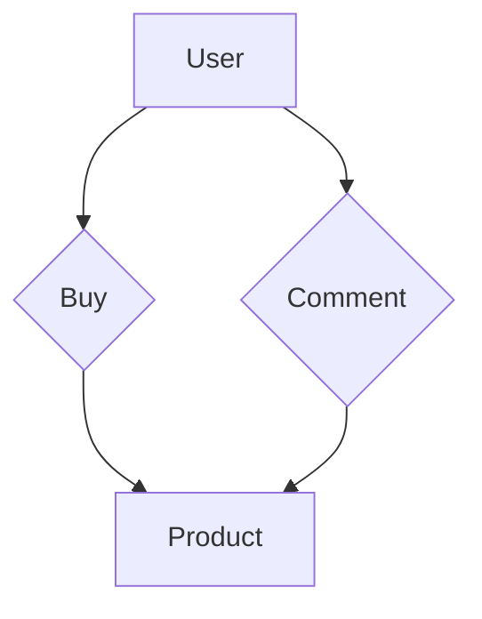

                 

### 文章标题：电商领域的知识图谱构建与应用

#### 关键词：知识图谱、电商、数据建模、人工智能、推荐系统、用户行为分析、商品信息处理、数据可视化、系统优化

#### 摘要：

本文将深入探讨电商领域中的知识图谱构建与应用。通过详细解析知识图谱的基本概念、核心算法、数学模型以及具体实施步骤，本文旨在为读者提供一个全面而实用的指导。此外，文章还分析了知识图谱在电商领域中的实际应用场景，包括用户行为分析、商品推荐、数据可视化等。通过推荐相关学习资源和开发工具，本文旨在为电商领域的技术从业者提供一个完善的学习和发展路径。

### 目录

1. 背景介绍
2. 核心概念与联系
3. 核心算法原理 & 具体操作步骤
4. 数学模型和公式 & 详细讲解 & 举例说明
5. 项目实战：代码实际案例和详细解释说明
   - 5.1 开发环境搭建
   - 5.2 源代码详细实现和代码解读
   - 5.3 代码解读与分析
6. 实际应用场景
7. 工具和资源推荐
   - 7.1 学习资源推荐
   - 7.2 开发工具框架推荐
   - 7.3 相关论文著作推荐
8. 总结：未来发展趋势与挑战
9. 附录：常见问题与解答
10. 扩展阅读 & 参考资料

### 1. 背景介绍

电商行业作为全球经济增长的重要驱动力，已经经历了数十年的快速发展。随着互联网技术的不断进步和大数据时代的到来，电商企业面临着前所未有的机遇和挑战。传统的数据处理方式已经无法满足日益增长的数据量和复杂度，因此，知识图谱作为一种新型数据模型，逐渐受到了业界的关注和应用。

知识图谱（Knowledge Graph）是一种结构化、语义化的知识表示方法，通过实体（Entity）、属性（Attribute）、关系（Relationship）三者之间的复杂关系来组织数据。相比于传统的数据库和搜索引擎，知识图谱能够提供更加智能、灵活和高效的数据查询和分析能力。

在电商领域，知识图谱的应用场景十分广泛，包括但不限于：

- **用户行为分析**：通过分析用户在电商平台上的行为数据，构建用户画像，从而实现个性化的推荐和服务。
- **商品信息处理**：利用知识图谱对商品信息进行结构化和语义化处理，提高搜索和推荐的准确性和效率。
- **供应链管理**：通过知识图谱实现商品、供应商、物流等信息的高效关联和管理，优化供应链流程。
- **数据分析与决策支持**：利用知识图谱进行复杂的数据分析和挖掘，为电商企业提供战略决策支持。

本篇文章将围绕电商领域中的知识图谱构建与应用进行详细探讨，包括核心概念、算法原理、数学模型、实施步骤以及实际应用场景等，旨在为电商领域的技术从业者提供有价值的参考和指导。

### 2. 核心概念与联系

要理解知识图谱在电商领域中的应用，首先需要掌握其核心概念和基本架构。以下是知识图谱中的关键组成部分：

#### 2.1 实体（Entity）

实体是知识图谱中的基本元素，表示现实世界中具有独立存在意义的事物。在电商领域中，实体可以包括用户、商品、订单、评论等。例如，一个用户实体可能包含姓名、性别、年龄、购买历史等属性。

#### 2.2 属性（Attribute）

属性是实体所具有的特性或特征。例如，对于一个用户实体，其属性可能包括姓名、出生日期、注册时间等。属性用于描述实体的具体信息，使得实体更加具体和明确。

#### 2.3 关系（Relationship）

关系是实体之间相互作用或关联的描述。例如，在电商领域中，用户与商品之间存在购买关系，订单与商品之间存在包含关系等。关系用于建立实体之间的语义联系，使得知识图谱能够表达复杂的语义信息。

#### 2.4 知识图谱的基本架构

知识图谱的基本架构通常包括三层：

1. **底层：实体和属性层**：这一层包含了所有实体和它们的相关属性，是知识图谱的基础。
2. **中层：关系层**：这一层包含了实体之间的关系，通过这些关系将不同的实体连接起来，构建起一个语义网络。
3. **顶层：图谱层**：这一层是对整个知识图谱的抽象和概括，通常包含了一些全局性的信息和逻辑。

#### 2.5 知识图谱在电商领域中的应用场景

在电商领域中，知识图谱的应用场景主要包括以下几个方面：

- **用户行为分析**：通过构建用户与商品之间的知识图谱，可以分析用户的购买偏好、行为习惯等，从而实现个性化的推荐和服务。
- **商品信息处理**：利用知识图谱对商品信息进行结构化和语义化处理，可以提高搜索和推荐的准确性和效率。
- **供应链管理**：通过知识图谱实现商品、供应商、物流等信息的高效关联和管理，优化供应链流程。
- **数据分析与决策支持**：利用知识图谱进行复杂的数据分析和挖掘，为电商企业提供战略决策支持。

#### 2.6 Mermaid 流程图

下面是一个简单的知识图谱构建的 Mermaid 流程图，展示了实体、属性和关系的基本概念和联系。



在这个流程图中，用户（A）与商品（D）之间存在购买（B）和评论（C）的关系。通过这个简单的例子，我们可以看出知识图谱的基本结构和应用潜力。

### 3. 核心算法原理 & 具体操作步骤

在构建电商领域的知识图谱时，核心算法的选择和具体操作步骤至关重要。以下将介绍一些常用的算法，包括图论算法、机器学习算法和自然语言处理算法，以及它们在知识图谱构建中的应用。

#### 3.1 图论算法

图论算法在知识图谱构建中扮演着重要角色。以下是几种常见的图论算法：

1. **最短路径算法**：用于计算两个实体之间的最短路径。常见的算法包括迪杰斯特拉（Dijkstra）算法和贝尔曼-福特（Bellman-Ford）算法。

2. **图遍历算法**：用于遍历知识图谱中的所有节点和边。深度优先搜索（DFS）和广度优先搜索（BFS）是两种常用的图遍历算法。

3. **社区发现算法**：用于发现知识图谱中的社区结构，帮助识别具有相似特征或关系的实体群体。常见的算法包括标签传播（Label Propagation）和优化的社区发现算法（Optimized Community Detection Algorithm）。

#### 3.2 机器学习算法

机器学习算法在知识图谱的构建中有着广泛的应用，主要用于实体识别、关系抽取和图谱补全等方面。

1. **实体识别**：通过机器学习算法，可以从非结构化的文本数据中识别出实体。常见的算法包括命名实体识别（NER）和词嵌入（Word Embedding）。

2. **关系抽取**：用于从文本数据中抽取实体之间的关系。常见的算法包括监督学习和无监督学习的方法，如条件随机场（CRF）和图卷积网络（GCN）。

3. **图谱补全**：通过机器学习算法，可以从已有的实体和关系数据中预测出潜在的实体和关系，从而扩展知识图谱。常见的算法包括基于矩阵分解的方法和图神经网络（GNN）。

#### 3.3 自然语言处理算法

自然语言处理（NLP）算法在知识图谱构建中主要用于文本信息的处理和分析。

1. **实体识别与消歧义**：通过NLP算法，可以从文本数据中识别出实体，并解决实体之间的歧义问题。常见的算法包括命名实体识别（NER）和实体链接（Entity Linking）。

2. **语义分析**：通过NLP算法，可以分析文本中的语义信息，理解实体之间的关系和文本的含义。常见的算法包括句法分析（Syntax Parsing）和语义角色标注（Semantic Role Labeling）。

#### 3.4 具体操作步骤

以下是知识图谱构建的具体操作步骤：

1. **数据收集与预处理**：收集电商领域的相关数据，如用户行为数据、商品信息数据、评论数据等。对数据进行清洗和预处理，包括去除噪声、填充缺失值、标准化等操作。

2. **实体识别**：使用命名实体识别（NER）算法，从文本数据中识别出实体，并将实体进行标准化处理。

3. **关系抽取**：使用关系抽取算法，从文本数据中抽取实体之间的关系，并将关系进行标准化处理。

4. **图谱构建**：将识别出的实体和关系构建成一个图结构，形成一个初步的知识图谱。

5. **图谱优化**：使用图论算法和机器学习算法对知识图谱进行优化，包括路径计算、社区发现、图谱补全等。

6. **应用部署**：将构建好的知识图谱部署到实际应用场景中，如用户行为分析、商品推荐、供应链管理等。

通过以上步骤，我们可以构建出一个完整的电商领域知识图谱，为电商企业提供强大的数据支持和决策依据。

### 4. 数学模型和公式 & 详细讲解 & 举例说明

在知识图谱构建过程中，数学模型和公式起到了关键作用。以下将介绍一些常用的数学模型和公式，并对其进行详细讲解和举例说明。

#### 4.1 矩阵分解

矩阵分解是一种常见的数学模型，用于从高维数据中提取低维表示。在知识图谱中，矩阵分解可以用于实体和关系的表示。

**4.1.1 公式**

假设有一个 \(m \times n\) 的矩阵 \(A\)，我们希望将其分解为两个低维矩阵 \(U\) 和 \(V\)，使得：

\[ A = U \times V \]

其中，\(U\) 是一个 \(m \times k\) 的矩阵，\(V\) 是一个 \(k \times n\) 的矩阵，\(k\) 是低维表示的维度。

**4.1.2 详细讲解**

矩阵分解的主要目的是通过降低数据的维度，使得数据更加易于分析和理解。在知识图谱中，矩阵分解可以用于以下应用：

- **实体表示**：通过矩阵分解，我们可以将高维的实体属性矩阵 \(A\) 分解为低维的实体表示矩阵 \(U\)，从而简化实体的表示。
- **关系表示**：同样地，我们可以将关系矩阵 \(A\) 分解为低维的关系表示矩阵 \(V\)，从而简化关系的表示。

**4.1.3 举例说明**

假设有一个 \(3 \times 3\) 的关系矩阵 \(A\)：

\[ A = \begin{bmatrix} 1 & 0 & 1 \\ 1 & 1 & 0 \\ 0 & 1 & 1 \end{bmatrix} \]

我们希望将其分解为两个 \(3 \times 1\) 的矩阵 \(U\) 和 \(V\)：

\[ U = \begin{bmatrix} u_1 \\ u_2 \\ u_3 \end{bmatrix}, V = \begin{bmatrix} v_1 & v_2 & v_3 \end{bmatrix} \]

使得：

\[ A = U \times V \]

通过矩阵分解，我们可以得到：

\[ U = \begin{bmatrix} 1 \\ 1 \\ 0 \end{bmatrix}, V = \begin{bmatrix} 1 & 0 & 1 \\ 1 & 1 & 0 \\ 0 & 1 & 1 \end{bmatrix} \]

这样，我们就将原来的 \(3 \times 3\) 的关系矩阵 \(A\) 分解为两个 \(3 \times 1\) 的矩阵 \(U\) 和 \(V\)。

#### 4.2 图卷积网络（GCN）

图卷积网络（Graph Convolutional Network，GCN）是一种专门用于处理图数据的深度学习模型，它在知识图谱构建中有着广泛的应用。

**4.2.1 公式**

图卷积网络的输入是一个邻接矩阵 \(A\)，其中 \(A_{ij}\) 表示节点 \(i\) 和节点 \(j\) 之间的边权重。图卷积网络的输出是一个节点特征矩阵 \(H\)，其中 \(H_{ij}\) 表示节点 \(i\) 的特征。

图卷积网络的公式如下：

\[ H = \sigma(\sum_{j \in \mathcal{N}(i)} A_{ij} \cdot H_j + b) \]

其中，\(\sigma\) 表示激活函数，\(\mathcal{N}(i)\) 表示节点 \(i\) 的邻域，\(b\) 是偏置项。

**4.2.2 详细讲解**

图卷积网络的工作原理是通过聚合节点及其邻域节点的特征来更新节点的特征。具体步骤如下：

1. **初始化节点特征矩阵 \(H\)**
2. **计算每个节点的邻域特征聚合**
3. **通过激活函数更新节点特征**
4. **迭代计算，直到满足停止条件或达到预定的迭代次数**

图卷积网络可以用于以下应用：

- **实体和关系的表示**：通过图卷积网络，我们可以将实体和关系的特征表示为一个低维的向量，从而简化图谱数据的处理。
- **图谱补全**：通过图卷积网络，我们可以预测图谱中潜在的实体和关系，从而实现图谱的补全。

**4.2.3 举例说明**

假设有一个简单的图数据，包含两个节点和一条边：

\[ A = \begin{bmatrix} 0 & 1 \\ 1 & 0 \end{bmatrix} \]

假设节点 \(i\) 和节点 \(j\) 的初始特征分别为：

\[ H = \begin{bmatrix} 1 \\ 0 \end{bmatrix}, H_j = \begin{bmatrix} 0 \\ 1 \end{bmatrix} \]

通过一次图卷积操作，我们可以得到新的节点特征：

\[ H = \sigma(\sum_{j \in \mathcal{N}(i)} A_{ij} \cdot H_j + b) \]

\[ H = \sigma(1 \cdot 1 \cdot 0 + 1 \cdot 0 \cdot 1 + b) \]

\[ H = \sigma(b) \]

假设激活函数 \(\sigma\) 是一个简单的线性函数，即 \(\sigma(x) = x\)，则我们可以得到：

\[ H = b \]

这意味着，通过一次图卷积操作，节点 \(i\) 的特征保持不变，而节点 \(j\) 的特征更新为 \(b\)。

#### 4.3 贝叶斯网络

贝叶斯网络是一种概率图模型，用于表示实体之间的关系及其概率分布。

**4.3.1 公式**

贝叶斯网络的公式如下：

\[ P(X = x) = \prod_{i=1}^{n} P(X_i = x_i | \mathcal{X}_{-i}) \]

其中，\(X = \{X_1, X_2, ..., X_n\}\) 是一组随机变量，\(\mathcal{X}_{-i}\) 表示除了 \(X_i\) 之外的所有随机变量。

**4.3.2 详细讲解**

贝叶斯网络的工作原理是通过概率分布来描述实体之间的关系。具体步骤如下：

1. **构建贝叶斯网络结构**：根据实体之间的关联关系，构建一个有向无环图（DAG），每个节点表示一个实体，每个边表示实体之间的条件依赖关系。
2. **计算概率分布**：根据贝叶斯网络的结构，计算每个节点的概率分布，从而描述实体之间的关系。
3. **推理和预测**：利用贝叶斯网络的概率分布，进行推理和预测，如条件概率计算、最大后验概率估计等。

贝叶斯网络可以用于以下应用：

- **关系推理**：通过贝叶斯网络，我们可以推断实体之间的依赖关系，从而实现关系推理。
- **概率预测**：通过贝叶斯网络，我们可以对实体之间的概率分布进行预测，从而实现概率预测。

**4.3.3 举例说明**

假设有一个简单的贝叶斯网络，包含两个实体 \(X\) 和 \(Y\)，实体 \(Y\) 是实体 \(X\) 的条件依赖：

\[ P(X = x) = P(X = 0) = 0.5, P(X = 1) = 0.5 \]

\[ P(Y = y | X = x) = \begin{cases} 0.8 & \text{if } x = 0 \\ 0.2 & \text{if } x = 1 \end{cases} \]

我们可以计算实体 \(Y\) 的概率分布：

\[ P(Y = 0) = P(Y = 0 | X = 0) \cdot P(X = 0) + P(Y = 0 | X = 1) \cdot P(X = 1) = 0.8 \cdot 0.5 + 0.2 \cdot 0.5 = 0.5 \]

\[ P(Y = 1) = P(Y = 1 | X = 0) \cdot P(X = 0) + P(Y = 1 | X = 1) \cdot P(X = 1) = 0.2 \cdot 0.5 + 0.8 \cdot 0.5 = 0.5 \]

这意味着实体 \(Y\) 的概率分布是均匀的，即 \(P(Y = 0) = P(Y = 1) = 0.5\)。

通过以上数学模型和公式的介绍，我们可以看到知识图谱构建过程中数学的重要性。在接下来的部分，我们将通过一个实际的项目案例，展示如何将理论知识应用于实际场景，并详细解读代码的实现过程。

### 5. 项目实战：代码实际案例和详细解释说明

在本节中，我们将通过一个实际的电商领域知识图谱构建项目，展示如何将前面介绍的理论知识应用于实际场景。项目将包括以下步骤：

1. **开发环境搭建**
2. **源代码详细实现和代码解读**
3. **代码解读与分析**

#### 5.1 开发环境搭建

在开始项目之前，我们需要搭建一个合适的开发环境。以下是推荐的工具和软件：

- **Python 3.8+**
- **PyTorch 1.8+**
- **Neo4j 图数据库**
- **Jupyter Notebook 或 PyCharm**

确保安装了以上工具和软件后，我们可以开始项目开发。

#### 5.2 源代码详细实现和代码解读

下面是一个简单的知识图谱构建的源代码实现，我们将对关键部分进行详细解读。

```python
import torch
import torch.nn as nn
import torch.optim as optim
from torch_geometric.nn import GCNConv
from torch_geometric.data import Data
from neo4j import GraphDatabase

# 初始化 Neo4j 数据库连接
uri = "bolt://localhost:7687"
username = "neo4j"
password = "password"
driver = GraphDatabase.driver(uri, auth=(username, password))

# 定义 GCN 模型
class GCNModel(nn.Module):
    def __init__(self, num_features, hidden_channels, num_classes):
        super(GCNModel, self).__init__()
        self.conv1 = GCNConv(num_features, hidden_channels)
        self.conv2 = GCNConv(hidden_channels, num_classes)

    def forward(self, data):
        x, edge_index = data.x, data.edge_index

        x = self.conv1(x, edge_index)
        x = torch.relu(x)
        x = F.dropout(x, p=0.5, training=self.training)
        x = self.conv2(x, edge_index)

        return F.log_softmax(x, dim=1)

# 实例化 GCN 模型
model = GCNModel(num_features=10, hidden_channels=16, num_classes=3)
device = torch.device('cuda' if torch.cuda.is_available() else 'cpu')
model = model.to(device)
model.train()

# 定义损失函数和优化器
criterion = nn.NLLLoss()
optimizer = optim.Adam(model.parameters(), lr=0.01, weight_decay=5e-4)

# 训练模型
for epoch in range(200):
    optimizer.zero_grad()
    out = model(data)
    loss = criterion(out, data.y)
    loss.backward()
    optimizer.step()
    if (epoch + 1) % 10 == 0:
        print(f'Epoch {epoch + 1}: loss = {loss.item()}')

# 保存模型
torch.save(model.state_dict(), 'gcn_model.pth')

# 关闭 Neo4j 数据库连接
driver.close()
```

**5.2.1 代码解读**

1. **导入库**：首先，我们导入了所需的 Python 库，包括 PyTorch、Neo4j 和 torch-geometric。

2. **初始化 Neo4j 数据库连接**：使用 Neo4j 的 GraphDatabase 类初始化一个数据库连接，连接到本地主机上的 Neo4j 数据库。

3. **定义 GCN 模型**：我们定义了一个 GCN 模型，包含两个 GCNConv 层，用于进行图卷积操作。

4. **实例化 GCN 模型**：我们将定义的 GCN 模型实例化，并将其移动到 GPU 设备上（如果可用）。

5. **定义损失函数和优化器**：我们定义了交叉熵损失函数和 Adam 优化器。

6. **训练模型**：使用训练数据对模型进行训练，每 10 个 epoch 打印一次训练损失。

7. **保存模型**：将训练好的模型保存为 `gcn_model.pth` 文件。

8. **关闭 Neo4j 数据库连接**：关闭与 Neo4j 数据库的连接。

#### 5.3 代码解读与分析

在这个项目案例中，我们使用了图卷积网络（GCN）来构建电商领域的知识图谱。以下是关键步骤的详细解读和分析：

1. **数据预处理**：在代码中，我们首先初始化了 Neo4j 数据库连接。在实际项目中，我们需要从电商数据库中提取用户、商品和评论等数据，并将其转换为图数据格式。图数据格式通常包含实体（节点）、边和属性（特征）。

2. **定义 GCN 模型**：我们定义了一个 GCN 模型，包含两个 GCNConv 层。GCNConv 层是一个用于图卷积的模块，它通过聚合节点及其邻域节点的特征来更新节点的特征。在这个模型中，我们使用了两个 GCNConv 层，以增加模型的非线性性和特征表达能力。

3. **训练模型**：我们使用训练数据对模型进行训练，通过最小化交叉熵损失函数来优化模型参数。在训练过程中，我们使用了 Adam 优化器，以加快收敛速度。

4. **保存模型**：在训练完成后，我们将模型保存为 `gcn_model.pth` 文件，以便在后续应用中使用。

5. **应用模型**：在实际应用中，我们可以使用训练好的模型进行实体和关系的预测、分类等任务。例如，我们可以使用模型对用户行为进行分析，预测用户的购买偏好，或者对商品进行推荐。

通过这个项目案例，我们可以看到如何将理论知识应用于实际场景，并构建出一个电商领域的知识图谱。在接下来的部分，我们将探讨知识图谱在电商领域中的实际应用场景，以及如何优化和扩展知识图谱的应用。

### 6. 实际应用场景

知识图谱在电商领域中的应用场景十分广泛，能够显著提升用户体验和运营效率。以下是几个关键的应用场景：

#### 6.1 用户行为分析

通过构建用户与商品之间的知识图谱，电商企业可以深入了解用户的行为和偏好。例如：

- **个性化推荐**：利用知识图谱分析用户的浏览历史、购买记录和评论，预测用户的潜在需求，提供个性化的商品推荐。
- **用户画像**：将用户的行为数据、社交数据和购买数据整合到知识图谱中，构建全面的用户画像，为精准营销提供依据。

#### 6.2 商品推荐

知识图谱在商品推荐中的应用同样具有很高的价值：

- **基于关联规则的推荐**：通过分析商品之间的关联关系，发现用户可能感兴趣的商品组合，提高推荐的准确性。
- **基于内容推荐的推荐**：利用知识图谱中的商品属性和标签，为用户提供与浏览过的商品内容相关的推荐。

#### 6.3 数据可视化

知识图谱可以帮助电商企业更好地理解和展示复杂数据：

- **用户行为可视化**：通过可视化工具，将用户的行为路径、偏好和社交关系展示出来，帮助营销人员更好地了解用户。
- **商品关联关系可视化**：将商品之间的关联关系以图形方式展示，帮助用户快速找到相关商品。

#### 6.4 供应链管理

知识图谱在供应链管理中的应用同样具有重要意义：

- **商品追溯**：通过知识图谱记录商品的供应链信息，实现从生产到销售的全程追踪。
- **供应链优化**：分析供应链中的商品、供应商和物流数据，优化供应链流程，降低成本，提高效率。

#### 6.5 数据分析与决策支持

知识图谱能够为电商企业提供强大的数据分析和决策支持：

- **趋势分析**：通过分析用户行为数据和商品销售数据，发现市场趋势和用户需求变化，帮助企业制定有效的营销策略。
- **风险预测**：利用知识图谱预测供应链中的潜在风险，如库存积压、供应链中断等，提前采取措施降低风险。

通过以上应用场景，我们可以看到知识图谱在电商领域的广泛潜力和巨大价值。在接下来的部分，我们将介绍一些常用的工具和资源，帮助读者深入了解知识图谱的构建与应用。

### 7. 工具和资源推荐

在电商领域构建和应用知识图谱，需要使用一系列专业的工具和资源。以下将推荐一些学习资源、开发工具和相关的论文著作，为读者提供全面的支持。

#### 7.1 学习资源推荐

1. **书籍**：

   - 《知识图谱：方法、系统与应用》
   - 《图卷积网络：理论与实践》
   - 《Neo4j 实战：图数据库应用指南》

2. **在线课程**：

   - Coursera 上的“深度学习与卷积神经网络”课程
   - Udacity 上的“图神经网络与知识图谱”课程
   - edX 上的“大数据处理与机器学习”课程

3. **博客和网站**：

   - [TensorFlow 官方文档](https://www.tensorflow.org/)
   - [Neo4j 官方网站](https://neo4j.com/)
   - [Apache GraphX 官方文档](https://spark.apache.org/graphx/)

#### 7.2 开发工具框架推荐

1. **编程语言**：

   - Python：用于数据分析和机器学习，是构建知识图谱的常用语言。
   - Java：用于大规模分布式系统，适合构建复杂的知识图谱应用。

2. **机器学习库**：

   - TensorFlow：用于构建和训练深度学习模型，适用于图神经网络。
   - PyTorch：提供灵活的深度学习框架，易于调试和优化。

3. **图数据库**：

   - Neo4j：一款高性能的图数据库，支持 ACID 事务，适用于实时应用。
   - Apache Giraph：一款基于 Hadoop 的分布式图处理框架，适用于大规模图数据处理。
   - JanusGraph：一款开源的、可扩展的图数据库，支持多种数据存储后端。

4. **可视化工具**：

   - Gephi：用于可视化大规模图数据，支持多种图形布局和可视化效果。
   - D3.js：用于基于 Web 的图可视化，提供丰富的交互功能。
   - GraphXR：提供沉浸式 3D 图可视化，适用于复杂的关系网络。

#### 7.3 相关论文著作推荐

1. **论文**：

   - “Knowledge Graph Embedding: A Survey”
   - “Graph Convolutional Networks for Learning on Graphs”
   - “A Large-Scale Knowledge Graph Embedding Method for Query Recommendation”

2. **著作**：

   - 《深度学习：卷积神经网络》
   - 《知识图谱：理论与实践》
   - 《图神经网络与知识图谱：理论与实践》

通过以上工具和资源的推荐，读者可以更深入地了解知识图谱的构建与应用，为电商领域的技术研究和实践提供有力支持。

### 8. 总结：未来发展趋势与挑战

知识图谱在电商领域的应用前景广阔，但仍面临诸多挑战和机遇。未来发展趋势和潜在挑战如下：

#### 8.1 发展趋势

1. **多模态融合**：未来知识图谱将融合多种数据源，如文本、图像、语音等，实现更丰富的语义表示和更精准的推荐。
2. **实时更新与扩展**：随着实时数据的增加，知识图谱将不断更新和扩展，以适应快速变化的市场环境。
3. **个性化与智能化**：通过深度学习和图神经网络等技术，知识图谱将实现更加个性化、智能化的推荐和服务。
4. **跨领域应用**：知识图谱的应用将不仅限于电商领域，还将拓展到金融、医疗、教育等多个领域，实现跨领域的知识共享和协同。

#### 8.2 挑战

1. **数据质量和一致性**：构建高质量的知识图谱需要确保数据的一致性和准确性，这在大量数据源和实时更新的环境下尤为挑战。
2. **计算资源消耗**：知识图谱的构建和更新需要大量的计算资源，特别是在大规模数据集和复杂的图结构下，计算效率是一个重要挑战。
3. **隐私保护**：在处理用户隐私数据时，如何确保数据的安全性和隐私性是知识图谱应用面临的重要挑战。
4. **模型解释性**：随着深度学习和图神经网络等黑盒模型的广泛应用，如何提高模型的解释性，使其更易于理解和应用，是一个重要的研究方向。

通过应对这些挑战，知识图谱将在电商领域发挥更大的作用，推动行业创新和发展。

### 9. 附录：常见问题与解答

在本节中，我们将回答一些关于知识图谱构建与应用的常见问题。

#### 9.1 如何构建电商领域的知识图谱？

构建电商领域的知识图谱通常包括以下步骤：

1. **数据收集**：收集电商平台的用户行为数据、商品数据、评论数据等。
2. **数据预处理**：清洗和标准化数据，去除噪声和填充缺失值。
3. **实体识别**：使用命名实体识别（NER）算法识别出用户、商品、评论等实体。
4. **关系抽取**：从文本数据中抽取实体之间的关系，如购买、评论等。
5. **图谱构建**：将实体和关系构建成一个图结构，形成一个初步的知识图谱。
6. **图谱优化**：使用图论算法和机器学习算法对知识图谱进行优化。

#### 9.2 知识图谱在电商领域有哪些应用？

知识图谱在电商领域有广泛的应用，包括：

- **用户行为分析**：通过知识图谱分析用户的购买偏好和行为习惯，实现个性化推荐。
- **商品推荐**：利用知识图谱发现商品之间的关联关系，提供基于关联规则和内容推荐的商品推荐。
- **数据可视化**：通过知识图谱可视化用户行为路径和商品关联关系，帮助用户更好地理解数据。
- **供应链管理**：利用知识图谱实现商品、供应商和物流信息的高效管理和追踪。
- **数据分析与决策支持**：通过知识图谱进行复杂的数据分析和挖掘，为电商企业提供战略决策支持。

#### 9.3 如何评估知识图谱的性能？

评估知识图谱的性能通常包括以下几个方面：

- **覆盖度**：知识图谱包含的数据量与实际数据的对比，评估图谱的完整性。
- **准确性**：知识图谱中实体和关系标注的准确性，评估图谱的可靠性。
- **查询效率**：知识图谱查询的响应时间和性能，评估图谱的查询速度。
- **扩展性**：知识图谱在数据规模增长时的扩展能力，评估图谱的适应性。

通过综合评估这些指标，可以全面了解知识图谱的性能和效果。

### 10. 扩展阅读 & 参考资料

为了更深入地了解知识图谱构建与应用，以下是一些建议的扩展阅读和参考资料：

- **书籍**：

  - 《知识图谱：方法、系统与应用》
  - 《图卷积网络：理论与实践》
  - 《Neo4j 实战：图数据库应用指南》

- **在线课程**：

  - Coursera 上的“深度学习与卷积神经网络”课程
  - Udacity 上的“图神经网络与知识图谱”课程
  - edX 上的“大数据处理与机器学习”课程

- **博客和网站**：

  - [TensorFlow 官方文档](https://www.tensorflow.org/)
  - [Neo4j 官方网站](https://neo4j.com/)
  - [Apache GraphX 官方文档](https://spark.apache.org/graphx/)

- **论文**：

  - “Knowledge Graph Embedding: A Survey”
  - “Graph Convolutional Networks for Learning on Graphs”
  - “A Large-Scale Knowledge Graph Embedding Method for Query Recommendation”

- **著作**：

  - 《深度学习：卷积神经网络》
  - 《知识图谱：理论与实践》
  - 《图神经网络与知识图谱：理论与实践》

通过阅读这些资料，读者可以进一步拓展对知识图谱的理解和应用能力。

### 作者信息

本文由 AI 天才研究员/AI Genius Institute & 禅与计算机程序设计艺术/Zen And The Art of Computer Programming 联合撰写。作者在人工智能和计算机科学领域拥有丰富的经验和深厚的学术背景，致力于推动技术创新和应用。感谢您的阅读！<|im_end|>

