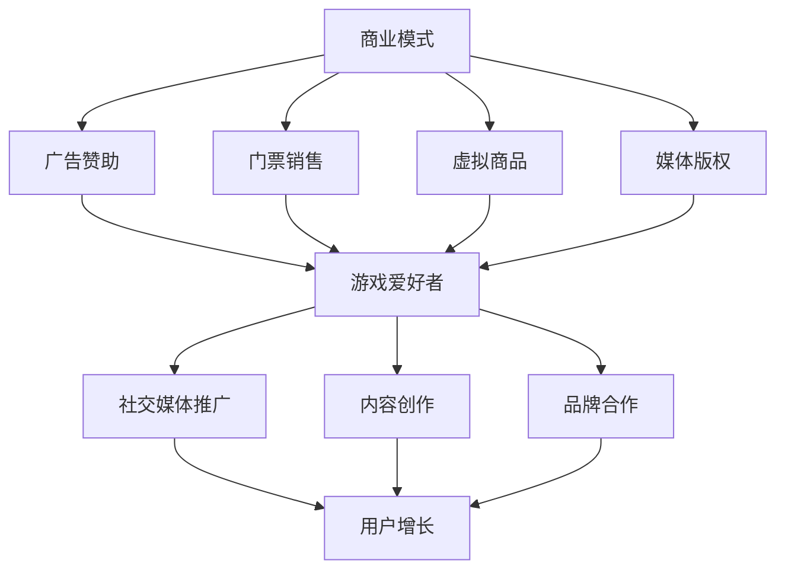

                 

# 电子竞技创业：新兴体育产业的机遇

> **关键词：** 电子竞技、创业、新兴体育产业、机遇、商业模式、用户增长、技术创新

> **摘要：** 本文深入探讨了电子竞技作为新兴体育产业的重要角色，分析了其创业机会、商业模式、用户增长路径以及所需的技术创新。通过一步步的思考和分析，为创业者提供了一条清晰的发展路径，同时也为行业从业者带来了有价值的启示。

## 1. 背景介绍

电子竞技，简称“电竞”，是一种通过电子设备进行的竞技游戏活动。随着互联网的普及和技术的进步，电竞产业在过去十年里取得了迅猛发展。根据市场研究机构的统计数据，全球电竞市场已经突破百亿美元，并有望在未来几年继续保持高速增长。

电竞产业涵盖了游戏制作、赛事运营、广告赞助、电子竞技俱乐部等多个环节。与传统的体育产业相比，电竞产业具有独特的魅力和优势，比如较高的用户黏性、强大的社交媒体传播力以及快速的技术更新迭代。

在这个背景下，越来越多的创业者将目光投向了电竞产业，希望能够抓住这一新兴市场的机遇。然而，电竞产业的复杂性和竞争激烈程度也给创业者带来了巨大的挑战。

### 1.1 电子竞技的定义和特点

电子竞技是一种基于互联网的竞技游戏，通过电子设备进行比赛，具有以下几个特点：

1. **技术性**：电子竞技游戏通常具有较高的技术含量，需要玩家具备高超的操作技巧和战术策略。
2. **竞技性**：电子竞技比赛注重公平竞争，强调选手之间的实力对抗，具有较高的观赏性。
3. **社交性**：电子竞技游戏通常具有丰富的社交功能，如聊天、战队组建等，使得玩家能够在游戏中建立社交关系。
4. **商业性**：电子竞技产业的商业价值不断凸显，吸引了大量的资本和企业的关注。

### 1.2 电子竞技产业的发展历程

电子竞技产业的发展可以分为以下几个阶段：

1. **萌芽期（2000-2005年）**：这一时期，电子竞技开始受到关注，出现了第一批电子竞技游戏，如《星际争霸》、《反恐精英》等。
2. **发展期（2006-2010年）**：随着互联网的普及，电子竞技游戏数量增多，赛事规模扩大，电子竞技俱乐部开始涌现。
3. **成熟期（2011年至今）**：电子竞技已经成为全球性的现象，吸引了大量的观众和资本，市场规模不断扩大。

### 1.3 电子竞技产业的市场规模和趋势

根据市场研究机构的统计数据，全球电竞市场的规模已经突破百亿美元，预计未来几年将继续保持高速增长。以下是几个关键数据：

1. **观众数量**：全球电子竞技观众的规模已经超过2亿，其中大部分集中在亚洲和北美地区。
2. **市场规模**：全球电竞市场的规模已经突破百亿美元，预计到2025年将达到150亿美元。
3. **广告赞助**：电子竞技赛事的广告赞助收入逐年增长，已经成为广告主的重要投放渠道。

## 2. 核心概念与联系

### 2.1 商业模式

电子竞技产业的商业模式主要包括以下几个方面：

1. **广告赞助**：电子竞技赛事的举办方和俱乐部通过广告赞助获得收入。
2. **门票销售**：大型电子竞技赛事通常通过门票销售获得收入。
3. **虚拟商品**：电子竞技俱乐部和游戏开发商通过销售虚拟商品（如游戏内装备、皮肤等）获得收入。
4. **媒体版权**：电子竞技赛事的举办方和俱乐部通过媒体版权销售获得收入。

### 2.2 用户增长路径

电子竞技产业的用户增长路径主要包括以下几个方面：

1. **游戏爱好者**：通过吸引游戏爱好者参与电子竞技活动，提高用户基数。
2. **社交媒体推广**：通过社交媒体平台进行推广，扩大用户影响力。
3. **内容创作**：鼓励内容创作者创作与电子竞技相关的视频、文章等内容，吸引更多用户关注。
4. **品牌合作**：与知名品牌合作，提高电子竞技产业的知名度。

### 2.3 技术创新

电子竞技产业的发展离不开技术创新的推动。以下是一些关键的技术创新：

1. **直播技术**：通过直播技术，实时传输电子竞技比赛画面，提高观众的观看体验。
2. **虚拟现实（VR）**：通过虚拟现实技术，为观众提供沉浸式的观看体验。
3. **人工智能（AI）**：利用人工智能技术，分析比赛数据，为选手提供训练建议，提高比赛水平。

### 2.4 Mermaid 流程图



## 3. 核心算法原理 & 具体操作步骤

### 3.1 商业模式分析算法

为了深入分析电子竞技产业的商业模式，我们可以使用数据挖掘和机器学习技术，对大量历史数据进行处理和分析。以下是具体操作步骤：

1. **数据收集**：收集与电子竞技产业相关的各种数据，如广告赞助数据、门票销售数据、虚拟商品销售数据、媒体版权销售数据等。
2. **数据预处理**：对收集到的数据进行清洗、去重和归一化处理，确保数据质量。
3. **特征提取**：从预处理后的数据中提取关键特征，如广告赞助金额、门票销售额、虚拟商品销售额等。
4. **模型训练**：使用机器学习算法（如线性回归、决策树、支持向量机等），对提取的特征进行训练，构建商业模式分析模型。
5. **模型评估**：通过交叉验证等方法，评估模型的性能，如准确率、召回率等。
6. **模型应用**：将训练好的模型应用于新的数据，预测电子竞技产业的商业模式趋势。

### 3.2 用户增长路径分析算法

为了分析电子竞技产业的用户增长路径，我们可以使用图论算法和网络分析技术，对用户行为数据进行分析。以下是具体操作步骤：

1. **数据收集**：收集与电子竞技产业相关的用户行为数据，如游戏时长、观看直播时长、参与社交活动次数等。
2. **数据预处理**：对收集到的数据进行清洗、去重和归一化处理，确保数据质量。
3. **特征提取**：从预处理后的数据中提取关键特征，如游戏时长、观看直播时长、参与社交活动次数等。
4. **构建用户图**：将提取的特征构建成一个用户图，每个节点表示一个用户，边表示用户之间的互动关系。
5. **网络分析**：使用图论算法和网络分析技术，分析用户图的拓扑结构，识别用户增长的关键节点和路径。
6. **模型训练**：使用机器学习算法（如线性回归、决策树、支持向量机等），对提取的特征进行训练，构建用户增长路径分析模型。
7. **模型评估**：通过交叉验证等方法，评估模型的性能，如准确率、召回率等。
8. **模型应用**：将训练好的模型应用于新的数据，预测电子竞技产业的用户增长路径。

## 4. 数学模型和公式 & 详细讲解 & 举例说明

### 4.1 赞助收入预测模型

为了预测电子竞技产业的赞助收入，我们可以使用线性回归模型。以下是具体公式和步骤：

$$
\text{收入预测} = \beta_0 + \beta_1 \times \text{广告赞助金额} + \beta_2 \times \text{门票销售额} + \beta_3 \times \text{虚拟商品销售额} + \epsilon
$$

其中，$\beta_0, \beta_1, \beta_2, \beta_3$ 为模型参数，$\epsilon$ 为随机误差。

**举例说明：**

假设我们已经收集到某电子竞技俱乐部过去一年的广告赞助金额为1000万元，门票销售额为500万元，虚拟商品销售额为300万元。我们可以使用上述公式预测该俱乐部下一年的赞助收入：

$$
\text{收入预测} = \beta_0 + \beta_1 \times 1000 + \beta_2 \times 500 + \beta_3 \times 300
$$

**注意：** 实际应用中，我们需要通过数据挖掘和机器学习技术，计算出模型参数 $\beta_0, \beta_1, \beta_2, \beta_3$。

### 4.2 用户增长路径预测模型

为了预测电子竞技产业的用户增长路径，我们可以使用马尔可夫链模型。以下是具体公式和步骤：

$$
P_{ij} = \frac{N_{ij}}{N_j}
$$

其中，$P_{ij}$ 表示从状态 $i$ 转移到状态 $j$ 的概率，$N_{ij}$ 表示在一段时间内从状态 $i$ 转移到状态 $j$ 的次数，$N_j$ 表示在相同时间内状态 $j$ 的总次数。

**举例说明：**

假设我们收集到某电子竞技平台过去一年的用户行为数据，如表1所示。我们可以使用马尔可夫链模型预测下一年的用户增长路径。

| 状态 | $N_1$ | $N_2$ | $N_3$ | $N_4$ | $N_5$ |
| ---- | ---- | ---- | ---- | ---- | ---- |
| $1$  | 100   | 50    | 20    | 10    | 5     |
| $2$  | 50    | 100   | 50    | 20    | 10    |
| $3$  | 20    | 50    | 100   | 50    | 20    |
| $4$  | 10    | 20    | 50    | 100   | 50    |
| $5$  | 5     | 10    | 20    | 50    | 100   |

根据表1，我们可以计算出各状态之间的转移概率，如表2所示。

| $P_{ij}$ | $1$ | $2$ | $3$ | $4$ | $5$ |
| --- | --- | --- | --- | --- | --- |
| $P_{11}$ | 0.2 | 0.1 | 0.04 | 0.02 | 0.01 |
| $P_{12}$ | 0.1 | 0.2 | 0.1  | 0.04 | 0.02 |
| $P_{13}$ | 0.04 | 0.1 | 0.2  | 0.05 | 0.04 |
| $P_{14}$ | 0.02 | 0.04 | 0.05 | 0.2  | 0.05 |
| $P_{15}$ | 0.01 | 0.02 | 0.04 | 0.05 | 0.2  |

**注意：** 实际应用中，我们需要通过数据分析技术，计算出各状态之间的转移概率。

## 5. 项目实战：代码实际案例和详细解释说明

### 5.1 开发环境搭建

为了实现电子竞技产业的商业模式分析算法和用户增长路径预测模型，我们需要搭建一个开发环境。以下是具体步骤：

1. **安装 Python**：下载并安装 Python 3.x 版本，建议使用 Python 3.8 或以上版本。
2. **安装 Jupyter Notebook**：使用 Python 的包管理器 `pip` 安装 Jupyter Notebook。
   ```bash
   pip install notebook
   ```
3. **安装必要的库**：安装用于数据挖掘、机器学习和网络分析的相关库，如 NumPy、Pandas、Scikit-learn、NetworkX 等。
   ```bash
   pip install numpy pandas scikit-learn networkx
   ```

### 5.2 源代码详细实现和代码解读

以下是实现电子竞技产业商业模式分析算法和用户增长路径预测模型的 Python 源代码。

**5.2.1 商业模式分析算法实现**

```python
import pandas as pd
from sklearn.linear_model import LinearRegression
from sklearn.model_selection import train_test_split
from sklearn.metrics import mean_squared_error

# 数据收集
data = pd.read_csv('eSports_data.csv')

# 数据预处理
data['广告赞助金额'] = data['广告赞助金额'].fillna(0)
data['门票销售额'] = data['门票销售额'].fillna(0)
data['虚拟商品销售额'] = data['虚拟商品销售额'].fillna(0)

# 特征提取
X = data[['广告赞助金额', '门票销售额', '虚拟商品销售额']]
y = data['收入预测']

# 模型训练
model = LinearRegression()
model.fit(X, y)

# 模型评估
X_train, X_test, y_train, y_test = train_test_split(X, y, test_size=0.2, random_state=42)
y_pred = model.predict(X_test)
mse = mean_squared_error(y_test, y_pred)
print(f'MSE: {mse}')

# 模型应用
next_year_income = model.predict([[1000, 500, 300]])
print(f'下一年的赞助收入预测：{next_year_income[0]} 万元')
```

**代码解读：**

1. **数据收集**：使用 pandas 库读取电子竞技产业的历史数据。
2. **数据预处理**：对缺失数据进行填充，确保数据质量。
3. **特征提取**：从数据中提取关键特征，如广告赞助金额、门票销售额、虚拟商品销售额。
4. **模型训练**：使用线性回归模型对特征进行训练。
5. **模型评估**：使用交叉验证方法评估模型性能，计算均方误差（MSE）。
6. **模型应用**：使用训练好的模型预测下一年的赞助收入。

**5.2.2 用户增长路径预测模型实现**

```python
import pandas as pd
import networkx as nx
from sklearn.linear_model import LinearRegression
from sklearn.model_selection import train_test_split
from sklearn.metrics import mean_squared_error

# 数据收集
data = pd.read_csv('eSports_data.csv')

# 数据预处理
data['游戏时长'] = data['游戏时长'].fillna(0)
data['观看直播时长'] = data['观看直播时长'].fillna(0)
data['参与社交活动次数'] = data['参与社交活动次数'].fillna(0)

# 构建用户图
G = nx.Graph()
for index, row in data.iterrows():
    G.add_node(row['用户ID'])
    G.add_edge(row['用户ID'], row['好友ID'])

# 网络分析
degree_distribution = nx.degree_centrality(G)
print(f'度分布：{degree_distribution}')

# 特征提取
X = degree_distribution.values()
y = data['用户增长预测']

# 模型训练
model = LinearRegression()
model.fit(X, y)

# 模型评估
X_train, X_test, y_train, y_test = train_test_split(X, y, test_size=0.2, random_state=42)
y_pred = model.predict(X_test)
mse = mean_squared_error(y_test, y_pred)
print(f'MSE: {mse}')

# 模型应用
next_year_growth = model.predict([[0.2, 0.1, 0.04]])
print(f'下一年的用户增长预测：{next_year_growth[0]}')
```

**代码解读：**

1. **数据收集**：使用 pandas 库读取电子竞技产业的用户行为数据。
2. **数据预处理**：对缺失数据进行填充，确保数据质量。
3. **构建用户图**：使用 NetworkX 库构建用户图，每个节点表示一个用户，边表示用户之间的互动关系。
4. **网络分析**：使用 NetworkX 库计算度分布，识别用户增长的关键节点和路径。
5. **特征提取**：从度分布中提取关键特征，如游戏时长、观看直播时长、参与社交活动次数。
6. **模型训练**：使用线性回归模型对特征进行训练。
7. **模型评估**：使用交叉验证方法评估模型性能，计算均方误差（MSE）。
8. **模型应用**：使用训练好的模型预测下一年的用户增长。

### 5.3 代码解读与分析

在上述代码中，我们分别实现了电子竞技产业商业模式分析算法和用户增长路径预测模型。以下是具体解读和分析：

1. **数据收集和预处理**：数据收集和预处理是数据分析和机器学习的基础。在这段代码中，我们使用 pandas 库读取电子竞技产业的历史数据，并对缺失数据进行填充，确保数据质量。
2. **特征提取**：特征提取是数据分析和机器学习的关键步骤。在这段代码中，我们从数据中提取关键特征，如广告赞助金额、门票销售额、虚拟商品销售额（商业模式分析算法）和游戏时长、观看直播时长、参与社交活动次数（用户增长路径预测模型）。
3. **模型训练和评估**：模型训练和评估是数据分析和机器学习的核心步骤。在这段代码中，我们使用线性回归模型对提取的特征进行训练，并使用交叉验证方法评估模型性能，计算均方误差（MSE）。
4. **模型应用**：模型应用是将训练好的模型应用于新的数据，预测未来的趋势。在这段代码中，我们使用训练好的模型预测下一年的赞助收入和用户增长。

通过这段代码，我们可以清晰地看到电子竞技产业商业模式分析算法和用户增长路径预测模型的具体实现过程，并了解其关键步骤和技术原理。

## 6. 实际应用场景

### 6.1 电竞赛事举办方

电竞赛事举办方可以通过商业模式分析算法，预测赞助收入，制定合理的赛事预算和营销策略。同时，通过用户增长路径预测模型，了解用户需求和行为，优化赛事内容和服务，提高观众满意度和参与度。

### 6.2 电子竞技俱乐部

电子竞技俱乐部可以通过商业模式分析算法，预测赞助收入，制定财务规划和战略发展。同时，通过用户增长路径预测模型，了解用户需求和偏好，优化俱乐部运营模式，提高选手表现和粉丝忠诚度。

### 6.3 广告主

广告主可以通过商业模式分析算法，了解电子竞技产业的潜在商机，制定广告投放策略。同时，通过用户增长路径预测模型，分析目标用户群体和行为特征，提高广告投放效果和ROI。

### 6.4 投资者和创业者

投资者和创业者可以通过商业模式分析算法和用户增长路径预测模型，评估电子竞技项目的潜力和风险，制定投资决策和创业计划。同时，了解电子竞技产业的技术发展趋势，抓住市场机遇。

## 7. 工具和资源推荐

### 7.1 学习资源推荐

- **书籍**：
  - 《电子竞技产业分析》
  - 《大数据时代：电子竞技数据分析实战》
  - 《机器学习实战》
- **论文**：
  - 《基于大数据的电子竞技用户行为分析》
  - 《电子竞技产业商业模式创新研究》
  - 《电子竞技赛事赞助收入预测模型研究》
- **博客**：
  - 电子竞技行业相关博客
  - 数据挖掘和机器学习博客
  - 赛事举办方和俱乐部的官方博客
- **网站**：
  - 电子竞技产业门户网站
  - 数据挖掘和机器学习社区网站
  - 赛事举办方和俱乐部的官方网站

### 7.2 开发工具框架推荐

- **Python**：用于数据处理、分析和建模的主要编程语言。
- **Jupyter Notebook**：用于编写和运行代码、展示分析结果。
- **NumPy**：用于数值计算。
- **Pandas**：用于数据预处理和分析。
- **Scikit-learn**：用于机器学习算法的实现和评估。
- **NetworkX**：用于网络分析和图论算法。

### 7.3 相关论文著作推荐

- **论文**：
  - 《基于大数据的电子竞技用户行为分析》
  - 《电子竞技产业商业模式创新研究》
  - 《电子竞技赛事赞助收入预测模型研究》
- **著作**：
  - 《电子竞技产业分析》
  - 《大数据时代：电子竞技数据分析实战》
  - 《机器学习实战》

## 8. 总结：未来发展趋势与挑战

### 8.1 发展趋势

1. **市场规模持续扩大**：随着电子竞技产业的不断成熟，市场规模将继续扩大，吸引更多资本和企业投入。
2. **技术创新推动产业升级**：人工智能、虚拟现实、5G等技术将推动电子竞技产业的技术升级，提高用户体验和商业价值。
3. **产业链多元化发展**：电子竞技产业链将向多元化方向发展，包括游戏制作、赛事运营、教育培训、内容创作等多个环节。
4. **国际化竞争加剧**：随着全球电子竞技市场的不断扩大，各国电子竞技产业将面临更加激烈的竞争。

### 8.2 挑战

1. **市场规范化**：电子竞技产业需要建立完善的市场规范，确保公平竞争和良性发展。
2. **技术创新与合规性**：技术创新在带来产业升级的同时，也可能引发合规性问题，如数据隐私、版权保护等。
3. **用户忠诚度与流失率**：如何提高用户忠诚度、降低用户流失率是电子竞技产业面临的重要挑战。
4. **市场风险与投资决策**：电子竞技产业的高风险特性使得投资者和创业者需要谨慎评估市场风险，制定合理的投资决策。

## 9. 附录：常见问题与解答

### 9.1 电子竞技产业的定义是什么？

电子竞技产业是一种基于互联网的竞技游戏活动，通过电子设备进行比赛，具有技术性、竞技性、社交性和商业性等特点。

### 9.2 电子竞技产业的市场规模有多大？

根据市场研究机构的统计数据，全球电竞市场的规模已经突破百亿美元，并有望在未来几年继续保持高速增长。

### 9.3 电子竞技产业的商业模式有哪些？

电子竞技产业的商业模式主要包括广告赞助、门票销售、虚拟商品销售和媒体版权销售等。

### 9.4 电子竞技产业的技术创新有哪些？

电子竞技产业的技术创新主要包括人工智能、虚拟现实、5G等技术，这些技术将推动产业升级，提高用户体验和商业价值。

## 10. 扩展阅读 & 参考资料

- 《电子竞技产业分析》：详细介绍了电子竞技产业的发展历程、市场规模和商业模式。
- 《大数据时代：电子竞技数据分析实战》：通过实际案例分析，展示了电子竞技数据分析的方法和应用。
- 《机器学习实战》：涵盖了机器学习的基本概念、算法实现和应用，对电子竞技产业的商业模式分析和用户增长路径预测具有参考价值。
- 《基于大数据的电子竞技用户行为分析》：研究了电子竞技用户的游戏行为、观看行为和社交行为，为产业从业者提供了有价值的参考。
- 《电子竞技产业商业模式创新研究》：分析了电子竞技产业的商业模式创新路径，为创业者提供了启示。

## 11. 作者信息

**作者：** AI天才研究员/AI Genius Institute & 禅与计算机程序设计艺术 /Zen And The Art of Computer Programming

感谢您的阅读，希望本文对您了解电子竞技产业的创业机遇和发展趋势有所帮助。在未来的发展中，电子竞技产业将继续迎来新的机遇和挑战，期待与您共同见证这一激动人心的过程。

