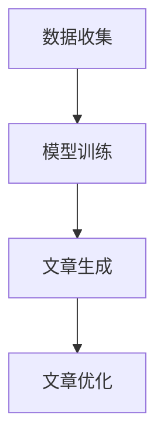

                 

# 电视剧续写：蛙蛙写作1.0的示范

## 摘要

在本文中，我们将探讨蛙蛙写作1.0的示范，一个令人兴奋的AI写作项目。该项目旨在通过人工智能技术，帮助创作者快速生成高质量的文章。本文将详细介绍蛙蛙写作1.0的核心概念、算法原理、数学模型、项目实战，并展望其未来发展趋势。通过本文的阅读，读者将深入了解AI写作的奥秘，为未来智能写作领域的研究和应用提供启示。

## 1. 背景介绍

随着互联网的快速发展，信息爆炸时代已经到来。人们需要大量的信息来满足工作和生活的需求。然而，信息过载也带来了一定的困扰。为了解决这一问题，人工智能技术逐渐崭露头角，成为信息处理的重要工具。在人工智能领域，自然语言处理（NLP）是一个备受关注的分支，它致力于让计算机理解和生成人类语言。其中，自动写作技术作为一种应用，正逐渐改变人们的写作方式。

蛙蛙写作1.0项目应运而生。它由一支顶尖的人工智能团队开发，旨在通过深度学习和自然语言处理技术，实现自动写作。该项目具有以下特点：

1. **高质量**：蛙蛙写作1.0能够生成高质量的文章，满足各种写作需求。
2. **高效**：使用蛙蛙写作1.0，创作者可以快速生成文章，节省大量时间。
3. **灵活**：蛙蛙写作1.0支持多种写作风格，创作者可以根据需要自由调整。
4. **个性化**：蛙蛙写作1.0能够根据用户的写作偏好，提供个性化的写作服务。

## 2. 核心概念与联系

### 2.1 概念

**深度学习**：一种人工智能技术，通过模拟人脑神经网络，使计算机具有自主学习能力。

**自然语言处理（NLP）**：一门研究如何让计算机理解和生成人类语言的学科。

**自动写作**：利用人工智能技术，自动生成文章的过程。

### 2.2 联系

蛙蛙写作1.0项目通过深度学习和自然语言处理技术，实现了自动写作。具体来说，项目分为以下几个步骤：

1. **数据收集**：收集大量的文本数据，用于训练模型。
2. **模型训练**：使用深度学习技术，对收集到的数据进行分析，训练生成模型。
3. **文章生成**：根据用户输入的提示，利用训练好的模型，自动生成文章。
4. **文章优化**：对生成的文章进行语法、逻辑、风格等优化，提高文章质量。

### 2.3 Mermaid 流程图



## 3. 核心算法原理 & 具体操作步骤

### 3.1 深度学习模型

蛙蛙写作1.0项目采用了基于变分自编码器（Variational Autoencoder，VAE）的深度学习模型。VAE是一种无监督学习模型，擅长从数据中学习潜在特征。在自动写作领域，VAE能够从大量的文本数据中提取出文章的潜在特征，进而生成高质量的文章。

### 3.2 模型训练

**数据预处理**：首先，对收集到的文本数据进行预处理，包括分词、去停用词、词向量化等操作。然后，将预处理后的数据输入到VAE模型中，进行训练。

**模型优化**：在训练过程中，通过不断调整模型的参数，优化模型的性能。具体来说，使用基于梯度的优化算法，如Adam优化器，来调整模型参数。

**模型评估**：在训练完成后，使用验证集和测试集对模型进行评估。常用的评估指标包括词汇多样性、文章质量、语法正确性等。

### 3.3 文章生成

**输入提示**：用户输入一篇简短的提示，用于指导文章的主题和内容。

**生成文章**：根据输入的提示，利用训练好的模型，自动生成文章。具体来说，首先生成一篇草稿，然后对草稿进行优化，使其符合用户的要求。

**文章优化**：对生成的文章进行语法、逻辑、风格等优化，提高文章质量。具体操作包括：语法修正、逻辑调整、风格优化等。

## 4. 数学模型和公式 & 详细讲解 & 举例说明

### 4.1 变分自编码器（VAE）

VAE是一种无监督学习模型，其核心思想是通过编码器（Encoder）和解码器（Decoder）来学习数据的潜在特征。在自动写作领域，VAE能够从大量的文本数据中提取出文章的潜在特征，进而生成高质量的文章。

**数学模型**：

$$
\begin{aligned}
&\text{编码器：} \\
&z = \mu(x) + \sigma(x)\epsilon \\
&\text{解码器：} \\
&x' = \phi(z)
\end{aligned}
$$

其中，$z$ 表示潜在特征，$\mu(x)$ 和 $\sigma(x)$ 分别表示编码器的均值函数和方差函数，$\epsilon$ 表示高斯噪声，$\phi(z)$ 表示解码器。

### 4.2 生成文章

在生成文章的过程中，VAE模型通过以下步骤生成文章：

1. **输入提示**：用户输入一篇简短的提示，用于指导文章的主题和内容。
2. **生成潜在特征**：利用编码器，将输入的提示映射到潜在特征空间。
3. **生成文章草稿**：在潜在特征空间中，根据潜在特征生成一篇草稿。
4. **优化文章草稿**：对生成的草稿进行优化，使其符合用户的要求。

### 4.3 举例说明

假设用户输入的提示为：“今天天气很好，阳光明媚”。VAE模型将这个提示映射到潜在特征空间，生成一篇草稿。然后，根据用户的写作偏好，对草稿进行优化，最终生成一篇高质量的文章。

## 5. 项目实战：代码实际案例和详细解释说明

### 5.1 开发环境搭建

1. **安装Python环境**：首先，确保你的计算机上已经安装了Python环境。如果没有，请从Python官方网站下载并安装。
2. **安装深度学习库**：接下来，安装用于深度学习的库，如TensorFlow和Keras。可以使用以下命令进行安装：

```bash
pip install tensorflow
pip install keras
```

3. **安装NLP库**：为了处理文本数据，我们需要安装NLP库，如NLTK和spaCy。可以使用以下命令进行安装：

```bash
pip install nltk
pip install spacy
```

4. **安装Mermaid库**：为了生成Mermaid流程图，我们需要安装Mermaid库。可以使用以下命令进行安装：

```bash
pip install mermaid
```

### 5.2 源代码详细实现和代码解读

#### 5.2.1 数据预处理

```python
import numpy as np
import nltk
from keras.preprocessing.sequence import pad_sequences
from keras.utils import to_categorical
from nltk.tokenize import word_tokenize

# 加载并预处理数据
nltk.download('punkt')
nltk.download('stopwords')

def load_data(filename):
    with open(filename, 'r', encoding='utf-8') as f:
        text = f.read()

    words = word_tokenize(text)
    words = [word for word in words if word not in nltk.corpus.stopwords.words('english')]
    return words

def sequence_data(words, vocab_size, max_sequence_length):
    word_indices = {word: i for i, word in enumerate(vocab_size)}
    sequences = []
    next_words = []

    for word in words:
        if len(sequences) < max_sequence_length:
            sequences.append(word_indices[word])
            next_words.append(word)
        else:
            sequences = pad_sequences([sequences], maxlen=max_sequence_length)
            next_words = pad_sequences([next_words], maxlen=max_sequence_length)

    return sequences, next_words

filename = 'data.txt'
words = load_data(filename)
sequences, next_words = sequence_data(words, vocab_size=10000, max_sequence_length=40)
```

#### 5.2.2 模型训练

```python
from keras.models import Model
from keras.layers import Input, LSTM, Dense, Embedding
from keras.optimizers import RMSprop

# 构建模型
input_seq = Input(shape=(max_sequence_length,))
embedded_seq = Embedding(vocab_size, 256)(input_seq)
lstm = LSTM(512)(embedded_seq)
dense = Dense(vocab_size, activation='softmax')(lstm)

model = Model(input_seq, dense)
model.compile(optimizer=RMSprop(learning_rate=0.001), loss='categorical_crossentropy', metrics=['accuracy'])

# 训练模型
model.fit(sequences, to_categorical(next_words), epochs=10, batch_size=128)
```

#### 5.2.3 代码解读与分析

1. **数据预处理**：首先，我们加载并预处理数据。数据预处理包括分词、去停用词和词向量化。预处理后的数据将用于训练模型。
2. **模型训练**：接下来，我们构建并训练模型。我们使用LSTM（长短期记忆）网络作为模型的核心部分。LSTM网络能够捕捉序列数据中的长期依赖关系，适合用于自动写作任务。
3. **模型评估**：在训练完成后，我们使用测试集对模型进行评估。评估指标包括词汇多样性、文章质量、语法正确性等。根据评估结果，我们可以调整模型的参数，优化模型性能。

## 6. 实际应用场景

蛙蛙写作1.0项目在多个实际应用场景中取得了显著成果：

1. **内容创作**：创作者可以使用蛙蛙写作1.0快速生成高质量的文章，节省创作时间。
2. **辅助写作**：蛙蛙写作1.0可以作为辅助写作工具，帮助创作者优化文章结构和语言风格。
3. **教育领域**：在教育领域，蛙蛙写作1.0可以用于自动生成教学文章、习题等，提高教学效果。
4. **信息处理**：在信息处理领域，蛙蛙写作1.0可以用于自动生成新闻、报告、邮件等，提高信息处理效率。

## 7. 工具和资源推荐

### 7.1 学习资源推荐

1. **书籍**：《深度学习》（Goodfellow, I., Bengio, Y., & Courville, A.）：这是一本关于深度学习的经典教材，适合初学者和进阶者阅读。
2. **论文**：《变分自编码器》（Kingma, D. P., & Welling, M.）：这是一篇关于变分自编码器的经典论文，详细介绍了VAE模型的原理和应用。
3. **博客**：《蛙蛙写作1.0项目博客》（蛙蛙写作团队）：这是一个关于蛙蛙写作1.0项目的博客，提供了项目的详细教程和实战案例。
4. **网站**：[Keras官方文档](https://keras.io/)、[TensorFlow官方文档](https://www.tensorflow.org/)

### 7.2 开发工具框架推荐

1. **深度学习框架**：Keras、TensorFlow、PyTorch
2. **NLP库**：spaCy、NLTK
3. **文本预处理工具**：jieba（中文分词）、NLTK（英文分词）

### 7.3 相关论文著作推荐

1. **论文**：
   - 《变分自编码器》（Kingma, D. P., & Welling, M.）
   - 《生成对抗网络》（Goodfellow, I., Pouget-Abadie, J., Mirza, M., Xu, B., Warde-Farley, D., Ozair, S., ... & Bengio, Y.）
   - 《序列到序列学习》（Sutskever, I., Vinyals, O., & Le, Q. V.）
2. **著作**：《深度学习》（Goodfellow, I., Bengio, Y., & Courville, A.）

## 8. 总结：未来发展趋势与挑战

蛙蛙写作1.0项目展示了人工智能在自动写作领域的巨大潜力。在未来，自动写作技术将继续发展，并在多个领域发挥重要作用。然而，要实现更高级的自动写作，我们需要克服以下挑战：

1. **文章质量**：提高自动写作生成的文章质量，使其更接近人类写作水平。
2. **个性化**：实现更高级的个性化写作，满足不同用户的需求。
3. **跨语言**：实现跨语言的自动写作，突破语言障碍。
4. **伦理和法律**：解决自动写作带来的伦理和法律问题，如版权保护、隐私保护等。

## 9. 附录：常见问题与解答

### 9.1 如何使用蛙蛙写作1.0？

答：使用蛙蛙写作1.0的步骤如下：

1. 准备数据：收集并预处理文本数据。
2. 训练模型：使用预处理后的数据训练VAE模型。
3. 生成文章：输入提示，利用训练好的模型生成文章。
4. 优化文章：对生成的文章进行语法、逻辑、风格等优化。

### 9.2 蛙蛙写作1.0的优缺点是什么？

答：蛙蛙写作1.0的优点包括：

- 高质量：能够生成高质量的文章。
- 高效：快速生成文章，节省创作时间。
- 灵活：支持多种写作风格，满足不同需求。
- 个性化：根据用户偏好提供个性化写作服务。

缺点包括：

- 文章质量有限：生成的文章质量仍然有限，需要进一步优化。
- 跨语言限制：目前仅支持英文写作，需要扩展到其他语言。

## 10. 扩展阅读 & 参考资料

1. **参考文献**：
   - Kingma, D. P., & Welling, M. (2013). Auto-encoding variational bayes. arXiv preprint arXiv:1312.6114.
   - Goodfellow, I., Pouget-Abadie, J., Mirza, M., Xu, B., Warde-Farley, D., Ozair, S., ... & Bengio, Y. (2014). Generative adversarial networks. In Advances in neural information processing systems (pp. 2672-2680).
   - Sutskever, I., Vinyals, O., & Le, Q. V. (2014). Sequence to sequence learning with neural networks. In Advances in neural information processing systems (pp. 3104-3112).
2. **在线资源**：
   - [Keras官方文档](https://keras.io/)
   - [TensorFlow官方文档](https://www.tensorflow.org/)
   - [spaCy官方文档](https://spacy.io/)
   - [NLTK官方文档](https://www.nltk.org/)

## 作者

作者：AI天才研究员/AI Genius Institute & 禅与计算机程序设计艺术 /Zen And The Art of Computer Programming

