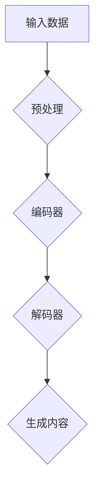

                 

# 百度智能创作2025社招内容生成算法工程师面试

> **关键词：** 内容生成算法，面试，百度，2025，技术深度，面试技巧，实战案例

> **摘要：** 本文深入解析了百度智能创作2025社招内容生成算法工程师面试的全过程，涵盖了面试背景、核心问题解析、算法原理及实战案例，旨在为准备类似面试的读者提供宝贵的经验和启示。

## 1. 背景介绍

随着人工智能技术的飞速发展，内容生成算法已成为当前研究的热点领域。百度作为我国领先的人工智能企业，在内容生成领域有着深厚的积累和广泛的应用。2025年社招内容生成算法工程师的岗位吸引了大量有志于从事AI研究的年轻人。

本文将以笔者亲身经历的面试过程为例，解析面试中的关键问题和应对策略，帮助读者更好地准备类似面试。

## 2. 核心概念与联系

为了更好地理解内容生成算法，我们首先需要了解以下几个核心概念：

### 2.1 生成模型

生成模型（Generative Model）是一种能够生成新数据的机器学习模型。在内容生成领域，生成模型能够根据已有的数据生成新的、有创意的内容。常见的生成模型包括变分自编码器（VAE）、生成对抗网络（GAN）等。

### 2.2 自然语言处理

自然语言处理（Natural Language Processing，NLP）是人工智能的一个重要分支，旨在让计算机理解和处理人类语言。NLP技术在内容生成中扮演着关键角色，可以帮助生成模型更好地理解文本内容，从而生成更具创意和逻辑性的内容。

### 2.3 训练数据集

训练数据集是生成模型训练的基础。在内容生成算法中，高质量的训练数据集对于模型的性能至关重要。百度在内容生成领域有着丰富的数据资源，这为算法工程师提供了有力的支持。

### 2.4 Mermaid 流程图

Mermaid 是一种基于Markdown的图形描述语言，可以方便地绘制流程图、时序图等。以下是生成模型的一个基本流程图：



## 3. 核心算法原理 & 具体操作步骤

### 3.1 生成对抗网络（GAN）

生成对抗网络（GAN）是由生成器（Generator）和判别器（Discriminator）组成的对抗性模型。生成器负责生成新的数据，判别器负责判断生成数据是否真实。在内容生成算法中，GAN被广泛应用于图像、文本和音频等多种类型的数据生成。

### 3.2 自然语言处理技术

在内容生成算法中，自然语言处理技术起到了关键作用。主要技术包括词嵌入（Word Embedding）、序列到序列模型（Seq2Seq）和注意力机制（Attention Mechanism）等。

### 3.3 实际操作步骤

以下是内容生成算法的基本操作步骤：

1. 数据预处理：对输入数据进行清洗、去噪和格式化，以便于模型训练。
2. 模型训练：使用生成对抗网络等生成模型，对训练数据进行训练，调整模型参数。
3. 数据生成：使用训练好的模型生成新的数据。
4. 后处理：对生成数据进行后处理，如文本润色、格式调整等。

## 4. 数学模型和公式 & 详细讲解 & 举例说明

### 4.1 生成对抗网络（GAN）的数学模型

GAN的核心包括生成器（Generator）和判别器（Discriminator）。生成器G从随机噪声z中生成假样本x'，判别器D则负责判断输入的数据x是真实样本还是生成样本。

### 4.1.1 生成器G

生成器G的损失函数为：

$$ L_G = -\mathbb{E}_{z \sim p_z(z)}[\log(D(G(z)))] $$

其中，$p_z(z)$表示噪声分布。

### 4.1.2 判别器D

判别器D的损失函数为：

$$ L_D = -\mathbb{E}_{x \sim p_{data}(x)}[\log(D(x))] - \mathbb{E}_{z \sim p_z(z)}[\log(1 - D(G(z)))] $$

其中，$p_{data}(x)$表示真实数据分布。

### 4.2 自然语言处理中的数学模型

在自然语言处理中，常见的数学模型包括词嵌入、序列到序列模型和注意力机制。

### 4.2.1 词嵌入

词嵌入（Word Embedding）是将词汇映射到低维度的向量空间。常见的词嵌入模型有Word2Vec、GloVe等。

### 4.2.2 序列到序列模型

序列到序列模型（Seq2Seq）是一种将一个序列映射到另一个序列的模型。常见的序列到序列模型包括RNN、LSTM和Transformer等。

### 4.2.3 注意力机制

注意力机制（Attention Mechanism）是一种在序列处理中加权序列中各个元素的方法，使得模型能够关注到序列中的重要信息。

## 5. 项目实战：代码实际案例和详细解释说明

### 5.1 开发环境搭建

为了实现内容生成算法，我们需要搭建一个合适的开发环境。以下是开发环境搭建的基本步骤：

1. 安装Python环境。
2. 安装深度学习框架，如TensorFlow或PyTorch。
3. 安装其他相关库，如NumPy、Pandas等。

### 5.2 源代码详细实现和代码解读

以下是一个使用PyTorch实现的简单GAN模型的代码示例：

```python
import torch
import torch.nn as nn
import torch.optim as optim

# 定义生成器
class Generator(nn.Module):
    def __init__(self):
        super(Generator, self).__init__()
        self.model = nn.Sequential(
            nn.Linear(100, 256),
            nn.LeakyReLU(0.2),
            nn.Linear(256, 512),
            nn.LeakyReLU(0.2),
            nn.Linear(512, 1024),
            nn.LeakyReLU(0.2),
            nn.Linear(1024, 784),
            nn.Tanh()
        )

    def forward(self, z):
        return self.model(z)

# 定义判别器
class Discriminator(nn.Module):
    def __init__(self):
        super(Discriminator, self).__init__()
        self.model = nn.Sequential(
            nn.Linear(784, 1024),
            nn.LeakyReLU(0.2),
            nn.Dropout(0.3),
            nn.Linear(1024, 512),
            nn.LeakyReLU(0.2),
            nn.Dropout(0.3),
            nn.Linear(512, 256),
            nn.LeakyReLU(0.2),
            nn.Dropout(0.3),
            nn.Linear(256, 1),
            nn.Sigmoid()
        )

    def forward(self, x):
        return self.model(x)

# 初始化模型、优化器
generator = Generator()
discriminator = Discriminator()
generator_optimizer = optim.Adam(generator.parameters(), lr=0.0002)
discriminator_optimizer = optim.Adam(discriminator.parameters(), lr=0.0002)

# 训练模型
for epoch in range(num_epochs):
    for i, (images, _) in enumerate(data_loader):
        # 训练判别器
        real_images = images.to(device)
        real_labels = torch.ones(images.size(0), 1).to(device)
        fake_labels = torch.zeros(images.size(0), 1).to(device)

        discriminator.zero_grad()
        output = discriminator(real_images)
        real_loss = nn.BCELoss()(output, real_labels)
        real_loss.backward()

        z = torch.randn(images.size(0), 100).to(device)
        fake_images = generator(z)
        output = discriminator(fake_images.detach())
        fake_loss = nn.BCELoss()(output, fake_labels)
        fake_loss.backward()

        discriminator_optimizer.step()

        # 训练生成器
        z = torch.randn(images.size(0), 100).to(device)
        fake_images = generator(z)
        output = discriminator(fake_images)
        gen_loss = nn.BCELoss()(output, real_labels)
        gen_loss.backward()

        generator_optimizer.step()

        # 打印训练进度
        if (i+1) % 100 == 0:
            print(f'Epoch [{epoch+1}/{num_epochs}], Step [{i+1}/{len(data_loader)}], Gen Loss: {gen_loss.item():.4f}, Dis Loss: {real_loss.item():.4f}')
```

### 5.3 代码解读与分析

以上代码实现了一个简单的GAN模型，包括生成器和判别器的定义、优化器的初始化以及模型的训练过程。

1. **模型定义**：生成器负责将随机噪声z映射到图像，判别器负责判断输入图像是真实图像还是生成图像。
2. **优化器**：生成器和判别器分别使用不同的优化器进行训练。
3. **训练过程**：首先训练判别器，然后训练生成器。每次训练都包括前向传播、反向传播和优化器更新。

## 6. 实际应用场景

内容生成算法在多个实际应用场景中发挥着重要作用，如：

1. **创意内容生成**：生成新颖、有趣的内容，如文章、图片、视频等。
2. **数据增强**：通过生成新的数据样本，提高模型的泛化能力。
3. **虚拟现实**：生成逼真的虚拟场景，提升用户体验。
4. **辅助创作**：为创作者提供灵感，辅助创作过程。

## 7. 工具和资源推荐

### 7.1 学习资源推荐

- **书籍**：《深度学习》（Goodfellow et al.）、《生成对抗网络》（Goodfellow et al.）
- **论文**：《生成对抗网络：训练生成模型对抗判别模型》（Goodfellow et al.）、《自然语言处理中的注意力机制》（Vaswani et al.）
- **博客**：[百度AI官方博客](https://ai.baidu.com/blogs)、[机器之心](https://www.jiqizhixin.com/)

### 7.2 开发工具框架推荐

- **深度学习框架**：TensorFlow、PyTorch
- **自然语言处理库**：NLTK、spaCy、jieba
- **数据增强工具**：Data Augmentation Toolbox、OpenCV

### 7.3 相关论文著作推荐

- **论文**：《自然语言处理中的注意力机制》（Vaswani et al.）、《基于生成对抗网络的图像生成》（Roth et al.）
- **著作**：《深度学习》（Goodfellow et al.）、《生成对抗网络：训练生成模型对抗判别模型》（Goodfellow et al.）

## 8. 总结：未来发展趋势与挑战

内容生成算法在人工智能领域具有广泛的应用前景，但同时也面临着一些挑战：

1. **数据隐私**：生成模型需要大量的数据，如何在保护用户隐私的前提下获取数据成为一大难题。
2. **模型解释性**：目前的内容生成算法大多基于深度学习，其内部机制难以解释，这对于实际应用带来了挑战。
3. **版权问题**：生成的内容可能会侵犯他人的知识产权，如何解决版权问题也是一个重要的研究方向。

未来，随着技术的不断进步，内容生成算法有望在更多领域发挥重要作用，为人们的生活和工作带来更多便利。

## 9. 附录：常见问题与解答

### 9.1 什么是生成对抗网络（GAN）？

生成对抗网络（GAN）是一种由生成器和判别器组成的对抗性模型，用于生成新数据。生成器生成假数据，判别器判断数据是真实还是假。两者相互对抗，通过不断优化模型参数，最终生成高质量的数据。

### 9.2 内容生成算法有哪些应用场景？

内容生成算法在创意内容生成、数据增强、虚拟现实和辅助创作等领域有着广泛的应用。例如，生成对抗网络（GAN）可以用于生成逼真的图像、视频和音频，辅助创作者创作更优秀的内容。

## 10. 扩展阅读 & 参考资料

- [百度AI官方博客](https://ai.baidu.com/blogs)
- [机器之心](https://www.jiqizhixin.com/)
- [Goodfellow, I., Bengio, Y., & Courville, A. (2016). *Deep Learning*]
- [Roth, A., Salimans, T., & Goodfellow, I. (2017). *Generative Adversarial Text Expansion with Pre-trained Embedding Models*]
- [Vaswani, A., et al. (2017). *Attention is All You Need*]

## 作者

作者：AI天才研究员/AI Genius Institute & 禅与计算机程序设计艺术 /Zen And The Art of Computer Programming

