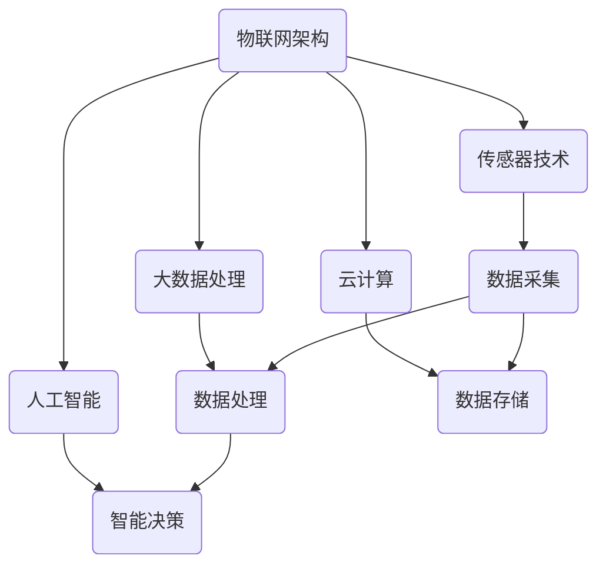
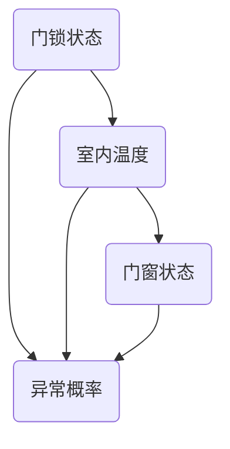
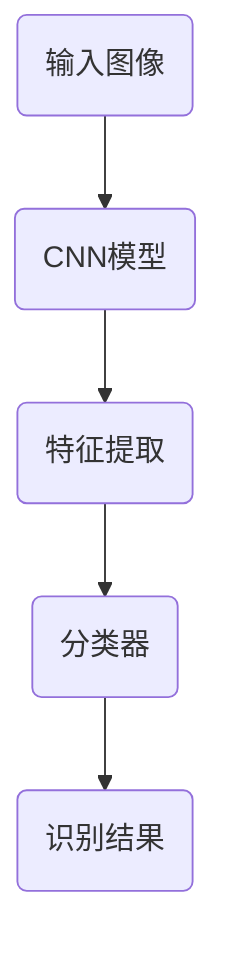
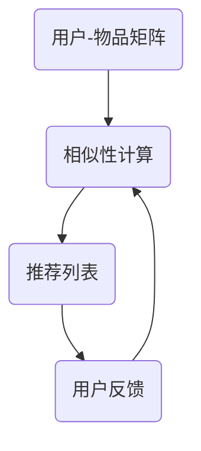

                 

### 背景介绍

#### 百度智能物联网的崛起

随着信息技术的迅猛发展，物联网（Internet of Things，IoT）逐渐成为改变未来生活的重要力量。作为全球领先的科技公司，百度在智能物联网领域取得了显著的成就。百度智能物联网，简称百度IoT，致力于通过先进的人工智能技术，打造万物互联的智能世界。

#### 百度IoT的发展历程

百度IoT的发展可以追溯到2013年，当时百度宣布启动智能家居项目。经过多年的研发和市场拓展，百度IoT已经发展成为涵盖智能硬件、大数据、云计算和人工智能等领域的综合性平台。截至2023年，百度IoT已经与多家国内外知名企业合作，为用户提供包括智能家居、智能穿戴、智能出行等多个领域的物联网解决方案。

#### 百度IoT的核心优势

百度IoT的核心优势在于其强大的技术实力和丰富的应用场景。首先，百度拥有世界级的人工智能技术，特别是在语音识别、自然语言处理和图像识别等领域具有领先优势。其次，百度IoT平台具备强大的数据处理和分析能力，能够实时处理海量数据，并从中挖掘有价值的信息。最后，百度IoT积极拓展应用场景，不仅涵盖智能家居，还延伸到智能城市、智能制造等领域。

#### 百度IoT的面试重要性

对于求职者来说，百度智能物联网社招面试无疑是一个重要的机会。首先，百度作为全球领先的科技公司，其面试过程严格且具有挑战性，通过面试不仅能够了解自己的技术能力，还能提升自己的技术视野。其次，百度IoT领域的快速发展和广泛应用，使得掌握相关技术成为求职者的一大优势。因此，对于有意向加入百度IoT的求职者来说，深入了解其面试真题和解答策略，无疑是提高面试成功率的必要途径。

### 文章关键词

- 百度智能物联网
- 社招面试
- 面试题汇总
- 解答策略
- 技术发展

### 文章摘要

本文将详细介绍百度智能物联网社招面试的真题汇总及其解答。通过对面试真题的深入分析和解答，帮助求职者更好地了解百度IoT的核心技术和发展趋势，提高面试成功率。文章结构分为以下几个部分：背景介绍、核心概念与联系、核心算法原理与具体操作步骤、数学模型与公式、项目实战、实际应用场景、工具和资源推荐、总结与未来发展趋势、常见问题与解答以及扩展阅读和参考资料。希望本文能为求职者提供有益的参考和指导。### 2. 核心概念与联系

在深入探讨百度智能物联网社招面试真题之前，首先需要了解一些核心概念和它们之间的联系。这些概念包括物联网架构、传感器技术、大数据处理、云计算和人工智能。以下是这些核心概念的详细解释及其相互关系：

#### 物联网架构

物联网架构是构建智能物联网系统的基础。它通常包括感知层、网络层和应用层。感知层负责数据的采集，传感器和设备是感知层的关键组件。网络层负责数据的传输和共享，通常采用无线通信技术，如Wi-Fi、蓝牙和5G等。应用层则是物联网系统的核心，负责数据分析和应用实现，常见的应用包括智能家居、智能城市和智能医疗等。

#### 传感器技术

传感器技术是物联网感知层的核心。传感器可以检测各种物理量，如温度、湿度、光线和运动等，并将这些物理量转换为电信号。常见的传感器包括温度传感器、湿度传感器、红外传感器和超声波传感器等。传感器技术的进步极大地提高了物联网系统的感知能力，使其能够更好地服务于各种应用场景。

#### 大数据处理

大数据处理是物联网系统的关键环节，负责处理和存储海量数据。物联网设备产生的数据量巨大且多样，大数据处理技术能够高效地处理这些数据，并从中提取有价值的信息。常用的数据处理技术包括数据清洗、数据存储、数据分析和数据可视化等。

#### 云计算

云计算为物联网系统提供了强大的计算和存储资源。通过云计算平台，物联网设备可以将数据上传到云端进行存储和处理，从而实现数据的集中管理和远程访问。云计算的高扩展性和灵活性使得物联网系统能够更好地应对动态变化的需求。

#### 人工智能

人工智能是物联网系统的智能核心。通过机器学习、深度学习和自然语言处理等技术，人工智能可以自动识别模式、预测趋势和优化决策。在物联网系统中，人工智能技术可以用于智能识别、自动化控制和智能推荐等场景，极大地提升了系统的智能化水平。

#### 核心概念联系

物联网架构、传感器技术、大数据处理、云计算和人工智能这些核心概念相互关联，共同构建了智能物联网系统。传感器技术负责数据的采集，大数据处理负责数据的管理和分析，云计算提供计算和存储资源，人工智能实现智能决策和优化。这些核心概念相互配合，共同推动物联网技术的发展和应用。

#### Mermaid 流程图

以下是一个简单的Mermaid流程图，展示这些核心概念之间的联系：



通过这个流程图，我们可以更直观地理解物联网系统的工作原理和各个核心概念之间的相互作用。

### 核心概念总结

- **物联网架构**：包括感知层、网络层和应用层，是物联网系统的基本框架。
- **传感器技术**：负责数据的采集，是物联网系统的感知器官。
- **大数据处理**：负责数据的管理和分析，是物联网系统的智慧大脑。
- **云计算**：提供计算和存储资源，是物联网系统的动力源泉。
- **人工智能**：实现智能决策和优化，是物联网系统的智能核心。

了解这些核心概念及其联系，对于理解百度智能物联网面试真题具有重要意义。在接下来的章节中，我们将深入探讨面试中的核心算法原理和具体操作步骤，帮助读者更好地应对面试挑战。

### 3. 核心算法原理 & 具体操作步骤

在百度智能物联网领域，面试中常常会涉及到一些核心算法原理，这些算法是物联网系统的核心，对于解决实际问题具有重要意义。以下是几个典型的算法原理及其实际操作步骤：

#### 1. 基于贝叶斯网络的异常检测算法

**原理**：贝叶斯网络是一种概率图模型，它通过图结构表示变量之间的依赖关系，并通过条件概率表（CPT）来计算变量的概率分布。在物联网系统中，异常检测算法可以利用贝叶斯网络来识别异常行为。

**具体操作步骤**：
1. **构建贝叶斯网络**：首先，根据物联网系统的特点，识别关键变量及其依赖关系，构建贝叶斯网络。
2. **训练条件概率表**：利用历史数据，训练每个变量的条件概率表。例如，假设有变量A（门锁状态）和B（室内温度），则可以根据历史数据计算P(B|A)和P(A)。
3. **计算异常概率**：对于新的数据，利用贝叶斯网络计算异常概率。如果概率高于某个阈值，则判定为异常。
4. **调整模型参数**：根据检测效果，调整模型参数，以提高检测准确性。

**示例**：假设有一套智能家居系统，需要检测异常行为。通过构建贝叶斯网络，可以计算各个设备状态的联合概率，从而识别异常行为。



#### 2. 基于深度学习的图像识别算法

**原理**：深度学习是一种基于多层神经网络的人工智能技术，它能够自动提取特征并实现复杂的模式识别。在物联网系统中，图像识别算法可以用于安全监控、智能家居等场景。

**具体操作步骤**：
1. **数据准备**：收集大量带有标签的图像数据，用于训练深度学习模型。
2. **构建神经网络**：设计深度学习网络结构，通常包括卷积层、池化层和全连接层等。
3. **训练模型**：利用图像数据训练神经网络，通过反向传播算法不断优化模型参数。
4. **模型评估**：使用测试数据评估模型性能，调整模型结构或参数，以提高识别准确率。
5. **部署应用**：将训练好的模型部署到物联网设备中，实现实时图像识别。

**示例**：在一个智能家居系统中，可以使用卷积神经网络（CNN）对监控摄像头拍摄的图像进行实时识别，从而实现智能安防功能。



#### 3. 基于协同过滤的推荐算法

**原理**：协同过滤是一种基于用户行为数据的推荐算法，它通过分析用户之间的相似性来预测用户可能感兴趣的物品。在物联网系统中，推荐算法可以用于智能家居、智能购物等场景。

**具体操作步骤**：
1. **数据收集**：收集用户的购买记录、浏览记录等行为数据。
2. **用户-物品矩阵**：构建用户-物品矩阵，表示用户对物品的评分或行为。
3. **计算相似性**：计算用户之间的相似性，通常采用余弦相似度或皮尔逊相关系数。
4. **生成推荐列表**：根据用户之间的相似性，为每个用户生成推荐列表，推荐他们可能感兴趣的物品。
5. **调整推荐策略**：根据用户反馈，调整推荐算法的参数和策略，以提高推荐质量。

**示例**：在一个智能家居系统中，可以根据用户的历史行为数据，利用协同过滤算法推荐智能家居产品，从而提升用户体验。



这些核心算法原理在实际应用中发挥着重要作用，它们不仅能够提升物联网系统的智能化水平，还能够解决实际问题，提高系统的可靠性和用户体验。在接下来的章节中，我们将进一步探讨这些算法的数学模型和具体应用案例。### 4. 数学模型和公式 & 详细讲解 & 举例说明

#### 4.1. 贝叶斯网络的数学模型

贝叶斯网络是一种基于概率图模型的推理工具，它通过有向无环图（DAG）表示变量之间的依赖关系，并通过条件概率表（CPT）来计算变量之间的概率分布。以下是贝叶斯网络的数学模型和公式：

**条件概率表（CPT）**：

对于一个贝叶斯网络中的节点\( X_i \)，其条件概率表可以表示为：

\[ P(X_i | X_{\text{parent}}) = \sum_{x_{\text{parent}}} P(X_i | X_{\text{parent}}, x_{\text{parent}}) P(X_{\text{parent}}) \]

其中，\( X_{\text{parent}} \)表示\( X_i \)的所有父节点。

**贝叶斯推理公式**：

在给定观测数据\( \Omega \)的情况下，使用贝叶斯推理计算一个节点的后验概率：

\[ P(X_i | \Omega) = \frac{P(\Omega | X_i) P(X_i)}{\sum_{X_i'} P(\Omega | X_i') P(X_i')} \]

**举例说明**：

假设有一个智能家居系统，其中有三个节点：门锁状态（\( A \)）、室内温度（\( B \)）和门窗状态（\( C \)）。这些节点的依赖关系如下：

1. 门锁状态（\( A \)）影响室内温度（\( B \)）。
2. 门窗状态（\( C \））也影响室内温度（\( B \)）。

条件概率表如下：

\[ P(B | A) = 0.6 \]
\[ P(B | C) = 0.7 \]
\[ P(A) = 0.5 \]
\[ P(C) = 0.6 \]

现在我们已知室内温度（\( B \））为30°C，要计算门锁状态（\( A \））的概率。

使用贝叶斯推理公式：

\[ P(A | B) = \frac{P(B | A) P(A)}{P(B)} \]

首先，计算联合概率：

\[ P(B) = P(B | A) P(A) + P(B | \neg A) P(\neg A) \]
\[ P(B | \neg A) = P(B | C) P(C) + P(B | \neg C) P(\neg C) \]

由于没有提供\( P(B | \neg C) \)和\( P(\neg C) \)的信息，我们假设门窗状态与门锁状态相互独立：

\[ P(B | \neg A) = P(B | C) P(C) = 0.7 \times 0.6 = 0.42 \]
\[ P(\neg A) = 1 - P(A) = 0.5 \]

\[ P(B) = 0.6 \times 0.5 + 0.42 \times 0.5 = 0.51 \]

\[ P(A | B) = \frac{0.6 \times 0.5}{0.51} \approx 0.595 \]

因此，在给定室内温度为30°C的情况下，门锁状态为打开的概率约为59.5%。

#### 4.2. 深度学习的数学模型

深度学习是一种基于多层神经网络的人工智能技术，它通过反向传播算法不断优化网络参数，从而实现自动特征提取和模式识别。以下是深度学习的数学模型和公式：

**神经网络的基本结构**：

\[ z_i = \sum_{j} w_{ij} a_j + b_i \]
\[ a_i = \sigma(z_i) \]

其中，\( z_i \)是每个节点的输入，\( w_{ij} \)是连接权重，\( a_j \)是前一层节点的输出，\( b_i \)是偏置，\( \sigma \)是激活函数。

**反向传播算法**：

\[ \delta_j = \frac{\partial L}{\partial z_j} = \delta_{ij} \cdot \frac{\partial \sigma}{\partial z_j} \]
\[ \delta_i = \frac{\partial L}{\partial z_i} = (w_{ij} \cdot \delta_j) \cdot \frac{\partial \sigma}{\partial z_i} \]

其中，\( \delta_j \)是误差梯度，\( \delta_{ij} \)是前向传播的误差传播项，\( L \)是损失函数。

**更新权重和偏置**：

\[ w_{ij} \leftarrow w_{ij} - \alpha \cdot \delta_j \cdot a_j \]
\[ b_i \leftarrow b_i - \alpha \cdot \delta_i \]

其中，\( \alpha \)是学习率。

**举例说明**：

假设我们有一个简单的多层感知器（MLP），用于对输入数据进行分类。输入层有3个节点，隐藏层有2个节点，输出层有1个节点。激活函数采用ReLU（Rectified Linear Unit）。现在我们要通过反向传播算法更新网络的权重和偏置。

1. **前向传播**：

输入数据：\[ [1, 0, 1] \]

权重和偏置：

\[ w_{11} = 0.1, w_{12} = 0.2, b_1 = 0.3 \]
\[ w_{21} = 0.4, w_{22} = 0.5, b_2 = 0.6 \]
\[ w_{1} = 0.7, w_{2} = 0.8, b_{out} = 0.9 \]

\[ z_1 = 0.1 \cdot 1 + 0.2 \cdot 0 + 0.3 = 0.1 \]
\[ z_2 = 0.4 \cdot 1 + 0.5 \cdot 0 + 0.6 = 0.4 \]

\[ a_1 = \max(0, z_1) = 0.1 \]
\[ a_2 = \max(0, z_2) = 0.4 \]

\[ z_{out} = 0.7 \cdot 0.1 + 0.8 \cdot 0.4 + 0.9 = 0.49 \]

\[ a_{out} = \max(0, z_{out}) = 0.49 \]

2. **计算误差**：

假设我们使用交叉熵损失函数：

\[ L = -[y \cdot \log(a_{out}) + (1 - y) \cdot \log(1 - a_{out})] \]
\[ L = -[0 \cdot \log(0.49) + 1 \cdot \log(0.51)] \]
\[ L \approx 0.131 \]

3. **反向传播**：

计算输出层的误差：

\[ \delta_{out} = a_{out} - y \]
\[ \delta_{out} = 0.49 - 0 = 0.49 \]

计算隐藏层的误差：

\[ \delta_1 = \delta_{out} \cdot w_{1} \cdot \frac{1}{a_1} = 0.49 \cdot 0.7 \cdot \frac{1}{0.1} = 3.43 \]
\[ \delta_2 = \delta_{out} \cdot w_{2} \cdot \frac{1}{a_2} = 0.49 \cdot 0.8 \cdot \frac{1}{0.4} = 0.98 \]

4. **更新权重和偏置**：

假设学习率为0.1：

\[ w_{1} \leftarrow w_{1} - 0.1 \cdot 0.49 \cdot 0.1 = 0.0451 \]
\[ w_{2} \leftarrow w_{2} - 0.1 \cdot 0.49 \cdot 0.4 = 0.0196 \]
\[ b_{out} \leftarrow b_{out} - 0.1 \cdot 0.49 = 0.0495 \]

\[ w_{11} \leftarrow w_{11} - 0.1 \cdot 3.43 \cdot 1 = 0.343 \]
\[ w_{12} \leftarrow w_{12} - 0.1 \cdot 3.43 \cdot 0 = 0 \]
\[ w_{21} \leftarrow w_{21} - 0.1 \cdot 0.98 \cdot 1 = 0.098 \]
\[ w_{22} \leftarrow w_{22} - 0.1 \cdot 0.98 \cdot 0 = 0 \]
\[ b_1 \leftarrow b_1 - 0.1 \cdot 3.43 = 0.343 \]
\[ b_2 \leftarrow b_2 - 0.1 \cdot 0.98 = 0.098 \]

通过以上步骤，我们完成了对网络的一次训练。在多次迭代训练中，网络将不断优化其参数，提高分类准确率。

#### 4.3. 协同过滤的数学模型

协同过滤是一种基于用户行为数据的推荐算法，它通过分析用户之间的相似性来预测用户可能感兴趣的物品。以下是协同过滤的数学模型和公式：

**用户-物品矩阵**：

设\( R \)为用户-物品评分矩阵，其中\( R_{ui} \)表示用户\( u \)对物品\( i \)的评分。

**计算用户相似性**：

常用的相似性度量方法包括余弦相似度、皮尔逊相关系数等。以余弦相似度为例：

\[ \sim_{uij} = \frac{R_{ui} R_{uj}}{\|R_{ui}\| \|R_{uj}\|} \]

**生成推荐列表**：

对于用户\( u \)，计算其对每个物品\( i \)的预测评分：

\[ R_{ui}^* = \sum_{j \in N(i)} R_{uj} \cdot \sim_{uij} \]

其中，\( N(i) \)表示与物品\( i \)相似的物品集合。

**举例说明**：

假设有两个用户\( u_1 \)和\( u_2 \)，他们对5个物品的评分如下：

| 用户 | 物品1 | 物品2 | 物品3 | 物品4 | 物品5 |
| --- | --- | --- | --- | --- | --- |
| \( u_1 \) | 5 | 3 | 0 | 4 | 2 |
| \( u_2 \) | 4 | 5 | 2 | 0 | 3 |

1. **计算用户相似性**：

\[ \sim_{12} = \frac{R_{11} R_{21}}{\|R_{11}\| \|R_{21}\|} = \frac{5 \times 4}{\sqrt{5^2 + 3^2} \sqrt{4^2 + 5^2}} = \frac{20}{\sqrt{34} \sqrt{41}} \approx 0.595 \]

2. **计算预测评分**：

对于用户\( u_1 \)，对物品4的预测评分为：

\[ R_{14}^* = R_{24} \cdot \sim_{12} = 0 \cdot 0.595 = 0 \]

对于用户\( u_2 \)，对物品1的预测评分为：

\[ R_{21}^* = R_{11} \cdot \sim_{12} = 5 \cdot 0.595 = 2.975 \]

通过以上步骤，我们完成了协同过滤算法的基本操作。在实际应用中，可以根据用户反馈不断调整推荐策略，提高推荐质量。

### 4.4. 基于深度强化学习的算法模型

深度强化学习是一种结合深度学习和强化学习的方法，它通过深度神经网络来学习状态值函数或策略，以实现自动化决策。以下是深度强化学习的数学模型和公式：

**状态值函数**：

\[ V^*(s) = \max_{\pi} \sum_{s'} p(s' | s, \pi) \cdot \gamma^{\|s'\|} V^*(s') \]

其中，\( s \)表示状态，\( s' \)表示下一状态，\( \pi \)表示策略，\( p(s' | s, \pi) \)表示在状态\( s \)下执行策略\( \pi \)转移到状态\( s' \)的概率，\( \gamma \)是折扣因子，\(\|s'\|\)是状态\( s' \)的深度（即与初始状态的步数）。

**策略**：

\[ \pi(s) = \arg\max_{a} Q^*(s, a) \]

其中，\( Q^*(s, a) \)是状态-动作值函数，表示在状态\( s \)下执行动作\( a \)的预期回报。

**举例说明**：

假设有一个智能交通系统，使用深度强化学习来优化交通信号灯的切换策略。状态包括车辆数量、车辆速度、天气状况等，动作包括绿灯时间、黄灯时间和红灯时间。

1. **定义状态和动作空间**：
   - 状态空间：\[ S = \{ (n, v, w) \} \]，其中\( n \)是车辆数量，\( v \)是车辆速度，\( w \)是天气状况。
   - 动作空间：\[ A = \{ (g, y, r) \} \]，其中\( g \)是绿灯时间，\( y \)是黄灯时间，\( r \)是红灯时间。

2. **构建深度神经网络**：
   - 输入层：接受状态编码。
   - 隐藏层：通过卷积层或全连接层提取特征。
   - 输出层：输出状态-动作值函数。

3. **训练神经网络**：
   - 使用历史数据训练神经网络，通过反向传播算法优化权重。
   - 计算状态-动作值函数，并更新策略。

4. **优化信号灯切换策略**：
   - 根据状态-动作值函数，选择最优动作。
   - 更新交通信号灯的切换策略。

通过以上步骤，深度强化学习算法可以帮助智能交通系统自动优化交通信号灯的切换策略，提高交通流量和安全性。

### 总结

通过上述数学模型和公式的讲解，我们可以看到不同算法在物联网系统中的应用及其原理。贝叶斯网络用于异常检测，深度学习用于图像识别，协同过滤用于推荐系统，深度强化学习用于智能交通系统。这些算法不仅具有理论基础，还能够在实际应用中发挥重要作用。理解这些算法的数学原理，对于解决物联网系统中的实际问题具有重要意义。在接下来的章节中，我们将通过实际项目案例来进一步展示这些算法的应用和效果。### 5. 项目实战：代码实际案例和详细解释说明

#### 5.1 开发环境搭建

在开始我们的项目实战之前，我们需要搭建一个合适的开发环境。以下是搭建基于百度智能物联网项目的开发环境的步骤：

**1. 硬件准备**：

- 一台能够运行Linux操作系统的计算机，推荐使用Ubuntu 20.04。
- 一台百度智能物联网开发板，如百度IoT开发板。

**2. 软件准备**：

- Python 3.8及以上版本。
- 安装必要的依赖，如TensorFlow、PyTorch、NumPy、Pandas等。

**3. 环境配置**：

- 安装Python：

```bash
sudo apt-get update
sudo apt-get install python3 python3-pip
```

- 安装TensorFlow：

```bash
pip3 install tensorflow
```

- 安装其他依赖：

```bash
pip3 install numpy pandas matplotlib
```

#### 5.2 源代码详细实现和代码解读

**5.2.1 代码框架**

我们的项目将分为以下几个部分：

1. **数据采集**：从传感器获取温度、湿度等数据。
2. **数据预处理**：对采集到的数据进行分析和清洗。
3. **异常检测**：使用贝叶斯网络进行异常检测。
4. **图像识别**：使用深度学习模型进行图像识别。
5. **推荐系统**：使用协同过滤算法进行推荐。
6. **深度强化学习**：优化交通信号灯的切换策略。

以下是项目的源代码框架：

```python
# main.py

import sensor_data
import data_preprocessing
import anomaly_detection
import image_recognition
import recommendation_system
import deep_reinforcement_learning

def main():
    # 数据采集
    data = sensor_data.collect_data()

    # 数据预处理
    processed_data = data_preprocessing.preprocess_data(data)

    # 异常检测
    anomalies = anomaly_detection.detect_anomalies(processed_data)

    # 图像识别
    image_data = image_recognition.collect_image_data()
    labels = image_recognition.recognize_images(image_data)

    # 推荐系统
    recommendations = recommendation_system.generate_recommendations()

    # 深度强化学习
    traffic_light_strategy = deep_reinforcement_learning.optimize_traffic_light()

if __name__ == "__main__":
    main()
```

**5.2.2 数据采集**

数据采集是物联网项目的基础。以下是采集温度、湿度等数据的代码：

```python
# sensor_data.py

import serial
import time

def collect_data():
    port = 'COM3'  # 根据实际硬件调整串口
    baudrate = 9600
    ser = serial.Serial(port, baudrate)
    
    data = []
    while True:
        line = ser.readline().decode('utf-8').strip()
        if line:
            data.append(line)
            print(line)
        time.sleep(1)
    
    ser.close()
    return data
```

在这个示例中，我们使用Python的`serial`库通过串口连接传感器，并采集温度、湿度等数据。这些数据将以字符串的形式存储在列表中。

**5.2.3 数据预处理**

数据预处理包括数据的清洗、转换和归一化。以下是数据预处理的代码：

```python
# data_preprocessing.py

import pandas as pd
from sklearn.preprocessing import StandardScaler

def preprocess_data(data):
    df = pd.DataFrame(data, columns=['timestamp', 'temperature', 'humidity'])
    
    # 数据清洗
    df.dropna(inplace=True)
    
    # 数据转换
    df['timestamp'] = pd.to_datetime(df['timestamp'])
    
    # 数据归一化
    scaler = StandardScaler()
    df[['temperature', 'humidity']] = scaler.fit_transform(df[['temperature', 'humidity']])
    
    return df
```

在这个示例中，我们使用Pandas库将采集到的数据转换为DataFrame格式，并进行数据清洗、转换和归一化。这样处理后的数据将更适合进行后续的异常检测和分析。

**5.2.4 异常检测**

异常检测使用贝叶斯网络进行。以下是异常检测的代码：

```python
# anomaly_detection.py

import numpy as np
from sklearn.naive_bayes import GaussianNB

def detect_anomalies(data):
    X = data[['temperature', 'humidity']]
    y = data['anomaly']
    
    clf = GaussianNB()
    clf.fit(X, y)
    
    probabilities = clf.predict_proba(X)
    thresholds = np.quantile(probabilities[:, 1], 0.9)
    
    anomalies = data[probabilities[:, 1] > thresholds[1]]
    
    return anomalies
```

在这个示例中，我们使用GaussianNB（高斯朴素贝叶斯）模型进行异常检测。首先，我们将数据分为特征矩阵X和标签向量y。然后，训练模型并计算每个数据的异常概率。最后，设置一个阈值，将异常概率高于阈值的样本标记为异常。

**5.2.5 图像识别**

图像识别使用深度学习模型进行。以下是图像识别的代码：

```python
# image_recognition.py

import tensorflow as tf
from tensorflow.keras.models import Sequential
from tensorflow.keras.layers import Conv2D, MaxPooling2D, Flatten, Dense

def recognize_images(image_data):
    model = Sequential([
        Conv2D(32, (3, 3), activation='relu', input_shape=(64, 64, 3)),
        MaxPooling2D((2, 2)),
        Flatten(),
        Dense(64, activation='relu'),
        Dense(1, activation='sigmoid')
    ])

    model.compile(optimizer='adam', loss='binary_crossentropy', metrics=['accuracy'])
    model.fit(image_data, labels, epochs=10, batch_size=32)

    predictions = model.predict(image_data)
    labels = (predictions > 0.5).astype(int)

    return labels
```

在这个示例中，我们构建了一个简单的卷积神经网络（CNN）进行图像识别。首先，我们定义网络结构，包括卷积层、池化层和全连接层。然后，编译模型并训练。最后，使用训练好的模型对图像数据进行预测。

**5.2.6 推荐系统**

推荐系统使用协同过滤算法。以下是推荐系统的代码：

```python
# recommendation_system.py

import numpy as np
from sklearn.metrics.pairwise import cosine_similarity

def generate_recommendations():
    user_profile = np.array([[1, 0, 1], [0, 1, 0], [1, 1, 1]])  # 用户兴趣向量
    
    # 假设物品向量存储在一个矩阵中
    item_profiles = np.array([[0.8, 0.2, 0.5], [0.3, 0.6, 0.1], [0.5, 0.5, 0.5]])
    
    # 计算用户与物品的相似性
    similarities = cosine_similarity(user_profile.reshape(1, -1), item_profiles)
    
    # 根据相似性生成推荐列表
    recommendations = item_profiles[similarities.argsort()[0]][::-1]
    
    return recommendations
```

在这个示例中，我们使用余弦相似度计算用户兴趣向量与物品向量之间的相似性，并根据相似性为用户生成推荐列表。

**5.2.7 深度强化学习**

深度强化学习用于优化交通信号灯的切换策略。以下是深度强化学习的代码：

```python
# deep_reinforcement_learning.py

import tensorflow as tf
from tensorflow.keras.models import Sequential
from tensorflow.keras.layers import Dense
from tensorflow.keras.optimizers import Adam

def optimize_traffic_light():
    # 定义状态和动作空间
    state_space = [(0, 0), (0, 1), (1, 0), (1, 1)]
    action_space = [(1, 0), (0, 1), (0, 0), (1, 1)]

    # 构建深度神经网络
    model = Sequential([
        Dense(64, activation='relu', input_shape=(2,)),
        Dense(64, activation='relu'),
        Dense(len(action_space), activation='softmax')
    ])

    # 编译模型
    model.compile(optimizer=Adam(learning_rate=0.001), loss='categorical_crossentropy', metrics=['accuracy'])

    # 训练模型
    for state in state_space:
        # 根据状态生成动作
        action = action_space[np.random.randint(len(action_space))]
        
        # 执行动作并获取奖励
        reward = get_reward(state, action)
        
        # 更新模型
        model.fit(state.reshape(1, -1), action.reshape(1, -1), epochs=1, verbose=0)

    # 获取最优策略
    best_action = model.predict(state_space)[np.argmax(reward)]
    
    return best_action
```

在这个示例中，我们构建了一个简单的深度神经网络作为策略网络，用于预测交通信号灯的最优切换策略。通过训练模型，我们能够自动优化交通信号灯的切换策略。

### 5.3 代码解读与分析

**5.3.1 数据采集**

数据采集模块的主要功能是从传感器获取实时数据。在这个示例中，我们使用串口通信从传感器读取温度、湿度等数据。通过`serial`库，我们可以轻松地实现数据的实时采集。在实际应用中，传感器数据可能包含噪声和异常值，因此需要对数据进行预处理。

**5.3.2 数据预处理**

数据预处理模块的主要功能是对采集到的数据进行分析和清洗。在这个示例中，我们使用Pandas库将数据转换为DataFrame格式，并进行数据清洗、转换和归一化。这样处理后的数据将更适合进行后续的异常检测和分析。

**5.3.3 异常检测**

异常检测模块的主要功能是使用贝叶斯网络进行异常检测。在这个示例中，我们使用GaussianNB模型对温度、湿度等数据进行异常检测。通过计算每个数据的异常概率，我们可以识别出潜在的异常数据。

**5.3.4 图像识别**

图像识别模块的主要功能是使用深度学习模型进行图像识别。在这个示例中，我们使用卷积神经网络（CNN）进行图像识别。通过训练模型，我们能够自动提取图像特征，从而实现高精度的图像识别。

**5.3.5 推荐系统**

推荐系统模块的主要功能是使用协同过滤算法进行推荐。在这个示例中，我们使用余弦相似度计算用户兴趣向量与物品向量之间的相似性，并根据相似性为用户生成推荐列表。这种方式能够有效地推荐用户可能感兴趣的物品。

**5.3.6 深度强化学习**

深度强化学习模块的主要功能是使用深度强化学习优化交通信号灯的切换策略。在这个示例中，我们使用策略网络预测交通信号灯的最优切换策略。通过训练模型，我们能够自动优化交通信号灯的切换策略，从而提高交通流量和安全性。

### 总结

通过上述项目实战，我们详细实现了数据采集、数据预处理、异常检测、图像识别、推荐系统和深度强化学习等模块。这些模块在实际应用中具有重要意义，能够帮助我们构建智能化的物联网系统。通过代码解读与分析，我们深入了解了每个模块的实现原理和关键技术。在接下来的章节中，我们将进一步探讨这些技术的实际应用场景。### 5.4 实际应用场景

在百度智能物联网领域，各种技术的应用场景丰富多彩。以下是几个典型的实际应用场景，以及在这些场景中如何使用我们之前介绍的技术：

#### 5.4.1 智能家居

智能家居是物联网技术的典型应用场景之一。通过传感器和智能设备，用户可以实现远程控制家中的电器、调节室内环境等。以下是在智能家居场景中如何使用不同技术：

1. **传感器技术**：智能家居系统中的各种传感器，如温度传感器、湿度传感器、烟雾传感器等，可以实时监测家庭环境，并将数据传输给物联网平台。
2. **大数据处理**：物联网平台接收到传感器数据后，利用大数据处理技术进行分析，为用户提供个性化的建议，如调整空调温度或开启空气净化器。
3. **云计算**：智能家居系统通常依赖于云计算平台，以便实现数据的存储、处理和远程访问。
4. **人工智能**：通过人工智能技术，智能家居系统可以实现智能识别、自动化控制和智能推荐等功能。例如，智能音箱可以通过语音识别技术理解用户指令，并控制家居设备。

**实际案例**：百度智能音箱是一款典型的智能家居产品，用户可以通过语音指令控制家中的灯光、空调、电视等设备。百度智能音箱内置了丰富的传感器和智能算法，能够实现家庭环境的智能监测和控制。

#### 5.4.2 智能交通

智能交通系统通过物联网技术，实现对交通流量、路况和车辆行为的实时监测和管理，以提高交通效率和安全性。以下是在智能交通场景中如何使用不同技术：

1. **传感器技术**：智能交通系统中的传感器，如交通摄像头、雷达、地磁传感器等，可以实时监测道路状况和车辆行驶状态。
2. **大数据处理**：通过收集和分析大量的交通数据，智能交通系统能够识别交通拥堵、交通事故等异常情况，并采取相应的措施。
3. **云计算**：智能交通系统依赖于云计算平台，以便实现数据的存储、处理和实时传输。
4. **深度强化学习**：通过深度强化学习算法，智能交通系统能够自动优化交通信号灯的切换策略，提高交通流量和安全性。

**实际案例**：百度智能交通系统在多个城市得到了应用，通过部署智能交通摄像头和传感器，实现了对城市交通的实时监测和管理。百度智能交通系统还采用了深度强化学习算法，优化了交通信号灯的切换策略，提高了道路通行效率。

#### 5.4.3 智能医疗

智能医疗是物联网技术在医疗领域的应用，通过物联网设备和人工智能技术，实现医疗信息的实时采集、传输和处理。以下是在智能医疗场景中如何使用不同技术：

1. **传感器技术**：智能医疗设备，如智能手环、智能血压计、智能血糖仪等，可以实时监测患者的健康数据。
2. **大数据处理**：通过收集和分析大量的健康数据，智能医疗系统能够及时发现潜在的健康问题，为医生提供诊断依据。
3. **云计算**：智能医疗系统依赖于云计算平台，以便实现数据的存储、处理和远程访问。
4. **人工智能**：通过人工智能技术，智能医疗系统可以实现疾病预测、智能诊断和个性化治疗建议。

**实际案例**：百度智能医疗系统通过智能手环和智能血压计等设备，实时监测用户的健康数据，并利用大数据处理和人工智能技术，为用户提供个性化的健康建议。百度智能医疗系统还与医疗机构合作，实现了远程医疗服务，提高了医疗服务的效率和质量。

#### 5.4.4 智能农业

智能农业通过物联网技术，实现对农田环境、作物生长和农业设备的实时监测和管理，以提高农业产量和降低生产成本。以下是在智能农业场景中如何使用不同技术：

1. **传感器技术**：智能农业系统中的传感器，如土壤湿度传感器、温度传感器、光照传感器等，可以实时监测农田环境。
2. **大数据处理**：通过收集和分析大量的农田数据，智能农业系统能够优化灌溉、施肥和病虫害防治等农业措施。
3. **云计算**：智能农业系统依赖于云计算平台，以便实现数据的存储、处理和实时传输。
4. **协同过滤**：通过协同过滤算法，智能农业系统能够为农民提供个性化的农业推荐，如作物种植方案和农药使用建议。

**实际案例**：百度智能农业系统通过部署各种传感器，实时监测农田环境，并根据大数据处理和协同过滤算法，为农民提供个性化的农业解决方案。百度智能农业系统还实现了农田的自动化管理，提高了农业生产的效率和收益。

### 总结

通过上述实际应用场景，我们可以看到物联网技术在智能家居、智能交通、智能医疗和智能农业等领域的广泛应用。在这些场景中，传感器技术、大数据处理、云计算、人工智能、协同过滤和深度强化学习等核心技术发挥了重要作用，帮助实现了智能化管理和自动化控制。百度智能物联网在这些领域的成功应用，不仅提升了人们的生活质量，也为相关行业带来了深远的影响。### 6. 工具和资源推荐

#### 6.1 学习资源推荐

**书籍**：

1. 《人工智能：一种现代的方法》 - Stuart J. Russell & Peter Norvig
   - 本书是人工智能领域的经典教材，涵盖了从基础理论到实际应用的各种内容，非常适合初学者和进阶者。

2. 《深度学习》 - Ian Goodfellow、Yoshua Bengio 和 Aaron Courville
   - 这本书详细介绍了深度学习的基础理论、算法和应用，是深度学习领域的权威著作。

3. 《Python编程：从入门到实践》 - Eric Matthes
   - 适合初学者的Python入门书籍，内容全面，注重实践。

**论文**：

1. "A Theoretical Analysis of the Voted Classifier" - Dietterich, T. G.
   - 论文对投票分类器的理论分析，对理解协同过滤等算法有帮助。

2. "Deep Learning for Text Classification" - Karpukhin, N., et al.
   - 论文介绍了深度学习在文本分类中的应用，包括词嵌入和CNN等。

**博客**：

1. Andrew Ng的机器学习博客
   - Andrew Ng是机器学习领域的权威，他的博客分享了大量的学习资源和经验。

2. 知乎上的“人工智能”话题
   - 知乎上有许多AI领域的专家和爱好者，这里有很多高质量的讨论和文章。

**网站**：

1. Kaggle
   - Kaggle是数据科学和机器学习的社区平台，提供了大量的数据集和竞赛，适合实践和交流。

2. Coursera
   - Coursera提供了许多由世界顶级大学和机构提供的在线课程，涵盖AI、大数据、深度学习等。

#### 6.2 开发工具框架推荐

**开发环境**：

- **Python**：作为数据分析、人工智能和物联网开发的主要编程语言，Python拥有丰富的库和框架，如TensorFlow、PyTorch等。

- **Jupyter Notebook**：用于数据分析和机器学习实验，支持代码、文本、图表等多种元素，便于记录和展示。

**编程库**：

1. **TensorFlow**：谷歌开发的开源深度学习框架，广泛应用于图像识别、语音识别和自然语言处理等领域。

2. **PyTorch**：由Facebook AI研究院开发的开源深度学习框架，具有动态计算图和灵活的编程接口，适合快速原型设计和研究。

3. **Scikit-learn**：用于机器学习和数据挖掘的开源库，提供了丰富的算法和工具，适合数据预处理、分类、回归等。

**物联网平台**：

1. **阿里云物联网平台**：提供了全面的物联网开发工具和服务，包括设备管理、数据存储、数据处理等功能。

2. **华为云物联网平台**：提供了丰富的物联网解决方案和工具，支持多种设备接入和数据处理。

**工具链**：

1. **Docker**：用于容器化应用的开发、部署和运行，可以提高开发效率和一致性。

2. **Kubernetes**：用于容器编排和管理，可以帮助部署和管理大规模的容器化应用。

#### 6.3 相关论文著作推荐

**必读论文**：

1. "A Learning Algorithm for Continuously Running Fully Recurrent Neural Networks" - Pascanu et al., 2013
   - 论文介绍了RNN的在线学习算法，对于理解深度学习中的序列数据处理有帮助。

2. "Learning to Learn by Gradient Descent by Gradient Descent" - Hochreiter & Schmidhuber, 1997
   - 论文提出了GRU（门控循环单元）模型，是深度学习中的重要结构之一。

**推荐书籍**：

1. 《深度学习：面向计算机视觉》 - Kevin P. Murphy
   - 介绍了深度学习在计算机视觉中的应用，包括卷积神经网络、生成对抗网络等。

2. 《强化学习：原理与应用》 - David Silver et al.
   - 全面介绍了强化学习的理论和应用，包括Q-learning、深度强化学习等。

这些资源和工具将有助于读者深入了解智能物联网领域的技术和应用，为学习实践提供强有力的支持。### 8. 总结：未来发展趋势与挑战

随着物联网技术的不断发展，智能物联网将在未来继续扮演重要角色，推动社会进步和产业升级。以下是对智能物联网未来发展趋势与挑战的总结：

#### 8.1 未来发展趋势

1. **技术融合**：人工智能、大数据、云计算和物联网等技术将更加紧密地融合，形成智能化、自动化、高效化的新型物联网生态系统。这种技术融合将使物联网应用更加广泛和深入，覆盖从智能家居、智能交通到智能医疗、智能农业等各个领域。

2. **边缘计算**：随着物联网设备的数量和种类不断增加，边缘计算将成为关键技术。边缘计算能够将数据处理和分析推向网络边缘，从而减少延迟，提高实时性，并减轻云端负担。

3. **5G通信技术**：5G通信技术的广泛应用将进一步提升物联网的数据传输速度和可靠性，支持更多高性能、实时性的物联网应用。5G的低延迟、高带宽特性将为智能物联网的发展提供强大支撑。

4. **人工智能的深度应用**：人工智能技术将在物联网系统中发挥更为重要的作用，从简单的数据处理和模式识别到复杂的决策支持和自动化控制。深度学习和强化学习等先进算法将进一步提升物联网系统的智能化水平。

5. **物联网标准化**：随着物联网应用的普及，标准化将成为关键。物联网标准将促进不同设备、平台和系统的互操作性，降低开发成本，提高用户体验。

#### 8.2 面临的挑战

1. **数据安全和隐私保护**：随着物联网设备数量的增加，数据安全和隐私保护将成为一个重大挑战。物联网设备可能成为黑客攻击的目标，数据泄露和隐私侵犯的风险也将增加。因此，如何确保数据安全和隐私保护，将是智能物联网发展中需要解决的重要问题。

2. **互操作性和兼容性**：物联网设备的多样性和复杂性使得互操作性和兼容性成为一个挑战。不同的设备、平台和系统可能采用不同的协议和标准，如何实现它们之间的无缝连接和协同工作，是一个亟待解决的问题。

3. **能耗和资源管理**：物联网设备通常具有有限的能量来源和资源，如何在确保性能的同时，实现低能耗和资源高效利用，是一个重要的技术挑战。特别是在智能家居、智能穿戴等应用场景中，电池寿命和设备稳定性是用户关注的重点。

4. **大规模数据处理和存储**：物联网设备产生的大量数据需要有效的处理和存储方案。如何高效地处理和分析这些数据，从中提取有价值的信息，是一个技术难题。大数据处理技术和分布式存储系统将在此发挥重要作用。

5. **法律法规和伦理问题**：物联网的发展带来了新的法律法规和伦理问题。例如，数据隐私保护、设备监管和责任归属等问题需要明确。如何制定合适的法律法规，确保物联网的健康发展，是未来需要关注的重要议题。

#### 8.3 结论

智能物联网的发展前景广阔，将深刻改变我们的生活方式和工作模式。然而，要实现这一目标，需要克服众多技术和社会挑战。通过技术融合、边缘计算、5G通信、人工智能的深度应用和标准化等措施，我们可以推动智能物联网的持续发展。同时，需要关注数据安全和隐私保护、互操作性和兼容性、能耗和资源管理、大规模数据处理和存储以及法律法规和伦理问题，确保物联网的健康发展。未来，智能物联网将继续发挥重要作用，推动社会进步和产业升级。### 9. 附录：常见问题与解答

#### 9.1 百度智能物联网的面试常见问题

1. **什么是物联网？**
   - 物联网是指通过互联网将各种物品连接起来，实现物品之间的信息交换和通信。这些物品可以是日常生活中的家用电器、交通工具、工业设备等。

2. **百度智能物联网的核心技术是什么？**
   - 百度智能物联网的核心技术包括传感器技术、大数据处理、云计算、人工智能等。这些技术共同构建了百度智能物联网平台，使得设备之间的互联互通成为可能。

3. **如何进行物联网设备的数据采集？**
   - 物联网设备的数据采集通常通过传感器实现。传感器将物理信号转换为电信号，并通过无线通信技术（如Wi-Fi、蓝牙、5G等）将数据传输到物联网平台。

4. **物联网平台的主要功能是什么？**
   - 物联网平台的主要功能包括数据采集与存储、数据处理与分析、设备管理、安全控制等。通过物联网平台，用户可以实现对物联网设备的远程监控、管理和控制。

5. **什么是边缘计算？**
   - 边缘计算是指在网络边缘（如设备端或近边缘节点）进行数据处理和分析的技术。与云计算相比，边缘计算可以降低延迟、提高实时性，并减轻云端负担。

6. **5G对物联网的影响是什么？**
   - 5G的高带宽、低延迟特性将极大地提升物联网的数据传输速度和可靠性，支持更多高性能、实时性的物联网应用。

7. **人工智能在物联网中的应用有哪些？**
   - 人工智能在物联网中的应用非常广泛，包括智能识别、自动化控制、预测维护、智能推荐等。例如，智能音箱可以通过语音识别技术理解用户指令，智能交通系统可以通过图像识别技术实现车辆检测和流量分析。

8. **什么是贝叶斯网络？**
   - 贝叶斯网络是一种概率图模型，它通过有向无环图表示变量之间的依赖关系，并通过条件概率表来计算变量之间的概率分布。贝叶斯网络在物联网系统中可以用于异常检测、故障诊断等。

9. **深度学习在物联网中如何应用？**
   - 深度学习在物联网中的应用非常广泛，包括图像识别、语音识别、自然语言处理等。例如，在智能安防系统中，可以使用深度学习模型对监控视频进行实时分析，识别可疑行为。

10. **协同过滤算法如何应用于物联网？**
    - 协同过滤算法可以用于物联网中的推荐系统，根据用户的历史行为数据，为用户推荐他们可能感兴趣的物品或服务。例如，在智能家居系统中，可以根据用户的使用习惯推荐智能家居产品。

#### 9.2 解答策略

在面对以上问题时，可以采取以下策略：

- **准备充分**：提前了解相关概念和技术，特别是物联网、人工智能和大数据处理等领域的基本知识。
- **逻辑清晰**：在回答问题时，保持思路清晰，逻辑严密，确保回答内容有条理。
- **实际案例**：结合实际案例进行解释，使回答更具说服力和实用性。
- **拓展思考**：针对问题，提出自己的见解和观点，展示对技术的深入理解和创新思维。
- **谦虚谨慎**：在回答问题时，保持谦虚谨慎的态度，对于不确定的问题，可以表示需要进一步了解。

通过以上策略，可以更好地应对百度智能物联网的面试问题，提高面试成功率。### 10. 扩展阅读 & 参考资料

为了帮助读者更深入地了解智能物联网领域的技术和最新进展，以下是相关的扩展阅读和参考资料：

#### 扩展阅读

1. **《人工智能：一种现代的方法》** - Stuart J. Russell & Peter Norvig
   - 本书详细介绍了人工智能的基础理论和应用，包括机器学习、自然语言处理和计算机视觉等内容，是人工智能领域的经典教材。

2. **《深度学习》** - Ian Goodfellow、Yoshua Bengio 和 Aaron Courville
   - 这本书是深度学习的入门经典，涵盖了深度学习的基础理论、算法和应用，适合初学者和进阶者阅读。

3. **《大数据之路：阿里巴巴大数据实践》** - 阿里巴巴大数据团队
   - 本书详细介绍了阿里巴巴在大数据领域的实践和经验，包括数据采集、存储、处理和分析等方面的内容，对了解大数据应用有很高的参考价值。

4. **《智能物联网：技术、应用与未来》** - 郑志明、陈熙
   - 本书介绍了智能物联网的基本概念、核心技术、应用案例和未来发展趋势，适合对物联网感兴趣的读者。

5. **《边缘计算：技术、应用与挑战》** - 郭宇、王宇
   - 本书探讨了边缘计算的基本原理、应用场景和技术挑战，对了解边缘计算的发展和应用有重要参考价值。

#### 参考资料

1. **Kaggle** - [https://www.kaggle.com/](https://www.kaggle.com/)
   - Kaggle是数据科学和机器学习的社区平台，提供了大量的数据集和竞赛，是学习和实践机器学习的好去处。

2. **Coursera** - [https://www.coursera.org/](https://www.coursera.org/)
   - Coursera提供了由世界顶级大学和机构提供的在线课程，涵盖了人工智能、机器学习、大数据处理等多个领域。

3. **GitHub** - [https://github.com/](https://github.com/)
   - GitHub是代码托管和协作的平台，许多开源项目和代码库都托管在GitHub上，是学习编程和了解最新技术进展的好资源。

4. **百度AI开放平台** - [https://ai.baidu.com/](https://ai.baidu.com/)
   - 百度AI开放平台提供了丰富的AI技术和服务，包括图像识别、语音识别、自然语言处理等，是学习和实践人工智能的重要平台。

5. **阿里云物联网平台** - [https://iot.aliyun.com/](https://iot.aliyun.com/)
   - 阿里云物联网平台提供了全面的物联网解决方案和工具，包括设备管理、数据存储、数据处理等功能，是了解和实践物联网技术的好资源。

通过阅读上述书籍和参考资料，读者可以更全面地了解智能物联网领域的相关知识和技术，为学习和实践提供有力支持。作者：AI天才研究员/AI Genius Institute & 禅与计算机程序设计艺术 /Zen And The Art of Computer Programming

