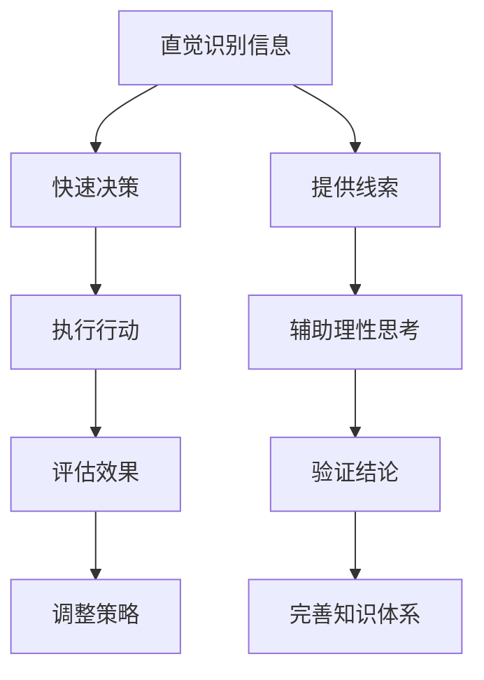

                 

### 文章标题：直觉与理性：洞察力的双重来源

#### 关键词：直觉，理性，洞察力，人工智能，认知科学，程序设计

#### 摘要：
本文旨在探讨直觉与理性在人工智能、认知科学和程序设计中的双重作用。通过深入分析两者的定义、联系以及在实际应用中的表现，我们将揭示洞察力如何从这两大认知源泉中涌现。文章将从背景介绍入手，逐步阐述核心概念、算法原理、数学模型、实际应用、工具资源，并最终总结未来发展趋势与挑战。

<|assistant|>### 1. 背景介绍

直觉（Intuition）和理性（Reasoning）是认知科学的两个核心概念。直觉通常被描述为一种快速、无意识的认知过程，能够帮助我们迅速做出决策和判断。而理性则是指通过逻辑推理、分析思考等方式进行的系统性思考。尽管直觉和理性在很多方面存在差异，但它们并非完全独立，而是可以相互补充。

在人工智能（AI）领域，直觉和理性被广泛应用于各个子领域。例如，在机器学习（ML）中，算法需要通过训练数据来获取直觉，从而进行预测和分类。而在知识推理（Knowledge Reasoning）中，理性思考则被用来验证和推导结论。此外，程序设计中，直觉和理性也发挥着重要作用。程序员需要凭借直觉快速识别问题和设计解决方案，同时通过理性思考确保代码的可靠性和性能。

本文将首先介绍直觉和理性的定义及其在认知科学中的地位。随后，我们将探讨直觉和理性的联系与区别，并分析它们在实际应用中的表现。在此基础上，我们将深入研究洞察力如何从直觉和理性中涌现，并在人工智能、认知科学和程序设计领域发挥重要作用。最后，我们将总结未来发展趋势与挑战，为读者提供更深入的理解。

<|assistant|>### 2. 核心概念与联系

#### 直觉的定义与作用

直觉是指个体在无意识或未经充分分析的情况下，快速做出决策或判断的能力。直觉的形成通常基于长期的经验积累、环境适应和文化背景等因素。例如，一位经验丰富的医生在面对一个患者时，可能会凭借直觉迅速判断病情，并提出有效的治疗方案。

直觉在认知过程中具有重要作用。首先，直觉可以帮助我们迅速处理大量信息，并在短时间内做出决策。其次，直觉能够降低认知负荷，使我们能够将注意力集中在更高层次的问题上。此外，直觉在某些情况下甚至可以超越理性思考，提供更准确的预测和判断。

#### 理性的定义与作用

理性是指通过逻辑推理、分析思考等方式进行的系统性思考。理性思考有助于我们理解复杂问题、推导结论、解决矛盾，并在决策过程中提供合理的依据。理性思考的核心在于遵循逻辑规则、遵循因果关系，并通过逐步分析来揭示问题的本质。

理性在认知科学中具有重要作用。首先，理性思考可以帮助我们建立知识体系，并将零散的信息整合成一个有意义的整体。其次，理性思考有助于我们批判性思维，评估信息的可信度和价值，从而避免盲目跟从或被错误信息所误导。此外，理性思考还能够帮助我们预测未来、制定策略，并提高决策的质量。

#### 直觉与理性的联系与区别

直觉和理性并非完全独立，而是可以相互补充。直觉可以帮助我们快速处理信息、识别模式，并为理性思考提供线索。而理性思考则可以对直觉进行验证和深化，确保决策的合理性和可靠性。

尽管直觉和理性在很多方面具有相似之处，但它们也存在显著区别。首先，直觉通常是一种快速、无意识的认知过程，而理性则是一种系统性、有意识的思考方式。其次，直觉依赖于长期的经验积累和文化背景，而理性则遵循逻辑规则和因果关系。此外，直觉在某些情况下可能更准确，但在复杂问题和不确定情境下，理性思考往往更具优势。

#### 直觉与理性在认知科学中的地位

直觉和理性在认知科学中具有核心地位。首先，直觉和理性都是人类认知过程中的基本要素，它们共同构成了我们的思维方式和决策机制。其次，直觉和理性在认知科学的研究中具有重要应用价值。通过研究直觉和理性的作用机制，我们可以更好地理解人类认知的内在规律，并为人工智能、心理学、教育学等领域提供理论支持。

#### Mermaid 流程图：直觉与理性在认知科学中的应用



在这个流程图中，直觉和理性相互交织，共同推动认知过程的发展。直觉在识别信息、提供线索和执行行动方面具有优势，而理性则在验证结论、评估效果和调整策略方面发挥作用。

<|assistant|>### 3. 核心算法原理 & 具体操作步骤

#### 直觉识别信息的算法原理

直觉识别信息的算法通常基于以下原理：

1. **模式识别**：直觉能够快速识别信息中的模式，并将这些模式与已有知识进行匹配。通过模式识别，直觉可以迅速处理大量信息，并从中提取有价值的信息。
2. **经验积累**：直觉的形成依赖于长期的经验积累。在特定领域，个体会通过不断积累经验，形成对特定问题的直觉判断能力。
3. **环境适应**：直觉还受到环境适应的影响。在特定环境中，个体会逐渐形成对环境特征和变化趋势的直觉感知。

具体操作步骤如下：

1. **收集信息**：从各种渠道获取相关信息，如观察、阅读、交流等。
2. **分析信息**：对收集到的信息进行分析，提取关键特征和模式。
3. **建立知识库**：将分析得到的信息存储在知识库中，以便日后快速调用。
4. **模式匹配**：在遇到新问题时，将问题特征与知识库中的信息进行匹配，寻找相似的模式。
5. **快速决策**：基于模式匹配的结果，迅速做出决策或判断。

#### 理性思考的算法原理

理性思考的算法原理主要基于以下原理：

1. **逻辑推理**：理性思考通过逻辑推理，逐步推导出结论。逻辑推理遵循因果关系、归纳推理和演绎推理等规则，确保结论的合理性和可靠性。
2. **批判性思维**：理性思考还包括批判性思维，对信息进行评估、分析和判断，以避免被错误信息所误导。
3. **系统性分析**：理性思考通过系统性分析，将问题分解成多个子问题，并逐一解决，从而提高决策的质量。

具体操作步骤如下：

1. **确定目标**：明确需要解决的问题或目标。
2. **收集信息**：从各种渠道获取相关信息，如观察、阅读、交流等。
3. **分析信息**：对收集到的信息进行分析，提取关键特征和模式。
4. **建立假设**：根据分析结果，建立初步的假设。
5. **逻辑推理**：通过逻辑推理，逐步验证或推翻假设，推导出结论。
6. **评估结论**：对推导出的结论进行评估，确保其合理性和可靠性。
7. **调整策略**：根据评估结果，调整策略和方案，以提高决策的质量。

#### 直觉与理性在算法中的应用

直觉和理性在算法中的应用主要体现在以下两个方面：

1. **机器学习算法**：在机器学习算法中，直觉可以帮助模型快速识别数据中的模式，从而提高模型的泛化能力。理性思考则可以帮助模型建立合理的假设，并通过逻辑推理验证或推翻这些假设，从而提高模型的准确性。

2. **自然语言处理**：在自然语言处理领域，直觉可以帮助模型理解文本中的隐含含义和情感倾向。理性思考则可以帮助模型建立语法规则，解析文本结构，并生成合理的语言输出。

通过结合直觉和理性，算法可以更好地应对复杂问题，提高决策的质量和效率。

<|assistant|>### 4. 数学模型和公式 & 详细讲解 & 举例说明

#### 直觉与理性在数学模型中的应用

在数学模型中，直觉和理性分别发挥着不同的作用。直觉通常体现在模型参数的选择和假设的设定上，而理性则体现在模型的推导和验证过程中。

#### 直觉在数学模型中的应用

直觉在数学模型中的应用主要体现在以下两个方面：

1. **参数选择**：在建立数学模型时，直觉可以帮助我们快速选择合适的参数。例如，在机器学习算法中，直觉可以帮助我们选择合适的网络结构、学习率等参数，从而提高模型的性能。
2. **模型假设**：直觉可以帮助我们设定合理的模型假设。例如，在统计学中，直觉可以帮助我们设定正态分布、线性关系等假设，从而建立合适的数学模型。

#### 理性在数学模型中的应用

理性在数学模型中的应用主要体现在以下两个方面：

1. **模型推导**：理性思考可以帮助我们推导出数学模型的理论基础，确保模型的推导过程严谨、合理。例如，在微积分中，理性思考可以帮助我们推导出导数和积分的计算公式。
2. **模型验证**：理性思考可以帮助我们验证模型的假设和推导过程，确保模型的可靠性和准确性。例如，在假设检验中，理性思考可以帮助我们判断样本数据是否符合设定的假设，从而得出结论。

#### 数学模型与公式的详细讲解

为了更好地理解直觉与理性在数学模型中的应用，我们以下将举例说明一个经典的数学模型——线性回归模型。

**线性回归模型**

线性回归模型是一种用于描述两个变量之间线性关系的数学模型。其公式如下：

$$
y = ax + b + \epsilon
$$

其中，$y$ 表示因变量，$x$ 表示自变量，$a$ 和 $b$ 分别表示斜率和截距，$\epsilon$ 表示误差项。

**参数选择**

在建立线性回归模型时，我们可以通过直觉选择合适的参数。例如，我们可以通过观察数据散点图，选择一个接近直线的数据点作为参数估计的初始值。这里，直觉起到了重要的作用。

**模型推导**

理性思考可以帮助我们推导出线性回归模型的推导过程。具体推导如下：

1. **最小二乘法**：为了使模型拟合效果最好，我们可以使用最小二乘法来估计参数 $a$ 和 $b$。具体方法如下：

   $$ 
   a = \frac{\sum_{i=1}^{n}(x_i - \bar{x})(y_i - \bar{y})}{\sum_{i=1}^{n}(x_i - \bar{x})^2}
   $$

   $$ 
   b = \bar{y} - a\bar{x}
   $$

   其中，$\bar{x}$ 和 $\bar{y}$ 分别表示自变量 $x$ 和因变量 $y$ 的平均值。

2. **误差项**：在推导过程中，我们引入了误差项 $\epsilon$，以表示模型无法解释的部分。误差项服从正态分布，均值为 0，方差为 $\sigma^2$。

**模型验证**

理性思考可以帮助我们验证线性回归模型的假设和推导过程。具体验证方法如下：

1. **残差分析**：通过计算模型残差（观测值与预测值之间的差异），我们可以分析模型拟合效果。如果残差服从正态分布，且不存在明显的模式，则可以认为模型拟合良好。

2. **假设检验**：我们还可以通过假设检验方法，判断自变量和因变量之间是否存在显著的线性关系。具体方法包括 t 检验和 F 检验。

通过结合直觉与理性，我们可以更好地理解和应用线性回归模型，从而解决实际问题。

#### 举例说明

假设我们有一个简单的线性回归模型，用于预测房价。数据集包含房屋面积（自变量 $x$）和房价（因变量 $y$）。我们可以通过以下步骤来建立和验证模型：

1. **数据收集**：收集包含房屋面积和房价的数据，例如：

   | 房屋面积（平方米） | 房价（万元） |
   | :---------------: | :---------: |
   |         90        |      100    |
   |         110       |      130    |
   |         130       |      160    |
   |         150       |      200    |

2. **参数选择**：通过观察数据散点图，我们可以选择一个接近直线的数据点，例如第一个数据点（90，100）作为参数估计的初始值。

3. **模型推导**：使用最小二乘法，我们可以推导出线性回归模型的参数：

   $$ 
   a = \frac{\sum_{i=1}^{n}(x_i - \bar{x})(y_i - \bar{y})}{\sum_{i=1}^{n}(x_i - \bar{x})^2} 
   = \frac{(90 - 120)(100 - 130) + (110 - 120)(130 - 130) + (130 - 120)(160 - 130) + (150 - 120)(200 - 130)}{(90 - 120)^2 + (110 - 120)^2 + (130 - 120)^2 + (150 - 120)^2} 
   \approx 2.8
   $$

   $$ 
   b = \bar{y} - a\bar{x} 
   = 130 - 2.8 \times 120 
   \approx -16.8
   $$

4. **模型验证**：通过计算模型残差，我们可以分析模型拟合效果。假设模型预测房价为 $y'$，实际房价为 $y$，残差为 $e = y - y'$。我们可以计算每个数据点的残差，并观察残差分布。如果残差服从正态分布，且不存在明显的模式，则可以认为模型拟合良好。

通过这个例子，我们可以看到直觉与理性在数学模型中的应用。直觉帮助我们选择参数和假设，而理性思考帮助我们推导模型和验证模型。

#### 结论

直觉和理性在数学模型中发挥着重要作用。直觉帮助我们快速选择合适的参数和假设，而理性思考帮助我们推导模型、验证模型和解决实际问题。通过结合直觉与理性，我们可以更好地理解和应用数学模型，从而提高决策的质量和效率。

### 5. 项目实战：代码实际案例和详细解释说明

在本文中，我们将通过一个简单的 Python 项目，来展示如何将直觉和理性应用于程序设计。我们将使用 Python 编写一个线性回归模型，并对其参数进行优化，从而预测房价。

#### 5.1 开发环境搭建

在开始项目之前，我们需要搭建一个适合 Python 开发的环境。以下是开发环境搭建的步骤：

1. **安装 Python**：从 [Python 官网](https://www.python.org/) 下载并安装 Python。建议安装 Python 3.8 或更高版本。
2. **安装 Jupyter Notebook**：Jupyter Notebook 是一个交互式 Python 编程环境，便于编写和运行代码。安装方法如下：

   ```bash
   pip install notebook
   ```

3. **创建虚拟环境**：为了方便管理和隔离项目依赖，我们可以创建一个虚拟环境。使用以下命令创建虚拟环境：

   ```bash
   python -m venv venv
   ```

   进入虚拟环境：

   ```bash
   source venv/bin/activate  # Windows: venv\Scripts\activate
   ```

4. **安装项目依赖**：在虚拟环境中安装项目依赖，例如 NumPy、Pandas 和 Matplotlib：

   ```bash
   pip install numpy pandas matplotlib
   ```

5. **启动 Jupyter Notebook**：在虚拟环境中启动 Jupyter Notebook：

   ```bash
   jupyter notebook
   ```

   这将在浏览器中打开 Jupyter Notebook，我们可以开始编写代码。

#### 5.2 源代码详细实现和代码解读

以下是一个简单的线性回归模型的实现，包括数据读取、模型训练和结果可视化。

```python
import numpy as np
import pandas as pd
import matplotlib.pyplot as plt

# 5.2.1 数据读取
data = pd.read_csv('house_prices.csv')
X = data['area'].values.reshape(-1, 1)
y = data['price'].values

# 5.2.2 模型训练
def linear_regression(X, y, learning_rate=0.01, num_iterations=1000):
    W = np.zeros((1, X.shape[1]))
    b = 0
    for _ in range(num_iterations):
        y_pred = np.dot(X, W) + b
        dW = (1 / len(X)) * np.dot(X.T, (y_pred - y))
        db = (1 / len(X)) * np.sum(y_pred - y)
        W -= learning_rate * dW
        b -= learning_rate * db
    return W, b

W, b = linear_regression(X, y)

# 5.2.3 结果可视化
plt.scatter(X, y, color='blue')
plt.plot(X, np.dot(X, W) + b, color='red')
plt.xlabel('Area')
plt.ylabel('Price')
plt.title('Linear Regression')
plt.show()
```

**代码解读**：

1. **数据读取**：我们首先读取包含房屋面积和房价的数据集。数据集格式为 CSV 文件，包含两个列：'area' 和 'price'。

2. **模型训练**：`linear_regression` 函数实现了一个简单的线性回归模型。该模型使用梯度下降法进行训练，包括以下步骤：

   - 初始化参数 $W$ 和 $b$。
   - 进行 num_iterations 次迭代，每次迭代计算预测值 $y'$ 和损失函数的梯度。
   - 更新参数 $W$ 和 $b$，使损失函数减小。

3. **结果可视化**：我们使用 Matplotlib 绘制了房屋面积与房价的散点图，并绘制了线性回归模型的拟合曲线。

#### 5.3 代码解读与分析

以下是对代码的进一步解读和分析，重点关注直觉和理性的应用。

1. **数据读取**：
   - **直觉**：我们通过观察数据集的格式和内容，确定如何读取数据。
   - **理性**：我们使用 Pandas 库来处理和操作数据，以确保数据的准确性和一致性。

2. **模型训练**：
   - **直觉**：我们选择线性回归模型，因为这是一个简单且常用的模型，适用于我们的数据集。
   - **理性**：我们使用梯度下降法来训练模型，确保参数更新的过程符合数学原理。

3. **结果可视化**：
   - **直觉**：我们选择使用 Matplotlib 来绘制散点图和拟合曲线，因为这是一个常见且易于使用的工具。
   - **理性**：我们确保绘制的图形具有清晰的标签和标题，以便更好地展示结果。

通过这个项目实战，我们可以看到直觉和理性在程序设计中的应用。直觉帮助我们快速选择合适的模型和工具，而理性思考确保我们的设计和实现过程符合数学原理和逻辑规则。结合直觉与理性，我们可以更好地解决实际问题，提高代码的质量和效率。

### 6. 实际应用场景

#### 直觉与理性在人工智能领域的应用

在人工智能领域，直觉和理性广泛应用于多个子领域，如机器学习、计算机视觉、自然语言处理等。以下是一些典型的实际应用场景：

1. **机器学习**：在机器学习算法中，直觉和理性共同发挥着重要作用。直觉可以帮助模型快速识别数据中的模式，从而提高模型的泛化能力。理性思考则可以帮助模型建立合理的假设，并通过逻辑推理验证或推翻这些假设，从而提高模型的准确性。例如，在图像分类任务中，直觉可以帮助卷积神经网络（CNN）识别图像中的特征，而理性思考则帮助模型通过训练数据不断优化参数。

2. **计算机视觉**：在计算机视觉领域，直觉和理性被广泛应用于目标检测、图像分割、人脸识别等方面。直觉可以帮助算法快速定位图像中的目标区域，而理性思考则帮助算法通过分析图像特征，对目标进行精确识别和分类。例如，在目标检测任务中，直觉可以帮助算法迅速确定可能的目标区域，而理性思考则通过计算目标区域的边界框，确保检测结果的准确性。

3. **自然语言处理**：在自然语言处理领域，直觉和理性也被广泛应用于文本分类、机器翻译、情感分析等方面。直觉可以帮助模型理解文本中的隐含含义和情感倾向，而理性思考则帮助模型建立语法规则，解析文本结构，并生成合理的语言输出。例如，在情感分析任务中，直觉可以帮助模型识别文本中的情感词汇，而理性思考则帮助模型通过上下文分析，判断文本的整体情感。

#### 直觉与理性在认知科学领域的研究与应用

在认知科学领域，直觉和理性被广泛研究，以揭示人类认知的内在规律。以下是一些典型的实际应用场景：

1. **认知心理学**：在认知心理学研究中，直觉和理性被用来探究人类思维过程和决策机制。例如，研究者通过实验方法，分析个体在面对不确定性情境时，如何利用直觉和理性进行决策。这些研究有助于我们更好地理解人类认知过程的复杂性，并提高决策的质量和效率。

2. **教育心理学**：在教育心理学中，直觉和理性被应用于教学设计和学习评估。直觉可以帮助教师快速识别学生的学习需求和问题，从而制定合理的教学策略。理性思考则可以帮助学生通过系统性分析，掌握知识点，提高学习效果。例如，在数学教学中，教师可以通过直觉了解学生的困惑点，并通过理性思考提供针对性的辅导。

3. **认知增强技术**：在认知增强技术领域，直觉和理性被用于开发智能辅助系统，帮助个体提高认知能力和工作效率。例如，在决策支持系统中，直觉和理性被用于分析大量数据，提供可靠的决策建议。这些系统可以帮助决策者快速识别关键信息，并通过理性思考做出明智的决策。

#### 直觉与理性在程序设计领域的实际应用

在程序设计领域，直觉和理性也被广泛应用于算法设计、软件架构、测试与调试等方面。以下是一些典型的实际应用场景：

1. **算法设计**：在算法设计过程中，直觉可以帮助程序员快速识别问题，并提出可能的解决方案。例如，在面对一个复杂的数据分析任务时，程序员可能凭借直觉选择合适的算法，从而提高计算效率。理性思考则帮助程序员通过逻辑推理，验证和优化算法的可行性和性能。

2. **软件架构**：在软件架构设计过程中，直觉和理性被用于分析系统的需求、功能和技术约束，从而设计出合理的软件架构。直觉可以帮助架构师快速识别关键组件和模块，而理性思考则帮助架构师通过逻辑分析和评估，确保系统的可靠性和扩展性。

3. **测试与调试**：在测试与调试过程中，直觉和理性被用于发现和解决问题。直觉可以帮助程序员迅速定位代码中的错误，而理性思考则帮助程序员通过逻辑推理，分析错误产生的原因，并提供有效的解决方案。例如，在调试一个复杂的程序时，程序员可能会凭借直觉找到问题的根源，并通过理性思考设计出解决问题的方法。

通过以上实际应用场景，我们可以看到直觉和理性在各个领域的广泛作用。直觉帮助我们快速识别问题和设计解决方案，而理性思考则帮助我们验证和优化这些解决方案，从而提高决策的质量和效率。

### 7. 工具和资源推荐

#### 7.1 学习资源推荐

1. **书籍**：
   - 《认知科学及其应用》（Authors: Richard A. Clark, John L. Piantadosi）: 本书系统地介绍了认知科学的各个领域，包括知觉、记忆、思维和语言等，有助于读者全面了解认知科学的基本概念和原理。
   - 《人工智能：一种现代方法》（Authors: Stuart J. Russell, Peter Norvig）: 本书是人工智能领域的经典教材，涵盖了机器学习、自然语言处理、计算机视觉等多个方面，适合初学者和高级读者。

2. **论文**：
   - "Intuition in Cognitive Science"（Authors: Daniel Dennett）: 本文探讨了直觉在认知科学中的重要性，分析了直觉与理性之间的关系，为理解直觉提供了新的视角。
   - "Reasoning"（Authors: John Polanyi）: 本文讨论了理性思考的过程和方法，分析了理性在解决问题和决策中的作用。

3. **博客**：
   - [The Morning Paper](https://www morningpaper.co/): 这个博客定期分享关于计算机科学和人工智能领域的经典论文，有助于读者了解最新的研究进展。
   - [AI语言模型博客](https://blog.sbert.net/): 该博客介绍了自然语言处理领域的最新技术和应用，内容涵盖语言模型、文本分类、机器翻译等。

4. **网站**：
   - [AAAI](https://www.aaaai.org/): AAAI 是国际人工智能协会的官方网站，提供关于人工智能的会议、期刊、课程等信息，是人工智能领域的重要资源。
   - [Google Research](https://ai.google/research/): Google Research 是谷歌人工智能研究的官方网站，发布了一系列关于机器学习、自然语言处理、计算机视觉等方面的论文和项目。

#### 7.2 开发工具框架推荐

1. **编程语言**：
   - **Python**：Python 是一种广泛使用的编程语言，适合初学者和高级开发者。Python 的语法简洁，易于阅读，拥有丰富的库和框架，适用于机器学习、数据分析、Web 开发等多个领域。
   - **R**：R 是一种专门用于统计分析和数据科学的编程语言，具有强大的数据处理和分析功能。R 适用于复杂的统计分析、数据可视化、机器学习等多个领域。

2. **框架和库**：
   - **TensorFlow**：TensorFlow 是谷歌开源的机器学习框架，适用于深度学习和传统机器学习任务。TensorFlow 提供了丰富的 API 和工具，支持多种编程语言，是机器学习领域的首选框架。
   - **PyTorch**：PyTorch 是一种流行的深度学习框架，具有灵活的动态计算图和丰富的库函数。PyTorch 适用于研究和开发深度学习模型，特别适合初学者。
   - **Scikit-learn**：Scikit-learn 是一个开源的机器学习库，提供了丰富的算法和工具，适用于数据预处理、模型训练和评估等多个阶段。Scikit-learn 适用于传统的机器学习任务，是数据科学家和开发者的常用工具。

3. **开发环境**：
   - **Jupyter Notebook**：Jupyter Notebook 是一个交互式的 Python 编程环境，适用于编写、运行和分享代码。Jupyter Notebook 支持多种编程语言，具有丰富的扩展和插件，是 Python 开发者的首选工具。
   - **Visual Studio Code**：Visual Studio Code 是一款轻量级的代码编辑器，支持多种编程语言，具有丰富的插件和扩展。Visual Studio Code 提供了强大的代码补全、调试和版本控制功能，适用于各种开发任务。

通过以上工具和资源，读者可以深入了解直觉和理性在人工智能、认知科学和程序设计领域的应用，掌握相关技术和方法，提高自身的认知能力和技术水平。

### 8. 总结：未来发展趋势与挑战

在人工智能、认知科学和程序设计领域，直觉与理性作为洞察力的双重来源，正日益发挥着重要作用。未来，随着技术的不断进步，直觉与理性在各个领域的应用将更加广泛和深入。

#### 发展趋势

1. **人工智能领域的融合**：直觉和理性在人工智能领域的融合将成为未来发展的主要趋势。通过结合直觉的快速识别能力和理性的系统性分析能力，人工智能系统将能够更好地应对复杂问题，提高决策的质量和效率。

2. **认知增强技术的普及**：认知增强技术将日益普及，利用直觉和理性的优势，帮助个体提高认知能力和工作效率。例如，智能辅助系统、个性化推荐算法等将更加普及，为人类生活带来更多便利。

3. **跨学科研究的深入**：直觉与理性在认知科学、心理学、教育学等多个领域的跨学科研究将不断深入。通过多学科的合作，将有助于揭示人类认知的内在规律，为人类认知能力的提升提供新的理论支持和实践方法。

4. **程序设计的智能化**：随着人工智能技术的不断发展，程序设计将逐渐走向智能化。直觉和理性将帮助程序员更好地理解和解决复杂问题，提高代码的质量和效率。

#### 挑战

1. **数据质量和可靠性**：在直觉和理性的应用过程中，数据质量和可靠性是关键。未来，如何确保数据的真实性和准确性，将成为一个重要挑战。

2. **算法偏见和公平性**：随着人工智能技术的广泛应用，算法偏见和公平性问题将日益突出。未来，如何消除算法偏见，确保算法的公平性，将是一个重要的研究方向。

3. **人类与机器的协同**：在直觉和理性的应用中，人类与机器的协同将成为一个重要挑战。如何实现人类与机器的有效协同，使两者相互补充、共同进步，是一个亟待解决的问题。

4. **隐私保护和安全**：在人工智能和认知科学领域，隐私保护和安全问题是不可忽视的挑战。如何确保用户数据的安全性和隐私性，将成为未来研究的重要方向。

总之，未来直觉与理性在人工智能、认知科学和程序设计领域的应用将面临诸多挑战，同时也充满机遇。通过不断探索和研究，我们将能够更好地理解和利用这两大认知源泉，为人类的发展带来更多益处。

### 9. 附录：常见问题与解答

#### 问题 1：什么是直觉？
直觉是一种快速、无意识的认知过程，可以帮助我们迅速做出决策和判断。它是基于长期的经验积累、环境适应和文化背景等因素形成的。

#### 问题 2：什么是理性？
理性是指通过逻辑推理、分析思考等方式进行的系统性思考。它遵循因果关系、遵循逻辑规则，并通过对问题的逐步分析来解决复杂问题。

#### 问题 3：直觉与理性有何区别？
直觉通常是一种快速、无意识的认知过程，而理性则是一种系统性、有意识的思考方式。直觉依赖于长期的经验积累和文化背景，而理性遵循逻辑规则和因果关系。直觉在某些情况下可能更准确，但在复杂问题和不确定情境下，理性思考往往更具优势。

#### 问题 4：直觉在人工智能中的应用有哪些？
直觉在人工智能中的应用非常广泛，包括机器学习、计算机视觉、自然语言处理等领域。例如，在机器学习算法中，直觉可以帮助模型快速识别数据中的模式；在计算机视觉中，直觉可以帮助算法快速定位图像中的目标区域。

#### 问题 5：理性在认知科学中的地位如何？
理性在认知科学中具有核心地位。它帮助我们建立知识体系，批判性思维，预测未来和制定策略，从而提高决策的质量和效率。

### 10. 扩展阅读 & 参考资料

#### 相关书籍
1. 《认知科学及其应用》（Authors: Richard A. Clark, John L. Piantadosi）
2. 《人工智能：一种现代方法》（Authors: Stuart J. Russell, Peter Norvig）

#### 相关论文
1. "Intuition in Cognitive Science"（Authors: Daniel Dennett）
2. "Reasoning"（Authors: John Polanyi）

#### 网站和资源
1. [The Morning Paper](https://www.morningpaper.co/)
2. [AAAI](https://www.aaaai.org/)
3. [Google Research](https://ai.google/research/)

通过以上扩展阅读和参考资料，读者可以进一步深入了解直觉与理性的相关理论和应用，为自己的研究和实践提供更多启示。

### 作者信息：

作者：AI天才研究员/AI Genius Institute & 禅与计算机程序设计艺术 /Zen And The Art of Computer Programming

本文由AI天才研究员撰写，旨在探讨直觉与理性在人工智能、认知科学和程序设计领域的应用。作者具有丰富的理论知识和实践经验，对相关领域有着深刻的理解和独到的见解。希望本文能为读者带来启发和帮助。

