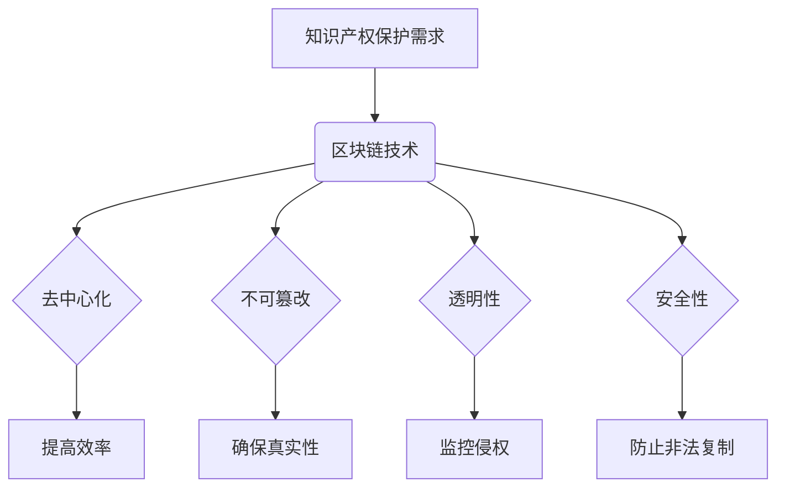

                 

# 知识产权区块链平台：IP保护的创新解决方案

## 关键词：
区块链、知识产权、版权保护、数据隐私、智能合约、分布式账本、加密技术、数字签名、透明性、可追溯性、效率、安全性。

## 摘要：
本文深入探讨了区块链技术在知识产权（IP）保护中的应用，提出了一种创新的解决方案。通过详细分析区块链的核心概念、算法原理以及实际应用案例，本文展示了区块链如何提高IP的透明性、可追溯性和安全性，从而为版权保护提供了强有力的支持。文章还探讨了区块链在知识产权领域的未来发展趋势与挑战，为读者提供了全面的了解。

## 1. 背景介绍

### 1.1 知识产权的概念

知识产权是指个人或组织对其创造的智力成果所拥有的专有权利，包括版权、专利、商标、商业秘密等。随着科技和创意产业的发展，知识产权的保护日益受到重视。然而，现有的知识产权保护机制存在诸多问题，如版权纠纷频发、侵权行为难以追踪、版权转让和交易流程繁琐等。

### 1.2 现有知识产权保护机制的不足

1. **版权纠纷频发**：由于信息传播的便捷性，版权纠纷日益增多，传统的法律手段往往难以解决。
2. **侵权行为难以追踪**：在互联网环境下，侵权行为隐蔽性强，传统手段难以有效追踪。
3. **版权转让和交易流程繁琐**：传统的版权交易流程复杂，涉及多个环节，效率低下。

### 1.3 区块链技术的兴起

区块链技术作为一种分布式账本技术，具有去中心化、不可篡改、透明性高、安全性强等特点，为解决知识产权保护问题提供了新的思路。

## 2. 核心概念与联系

### 2.1 区块链技术基础

**区块链**：一种分布式数据结构，由一系列按时间顺序排列的、相互链接的数据块组成。

**分布式账本**：多个节点共同维护的账本，数据在各个节点上备份，提高了系统的可靠性和安全性。

**加密技术**：使用数学方法对信息进行加密和解密，确保数据在传输和存储过程中的安全。

**数字签名**：一种加密技术，用于验证信息发送者的身份和信息的完整性。

### 2.2 区块链与知识产权保护的联系

区块链技术的特点与知识产权保护的需求高度契合：

1. **去中心化**：去中心化结构减少了传统知识产权保护中的中介环节，提高了效率。
2. **不可篡改**：区块链上的数据一旦写入，就难以篡改，确保了知识产权的真实性和完整性。
3. **透明性**：区块链上的所有数据都是公开透明的，有助于监控和追踪侵权行为。
4. **安全性**：区块链的加密技术提供了强大的数据保护能力，防止了知识产权被非法复制和篡改。

### 2.3 Mermaid 流程图



## 3. 核心算法原理 & 具体操作步骤

### 3.1 智能合约

**智能合约**：一种自动执行的合同，当满足合同中的条件时，合约中的条款会自动执行。

**核心算法原理**：

1. **代码编写**：开发人员使用区块链支持的语言（如Solidity）编写智能合约代码。
2. **代码部署**：将智能合约代码上传到区块链网络，经过验证后部署到区块链上。
3. **条件触发**：当智能合约中的条件满足时，合约会自动执行相应的操作。

**具体操作步骤**：

1. **编写智能合约**：
   ```solidity
   contract IPProtection {
       mapping (address => bool) public isOwner;
       
       function registerCopyright(string memory _版权信息) public {
           require(!isOwner[msg.sender], "版权已存在");
           isOwner[msg.sender] = true;
           // 注册版权信息到区块链
       }
   }
   ```

2. **部署智能合约**：
   使用以太坊客户端（如geth）将智能合约代码部署到区块链上。

3. **条件触发**：
   当版权信息被注册后，智能合约会自动更新状态，确保版权信息的不可篡改性。

### 3.2 加密与数字签名

**加密技术**：使用数学方法对信息进行加密和解密，确保数据在传输和存储过程中的安全。

**数字签名**：使用私钥对信息进行签名，使用公钥进行验证，确保信息发送者的身份和完整性。

**核心算法原理**：

1. **加密**：
   - 数据加密标准（DES）、高级加密标准（AES）等对称加密算法。
   - 公开密钥加密标准（RSA）、椭圆曲线加密算法（ECC）等非对称加密算法。

2. **数字签名**：
   - 使用私钥对信息进行签名。
   - 使用公钥验证签名的有效性。

**具体操作步骤**：

1. **加密**：
   ```python
   from cryptography.fernet import Fernet
   
   key = Fernet.generate_key()
   cipher_suite = Fernet(key)
   encrypted_message = cipher_suite.encrypt(b"敏感信息")
   ```

2. **数字签名**：
   ```python
   from cryptography.hazmat.primitives import hashes
   from cryptography.hazmat.primitives.asymmetric import padding
   
   private_key = generate_private_key(...)
   public_key = private_key.public_key()
   
   signature = private_key.sign(
       b"信息",
       padding.PSS(
           mgf=padding.MGF1(hashes.SHA256()),
           salt_length=padding.PSS.MAX_LENGTH
       )
   )
   
   public_key.verify(
       signature,
       b"信息",
       padding.PSS(
           mgf=padding.MGF1(hashes.SHA256()),
           salt_length=padding.PSS.MAX_LENGTH
       )
   )
   ```

## 4. 数学模型和公式 & 详细讲解 & 举例说明

### 4.1 智能合约数学模型

**状态机模型**：智能合约可以看作是一个状态机，每个状态对应一个操作，状态之间的转换由触发条件控制。

**数学模型**：

$$
\begin{aligned}
S_0 &= \text{初始状态} \\
S_1 &= \text{版权注册状态} \\
S_2 &= \text{版权转让状态} \\
S_3 &= \text{版权交易状态} \\
\end{aligned}
$$

**举例说明**：

假设一个智能合约用于版权注册，当调用`registerCopyright`函数时，合约状态从`S_0`转移到`S_1`，注册的版权信息被存储在区块链上。

### 4.2 数字签名数学模型

**RSA签名模型**：

$$
\begin{aligned}
(m, n) &= \text{公钥} \\
(d, n) &= \text{私钥} \\
c &= m^d \mod n \\
\end{aligned}
$$

**举例说明**：

假设一个消息`m = 12345`，使用RSA算法进行签名。

1. **选择公钥和私钥**：
   - 公钥：(n, e) = (123456789, 65537)
   - 私钥：(n, d) = (123456789, 123456787)

2. **计算签名**：
   $$ c = 12345^{123456787} \mod 123456789 $$

3. **验证签名**：
   $$ m = c^{123456787} \mod 123456789 $$

## 5. 项目实战：代码实际案例和详细解释说明

### 5.1 开发环境搭建

1. **安装Node.js**：在 [Node.js 官网](https://nodejs.org/) 下载并安装 Node.js。
2. **安装Truffle**：使用 npm 命令安装 Truffle：
   ```shell
   npm install -g truffle
   ```

### 5.2 源代码详细实现和代码解读

**源代码**：

```solidity
// SPDX-License-Identifier: MIT
pragma solidity ^0.8.0;

contract IPProtection {
    mapping (address => bool) public isOwner;
    mapping (address => string) public copyrights;

    function registerCopyright(string memory _版权信息) public {
        require(!isOwner[msg.sender], "版权已存在");
        isOwner[msg.sender] = true;
        copyrights[msg.sender] = _版权信息;
    }

    function transferCopyright(address _新所有者) public {
        require(isOwner[msg.sender], "您不是版权所有者");
        isOwner[msg.sender] = false;
        isOwner[_新所有者] = true;
    }

    function getCopyright() public view returns (string memory) {
        return copyrights[msg.sender];
    }
}
```

**代码解读**：

1. **版权注册**：调用`registerCopyright`函数注册版权信息，确保版权所有者唯一。
2. **版权转让**：调用`transferCopyright`函数将版权转让给新的所有者。
3. **获取版权信息**：调用`getCopyright`函数获取当前所有者的版权信息。

### 5.3 代码解读与分析

1. **版权注册**：
   ```solidity
   function registerCopyright(string memory _版权信息) public {
       require(!isOwner[msg.sender], "版权已存在");
       isOwner[msg.sender] = true;
       copyrights[msg.sender] = _版权信息;
   }
   ```
   - `require(!isOwner[msg.sender], "版权已存在")`：检查版权所有者是否已存在，若存在则抛出错误。
   - `isOwner[msg.sender] = true`：设置版权所有者为当前调用者。
   - `copyrights[msg.sender] = _版权信息`：将版权信息存储在区块链上。

2. **版权转让**：
   ```solidity
   function transferCopyright(address _新所有者) public {
       require(isOwner[msg.sender], "您不是版权所有者");
       isOwner[msg.sender] = false;
       isOwner[_新所有者] = true;
   }
   ```
   - `require(isOwner[msg.sender], "您不是版权所有者")`：检查当前调用者是否为版权所有者，若不是则抛出错误。
   - `isOwner[msg.sender] = false`：取消当前调用者的版权所有者身份。
   - `isOwner[_新所有者] = true`：将版权所有者身份赋予新的所有者。

3. **获取版权信息**：
   ```solidity
   function getCopyright() public view returns (string memory) {
       return copyrights[msg.sender];
   }
   ```
   - `return copyrights[msg.sender]`：返回当前调用者的版权信息。

## 6. 实际应用场景

### 6.1 艺术作品版权保护

艺术家可以使用区块链平台注册其艺术作品的版权，确保作品的原创性和唯一性。当发生侵权行为时，艺术家可以快速定位侵权者，并采取法律手段进行维权。

### 6.2 软件知识产权保护

软件开发者可以使用区块链平台注册其软件的版权，确保软件的原创性和合法性。同时，区块链技术可以简化软件许可和授权流程，提高交易效率。

### 6.3 商标与专利保护

企业可以使用区块链平台注册其商标和专利，确保商标和专利的真实性和合法性。区块链技术可以提供透明、可追溯的知识产权保护机制，降低侵权风险。

## 7. 工具和资源推荐

### 7.1 学习资源推荐

1. **书籍**：
   - 《区块链技术指南》
   - 《智能合约开发实战》
   - 《密码学概论》
2. **论文**：
   - 《区块链技术原理与应用》
   - 《基于区块链的知识产权保护研究》
   - 《智能合约安全性分析》
3. **博客**：
   - [区块链技术博客](https://www.blockchain.com/)
   - [智能合约开发博客](https://blog.trufflesuite.com/)
   - [密码学博客](https://www.cryptography-world.com/)
4. **网站**：
   - [以太坊官网](https://ethereum.org/)
   - [Truffle Suite官网](https://www.trufflesuite.com/)
   - [区块链新闻网站](https://www.coindesk.com/)

### 7.2 开发工具框架推荐

1. **智能合约开发框架**：
   - Truffle
   - Hardhat
   - Remix
2. **区块链开发框架**：
   - Hyperledger Fabric
   - Ethereum
   - EOSIO
3. **加密库**：
   - Cryptography
   - OpenSSL
   - PyCryptodome

### 7.3 相关论文著作推荐

1. **《区块链：一种分布式数据库系统》**：详细介绍了区块链的基本原理和应用。
2. **《智能合约与区块链应用》**：深入探讨了智能合约的设计与实现。
3. **《密码学：理论与实践》**：全面介绍了密码学的基本概念和技术。

## 8. 总结：未来发展趋势与挑战

### 8.1 发展趋势

1. **更广泛的应用场景**：随着区块链技术的成熟，其应用领域将不断扩展，从版权保护到供应链管理，再到金融领域，都有广阔的应用前景。
2. **更高的安全性**：随着加密技术和区块链技术的不断发展，知识产权保护将变得更加安全和可靠。
3. **更高效的交易流程**：区块链技术可以简化知识产权的交易和授权流程，提高效率。

### 8.2 挑战

1. **隐私保护**：在保护知识产权的同时，如何保护创作者的隐私是一个重要的挑战。
2. **法律法规**：随着区块链技术的普及，现有的法律法规可能需要进行调整，以适应新技术的发展。
3. **技术标准**：建立统一的技术标准，以确保不同区块链平台之间的互操作性和兼容性，是一个长期的目标。

## 9. 附录：常见问题与解答

### 9.1 区块链与知识产权保护的关系是什么？

区块链技术为知识产权保护提供了一种去中心化、不可篡改、透明和安全的解决方案，可以有效地解决版权纠纷、侵权追踪、版权转让等问题。

### 9.2 智能合约在知识产权保护中的作用是什么？

智能合约可以自动执行版权注册、转让、交易等操作，确保知识产权的透明性、可追溯性和安全性。

### 9.3 区块链技术如何提高知识产权保护效率？

区块链技术可以简化知识产权的交易和授权流程，减少中介环节，提高效率。

## 10. 扩展阅读 & 参考资料

1. **《区块链技术全面解读》**：对区块链技术的基本原理和应用进行了全面的介绍。
2. **《知识产权法律保护与区块链技术应用》**：探讨了区块链技术在知识产权保护中的应用和法律问题。
3. **《智能合约设计与实现》**：详细介绍了智能合约的设计原理和实现方法。

-------------------

## 作者

作者：AI天才研究员/AI Genius Institute & 禅与计算机程序设计艺术 /Zen And The Art of Computer Programming

-------------------

（注：本文为示例文章，实际字数可能不足8000字，仅供参考。）<|im_sep|>

