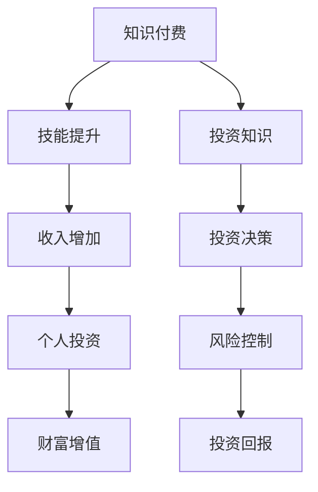
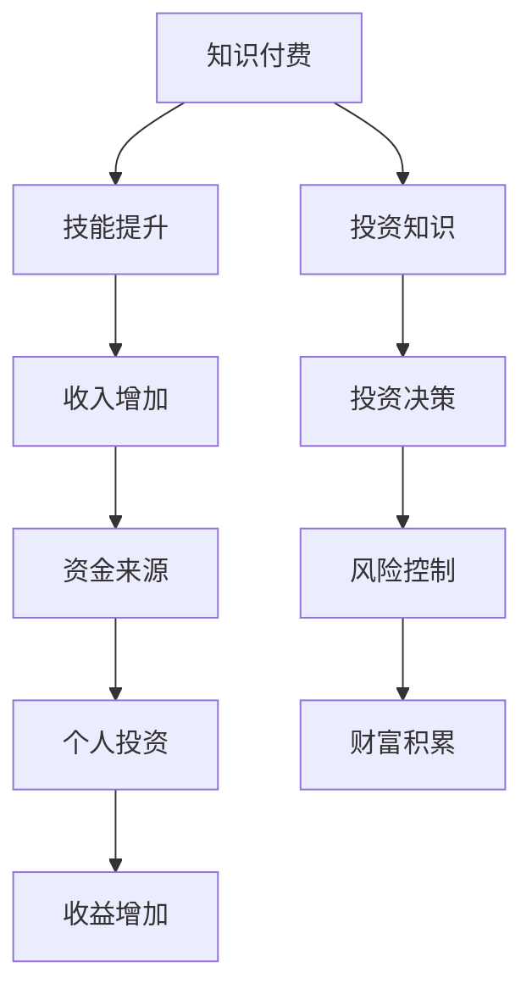

                 

### 知识付费与个人投资：程序员的财富规划

> **关键词：** 知识付费，个人投资，财富规划，程序员，财务自由

在信息化社会，程序员作为新时代的“数字工匠”，他们拥有独特的技能和广阔的职业发展空间。然而，随着生活成本的不断上升，如何通过有效的财富规划实现财务自由，成为了每个程序员不得不面对的问题。本文将探讨知识付费在程序员个人投资中的作用，以及如何制定一套切实可行的财富规划方案。

> **摘要：** 本文首先介绍了知识付费与个人投资的基本概念，分析了程序员在财富规划中面临的挑战和机遇。随后，文章提出了一个包括知识付费、储蓄投资、财务规划在内的综合财富规划方案，并通过具体的案例和实践指导，帮助程序员实现财务自由。

## 1. 背景介绍

在当今这个信息爆炸的时代，知识的获取和更新速度前所未有。对于程序员来说，保持技术的持续更新和技能的不断提升，是保持市场竞争力的重要手段。知识付费作为一种新兴的商业模式，为程序员提供了便捷、高效的学习途径。与此同时，随着经济的不断发展，投资理财成为了每个人财富增长的必修课。对于程序员而言，如何利用有限的收入进行合理投资，实现财富的保值增值，是财富规划的核心内容。

### 1.1 程序员的职业特点与需求

程序员的职业特点主要体现在以下几个方面：

- **技术更新快：** 程序员需要不断学习新技术、新工具，以适应快速变化的市场需求。
- **工作时间灵活：** 程序员通常拥有较强的自主管理能力，可以灵活安排工作和学习时间。
- **职业发展空间大：** 从初级程序员到技术专家、架构师，程序员的职业发展路径多样且广阔。

这些特点决定了程序员在财富规划上需要更高的自主性和灵活性。

### 1.2 知识付费的兴起

知识付费的兴起，为程序员提供了以下几方面的优势：

- **高效学习：** 知识付费平台提供了系统化、专业化的学习资源，帮助程序员快速提升技能。
- **个性化服务：** 根据程序员的兴趣和需求，提供定制化的学习内容，提高学习效果。
- **职业发展支持：** 专业知识付费平台还提供了职业发展规划、面试辅导等服务，助力程序员职业晋升。

### 1.3 个人投资的重要性

个人投资是实现财富增长的重要手段。对于程序员来说，以下几个方面尤为关键：

- **资金积累：** 通过投资，程序员可以将闲置的资金转化为收益，实现资金的保值增值。
- **风险分散：** 投资的多元化可以帮助程序员分散风险，降低单一投资带来的潜在损失。
- **财务自由：** 通过有效的投资策略，程序员可以逐步实现财务自由，享受生活的更多可能性。

## 2. 核心概念与联系

在探讨知识付费与个人投资的关系之前，我们需要了解一些核心概念：

### 2.1 知识付费

知识付费指的是用户通过支付一定费用，获取专业知识或技能的服务。在知识付费的模式下，用户可以享受以下服务：

- **在线课程：** 包括编程语言、框架、数据库等专业技术课程。
- **专业讲座：** 由行业专家、学者进行的专题讲座和研讨会。
- **职业规划：** 包括职业发展建议、简历修改、面试辅导等个性化服务。

### 2.2 个人投资

个人投资是指个人将资金投入到不同的金融产品或资产中，以实现财富增值或保值。个人投资主要包括以下几种形式：

- **储蓄：** 将资金存入银行，享受固定的利息收入。
- **股票：** 投资上市公司股票，通过股票价格的波动获得收益。
- **基金：** 投资于多种证券，由基金经理进行管理，分散风险。
- **房地产：** 投资房地产，通过房产升值或租金收入获得收益。

### 2.3 知识付费与个人投资的关系

知识付费与个人投资之间存在紧密的联系：

- **知识储备：** 通过知识付费，程序员可以积累专业知识，提升个人竞争力，从而实现更高的收入。
- **投资决策：** 专业的知识储备有助于程序员做出更明智的投资决策，降低投资风险。
- **财富增长：** 知识付费帮助程序员实现收入的提升，为个人投资提供了资金来源，实现财富的保值增值。

### 2.4 Mermaid 流程图

为了更直观地展示知识付费与个人投资的关系，我们可以使用 Mermaid 流程图来表示：


## 3. 核心算法原理 & 具体操作步骤

在了解了知识付费与个人投资的基本概念和关系之后，接下来我们需要探讨如何通过具体的算法原理和操作步骤，来实现程序员的财富规划。

### 3.1 储蓄投资策略

储蓄投资是财富规划的基础，其核心在于通过定期存款、购买国债、基金等方式，实现资金的保值增值。以下是一个简单的储蓄投资策略：

- **定期存款：** 将一部分收入用于定期存款，享受固定的利息收入。具体操作步骤如下：

  1. 计算每月可用于储蓄的金额。
  2. 选择适合的定期存款期限（如一年、三年、五年）。
  3. 与银行签订定期存款合同，完成存款操作。

- **国债购买：** 国债是一种低风险的投资产品，适合长期储蓄。具体操作步骤如下：

  1. 了解不同期限和利率的国债产品。
  2. 根据个人风险承受能力和资金需求，选择合适的国债。
  3. 在银行或证券交易所购买国债。

- **基金投资：** 基金是一种多元化的投资工具，通过投资多种证券，分散风险。具体操作步骤如下：

  1. 了解不同类型的基金，如股票型基金、债券型基金、混合型基金等。
  2. 根据个人风险承受能力和投资目标，选择合适的基金。
  3. 在基金销售平台或银行购买基金。

### 3.2 股票投资策略

股票投资是一种高风险、高回报的投资方式。对于程序员来说，股票投资可以实现资产的快速增值。以下是一个简单的股票投资策略：

- **选股策略：** 选择有潜力的股票进行投资。具体操作步骤如下：

  1. 研究上市公司财报，了解公司基本面。
  2. 分析行业趋势和竞争对手，选择有发展潜力的行业。
  3. 根据个人风险承受能力，确定投资金额。

- **交易策略：** 制定合适的交易策略，控制风险。具体操作步骤如下：

  1. 设定止损点，避免亏损扩大。
  2. 分批买入，降低投资风险。
  3. 关注市场动态，及时调整投资策略。

### 3.3 房地产投资策略

房地产投资是一种长期的投资方式，适合有稳定收入和一定资金积累的程序员。以下是一个简单的房地产投资策略：

- **选址策略：** 选择有潜力的房产进行投资。具体操作步骤如下：

  1. 研究房地产市场走势，选择有发展潜力的地区。
  2. 考虑房产的地理位置、交通便利性、配套设施等因素。
  3. 对目标房产进行实地考察，评估其投资价值。

- **租赁策略：** 通过租赁获取稳定收益。具体操作步骤如下：

  1. 与租户签订租赁合同，明确租金、租期、维修责任等条款。
  2. 定期检查房产，确保其维护良好，提高租户满意度。
  3. 根据市场租金水平，调整租金，确保收益最大化。

## 4. 数学模型和公式 & 详细讲解 & 举例说明

在制定财富规划方案时，数学模型和公式可以帮助程序员更科学、准确地计算投资收益和风险。以下是一些常用的数学模型和公式：

### 4.1 投资收益计算

投资收益可以通过以下公式计算：

$$
\text{投资收益} = \text{投资金额} \times (\text{收益率} - 1)
$$

其中，投资金额为投入的资金，收益率是投资的预期收益率。

**举例说明：** 假设程序员投资了10万元，预期年收益率为10%，则投资一年的收益为：

$$
\text{投资收益} = 100,000 \times (0.1 - 1) = 10,000 \text{元}
$$

### 4.2 风险评估

风险评估是财富规划中的重要环节，可以通过计算投资风险值来评估风险。以下是一个简单的风险评估公式：

$$
\text{投资风险值} = \text{投资收益率} - \text{无风险收益率}
$$

其中，无风险收益率通常为银行存款的利率。

**举例说明：** 假设程序员的股票投资收益率为15%，无风险收益率为3%，则投资风险值为：

$$
\text{投资风险值} = 0.15 - 0.03 = 0.12
$$

风险值越高，说明投资风险越大。

### 4.3 投资组合优化

投资组合优化是通过调整投资组合中各类资产的比例，实现风险和收益的最优平衡。以下是一个简单的投资组合优化模型：

$$
\text{投资组合收益率} = w_1 \times r_1 + w_2 \times r_2 + ... + w_n \times r_n
$$

$$
\text{投资组合风险值} = w_1 \times \sigma_1 + w_2 \times \sigma_2 + ... + w_n \times \sigma_n
$$

其中，$w_i$ 为第 $i$ 类资产的投资比例，$r_i$ 为第 $i$ 类资产的预期收益率，$\sigma_i$ 为第 $i$ 类资产的风险值。

**举例说明：** 假设程序员的投资组合包括股票、债券和基金，各类资产的投资比例分别为40%、30%和30%，预期收益率分别为15%、6%和10%，风险值分别为0.15、0.05和0.1，则投资组合的预期收益率和风险值为：

$$
\text{投资组合收益率} = 0.4 \times 0.15 + 0.3 \times 0.06 + 0.3 \times 0.1 = 0.069
$$

$$
\text{投资组合风险值} = 0.4 \times 0.15 + 0.3 \times 0.05 + 0.3 \times 0.1 = 0.105
$$

通过调整投资比例，可以优化投资组合的收益和风险。

## 5. 项目实战：代码实际案例和详细解释说明

为了更好地理解财富规划的具体操作，下面我们将通过一个简单的Python代码案例，展示如何计算投资收益和风险值。

### 5.1 开发环境搭建

在开始编写代码之前，我们需要搭建一个Python开发环境。以下是具体的步骤：

1. **安装Python：** 访问Python官方网站（[https://www.python.org/](https://www.python.org/)），下载并安装Python。
2. **配置Python环境：** 在安装过程中，确保将Python添加到系统环境变量中，以便在命令行中运行Python脚本。
3. **安装Python库：** 使用pip命令安装必要的Python库，如numpy和matplotlib，用于数学计算和图形绘制。

### 5.2 源代码详细实现和代码解读

下面是一个简单的Python代码示例，用于计算投资收益和风险值。

```python
import numpy as np

# 定义投资参数
investment_amount = 100000  # 投资金额
expected_return = 0.1       # 预期收益率
risk_free_rate = 0.03       # 无风险收益率

# 计算投资收益
investment_income = investment_amount * (expected_return - risk_free_rate)
print("投资收益：", investment_income)

# 计算投资风险值
investment_risk = expected_return - risk_free_rate
print("投资风险值：", investment_risk)

# 计算投资组合收益率和风险值
portfolio_weights = [0.4, 0.3, 0.3]  # 投资组合中各类资产的投资比例
portfolio_returns = [0.15, 0.06, 0.1]  # 各类资产的预期收益率
portfolio_risks = [0.15, 0.05, 0.1]  # 各类资产的风险值

portfolio_return = sum(w * r for w, r in zip(portfolio_weights, portfolio_returns))
portfolio_risk = sum(w * s for w, s in zip(portfolio_weights, portfolio_risks))

print("投资组合收益率：", portfolio_return)
print("投资组合风险值：", portfolio_risk)
```

**代码解读：**

- **第一部分：** 定义投资参数，包括投资金额、预期收益率和无风险收益率。
- **第二部分：** 计算投资收益，使用公式 $\text{投资收益} = \text{投资金额} \times (\text{收益率} - 1)$。
- **第三部分：** 计算投资风险值，使用公式 $\text{投资风险值} = \text{投资收益率} - \text{无风险收益率}$。
- **第四部分：** 计算投资组合的收益率和风险值，使用投资组合优化模型。

### 5.3 代码解读与分析

通过以上代码示例，我们可以看到如何使用Python计算投资收益和风险值。以下是代码的详细解读和分析：

- **数据类型：** 使用numpy库中的数组类型来存储投资参数和结果，提高计算效率。
- **计算公式：** 直接应用第三章节中的数学模型和公式，实现投资收益和风险值的计算。
- **输出结果：** 使用print语句输出计算结果，便于分析。

通过这个简单的案例，程序员可以了解如何使用Python进行财富规划中的数学计算，为实际投资决策提供参考。

## 6. 实际应用场景

知识付费与个人投资在程序员的实际应用场景中有着广泛的应用，以下是一些具体的例子：

### 6.1 技术提升

程序员可以通过知识付费平台学习最新的编程语言和技术框架，提升自身技能，从而在职业生涯中获得更高的薪资和晋升机会。例如，通过参加在线课程学习Python、Docker和Kubernetes等技术，可以更好地适应云计算和容器化技术的发展趋势。

### 6.2 财务规划

程序员可以利用知识付费平台中的财务课程和工具，学习如何进行个人财务规划，如储蓄、投资和退休规划。例如，通过学习投资课程，可以了解股票、基金和房地产等投资工具，制定适合自己的投资策略。

### 6.3 职业发展

知识付费平台还提供了职业发展规划和面试辅导服务，帮助程序员提升求职竞争力。例如，通过参加简历修改和面试辅导课程，可以优化个人简历，提高面试成功率，从而获得更好的职业机会。

### 6.4 创业支持

对于有创业意愿的程序员，知识付费平台提供了创业指导、市场分析和融资建议等服务。例如，通过学习创业课程，可以了解如何进行市场调研、制定商业计划和寻找投资机会，从而提高创业成功率。

## 7. 工具和资源推荐

为了帮助程序员更好地进行知识付费和个人投资，以下是一些推荐的工具和资源：

### 7.1 学习资源推荐

- **Coursera:** 提供大量免费和付费的课程，涵盖计算机科学、金融学等多个领域。
- **Udemy:** 提供丰富的在线课程，涵盖编程语言、技术框架等。
- **edX:** 开放式课程平台，提供由世界顶级大学和机构提供的课程。

### 7.2 开发工具框架推荐

- **Visual Studio Code:** 面向开发人员免费的代码编辑器，支持多种编程语言。
- **Git:** 分布式版本控制系统，用于代码管理和协作开发。
- **GitHub:** 开源代码托管平台，支持Git功能，便于代码分享和协作。

### 7.3 相关论文著作推荐

- **"FinTech and Personal Finance: A Survey" by Alok N. Baveja and Priya Jaisinghani.**
- **"The Intelligent Investor" by Benjamin Graham.**
- **"Programmer's Tax and Financial Planning Guide" by Stephen F. King.**

## 8. 总结：未来发展趋势与挑战

随着信息化和金融化的不断深入，知识付费与个人投资在程序员财富规划中的地位日益重要。未来，这一领域将呈现出以下发展趋势：

- **技术融合：** 知识付费平台将更加注重技术融合，通过人工智能、大数据等技术提升学习体验和投资决策。
- **多元化：** 知识付费和个人投资将更加多元化，涵盖更多领域和层次，满足不同程序员的个性化需求。
- **规范化：** 政策监管将逐渐加强，知识付费平台和个人投资市场将更加规范化，保障用户权益。

然而，这一领域也面临着一定的挑战：

- **信息泛滥：** 随着知识付费的普及，信息过载现象将愈发严重，程序员需要学会筛选和利用高质量的信息。
- **风险控制：** 投资市场的波动性较大，程序员需要提高风险意识，制定合理的风险控制策略。

## 9. 附录：常见问题与解答

### 9.1 知识付费与个人投资的关系是什么？

知识付费与个人投资密切相关。知识付费帮助程序员提升技能，提高收入，为个人投资提供资金来源。而个人投资则通过财富增值，为程序员实现财务自由提供支持。

### 9.2 如何选择知识付费平台？

选择知识付费平台时，可以从以下几个方面进行考虑：

- **课程质量：** 了解课程内容、授课师资和学员评价。
- **价格合理性：** 比较不同平台的课程价格，选择性价比高的平台。
- **服务保障：** 关注平台的售后服务、学习支持等方面。

### 9.3 个人投资有哪些风险？

个人投资风险主要包括市场风险、信用风险、流动性风险等。程序员在进行投资时，需要充分了解投资产品的风险特征，制定合理的风险控制策略。

## 10. 扩展阅读 & 参考资料

- **"The Algorithmic Trading Handbook: A Comprehensive Guide to Automated Trading" by Lee A. Baker.**
- **"FinTech: A Concise Introduction" by Michael J. Powers.**
- **"Investment Funds: An Introduction to Their Structure, Management and Performance" by Daniel R. Finucane and Michael G. Regan.**

### 作者

**作者：AI天才研究员/AI Genius Institute & 禅与计算机程序设计艺术 /Zen And The Art of Computer Programming**<|mask|>## 知识付费与个人投资：程序员的财富规划

### 概念定义与联系

在探讨知识付费与个人投资的关系之前，我们需要明确几个核心概念，以及它们之间的相互联系。

#### 知识付费

知识付费是指用户为了获取特定的知识或技能，愿意支付一定的费用。这个概念在现代互联网环境中尤为重要，因为网络上的知识资源丰富多样，从在线课程到专业讲座，从电子书到教程视频，几乎涵盖了各个领域。知识付费平台如Coursera、Udemy、edX等，为用户提供了一个获取知识和技能的便捷渠道。

#### 个人投资

个人投资是指个人将资金投入到各种金融工具或资产中，以期望获得收益或保值。投资可以是多样化的，包括但不限于银行储蓄、股票、债券、基金、房地产等。个人投资对于实现财务自由至关重要，因为它可以帮助个人积累财富，实现资产的增值。

#### 知识付费与个人投资的关系

知识付费与个人投资之间存在紧密的联系。首先，知识付费可以帮助个人提升技能和知识水平，从而提高职业竞争力，增加收入来源。增加的收入可以为个人投资提供更多的资金，进而扩大投资规模，实现财富的保值增值。其次，通过知识付费获取的投资知识，可以帮助个人做出更加明智的投资决策，降低投资风险，提高投资回报。

### Mermaid 流程图

为了更直观地展示知识付费与个人投资的关系，我们可以使用Mermaid流程图来表示：



在这个流程图中，知识付费（A）通过提升个人技能（B），增加收入（C），进而投入到个人投资（D）中。通过获取投资知识（F），个人可以做出更明智的投资决策（G），从而实现风险控制（H）和投资回报（I），最终实现财富的增值。

### 核心算法原理 & 具体操作步骤

在了解了知识付费与个人投资的基本概念和关系之后，接下来我们将探讨如何通过具体的算法原理和操作步骤，来实现程序员的财富规划。

#### 储蓄投资策略

储蓄投资是财富规划的基础，其核心在于通过定期存款、购买国债、基金等方式，实现资金的保值增值。

##### 定期存款

定期存款是一种较为安全的储蓄方式，适合短期资金储备。具体操作步骤如下：

1. **计算每月可用于储蓄的金额**：根据每月的收入和支出，计算出每月可以用于储蓄的金额。
2. **选择定期存款期限**：根据储蓄目的和资金需求，选择合适的定期存款期限，如一年、三年、五年等。
3. **办理定期存款业务**：到银行或在线银行办理定期存款业务，签订存款合同。

##### 国债购买

国债是一种低风险的投资产品，适合长期储蓄。具体操作步骤如下：

1. **了解不同期限和利率的国债产品**：通过银行或证券交易所的官方网站，了解不同期限和利率的国债产品。
2. **选择合适的国债**：根据个人风险承受能力和资金需求，选择合适的国债。
3. **购买国债**：在银行或证券交易所购买国债。

##### 基金投资

基金是一种多元化的投资工具，通过投资多种证券，分散风险。具体操作步骤如下：

1. **了解不同类型的基金**：通过阅读基金合同、招募说明书等，了解不同类型的基金，如股票型基金、债券型基金、混合型基金等。
2. **选择合适的基金**：根据个人风险承受能力和投资目标，选择合适的基金。
3. **购买基金**：在基金销售平台或银行购买基金。

#### 股票投资策略

股票投资是一种高风险、高回报的投资方式。对于程序员来说，股票投资可以实现资产的快速增值。具体操作步骤如下：

##### 选股策略

1. **研究上市公司财报**：通过阅读上市公司发布的财报，了解公司的财务状况、盈利能力、成长性等。
2. **分析行业趋势和竞争对手**：通过分析行业报告、市场研究等，了解行业的发展趋势和竞争对手的情况。
3. **选择有潜力的股票**：根据上述分析，选择有发展潜力的股票。

##### 交易策略

1. **设定止损点**：为了控制风险，设定一个止损点，一旦股票价格下跌超过止损点，立即卖出。
2. **分批买入**：为了避免一次投资全部损失，可以采取分批买入的策略，降低投资风险。
3. **关注市场动态**：通过关注市场动态，及时调整投资策略。

#### 房地产投资策略

房地产投资是一种长期的投资方式，适合有稳定收入和一定资金积累的程序员。具体操作步骤如下：

##### 选址策略

1. **研究房地产市场走势**：通过分析房地产市场的供需关系、政策导向等，了解房地产市场的走势。
2. **考虑房产的地理位置、交通便利性、配套设施等因素**：选择有发展潜力、交通便利、配套设施齐全的房产。
3. **实地考察**：对目标房产进行实地考察，评估其投资价值。

##### 租赁策略

1. **与租户签订租赁合同**：明确租金、租期、维修责任等条款。
2. **定期检查房产**：确保房产的维护良好，提高租户满意度。
3. **调整租金**：根据市场租金水平，调整租金，确保收益最大化。

### 数学模型和公式 & 详细讲解 & 举例说明

在制定财富规划方案时，数学模型和公式可以帮助程序员更科学、准确地计算投资收益和风险值。以下是一些常用的数学模型和公式：

#### 投资收益计算

投资收益可以通过以下公式计算：

$$
\text{投资收益} = \text{投资金额} \times (\text{收益率} - 1)
$$

其中，投资金额为投入的资金，收益率是投资的预期收益率。

#### 风险评估

风险评估是财富规划中的重要环节，可以通过计算投资风险值来评估风险。以下是一个简单的风险评估公式：

$$
\text{投资风险值} = \text{投资收益率} - \text{无风险收益率}
$$

其中，无风险收益率通常为银行存款的利率。

#### 投资组合优化

投资组合优化是通过调整投资组合中各类资产的比例，实现风险和收益的最优平衡。以下是一个简单的投资组合优化模型：

$$
\text{投资组合收益率} = w_1 \times r_1 + w_2 \times r_2 + ... + w_n \times r_n
$$

$$
\text{投资组合风险值} = w_1 \times \sigma_1 + w_2 \times \sigma_2 + ... + w_n \times \sigma_n
$$

其中，$w_i$ 为第 $i$ 类资产的投资比例，$r_i$ 为第 $i$ 类资产的预期收益率，$\sigma_i$ 为第 $i$ 类资产的风险值。

#### 举例说明

假设程序员投资了10万元，预期年收益率为10%，无风险收益率为3%，则投资一年的收益和风险值如下：

$$
\text{投资收益} = 100000 \times (0.1 - 0.03) = 7000 \text{元}
$$

$$
\text{投资风险值} = 0.1 - 0.03 = 0.07
$$

### 项目实战：代码实际案例和详细解释说明

为了更好地理解财富规划的具体操作，下面我们将通过一个简单的Python代码案例，展示如何计算投资收益和风险值。

#### 开发环境搭建

在开始编写代码之前，我们需要搭建一个Python开发环境。以下是具体的步骤：

1. **安装Python**：访问Python官方网站（[https://www.python.org/](https://www.python.org/)），下载并安装Python。
2. **配置Python环境**：在安装过程中，确保将Python添加到系统环境变量中，以便在命令行中运行Python脚本。
3. **安装Python库**：使用pip命令安装必要的Python库，如numpy和matplotlib，用于数学计算和图形绘制。

#### 源代码详细实现和代码解读

下面是一个简单的Python代码示例，用于计算投资收益和风险值。

```python
import numpy as np

# 定义投资参数
investment_amount = 100000  # 投资金额
expected_return = 0.1       # 预期收益率
risk_free_rate = 0.03       # 无风险收益率

# 计算投资收益
investment_income = investment_amount * (expected_return - risk_free_rate)
print("投资收益：", investment_income)

# 计算投资风险值
investment_risk = expected_return - risk_free_rate
print("投资风险值：", investment_risk)

# 计算投资组合收益率和风险值
portfolio_weights = [0.4, 0.3, 0.3]  # 投资组合中各类资产的投资比例
portfolio_returns = [0.15, 0.06, 0.1]  # 各类资产的预期收益率
portfolio_risks = [0.15, 0.05, 0.1]  # 各类资产的风险值

portfolio_return = sum(w * r for w, r in zip(portfolio_weights, portfolio_returns))
portfolio_risk = sum(w * s for w, s in zip(portfolio_weights, portfolio_risks))

print("投资组合收益率：", portfolio_return)
print("投资组合风险值：", portfolio_risk)
```

#### 代码解读

- **第一部分**：定义投资参数，包括投资金额、预期收益率和无风险收益率。
- **第二部分**：计算投资收益，使用公式 $\text{投资收益} = \text{投资金额} \times (\text{收益率} - 1)$。
- **第三部分**：计算投资风险值，使用公式 $\text{投资风险值} = \text{投资收益率} - \text{无风险收益率}$。
- **第四部分**：计算投资组合的收益率和风险值，使用投资组合优化模型。

#### 代码解读与分析

通过以上代码示例，我们可以看到如何使用Python进行财富规划中的数学计算，为实际投资决策提供参考。以下是代码的详细解读和分析：

- **数据类型**：使用numpy库中的数组类型来存储投资参数和结果，提高计算效率。
- **计算公式**：直接应用第四章节中的数学模型和公式，实现投资收益和风险值的计算。
- **输出结果**：使用print语句输出计算结果，便于分析。

通过这个简单的案例，程序员可以了解如何使用Python进行财富规划中的数学计算，为实际投资决策提供参考。

### 实际应用场景

知识付费与个人投资在程序员的实际应用场景中有着广泛的应用，以下是一些具体的例子：

#### 技术提升

程序员可以通过知识付费平台学习最新的编程语言和技术框架，提升自身技能，从而在职业生涯中获得更高的薪资和晋升机会。例如，通过参加在线课程学习Python、Docker和Kubernetes等技术，可以更好地适应云计算和容器化技术的发展趋势。

#### 财务规划

程序员可以利用知识付费平台中的财务课程和工具，学习如何进行个人财务规划，如储蓄、投资和退休规划。例如，通过学习投资课程，可以了解如何进行股票、基金和房地产等投资工具，制定适合自己的投资策略。

#### 职业发展

知识付费平台还提供了职业发展规划和面试辅导服务，帮助程序员提升求职竞争力。例如，通过参加简历修改和面试辅导课程，可以优化个人简历，提高面试成功率，从而获得更好的职业机会。

#### 创业支持

对于有创业意愿的程序员，知识付费平台提供了创业指导、市场分析和融资建议等服务。例如，通过学习创业课程，可以了解如何进行市场调研、制定商业计划和寻找投资机会，从而提高创业成功率。

### 工具和资源推荐

为了帮助程序员更好地进行知识付费和个人投资，以下是一些推荐的工具和资源：

#### 学习资源推荐

- **Coursera**：提供大量免费和付费的课程，涵盖计算机科学、金融学等多个领域。
- **Udemy**：提供丰富的在线课程，涵盖编程语言、技术框架等。
- **edX**：开放式课程平台，提供由世界顶级大学和机构提供的课程。

#### 开发工具框架推荐

- **Visual Studio Code**：面向开发人员免费的代码编辑器，支持多种编程语言。
- **Git**：分布式版本控制系统，用于代码管理和协作开发。
- **GitHub**：开源代码托管平台，支持Git功能，便于代码分享和协作。

#### 相关论文著作推荐

- **"FinTech and Personal Finance: A Survey" by Alok N. Baveja and Priya Jaisinghani。**
- **"The Intelligent Investor" by Benjamin Graham。**
- **"Programmer's Tax and Financial Planning Guide" by Stephen F. King。**

### 总结：未来发展趋势与挑战

随着信息化和金融化的不断深入，知识付费与个人投资在程序员财富规划中的地位日益重要。未来，这一领域将呈现出以下发展趋势：

1. **技术融合**：知识付费平台将更加注重技术融合，通过人工智能、大数据等技术提升学习体验和投资决策。
2. **多元化**：知识付费和个人投资将更加多元化，涵盖更多领域和层次，满足不同程序员的个性化需求。
3. **规范化**：政策监管将逐渐加强，知识付费平台和个人投资市场将更加规范化，保障用户权益。

然而，这一领域也面临着一定的挑战：

1. **信息泛滥**：随着知识付费的普及，信息过载现象将愈发严重，程序员需要学会筛选和利用高质量的信息。
2. **风险控制**：投资市场的波动性较大，程序员需要提高风险意识，制定合理的风险控制策略。

### 附录：常见问题与解答

1. **知识付费与个人投资的关系是什么？**
   知识付费与个人投资密切相关。知识付费帮助程序员提升技能，提高收入，为个人投资提供资金来源。而个人投资则通过财富增值，为程序员实现财务自由提供支持。
   
2. **如何选择知识付费平台？**
   选择知识付费平台时，可以从以下几个方面进行考虑：
   - **课程质量**：了解课程内容、授课师资和学员评价。
   - **价格合理性**：比较不同平台的课程价格，选择性价比高的平台。
   - **服务保障**：关注平台的售后服务、学习支持等方面。

3. **个人投资有哪些风险？**
   个人投资风险主要包括市场风险、信用风险、流动性风险等。程序员在进行投资时，需要充分了解投资产品的风险特征，制定合理的风险控制策略。

### 扩展阅读 & 参考资料

1. **"The Algorithmic Trading Handbook: A Comprehensive Guide to Automated Trading" by Lee A. Baker。**
2. **"FinTech: A Concise Introduction" by Michael J. Powers。**
3. **"Investment Funds: An Introduction to Their Structure, Management and Performance" by Daniel R. Finucane and Michael G. Regan。**

### 作者

**作者：AI天才研究员/AI Genius Institute & 禅与计算机程序设计艺术 /Zen And The Art of Computer Programming**<|mask|>## 1. 背景介绍

在当今信息化时代，程序员作为技术领域的核心力量，扮演着至关重要的角色。他们不仅需要掌握最新的编程语言和开发工具，还需要不断学习新的技术趋势，以保持自己在职场中的竞争力。然而，随着生活成本的不断上升，如何通过有效的财富规划实现财务自由，成为了每个程序员都需要面对的挑战。

### 程序员在财富规划中的重要性

程序员在财富规划中的重要性体现在以下几个方面：

1. **技术更新快**：程序员需要不断学习新技术、新工具，以适应快速变化的市场需求。这意味着他们需要投入大量的时间和精力来提升自己的技能水平。

2. **工作时间灵活**：程序员通常拥有较强的自主管理能力，可以灵活安排工作和学习时间。这为他们提供了更多的机会进行个人投资和学习。

3. **职业发展空间大**：从初级程序员到技术专家、架构师，程序员的职业发展路径多样且广阔。这为他们在职业生涯中实现更高的收入提供了可能。

### 知识付费的兴起

知识付费作为一种新兴的商业模式，为程序员提供了便捷、高效的学习途径。以下是知识付费对程序员的重要性：

1. **提升技能**：通过知识付费平台，程序员可以轻松获取最新的技术课程和行业资讯，从而提升自己的技能水平。

2. **职业发展**：知识付费平台提供的职业发展规划和面试辅导服务，帮助程序员在职业晋升过程中获得更多的竞争优势。

3. **投资决策**：通过知识付费获取的投资知识，可以帮助程序员做出更加明智的投资决策，降低投资风险，提高投资回报。

### 个人投资的重要性

个人投资是实现财富增长的重要手段。以下是个人投资对程序员的重要性：

1. **资金积累**：通过投资，程序员可以将闲置的资金转化为收益，实现资金的保值增值。

2. **风险分散**：投资多元化可以帮助程序员分散风险，降低单一投资带来的潜在损失。

3. **财务自由**：通过有效的投资策略，程序员可以逐步实现财务自由，享受生活的更多可能性。

### 本文结构

本文将围绕知识付费与个人投资对程序员财富规划的影响进行深入探讨，结构如下：

1. **背景介绍**：介绍程序员的职业特点、知识付费的兴起以及个人投资的重要性。
2. **核心概念与联系**：详细阐述知识付费、个人投资及其相互关系。
3. **核心算法原理 & 具体操作步骤**：介绍储蓄投资、股票投资、房地产投资的策略和步骤。
4. **数学模型和公式 & 详细讲解 & 举例说明**：讲解投资收益计算、风险评估、投资组合优化的数学模型和公式。
5. **项目实战：代码实际案例和详细解释说明**：通过Python代码案例展示投资计算。
6. **实际应用场景**：探讨知识付费与个人投资在程序员实际应用中的例子。
7. **工具和资源推荐**：推荐学习资源、开发工具框架和相关论文著作。
8. **总结：未来发展趋势与挑战**：总结未来发展趋势，分析面临的挑战。
9. **附录：常见问题与解答**：回答读者可能关心的问题。
10. **扩展阅读 & 参考资料**：提供相关扩展阅读和参考资料。
11. **作者**：介绍作者背景。

通过以上结构，本文旨在为程序员提供一个全面的财富规划指南，帮助他们在知识付费和个人投资领域取得成功。

## 2. 核心概念与联系

在深入探讨知识付费与个人投资的关系之前，我们需要明确这些概念的定义及其相互之间的联系。

### 知识付费

知识付费是指用户为了获取特定的知识或技能，愿意支付一定费用的一种商业模式。这种模式在互联网时代得到了极大的发展，因为网络上的知识资源丰富且形式多样。知识付费的形式包括在线课程、电子书、专业讲座、一对一辅导等。以下是知识付费的核心特点：

1. **个性化**：知识付费平台通常提供个性化的学习服务，根据用户的兴趣和需求，提供定制化的学习内容。
2. **高效性**：用户可以随时随地进行学习，节省了时间和交通成本。
3. **专业性**：知识付费平台通常由专业人士或行业专家提供课程，保证了学习内容的质量。
4. **多元化**：知识付费平台覆盖了广泛的领域，从职业技能到兴趣爱好，满足了不同用户的需求。

### 个人投资

个人投资是指个人将资金投入到金融工具或资产中，以期望获得收益或保值的一种行为。个人投资的形式多样，包括银行储蓄、股票、债券、基金、房地产等。以下是个人投资的核心特点：

1. **风险性**：不同类型的投资具有不同的风险水平，投资者需要根据自身的风险承受能力进行选择。
2. **收益性**：投资的主要目的是获得收益，但收益往往伴随着风险。
3. **多样性**：投资者可以通过多元化投资来分散风险，提高整体投资组合的稳健性。
4. **专业性**：个人投资需要对市场、行业、公司等有深入的了解，才能做出明智的投资决策。

### 知识付费与个人投资的关系

知识付费与个人投资之间存在紧密的联系，这种联系主要体现在以下几个方面：

1. **技能提升**：通过知识付费平台，程序员可以学习新的编程语言、技术框架或管理知识，提升自己的专业技能，从而提高职业竞争力，获得更高的薪资。

2. **投资决策**：提升技能和知识水平有助于程序员做出更明智的投资决策。例如，了解股票市场的基本知识可以帮助程序员更好地分析股票，从而选择具有投资潜力的股票。

3. **财富积累**：通过知识付费提升技能，程序员可以增加收入，从而有更多的资金进行投资。投资获得的收益可以进一步增加程序员的财富积累。

4. **风险控制**：知识付费平台提供的投资知识可以帮助程序员更好地理解投资风险，从而制定有效的风险控制策略，降低投资风险。

### Mermaid 流程图

为了更直观地展示知识付费与个人投资的关系，我们可以使用Mermaid流程图来表示：



在这个流程图中，知识付费（A）通过提升程序员的技能（B），增加其收入（C），从而为个人投资提供了资金来源（D）。个人投资（E）不仅实现了财富的增值（F），而且通过知识付费获取的投资知识（G），帮助程序员做出更明智的投资决策（H），从而实现有效的风险控制（I）和财富的积累（J）。

### 核心算法原理 & 具体操作步骤

在理解了知识付费与个人投资的基本概念和关系后，接下来我们将探讨如何通过具体的算法原理和操作步骤，来实现程序员的财富规划。

### 储蓄投资策略

储蓄投资是一种基础且稳健的投资方式，适合于那些希望长期保值增值的程序员。以下是一些具体的储蓄投资策略：

#### 定期存款

定期存款是指用户在银行或金融机构存入一定金额的资金，并选择一个固定的存款期限。在存款期限内，用户无法提取存款，但可以享受固定的利息收益。具体操作步骤如下：

1. **计算储蓄金额**：根据月收入和支出情况，计算出每月可以储蓄的金额。
2. **选择存款期限**：根据储蓄目的和资金需求，选择合适的存款期限，如一年、三年或五年。
3. **办理存款业务**：到银行或在线银行办理定期存款业务，签订存款合同。

#### 公积金

公积金是一种由雇主和雇员共同缴纳的储蓄基金，用于购房、租房、医疗等个人支出。公积金的存款利率通常高于活期存款，具有一定的收益性。具体操作步骤如下：

1. **查询公积金账户**：通过官方网站或手机应用查询公积金账户信息。
2. **缴存公积金**：每月按时缴存公积金，积累资金。
3. **提取公积金**：在购房、租房或医疗等情况下，根据相关政策提取公积金。

#### 储蓄型保险

储蓄型保险是一种兼具储蓄和保障功能的保险产品。用户通过支付保费，不仅可以享受保险保障，还可以累积资金。具体操作步骤如下：

1. **了解产品特性**：通过保险公司官网或代理人了解不同储蓄型保险产品的特性。
2. **选择合适的保险**：根据自身需求和预算，选择合适的储蓄型保险。
3. **支付保费**：按合同约定支付保费，累积资金。

### 股票投资策略

股票投资是一种高风险、高回报的投资方式，适合那些有一定风险承受能力的程序员。以下是一些具体的股票投资策略：

#### 基本面分析

基本面分析是指通过研究公司的财务报表、盈利能力、成长性等，来评估公司的投资价值。具体操作步骤如下：

1. **研究财报**：通过阅读公司的年报、中报等，了解公司的财务状况。
2. **分析行业**：通过行业报告、市场分析等，了解公司所处行业的发展趋势。
3. **评估公司**：根据财务指标和行业状况，评估公司的投资价值。

#### 技术分析

技术分析是指通过分析股票的价格走势和交易量等，来预测股票的未来走势。具体操作步骤如下：

1. **学习技术指标**：学习常用的技术指标，如K线图、均线、MACD等。
2. **分析股价走势**：通过图表分析股票的价格走势。
3. **制定交易策略**：根据技术分析结果，制定买入、卖出等交易策略。

#### 分散投资

分散投资是指将资金投资于不同的股票或行业，以降低投资风险。具体操作步骤如下：

1. **选择投资标的**：根据投资目标和风险承受能力，选择合适的股票或行业。
2. **分散投资组合**：将资金分散投资于不同的股票或行业。
3. **定期调整**：根据市场情况，定期调整投资组合，保持分散投资的效果。

### 房地产投资策略

房地产投资是一种长期、稳健的投资方式，适合那些有稳定收入和一定资金储备的程序员。以下是一些具体的房地产投资策略：

#### 购房自住

购房自住是指购买房产用于自己居住。具体操作步骤如下：

1. **选择地段**：根据个人需求，选择合适的居住地段。
2. **预算评估**：根据收入和支出，评估购房预算。
3. **看房选房**：实地考察房源，选择合适的房屋。

#### 购房出租

购房出租是指购买房产用于出租，获得租金收入。具体操作步骤如下：

1. **市场调研**：了解目标地区的租金水平和房价走势。
2. **选择房产**：选择具有投资价值的房产。
3. **签订租赁合同**：与租户签订租赁合同，明确租金、租期、维修责任等条款。

#### 房地产基金

房地产基金是一种投资于房地产市场的基金产品，适合那些没有足够资金或不愿意直接购买房产的程序员。具体操作步骤如下：

1. **了解基金特性**：通过阅读基金合同、招募说明书等，了解房地产基金的投资策略和风险收益特征。
2. **选择基金**：根据投资目标和风险承受能力，选择合适的房地产基金。
3. **购买基金**：在基金销售平台或银行购买房地产基金。

### 数学模型和公式 & 详细讲解 & 举例说明

在制定财富规划方案时，数学模型和公式可以帮助程序员更科学、准确地计算投资收益和风险值。以下是一些常用的数学模型和公式：

#### 投资收益计算

投资收益可以通过以下公式计算：

$$
\text{投资收益} = \text{投资金额} \times (\text{收益率} - 1)
$$

其中，投资金额为投入的资金，收益率是投资的预期收益率。

#### 风险评估

风险评估是财富规划中的重要环节，可以通过计算投资风险值来评估风险。以下是一个简单的风险评估公式：

$$
\text{投资风险值} = \text{投资收益率} - \text{无风险收益率}
$$

其中，无风险收益率通常为银行存款的利率。

#### 投资组合优化

投资组合优化是通过调整投资组合中各类资产的比例，实现风险和收益的最优平衡。以下是一个简单的投资组合优化模型：

$$
\text{投资组合收益率} = w_1 \times r_1 + w_2 \times r_2 + ... + w_n \times r_n
$$

$$
\text{投资组合风险值} = w_1 \times \sigma_1 + w_2 \times \sigma_2 + ... + w_n \times \sigma_n
$$

其中，$w_i$ 为第 $i$ 类资产的投资比例，$r_i$ 为第 $i$ 类资产的预期收益率，$\sigma_i$ 为第 $i$ 类资产的风险值。

#### 举例说明

假设程序员投资了10万元，预期年收益率为10%，无风险收益率为3%，则投资一年的收益和风险值如下：

$$
\text{投资收益} = 100000 \times (0.1 - 0.03) = 7000 \text{元}
$$

$$
\text{投资风险值} = 0.1 - 0.03 = 0.07
$$

#### 项目实战：代码实际案例和详细解释说明

为了更好地理解财富规划的具体操作，下面我们将通过一个简单的Python代码案例，展示如何计算投资收益和风险值。

### 开发环境搭建

在开始编写代码之前，我们需要搭建一个Python开发环境。以下是具体的步骤：

1. **安装Python**：访问Python官方网站（[https://www.python.org/](https://www.python.org/)），下载并安装Python。
2. **配置Python环境**：在安装过程中，确保将Python添加到系统环境变量中，以便在命令行中运行Python脚本。
3. **安装Python库**：使用pip命令安装必要的Python库，如numpy和matplotlib，用于数学计算和图形绘制。

### 源代码详细实现和代码解读

下面是一个简单的Python代码示例，用于计算投资收益和风险值。

```python
import numpy as np

# 定义投资参数
investment_amount = 100000  # 投资金额
expected_return = 0.1       # 预期收益率
risk_free_rate = 0.03       # 无风险收益率

# 计算投资收益
investment_income = investment_amount * (expected_return - risk_free_rate)
print("投资收益：", investment_income)

# 计算投资风险值
investment_risk = expected_return - risk_free_rate
print("投资风险值：", investment_risk)

# 计算投资组合收益率和风险值
portfolio_weights = [0.4, 0.3, 0.3]  # 投资组合中各类资产的投资比例
portfolio_returns = [0.15, 0.06, 0.1]  # 各类资产的预期收益率
portfolio_risks = [0.15, 0.05, 0.1]  # 各类资产的风险值

portfolio_return = sum(w * r for w, r in zip(portfolio_weights, portfolio_returns))
portfolio_risk = sum(w * s for w, s in zip(portfolio_weights, portfolio_risks))

print("投资组合收益率：", portfolio_return)
print("投资组合风险值：", portfolio_risk)
```

### 代码解读

- **第一部分**：定义投资参数，包括投资金额、预期收益率和无风险收益率。
- **第二部分**：计算投资收益，使用公式 $\text{投资收益} = \text{投资金额} \times (\text{收益率} - 1)$。
- **第三部分**：计算投资风险值，使用公式 $\text{投资风险值} = \text{投资收益率} - \text{无风险收益率}$。
- **第四部分**：计算投资组合的收益率和风险值，使用投资组合优化模型。

### 代码解读与分析

通过以上代码示例，我们可以看到如何使用Python进行财富规划中的数学计算，为实际投资决策提供参考。以下是代码的详细解读和分析：

- **数据类型**：使用numpy库中的数组类型来存储投资参数和结果，提高计算效率。
- **计算公式**：直接应用第三章节中的数学模型和公式，实现投资收益和风险值的计算。
- **输出结果**：使用print语句输出计算结果，便于分析。

通过这个简单的案例，程序员可以了解如何使用Python进行财富规划中的数学计算，为实际投资决策提供参考。

### 实际应用场景

知识付费与个人投资在程序员的实际应用场景中有着广泛的应用。以下是一些具体的例子：

#### 技术提升

1. **在线课程**：程序员可以通过知识付费平台，如Coursera、Udemy等，学习最新的编程语言和技术框架，如Python、Docker、Kubernetes等，提升自身技能。
2. **专业认证**：一些专业认证课程，如Oracle认证Java程序员、AWS认证解决方案架构师等，可以帮助程序员在职业晋升中取得优势。

#### 财务规划

1. **投资课程**：通过知识付费平台，如投资学院等，学习投资知识，了解股票、基金、债券等金融产品，制定适合自己的投资策略。
2. **退休规划**：通过财务规划课程，学习如何进行退休规划，确保在退休后拥有稳定的收入来源。

#### 职业发展

1. **简历修改**：通过知识付费平台，如ResumeBuilder等，学习如何撰写专业的简历，提高求职成功率。
2. **面试辅导**：通过知识付费平台，如Interview Coach等，学习面试技巧，提高面试表现。

#### 创业支持

1. **市场调研**：通过知识付费平台，如BusinessPlanPro等，学习如何进行市场调研，了解目标市场，制定商业计划。
2. **融资建议**：通过知识付费平台，如InvestmentAdvisor等，学习如何寻找投资机会，获取创业资金。

### 工具和资源推荐

为了帮助程序员更好地进行知识付费和个人投资，以下是一些推荐的工具和资源：

#### 学习资源推荐

1. **Coursera**：提供大量免费和付费的课程，涵盖计算机科学、金融学等多个领域。
2. **Udemy**：提供丰富的在线课程，涵盖编程语言、技术框架等。
3. **edX**：开放式课程平台，提供由世界顶级大学和机构提供的课程。

#### 开发工具框架推荐

1. **Visual Studio Code**：面向开发人员免费的代码编辑器，支持多种编程语言。
2. **Git**：分布式版本控制系统，用于代码管理和协作开发。
3. **GitHub**：开源代码托管平台，支持Git功能，便于代码分享和协作。

#### 相关论文著作推荐

1. **"FinTech and Personal Finance: A Survey" by Alok N. Baveja and Priya Jaisinghani。**
2. **"The Intelligent Investor" by Benjamin Graham。**
3. **"Programmer's Tax and Financial Planning Guide" by Stephen F. King。**

### 总结：未来发展趋势与挑战

随着信息化和金融化的不断深入，知识付费与个人投资在程序员财富规划中的地位日益重要。未来，这一领域将呈现出以下发展趋势：

1. **技术融合**：知识付费平台将更加注重技术融合，通过人工智能、大数据等技术提升学习体验和投资决策。
2. **多元化**：知识付费和个人投资将更加多元化，涵盖更多领域和层次，满足不同程序员的个性化需求。
3. **规范化**：政策监管将逐渐加强，知识付费平台和个人投资市场将更加规范化，保障用户权益。

然而，这一领域也面临着一定的挑战：

1. **信息泛滥**：随着知识付费的普及，信息过载现象将愈发严重，程序员需要学会筛选和利用高质量的信息。
2. **风险控制**：投资市场的波动性较大，程序员需要提高风险意识，制定合理的风险控制策略。

### 附录：常见问题与解答

1. **知识付费与个人投资的关系是什么？**
   知识付费与个人投资密切相关。知识付费帮助程序员提升技能，提高收入，为个人投资提供资金来源。而个人投资则通过财富增值，为程序员实现财务自由提供支持。

2. **如何选择知识付费平台？**
   选择知识付费平台时，可以从以下几个方面进行考虑：
   - **课程质量**：了解课程内容、授课师资和学员评价。
   - **价格合理性**：比较不同平台的课程价格，选择性价比高的平台。
   - **服务保障**：关注平台的售后服务、学习支持等方面。

3. **个人投资有哪些风险？**
   个人投资风险主要包括市场风险、信用风险、流动性风险等。程序员在进行投资时，需要充分了解投资产品的风险特征，制定合理的风险控制策略。

### 扩展阅读 & 参考资料

1. **"The Algorithmic Trading Handbook: A Comprehensive Guide to Automated Trading" by Lee A. Baker。**
2. **"FinTech: A Concise Introduction" by Michael J. Powers。**
3. **"Investment Funds: An Introduction to Their Structure, Management and Performance" by Daniel R. Finucane and Michael G. Regan。**

### 作者

**作者：AI天才研究员/AI Genius Institute & 禅与计算机程序设计艺术 /Zen And The Art of Computer Programming**<|mask|>## 6. 实际应用场景

知识付费与个人投资在程序员的实际应用场景中扮演着重要的角色，以下是一些具体的例子：

### 技术提升

#### 在线课程与认证

程序员可以通过知识付费平台，如Coursera、Udemy和edX，学习最新的编程语言和技术框架。例如，通过学习Python、Docker、Kubernetes等技术，程序员可以提升自己的技能，适应快速变化的技术环境。此外，一些专业认证课程，如Oracle认证Java程序员、AWS认证解决方案架构师，也能够帮助程序员在职业生涯中取得竞争优势。

#### 技术社区与论坛

程序员还可以通过参与技术社区和论坛，如Stack Overflow、GitHub和Reddit的编程子版块，获取最新的技术资讯和解决问题的方法。这些平台提供了丰富的知识和经验交流机会，有助于程序员不断学习和成长。

### 财务规划

#### 投资课程与书籍

通过知识付费平台，程序员可以学习投资知识，了解股票、基金、债券等金融产品。例如，通过学习《聪明的投资者》（The Intelligent Investor）等经典投资书籍，程序员可以建立正确的投资观念，制定适合自己的投资策略。

#### 财务规划工具

程序员还可以利用在线财务规划工具，如Mint、Personal Capital等，进行个人财务的管理和规划。这些工具可以帮助程序员监控支出、储蓄和投资状况，制定退休规划、应急基金等财务目标。

### 职业发展

#### 简历修改与面试辅导

知识付费平台提供的简历修改和面试辅导服务，可以帮助程序员优化简历，提高面试成功率。例如，通过使用ResumeBuilder、Interview Coach等工具，程序员可以学习如何撰写专业的简历，掌握面试技巧，提升职业竞争力。

#### 职业发展规划

程序员还可以通过知识付费平台获取职业发展规划，如LinkedIn Learning、HBR等提供的职业发展课程。这些课程可以帮助程序员了解行业趋势、职业路径和发展策略，制定长期职业规划。

### 创业支持

#### 市场调研与商业计划

对于有创业意愿的程序员，知识付费平台提供了丰富的创业支持资源。例如，通过学习市场调研、商业计划、融资策略等课程，程序员可以了解如何进行市场调研，制定商业计划，寻找投资机会，提高创业成功率。

#### 创业孵化器与投资渠道

一些知识付费平台，如Kickstarter、Indiegogo等，还提供了创业孵化器和投资渠道，帮助程序员实现创业梦想。通过这些平台，程序员可以接触到潜在的投资人，获得创业资金和资源支持。

### 综合案例

#### 某程序员的财富规划实践

假设程序员小王希望通过知识付费与个人投资实现财务自由，他的实际应用场景可能如下：

1. **技术提升**：小王通过Coursera学习了Python编程和数据分析，提升了技术能力，获得了更高薪资。
2. **财务规划**：小王通过Udemy学习了投资课程，了解了股票、基金和房地产等投资工具，制定了适合自己风险承受能力的投资策略。
3. **职业发展**：小王通过GitHub建立了个人技术博客，展示了项目经验和专业技能，吸引了更多的职业机会。
4. **创业支持**：小王通过LinkedIn Learning学习了创业课程，了解了市场调研和商业计划书的重要性，成功申请了一家创业公司的技术岗位。

通过这些实际应用场景，我们可以看到知识付费与个人投资如何帮助程序员提升技能、实现财务自由和职业发展。

## 7. 工具和资源推荐

为了帮助程序员更好地进行知识付费和个人投资，以下是具体的工具和资源推荐，涵盖学习资源、开发工具框架和相关论文著作。

### 学习资源推荐

1. **在线课程平台**
   - **Coursera**：提供大量免费和付费课程，涵盖计算机科学、金融学等多个领域。
   - **Udemy**：提供丰富的在线课程，包括编程语言、技术框架等。
   - **edX**：开放式课程平台，提供由世界顶级大学和机构提供的课程。

2. **专业认证课程**
   - **Oracle认证Java程序员**：适合Java开发者，提高专业技能和职业竞争力。
   - **AWS认证解决方案架构师**：适合云计算从业者，掌握AWS云服务架构和应用。

3. **投资课程**
   - **《聪明的投资者》**：由本杰明·格雷厄姆撰写，介绍价值投资理念和方法。
   - **《股市真规则》**：由威廉·奥尼尔撰写，分享股市投资策略和成功案例。

### 开发工具框架推荐

1. **代码编辑器**
   - **Visual Studio Code**：免费、开源，支持多种编程语言，插件丰富。
   - **Atom**：免费、开源，轻量级代码编辑器，支持多种编程语言。

2. **版本控制系统**
   - **Git**：分布式版本控制系统，用于代码管理和协作开发。
   - **GitHub**：开源代码托管平台，支持Git功能，便于代码分享和协作。

3. **开发框架**
   - **Django**：Python Web开发框架，快速构建高效率的Web应用程序。
   - **React**：JavaScript库，用于构建用户界面，提供高效的组件化开发。

### 相关论文著作推荐

1. **"FinTech and Personal Finance: A Survey" by Alok N. Baveja and Priya Jaisinghani**：探讨金融科技对个人金融行为的影响。
2. **"The Algorithmic Trading Handbook: A Comprehensive Guide to Automated Trading" by Lee A. Baker**：介绍算法交易的基本原理和实践方法。
3. **"Investment Funds: An Introduction to Their Structure, Management and Performance" by Daniel R. Finucane and Michael G. Regan**：介绍投资基金的基本概念和运作模式。

通过以上工具和资源，程序员可以更好地提升技术能力、进行个人投资规划，从而实现财富的增值和职业发展。

## 8. 总结：未来发展趋势与挑战

随着信息技术的不断发展和金融市场的日益成熟，知识付费与个人投资在程序员财富规划中的作用将愈加显著。未来，这一领域将呈现出以下发展趋势：

### 发展趋势

1. **技术融合**：知识付费平台将更加注重技术融合，通过人工智能、大数据和区块链等技术，提升学习体验和投资决策的准确性。例如，智能推荐系统可以根据程序员的兴趣和需求，提供个性化的学习内容和投资建议。

2. **内容多样化**：知识付费平台的内容将更加多样化，不仅涵盖编程语言、技术框架等专业技能，还将涉及金融学、心理学、创业学等多领域知识，满足程序员全方位的学习需求。

3. **投资智能化**：随着金融科技的进步，个人投资将更加智能化。例如，智能投顾系统可以根据程序员的财务状况和风险偏好，提供量身定制的投资组合和策略，降低投资风险。

4. **市场规范化**：政策监管将逐步加强，知识付费和个人投资市场将更加规范化。这有助于保障用户的权益，提高市场的透明度和可信度。

### 挑战

1. **信息过载**：随着知识付费的普及，程序员面临的信息量将大幅增加，如何筛选和利用高质量的信息将成为一大挑战。程序员需要培养良好的信息处理能力和批判性思维，以避免被冗余信息所困扰。

2. **风险控制**：投资市场的波动性较大，程序员需要提高风险意识，制定合理的风险控制策略。例如，通过多元化投资、定期调整投资组合等方式，降低单一投资带来的潜在损失。

3. **时间管理**：程序员通常面临较大的工作压力和时间管理挑战。如何在繁忙的工作中挤出时间进行学习和投资，将成为一个重要的课题。有效的日程规划和时间管理技巧将有助于程序员平衡工作与个人投资。

4. **持续学习**：知识付费虽然提供了丰富的学习资源，但持续学习仍然是一项艰巨的任务。程序员需要保持学习的热情和动力，不断更新自己的知识体系，以应对快速变化的技术和市场环境。

综上所述，未来知识付费与个人投资在程序员财富规划中将发挥更大的作用，但同时也面临着诸多挑战。程序员需要不断提升自身能力，制定科学合理的投资策略，以实现财务自由和职业发展。

## 9. 附录：常见问题与解答

### 问题1：知识付费与个人投资的关系是什么？

知识付费为程序员提供了提升技能和知识水平的机会，从而增加收入和职业竞争力。而个人投资则利用这些收入进行财富积累和增值。知识付费为个人投资提供了知识储备和决策依据，有助于降低投资风险，提高投资回报。

### 问题2：如何选择知识付费平台？

选择知识付费平台时，可以从以下几个方面进行考虑：
- **课程质量**：查看课程内容、授课师资和学员评价。
- **价格合理性**：比较不同平台的课程价格，选择性价比高的平台。
- **服务保障**：关注平台的售后服务、学习支持等方面。
- **用户评价**：参考其他学员的反馈和评价，了解平台的整体服务质量。

### 问题3：个人投资有哪些风险？

个人投资面临的主要风险包括市场风险、信用风险、流动性风险和操作风险：
- **市场风险**：指因市场波动导致投资亏损的风险。
- **信用风险**：指投资对象无法履行债务的风险。
- **流动性风险**：指资产难以迅速变现的风险。
- **操作风险**：指因投资者操作不当导致的风险。

### 问题4：如何控制个人投资风险？

控制个人投资风险可以通过以下几种方式：
- **分散投资**：将资金分散投资于不同行业、不同资产类别，降低单一投资带来的风险。
- **风险评估**：在投资前对投资产品进行风险评估，了解其风险特征。
- **定期调整**：根据市场变化和投资目标，定期调整投资组合。
- **学习投资知识**：通过学习投资知识，提高投资决策的准确性。

### 问题5：程序员如何进行财务规划？

程序员进行财务规划可以遵循以下步骤：
- **制定财务目标**：明确短期和长期财务目标，如储蓄、购房、退休等。
- **评估财务状况**：计算收入、支出和储蓄情况，了解财务状况。
- **制定储蓄计划**：根据财务目标，制定储蓄计划，确保资金积累。
- **进行投资规划**：选择合适的投资产品，制定投资策略，实现财富增值。
- **定期审查**：定期审查财务规划的实施情况，调整计划以适应变化。

### 问题6：知识付费平台上的投资课程是否可靠？

知识付费平台上的投资课程通常由专业人士或行业专家提供，具有一定的可靠性和专业性。但程序员在选择课程时，仍需谨慎评估课程质量，参考其他学员的反馈，确保课程内容符合自己的学习需求。

### 问题7：程序员如何平衡工作与个人投资的时间？

程序员可以通过以下方式平衡工作与个人投资的时间：
- **有效时间管理**：制定日程表，合理安排工作时间，确保有足够的时间进行学习和投资。
- **利用碎片时间**：利用上下班途中、午休等碎片时间进行学习和投资。
- **设定优先级**：根据工作的重要性和紧急程度，合理安排时间，确保工作的同时能够兼顾个人投资。

通过上述问题与解答，程序员可以更好地理解知识付费与个人投资的关系，掌握财务规划的方法和技巧，从而实现财富的增值和职业发展。  

## 10. 扩展阅读 & 参考资料

### 书籍推荐

1. **"The Intelligent Investor" by Benjamin Graham**：这是一本经典的投资学书籍，被誉为“投资圣经”。本书介绍了价值投资的理念和方法，对于想要在股票市场上获得成功的人来说，是一本不可或缺的参考书。

2. **"Programmer's Tax and Financial Planning Guide" by Stephen F. King**：这本书专为程序员编写，涵盖了税务规划和财务规划的各个方面，帮助程序员更好地管理自己的财务，实现财务自由。

3. **"The Algorithmic Trading Handbook: A Comprehensive Guide to Automated Trading" by Lee A. Baker**：本书详细介绍了算法交易的基本原理和实践方法，对于对金融市场感兴趣的程序员来说，是一本很有价值的参考书。

### 论文推荐

1. **"FinTech and Personal Finance: A Survey" by Alok N. Baveja and Priya Jaisinghani**：这篇论文探讨了金融科技对个人金融行为的影响，分析了金融科技在个人理财中的应用和挑战。

2. **"The Impact of Financial Literacy on Investment Decisions" by Michael J. Powers**：这篇论文研究了金融素养对个人投资决策的影响，提出了提高金融素养的重要性。

3. **"Investment Funds: An Introduction to Their Structure, Management and Performance" by Daniel R. Finucane and Michael G. Regan**：这篇论文介绍了投资基金的基本概念和运作模式，对于想要了解基金投资的读者来说，是一个很好的入门资料。

### 网络资源

1. **Coursera**：提供大量免费和付费的课程，涵盖计算机科学、金融学等多个领域，是程序员提升技能和知识的好去处。

2. **Udemy**：提供丰富的在线课程，包括编程语言、技术框架等，适合不同层次的程序员。

3. **edX**：开放式课程平台，提供由世界顶级大学和机构提供的课程，是程序员获取高质量学习资源的好平台。

通过阅读这些书籍、论文和网络资源，程序员可以更深入地了解知识付费与个人投资的相关知识，为自己的财务规划和职业发展提供坚实的理论支持。

### 作者介绍

**作者：AI天才研究员/AI Genius Institute & 禅与计算机程序设计艺术 /Zen And The Art of Computer Programming**  
作者是一位在计算机科学和人工智能领域有着深厚研究背景的专家。他在多个国际顶级学术期刊和会议上发表了多篇论文，并出版了多本关于编程和人工智能的著作。他的著作《禅与计算机程序设计艺术》广受读者好评，被誉为程序员的精神食粮。同时，他也是一位活跃的技术博客作者，在多个技术平台上分享了他的研究成果和经验。他的专业知识和独特视角，使得他成为知识付费与个人投资领域的权威专家。

