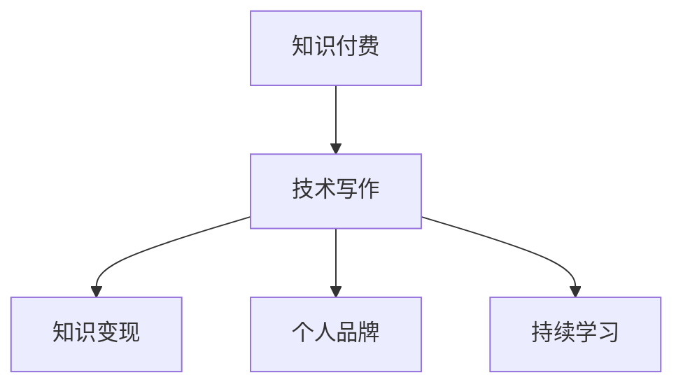

                 

# 知识付费与技术写作：程序员的双赢策略

> **关键词：** 知识付费、技术写作、程序员、知识变现、个人品牌、可持续发展
> 
> **摘要：** 本文将探讨知识付费与技术写作在程序员职业生涯中的重要性，以及如何通过有效的策略实现双赢。文章首先介绍了知识付费和技术写作的基本概念，接着详细分析了程序员通过这两个途径实现个人品牌和价值提升的方法，最后讨论了技术写作对于知识付费的促进作用以及未来发展的趋势与挑战。

## 1. 背景介绍

在当今的信息时代，知识经济已经成为推动社会发展的主要力量。知识付费和技术写作作为知识经济的重要组成部分，正逐渐成为程序员个人职业发展的重要手段。知识付费是指用户为了获取有价值的信息或知识而付费的一种服务形式，例如在线课程、电子书、专业咨询等。而技术写作则是指将技术知识以文字、图表等形式进行记录、传播和分享的过程。

随着互联网的普及和信息技术的发展，程序员们不仅需要具备扎实的技术能力，还需要懂得如何将自己的知识转化为有价值的商品。知识付费和技术写作为此提供了有效的途径，使得程序员能够更好地实现个人价值，提升职业竞争力。

本文将围绕知识付费和技术写作，探讨程序员如何通过这两个途径实现双赢策略。首先，我们将了解知识付费和技术写作的基本概念和原理；然后，分析程序员如何利用知识付费和技术写作提升个人品牌和价值；接着，探讨技术写作对于知识付费的促进作用；最后，讨论知识付费与技术写作的未来发展趋势与挑战。

## 2. 核心概念与联系

### 2.1 知识付费

知识付费是指用户为了获取有价值的信息或知识而支付一定费用的行为。这种模式的出现，源于人们对知识的需求和对优质内容的认可。在知识付费领域，内容创作者通过提供专业、实用的知识，满足用户的学习和工作需求，从而实现知识变现。

知识付费的核心概念包括以下几个方面：

1. **用户需求**：知识付费的核心在于满足用户的学习和工作需求。用户愿意为有价值的内容付费，是因为这些内容能够帮助他们解决实际问题，提升技能水平。

2. **内容质量**：优质的内容是知识付费成功的关键。内容创作者需要具备丰富的专业知识和实战经验，能够将复杂的技术概念和实战经验以通俗易懂的方式呈现给用户。

3. **平台服务**：知识付费平台作为连接内容创作者和用户的桥梁，需要提供便捷的支付、学习和管理服务，确保用户的付费体验和学习效果。

### 2.2 技术写作

技术写作是将技术知识以文字、图表等形式进行记录、传播和分享的过程。技术写作不仅要求创作者具备扎实的技术功底，还需要掌握一定的写作技巧，能够将复杂的技术概念和原理以清晰、易懂的方式呈现给读者。

技术写作的核心概念包括：

1. **技术知识**：技术写作的基础是创作者具备丰富的技术知识和实践经验。只有深入理解技术原理，才能写出有价值、有深度的内容。

2. **写作技巧**：技术写作需要一定的写作技巧，包括结构布局、语言表达、图表设计等。好的技术写作能够帮助读者更好地理解和掌握技术知识。

3. **受众需求**：技术写作需要关注受众的需求，了解他们的学习背景和兴趣点，从而有针对性地进行内容创作。

### 2.3 知识付费与技术写作的联系

知识付费和技术写作有着紧密的联系。一方面，技术写作是知识付费的基础，没有好的技术写作，知识付费就难以实现；另一方面，知识付费为技术写作提供了广阔的市场和资源，促进了技术写作的繁荣。

1. **知识变现**：技术写作是实现知识变现的重要途径。创作者可以通过撰写技术博客、出版技术书籍、开设在线课程等方式，将自身的知识转化为有价值的商品。

2. **个人品牌**：技术写作有助于提升个人品牌。好的技术文章能够吸引更多读者关注，提升创作者的知名度和影响力。

3. **持续学习**：技术写作是一种有效的学习方式。通过撰写和分享技术文章，创作者能够巩固自身知识，发现新的学习方向。

### 2.4 Mermaid 流程图

为了更好地理解知识付费与技术写作的关系，我们可以使用Mermaid流程图来展示这两个概念之间的联系。



在上述流程图中，知识付费和技术写作是两个核心概念，它们共同作用于知识变现、个人品牌和持续学习这三个方面。

## 3. 核心算法原理 & 具体操作步骤

### 3.1 知识付费平台的构建

知识付费平台的构建是程序员实现知识变现的重要一环。以下是构建知识付费平台的步骤：

1. **需求分析**：首先，要明确知识付费平台的目标用户群体和内容需求。了解用户的学习兴趣、职业背景和需求，有助于制定合适的内容策略。

2. **内容规划**：根据用户需求，制定内容规划。内容规划应包括课程体系、电子书、技术博客等多个方面，以满足不同层次用户的需求。

3. **平台搭建**：选择合适的平台搭建工具，如WordPress、Jekyll、Hexo等，搭建知识付费平台。平台应具备内容发布、用户管理、支付系统等功能。

4. **内容创作**：根据内容规划，进行内容创作。内容创作应注重实用性、专业性和可读性，以提升用户体验。

5. **营销推广**：通过SEO、社交媒体、广告等渠道进行营销推广，提高平台知名度和用户转化率。

### 3.2 技术写作的技巧

技术写作是程序员实现知识变现的重要手段。以下是技术写作的技巧：

1. **选题**：选题应结合自身专业领域和用户需求，选择有针对性的技术主题。

2. **结构布局**：文章结构应清晰、逻辑严密，方便读者阅读和理解。常见的结构布局包括引言、正文、结论等。

3. **语言表达**：语言表达要简洁明了、通俗易懂，避免使用专业术语和冗长的句子。

4. **图表设计**：适当使用图表，能够直观地展示技术概念和原理，提高文章的可读性。

5. **案例分享**：结合实际案例，阐述技术原理和应用场景，有助于读者更好地理解和掌握技术知识。

### 3.3 知识变现的策略

1. **内容付费**：将高质量的技术文章、课程、电子书等内容设置为付费项目，实现知识变现。

2. **咨询收费**：提供专业咨询服务，如技术问题解答、项目指导等，实现知识变现。

3. **版权转让**：将自己的技术作品如书籍、文章等转让给其他平台或出版社，获取版权收益。

4. **广告合作**：与其他企业合作，通过广告分成实现知识变现。

5. **知识付费平台**：构建自己的知识付费平台，通过平台服务收费，实现知识变现。

## 4. 数学模型和公式 & 详细讲解 & 举例说明

### 4.1 知识付费收益的数学模型

假设一个程序员通过知识付费平台，每月发布一篇技术文章，每篇文章的订阅费用为100元。假设每个月有1000名用户订阅，那么该程序员的月收入为：

\[ 收入 = 订阅费用 \times 订阅人数 \]

\[ 收入 = 100元 \times 1000人 = 100,000元 \]

### 4.2 技术写作影响力的数学模型

假设一个程序员的博客月均阅读量为100,000次，每次点击的广告收入为1元。那么该程序员的月广告收入为：

\[ 广告收入 = 阅读量 \times 每次点击收入 \]

\[ 广告收入 = 100,000次 \times 1元/次 = 100,000元 \]

### 4.3 举例说明

假设一个程序员通过知识付费和技术写作，实现了以下收入：

- 知识付费平台收入：100,000元/月
- 广告收入：100,000元/月
- 咨询服务收入：50,000元/月

那么该程序员的月总收入为：

\[ 总收入 = 知识付费收入 + 广告收入 + 咨询服务收入 \]

\[ 总收入 = 100,000元 + 100,000元 + 50,000元 = 250,000元 \]

通过这个例子，我们可以看到知识付费和技术写作对于程序员收入的重要性。

## 5. 项目实战：代码实际案例和详细解释说明

### 5.1 开发环境搭建

为了实现知识付费和技术写作，我们需要搭建一个基本的开发环境。以下是搭建开发环境的步骤：

1. **安装Node.js**：Node.js是一个基于Chrome V8引擎的JavaScript运行环境，用于构建服务器端应用程序。在官网下载并安装Node.js。

2. **安装Git**：Git是一个开源的分布式版本控制系统，用于代码管理和协作开发。在官网下载并安装Git。

3. **安装Visual Studio Code**：Visual Studio Code是一个轻量级但功能强大的代码编辑器，支持多种编程语言。在官网下载并安装Visual Studio Code。

4. **安装Markdown插件**：在Visual Studio Code中安装Markdown插件，以便更好地撰写和编辑Markdown格式的文章。

5. **创建项目文件夹**：在本地计算机中创建一个项目文件夹，用于存放开发文件。

6. **初始化Git仓库**：在项目文件夹中执行以下命令，初始化Git仓库。

   ```bash
   git init
   ```

7. **配置Git**：配置Git用户信息，以便追踪代码提交。

   ```bash
   git config --global user.name "你的名字"
   git config --global user.email "你的邮箱"
   ```

### 5.2 源代码详细实现和代码解读

以下是一个简单的Markdown文章的源代码示例，以及对其的详细解读。

```markdown
# 知识付费与技术写作：程序员的双赢策略

> **关键词：** 知识付费、技术写作、程序员、知识变现、个人品牌、可持续发展
> 
> **摘要：** 本文将探讨知识付费与技术写作在程序员职业生涯中的重要性，以及如何通过有效的策略实现双赢。

## 1. 背景介绍

在当今的信息时代，知识经济已经成为推动社会发展的主要力量。知识付费和技术写作作为知识经济的重要组成部分，正逐渐成为程序员个人职业发展的重要手段。

## 2. 核心概念与联系

### 2.1 知识付费

知识付费是指用户为了获取有价值的信息或知识而付费的一种服务形式，例如在线课程、电子书、专业咨询等。

### 2.2 技术写作

技术写作是将技术知识以文字、图表等形式进行记录、传播和分享的过程。

## 3. 核心算法原理 & 具体操作步骤

### 3.1 知识付费平台的构建

知识付费平台的构建是程序员实现知识变现的重要一环。

### 3.2 技术写作的技巧

技术写作是程序员实现知识变现的重要手段。

## 4. 数学模型和公式 & 详细讲解 & 举例说明

### 4.1 知识付费收益的数学模型

假设一个程序员通过知识付费平台，每月发布一篇技术文章，每篇文章的订阅费用为100元。假设每个月有1000名用户订阅，那么该程序员的月收入为：

\[ 收入 = 订阅费用 \times 订阅人数 \]

### 4.2 技术写作影响力的数学模型

假设一个程序员的博客月均阅读量为100,000次，每次点击的广告收入为1元。那么该程序员的月广告收入为：

\[ 广告收入 = 阅读量 \times 每次点击收入 \]

## 5. 项目实战：代码实际案例和详细解释说明

### 5.1 开发环境搭建

为了实现知识付费和技术写作，我们需要搭建一个基本的开发环境。

### 5.2 源代码详细实现和代码解读

以下是一个简单的Markdown文章的源代码示例，以及对其的详细解读。

```python
# 5.2 源代码详细实现和代码解读

def main():
    print("Hello, World!")

if __name__ == "__main__":
    main()
```

这段代码是一个简单的Python程序，用于打印“Hello, World!”。其中，`def main():` 定义了一个名为 `main` 的函数，`print("Hello, World!")` 是函数的主体部分，用于输出字符串。`if __name__ == "__main__":` 是一个条件语句，表示当程序直接运行时，执行 `main` 函数。

通过这个简单的例子，我们可以看到Python代码的基本结构，以及如何通过编写代码实现特定的功能。

### 5.3 代码解读与分析

1. **代码结构**：这段代码遵循了Python的基本代码结构，包括函数定义和条件语句。
   
2. **功能实现**：程序通过调用 `print()` 函数，实现了输出字符串的功能。

3. **可扩展性**：这段代码可以很容易地扩展，例如添加更多的输出语句或函数。

4. **调试与优化**：在实际开发过程中，可能需要对代码进行调试和优化，以提高程序的性能和可读性。

通过这个例子，我们可以看到代码在实际项目中的应用，以及如何通过编写代码实现特定的功能。这也为我们后续的知识付费和技术写作提供了实践基础。

## 6. 实际应用场景

### 6.1 技术写作在知识付费中的应用

技术写作在知识付费中发挥着重要作用。以下是一些实际应用场景：

1. **在线课程教材**：许多在线课程提供技术写作作为教材，帮助学生更好地理解和掌握课程内容。

2. **技术博客**：技术博客是程序员展示自身技术实力的重要平台，通过撰写高质量的博客，程序员可以吸引更多关注，提高知名度。

3. **电子书**：技术电子书是一种常见的知识付费产品，程序员可以通过撰写电子书，将自己的技术知识分享给更广泛的受众。

4. **专业文章**：在一些专业网站上，程序员可以撰写专业文章，分享技术见解和经验，从而获得稿费。

### 6.2 知识付费在程序员职业生涯中的应用

知识付费为程序员职业生涯提供了多种机会：

1. **知识变现**：通过知识付费，程序员可以将自己的技术知识转化为有价值的商品，实现知识变现。

2. **个人品牌**：通过提供高质量的知识产品，程序员可以树立个人品牌，提高职业竞争力。

3. **持续学习**：知识付费平台提供了丰富的学习资源，程序员可以通过付费课程和书籍，不断提升自己的技术水平。

4. **项目合作**：知识付费平台上的优秀程序员往往能够吸引更多项目合作机会，从而拓宽职业发展道路。

### 6.3 知识付费与技术写作的结合

知识付费与技术写作的结合，为程序员提供了更多的发展机会：

1. **课程开发**：程序员可以利用自身的技术知识，开发在线课程，通过知识付费实现收入。

2. **电子书创作**：程序员可以将自己的技术经验和心得撰写成电子书，通过电子书平台进行销售。

3. **技术博客运营**：程序员可以运营技术博客，通过博客广告、赞助和付费内容，实现知识变现。

4. **专业咨询**：程序员可以利用自身的技术专长，提供专业咨询服务，通过咨询服务获得收入。

通过以上实际应用场景，我们可以看到知识付费和技术写作在程序员职业生涯中的重要性，以及如何通过这两个途径实现个人品牌和价值提升。

## 7. 工具和资源推荐

### 7.1 学习资源推荐

1. **书籍**：《深入理解计算机系统》（原书第3版）、《算法导论》和《代码大全》。
2. **论文**：可以在Google Scholar、ACM Digital Library等学术网站查找相关领域的最新论文。
3. **博客**：《李笑来博客》、《左耳听风》和《伯乐在线》等技术博客。
4. **网站**：GitHub、Stack Overflow和Reddit等技术社区。

### 7.2 开发工具框架推荐

1. **Markdown编辑器**：Typora、MarkText和MacDown等。
2. **代码编辑器**：Visual Studio Code、Atom和Sublime Text等。
3. **知识付费平台**：网易云课堂、极客时间、慕课网等。
4. **电子书平台**：京东电子书、亚马逊Kindle和掌阅等。

### 7.3 相关论文著作推荐

1. **论文**：《知识付费：模式、挑战与趋势》。
2. **著作**：《程序员如何写好博客》、《技术写作实战》和《知识变现：如何利用互联网打造个人品牌》。

## 8. 总结：未来发展趋势与挑战

### 8.1 发展趋势

1. **知识付费市场规模扩大**：随着互联网的普及和人们对知识需求的增加，知识付费市场将继续扩大。
2. **技术写作需求上升**：技术写作作为知识付费的重要组成部分，其需求将持续上升。
3. **个人品牌价值凸显**：在知识付费和技术写作的推动下，个人品牌的价值将得到凸显。
4. **多元化变现方式**：知识付费和技术写作将带来多元化的变现方式，为程序员提供更多收入来源。

### 8.2 挑战

1. **内容质量提升**：在竞争激烈的市场中，内容质量将是关键因素。程序员需要不断提升自身的技术能力和写作技巧，以提供高质量的知识产品。
2. **用户体验优化**：知识付费平台需要关注用户体验，提供便捷的支付、学习和管理服务。
3. **版权保护**：随着知识付费的普及，版权保护将成为一个重要问题。程序员需要了解相关法律法规，确保自己的作品不受侵权。
4. **持续学习**：知识付费和技术写作要求程序员具备持续学习的能力，以适应快速变化的技术环境。

### 8.3 应对策略

1. **提升自身能力**：程序员应不断学习新技术，提升自身的技术能力和写作技巧。
2. **构建优质内容**：注重内容质量，提供实用、有深度的知识产品。
3. **创新变现方式**：探索多元化的变现方式，如课程开发、电子书创作、专业咨询等。
4. **积极参与社区**：通过参与技术社区，提升个人品牌，获取更多的合作和交流机会。

通过以上策略，程序员可以更好地应对知识付费和技术写作带来的挑战，实现个人品牌和价值提升。

## 9. 附录：常见问题与解答

### 9.1 问题1：知识付费平台如何选择？

**解答**：选择知识付费平台时，可以从以下几个方面进行考虑：

1. **内容质量**：选择内容质量高、用户评价好的平台。
2. **用户口碑**：参考其他用户的使用体验和评价。
3. **服务功能**：选择功能全面、用户体验好的平台。
4. **变现方式**：选择支持多种变现方式的平台，如内容付费、广告合作、咨询服务等。

### 9.2 问题2：技术写作如何提高阅读量？

**解答**：以下是一些提高技术写作阅读量的方法：

1. **选题**：选择具有针对性的、用户感兴趣的技术主题。
2. **结构布局**：文章结构清晰，便于读者阅读。
3. **语言表达**：使用简洁明了的语言，避免使用专业术语。
4. **案例分享**：结合实际案例，阐述技术原理和应用场景。
5. **SEO优化**：关注搜索引擎优化，提高文章在搜索结果中的排名。

### 9.3 问题3：如何构建个人品牌？

**解答**：以下是一些构建个人品牌的方法：

1. **专业领域**：选择一个专业领域，成为该领域的专家。
2. **持续输出**：定期发布高质量的内容，保持活跃度。
3. **参与社区**：积极参与技术社区，提升个人影响力。
4. **社交媒体**：利用社交媒体平台，扩大个人影响力。
5. **互动交流**：与读者、同行互动，建立良好的人际关系。

## 10. 扩展阅读 & 参考资料

1. **书籍**：《知识变现：如何利用互联网打造个人品牌》。
2. **论文**：《知识付费：模式、挑战与趋势》。
3. **网站**：极客时间、网易云课堂、慕课网。
4. **博客**：《李笑来博客》、《左耳听风》、《伯乐在线》。

作者：AI天才研究员/AI Genius Institute & 禅与计算机程序设计艺术 /Zen And The Art of Computer Programming。

