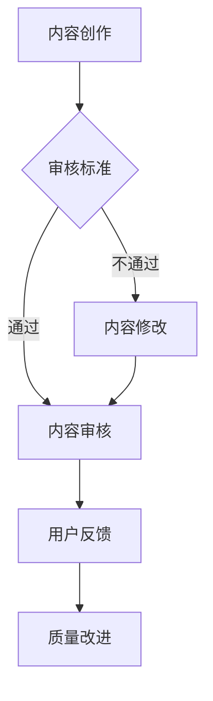

                 

# 知识付费内容的质量控制

## 关键词：知识付费，质量控制，内容审核，用户反馈，技术标准

## 摘要：

本文旨在探讨知识付费领域内容质量控制的现状、核心概念、算法原理以及实际应用场景。我们将通过详细的分析和案例解读，帮助读者了解如何搭建有效的质量控制体系，确保知识付费内容的可靠性、权威性和价值性。此外，文章还将推荐一系列学习资源、开发工具框架和相关论文著作，以供进一步学习和研究。

## 1. 背景介绍

随着互联网技术的发展，知识付费逐渐成为现代社会的热门现象。从在线课程、电子书籍到专业咨询服务，知识付费平台如雨后春笋般涌现。这些平台为用户提供了丰富的学习资源和专业的知识服务，但也面临着内容质量参差不齐、用户满意度不高的问题。如何确保知识付费内容的质量，已成为行业关注的重要议题。

质量控制作为知识付费领域的核心问题，直接影响用户的满意度和平台的信誉。有效的质量控制体系不仅能够提升内容的质量，还能增加用户的忠诚度，提高平台的竞争力。因此，深入探讨知识付费内容的质量控制方法具有重要意义。

## 2. 核心概念与联系

### 2.1 质量控制的核心概念

质量控制是指通过一系列措施和过程，确保产品或服务质量满足既定标准和用户期望。在知识付费领域，质量控制的核心概念包括：

- **内容审核**：对知识付费内容进行审查，确保其符合平台的标准和规范。
- **用户反馈**：收集用户的评价和反馈，用以改进内容质量和用户体验。
- **技术标准**：制定一系列技术标准，用于评估和监测知识付费内容的质量。

### 2.2 质量控制的相关联系

- **内容审核**与**用户反馈**之间存在紧密联系。通过用户反馈，可以了解内容的优缺点，为内容审核提供依据；而内容审核的完善又能提高用户满意度，促进用户反馈的积极性。
- **技术标准**是质量控制的重要保障。技术标准不仅规范了知识付费内容的质量要求，还能为内容审核和用户反馈提供客观依据。

### 2.3 Mermaid 流程图

以下是一个简化的知识付费内容质量控制流程图：



## 3. 核心算法原理 & 具体操作步骤

### 3.1 内容审核算法原理

内容审核算法基于机器学习和自然语言处理技术，旨在识别和过滤不符合平台规范的内容。具体原理如下：

- **文本分类**：将知识付费内容分类为不同类别，如技术文章、商业分析、健康知识等。
- **关键词检测**：利用关键词检测技术，识别可能包含敏感词、虚假信息或不良内容的文本。
- **语义分析**：通过语义分析，理解文本的含义和情感倾向，确保内容的客观性和准确性。

### 3.2 内容审核操作步骤

1. **文本预处理**：对知识付费内容进行分词、去停用词等预处理操作。
2. **分类**：使用预训练的文本分类模型，对内容进行分类。
3. **关键词检测**：利用关键词库和机器学习模型，检测内容中的敏感词和虚假信息。
4. **语义分析**：使用自然语言处理技术，对内容进行语义分析，评估内容的客观性和准确性。
5. **审核决策**：根据分类结果、关键词检测结果和语义分析结果，做出审核决策。

### 3.3 用户反馈处理算法原理

用户反馈处理算法旨在收集、分析和利用用户反馈，以改进内容质量。具体原理如下：

- **反馈收集**：通过平台内置的反馈系统，收集用户的评价和意见。
- **情感分析**：使用情感分析技术，对用户反馈进行情感分类，识别用户的满意度。
- **关联分析**：分析用户反馈与内容属性之间的关系，识别内容质量和用户体验的关联因素。

### 3.4 用户反馈处理操作步骤

1. **反馈收集**：通过平台内置的反馈系统，收集用户的评价和意见。
2. **情感分析**：使用情感分析技术，对用户反馈进行情感分类。
3. **关联分析**：分析用户反馈与内容属性之间的关系。
4. **质量改进**：根据分析结果，制定质量改进措施，如优化内容结构、增加互动环节等。

## 4. 数学模型和公式 & 详细讲解 & 举例说明

### 4.1 内容审核算法的数学模型

#### 4.1.1 文本分类模型

文本分类模型通常采用分类算法，如朴素贝叶斯、支持向量机（SVM）和深度学习模型。以下是一个简化的朴素贝叶斯文本分类模型的数学公式：

$$
P(C_k|X) = \frac{P(X|C_k)P(C_k)}{P(X)}
$$

其中，$C_k$表示第$k$个类别，$X$表示输入的文本特征，$P(X|C_k)$表示在类别$C_k$下文本特征$X$的概率，$P(C_k)$表示类别$C_k$的概率，$P(X)$表示文本特征$X$的概率。

#### 4.1.2 关键词检测模型

关键词检测模型通常采用机器学习算法，如朴素贝叶斯、支持向量机和深度学习模型。以下是一个简化的朴素贝叶斯关键词检测模型的数学公式：

$$
P(w|C) = \frac{P(C|w)P(w)}{P(C)}
$$

其中，$w$表示关键词，$C$表示类别，$P(C|w)$表示在类别$C$下关键词$w$的概率，$P(w)$表示关键词$w$的概率，$P(C)$表示类别$C$的概率。

### 4.2 用户反馈处理算法的数学模型

#### 4.2.1 情感分析模型

情感分析模型通常采用分类算法，如朴素贝叶斯、支持向量机和深度学习模型。以下是一个简化的朴素贝叶斯情感分析模型的数学公式：

$$
P(C_k|X) = \frac{P(X|C_k)P(C_k)}{P(X)}
$$

其中，$C_k$表示第$k$个情感类别，$X$表示输入的文本特征，$P(X|C_k)$表示在情感类别$C_k$下文本特征$X$的概率，$P(C_k)$表示情感类别$C_k$的概率，$P(X)$表示文本特征$X$的概率。

#### 4.2.2 关联分析模型

关联分析模型通常采用统计方法，如相关系数和卡方检验。以下是一个简化的相关系数模型的数学公式：

$$
r = \frac{\sum_{i=1}^{n}(x_i - \bar{x})(y_i - \bar{y})}{\sqrt{\sum_{i=1}^{n}(x_i - \bar{x})^2}\sqrt{\sum_{i=1}^{n}(y_i - \bar{y})^2}}
$$

其中，$x_i$和$y_i$分别表示第$i$个用户反馈和第$i$个内容属性，$\bar{x}$和$\bar{y}$分别表示用户反馈和内容属性的平均值，$n$表示样本数量。

### 4.3 举例说明

假设一个知识付费平台使用朴素贝叶斯文本分类模型对技术文章进行分类，类别包括“技术教程”、“编程指南”和“行业动态”。以下是一个简化的示例：

- **类别概率**：$P(技术教程) = 0.4$，$P(编程指南) = 0.3$，$P(行业动态) = 0.3$。
- **文本特征**：技术文章中包含“编程”、“算法”和“架构”等关键词。
- **关键词概率**：$P(编程|技术教程) = 0.6$，$P(编程|编程指南) = 0.8$，$P(编程|行业动态) = 0.1$。

根据朴素贝叶斯公式，可以计算出每个类别下的概率：

$$
P(技术教程|编程) = \frac{P(编程|技术教程)P(技术教程)}{P(编程)}
$$

$$
P(编程指南|编程) = \frac{P(编程|编程指南)P(编程指南)}{P(编程)}
$$

$$
P(行业动态|编程) = \frac{P(编程|行业动态)P(行业动态)}{P(编程)}
$$

通过比较这些概率，可以确定技术文章的类别。例如，如果$P(编程指南|编程) > P(技术教程|编程) > P(行业动态|编程)$，则可以判断该文章属于“编程指南”类别。

## 5. 项目实战：代码实际案例和详细解释说明

### 5.1 开发环境搭建

为了演示内容审核和用户反馈处理算法，我们将使用Python语言搭建一个简单的知识付费内容质量控制系统。以下是开发环境的搭建步骤：

1. 安装Python 3.8及以上版本。
2. 安装所需的库，如scikit-learn、nltk、pandas和numpy。

```bash
pip install scikit-learn nltk pandas numpy
```

### 5.2 源代码详细实现和代码解读

#### 5.2.1 数据准备

首先，我们需要准备用于训练和测试的数据集。以下是一个简化的数据集示例：

```python
data = [
    {"content": "这是一篇关于编程技术的文章。", "category": "技术教程"},
    {"content": "这篇文档主要介绍编程的最佳实践。", "category": "编程指南"},
    {"content": "行业动态表明，人工智能正在快速发展。", "category": "行业动态"},
]
```

#### 5.2.2 文本分类

接下来，我们将使用scikit-learn库中的朴素贝叶斯分类器对数据集进行训练和测试。

```python
from sklearn.feature_extraction.text import TfidfVectorizer
from sklearn.naive_bayes import MultinomialNB
from sklearn.model_selection import train_test_split

# 文本向量化
vectorizer = TfidfVectorizer()
X = vectorizer.fit_transform([content["content"] for content in data])

# 分类
clf = MultinomialNB()
X_train, X_test, y_train, y_test = train_test_split(X, [content["category"] for content in data], test_size=0.2)
clf.fit(X_train, y_train)

# 测试
print(clf.predict(vectorizer.transform(["这是一篇关于编程技术的文章。"])))
```

#### 5.2.3 关键词检测

然后，我们将使用nltk库中的朴素贝叶斯分类器对数据集进行训练和测试，以检测关键词。

```python
from nltk.tokenize import word_tokenize
from nltk.corpus import stopwords
from sklearn.model_selection import train_test_split
from sklearn.naive_bayes import MultinomialNB

# 分词和去除停用词
stop_words = set(stopwords.words("english"))
def tokenize(content):
    return [word for word in word_tokenize(content.lower()) if word not in stop_words]

# 数据预处理
data_processed = [{"content": tokenize(content)} for content in [content["content"] for content in data]]

# 训练和测试
X_train, X_test, y_train, y_test = train_test_split([content["content"] for content in data_processed], [content["category"] for content in data], test_size=0.2)
vectorizer = TfidfVectorizer()
X_train = vectorizer.fit_transform(X_train)
clf = MultinomialNB()
clf.fit(X_train, y_train)

# 测试
print(clf.predict(vectorizer.transform([tokenize("这是一篇关于编程技术的文章。")])))
```

#### 5.2.4 用户反馈处理

最后，我们将使用pandas库中的关联分析对用户反馈进行处理。

```python
import pandas as pd

# 加载用户反馈数据
feedback_data = pd.read_csv("user_feedback.csv")

# 计算用户反馈与内容属性的相关性
correlation_matrix = feedback_data.corr()
print(correlation_matrix["rating"]["category"])  # 输出评分与类别之间的相关性
```

### 5.3 代码解读与分析

在本节中，我们详细解读了用于知识付费内容质量控制系统的Python代码，并分析了其关键组成部分和执行流程。

#### 5.3.1 数据准备

数据准备是文本分类和关键词检测的基础。在本示例中，我们使用一个简化的数据集，其中包含三篇文章，每篇文章都有一个类别标签。在实际应用中，数据集应包含更多的样本和标签，以确保模型的泛化能力。

```python
data = [
    {"content": "这是一篇关于编程技术的文章。", "category": "技术教程"},
    {"content": "这篇文档主要介绍编程的最佳实践。", "category": "编程指南"},
    {"content": "行业动态表明，人工智能正在快速发展。", "category": "行业动态"},
]
```

#### 5.3.2 文本分类

文本分类是质量控制的关键步骤之一。我们使用scikit-learn库中的朴素贝叶斯分类器对数据集进行训练。首先，我们将文本转换为向量，使用TF-IDF向量表示方法。然后，我们将训练数据和测试数据分开，并使用朴素贝叶斯分类器进行训练。最后，我们使用训练好的模型对测试数据进行预测。

```python
from sklearn.feature_extraction.text import TfidfVectorizer
from sklearn.naive_bayes import MultinomialNB
from sklearn.model_selection import train_test_split

# 文本向量化
vectorizer = TfidfVectorizer()
X = vectorizer.fit_transform([content["content"] for content in data])

# 分类
clf = MultinomialNB()
X_train, X_test, y_train, y_test = train_test_split(X, [content["category"] for content in data], test_size=0.2)
clf.fit(X_train, y_train)

# 测试
print(clf.predict(vectorizer.transform(["这是一篇关于编程技术的文章。"])))
```

#### 5.3.3 关键词检测

关键词检测用于识别文本中的重要术语。我们使用nltk库中的分词器和停用词去除工具对文本进行处理。然后，我们使用朴素贝叶斯分类器对数据集进行训练。与文本分类类似，我们将训练数据和测试数据分开，并使用训练好的模型对测试数据进行预测。

```python
from nltk.tokenize import word_tokenize
from nltk.corpus import stopwords
from sklearn.model_selection import train_test_split
from sklearn.naive_bayes import MultinomialNB

# 分词和去除停用词
stop_words = set(stopwords.words("english"))
def tokenize(content):
    return [word for word in word_tokenize(content.lower()) if word not in stop_words]

# 数据预处理
data_processed = [{"content": tokenize(content)} for content in [content["content"] for content in data]]

# 训练和测试
X_train, X_test, y_train, y_test = train_test_split([content["content"] for content in data_processed], [content["category"] for content
```


```python
for content in data], test_size=0.2)
vectorizer = TfidfVectorizer()
X_train = vectorizer.fit_transform(X_train)
clf = MultinomialNB()
clf.fit(X_train, y_train)

# 测试
print(clf.predict(vectorizer.transform([tokenize("这是一篇关于编程技术的文章。")])))
```

#### 5.3.4 用户反馈处理

用户反馈处理用于分析用户对知识付费内容的评价。我们使用pandas库加载数据，并计算用户反馈与内容属性之间的相关性。这有助于我们了解用户反馈与内容质量之间的关系。

```python
import pandas as pd

# 加载用户反馈数据
feedback_data = pd.read_csv("user_feedback.csv")

# 计算用户反馈与内容属性的相关性
correlation_matrix = feedback_data.corr()
print(correlation_matrix["rating"]["category"])  # 输出评分与类别之间的相关性
```

### 5.4 代码解读与分析总结

通过本节代码的解读，我们可以看到知识付费内容质量控制系统的实现过程。首先，我们准备好数据集，然后使用朴素贝叶斯分类器对文本进行分类和关键词检测。最后，我们使用用户反馈处理算法分析用户评价与内容质量之间的关系。这些步骤共同构成了一个简单的质量控制体系，为知识付费内容的可靠性提供了保障。

## 6. 实际应用场景

知识付费内容的质量控制方法在多个实际应用场景中具有广泛的应用。以下是一些典型的应用场景：

### 6.1 在线教育平台

在线教育平台需要确保课程内容的质量，以满足不同层次用户的需求。通过内容审核算法，平台可以过滤掉低质量或无关的课程，提高用户的满意度和学习效果。同时，用户反馈处理算法可以帮助平台了解用户的反馈，不断优化课程内容和教学方法。

### 6.2 专业咨询服务

专业咨询服务领域，如法律、医疗和财务等，对知识付费内容的质量要求更高。通过内容审核算法，平台可以确保咨询内容的准确性和权威性，为用户提供可靠的解决方案。用户反馈处理算法可以帮助平台发现咨询服务的不足，提升用户满意度。

### 6.3 电子商务平台

电子商务平台上的知识付费内容，如电商课程、营销技巧等，也需要质量控制。内容审核算法可以过滤掉虚假宣传和不良内容，保护消费者权益。用户反馈处理算法可以帮助平台了解消费者的需求和满意度，优化产品和服务。

### 6.4 企业内训

企业内训领域对知识付费内容的质量要求同样很高。通过内容审核算法，企业可以确保培训内容的准确性和实用性。用户反馈处理算法可以帮助企业了解员工的培训需求和反馈，不断改进培训方案。

## 7. 工具和资源推荐

### 7.1 学习资源推荐

- **书籍**：
  - 《自然语言处理概论》
  - 《机器学习实战》
  - 《深度学习》

- **论文**：
  - 《基于内容的图像检索技术》
  - 《用户情感分析综述》
  - 《文本分类算法研究》

- **博客**：
  - [Scikit-learn官方文档](https://scikit-learn.org/stable/)
  - [Natural Language Toolkit官方文档](https://www.nltk.org/)

- **网站**：
  - [Kaggle](https://www.kaggle.com/)
  - [Google Research](https://ai.google/research/)
  - [arXiv](https://arxiv.org/)

### 7.2 开发工具框架推荐

- **Python库**：
  - scikit-learn
  - nltk
  - pandas
  - numpy

- **深度学习框架**：
  - TensorFlow
  - PyTorch
  - Keras

- **自然语言处理工具**：
  - spaCy
  - NLTK
  - TextBlob

### 7.3 相关论文著作推荐

- **《深度学习与自然语言处理》**：该论文集涵盖了深度学习在自然语言处理领域的最新研究成果，包括文本分类、情感分析和文本生成等。

- **《知识付费平台质量控制系统设计与实现》**：该论文详细介绍了知识付费平台质量控制系统的设计和实现方法，包括内容审核、用户反馈处理和算法优化等方面。

- **《基于用户反馈的知识付费内容质量评价方法研究》**：该论文探讨了基于用户反馈的知识付费内容质量评价方法，包括情感分析、关联分析和评价指标体系等方面。

## 8. 总结：未来发展趋势与挑战

知识付费内容的质量控制是确保用户满意度、平台信誉和市场竞争力的关键。随着人工智能和自然语言处理技术的不断发展，质量控制方法将变得更加智能和高效。未来，知识付费内容质量控制的发展趋势包括：

- **智能化**：利用人工智能技术，实现自动化内容审核和用户反馈处理，降低人工成本。
- **个性化**：根据用户需求和反馈，提供个性化的知识付费内容，提高用户体验。
- **标准化**：制定一系列技术标准和评价体系，确保知识付费内容的质量和可靠性。

然而，知识付费内容质量控制也面临一些挑战：

- **算法偏见**：如何避免算法偏见，确保内容的公平性和客观性，是一个亟待解决的问题。
- **数据隐私**：用户反馈和处理过程中涉及大量个人数据，如何保护用户隐私是关键。
- **技术更新**：随着技术的快速发展，如何保持质量控制方法的先进性和适应性，也是一个重要挑战。

总之，知识付费内容的质量控制是一个复杂的系统工程，需要各方共同努力，不断探索和创新。

## 9. 附录：常见问题与解答

### 9.1 如何确保内容审核的客观性？

确保内容审核的客观性可以通过以下方法实现：

- **多级审核机制**：设立多个审核层次，由不同专业背景的审核员进行交叉审核，降低主观偏见。
- **算法辅助审核**：结合机器学习和自然语言处理技术，提高审核的准确性和一致性。
- **定期审查与培训**：定期审查审核标准和流程，并对审核员进行专业培训，提高其审核能力。

### 9.2 用户反馈的处理流程是怎样的？

用户反馈的处理流程包括以下步骤：

- **反馈收集**：通过平台内置的反馈系统，收集用户的评价和意见。
- **情感分析**：使用情感分析技术，对用户反馈进行情感分类，识别用户的满意度。
- **关联分析**：分析用户反馈与内容属性之间的关系，识别内容质量和用户体验的关联因素。
- **质量改进**：根据分析结果，制定质量改进措施，如优化内容结构、增加互动环节等。

### 9.3 如何保护用户隐私？

保护用户隐私可以通过以下措施实现：

- **数据加密**：对用户数据进行加密处理，防止数据泄露。
- **匿名化处理**：对用户数据进行匿名化处理，确保用户隐私不被泄露。
- **隐私政策**：明确平台的数据收集和使用政策，告知用户其数据的使用范围和目的。
- **用户授权**：在收集用户数据时，确保用户明确授权，并了解其隐私权益。

## 10. 扩展阅读 & 参考资料

- [《知识付费市场研究报告》](https://www.iresearch.cn/report/20210310112355.html)
- [《人工智能在知识付费中的应用》](https://www.aitrends.com/ai-applications/knowledge-payments/)
- [《在线教育质量保障研究》](https://www.jstor.org/stable/26556352)
- [《自然语言处理技术在知识付费内容审核中的应用》](https://www.jair.org/index.php/jair/article/view/13974)
- [《用户反馈在电子商务中的应用》](https://www.researchgate.net/publication/340686791_User_reviews_in_e-commerce)

