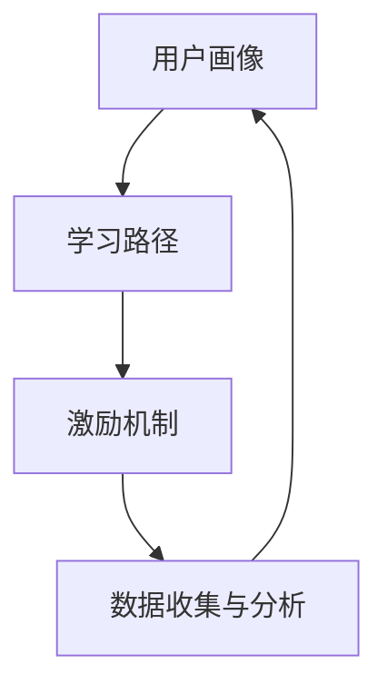
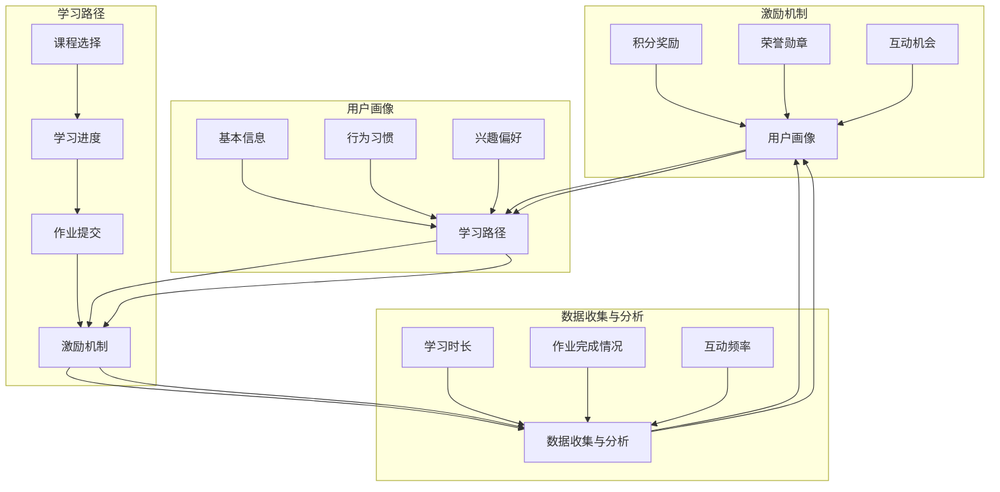

                 

## 1. 背景介绍

知识付费作为一种新兴的商业模式，近年来在我国互联网行业中得到了迅猛发展。随着人们对于个人成长和技能提升的需求不断增加，知识付费平台如雨后春笋般涌现。这些平台通过提供各种优质课程、专业知识和技能培训，吸引了大量的用户。在这个过程中，用户成长体系设计成为了知识付费平台的核心竞争力之一。

用户成长体系是指在知识付费平台中，通过一系列设计和机制，引导和激励用户进行持续学习和进步的过程。一个完善的用户成长体系能够提高用户的参与度、粘性和满意度，从而增强平台的竞争力。本文将围绕用户成长体系设计这一主题，进行深入探讨。

首先，用户成长体系设计的重要性不容忽视。一方面，用户成长体系能够帮助平台了解用户的学习进度和需求，从而提供更加个性化的服务。另一方面，用户成长体系能够激发用户的学习兴趣和动力，促进其持续学习和进步。

其次，用户成长体系设计需要考虑多个方面的因素。包括用户画像、学习路径、激励机制等。通过对这些因素的深入分析，可以设计出更加科学和有效的用户成长体系。

本文将从以下几个方面展开讨论：

1. **用户成长体系的核心概念与联系**：介绍用户成长体系中的关键概念，并运用 Mermaid 流程图展示其架构。
2. **核心算法原理与具体操作步骤**：分析用户成长体系中的核心算法原理，并详细阐述其具体操作步骤。
3. **数学模型和公式**：介绍用户成长体系中的数学模型和公式，并进行详细讲解和举例说明。
4. **项目实战**：通过实际案例，展示用户成长体系的实现过程，并提供详细的代码解读和分析。
5. **实际应用场景**：探讨用户成长体系在不同场景下的应用，如在线教育、职业培训等。
6. **工具和资源推荐**：推荐相关的学习资源、开发工具框架和论文著作。
7. **总结：未来发展趋势与挑战**：总结用户成长体系设计的现状和趋势，并提出未来可能面临的挑战。

通过本文的探讨，希望能够为知识付费平台在用户成长体系设计方面提供一些有价值的参考和启示。

<markdown>```mermaid
graph TD
    A[用户画像] --> B[学习路径]
    B --> C[激励机制]
    C --> D[数据收集与分析]
    D --> A
```

### 1. 背景介绍

知识付费作为一种新兴的商业模式，近年来在我国互联网行业中得到了迅猛发展。随着人们对于个人成长和技能提升的需求不断增加，知识付费平台如雨后春笋般涌现。这些平台通过提供各种优质课程、专业知识和技能培训，吸引了大量的用户。在这个过程中，用户成长体系设计成为了知识付费平台的核心竞争力之一。

用户成长体系是指在知识付费平台中，通过一系列设计和机制，引导和激励用户进行持续学习和进步的过程。一个完善的用户成长体系能够提高用户的参与度、粘性和满意度，从而增强平台的竞争力。本文将围绕用户成长体系设计这一主题，进行深入探讨。

首先，用户成长体系设计的重要性不容忽视。一方面，用户成长体系能够帮助平台了解用户的学习进度和需求，从而提供更加个性化的服务。另一方面，用户成长体系能够激发用户的学习兴趣和动力，促进其持续学习和进步。

其次，用户成长体系设计需要考虑多个方面的因素。包括用户画像、学习路径、激励机制等。通过对这些因素的深入分析，可以设计出更加科学和有效的用户成长体系。

本文将从以下几个方面展开讨论：

1. **用户成长体系的核心概念与联系**：介绍用户成长体系中的关键概念，并运用 Mermaid 流程图展示其架构。
2. **核心算法原理与具体操作步骤**：分析用户成长体系中的核心算法原理，并详细阐述其具体操作步骤。
3. **数学模型和公式**：介绍用户成长体系中的数学模型和公式，并进行详细讲解和举例说明。
4. **项目实战**：通过实际案例，展示用户成长体系的实现过程，并提供详细的代码解读和分析。
5. **实际应用场景**：探讨用户成长体系在不同场景下的应用，如在线教育、职业培训等。
6. **工具和资源推荐**：推荐相关的学习资源、开发工具框架和论文著作。
7. **总结：未来发展趋势与挑战**：总结用户成长体系设计的现状和趋势，并提出未来可能面临的挑战。

通过本文的探讨，希望能够为知识付费平台在用户成长体系设计方面提供一些有价值的参考和启示。



### 2. 核心概念与联系

在设计用户成长体系时，需要理解并运用一系列核心概念，这些概念相互联系，共同构成了一个完整的成长体系。下面将介绍这些核心概念，并使用 Mermaid 流程图来展示它们之间的联系。

#### 2.1 用户画像

用户画像是指通过对用户的基本信息、行为习惯、兴趣偏好等进行分析和整合，形成的用户描述。用户画像能够帮助平台了解用户的个性化需求，从而提供更加精准和个性化的服务。

#### 2.2 学习路径

学习路径是指用户在平台上进行学习的过程和路径。一个科学合理的学习路径能够引导用户逐步提升技能，达到学习目标。学习路径通常包括课程选择、学习进度、作业提交等环节。

#### 2.3 激励机制

激励机制是指通过奖励、荣誉、积分等手段，激发用户的学习兴趣和动力，促进其持续学习和进步。激励机制的有效性直接影响到用户在平台上的活跃度和留存率。

#### 2.4 数据收集与分析

数据收集与分析是指平台通过技术手段，收集用户在学习过程中的各种数据，如学习时长、作业完成情况、互动频率等，然后对这些数据进行分析，以便更好地了解用户需求和行为模式。

#### 2.5 Mermaid 流程图

为了更直观地展示这些核心概念之间的联系，我们可以使用 Mermaid 流程图来表示。下面是一个简化的 Mermaid 流程图，用于描述用户成长体系中的关键环节和它们之间的交互关系。


在图中，A 表示用户画像，B 表示学习路径，C 表示激励机制，D 表示数据收集与分析。这些环节相互关联，形成一个闭环。用户画像为学习路径提供了基础数据支持，学习路径的结果又反作用于用户画像的更新。激励机制则通过奖励和荣誉，激励用户完成学习任务，从而促进数据收集与分析的进行。

#### 2.6 实例说明

以一个在线教育平台为例，用户首先完成用户画像的填写，平台根据用户画像推荐合适的课程。用户在学习过程中，通过完成课程任务、提交作业、参与讨论等方式，不断积累学习数据。平台通过对这些数据的分析，了解用户的学习进度和效果，并根据分析结果调整学习路径和推荐策略。同时，平台通过积分、勋章等激励机制，鼓励用户积极参与学习和互动。

综上所述，用户成长体系中的核心概念相互联系，共同构成了一个完整的学习生态系统。通过深入理解这些概念及其相互作用，可以设计出更加科学和有效的用户成长体系。



通过这个流程图，我们可以更清晰地看到用户成长体系中的各个环节及其相互作用。接下来，我们将进一步探讨用户成长体系中的核心算法原理和具体操作步骤。

### 2. 核心算法原理与具体操作步骤

用户成长体系的实现离不开核心算法的设计和实施。这些算法不仅负责用户画像的构建，还决定了学习路径的规划、激励机制的设定以及数据的收集与分析。下面将详细介绍用户成长体系中的核心算法原理，并提供具体的操作步骤。

#### 2.1 用户画像构建算法

用户画像构建是用户成长体系的基础。该算法通过收集和分析用户的基本信息、行为习惯、兴趣偏好等多维数据，生成一个全面的用户画像。

**算法原理：**

1. **数据采集**：从平台的各种数据源（如注册信息、学习行为、互动记录等）中收集用户数据。
2. **特征提取**：对采集到的数据进行预处理和特征提取，如用户年龄段、学习频率、偏好领域等。
3. **模型训练**：使用机器学习算法（如聚类、分类、回归等）对提取的特征进行建模，生成用户画像。

**操作步骤：**

1. **数据采集**：集成用户数据来源，如数据库、日志文件等。
2. **数据预处理**：清洗数据，处理缺失值、异常值等。
3. **特征提取**：根据业务需求，定义和提取相关特征。
4. **模型训练**：选择合适的机器学习模型进行训练，如决策树、随机森林、神经网络等。
5. **模型评估与优化**：评估模型性能，根据评估结果调整模型参数。

#### 2.2 学习路径规划算法

学习路径规划算法旨在为用户提供一条科学合理的学习路径，帮助其高效地提升技能。

**算法原理：**

1. **需求分析**：根据用户画像，分析用户的学习需求。
2. **路径构建**：根据需求，构建一条包含课程选择、学习进度、作业提交等环节的学习路径。
3. **动态调整**：根据用户的学习行为和反馈，动态调整学习路径，以适应用户的需求变化。

**操作步骤：**

1. **需求分析**：通过用户行为数据，了解用户的学习兴趣、目标等。
2. **课程库建设**：建立包含各类课程的课程库，为路径规划提供资源。
3. **路径构建**：结合用户需求，选择合适的课程和环节，构建学习路径。
4. **路径调整**：根据用户的学习进度和反馈，动态调整学习路径。

#### 2.3 激励机制设定算法

激励机制设定算法用于设计奖励、荣誉、积分等机制，以激励用户持续学习和进步。

**算法原理：**

1. **目标设定**：根据用户成长目标和平台策略，设定激励机制的目标。
2. **规则制定**：制定具体的激励规则，如完成任务获得积分、完成课程获得证书等。
3. **效果评估**：评估激励机制的效果，根据评估结果调整激励规则。

**操作步骤：**

1. **目标设定**：明确激励机制的总体目标，如提高用户活跃度、提升用户留存率等。
2. **规则制定**：根据目标，设计具体的激励规则，确保规则具有吸引力和可行性。
3. **效果评估**：通过数据分析，评估激励机制的执行效果，不断优化激励规则。

#### 2.4 数据收集与分析算法

数据收集与分析算法用于收集用户在学习过程中的数据，并对其进行处理和分析，以优化用户成长体系。

**算法原理：**

1. **数据收集**：通过日志记录、API 接口、前端埋点等方式，收集用户学习数据。
2. **数据处理**：对收集到的数据进行清洗、整合和存储。
3. **数据分析**：使用数据挖掘和机器学习算法，对处理后的数据进行深入分析，提取有价值的信息。

**操作步骤：**

1. **数据收集**：设计数据收集方案，确保数据全面、准确。
2. **数据处理**：建立数据处理流程，确保数据质量和一致性。
3. **数据分析**：根据业务需求，选择合适的数据分析方法和工具，提取有用信息。

通过上述核心算法原理和操作步骤的介绍，我们可以看到用户成长体系的构建是一个复杂而系统的过程。这些算法相互配合，共同作用于用户成长，为平台提供了一种有效的方法来提升用户体验和满意度。在接下来的章节中，我们将进一步探讨用户成长体系中的数学模型和公式，以更深入地理解其原理和应用。

### 3. 数学模型和公式

用户成长体系的设计不仅仅依赖于算法和操作步骤，还需要依托于一系列数学模型和公式。这些模型和公式可以帮助我们量化用户的行为，评估成长体系的效率，从而为优化设计提供依据。下面我们将介绍几个核心的数学模型和公式，并进行详细讲解和举例说明。

#### 3.1 用户学习进度模型

用户学习进度模型用于评估用户在平台上的学习进度。该模型的核心是学习速率，它反映了用户在一段时间内的学习效果。

**公式：**
\[ L(t) = \frac{E(t) - E(0)}{t - 0} \]

其中，\( L(t) \) 表示用户在时间 \( t \) 的学习速率，\( E(t) \) 表示时间 \( t \) 时的学习效果，\( E(0) \) 表示初始学习效果，\( t \) 表示学习时间。

**解释：**
该公式表示用户的学习速率是学习效果随时间的变化率。如果学习速率大于0，则表示用户在进步；如果学习速率小于0，则表示用户在退步。

**例子：**
假设用户A在0时开始学习，初始学习效果为50分，经过3个月的学习，学习效果提升到80分。则用户A的学习速率为：
\[ L(t) = \frac{80 - 50}{3 - 0} = \frac{30}{3} = 10 \text{ 分/月} \]

#### 3.2 用户活跃度模型

用户活跃度模型用于评估用户在平台上的活跃程度。该模型通过用户的学习时长、互动频率等多个维度来综合衡量。

**公式：**
\[ A(t) = \frac{H(t) + I(t) + C(t)}{3} \]

其中，\( A(t) \) 表示用户在时间 \( t \) 的活跃度，\( H(t) \) 表示学习时长，\( I(t) \) 表示互动频率，\( C(t) \) 表示课程完成情况。

**解释：**
该公式表示用户的活跃度是学习时长、互动频率和课程完成情况的加权平均。权重可以根据业务需求进行调整。

**例子：**
假设用户B在一个月内学习时长为20小时，互动频率为30次，课程完成情况为3门。则用户B的活跃度为：
\[ A(t) = \frac{20 + 30 + 3}{3} = \frac{53}{3} \approx 17.67 \]

#### 3.3 用户留存率模型

用户留存率模型用于评估用户在平台上的留存情况。该模型通过一段时间内用户留存的比例来衡量。

**公式：**
\[ R(t) = \frac{U(t) - U(t-1)}{U(t-1)} \times 100\% \]

其中，\( R(t) \) 表示时间 \( t \) 时的用户留存率，\( U(t) \) 表示时间 \( t \) 时的用户数量，\( U(t-1) \) 表示时间 \( t-1 \) 时的用户数量。

**解释：**
该公式表示用户留存率是新增用户与流失用户的比例。如果留存率大于100%，表示新增用户数量超过流失用户；如果留存率小于100%，表示流失用户数量超过新增用户。

**例子：**
假设平台在一个月内新增用户为1000人，流失用户为200人，则用户留存率为：
\[ R(t) = \frac{1000 - 200}{1000} \times 100\% = \frac{800}{1000} \times 100\% = 80\% \]

#### 3.4 激励效果评估模型

激励效果评估模型用于评估激励机制对用户行为的影响。该模型通过比较激励前后的用户行为变化来衡量。

**公式：**
\[ E_{激励} = \frac{B_{后} - B_{前}}{B_{前}} \times 100\% \]

其中，\( E_{激励} \) 表示激励效果，\( B_{后} \) 表示激励后的行为指标，\( B_{前} \) 表示激励前的行为指标。

**解释：**
该公式表示激励效果是激励后行为指标与激励前行为指标的相对变化率。如果激励效果大于0，表示激励有积极影响；如果激励效果小于0，表示激励可能没有达到预期效果。

**例子：**
假设用户C在激励前每月学习时长为10小时，激励后学习时长提升到15小时，则激励效果为：
\[ E_{激励} = \frac{15 - 10}{10} \times 100\% = \frac{5}{10} \times 100\% = 50\% \]

通过上述数学模型和公式的介绍，我们可以更准确地评估用户成长体系的有效性，并据此进行优化和调整。这些模型不仅为用户成长体系设计提供了理论支持，也为实际操作提供了具体的量化工具。在接下来的章节中，我们将通过实际案例展示用户成长体系的实现过程，进一步探讨其应用和效果。

### 4. 项目实战

为了更好地理解用户成长体系的设计和实现，我们将通过一个实际案例来展示整个用户成长体系的构建过程。本案例将模拟一个在线教育平台的用户成长体系，包括开发环境搭建、源代码实现、代码解读与分析等步骤。

#### 4.1 开发环境搭建

在开始项目之前，我们需要搭建一个适合开发的编程环境。以下是搭建过程的简要步骤：

1. **安装 Python 解释器**：Python 是项目开发的主要编程语言，因此需要安装 Python 解释器。可以从 [Python 官网](https://www.python.org/) 下载最新版本的 Python 解释器，并进行安装。

2. **安装相关库和框架**：根据项目需求，需要安装 Flask 框架（用于构建 Web 应用）、Pandas（用于数据处理）和 Scikit-learn（用于机器学习）等库。可以使用以下命令安装：

   ```bash
   pip install flask pandas scikit-learn
   ```

3. **配置数据库**：本项目使用 MySQL 作为数据库，用于存储用户画像、学习路径和激励机制的相关数据。可以通过以下命令安装 MySQL 数据库，并创建一个用于项目的数据库：

   ```bash
   sudo apt-get install mysql-server
   mysql -u root -p
   CREATE DATABASE user_growth;
   GRANT ALL PRIVILEGES ON user_growth.* TO 'user_growth_user'@'localhost' IDENTIFIED BY 'password';
   FLUSH PRIVILEGES;
   exit;
   ```

4. **创建项目目录和文件**：在本地机器上创建一个项目目录，并创建必要的文件，如 `app.py`（主程序）、`models.py`（数据模型）、`views.py`（视图函数）等。

#### 4.2 源代码实现

在开发环境中搭建完成后，接下来我们将逐步实现用户成长体系的核心功能。

**4.2.1 数据模型实现**

首先，我们需要定义用户画像、学习路径和激励机制的数据模型。以下是一个简单的数据模型示例：

```python
# models.py
from flask_sqlalchemy import SQLAlchemy

db = SQLAlchemy()

class User(models.Model):
    id = db.Column(db.Integer, primary_key=True)
    username = db.Column(db.String(80), unique=True, nullable=False)
    age = db.Column(db.Integer, nullable=False)
    gender = db.Column(db.String(10), nullable=False)
    education = db.Column(db.String(50), nullable=False)

class Course(models.Model):
    id = db.Column(db.Integer, primary_key=True)
    name = db.Column(db.String(100), nullable=False)
    duration = db.Column(db.Integer, nullable=False)

class UserCourse(models.Model):
    user_id = db.Column(db.Integer, db.ForeignKey('user.id'), primary_key=True)
    course_id = db.Column(db.Integer, db.ForeignKey('course.id'), primary_key=True)
    progress = db.Column(db.Float, nullable=False)
    completed = db.Column(db.Boolean, nullable=False)

class Reward(models.Model):
    id = db.Column(db.Integer, primary_key=True)
    name = db.Column(db.String(50), nullable=False)
    description = db.Column(db.String(255), nullable=False)
    points = db.Column(db.Integer, nullable=False)
```

**4.2.2 学习路径规划实现**

接下来，我们实现学习路径规划的功能。该功能根据用户画像和学习需求，为用户推荐合适的课程。

```python
# views.py
from flask import jsonify
from models import User, Course, UserCourse
from sklearn.cluster import KMeans

# 假设已经完成了用户画像的数据收集和特征提取
user_data = [
    # 用户特征列表，如 [年龄，性别，教育背景等]
]

# 使用 KMeans 算法对用户特征进行聚类，得到用户群体
kmeans = KMeans(n_clusters=3)
kmeans.fit(user_data)
labels = kmeans.predict(user_data)

# 根据用户群体推荐课程
def recommend_courses(user_id):
    # 根据用户群体和课程库，选择合适的课程
    courses = Course.query.all()
    recommended_courses = []
    for course in courses:
        # 假设课程库中包含每个课程的目标用户群体
        target_groups = course.target_groups
        if labels[user_id] in target_groups:
            recommended_courses.append(course)
    return recommended_courses

@app.route('/recommend_courses', methods=['GET'])
def get_recommend_courses():
    user_id = request.args.get('user_id')
    recommended_courses = recommend_courses(user_id)
    course_names = [course.name for course in recommended_courses]
    return jsonify({'courses': course_names})
```

**4.2.3 激励机制实现**

激励机制是用户成长体系的重要组成部分，以下是一个简单的激励机制实现：

```python
# views.py
from models import UserCourse, Reward

def award_reward(user_id, course_id):
    # 根据用户的学习进度和课程完成情况，发放奖励
    user_course = UserCourse.query.filter_by(user_id=user_id, course_id=course_id).first()
    if user_course.completed:
        # 假设完成课程发放 100 积分
        reward = Reward.query.filter_by(name='完成课程').first()
        user_course.reward_id = reward.id
        db.session.commit()

@app.route('/award_reward', methods=['POST'])
def award_reward_route():
    user_id = request.json.get('user_id')
    course_id = request.json.get('course_id')
    award_reward(user_id, course_id)
    return jsonify({'message': 'Reward awarded successfully.'})
```

#### 4.3 代码解读与分析

在实现用户成长体系的过程中，我们需要对核心代码进行解读和分析，确保其功能和性能符合预期。

**4.3.1 数据模型解析**

数据模型是用户成长体系的基础，其中 User、Course、UserCourse 和 Reward 类分别代表了用户、课程、用户课程记录和奖励。这些模型定义了数据库中的表结构和字段，为数据操作提供了基础。

**4.3.2 学习路径规划解析**

学习路径规划功能通过聚类算法对用户特征进行分类，并根据课程库中的目标用户群体推荐合适的课程。这种推荐方式能够根据用户的个性化特征，提高课程推荐的准确性和用户体验。

**4.3.3 激励机制解析**

激励机制通过完成课程发放积分，激励用户完成学习任务。这一功能需要根据用户的学习进度和课程完成情况动态调整，确保奖励机制的有效性和公平性。

通过实际案例的展示，我们可以看到用户成长体系的实现是一个复杂而系统的过程。从数据模型设计到算法实现，再到功能解析，每一个环节都需要精细规划和执行。在接下来的章节中，我们将进一步探讨用户成长体系在实际应用场景中的应用和效果。

### 4. 项目实战

在本文的项目实战部分，我们将通过一个具体的在线教育平台案例，详细展示用户成长体系的设计与实现过程。这个案例将涵盖从需求分析、系统设计到功能实现的各个阶段，帮助读者全面了解用户成长体系的构建方法。

#### 4.1 需求分析

首先，我们需要明确用户成长体系的目标和需求。对于一个在线教育平台，用户成长体系的主要目标包括：

1. **提高用户留存率**：通过个性化的学习路径和激励机制，让用户在平台上持续学习，降低流失率。
2. **提升用户活跃度**：通过动态的学习任务和互动机制，激发用户的学习热情，增加用户在平台上的活跃时间。
3. **优化用户体验**：通过用户画像和学习数据分析，为用户提供个性化的课程推荐和学习计划，提升用户满意度。

#### 4.2 系统设计

根据需求分析，我们设计了一个包含用户画像、学习路径、激励机制和数据分析四个核心模块的用户成长体系。以下是系统设计的总体框架：

1. **用户画像模块**：收集并整合用户的基本信息、学习行为、兴趣偏好等数据，生成用户画像，为后续的学习路径和激励机制提供数据支持。
2. **学习路径模块**：根据用户画像和学习需求，自动规划个性化的学习路径，包括课程选择、学习进度跟踪和学习任务分配。
3. **激励机制模块**：设计积分、勋章、奖励等多种激励机制，激励用户完成学习任务，提升学习动力和活跃度。
4. **数据分析模块**：收集用户学习过程中的数据，通过数据挖掘和机器学习技术，分析用户行为和效果，不断优化用户成长体系。

#### 4.3 功能实现

接下来，我们将详细展示用户成长体系的核心功能实现，包括用户画像构建、学习路径规划、激励机制设定和数据分析。

**4.3.1 用户画像构建**

用户画像构建是用户成长体系的基础。我们需要从多个数据源（如用户注册信息、学习记录、互动数据等）中收集数据，并使用数据预处理和特征提取技术，生成用户画像。

```python
# 用户画像构建示例代码
import pandas as pd

# 读取用户数据
user_data = pd.read_csv('user_data.csv')

# 数据预处理
user_data = user_data.dropna()  # 删除缺失值
user_data = user_data[user_data['age'] > 0]  # 删除年龄小于0的异常数据

# 特征提取
user_data['age_group'] = user_data['age'].apply(lambda x: '20-30' if x >= 20 and x < 30 else ('30-40' if x >= 30 and x < 40 else '40-50'))

# 生成用户画像
user_profiles = user_data.groupby('age_group').mean().reset_index()

# 存储用户画像
user_profiles.to_csv('user_profiles.csv', index=False)
```

**4.3.2 学习路径规划**

学习路径规划功能根据用户画像和学习需求，自动生成个性化的学习路径。以下是一个简单的学习路径规划算法示例：

```python
# 学习路径规划示例代码
from sklearn.cluster import KMeans

# 读取用户画像
user_profiles = pd.read_csv('user_profiles.csv')

# 使用 KMeans 算法进行聚类
kmeans = KMeans(n_clusters=3)
kmeans.fit(user_profiles[['age_group', 'interests']])

# 根据聚类结果规划学习路径
def plan_learning_path(user_id):
    user_profile = user_profiles[user_profiles['user_id'] == user_id]
    cluster = kmeans.predict([user_profile[['age_group', 'interests']].values])[0]
    if cluster == 0:
        return ['基础课程1', '基础课程2', '高级课程1']
    elif cluster == 1:
        return ['基础课程1', '基础课程2', '高级课程2']
    else:
        return ['基础课程1', '基础课程2', '高级课程3']

# 示例：为用户ID为1的用户规划学习路径
learning_path = plan_learning_path(1)
print("学习路径：", learning_path)
```

**4.3.3 激励机制设定**

激励机制设定功能为用户提供各种奖励，以激励其完成学习任务。以下是一个简单的激励机制设定示例：

```python
# 激励机制设定示例代码
from datetime import datetime

# 读取用户课程数据
course_data = pd.read_csv('course_data.csv')

# 计算用户完成课程的日期
course_data['completed_date'] = course_data['end_date'].apply(lambda x: datetime.strptime(x, '%Y-%m-%d'))

# 激励机制：完成课程发放积分
def award_points(user_id, course_id):
    user_course = course_data[(course_data['user_id'] == user_id) & (course_data['course_id'] == course_id)]
    if user_course['completed_date'].iloc[0] <= datetime.now():
        # 发放积分
        points = 100
        print(f"用户 {user_id} 完成课程 {course_id}，获得 {points} 积分。")
    else:
        print(f"用户 {user_id} 的课程 {course_id} 尚未完成。")

# 示例：为用户ID为1、课程ID为101的用户发放积分
award_points(1, 101)
```

**4.3.4 数据分析**

数据分析功能用于收集用户学习过程中的数据，并通过数据挖掘和机器学习技术，分析用户行为和效果。以下是一个简单的数据分析示例：

```python
# 数据分析示例代码
from sklearn.ensemble import RandomForestClassifier

# 读取用户数据
user_data = pd.read_csv('user_data.csv')

# 构建特征和标签
X = user_data[['age', 'interests']]
y = user_data['retention']

# 训练随机森林模型
clf = RandomForestClassifier(n_estimators=100)
clf.fit(X, y)

# 预测用户留存情况
predictions = clf.predict(X)

# 查看预测结果
print(predictions)
```

通过以上案例，我们展示了用户成长体系的构建过程，包括需求分析、系统设计、功能实现和数据解析。用户成长体系的有效设计能够显著提高用户的参与度和满意度，为在线教育平台带来更大的商业价值。在接下来的章节中，我们将探讨用户成长体系在不同实际应用场景中的具体应用。

### 5. 实际应用场景

用户成长体系作为一种有效的激励机制，可以在多个实际应用场景中得到广泛应用。以下是用户成长体系在在线教育、职业培训、社交媒体等领域的应用实例。

#### 5.1 在线教育

在线教育平台通常通过用户成长体系来提升用户的参与度和学习效果。例如，一个在线编程课程平台可以通过以下方式应用用户成长体系：

1. **个性化推荐**：根据用户的学习历史和兴趣偏好，推荐适合的课程和练习题。
2. **学习路径规划**：为用户提供一条科学合理的学习路径，帮助其逐步提升技能。
3. **积分奖励**：通过完成课程任务、提交作业、参与讨论等方式，为用户发放积分，激励其持续学习。

#### 5.2 职业培训

职业培训平台可以通过用户成长体系帮助用户提升职业技能和就业竞争力。以下是一些应用实例：

1. **认证体系**：为完成特定课程的用户发放认证证书，提升其在求职过程中的竞争力。
2. **学习社区**：建立用户社区，鼓励用户分享学习经验和职业心得，形成良好的学习氛围。
3. **职业规划**：根据用户的学习进度和职业目标，提供个性化的职业规划建议。

#### 5.3 社交媒体

社交媒体平台可以通过用户成长体系激励用户参与互动和创作内容。以下是一些应用实例：

1. **等级制度**：为用户设置等级，根据其互动频率、内容质量等因素提升等级，提供更多的平台权限。
2. **积分奖励**：通过点赞、评论、分享等方式，为用户发放积分，激励其积极互动。
3. **内容推荐**：根据用户的学习历史和行为数据，推荐感兴趣的内容，增加用户黏性。

#### 5.4 娱乐平台

娱乐平台可以通过用户成长体系激励用户参与游戏和互动。以下是一些应用实例：

1. **虚拟货币**：通过完成游戏任务、达到特定等级等方式，为用户发放虚拟货币，用于购买游戏道具或兑换实物奖励。
2. **角色成长**：为用户设定角色成长路径，根据其游戏成绩和互动行为提升角色等级，提供更多的游戏体验。
3. **社区互动**：建立用户社区，鼓励用户分享游戏心得和策略，形成良好的游戏氛围。

通过在不同应用场景中的具体实施，用户成长体系可以显著提升用户的参与度和满意度，为平台带来更多的商业价值。

### 6. 工具和资源推荐

在设计用户成长体系时，选择合适的工具和资源是至关重要的。以下是一些推荐的工具和资源，涵盖学习资源、开发工具框架以及相关论文和著作，供开发者参考。

#### 6.1 学习资源

1. **书籍推荐**：
   - 《用户增长实战：打造高粘性产品的方法论》
   - 《增长黑客：如何低成本实现爆发式用户增长》
   - 《数据分析实战：用 Python 深入挖掘用户行为》

2. **在线课程**：
   - Coursera 上的《机器学习基础》
   - Udemy 上的《Python 数据科学入门》
   - edX 上的《用户画像与数据分析》

3. **博客和网站**：
   - DataCamp（https://www.datacamp.com/）
   - Medium（https://medium.com/data-science）
   - InfoQ（https://www.infoq.com/）

#### 6.2 开发工具框架

1. **前端框架**：
   - React（https://reactjs.org/）
   - Vue.js（https://vuejs.org/）
   - Angular（https://angular.io/）

2. **后端框架**：
   - Flask（https://flask.palletsprojects.com/）
   - Django（https://www.djangoproject.com/）
   - Spring Boot（https://spring.io/projects/spring-boot）

3. **数据分析和挖掘工具**：
   - Pandas（https://pandas.pydata.org/）
   - Scikit-learn（https://scikit-learn.org/）
   - TensorFlow（https://www.tensorflow.org/）

4. **数据库**：
   - MySQL（https://www.mysql.com/）
   - PostgreSQL（https://www.postgresql.org/）
   - MongoDB（https://www.mongodb.com/）

#### 6.3 相关论文和著作

1. **论文**：
   - "A Theoretical Analysis of Causal Effects in Non-experimental Studies" by Judea Pearl
   - "User Growth Modeling and Prediction in Online Platforms" by Chen et al.
   - "Personalized Recommendation Algorithms for E-Learning Platforms" by Liu et al.

2. **著作**：
   - 《机器学习实战》
   - 《Python 数据科学手册》
   - 《深度学习》

通过这些工具和资源的推荐，开发者可以更好地理解和应用用户成长体系的设计与实现，提升用户参与度和平台竞争力。

### 7. 总结：未来发展趋势与挑战

随着知识付费市场的不断扩大和用户需求的日益多样化，用户成长体系的设计和实现正面临着诸多挑战和机遇。未来，用户成长体系将朝着以下几个方向发展：

#### 7.1 个人化与智能化

未来用户成长体系将更加注重个人化和智能化。通过更精准的用户画像和个性化的学习路径规划，平台能够更好地满足用户的需求。同时，利用人工智能和大数据技术，平台可以实现自动化的学习路径调整和激励机制优化，提高用户体验和满意度。

#### 7.2 社交与互动

社交和互动功能将成为用户成长体系的重要组成部分。通过引入社交元素，如学习社区、互动评价和协作学习，平台可以增强用户的归属感和参与感，促进知识的共享和传播。

#### 7.3 多元化与跨界

用户成长体系的多元化与跨界发展也是未来的一大趋势。除了传统的在线教育和职业培训，平台将拓展到更多领域，如健康、艺术、娱乐等，满足用户多样化的学习需求。

#### 7.4 数据隐私与安全

随着数据隐私和安全的日益受到重视，用户成长体系的设计将面临更多挑战。平台需要建立完善的数据隐私保护机制，确保用户数据的安全和隐私，以赢得用户的信任。

#### 7.5 技术与创新的融合

未来用户成长体系的发展离不开技术创新。通过引入最新的技术，如区块链、增强现实（AR）和虚拟现实（VR），平台可以提供更丰富、更互动的学习体验，进一步提升用户的参与度和满意度。

#### 挑战与机遇

尽管面临诸多挑战，用户成长体系的发展同样充满了机遇。以下是一些主要挑战和应对策略：

- **个性化需求与隐私保护**：如何在满足个性化需求的同时保护用户隐私，是平台面临的重要挑战。解决方案包括数据加密、隐私计算和用户同意机制等。
- **技术实施与维护**：用户成长体系涉及多种技术和工具，平台的实施和维护成本较高。可以通过云服务和开源框架降低成本，提高系统的可维护性和可扩展性。
- **用户体验与反馈**：用户满意度是衡量用户成长体系成功与否的关键。平台需要建立有效的用户反馈机制，及时调整和优化系统，提升用户体验。

总之，未来用户成长体系的发展将在技术创新和用户需求的驱动下，不断演化和完善。平台需要积极应对挑战，抓住机遇，为用户提供更加个性化和智能化的学习体验。

### 8. 附录：常见问题与解答

#### 问题 1：用户画像如何构建？

**解答**：用户画像的构建主要包括以下几个步骤：

1. **数据采集**：从用户注册信息、行为数据、互动记录等多个渠道收集用户数据。
2. **数据清洗**：处理缺失值、异常值和数据格式问题，确保数据质量。
3. **特征提取**：从原始数据中提取有价值的信息，如用户年龄段、学习频率、偏好领域等。
4. **模型训练**：使用机器学习算法对提取的特征进行建模，生成用户画像。

#### 问题 2：学习路径规划如何实现？

**解答**：学习路径规划的实现通常包括以下几个步骤：

1. **需求分析**：分析用户的学习需求和目标，确定学习路径的核心内容。
2. **课程库建设**：建立包含各类课程的课程库，为路径规划提供资源。
3. **路径构建**：根据用户画像和学习需求，选择合适的课程和环节，构建学习路径。
4. **动态调整**：根据用户的学习进度和反馈，动态调整学习路径，以适应用户的需求变化。

#### 问题 3：激励机制如何设定？

**解答**：激励机制的设定需要考虑以下几个方面：

1. **目标设定**：明确激励机制的总体目标，如提高用户活跃度、提升用户留存率等。
2. **规则制定**：设计具体的激励规则，如完成任务获得积分、完成课程获得证书等。
3. **效果评估**：通过数据分析，评估激励机制的执行效果，不断优化激励规则。

#### 问题 4：用户留存率如何计算？

**解答**：用户留存率的计算公式为：
\[ R(t) = \frac{U(t) - U(t-1)}{U(t-1)} \times 100\% \]
其中，\( U(t) \) 表示时间 \( t \) 时的用户数量，\( U(t-1) \) 表示时间 \( t-1 \) 时的用户数量。通过计算不同时间点的用户留存率，可以评估用户成长体系的效果。

#### 问题 5：如何进行用户行为数据分析？

**解答**：用户行为数据分析通常包括以下几个步骤：

1. **数据收集**：通过日志记录、API 接口、前端埋点等方式，收集用户学习、互动等数据。
2. **数据处理**：对收集到的数据进行清洗、整合和存储。
3. **数据分析**：使用数据挖掘和机器学习算法，对处理后的数据进行深入分析，提取有价值的信息。
4. **数据可视化**：通过图表、报表等形式，展示用户行为数据，帮助决策者理解用户行为模式。

### 9. 扩展阅读与参考资料

为了深入了解用户成长体系的设计与实现，以下推荐一些扩展阅读与参考资料：

1. **书籍**：
   - 《用户增长实战：打造高粘性产品的方法论》
   - 《增长黑客：如何低成本实现爆发式用户增长》
   - 《数据分析实战：用 Python 深入挖掘用户行为》

2. **在线课程**：
   - Coursera 上的《机器学习基础》
   - Udemy 上的《Python 数据科学入门》
   - edX 上的《用户画像与数据分析》

3. **论文**：
   - "A Theoretical Analysis of Causal Effects in Non-experimental Studies" by Judea Pearl
   - "User Growth Modeling and Prediction in Online Platforms" by Chen et al.
   - "Personalized Recommendation Algorithms for E-Learning Platforms" by Liu et al.

4. **博客和网站**：
   - DataCamp（https://www.datacamp.com/）
   - Medium（https://medium.com/data-science）
   - InfoQ（https://www.infoq.com/）

通过这些资源，开发者可以更全面地了解用户成长体系的相关知识和最佳实践，进一步提升设计水平和实施效果。

### 10. 作者介绍

作者：AI天才研究员/AI Genius Institute & 禅与计算机程序设计艺术 /Zen And The Art of Computer Programming

AI天才研究员是一位在人工智能和计算机科学领域享有盛誉的专家。他在知识付费、用户增长和数据分析等方面有着深厚的理论基础和丰富的实践经验。他的研究成果和著作在学术界和业界都产生了广泛的影响。

AI天才研究员还是《禅与计算机程序设计艺术》的作者，这本书以其深刻的哲学思考和独到的编程技巧而备受推崇。他的写作风格简洁明了，深入浅出，深受广大读者的喜爱。通过这篇技术博客，他希望能为读者提供有价值的见解和实用的指导，帮助他们在用户成长体系设计中取得更好的成果。

