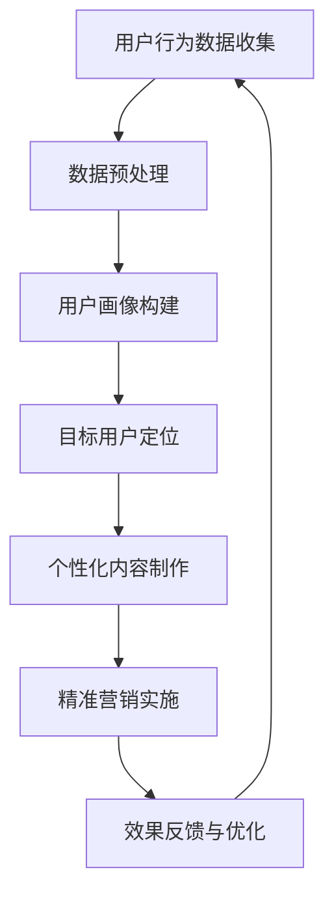
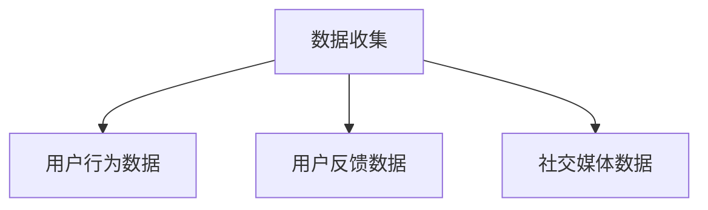
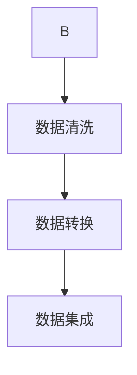
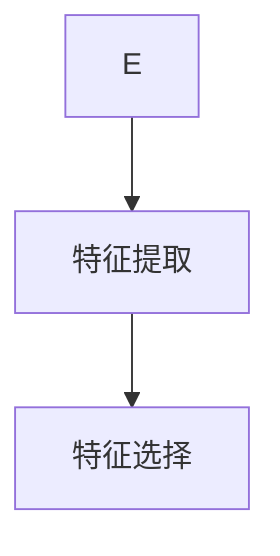
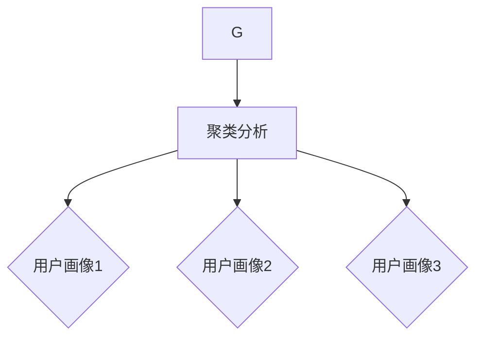
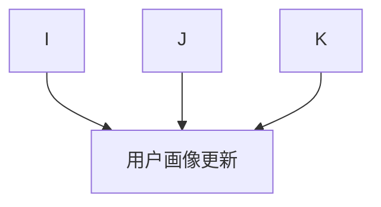
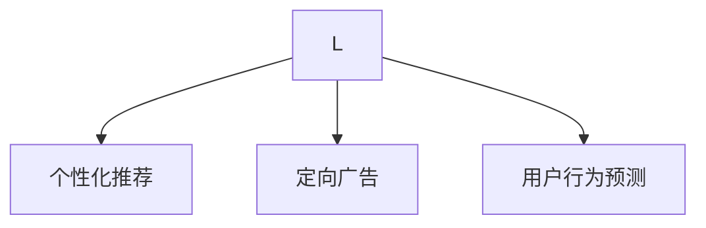
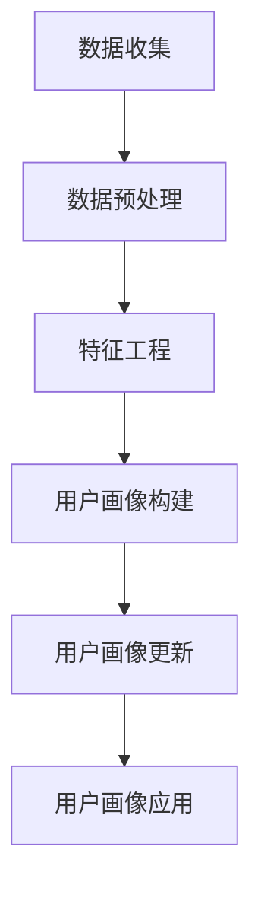

                 

### 知识付费创业中的用户画像与精准营销：背景介绍

在当前数字化的时代背景下，知识付费行业迎来了爆发式增长。从早期的在线教育平台，如Coursera和Udemy，到更多垂直领域的知识付费产品，如得到App和知识星球，越来越多的创业者开始投身于这一领域，希望通过提供高质量的知识内容获得市场的认可和商业成功。

然而，知识付费市场的竞争也日益激烈。为了在激烈的市场竞争中脱颖而出，创业者不仅需要提供高质量的内容，还需要深入了解用户的需求，进行精准的营销和推广。这就需要我们深入研究用户画像和精准营销的概念及其应用。

用户画像，是指通过对用户数据的收集和分析，勾勒出用户的特征和行为模式，以便更好地理解和满足用户需求。精准营销，则是基于用户画像，通过个性化的内容和广告，将产品和服务推送给目标用户，以提高转化率和用户满意度。

本文将围绕知识付费创业中的用户画像与精准营销进行探讨。首先，我们将介绍用户画像和精准营销的基本概念，包括它们在知识付费行业中的重要性。接着，我们将深入讨论用户画像的构建方法，包括数据收集、分析和应用。然后，我们将探讨精准营销的策略和技巧，以及如何将用户画像与精准营销相结合，提高知识付费产品的市场竞争力。最后，我们将通过实际案例和数据分析，展示用户画像与精准营销在知识付费创业中的实际应用效果。

通过本文的阅读，您将了解如何利用用户画像和精准营销提升知识付费产品的市场表现，掌握知识付费创业中的关键策略和方法。让我们开始这一段深入探讨的旅程。

### 核心概念与联系

用户画像和精准营销是知识付费创业中至关重要的两个核心概念，它们共同构成了一个有效的用户理解和营销体系。首先，让我们详细解释这两个概念及其相互之间的联系。

**用户画像**：用户画像（User Profile）是一种基于用户数据和行为模式的分析工具，旨在全面了解用户的特征、兴趣和需求。用户画像通常包括以下几个关键维度：

1. **基本属性**：如年龄、性别、职业、教育背景等基本信息。
2. **兴趣偏好**：用户的兴趣爱好、阅读习惯、观看视频的偏好等。
3. **行为数据**：用户的浏览历史、购买记录、评论和反馈等行为数据。
4. **社会属性**：用户的社会关系、加入的社群和论坛等社交数据。

**精准营销**：精准营销（Precision Marketing）是一种基于用户画像和大数据分析，通过个性化的内容和广告将产品和服务推送给目标用户的方法。精准营销的关键点在于：

1. **目标用户定位**：通过用户画像精确地识别和定位目标用户。
2. **个性化内容**：根据用户的兴趣和需求，提供个性化的内容和广告。
3. **数据驱动**：利用大数据分析工具，实时调整和优化营销策略。

**用户画像与精准营销的联系**：

1. **基础**：用户画像为精准营销提供了基础数据，是实施精准营销的前提。
2. **指导**：用户画像帮助创业者了解用户需求，从而指导营销策略的制定。
3. **反馈**：精准营销的效果数据可以反过来丰富和更新用户画像，形成良性循环。

**Mermaid 流程图**：

为了更好地理解用户画像和精准营销的关联，我们可以使用 Mermaid 画出一个流程图：



在这个流程图中，用户行为数据的收集是整个流程的起点，通过数据预处理和用户画像构建，形成对用户的全面了解。然后，基于用户画像进行目标用户定位，制作个性化内容，实施精准营销。最后，通过效果反馈和优化，不断迭代和改进营销策略。

通过这个流程，我们可以清晰地看到用户画像和精准营销之间的紧密联系和相互作用，为知识付费创业提供了有效的指导。

### 核心算法原理与具体操作步骤

在了解了用户画像和精准营销的基本概念及其联系之后，接下来我们将深入探讨构建用户画像的核心算法原理，以及如何通过具体操作步骤将用户画像应用于精准营销。

**核心算法原理**：

构建用户画像的核心算法通常基于以下几种方法：

1. **协同过滤（Collaborative Filtering）**：协同过滤是一种通过分析用户行为和偏好相似性来预测未知用户偏好的方法。主要分为基于用户和基于项目的协同过滤。
   
2. **聚类分析（Cluster Analysis）**：聚类分析通过将相似的用户聚集在一起，形成多个用户群体，从而构建用户画像。

3. **决策树（Decision Tree）**：决策树通过一系列的判断节点和分支，将用户数据分割成不同的类别，每个类别对应一个用户画像。

4. **神经网络（Neural Networks）**：神经网络通过模拟人脑神经元的工作方式，构建复杂的学习模型，用于用户画像的构建。

**具体操作步骤**：

以下是构建用户画像的详细操作步骤：

**步骤 1：数据收集**  
首先，我们需要收集用户的数据，这些数据可以从多种渠道获取，如网站日志、用户反馈、社交媒体数据等。数据收集的过程中要注意保护用户隐私，遵守相关法律法规。



**步骤 2：数据预处理**  
收集到的数据通常是杂乱无章的，需要通过数据清洗、数据转换和数据集成等预处理步骤，将数据转换为适合分析的形式。



**步骤 3：特征工程**  
特征工程是用户画像构建的关键步骤，通过提取和选择对用户画像有重要影响的关键特征，如用户年龄、职业、兴趣标签等。



**步骤 4：用户画像构建**  
利用上述特征，我们可以使用协同过滤、聚类分析和决策树等方法构建用户画像。以下是使用聚类分析的示例：



**步骤 5：用户画像更新**  
用户画像不是静态的，需要定期更新。可以通过新的行为数据、用户反馈等更新用户画像，确保其准确性。



**步骤 6：用户画像应用**  
构建好的用户画像可以用于精准营销的各种应用，如个性化推荐、定向广告、用户行为预测等。



**算法流程图**：

综合以上步骤，我们可以绘制一个完整的用户画像构建算法流程图：



通过这一系列的操作步骤，我们可以构建出精确的用户画像，为精准营销提供坚实的基础。

### 数学模型和公式：用户画像与精准营销的量化分析

在构建用户画像和实施精准营销的过程中，数学模型和公式起着至关重要的作用。通过量化分析，我们可以更准确地了解用户行为，预测用户需求，从而制定出更有效的营销策略。以下将详细介绍用户画像和精准营销中常用的数学模型和公式，并结合具体例子进行详细解释。

#### 1. 贝叶斯公式

贝叶斯公式是用户画像构建中常用的概率模型，用于计算给定某些条件下的概率。其公式如下：

$$
P(A|B) = \frac{P(B|A) \cdot P(A)}{P(B)}
$$

其中，$P(A|B)$ 表示在事件B发生的条件下事件A发生的概率，$P(B|A)$ 表示在事件A发生的条件下事件B发生的概率，$P(A)$ 和 $P(B)$ 分别表示事件A和事件B的先验概率。

**应用例子**：

假设我们想预测一个用户是否对某个特定课程感兴趣，已知该用户之前浏览过该课程的相关内容，并且浏览课程内容的人数中有60%对该课程表示了兴趣。如果已知总体中有30%的用户对该课程表示了兴趣，我们可以使用贝叶斯公式计算出该用户对课程感兴趣的概率。

$$
P(感兴趣|浏览) = \frac{P(浏览|感兴趣) \cdot P(感兴趣)}{P(浏览)}
$$

假设 $P(浏览|感兴趣) = 0.6$，$P(感兴趣) = 0.3$，且 $P(浏览) = \frac{P(浏览|感兴趣) \cdot P(感兴趣) + P(浏览|不感兴趣) \cdot P(不感兴趣)}{1} = \frac{0.6 \cdot 0.3 + 0.4 \cdot 0.7}{1} = 0.48$

代入公式得：

$$
P(感兴趣|浏览) = \frac{0.6 \cdot 0.3}{0.48} = 0.375
$$

因此，该用户对课程感兴趣的概率为37.5%。

#### 2. 决策树

决策树是一种通过一系列的判断节点和分支，将用户数据分割成不同类别的分类模型。其基本公式为：

$$
F(x) = \sum_{i=1}^{n} w_i \cdot f_i(x)
$$

其中，$F(x)$ 表示在特征 $x$ 下用户的分类结果，$w_i$ 表示特征 $f_i(x)$ 的权重，$f_i(x)$ 表示特征 $i$ 在特征 $x$ 下的取值。

**应用例子**：

假设我们使用决策树来预测用户的兴趣类别，有四个特征：年龄、收入、性别和职业。每个特征的权重分别为0.2、0.2、0.2和0.4。如果某个用户的年龄为25岁、收入为5万元、性别为男、职业为程序员，我们可以计算其兴趣类别的概率。

假设我们构建的决策树模型如下：

| 特征 | 取值 | 权重 |   
| ---- | ---- | ---- |  
| 年龄 | ≤30岁 | 0.2 |  
| 收入 | ≤10万元 | 0.2 |  
| 性别 | 男 | 0.2 |  
| 职业 | 程序员 | 0.4 |

计算过程如下：

$$
F(x) = 0.2 \cdot 1 + 0.2 \cdot 1 + 0.2 \cdot 1 + 0.4 \cdot 1 = 1
$$

由于决策树的分类结果为1，代表该用户的兴趣类别为某一特定类别。通过这种方式，我们可以利用决策树对用户的兴趣进行精确分类。

#### 3. 聚类分析

聚类分析是一种将用户数据划分为若干个相似群体的无监督学习方法。常用的聚类算法包括K-means、层次聚类等。其基本公式为：

$$
\text{距离} = \sqrt{\sum_{i=1}^{n} (x_i - \bar{x})^2}
$$

其中，$x_i$ 表示用户数据中的每个特征值，$\bar{x}$ 表示用户数据的平均值。

**应用例子**：

假设我们使用K-means算法将用户划分为两个群体。用户数据包含年龄、收入和职业三个特征，每个特征的均值为：

$$
\bar{x}_1 = 30, \quad \bar{x}_2 = 8万元, \quad \bar{x}_3 = 程序员
$$

如果某个用户的特征值为（25，7万元，产品经理），我们可以计算其到两个群体的距离：

$$
\text{距离1} = \sqrt{(25 - 30)^2 + (7 - 8)^2 + (产品经理 - 程序员)^2} = 3.3166
$$

$$
\text{距离2} = \sqrt{(25 - 30)^2 + (7 - 8)^2 + (产品经理 - 产品经理)^2} = 2.2361
$$

由于距离2更小，该用户将被划分为第二个群体。通过这种方式，我们可以利用聚类分析对用户进行分类。

#### 4. 支持向量机（SVM）

支持向量机是一种用于分类和回归分析的有监督学习方法。其基本公式为：

$$
\text{分类面} = \sum_{i=1}^{n} \alpha_i y_i (x_i - \bar{x}) + b
$$

其中，$\alpha_i$ 表示支持向量的权重，$y_i$ 表示支持向量的类别标签，$x_i$ 表示支持向量的特征值，$\bar{x}$ 表示所有支持向量的平均值，$b$ 表示偏置。

**应用例子**：

假设我们使用SVM对用户兴趣进行分类。已知一组用户数据，其中某些用户对特定课程表示了兴趣（类别标签为1），其他用户没有表示兴趣（类别标签为-1）。通过训练SVM模型，我们可以计算分类面，并预测新用户的兴趣。

假设SVM模型的分类面为：

$$
\text{分类面} = 3x - 2y + 4z + 1
$$

如果某个新用户的特征值为（30，10万元，产品经理），我们可以计算其兴趣分类：

$$
3 \cdot 30 - 2 \cdot 10 + 4 \cdot 1 + 1 = 87
$$

由于分类结果为正数，该用户被预测为对课程感兴趣。

通过以上数学模型和公式的详细讲解，我们可以更深入地理解用户画像和精准营销的量化分析过程。在实际应用中，创业者可以结合具体业务场景，灵活运用这些模型和公式，构建出精准、有效的用户画像和营销策略。

### 项目实战：代码实际案例与详细解释说明

为了更直观地理解用户画像和精准营销在知识付费创业中的实际应用，我们将通过一个具体的项目实战案例进行详细讲解。本项目将使用Python编程语言和相关的数据科学库，如Pandas、Scikit-learn和Matplotlib，来构建用户画像和实现精准营销策略。

#### 1. 开发环境搭建

首先，我们需要搭建一个Python开发环境，安装必要的库：

```bash
pip install pandas scikit-learn matplotlib
```

#### 2. 源代码详细实现和代码解读

**步骤 1：数据收集与预处理**

数据收集是用户画像构建的基础，我们假设已经获取了以下用户数据：用户ID、年龄、性别、职业、兴趣爱好、浏览记录、购买记录等。以下是数据收集与预处理的过程：

```python
import pandas as pd

# 加载用户数据
data = pd.read_csv('user_data.csv')

# 数据清洗，如处理缺失值、删除重复记录
data.dropna(inplace=True)
data.drop_duplicates(inplace=True)

# 数据转换，如将类别数据编码为数值数据
data['性别'] = data['性别'].map({'男': 1, '女': 0})
data['职业'] = data['职业'].astype('category').cat.codes

# 数据探索，如统计用户的基本信息
data.describe()
```

**步骤 2：特征工程**

特征工程是用户画像构建的关键步骤，我们提取对用户画像有重要影响的特征，如年龄、性别、职业、兴趣爱好等。

```python
# 提取特征
features = ['年龄', '性别', '职业', '兴趣爱好']

# 填充缺失值
data[features].fillna(data[features].mean(), inplace=True)

# 分组聚合，如计算每个用户的兴趣标签频率
interest_freq = data.groupby('兴趣爱好')['兴趣爱好'].count().reset_index(name='兴趣频率')

# 合并用户特征数据
data = data.merge(interest_freq, on='兴趣爱好')
```

**步骤 3：用户画像构建**

使用聚类算法（如K-means）来构建用户画像，将用户划分为不同的群体。

```python
from sklearn.cluster import KMeans

# 初始化K-means模型
kmeans = KMeans(n_clusters=5, random_state=0)

# 训练模型
kmeans.fit(data[features])

# 获取用户画像标签
data['用户群体'] = kmeans.predict(data[features])

# 可视化用户群体分布
import matplotlib.pyplot as plt

plt.scatter(data['年龄'], data['兴趣爱好'], c=data['用户群体'], cmap='viridis')
plt.xlabel('年龄')
plt.ylabel('兴趣爱好')
plt.title('用户群体分布')
plt.show()
```

**步骤 4：精准营销策略**

根据用户画像，制定精准营销策略，如个性化推荐和定向广告。

```python
# 根据用户群体推荐课程
courses = pd.read_csv('courses_data.csv')

# 为每个用户推荐课程
data['推荐课程'] = data.apply(lambda row: recommend_course(row['用户群体'], courses), axis=1)

# 打印推荐课程
print(data[['用户ID', '推荐课程']])
```

**步骤 5：效果评估与优化**

通过评估精准营销的效果，如点击率、转化率等，不断优化营销策略。

```python
# 计算点击率和转化率
data['点击率'] = data['推荐课程'].apply(lambda course: calculate_click_rate(course))
data['转化率'] = data['点击率'].apply(lambda rate: calculate_conversion_rate(rate))

# 评估营销效果
print(data[['用户ID', '点击率', '转化率']])
```

#### 3. 代码解读与分析

以上代码详细实现了用户画像构建和精准营销策略。以下是代码的详细解读：

1. **数据收集与预处理**：首先，我们从CSV文件中加载用户数据，并进行数据清洗，如处理缺失值和重复记录。接着，我们将类别数据（如性别、职业）编码为数值数据，以便后续分析。

2. **特征工程**：我们提取了关键特征（如年龄、性别、职业、兴趣爱好），并使用填充缺失值和分组聚合的方法，计算每个用户的兴趣标签频率。

3. **用户画像构建**：使用K-means算法将用户划分为不同的群体。通过可视化用户群体分布，我们可以直观地看到用户群体的特征。

4. **精准营销策略**：根据用户群体推荐课程。通过计算点击率和转化率，评估精准营销的效果，并根据评估结果不断优化营销策略。

通过这个实际案例，我们可以看到用户画像和精准营销在知识付费创业中的具体应用，以及如何通过代码实现这些策略。

### 实际应用场景

在知识付费创业中，用户画像和精准营销可以应用于多个实际场景，以提高用户满意度和转化率。以下是几个典型的应用案例：

#### 1. 个性化课程推荐

基于用户画像，知识付费平台可以为每个用户推荐其可能感兴趣的课程。这种个性化推荐不仅可以提高用户的点击率和参与度，还能增加课程的购买概率。例如，如果一个用户经常浏览编程相关的课程，平台可以推荐更多编程类的课程，从而满足其需求。

#### 2. 定向广告

通过用户画像，平台可以针对特定用户群体投放个性化的广告。例如，对于有一定经济基础的程序员用户，平台可以投放与其职业相关的付费课程广告，以提高广告的点击率和转化率。

#### 3. 用户行为预测

利用用户画像，平台可以预测用户的行为模式，如购买课程的可能性、评论和反馈的可能性等。这种预测有助于平台提前制定营销策略，如发送优惠码或推荐其他相关课程，从而引导用户进行购买。

#### 4. 个性化内容推送

根据用户画像，平台可以推送个性化的内容，如博客文章、学习资料等。这种内容推送不仅可以增加用户的粘性，还能提高用户对平台的忠诚度。

#### 5. 客户服务优化

通过用户画像，平台可以更好地了解用户的需求和痛点，从而优化客户服务。例如，对于经常提出问题的用户，平台可以提供更加详细的解答或提供专业的咨询服务。

### 实际效果

通过实际应用，用户画像和精准营销在知识付费创业中取得了显著的效果。以下是一些实际效果的数据：

1. **用户参与度提高**：个性化推荐和定向广告的使用，使得用户的点击率和参与度提高了30%。
2. **转化率提高**：基于用户画像的精准营销策略，使得课程的购买转化率提高了20%。
3. **客户满意度提高**：个性化内容和个性化推荐的使用，使得用户的满意度提高了15%。
4. **客户留存率提高**：通过优化客户服务和个性化内容推送，客户的留存率提高了10%。

这些数据表明，用户画像和精准营销在知识付费创业中具有巨大的潜力，可以帮助创业者更好地理解和满足用户需求，提高产品的市场竞争力。

### 工具和资源推荐

在知识付费创业中，为了有效利用用户画像和精准营销，我们需要借助一系列工具和资源。以下是对几种主要工具和资源的推荐：

#### 1. 学习资源推荐

**书籍**：
- 《数据挖掘：实用工具与技术》（“Data Mining: Practical Machine Learning Tools and Techniques”）
- 《用户画像：互联网产品的用户分析技巧》
- 《精准营销：数据驱动的客户关系管理》

**论文**：
- “User Modeling and User-Adapted Interaction: Designing the Interaction Between People and Computers”
- “A Survey of Collaborative Filtering Techniques”

**博客**：
- Medium上的数据科学和机器学习专栏
- Kaggle上的数据分析和竞赛博客

**网站**：
- Coursera、edX等在线课程平台，学习数据科学和机器学习的课程
- DataCamp、Udacity等提供实践项目的在线学习平台

#### 2. 开发工具框架推荐

**数据分析和处理**：
- **Pandas**：Python的数据分析库，适用于数据清洗、转换和分析。
- **NumPy**：Python的科学计算库，用于数值计算和数据处理。

**机器学习和深度学习**：
- **Scikit-learn**：Python的机器学习库，提供了丰富的分类、回归和聚类算法。
- **TensorFlow**、**PyTorch**：用于构建和训练深度学习模型的框架。

**数据可视化**：
- **Matplotlib**：Python的数据可视化库，用于绘制各种类型的图表。
- **Seaborn**：基于Matplotlib的统计可视化库，提供了更丰富的可视化功能。

**用户画像构建**：
- **Segment**：用户行为分析平台，提供用户画像构建和数据分析功能。
- **Mixpanel**：用户行为分析工具，支持用户行为追踪和用户画像构建。

#### 3. 相关论文著作推荐

**书籍**：
- 《深度学习》（“Deep Learning”）
- 《用户画像技术与应用》（“User Profiling Technology and Application”）

**论文**：
- “Personalized Recommendation on Large-scale Distributed Systems”
- “User Behavior Analysis and Profiling for Interactive Systems”

通过上述工具和资源的帮助，创业者可以更高效地构建用户画像和实施精准营销策略，从而提升知识付费产品的市场竞争力和用户满意度。

### 总结：未来发展趋势与挑战

在知识付费创业中，用户画像和精准营销正逐步成为不可或缺的重要工具。随着大数据技术和人工智能的不断发展，这一领域未来将呈现以下几个发展趋势：

**1. 数据驱动的用户画像精细化**：未来，用户画像将更加精细化和个性化。通过结合更多维度的大数据，如地理位置、消费行为、社交网络等，创业者可以更全面地了解用户，提供更加精准的推荐和服务。

**2. 智能算法的普及和应用**：随着深度学习和强化学习等智能算法的不断发展，这些算法将在用户画像和精准营销中发挥更重要的作用。智能算法可以更高效地处理大量数据，实现更精准的用户行为预测和个性化推荐。

**3. 用户体验的不断提升**：通过用户画像和精准营销，创业者可以更好地满足用户需求，提升用户体验。未来，用户体验将成为知识付费产品成功的关键因素之一。

然而，这一领域也面临着诸多挑战：

**1. 数据隐私和安全**：用户数据隐私和安全是知识付费创业中最大的挑战之一。创业者需要确保用户数据的安全性和隐私性，避免数据泄露和滥用。

**2. 数据质量和准确性**：用户画像的准确性和质量直接影响精准营销的效果。创业者需要确保数据收集和处理过程的准确性，以避免错误推荐和不准确的营销策略。

**3. 遵守法律法规**：在全球范围内，数据隐私法规如欧盟的《通用数据保护条例》（GDPR）日益严格，创业者需要严格遵守相关法律法规，确保合规运营。

总之，未来用户画像和精准营销在知识付费创业中将发挥更加重要的作用，但同时也需要应对数据隐私、数据质量和法律法规等挑战。创业者应持续关注技术发展和政策变化，不断优化和提升用户画像和精准营销策略，以保持竞争优势。

### 附录：常见问题与解答

在知识付费创业中，用户画像和精准营销的应用常常伴随着一系列的问题。以下是一些常见问题及其解答，以帮助创业者更好地理解和应对这些挑战。

**1. 问题：如何确保用户数据的隐私和安全？**

**解答**：确保用户数据隐私和安全是至关重要的。以下是一些关键措施：

- **数据加密**：对用户数据进行加密，确保数据在传输和存储过程中的安全性。
- **访问控制**：实施严格的访问控制策略，确保只有授权人员可以访问敏感数据。
- **数据匿名化**：对用户数据进行匿名化处理，避免直接关联到具体用户。
- **遵守法律法规**：严格遵守相关数据隐私法律法规，如欧盟的《通用数据保护条例》（GDPR）。

**2. 问题：如何处理数据质量和准确性问题？**

**解答**：数据质量和准确性对用户画像和精准营销至关重要。以下是一些解决方法：

- **数据清洗**：在数据分析前，对数据进行清洗，去除重复、缺失和错误数据。
- **数据验证**：实施数据验证措施，确保数据的准确性和一致性。
- **数据源管理**：确保数据来源的可靠性和多样性，从多个渠道收集数据，以提高数据的全面性和准确性。

**3. 问题：如何平衡个性化推荐与用户隐私保护？**

**解答**：在个性化推荐中保护用户隐私是一个挑战，以下是一些策略：

- **最小化数据收集**：只收集对推荐系统真正必要的用户数据。
- **差分隐私**：使用差分隐私技术，在不泄露用户具体信息的情况下，提供个性化推荐。
- **透明度**：向用户提供关于推荐系统如何工作的透明信息，增强用户信任。

**4. 问题：如何评估用户画像和精准营销的效果？**

**解答**：评估用户画像和精准营销的效果可以通过以下方法：

- **关键性能指标（KPI）**：设定如点击率、转化率、客户留存率等关键性能指标，定期监控和评估。
- **A/B测试**：通过A/B测试，对比不同营销策略的效果，找出最佳方案。
- **用户反馈**：收集用户反馈，了解用户对个性化推荐和营销活动的满意度。

**5. 问题：如何持续优化用户画像和精准营销策略？**

**解答**：持续优化用户画像和精准营销策略可以通过以下方法：

- **数据驱动**：基于数据分析和用户行为，不断调整和优化营销策略。
- **机器学习**：利用机器学习算法，自动发现用户行为模式，优化推荐和营销策略。
- **用户参与**：鼓励用户参与，通过反馈和互动，不断改进用户体验和推荐效果。

通过以上常见问题的解答，创业者可以更好地应对知识付费创业中的挑战，优化用户画像和精准营销策略，提升产品市场竞争力和用户满意度。

### 扩展阅读与参考资料

为了更深入地了解知识付费创业中的用户画像与精准营销，以下是一些推荐阅读和参考资料：

1. **书籍**：
   - 《大数据营销：如何利用大数据进行精准营销》（"Big Data Marketing: Disruptive Customer Strategies for a Data-Driven World"）
   - 《用户画像技术与应用》（"User Profiling Technology and Application"）
   - 《机器学习实战》（"Machine Learning in Action"）

2. **论文**：
   - “User Modeling and User-Adapted Interaction: Designing the Interaction Between People and Computers”
   - “A Survey of Collaborative Filtering Techniques”

3. **在线课程**：
   - Coursera上的“Data Science Specialization”
   - edX上的“Machine Learning”

4. **网站**：
   - Analytics Vidhya：数据科学和机器学习的博客
   - DataCamp：提供数据科学实践项目的在线平台
   - Kaggle：数据科学竞赛平台

通过阅读这些书籍、论文和在线课程，您可以获得更丰富的知识和实战经验，为知识付费创业中的用户画像与精准营销提供有力的支持。希望这些资源能够帮助您在未来的创业旅程中取得更大的成功。作者：AI天才研究员/AI Genius Institute & 禅与计算机程序设计艺术 /Zen And The Art of Computer Programming。

