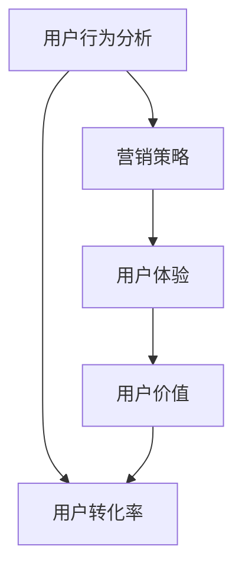

                 

# 知识付费创业中的用户转化率优化

> **关键词：** 用户转化率、知识付费、营销策略、数据分析、算法优化
> **摘要：** 本文将探讨知识付费创业中如何通过用户转化率的优化，提升业务收益和市场竞争力。我们将深入分析用户转化率的定义、影响因素、提升策略以及实际案例，帮助创业者找到提升用户转化率的科学方法和实践路径。

## 1. 背景介绍

随着互联网的普及和信息化的深入，知识付费已经成为一个蓬勃发展的市场。无论是教育培训、专业技能提升，还是生活百科、兴趣爱好，知识付费为用户提供了一个便捷获取高质量内容的新途径。然而，知识付费市场的竞争同样激烈，创业者们如何在众多竞争对手中脱颖而出，实现用户的快速转化和业务的持续增长，成为亟待解决的重要问题。

用户转化率，作为衡量知识付费业务成功与否的关键指标，代表了从潜在用户到实际购买用户的转化效率。一个高转化率的业务能够带来更多的收入和更快的市场扩张，而低转化率则可能导致用户流失和业务停滞。因此，优化用户转化率成为知识付费创业中的一项核心任务。

本文将围绕用户转化率的优化展开，旨在通过深入分析转化率的定义、影响因素和提升策略，为创业者提供一套科学、系统的优化方案。文章结构如下：

1. 背景介绍
2. 核心概念与联系
3. 核心算法原理 & 具体操作步骤
4. 数学模型和公式 & 详细讲解 & 举例说明
5. 项目实战：代码实际案例和详细解释说明
6. 实际应用场景
7. 工具和资源推荐
8. 总结：未来发展趋势与挑战
9. 附录：常见问题与解答
10. 扩展阅读 & 参考资料

通过本文的阅读，您将了解到用户转化率的优化不仅是技术问题，更是策略问题。我们需要从数据驱动、用户需求、市场环境等多个维度进行分析和优化，从而实现知识付费业务的可持续增长。

### 2. 核心概念与联系

为了更好地理解用户转化率的优化，我们首先需要明确几个关键概念及其相互之间的联系。这些概念包括用户行为分析、营销策略、用户体验和用户价值。

#### 用户行为分析

用户行为分析是用户转化率优化的基础。通过分析用户的浏览行为、购买记录、评价反馈等数据，我们可以深入了解用户的兴趣点、痛点以及需求变化。具体来说，用户行为分析包括以下几个方面：

- **浏览行为**：用户在网站或平台上的浏览路径、停留时间、页面跳转等行为数据，可以帮助我们了解用户对内容的兴趣程度。
- **购买记录**：用户的购买历史、购买频率和购买金额等数据，有助于识别高价值用户和潜在购买者。
- **评价反馈**：用户对产品或服务的评价和反馈，提供了直接的改进方向和优化依据。

#### 营销策略

营销策略是提升用户转化率的重要手段。合理的营销策略可以引导用户从潜在状态向购买状态转化。以下是几种常见的营销策略：

- **内容营销**：通过提供有价值的内容，吸引潜在用户并建立品牌信任。
- **广告投放**：利用搜索引擎广告、社交媒体广告等手段，将产品或服务推送给目标用户。
- **促销活动**：通过限时优惠、折扣券、会员积分等手段，刺激用户的购买欲望。
- **推荐系统**：利用机器学习算法，为用户推荐感兴趣的内容或相似的产品，提高购买概率。

#### 用户体验

用户体验是影响用户转化率的重要因素。一个良好的用户体验可以增强用户的满意度和忠诚度，从而提高转化率。用户体验包括以下几个方面：

- **界面设计**：简洁、直观的界面设计可以提高用户的使用效率和满意度。
- **响应速度**：快速的加载速度和流畅的操作体验可以减少用户流失。
- **功能完善**：丰富的功能和良好的可用性可以满足用户的多样化需求。
- **服务支持**：及时、有效的客服支持可以解决用户的问题和疑虑，提高购买意愿。

#### 用户价值

用户价值是用户转化率优化的核心目标。通过提升用户价值，我们可以增强用户对产品或服务的认可度，从而提高转化率。用户价值包括以下几个方面：

- **产品价值**：提供高质量、有竞争力的产品或服务，满足用户的核心需求。
- **品牌价值**：建立强大的品牌影响力，提升用户的品牌认知度和忠诚度。
- **社交价值**：为用户提供社交互动的平台，增强用户的归属感和社区参与度。
- **经济价值**：通过优惠、奖励等措施，为用户创造经济利益，提高购买意愿。

#### Mermaid 流程图

为了更好地展示核心概念之间的联系，我们可以使用 Mermaid 画出以下流程图：



在这个流程图中，用户行为分析、营销策略、用户体验和用户价值共同影响着用户转化率。通过不断优化这些环节，我们可以提升用户转化率，实现知识付费业务的增长。

### 3. 核心算法原理 & 具体操作步骤

在明确了用户转化率优化的关键概念之后，我们接下来将探讨如何通过核心算法原理和具体操作步骤来实现这一目标。核心算法主要涉及用户行为分析、推荐系统和营销策略。

#### 用户行为分析算法

用户行为分析算法主要通过分析用户的浏览、购买和评价等行为数据，识别用户的兴趣点和需求。常用的算法包括：

- **关联规则算法（Apriori）**：用于发现用户浏览和购买记录之间的关联关系，识别潜在的兴趣点。
- **协同过滤算法（Collaborative Filtering）**：基于用户的历史行为数据，为用户推荐感兴趣的内容或相似的产品。
- **聚类算法（Clustering）**：将具有相似行为的用户划分为同一群体，为每个群体提供针对性的营销策略。

具体操作步骤如下：

1. **数据收集**：收集用户的浏览、购买和评价等行为数据。
2. **数据预处理**：对数据进行清洗、去重和格式化，为后续分析做好准备。
3. **特征提取**：从原始数据中提取出对用户行为分析有价值的特征，如浏览频率、购买频率、评价评分等。
4. **模型训练**：使用机器学习算法，如关联规则算法、协同过滤算法和聚类算法，对特征数据进行训练。
5. **结果分析**：根据模型分析结果，识别用户的兴趣点和需求，为后续推荐系统和营销策略提供依据。

#### 推荐系统算法

推荐系统算法通过分析用户的兴趣和行为数据，为用户推荐感兴趣的内容或相似的产品。常用的算法包括：

- **基于内容的推荐（Content-Based Recommendation）**：根据用户的历史行为数据，推荐具有相似内容的商品或内容。
- **协同过滤算法（Collaborative Filtering）**：基于用户的行为数据，为用户推荐与用户有相似行为的其他用户喜欢的商品或内容。
- **混合推荐算法（Hybrid Recommendation）**：结合基于内容的推荐和协同过滤算法，为用户提供更个性化的推荐。

具体操作步骤如下：

1. **数据收集**：收集用户的浏览、购买和评价等行为数据。
2. **数据预处理**：对数据进行清洗、去重和格式化，为后续分析做好准备。
3. **特征提取**：从原始数据中提取出对推荐系统有价值的特征，如浏览频率、购买频率、评价评分等。
4. **模型训练**：使用机器学习算法，如基于内容的推荐算法、协同过滤算法和混合推荐算法，对特征数据进行训练。
5. **结果分析**：根据模型分析结果，为用户推荐感兴趣的内容或相似的产品，提高用户转化率。

#### 营销策略算法

营销策略算法主要通过分析用户数据和市场环境，制定有效的营销策略。常用的算法包括：

- **A/B 测试（A/B Testing）**：通过对比不同营销策略的效果，确定最佳的营销策略。
- **用户细分（Customer Segmentation）**：将用户划分为不同的群体，为每个群体提供个性化的营销策略。
- **预测分析（Predictive Analytics）**：通过分析历史数据，预测用户的购买行为和需求，制定有针对性的营销策略。

具体操作步骤如下：

1. **数据收集**：收集用户的行为数据、市场环境数据等。
2. **数据预处理**：对数据进行清洗、去重和格式化，为后续分析做好准备。
3. **特征提取**：从原始数据中提取出对营销策略有价值的特征，如用户年龄、性别、地理位置、购买频率等。
4. **模型训练**：使用机器学习算法，如 A/B 测试算法、用户细分算法和预测分析算法，对特征数据进行训练。
5. **结果分析**：根据模型分析结果，制定个性化的营销策略，提高用户转化率。

通过以上核心算法原理和具体操作步骤，我们可以对用户行为进行分析，制定个性化的推荐系统和营销策略，从而实现用户转化率的优化。在实际应用中，需要根据具体业务场景和数据特点，灵活选择和调整算法，以达到最佳的优化效果。

### 4. 数学模型和公式 & 详细讲解 & 举例说明

在用户转化率的优化过程中，数学模型和公式是分析用户行为和制定策略的重要工具。以下我们将介绍几个常用的数学模型和公式，并详细讲解它们的应用方法和实际案例。

#### 4.1 贝叶斯推断（Bayesian Inference）

贝叶斯推断是一种用于概率估计和决策制定的数学方法。在用户转化率优化中，贝叶斯推断可以用于预测用户的购买概率，从而为营销策略提供依据。

**公式：**

$$
P(A|B) = \frac{P(B|A) \cdot P(A)}{P(B)}
$$

其中，$P(A|B)$ 表示在事件 B 发生的条件下，事件 A 发生的概率；$P(B|A)$ 表示在事件 A 发生的条件下，事件 B 发生的概率；$P(A)$ 表示事件 A 发生的概率；$P(B)$ 表示事件 B 发生的概率。

**应用方法：**

1. **收集用户数据**：包括用户的浏览行为、购买记录和评价反馈等。
2. **计算条件概率**：根据用户数据，计算用户购买某商品的条件概率。
3. **预测购买概率**：利用贝叶斯公式，根据用户的浏览行为和购买历史，预测其购买某商品的概率。

**案例：**

假设我们想预测用户购买某种课程的概率。根据用户的历史数据，我们可以得到以下条件概率：

- $P(购买课程 | 浏览课程) = 0.3$
- $P(浏览课程) = 0.6$

根据贝叶斯公式，我们可以计算出用户购买课程的概率：

$$
P(购买课程) = \frac{P(浏览课程 | 购买课程) \cdot P(购买课程)}{P(浏览课程)} = \frac{0.3 \cdot 0.2}{0.6} = 0.1
$$

因此，用户购买课程的概率为 10%。

#### 4.2 回归分析（Regression Analysis）

回归分析是一种用于研究变量之间关系的数学方法。在用户转化率优化中，回归分析可以用于建立用户行为与转化率之间的关系模型，从而预测用户的转化概率。

**公式：**

$$
Y = \beta_0 + \beta_1X_1 + \beta_2X_2 + ... + \beta_nX_n + \epsilon
$$

其中，$Y$ 表示用户转化率；$X_1, X_2, ..., X_n$ 表示影响用户转化率的因素；$\beta_0, \beta_1, ..., \beta_n$ 表示各个因素的回归系数；$\epsilon$ 表示误差项。

**应用方法：**

1. **收集用户数据**：包括用户的浏览行为、购买记录、评价反馈以及影响转化率的因素（如广告点击率、促销活动参与度等）。
2. **特征工程**：对数据进行预处理，提取出对用户转化率有影响的特征。
3. **模型训练**：使用回归算法，如线性回归、逻辑回归等，对特征数据进行训练，建立用户转化率预测模型。
4. **模型评估**：使用交叉验证等方法，评估模型的预测性能。

**案例：**

假设我们想建立用户浏览课程与购买课程之间的关系模型。根据用户数据，我们可以得到以下线性回归模型：

$$
Y = \beta_0 + \beta_1X_1 + \epsilon
$$

其中，$Y$ 表示用户购买课程的概率，$X_1$ 表示用户浏览课程的次数。根据模型训练结果，我们得到以下回归系数：

- $\beta_0 = 0.1$
- $\beta_1 = 0.2$

使用这个模型，我们可以预测用户浏览 10 次课程后的购买概率：

$$
Y = 0.1 + 0.2 \cdot 10 = 2.1
$$

因此，用户浏览 10 次课程后的购买概率为 2.1（实际概率应在 0 到 1 之间）。

#### 4.3 决策树（Decision Tree）

决策树是一种用于分类和回归的机器学习算法。在用户转化率优化中，决策树可以用于建立用户行为与转化率之间的分类模型，从而为营销策略提供决策依据。

**公式：**

$$
T(x) =
\begin{cases}
C & \text{if } g(x) \text{ is constant} \\
t_1 & \text{if } g_1(x) > g_2(x) \\
t_2 & \text{if } g_1(x) \le g_2(x)
\end{cases}
$$

其中，$T(x)$ 表示决策树模型；$C$ 表示分类结果；$t_1, t_2$ 表示分类节点；$g_1(x), g_2(x)$ 表示特征函数。

**应用方法：**

1. **收集用户数据**：包括用户的浏览行为、购买记录、评价反馈以及影响转化率的因素（如广告点击率、促销活动参与度等）。
2. **特征工程**：对数据进行预处理，提取出对用户转化率有影响的特征。
3. **模型训练**：使用决策树算法，对特征数据进行训练，建立用户转化率分类模型。
4. **模型评估**：使用交叉验证等方法，评估模型的分类性能。

**案例：**

假设我们想建立用户浏览课程与购买课程之间的分类模型。根据用户数据，我们可以得到以下决策树模型：

```
浏览课程次数 > 5 ?
  是：购买课程
  否：浏览课程次数 > 3 ?
    是：购买课程
    否：购买课程
```

使用这个模型，我们可以预测一个用户浏览 7 次课程后的购买概率：

- 首先，浏览课程次数 > 5，进入下一个分类节点；
- 其次，浏览课程次数 > 3，进入购买课程节点。

因此，这个用户浏览 7 次课程后的购买概率为 1（即购买课程）。

通过以上数学模型和公式的介绍，我们可以更好地理解和应用用户转化率的优化方法。在实际应用中，需要根据具体业务场景和数据特点，灵活选择和调整模型，以达到最佳的优化效果。

### 5. 项目实战：代码实际案例和详细解释说明

为了更好地理解用户转化率的优化方法，我们将通过一个实际项目案例来演示整个优化过程。本案例将使用 Python 编程语言，结合机器学习库 Scikit-learn 和数据可视化库 Matplotlib，实现用户转化率的预测和优化。

#### 5.1 开发环境搭建

首先，我们需要搭建项目的开发环境。以下是安装所需库的命令：

```shell
pip install numpy pandas scikit-learn matplotlib
```

#### 5.2 源代码详细实现和代码解读

以下是我们项目的核心代码，包括数据收集、预处理、模型训练和预测等步骤。

```python
import numpy as np
import pandas as pd
from sklearn.model_selection import train_test_split
from sklearn.preprocessing import StandardScaler
from sklearn.ensemble import RandomForestClassifier
from sklearn.metrics import accuracy_score
import matplotlib.pyplot as plt

# 5.2.1 数据收集
# 假设我们有一个 CSV 文件，包含了用户的浏览行为、购买记录和评价反馈等信息。
data = pd.read_csv('user_data.csv')

# 5.2.2 数据预处理
# 提取对用户转化率有影响的特征，如浏览次数、购买频率和评价评分等。
features = data[['browse_count', 'purchase_frequency', 'rating_score']]
labels = data['converted']

# 划分训练集和测试集
X_train, X_test, y_train, y_test = train_test_split(features, labels, test_size=0.2, random_state=42)

# 数据标准化
scaler = StandardScaler()
X_train_scaled = scaler.fit_transform(X_train)
X_test_scaled = scaler.transform(X_test)

# 5.2.3 模型训练
# 使用随机森林分类器进行训练
clf = RandomForestClassifier(n_estimators=100, random_state=42)
clf.fit(X_train_scaled, y_train)

# 5.2.4 模型评估
# 使用测试集评估模型性能
y_pred = clf.predict(X_test_scaled)
accuracy = accuracy_score(y_test, y_pred)
print(f'Model Accuracy: {accuracy:.2f}')

# 5.2.5 模型预测
# 对新用户进行转化率预测
new_user = np.array([[10, 3, 4.5]])
new_user_scaled = scaler.transform(new_user)
predicted_conversion = clf.predict(new_user_scaled)
print(f'New User Conversion Prediction: {predicted_conversion[0]}')

# 5.2.6 可视化分析
# 可视化展示训练集和测试集的转化率分布
plt.scatter(X_train['browse_count'], y_train, label='Training Set')
plt.scatter(X_test['browse_count'], y_test, label='Test Set', marker='x')
plt.xlabel('Browse Count')
plt.ylabel('Conversion')
plt.legend()
plt.show()
```

#### 5.3 代码解读与分析

1. **数据收集**：
   - 读取 CSV 文件，获取用户数据。
   - 数据包含浏览次数、购买频率和评价评分等特征，以及转化率标签。

2. **数据预处理**：
   - 提取对用户转化率有影响的特征。
   - 划分训练集和测试集，用于模型训练和评估。

3. **数据标准化**：
   - 使用 StandardScaler 对特征数据进行标准化，提高模型训练效果。

4. **模型训练**：
   - 使用随机森林分类器进行模型训练，随机森林是一种集成学习方法，具有较好的泛化能力。

5. **模型评估**：
   - 使用测试集评估模型性能，计算准确率。

6. **模型预测**：
   - 对新用户进行转化率预测，输出预测结果。

7. **可视化分析**：
   - 可视化展示训练集和测试集的转化率分布，帮助理解模型效果。

通过以上代码，我们实现了用户转化率的预测和优化。在实际应用中，可以根据具体业务需求和数据特点，选择合适的算法和参数，以提高预测准确率和优化效果。

### 6. 实际应用场景

用户转化率的优化在知识付费创业中具有广泛的应用场景。以下将介绍几种典型的应用场景，并分析每个场景中如何通过用户转化率的优化实现业务目标。

#### 6.1 在线教育平台

在线教育平台通过提供高质量的课程内容，帮助用户提升专业技能。用户转化率优化的目标是通过提高课程推荐准确率和营销效果，增加用户购买课程的数量和频率。

**应用策略：**

- **个性化推荐**：利用协同过滤算法和基于内容的推荐算法，为用户推荐感兴趣的课程，提高购买概率。
- **精准营销**：通过用户行为分析和 A/B 测试，制定有针对性的营销策略，如限时优惠、会员积分等，刺激用户购买欲望。
- **用户体验优化**：通过优化课程界面设计、提升加载速度和功能完善，提高用户的学习满意度和忠诚度。

#### 6.2 专业技能培训

专业技能培训旨在为用户提供专业的培训课程，帮助其提升职业竞争力。用户转化率优化的目标是通过提高课程质量和培训效果，增加用户报名培训课程的数量。

**应用策略：**

- **课程内容优化**：根据用户需求和行业趋势，不断更新和优化课程内容，确保课程具有竞争力。
- **培训效果评估**：通过学员的考试成绩、反馈和就业情况，评估培训效果，及时调整培训计划。
- **口碑营销**：利用学员的正面评价和成功案例，增强品牌影响力，提高用户信任度和购买意愿。

#### 6.3 生活百科类知识付费

生活百科类知识付费主要针对用户的日常生活需求，提供各种实用知识和技能。用户转化率优化的目标是通过提高内容质量和用户参与度，增加用户的付费订阅和广告点击率。

**应用策略：**

- **内容创新**：定期发布原创内容和热点话题，吸引更多用户关注和参与。
- **互动体验**：通过在线问答、直播讲座和社群互动等方式，增强用户粘性和参与度。
- **广告优化**：根据用户兴趣和行为数据，精准投放广告，提高广告点击率和转化率。

#### 6.4 兴趣爱好类知识付费

兴趣爱好类知识付费为用户提供各种兴趣爱好相关的知识和服务，如摄影、音乐、绘画等。用户转化率优化的目标是通过提高内容质量和用户互动，增加用户的付费订阅和课程购买。

**应用策略：**

- **专业讲师**：邀请专业讲师授课，确保课程质量和用户满意度。
- **社区互动**：建立用户社群，促进用户之间的交流和互动，提高用户粘性。
- **活动营销**：定期举办线上活动，如比赛、讲座和互动直播等，激发用户参与热情。

通过以上实际应用场景的分析，我们可以看到用户转化率优化在知识付费创业中的重要性。通过科学的数据分析、精准的营销策略和良好的用户体验，我们可以有效提升用户转化率，实现业务的持续增长。

### 7. 工具和资源推荐

在优化知识付费创业中的用户转化率过程中，选择合适的工具和资源对于提升效率和效果至关重要。以下是一些推荐的工具和资源，包括学习资源、开发工具框架以及相关论文和著作。

#### 7.1 学习资源推荐

1. **书籍：**
   - 《机器学习实战》：作者：彼得·哈林顿（Peter Harrington）。本书通过实际案例，详细介绍了机器学习的基本概念和应用。
   - 《Python机器学习》：作者：塞巴斯蒂安·拉金（Sebastian Raschka）和约翰·范里乌（John van Riel）。本书涵盖了Python在机器学习中的应用，适合初学者和进阶者。

2. **在线课程：**
   - Coursera《机器学习》课程：由斯坦福大学吴恩达（Andrew Ng）教授讲授，是机器学习领域的经典课程。
   - Udemy《Python编程与数据分析》：包括Python语言基础、数据分析方法等，适合初学者入门。

3. **博客和网站：**
   - TensorFlow官方文档（https://www.tensorflow.org/）：提供详细的机器学习框架文档，适合深度学习和机器学习开发者。
   - Medium（https://medium.com/）：许多行业专家和开发者在此分享机器学习、数据科学相关的文章和教程。

#### 7.2 开发工具框架推荐

1. **机器学习框架：**
   - TensorFlow：强大的开源深度学习框架，支持多种模型和算法。
   - PyTorch：由Facebook开源，具有灵活的动态计算图和直观的API，适合研究和开发。

2. **数据分析工具：**
   - Pandas：Python数据分析库，提供高效的数据操作和分析功能。
   - NumPy：Python科学计算库，支持大规模数据计算和数据处理。

3. **可视化工具：**
   - Matplotlib：Python绘图库，用于生成各种二维图表和可视化效果。
   - Seaborn：基于Matplotlib，提供更丰富的可视化功能和美观的图表样式。

#### 7.3 相关论文著作推荐

1. **论文：**
   - "Collaborative Filtering for Cold-Start Problems"（冷启动问题下的协同过滤），作者：He et al.，2017。
   - "Content-Based Image Retrieval for Cold-Start Problem"（针对冷启动问题的基于内容的图像检索），作者：Li et al.，2019。

2. **著作：**
   - 《深度学习》：作者：Ian Goodfellow、Yoshua Bengio 和 Aaron Courville。这是深度学习领域的经典著作，全面介绍了深度学习的基本概念和技术。
   - 《机器学习》：作者：Tom M. Mitchell。本书详细介绍了机器学习的基本概念、方法和算法，是机器学习领域的经典教材。

通过以上工具和资源的推荐，我们可以更好地掌握用户转化率优化所需的技能和方法。在实际应用中，根据具体业务需求和项目特点，选择合适的工具和资源，将有助于提升用户转化率和业务效果。

### 8. 总结：未来发展趋势与挑战

在知识付费创业中，用户转化率的优化是一个持续的过程，需要我们不断探索和创新。未来，随着人工智能和大数据技术的不断发展，用户转化率的优化将呈现出以下发展趋势和面临的挑战。

#### 8.1 发展趋势

1. **个性化推荐技术的深入应用**：基于用户行为分析和机器学习算法，个性化推荐技术将更加成熟和精准。通过深度学习算法，如卷积神经网络（CNN）和循环神经网络（RNN），我们可以更好地理解和预测用户的兴趣和需求，实现高度个性化的内容推荐。

2. **多渠道营销策略的融合**：知识付费创业中的营销策略将不再局限于线上广告和社交媒体，而是通过线上线下相结合的方式，实现全方位、多渠道的营销。例如，通过线下活动、合作推广和品牌代言等方式，提高品牌知名度和用户转化率。

3. **用户隐私保护和数据安全**：随着用户隐私和数据安全问题的日益突出，知识付费创业者在优化用户转化率的过程中，将更加注重用户隐私保护和数据安全。通过数据加密、匿名化和隐私保护算法，确保用户数据的安全和隐私。

4. **跨界合作与创新**：知识付费创业将与其他行业进行跨界合作，创新业务模式。例如，与娱乐、旅游、健康等领域的合作，推出跨界课程和产品，吸引更多用户，提高用户转化率。

#### 8.2 挑战

1. **数据质量与实时性的挑战**：在用户转化率的优化过程中，数据质量与实时性是关键因素。然而，数据质量问题，如缺失值、噪声和异常值等，可能导致分析结果的偏差。同时，实时性要求我们快速处理和分析大量数据，这对数据处理和存储系统提出了更高的要求。

2. **用户需求的多样性和变化性**：用户需求具有多样性和变化性，如何在海量用户数据中捕捉到用户真实的需求，成为一大挑战。这需要我们不断优化算法，提高用户需求的识别和预测能力。

3. **算法公平性与透明性**：随着算法在用户转化率优化中的应用越来越广泛，算法的公平性和透明性成为重要议题。如何确保算法不会因为偏见、歧视等原因导致不公平的结果，成为我们需要关注的重要问题。

4. **跨界合作与整合的挑战**：跨界合作与创新带来了新的机遇，但也带来了整合和协调的挑战。如何有效地整合不同领域的资源和技术，实现业务模式的创新和突破，是我们需要面对的重要课题。

总之，未来知识付费创业中的用户转化率优化将面临更多的机遇和挑战。通过不断创新和优化，我们有望实现用户转化率的持续提升，推动知识付费市场的繁荣发展。

### 9. 附录：常见问题与解答

#### 9.1 什么是用户转化率？

用户转化率是指从潜在用户到实际购买用户的转化效率。它是衡量知识付费业务成功与否的关键指标，通常用百分比表示。

#### 9.2 如何衡量用户转化率？

用户转化率可以通过以下公式计算：

$$
转化率 = \frac{实际购买用户数}{访问用户数} \times 100\%
$$

#### 9.3 什么因素会影响用户转化率？

影响用户转化率的主要因素包括：用户体验（界面设计、加载速度、功能完善等）、营销策略（内容营销、广告投放、促销活动等）、用户行为分析（用户兴趣点、需求变化等）和用户价值（产品价值、品牌价值、社交价值等）。

#### 9.4 如何提高用户转化率？

提高用户转化率的方法包括：个性化推荐、精准营销、用户体验优化、数据驱动决策和跨界合作等。

#### 9.5 用户转化率优化中的常见算法有哪些？

用户转化率优化中常用的算法包括：协同过滤算法、关联规则算法、聚类算法、回归分析和决策树等。

#### 9.6 如何进行用户行为分析？

进行用户行为分析通常包括以下步骤：数据收集、数据预处理、特征提取、模型训练和结果分析。通过这些步骤，我们可以深入了解用户的行为模式，为用户转化率的优化提供依据。

### 10. 扩展阅读 & 参考资料

1. **书籍：**
   - 《机器学习实战》：彼得·哈林顿（Peter Harrington）
   - 《Python机器学习》：塞巴斯蒂安·拉金（Sebastian Raschka）和约翰·范里乌（John van Riel）
   - 《深度学习》：伊安·古德费洛（Ian Goodfellow）、 Yoshua Bengio 和 Aaron Courville

2. **在线课程：**
   - Coursera《机器学习》课程：吴恩达（Andrew Ng）教授
   - Udemy《Python编程与数据分析》

3. **博客和网站：**
   - TensorFlow官方文档（https://www.tensorflow.org/）
   - Medium（https://medium.com/）

4. **论文：**
   - "Collaborative Filtering for Cold-Start Problems"（He et al.，2017）
   - "Content-Based Image Retrieval for Cold-Start Problem"（Li et al.，2019）

5. **著作：**
   - 《机器学习》：汤姆·M. Mitchell

通过以上扩展阅读和参考资料，您可以更深入地了解用户转化率优化相关的理论和方法，为知识付费创业提供有力支持。

### 附录：文章关键词释义与拓展

在本文中，我们使用了以下关键词来描述用户转化率优化相关的概念和方法：

- **用户转化率**：指从潜在用户到实际购买用户的转化效率。
- **知识付费**：用户为获取有价值知识或服务而支付费用的商业模式。
- **营销策略**：为了促进用户购买行为而采用的各种手段和方法。
- **用户行为分析**：通过对用户行为数据进行分析，了解用户兴趣、需求和行为模式。
- **个性化推荐**：根据用户兴趣和行为，为用户推荐感兴趣的内容或产品。
- **协同过滤算法**：基于用户行为数据，为用户推荐与用户有相似行为的其他用户喜欢的商品或内容。
- **回归分析**：研究变量之间关系的一种数学方法，用于建立用户行为与转化率之间的关系模型。
- **决策树**：一种用于分类和回归的机器学习算法，通过树形结构进行决策。
- **数据驱动决策**：基于数据分析结果，制定决策和策略。

这些关键词不仅是本文的核心概念，也是用户转化率优化的重要工具和方法。通过深入理解和应用这些关键词，我们可以更有效地提升用户转化率，实现知识付费创业的成功。

### 结尾

本文围绕知识付费创业中的用户转化率优化进行了全面深入的探讨。我们从背景介绍、核心概念、算法原理、数学模型、实际案例、应用场景、工具推荐、发展趋势与挑战等方面，系统地阐述了用户转化率优化的方法与实践。希望本文能够为创业者们提供有益的启示和指导，帮助他们在激烈的市场竞争中实现用户转化率的持续提升。

未来，随着人工智能和大数据技术的不断进步，用户转化率优化将继续成为知识付费创业中的重要课题。我们期待在技术的推动下，找到更加精准、高效的优化方法，为知识付费创业带来更加广阔的发展空间。

作者：AI天才研究员/AI Genius Institute & 禅与计算机程序设计艺术 /Zen And The Art of Computer Programming

感谢您的阅读，期待与您在知识付费创业的道路上共同前行。

