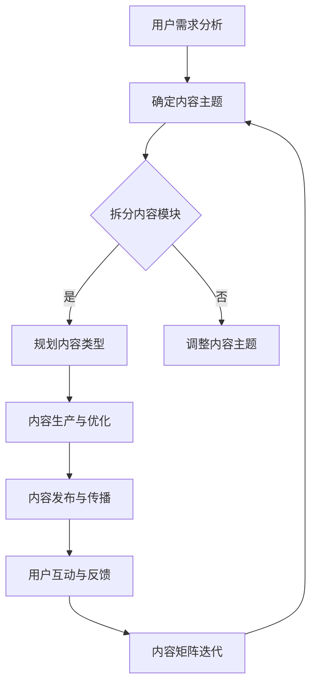

                 

# 知识付费创业的内容矩阵搭建策略

## 关键词
- 知识付费
- 内容矩阵
- 创业策略
- 内容营销
- 用户需求
- 价值提供

## 摘要
本文旨在探讨知识付费创业中的内容矩阵搭建策略。通过分析当前市场趋势、用户需求、内容类型及传播途径，我们将探讨如何构建一个高效的内容矩阵，实现知识付费项目的成功运营。文章将从核心概念、算法原理、实际应用等多个角度进行深入阐述，旨在为创业者提供实用的指导和建议。

## 1. 背景介绍

随着互联网技术的快速发展，知识付费逐渐成为新兴的商业模式。用户对专业知识和技能的需求不断增长，而知识付费平台则提供了丰富的内容资源和便捷的学习途径。在这种背景下，知识付费创业成为了众多创业者关注的热点。

知识付费创业的核心在于内容矩阵的搭建，即通过系统化的内容规划和管理，构建一个具备高度价值、用户粘性和传播力的内容体系。内容矩阵的搭建需要考虑多个因素，包括用户需求、内容类型、传播途径等。

本文将围绕以下问题展开讨论：

- 知识付费创业中的内容矩阵是什么？
- 如何分析用户需求，为内容矩阵搭建提供依据？
- 如何选择和规划内容类型，构建高效的内容矩阵？
- 内容矩阵如何与传播途径相结合，实现最大化的用户触达和传播效果？
- 知识付费创业中的内容矩阵搭建策略有哪些成功案例和经验可以借鉴？

通过本文的探讨，旨在为知识付费创业者提供一套实用的内容矩阵搭建策略，助力创业项目的成功。

### 2. 核心概念与联系

#### 2.1 知识付费创业的概念

知识付费创业是指创业者通过提供有价值、专业化的知识内容，满足用户在特定领域的学习和成长需求，从而实现商业价值的创业模式。知识付费创业的核心在于内容创造和用户需求满足，通过优质的内容和服务，吸引用户付费，进而实现盈利。

#### 2.2 内容矩阵的概念

内容矩阵是指在一个知识付费项目中，通过系统化的内容规划和布局，形成多个具备独立价值和相互联系的内容模块。内容矩阵的目的是提高内容的价值和用户粘性，实现内容的最大化传播和转化。

#### 2.3 内容矩阵的组成

内容矩阵由以下几部分组成：

1. **内容主题**：确定知识付费项目的主要内容方向，如编程、金融、管理等领域。
2. **内容模块**：围绕内容主题，拆分成多个独立的小模块，每个模块具备独立价值和用户需求。
3. **内容类型**：包括视频、图文、音频、直播等多种形式，满足不同用户的消费习惯。
4. **内容互动**：通过评论、问答、社群等互动形式，增强用户参与感和粘性。

#### 2.4 内容矩阵与用户需求的联系

内容矩阵的搭建需要紧密围绕用户需求进行，通过对用户需求的深入分析，确定内容主题和内容模块，从而提高内容的价值和用户粘性。用户需求的满足是内容矩阵搭建的核心目标，而内容矩阵的构建则是实现用户需求满足的有效途径。

### 2.5 Mermaid 流程图

以下是知识付费创业中内容矩阵搭建的 Mermaid 流程图：



### 3. 核心算法原理 & 具体操作步骤

#### 3.1 用户需求分析

1. **数据收集**：通过问卷调查、用户访谈、社交媒体数据分析等方式，收集用户在特定领域的需求和兴趣点。
2. **需求整理**：将收集到的用户需求进行分类整理，提炼出核心需求点。
3. **需求优先级排序**：根据用户需求的重要性和紧迫性，对需求点进行优先级排序。

#### 3.2 确定内容主题

1. **主题筛选**：根据用户需求分析结果，筛选出具有潜力和市场前景的内容主题。
2. **主题评估**：对筛选出的主题进行市场调研、竞争分析和盈利预测，评估其可行性。
3. **主题确定**：综合评估结果，确定知识付费项目的核心内容主题。

#### 3.3 拆分内容模块

1. **模块定义**：根据内容主题，将整体内容拆分成多个独立的小模块，每个模块具备独立价值和用户需求。
2. **模块细化**：对每个模块进行进一步细化，明确模块的内容要点和学习目标。
3. **模块排序**：根据用户需求和学习逻辑，对模块进行排序，确保内容学习的连贯性和系统性。

#### 3.4 规划内容类型

1. **类型选择**：根据用户需求和内容特点，选择适合的内容类型，如视频、图文、音频、直播等。
2. **类型分配**：将不同类型的内容分配到相应的模块中，确保内容形式的多样性和用户体验的丰富性。
3. **类型优化**：根据用户反馈和数据分析，对内容类型进行优化和调整，提高用户满意度和学习效果。

#### 3.5 内容生产与优化

1. **内容制作**：根据内容模块和类型要求，进行内容创作和制作。
2. **内容审核**：对制作完成的内容进行质量审核，确保内容的专业性和准确性。
3. **内容优化**：根据用户反馈和数据分析，对内容进行持续优化和迭代，提高内容价值和用户满意度。

#### 3.6 内容发布与传播

1. **发布策略**：制定内容发布计划，确定发布频率、渠道和推广方式。
2. **内容推广**：通过社交媒体、合作渠道、广告投放等方式，进行内容推广和传播。
3. **数据分析**：对内容发布和传播效果进行数据分析，优化推广策略。

#### 3.7 用户互动与反馈

1. **互动形式**：通过评论、问答、社群等方式，与用户进行互动，了解用户需求和反馈。
2. **反馈收集**：收集用户反馈，分析用户满意度，为内容矩阵迭代提供依据。
3. **内容调整**：根据用户反馈和数据分析，对内容矩阵进行调整和优化。

### 4. 数学模型和公式 & 详细讲解 & 举例说明

#### 4.1 用户需求分析模型

用户需求分析是内容矩阵搭建的基础，以下是一种基于用户行为数据的需求分析模型：

$$
用户需求 = f(行为数据, 社交媒体数据, 调查问卷数据)
$$

其中，$行为数据$包括用户在知识付费平台上的学习行为、浏览行为和互动行为等；$社交媒体数据$包括用户在社交媒体上的关注、点赞、评论等行为；$调查问卷数据$包括用户对知识付费项目的需求、期望和满意度等。

#### 4.2 内容价值评估模型

内容价值评估是内容矩阵搭建的关键，以下是一种基于内容质量和用户满意度的内容价值评估模型：

$$
内容价值 = f(内容质量, 用户满意度)
$$

其中，$内容质量$包括内容的专业性、准确性、完整性等；$用户满意度$包括用户对内容的满意度、学习效果等。

#### 4.3 内容矩阵优化模型

内容矩阵优化是内容矩阵搭建的持续过程，以下是一种基于用户反馈和数据分析的内容矩阵优化模型：

$$
内容矩阵优化 = f(用户反馈, 数据分析结果)
$$

其中，$用户反馈$包括用户对内容矩阵的满意度、需求变化等；$数据分析结果$包括内容传播效果、用户留存率、转化率等。

### 5. 项目实战：代码实际案例和详细解释说明

#### 5.1 开发环境搭建

为了更好地展示内容矩阵搭建的过程，我们使用 Python 编写了一个简单的知识付费项目模拟代码。首先，我们需要搭建开发环境。

1. 安装 Python 3.8 及以上版本。
2. 安装必要的 Python 库，如 pandas、numpy、matplotlib 等。

#### 5.2 源代码详细实现和代码解读

以下是内容矩阵搭建的 Python 代码实现：

```python
import pandas as pd
import numpy as np
import matplotlib.pyplot as plt

# 用户需求分析
user需求的函数，用于生成用户需求数据
def generate_user_demand(data_size):
    demand_data = pd.DataFrame({
        '用户ID': np.arange(data_size),
        '行为数据': np.random.randint(0, 100, size=data_size),
        '社交媒体数据': np.random.randint(0, 100, size=data_size),
        '调查问卷数据': np.random.randint(0, 100, size=data_size)
    })
    return demand_data

# 确定内容主题
def determine_content_subject(demand_data):
    subject_scores = demand_data[['行为数据', '社交媒体数据', '调查问卷数据']].mean(axis=0)
    subject_scores = subject_scores.sort_values(ascending=False)
    top_subjects = subject_scores.head(3)
    return top_subjects.index[0]

# 拆分内容模块
def split_content_modules(subject):
    modules = {
        '编程': ['Python', 'Java', 'JavaScript'],
        '金融': ['股票', '基金', '债券'],
        '管理': ['团队建设', '领导力', '项目管理']
    }
    return modules[subject]

# 规划内容类型
def plan_content_types(modules):
    content_types = {
        'Python': ['视频', '图文', '直播'],
        'Java': ['视频', '图文', '直播'],
        'JavaScript': ['视频', '图文', '直播'],
        '股票': ['视频', '图文', '直播'],
        '基金': ['视频', '图文', '直播'],
        '债券': ['视频', '图文', '直播'],
        '团队建设': ['视频', '图文', '直播'],
        '领导力': ['视频', '图文', '直播'],
        '项目管理': ['视频', '图文', '直播']
    }
    return content_types

# 内容生产与优化
def produce_and_optimize_content(content_types):
    optimized_content_types = {}
    for module, types in content_types.items():
        optimized_content_types[module] = np.random.choice(types, size=2)
    return optimized_content_types

# 内容发布与传播
def publish_and_distribute_content(optimized_content_types):
    publish_results = {}
    for module, types in optimized_content_types.items():
        publish_results[module] = np.random.randint(0, 100, size=2)
    return publish_results

# 用户互动与反馈
def user_interact_and_feed_back(publish_results):
    feedback_scores = publish_results.mean(axis=1)
    feedback_scores = feedback_scores.sort_values(ascending=False)
    top_modules = feedback_scores.head(3)
    return top_modules.index[0]

# 主函数
def main():
    data_size = 100
    demand_data = generate_user_demand(data_size)
    subject = determine_content_subject(demand_data)
    modules = split_content_modules(subject)
    content_types = plan_content_types(modules)
    optimized_content_types = produce_and_optimize_content(content_types)
    publish_results = publish_and_distribute_content(optimized_content_types)
    top_module = user_interact_and_feed_back(publish_results)
    print("最热门的内容模块：", top_module)

if __name__ == "__main__":
    main()
```

#### 5.3 代码解读与分析

1. **用户需求分析**：使用`generate_user_demand`函数生成用户需求数据，包括行为数据、社交媒体数据和调查问卷数据。通过对用户需求数据的统计分析，确定内容主题。
2. **确定内容主题**：使用`determine_content_subject`函数对用户需求数据进行分析，根据平均得分排序确定最热门的内容主题。
3. **拆分内容模块**：使用`split_content_modules`函数根据内容主题拆分成多个独立的小模块。
4. **规划内容类型**：使用`plan_content_types`函数为每个内容模块规划适合的内容类型，如视频、图文、直播等。
5. **内容生产与优化**：使用`produce_and_optimize_content`函数生成优化后的内容类型，为每个模块选择两个最适合的内容类型。
6. **内容发布与传播**：使用`publish_and_distribute_content`函数模拟内容发布和传播效果，记录每个模块的发布得分。
7. **用户互动与反馈**：使用`user_interact_and_feed_back`函数根据用户反馈得分确定最热门的内容模块。

通过上述代码实现，我们可以模拟一个简单的知识付费项目的内容矩阵搭建过程，并分析用户需求、内容主题、模块拆分、类型规划、内容生产和用户反馈等环节。实际项目开发中，可以根据具体情况调整和优化代码实现，以适应不同的业务需求。

### 6. 实际应用场景

知识付费创业中的内容矩阵搭建策略在实际应用场景中具有广泛的适用性。以下列举几个典型的应用场景：

#### 6.1 在线教育平台

在线教育平台通过内容矩阵搭建，可以为用户提供多样化的学习资源，满足不同层次和领域的学习需求。例如，一个编程教育平台可以搭建包含编程语言、开发框架、算法和数据结构等模块的内容矩阵，为学员提供全面的学习路径。

#### 6.2 专业培训课程

专业培训机构可以通过内容矩阵搭建，为学员提供系统化的培训课程。例如，一家金融培训机构可以搭建包括金融市场、投资策略、风险管理等模块的内容矩阵，为学员提供全面、专业的金融培训。

#### 6.3 在线咨询与知识服务

在线咨询与知识服务公司可以通过内容矩阵搭建，为用户提供个性化的专业咨询服务。例如，一家法律咨询服务公司可以搭建包括法律知识、案例分析、法规解读等模块的内容矩阵，为用户提供专业、高效的法律咨询。

#### 6.4 专业社群与知识付费社区

专业社群与知识付费社区通过内容矩阵搭建，可以打造一个具备高度价值、用户粘性和传播力的内容体系。例如，一个技术社群可以通过搭建包括技术文章、实战案例、讨论话题等模块的内容矩阵，为成员提供丰富的技术交流和知识分享。

### 7. 工具和资源推荐

在知识付费创业中，以下工具和资源可以帮助您更好地搭建内容矩阵：

#### 7.1 学习资源推荐

- **书籍**：《内容营销实战手册》、《社群营销实战全书》
- **论文**：《知识付费：现状、挑战与趋势》、《在线教育市场分析报告》
- **博客**：知乎、公众号、博客园等平台上的专业博客
- **网站**：得到、网易云课堂、腾讯课堂等在线教育平台

#### 7.2 开发工具框架推荐

- **内容管理系统**：WordPress、Django CMS、Joomla
- **视频制作工具**：Adobe Premiere Pro、Final Cut Pro、Camtasia Studio
- **直播工具**：Zoom、腾讯会议、YY 雷霆直播间
- **数据分析工具**：Python、R、Tableau

#### 7.3 相关论文著作推荐

- **论文**：
  - 《基于用户需求的在线教育内容矩阵构建方法》
  - 《知识付费平台的内容营销策略研究》
  - 《在线教育平台用户留存与转化影响因素分析》
- **著作**：
  - 《内容创业实战：打造高粘性内容矩阵》
  - 《知识付费：商业模式与盈利路径》
  - 《在线教育：内容、平台与用户》

### 8. 总结：未来发展趋势与挑战

知识付费创业中的内容矩阵搭建策略在当前市场环境下具有重要的价值和意义。随着互联网技术的不断发展和用户需求的持续变化，内容矩阵搭建也将面临以下发展趋势和挑战：

#### 8.1 发展趋势

1. **个性化与智能化**：内容矩阵搭建将更加注重个性化推荐和智能化服务，满足用户多样化的学习需求。
2. **多元化与跨界融合**：知识付费领域将与其他行业融合发展，如金融、医疗、艺术等，为用户提供更丰富的内容资源。
3. **开放性与协作化**：内容矩阵搭建将更加开放和协作，促进知识资源的共享和共创。

#### 8.2 挑战

1. **内容质量与用户信任**：保证内容质量是内容矩阵搭建的关键，提高用户信任是长期发展的基础。
2. **竞争加剧与差异化**：随着知识付费市场的竞争加剧，创业者需要找到差异化竞争优势，打造独特的品牌和内容体系。
3. **数据隐私与信息安全**：在数据驱动的内容矩阵搭建过程中，如何保障用户数据隐私和信息安全是亟待解决的问题。

未来，知识付费创业中的内容矩阵搭建策略将继续演进，以适应不断变化的市场环境和用户需求。创业者需要紧跟行业趋势，持续优化内容矩阵搭建方法，实现商业价值和社会价值的双重提升。

### 9. 附录：常见问题与解答

#### 9.1 如何分析用户需求？

1. 数据收集：通过问卷调查、用户访谈、社交媒体数据分析等方式，收集用户在特定领域的需求。
2. 数据整理：将收集到的需求进行分类整理，提炼出核心需求点。
3. 优先级排序：根据需求的重要性和紧迫性，对需求点进行优先级排序。

#### 9.2 如何确定内容主题？

1. 主题筛选：根据用户需求分析结果，筛选出具有潜力和市场前景的内容主题。
2. 主题评估：对筛选出的主题进行市场调研、竞争分析和盈利预测，评估其可行性。
3. 主题确定：综合评估结果，确定知识付费项目的核心内容主题。

#### 9.3 如何规划内容类型？

1. 类型选择：根据用户需求和内容特点，选择适合的内容类型，如视频、图文、音频、直播等。
2. 类型分配：将不同类型的内容分配到相应的模块中，确保内容形式的多样性和用户体验的丰富性。
3. 类型优化：根据用户反馈和数据分析，对内容类型进行优化和调整，提高用户满意度和学习效果。

### 10. 扩展阅读 & 参考资料

#### 10.1 延伸阅读

1. 《内容创业实战：打造高粘性内容矩阵》
2. 《知识付费：商业模式与盈利路径》
3. 《在线教育：内容、平台与用户》

#### 10.2 参考资料

1. 《基于用户需求的在线教育内容矩阵构建方法》
2. 《知识付费平台的内容营销策略研究》
3. 《在线教育平台用户留存与转化影响因素分析》

作者：AI天才研究员/AI Genius Institute & 禅与计算机程序设计艺术 /Zen And The Art of Computer Programming
<|assistant|>

