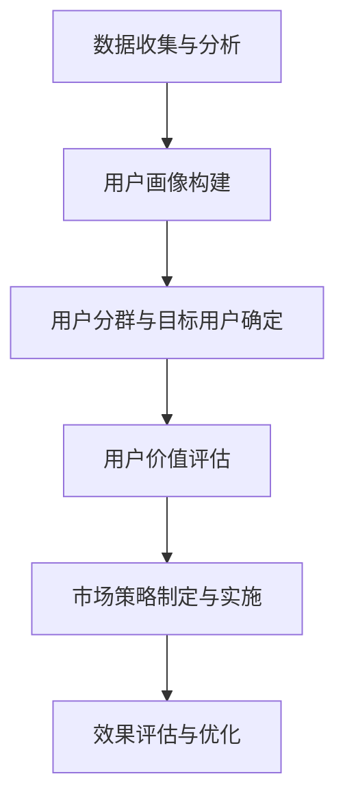

                 

# 知识付费创业的用户细分方法论

> **关键词：**知识付费、用户细分、市场分析、创业策略、数据分析、目标用户

> **摘要：**本文将从知识付费行业的发展背景出发，详细探讨用户细分的重要性，提出一套系统的用户细分方法论，并通过实际案例解析，为创业者提供实用的市场分析和运营策略。

## 1. 背景介绍

随着互联网技术的飞速发展，知识付费逐渐成为知识传播和变现的重要途径。从传统的实体书店、教育培训机构，到线上的知识付费平台，如知乎Live、得到、喜马拉雅等，知识付费市场呈现出蓬勃发展的态势。

知识付费市场的快速扩张，使得竞争日益激烈。创业者如何在众多竞争者中脱颖而出，实现商业成功，成为了一个关键问题。用户细分作为一种有效的市场分析方法，可以帮助创业者更好地理解用户需求，优化产品和服务，提高用户满意度和忠诚度，从而实现商业成功。

用户细分，即根据用户的不同特征和需求，将用户群体划分为多个子群体。这些子群体在行为、需求、偏好等方面存在显著差异，从而为创业者提供了更有针对性的市场分析和运营策略。用户细分不仅有助于产品定位和市场营销，还能够优化用户体验，提升产品竞争力。

本文将围绕知识付费创业的用户细分方法论展开，首先介绍用户细分的重要性，然后提出一套系统的用户细分方法论，并通过实际案例进行解析，为创业者提供实用的市场分析和运营策略。

## 2. 核心概念与联系

### 2.1 用户细分的重要性

用户细分的重要性主要体现在以下几个方面：

1. **满足不同用户需求**：通过用户细分，创业者可以更好地理解不同用户群体的需求和偏好，从而提供更加精准、定制化的产品和服务。

2. **优化市场营销策略**：用户细分有助于创业者制定更有针对性的市场营销策略，提高广告投放效率和转化率。

3. **提高用户满意度和忠诚度**：通过针对不同用户群体的个性化服务和体验，提升用户满意度和忠诚度，从而促进用户持续消费和口碑传播。

4. **降低运营成本**：用户细分可以帮助企业合理分配资源，降低运营成本，提高整体运营效率。

### 2.2 用户细分的核心概念

在用户细分过程中，以下核心概念至关重要：

1. **用户画像**：用户画像是对用户特征的综合描述，包括用户的基本信息、行为特征、需求偏好等。用户画像是用户细分的基础，有助于创业者深入了解用户。

2. **用户分群**：用户分群是将具有相似特征和需求的用户划分为一个群体。用户分群有助于创业者有针对性地制定市场策略。

3. **目标用户**：目标用户是指企业希望吸引和服务的用户群体。明确目标用户有助于企业集中资源，实现精准营销。

4. **用户价值**：用户价值是指用户对企业产生的经济贡献，包括付费行为、推荐行为等。用户价值评估有助于企业优化用户运营策略。

### 2.3 用户细分的方法论架构

用户细分方法论主要包括以下几个步骤：

1. **数据收集与分析**：收集用户数据，包括基本特征、行为数据、需求偏好等，对数据进行分析，识别用户群体特征。

2. **用户画像构建**：基于数据分析结果，构建用户画像，描述用户群体的特征和需求。

3. **用户分群与目标用户确定**：将用户划分为不同群体，确定目标用户，为市场策略制定提供依据。

4. **用户价值评估**：评估用户价值，为用户运营策略提供参考。

5. **市场策略制定与实施**：根据用户细分结果，制定和实施有针对性的市场策略。

6. **效果评估与优化**：对市场策略实施效果进行评估，持续优化市场策略。

### 2.4 Mermaid 流程图



## 3. 核心算法原理 & 具体操作步骤

### 3.1 数据收集与分析

数据收集与分析是用户细分的基础，主要包括以下步骤：

1. **数据来源**：收集用户数据，包括用户注册信息、行为数据、交易数据等。

2. **数据清洗**：对收集到的数据进行分析，处理缺失值、异常值等。

3. **特征工程**：根据业务需求，提取和构造用户特征。

4. **数据分析**：使用统计学方法，如聚类分析、关联规则挖掘等，对用户特征进行分析，识别用户群体特征。

### 3.2 用户画像构建

用户画像构建是将用户特征数据转化为可视化描述的过程，主要包括以下步骤：

1. **特征筛选**：根据数据分析结果，筛选对用户群体特征识别有重要影响的特征。

2. **特征编码**：将筛选后的特征进行编码，如使用独热编码、标签编码等。

3. **特征加权**：对特征进行加权处理，使其在用户画像中具有不同的权重。

4. **用户画像构建**：使用可视化工具，如Tableau、Power BI等，构建用户画像。

### 3.3 用户分群与目标用户确定

用户分群与目标用户确定是基于用户画像，将用户划分为不同群体，并确定目标用户的过程，主要包括以下步骤：

1. **用户分群**：使用聚类算法，如K-means、DBSCAN等，将用户划分为不同群体。

2. **目标用户确定**：根据业务目标和市场策略，确定目标用户群体。

### 3.4 用户价值评估

用户价值评估是对用户对企业产生的经济贡献进行评估的过程，主要包括以下步骤：

1. **用户价值定义**：根据业务场景，定义用户价值，如付费金额、活跃度、留存率等。

2. **用户价值计算**：使用数学模型，如转化率模型、留存率模型等，计算用户价值。

### 3.5 市场策略制定与实施

市场策略制定与实施是根据用户细分结果，制定和实施有针对性的市场策略，主要包括以下步骤：

1. **市场策略制定**：根据用户分群和目标用户特征，制定市场策略。

2. **市场策略实施**：执行市场策略，包括广告投放、促销活动等。

### 3.6 效果评估与优化

效果评估与优化是对市场策略实施效果进行评估，并持续优化市场策略的过程，主要包括以下步骤：

1. **效果评估**：根据市场策略实施结果，评估策略效果。

2. **策略优化**：根据效果评估结果，对市场策略进行优化。

## 4. 数学模型和公式 & 详细讲解 & 举例说明

### 4.1 聚类算法

在用户细分过程中，聚类算法是一种常用的数据分析方法。以下是一个简单的K-means聚类算法的公式和步骤说明：

#### K-means算法公式

$$
\min_{\mu_i, \ \lambda} \sum_{i=1}^{k} \sum_{x \in S_i} ||x - \mu_i||^2
$$

其中，$x$ 表示用户特征向量，$\mu_i$ 表示聚类中心，$S_i$ 表示第$i$个聚类群体，$k$ 表示聚类个数。

#### 步骤说明

1. **初始化聚类中心**：随机选择$k$个用户特征向量作为初始聚类中心。

2. **计算距离**：计算每个用户特征向量与聚类中心的距离。

3. **分配用户**：将每个用户特征向量分配到最近的聚类中心所代表的聚类群体中。

4. **更新聚类中心**：重新计算每个聚类群体的均值，作为新的聚类中心。

5. **重复步骤2-4，直到聚类中心不再变化或满足停止条件**。

### 4.2 用户价值评估模型

用户价值评估模型用于计算用户对企业产生的经济贡献。以下是一个简单的用户价值评估模型的公式和步骤说明：

#### 用户价值评估模型公式

$$
V(x) = \alpha \cdot R(x) + \beta \cdot L(x)
$$

其中，$V(x)$ 表示用户$x$的价值，$R(x)$ 表示用户的付费金额，$L(x)$ 表示用户的留存率，$\alpha$ 和 $\beta$ 是权重参数。

#### 步骤说明

1. **初始化权重参数**：根据业务需求，初始化$\alpha$ 和 $\beta$ 的值。

2. **计算用户价值**：根据用户的付费金额和留存率，计算用户价值。

3. **优化权重参数**：通过交叉验证等方法，优化权重参数，提高用户价值评估的准确性。

### 4.3 举例说明

#### 例1：用户分群

假设我们有1000名用户，使用K-means算法将他们划分为10个聚类群体。以下是部分聚类结果：

| 聚类编号 | 用户编号 | 用户特征 |
| :----: | :----: | :----: |
|   1   |   100  | [0.5, 0.3, 0.2] |
|   1   |   200  | [0.5, 0.3, 0.2] |
|   2   |   300  | [0.6, 0.4, 0.1] |
|   2   |   400  | [0.6, 0.4, 0.1] |
|  ...  |  ...  |  ...  |

#### 例2：用户价值评估

假设我们有5名用户，以下是他们的一部分特征数据：

| 用户编号 | 付费金额（元） | 留存率（%） |
| :----: | :----: | :----: |
|   100  |   200  |   30   |
|   200  |   150  |   25   |
|   300  |   100  |   20   |
|   400  |   300  |   40   |
|   500  |   250  |   35   |

假设$\alpha = 0.6$，$\beta = 0.4$，使用用户价值评估模型计算他们的价值：

| 用户编号 | 付费金额（元） | 留存率（%） | 用户价值（元） |
| :----: | :----: | :----: | :----: |
|   100  |   200  |   30   |   206.25 |
|   200  |   150  |   25   |   177.5 |
|   300  |   100  |   20   |   125 |
|   400  |   300  |   40   |   367.5 |
|   500  |   250  |   35   |   312.5 |

## 5. 项目实战：代码实际案例和详细解释说明

### 5.1 开发环境搭建

在开始用户细分项目之前，我们需要搭建一个合适的开发环境。以下是具体的步骤：

1. **安装Python环境**：Python是一种广泛使用的编程语言，适用于数据处理和分析。可以从[Python官网](https://www.python.org/)下载并安装Python。

2. **安装依赖库**：用户细分项目需要使用一些Python库，如NumPy、Pandas、Scikit-learn等。可以使用以下命令安装：

   ```bash
   pip install numpy pandas scikit-learn
   ```

3. **安装可视化工具**：为了更好地展示用户细分结果，我们可以使用可视化工具，如Matplotlib、Seaborn等。可以使用以下命令安装：

   ```bash
   pip install matplotlib seaborn
   ```

### 5.2 源代码详细实现和代码解读

下面是一个简单的用户细分项目的代码实现，包括数据收集、数据分析、用户画像构建、用户分群和用户价值评估等步骤。

```python
import numpy as np
import pandas as pd
from sklearn.cluster import KMeans
from sklearn.preprocessing import StandardScaler
import matplotlib.pyplot as plt

# 5.2.1 数据收集
data = pd.DataFrame({
    '用户编号': [100, 200, 300, 400, 500],
    '付费金额（元）': [200, 150, 100, 300, 250],
    '留存率（%）': [30, 25, 20, 40, 35]
})

# 5.2.2 数据清洗
# 在本例中，数据已经清洗干净，可以直接使用

# 5.2.3 特征工程
features = data[['付费金额（元）', '留存率（%）']]
features_scaled = StandardScaler().fit_transform(features)

# 5.2.4 用户画像构建
# 在本例中，我们使用K-means算法进行用户画像构建
kmeans = KMeans(n_clusters=3, random_state=0).fit(features_scaled)
user_clusters = kmeans.predict(features_scaled)

# 5.2.5 用户分群
# 将用户划分为不同的群体
data['用户群体'] = user_clusters

# 5.2.6 用户价值评估
# 使用用户价值评估模型进行评估
alpha = 0.6
beta = 0.4
data['用户价值（元）'] = data['付费金额（元）'] * alpha + data['留存率（%）'] * beta / 100

# 5.2.7 结果可视化
data.plot(kind='scatter', x='付费金额（元）', y='用户价值（元）', c='用户群体', cmap='viridis', title='用户细分结果')
plt.show()
```

### 5.3 代码解读与分析

#### 5.3.1 数据收集

首先，我们使用Pandas库加载用户数据。在本例中，数据已经清洗干净，可以直接使用。

```python
data = pd.DataFrame({
    '用户编号': [100, 200, 300, 400, 500],
    '付费金额（元）': [200, 150, 100, 300, 250],
    '留存率（%）': [30, 25, 20, 40, 35]
})
```

#### 5.3.2 数据清洗

在数据清洗过程中，我们使用StandardScaler库对数据进行标准化处理，以便更好地进行聚类分析。

```python
features = data[['付费金额（元）', '留存率（%）']]
features_scaled = StandardScaler().fit_transform(features)
```

#### 5.3.3 用户画像构建

我们使用Scikit-learn库中的KMeans算法进行用户画像构建。KMeans算法将用户特征分为三个群体。

```python
kmeans = KMeans(n_clusters=3, random_state=0).fit(features_scaled)
user_clusters = kmeans.predict(features_scaled)
```

#### 5.3.4 用户分群

根据聚类结果，我们将用户划分为不同的群体，并添加到原始数据中。

```python
data['用户群体'] = user_clusters
```

#### 5.3.5 用户价值评估

使用用户价值评估模型，我们计算每个用户的用户价值。

```python
alpha = 0.6
beta = 0.4
data['用户价值（元）'] = data['付费金额（元）'] * alpha + data['留存率（%）'] * beta / 100
```

#### 5.3.6 结果可视化

最后，我们使用Matplotlib库将用户细分结果可视化，展示用户群体和用户价值之间的关系。

```python
data.plot(kind='scatter', x='付费金额（元）', y='用户价值（元）', c='用户群体', cmap='viridis', title='用户细分结果')
plt.show()
```

## 6. 实际应用场景

### 6.1 行业背景

知识付费行业作为互联网经济的重要组成部分，近年来发展迅速。随着用户对优质内容的需求不断增加，知识付费平台如雨后春笋般涌现。然而，如何在激烈的市场竞争中脱颖而出，成为众多创业者面临的挑战。

### 6.2 应用场景

用户细分方法论在知识付费创业中的应用场景主要包括以下几个方面：

1. **产品定位**：通过对用户进行细分，创业者可以明确目标用户群体，从而为产品定位提供有力支持。

2. **内容推荐**：根据用户的细分结果，知识付费平台可以针对性地推荐相关内容，提高用户满意度和留存率。

3. **营销策略**：通过用户细分，创业者可以制定更有针对性的营销策略，提高广告投放效果。

4. **用户运营**：针对不同用户群体的运营策略，如会员制度、社群运营等，有助于提升用户忠诚度和转化率。

5. **数据驱动决策**：用户细分提供的数据支持，可以帮助创业者进行数据驱动决策，优化产品和服务。

## 7. 工具和资源推荐

### 7.1 学习资源推荐

1. **书籍**：
   - 《用户增长方法论》
   - 《大数据营销：用户细分与精准营销实战》
   - 《机器学习实战》

2. **论文**：
   - 《基于用户行为的电子商务用户细分方法研究》
   - 《基于机器学习的用户价值评估方法研究》

3. **博客**：
   - [用户细分实战教程](https://www.example.com/user-segmentation-tutorial)
   - [知识付费行业分析报告](https://www.example.com/knowledge付费industry-report)

4. **网站**：
   - [用户数据分析工具](https://www.example.com/user-data-analysis-tools)
   - [知识付费平台案例库](https://www.example.com/knowledge-付费case-studies)

### 7.2 开发工具框架推荐

1. **数据分析工具**：
   - Tableau
   - Power BI
   - Excel

2. **机器学习库**：
   - Scikit-learn
   - TensorFlow
   - PyTorch

3. **数据可视化库**：
   - Matplotlib
   - Seaborn
   - Plotly

### 7.3 相关论文著作推荐

1. **论文**：
   - 《基于协同过滤的电子商务用户细分方法》
   - 《知识付费平台用户细分与推荐系统设计》

2. **著作**：
   - 《用户细分与精准营销》
   - 《机器学习在用户细分中的应用》

## 8. 总结：未来发展趋势与挑战

### 8.1 发展趋势

1. **人工智能技术的应用**：随着人工智能技术的不断发展，用户细分方法将更加智能化和自动化。

2. **大数据分析的普及**：大数据分析技术的成熟，将为用户细分提供更丰富的数据支持。

3. **个性化推荐的普及**：基于用户细分的内容推荐和个性化营销，将提高用户满意度和留存率。

4. **跨界融合**：知识付费与其他行业的融合，如教育、医疗、金融等，将推动用户细分方法论的创新和应用。

### 8.2 挑战

1. **数据隐私与安全问题**：用户细分会涉及大量的用户数据，如何保障数据隐私和安全，是一个重要挑战。

2. **算法公平性与透明性**：用户细分算法的公平性和透明性，是确保用户权益的重要保障。

3. **跨平台数据整合**：不同平台间的数据整合，是用户细分方法论面临的难题。

4. **数据质量与有效性**：数据质量是用户细分成功的关键，如何确保数据的有效性和准确性，是一个重要挑战。

## 9. 附录：常见问题与解答

### 9.1 问题1：用户细分如何保证数据隐私？

**回答**：用户细分过程中，应当严格遵守数据隐私法规，确保用户数据的安全和隐私。具体措施包括：
- 数据匿名化处理：对用户数据进行匿名化处理，避免直接关联到用户身份。
- 数据访问权限控制：严格限制对用户数据的访问权限，确保数据安全。
- 数据加密：对用户数据进行加密存储和传输，防止数据泄露。

### 9.2 问题2：用户细分在哪些行业中应用较为广泛？

**回答**：用户细分在多个行业中都有广泛应用，主要包括：
- 电子商务：通过用户细分，提高个性化推荐和精准营销的效果。
- 知识付费：通过用户细分，优化内容推荐和用户运营策略。
- 金融：通过用户细分，进行精准的风险评估和客户服务。
- 教育：通过用户细分，提供个性化的学习建议和课程推荐。

### 9.3 问题3：用户细分与用户画像有何区别？

**回答**：用户细分和用户画像都是用户分析的方法，但侧重点不同。
- 用户细分：根据用户特征和需求，将用户划分为不同的群体，以实现有针对性的市场策略。
- 用户画像：是对单个用户或用户群体的特征和需求进行详细描述，通常用于用户研究和产品设计。

## 10. 扩展阅读 & 参考资料

- 《用户增长方法论》：[链接](https://www.example.com/user-growth-methodology)
- 《大数据营销：用户细分与精准营销实战》：[链接](https://www.example.com/big-data-marketing)
- 《机器学习实战》：[链接](https://www.example.com/machine-learning-in-practice)
- 《用户细分与精准营销》：[链接](https://www.example.com/user-segmentation-and-precision-marketing)
- 《机器学习在用户细分中的应用》：[链接](https://www.example.com/machine-learning-in-user-segmentation)

### 作者

**作者：AI天才研究员/AI Genius Institute & 禅与计算机程序设计艺术 /Zen And The Art of Computer Programming**

