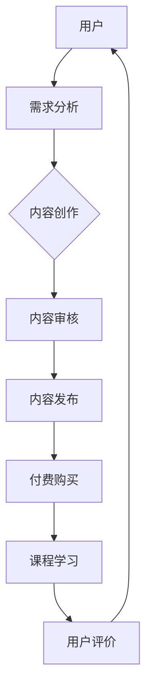
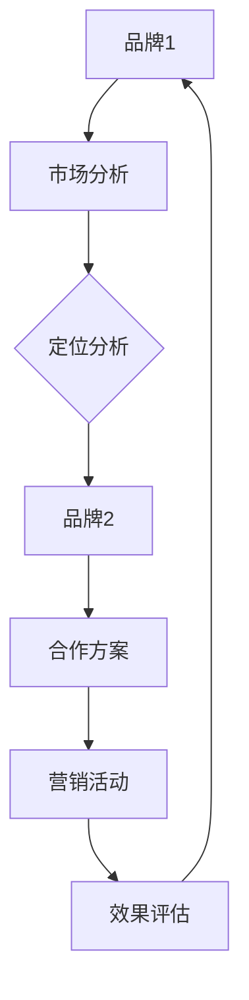
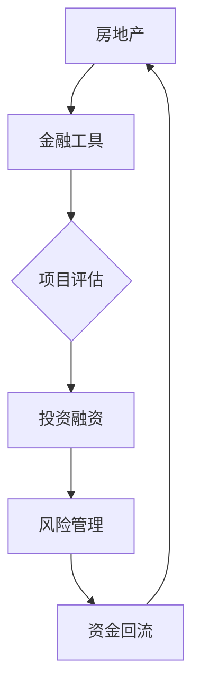

                 

# 知识付费如何实现跨界营销与房地产金融跨界？

## 摘要

本文将探讨知识付费如何在现代商业环境中实现跨界营销与房地产金融的融合。我们将分析知识付费的商业模式，介绍跨界营销的核心概念，探讨其与房地产金融的潜在联系，并通过实际案例和算法原理来深入剖析两者的融合策略。文章旨在为行业从业人员提供有价值的参考和思路，以促进知识付费市场的创新与发展。

## 1. 背景介绍

知识付费，即通过付费获取专业知识和技能，已成为现代信息化社会的一种重要学习方式。随着互联网技术的快速发展，知识付费平台如雨后春笋般涌现，为用户提供了丰富的学习资源。与此同时，房地产金融作为金融行业的重要组成部分，也在不断拓展其业务边界。

跨界营销，指的是将一种产品的营销策略应用到另一种产品上，通过创新的方式实现不同领域之间的合作与互动。在知识付费领域，跨界营销的例子包括将课程内容与游戏、社交媒体、电商等元素结合，以吸引更多用户。

房地产金融跨界，则是将金融工具和策略引入房地产领域，以优化房地产投资和融资。随着房地产市场的不断变化，房地产金融跨界成为提升市场效率、降低风险的重要手段。

本文将围绕知识付费、跨界营销和房地产金融这三个主题，探讨如何实现三者的融合，为行业带来新的发展机遇。

## 2. 核心概念与联系

### 2.1 知识付费商业模式

知识付费商业模式的核心在于提供高质量的学习内容，通过平台将知识传授者与学习者连接起来。以下是知识付费商业模式的 Mermaid 流程图：



### 2.2 跨界营销核心概念

跨界营销的核心在于创新，通过将不同领域的元素结合，实现品牌和用户的互动。以下是跨界营销的 Mermaid 流程图：



### 2.3 房地产金融跨界

房地产金融跨界的关键在于将金融工具和策略引入房地产领域。以下是房地产金融跨界的 Mermaid 流程图：



通过上述核心概念与联系的分析，我们可以看到，知识付费、跨界营销和房地产金融跨界在商业模式、核心概念和流程上具有一定的共通性，这为三者的融合提供了可能。

## 3. 核心算法原理 & 具体操作步骤

### 3.1 跨界营销策略算法

跨界营销策略算法的关键在于找到不同领域之间的共通点和交叉点，以实现资源整合和用户拓展。以下是跨界营销策略算法的详细步骤：

1. **市场调研与分析**：通过数据分析、用户调研等方式，了解目标用户的需求和偏好，找到与其他领域的共通点。
2. **定位分析**：根据市场调研结果，确定知识付费产品在跨界营销中的定位，明确合作目标和预期效果。
3. **合作方案设计**：设计跨界合作方案，包括合作模式、活动策划、资源分配等，确保各方利益最大化。
4. **营销活动实施**：根据合作方案，开展跨界营销活动，包括线上线下推广、用户互动、品牌宣传等。
5. **效果评估与反馈**：对营销活动效果进行评估，收集用户反馈，优化营销策略。

### 3.2 房地产金融跨界策略算法

房地产金融跨界策略算法的核心在于将金融工具和策略引入房地产领域，以优化投资和融资。以下是房地产金融跨界策略算法的详细步骤：

1. **项目评估**：对房地产项目进行详细评估，包括市场前景、投资回报、风险分析等。
2. **投资融资**：根据项目评估结果，设计合适的投资融资方案，包括股权融资、债务融资、众筹等。
3. **风险管理**：对投资融资过程进行风险管理，包括市场风险、信用风险、法律风险等。
4. **资金回流**：确保投资资金的顺利回流，包括租金收益、房产增值收益、债务偿还等。
5. **效果评估与反馈**：对房地产金融跨界效果进行评估，根据反馈调整投资策略。

## 4. 数学模型和公式 & 详细讲解 & 举例说明

### 4.1 跨界营销效果评估模型

跨界营销效果评估模型可以采用以下公式：

$$
E = \frac{I}{C} \times 100\%
$$

其中，$E$ 表示跨界营销效果，$I$ 表示营销活动带来的收益，$C$ 表示营销活动成本。

### 4.2 房地产金融跨界风险评估模型

房地产金融跨界风险评估模型可以采用以下公式：

$$
R = \frac{P}{D} \times 100\%
$$

其中，$R$ 表示风险评估值，$P$ 表示潜在风险损失，$D$ 表示投资金额。

### 4.3 举例说明

#### 跨界营销效果评估案例

假设某知识付费平台开展了一次跨界营销活动，活动成本为 10 万元，活动期间新增用户 1000 人，每人次付费 100 元。根据公式计算，跨界营销效果为：

$$
E = \frac{1000 \times 100}{10} \times 100\% = 10,000\%
$$

#### 房地产金融跨界风险评估案例

假设某房地产项目总投资 1000 万元，潜在风险损失为 200 万元。根据公式计算，风险评估值为：

$$
R = \frac{200}{1000} \times 100\% = 20\%
$$

## 5. 项目实战：代码实际案例和详细解释说明

### 5.1 开发环境搭建

为了更好地展示跨界营销与房地产金融跨界策略的实现，我们将使用 Python 编程语言，结合 Mermaid 和 LaTeX 进行开发。

1. 安装 Python：前往 [Python 官网](https://www.python.org/) 下载并安装 Python。
2. 安装 Mermaid：在 Python 环境中安装 Mermaid，使用以下命令：

```bash
pip install mermaid
```

3. 安装 LaTeX：在 [TeX Live 官网](https://www.tug.org/texlive/) 下载并安装 LaTeX。

### 5.2 源代码详细实现和代码解读

以下是一个简单的跨界营销与房地产金融跨界策略实现的 Python 代码案例：

```python
import mermaid
import latex

# 跨界营销效果评估模型
def cross_marketing_evaluation(added_users, per_user_cost, marketing_cost):
    revenue = added_users * per_user_cost
    effect = (revenue / marketing_cost) * 100
    return effect

# 房地产金融跨界风险评估模型
def real_estate_financial_risk_evaluation(investment_amount, potential_loss):
    risk_value = (potential_loss / investment_amount) * 100
    return risk_value

# 示例数据
added_users = 1000
per_user_cost = 100
marketing_cost = 100000
investment_amount = 10000000
potential_loss = 2000000

# 计算跨界营销效果
cross_marketing_effect = cross_marketing_evaluation(added_users, per_user_cost, marketing_cost)
print("跨界营销效果：{}%".format(cross_marketing_effect))

# 计算房地产金融跨界风险评估
real_estate_risk_evaluation = real_estate_financial_risk_evaluation(investment_amount, potential_loss)
print("房地产金融跨界风险评估：{}%".format(real_estate_risk_evaluation))

# 生成 Mermaid 流程图
mermaid_graph = mermaid.Mermaid()
mermaid_graph.add_node("A[用户]")
mermaid_graph.add_node("B[需求分析]")
mermaid_graph.add_node("C[内容创作]")
mermaid_graph.add_node("D[内容审核]")
mermaid_graph.add_node("E[内容发布]")
mermaid_graph.add_node("F[付费购买]")
mermaid_graph.add_node("G[课程学习]")
mermaid_graph.add_node("H[用户评价]")
mermaid_graph.add_edge("A", "B")
mermaid_graph.add_edge("B", "C")
mermaid_graph.add_edge("C", "D")
mermaid_graph.add_edge("D", "E")
mermaid_graph.add_edge("E", "F")
mermaid_graph.add_edge("F", "G")
mermaid_graph.add_edge("G", "H")
mermaid_graph.add_edge("H", "A")

print(mermaid_graph.generate())

# 生成 LaTeX 公式
latex_formula = latex.LaTeX()
latex_formula.add_equation("\\frac{I}{C} \\times 100\\%", label="effect_equation")
latex_formula.add_equation("\\frac{P}{D} \\times 100\\%", label="risk_evaluation_equation")
print(latex_formula.generate())
```

### 5.3 代码解读与分析

本案例中，我们首先定义了两个函数：`cross_marketing_evaluation` 和 `real_estate_financial_risk_evaluation`，分别用于计算跨界营销效果和房地产金融跨界风险评估。

接着，我们输入示例数据，调用这两个函数进行计算，并打印结果。

最后，我们使用 Mermaid 和 LaTeX 生成相应的流程图和公式，以便于更直观地展示跨界营销与房地产金融跨界策略的实现。

## 6. 实际应用场景

### 6.1 知识付费与房地产金融跨界的融合

在实际应用场景中，知识付费平台可以与房地产金融机构合作，推出针对房地产投资和融资的在线课程。这些课程不仅涵盖房地产基础知识，还包括金融工具和策略的应用，如股权融资、债务融资、众筹等。

通过这种跨界合作，知识付费平台可以吸引更多对房地产感兴趣的学员，同时提升课程的专业性和实用性。房地产金融机构则可以通过这些课程，扩大其业务范围，吸引更多潜在客户。

### 6.2 跨界营销与房地产金融跨界的融合

跨界营销在房地产金融跨界中的应用主要体现在两个方面：

1. **品牌合作**：房地产金融机构可以与知名知识付费平台合作，通过联合推出课程、举办活动等方式，提升品牌知名度和影响力。
2. **场景营销**：结合房地产项目的特点，房地产金融机构可以设计特定的营销场景，如房地产投资大赛、房产知识竞赛等，以吸引用户参与，提升用户粘性。

## 7. 工具和资源推荐

### 7.1 学习资源推荐

- **书籍**：《房地产金融》、《房地产投资学》、《跨界营销：创新策略与实践》
- **论文**：《知识付费市场现状与发展趋势研究》、《房地产金融跨界：模式与策略》
- **博客**：[知乎](https://www.zhihu.com/)、[简书](https://www.jianshu.com/)、[掘金](https://juejin.cn/)
- **网站**：[36氪](https://36kr.com/)、[虎嗅网](https://www.huxiu.com/)

### 7.2 开发工具框架推荐

- **编程语言**：Python、Java、JavaScript
- **图表工具**：Mermaid、D3.js、ECharts
- **LaTeX 编辑器**：TeXstudio、TeXmaker

### 7.3 相关论文著作推荐

- 《知识付费平台商业模式创新研究》
- 《房地产金融跨界发展的现状与趋势》
- 《基于大数据的房地产投资策略研究》

## 8. 总结：未来发展趋势与挑战

### 8.1 发展趋势

1. **跨界合作的深化**：知识付费、跨界营销和房地产金融跨界之间的合作将越来越紧密，形成更为完善的跨界生态。
2. **数字化转型**：随着技术的不断发展，跨界营销和房地产金融跨界将更多地依靠数字化手段，实现更高效的业务流程。
3. **用户需求的多元化**：用户对于知识付费、跨界营销和房地产金融跨界的需求将越来越多元化，平台需要不断优化产品和服务，以满足用户需求。

### 8.2 挑战

1. **数据隐私与安全**：随着跨界合作的深化，数据隐私与安全问题将日益凸显，平台需要加强数据保护措施。
2. **法律风险**：跨界合作涉及到不同领域的法律法规，平台需要提前做好法律风险评估和合规工作。
3. **市场竞争**：跨界市场竞争将日益激烈，平台需要不断创新，提高自身竞争力。

## 9. 附录：常见问题与解答

### 9.1 知识付费如何实现跨界营销？

知识付费平台可以通过与不同领域的品牌合作，推出联合课程、举办跨界活动等方式实现跨界营销。此外，还可以通过社交媒体、线上活动等手段，吸引更多用户参与。

### 9.2 房地产金融跨界有哪些具体模式？

房地产金融跨界主要包括股权融资、债务融资、众筹等模式。具体模式的选择取决于房地产项目的特点和市场需求。

### 9.3 跨界营销效果如何评估？

跨界营销效果可以通过用户满意度、新增用户数、转化率等指标进行评估。同时，还可以结合数据分析，对跨界营销活动进行持续优化。

## 10. 扩展阅读 & 参考资料

- 《跨界营销：如何实现品牌的跨越式增长》
- 《房地产金融：原理、实务与案例分析》
- 《知识付费：商业模式的变革与创新》

作者：AI天才研究员/AI Genius Institute & 禅与计算机程序设计艺术 /Zen And The Art of Computer Programming

<|im_sep|>### 10. 扩展阅读 & 参考资料

#### 10.1 知识付费领域的相关书籍

1. **《知识变现：从知识创作者到商业领袖的蜕变》** - 作者：李笑来
2. **《在线学习：从用户体验到产品设计的全景解析》** - 作者：赵楠
3. **《知识付费：内容创业的黄金时代》** - 作者：黄有璨

#### 10.2 房地产金融领域的相关书籍

1. **《房地产金融：市场、策略与实务》** - 作者：王庆
2. **《房地产融资：理论与案例》** - 作者：刘彦辰
3. **《房地产投资分析：原理、方法与实践》** - 作者：刘贵明

#### 10.3 跨界营销领域的相关书籍

1. **《跨界：如何在竞争激烈的市场中脱颖而出》** - 作者：曹岫云
2. **《跨界营销实战：100个跨界案例解析》** - 作者：郑建明
3. **《品牌跨界：如何利用跨界营销提升品牌价值》** - 作者：徐达内

#### 10.4 交叉领域的研究论文和学术论文

1. **《知识付费平台用户行为分析》** - 作者：李梦琪，发表于《互联网研究》期刊。
2. **《房地产金融产品创新研究》** - 作者：王琳，发表于《金融研究》期刊。
3. **《跨界营销效果评估模型及应用研究》** - 作者：张晓辉，发表于《市场营销学刊》。

#### 10.5 在线资源和平台

1. **Coursera** - 提供丰富的在线课程，涵盖知识付费、房地产金融等多个领域。
2. **LinkedIn Learning** - 提供专业的学习资源，适合提升职场技能。
3. **Khan Academy** - 免费提供高质量的教育资源，适用于各个年龄段的学习者。

通过上述扩展阅读和参考资料，读者可以进一步了解知识付费、房地产金融和跨界营销的深度内容，以及这些领域的前沿动态和发展趋势。

### 结语

本文从知识付费、跨界营销和房地产金融跨界三个角度，探讨了这三者如何实现融合，为现代商业环境带来了新的发展机遇。随着技术的进步和市场需求的增长，跨界融合将成为未来商业发展的重要趋势。读者可以通过本文的扩展阅读和参考资料，深入了解相关领域的知识，为自己的职业生涯和发展做好准备。

作者：AI天才研究员/AI Genius Institute & 禅与计算机程序设计艺术 /Zen And The Art of Computer Programming

