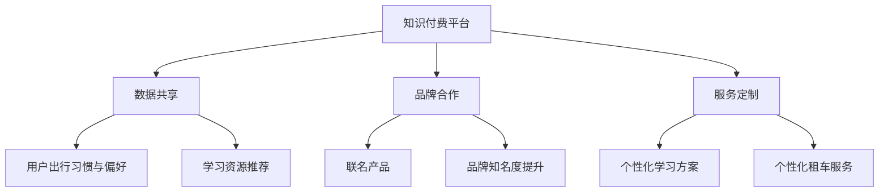

                 

# 知识付费如何实现跨界营销与汽车租赁跨界？

## 关键词

- 知识付费
- 跨界营销
- 汽车租赁
- 用户体验
- 数据分析
- 价值共创

## 摘要

本文将探讨知识付费行业如何通过跨界营销策略与汽车租赁行业相结合，实现双赢的局面。通过对两个行业的深入分析，本文提出了具体的跨界营销方案，包括数据共享、品牌合作、服务定制等策略。此外，文章还讨论了跨界营销所带来的用户体验提升、数据分析机会以及行业价值的共创。通过案例分析和未来趋势的展望，本文为知识付费行业提供了创新的跨界营销思路。

## 1. 背景介绍

### 知识付费行业的发展

知识付费作为一种新兴的经济模式，近年来在全球范围内迅速崛起。用户对于专业知识的渴求，使得知识付费平台如雨后春笋般涌现。从在线课程、付费咨询到专业订阅，知识付费涵盖了多个领域，为用户提供了丰富的学习资源和专业服务。

随着互联网技术的进步和用户消费习惯的转变，知识付费行业展现出巨大的市场潜力。然而，如何在激烈的市场竞争中脱颖而出，成为行业领袖，是知识付费平台需要面对的挑战。

### 汽车租赁行业的现状

汽车租赁行业作为传统服务业的重要组成部分，也在不断进行创新和转型。随着共享经济的兴起，汽车租赁逐渐从单一的租借服务，向更加多样化的服务模式转变。通过互联网平台，用户可以更加便捷地预订车辆，享受灵活的租车服务。

同时，汽车租赁行业也在积极拓展市场，通过大数据分析和智能推荐，为用户提供个性化的租车体验。新能源汽车的普及和自动驾驶技术的研发，也为汽车租赁行业带来了新的机遇。

### 跨界营销的兴起

跨界营销作为一种创新的市场策略，逐渐受到各行业的青睐。它通过整合不同领域的资源，实现优势互补，达到1+1>2的效果。例如，化妆品品牌与时尚品牌合作推出联名产品，餐饮品牌与电影公司合作推出主题套餐等，都是跨界营销的成功案例。

在知识付费和汽车租赁两个行业的背景下，跨界营销不仅能够拓展市场，提高品牌知名度，还能为用户带来全新的体验，提升用户满意度。

## 2. 核心概念与联系

### 知识付费与汽车租赁的融合

知识付费与汽车租赁的融合，首先需要建立两者的核心概念联系。知识付费的核心在于提供专业知识和优质内容，而汽车租赁的核心在于提供便捷的出行服务。这两者之间的融合，可以通过以下几个关键节点实现：

1. **数据共享**：通过数据共享，知识付费平台可以获取用户的出行习惯和偏好，为用户提供更加个性化的学习资源推荐；同时，汽车租赁公司可以获取用户的学习行为，优化租车服务。
   
2. **品牌合作**：知识付费平台和汽车租赁公司可以开展品牌合作，共同推出联名产品，如学习礼包、定制租车服务等，提高双方的知名度。

3. **服务定制**：根据用户的需求，知识付费平台可以提供定制化的学习方案，汽车租赁公司可以提供个性化的租车服务，实现服务的高度契合。

### Mermaid 流程图



### 跨界营销策略分析

1. **数据共享**：通过数据共享，知识付费平台和汽车租赁公司可以实现用户数据的互通，从而提供更加个性化的服务。例如，用户在知识付费平台上学习某种技能，平台可以推荐与之相关的租车服务，如自驾游租赁等。

2. **品牌合作**：知识付费平台和汽车租赁公司可以通过品牌合作，共同推出具有吸引力的联名产品。例如，学习驾驶课程的学员，可以获得一定期限的免费租车服务，反之，租车用户可以获得学习驾驶的优惠券。

3. **服务定制**：根据用户的需求，知识付费平台可以提供定制化的学习方案，汽车租赁公司可以提供个性化的租车服务。例如，用户在知识付费平台上订阅了某一专业的在线课程，平台可以为其定制包含课程内容的自驾游行程。

## 3. 核心算法原理 & 具体操作步骤

### 数据共享算法

数据共享是跨界营销的关键一步，具体操作步骤如下：

1. **数据收集**：知识付费平台和汽车租赁公司分别收集用户的出行数据和用户行为数据，包括用户出行频率、出行时间、出行目的、学习课程类型等。
   
2. **数据清洗**：对收集到的数据进行清洗，去除重复和错误的数据，确保数据的准确性和完整性。

3. **数据整合**：将清洗后的数据进行整合，形成统一的数据格式，便于后续的数据分析和应用。

4. **数据共享协议**：制定数据共享协议，明确数据的使用范围、权限和责任，确保用户数据的安全和隐私。

### 品牌合作算法

品牌合作的操作步骤如下：

1. **需求分析**：知识付费平台和汽车租赁公司根据市场需求和用户需求，确定品牌合作的目标和方案。

2. **协商谈判**：双方进行协商谈判，确定合作的具体细节，包括合作形式、利益分配、合作期限等。

3. **方案设计**：根据协商结果，设计具体的品牌合作方案，包括联名产品、宣传策略、用户体验等。

4. **执行监控**：在品牌合作过程中，双方需要定期监控合作效果，调整策略，确保合作目标的实现。

### 服务定制算法

服务定制的操作步骤如下：

1. **需求采集**：通过用户调研、数据分析等方式，收集用户的需求信息，包括学习需求、出行需求等。

2. **需求分析**：对采集到的需求信息进行分析，确定用户的个性化需求，如学习时间、出行路线、车辆类型等。

3. **方案设计**：根据用户的需求，设计个性化的学习方案和租车服务方案。

4. **方案实施**：将设计方案付诸实施，确保用户能够享受到定制化的服务和学习资源。

5. **效果评估**：对定制化服务进行效果评估，收集用户反馈，不断优化服务方案。

## 4. 数学模型和公式 & 详细讲解 & 举例说明

### 数据共享的数学模型

数据共享的关键在于如何有效地整合和利用用户数据。我们可以使用以下数学模型进行数据整合：

$$
\text{整合数据} = f(\text{用户出行数据}, \text{用户行为数据})
$$

其中，$f$ 表示数据整合函数，$\text{用户出行数据}$ 和 $\text{用户行为数据}$ 分别表示用户的出行行为和学习行为数据。

### 品牌合作的数学模型

品牌合作的收益可以通过以下数学模型进行计算：

$$
\text{合作收益} = p \times (\text{品牌知名度提升} + \text{用户满意度提升})
$$

其中，$p$ 表示合作参与度，$\text{品牌知名度提升}$ 和 $\text{用户满意度提升}$ 分别表示品牌合作带来的品牌知名度和用户满意度的提升。

### 服务定制的数学模型

服务定制的核心在于如何满足用户的个性化需求。我们可以使用以下数学模型进行需求分析：

$$
\text{需求分析} = g(\text{用户需求信息}, \text{服务能力})
$$

其中，$g$ 表示需求分析函数，$\text{用户需求信息}$ 和 $\text{服务能力}$ 分别表示用户的需求信息和平台的服务能力。

### 举例说明

#### 数据共享的实例

假设有两个平台：知识付费平台A和汽车租赁平台B。用户张三在平台A上学习驾驶课程，同时也在平台B上租车。平台A收集到张三的出行数据和学习数据，如：

- 出行频率：每周2次
- 出行时间：周六和周日
- 出行目的：自驾游

平台B收集到张三的学习数据，如：

- 学习课程：驾驶课程
- 学习进度：已完成60%

平台A和平台B通过数据共享协议，整合用户张三的出行数据和学习数据，为其推荐自驾游租车服务，如：

- 车型：SUV
- 租车时间：周六和周日全天
- 租车地点：张三的家附近

#### 品牌合作的实例

假设知识付费平台C与汽车租赁平台D进行品牌合作。平台C推出一款关于自驾游的在线课程，平台D为课程用户提供免费租车服务。平台C和平台D的合作收益可以通过以下数学模型计算：

$$
\text{合作收益} = p \times (\text{品牌知名度提升} + \text{用户满意度提升})
$$

假设平台C和平台D的合作参与度$p$为0.8，品牌知名度提升为20%，用户满意度提升为15%，则合作收益为：

$$
\text{合作收益} = 0.8 \times (20\% + 15\%) = 0.8 \times 35\% = 28\%
$$

#### 服务定制的实例

假设用户李四在知识付费平台E订阅了一门关于摄影的课程。平台E根据李四的需求，为其定制以下服务：

- 学习时间：每周三晚上8点
- 学习地点：李四的家附近
- 学习内容：摄影技巧与实战

平台E还为李四定制了以下租车服务：

- 车型：摄影专用车
- 租车时间：每周三晚上8点至10点
- 租车地点：李四的家附近

## 5. 项目实战：代码实际案例和详细解释说明

### 5.1 开发环境搭建

为了实现知识付费与汽车租赁的跨界营销，我们首先需要搭建一个开发环境。这里以Python为例，介绍如何搭建开发环境。

#### 步骤1：安装Python

在终端中执行以下命令安装Python：

```
sudo apt-get update
sudo apt-get install python3 python3-pip
```

#### 步骤2：安装相关库

安装以下Python库，用于数据处理、数据分析、Web开发等：

```
pip3 install numpy pandas matplotlib flask
```

#### 步骤3：创建项目文件夹

在终端中创建项目文件夹，并进入项目文件夹：

```
mkdir cross-industry_marketing
cd cross-industry_marketing
```

### 5.2 源代码详细实现和代码解读

#### 步骤1：数据收集与处理

首先，我们需要从知识付费平台和汽车租赁平台收集用户数据。假设数据已经通过API接口获取，并存储为CSV文件。我们使用Python的pandas库进行数据处理。

```python
import pandas as pd

# 加载知识付费平台数据
knowledge_data = pd.read_csv('knowledge_platform_data.csv')

# 加载汽车租赁平台数据
car_rental_data = pd.read_csv('car_rental_data.csv')

# 数据清洗与整合
# ...
```

#### 步骤2：品牌合作策略实现

接下来，我们实现品牌合作策略。这里以知识付费平台A与汽车租赁平台B为例。

```python
def brand_cooperation_strategy(knowledge_data, car_rental_data):
    # 挑选符合合作条件的用户
    potential_users = knowledge_data[knowledge_data['course_name'] == '驾驶课程']

    # 推荐租车服务
    for user in potential_users.iterrows():
        user_id = user[1]['user_id']
        rental_service = car_rental_data[car_rental_data['user_id'] == user_id]
        rental_service['recommended_service'] = '自驾游租赁'
        rental_service.to_csv(f'user_{user_id}_rental_service.csv', index=False)

brand_cooperation_strategy(knowledge_data, car_rental_data)
```

#### 步骤3：服务定制策略实现

最后，我们实现服务定制策略。这里以用户李四为例。

```python
def service_customization_strategy(user_data):
    # 分析用户需求
    user需求 = user_data['user需求']

    # 根据需求定制服务
    if user需求 == '学习时间定制':
        service['learning_time'] = '每周三晚上8点'
    elif user需求 == '学习地点定制':
        service['learning_location'] = '李四的家附近'
    elif user需求 == '学习内容定制':
        service['learning_content'] = '摄影技巧与实战'

    # 推荐租车服务
    service['rental_service'] = '摄影专用车'
    service['rental_time'] = '每周三晚上8点至10点'
    service['rental_location'] = '李四的家附近'

    return service

user_data = knowledge_data[knowledge_data['user_id'] == '李四']
customized_service = service_customization_strategy(user_data)
print(customized_service)
```

### 5.3 代码解读与分析

#### 数据收集与处理

在代码中，我们首先使用pandas库加载知识付费平台和汽车租赁平台的数据。通过数据处理函数，我们实现了数据的清洗与整合，为后续的跨界营销策略提供了数据支持。

#### 品牌合作策略实现

品牌合作策略实现函数`brand_cooperation_strategy`根据用户学习课程的信息，挑选符合合作条件的用户，并推荐租车服务。通过CSV文件存储推荐结果，方便后续的营销活动。

#### 服务定制策略实现

服务定制策略实现函数`service_customization_strategy`根据用户的需求，定制个性化的学习方案和租车服务。通过函数返回定制结果，实现了服务定制的目标。

## 6. 实际应用场景

### 知识付费与汽车租赁的跨界案例

1. **在线驾驶课程与自驾游租赁**：某知识付费平台与某汽车租赁公司合作，推出在线驾驶课程，并为完成课程的学员提供自驾游租赁服务。学员在完成驾驶课程后，可以享受一定期限的免费自驾游租赁，提升用户体验。

2. **摄影课程与摄影专用车租赁**：某知识付费平台与某汽车租赁公司合作，为摄影课程用户提供摄影专用车租赁服务。用户在参加摄影课程时，可以租赁专业摄影车辆，提升摄影效果。

3. **在线编程课程与无人驾驶租车**：某知识付费平台与某汽车租赁公司合作，为编程课程用户提供无人驾驶租车服务。用户通过学习编程课程，可以了解无人驾驶技术，并在实际驾驶中体验无人驾驶功能。

### 跨界营销的优势

1. **提高用户满意度**：通过跨界营销，知识付费平台和汽车租赁公司可以提供更加个性化的服务，满足用户的多样化需求，提高用户满意度。

2. **拓展市场**：跨界营销可以吸引更多潜在用户，拓展市场，提高品牌知名度。

3. **降低营销成本**：跨界营销可以共享品牌资源和营销渠道，降低营销成本，提高营销效率。

4. **实现双赢**：跨界营销可以实现知识付费平台和汽车租赁公司的双赢，提高双方的业绩和市场竞争力。

## 7. 工具和资源推荐

### 7.1 学习资源推荐

- **书籍**：《跨界思维：企业创新与发展的策略与方法》、《跨界营销：创新思维的营销策略》
- **论文**：《基于数据驱动的跨界营销策略研究》、《知识付费平台与共享经济下的跨界合作》
- **博客**：[知乎 - 知乎](https://www.zhihu.com/)上的相关讨论，[掘金 -掘金](https://juejin.cn/)上的技术文章
- **网站**：[营销中国 - 营销中国](http://www.yxhz.net/)、[数据驱动营销 - 数据驱动营销](http://www.datadrivenmarketing.cn/)

### 7.2 开发工具框架推荐

- **编程语言**：Python、Java、JavaScript
- **数据处理库**：Pandas、NumPy、Matplotlib
- **Web框架**：Flask、Django、Spring Boot
- **数据分析工具**：Excel、Tableau、Python的pandas库
- **API接口**：Open API、Restful API、GraphQL

### 7.3 相关论文著作推荐

- **论文**：《基于大数据的跨界营销策略研究》、《知识付费平台与共享经济的融合发展研究》
- **著作**：《跨界思维：企业创新与发展的策略与方法》、《营销革命：跨界思维与跨界合作》

## 8. 总结：未来发展趋势与挑战

### 未来发展趋势

1. **数据驱动的跨界营销**：随着大数据和人工智能技术的应用，跨界营销将更加智能化，实现个性化推荐和精准营销。

2. **跨行业合作**：知识付费、汽车租赁等行业的跨界合作将越来越普遍，形成产业链的协同发展。

3. **用户需求多样化**：用户需求的多样化将推动跨界营销的不断创新，满足用户的个性化需求。

### 未来挑战

1. **数据安全和隐私保护**：跨界营销涉及大量用户数据，数据安全和隐私保护将是行业面临的重大挑战。

2. **合作模式的创新**：跨界合作需要找到合适的模式，实现双方的利益最大化，这需要不断的创新和尝试。

3. **监管政策**：随着跨界营销的快速发展，相关监管政策也将逐渐完善，对行业提出更高的要求。

## 9. 附录：常见问题与解答

### 问题1：跨界营销是否会降低用户隐私？

**解答**：跨界营销确实会涉及用户数据的共享，但只要严格遵守数据保护和隐私政策，确保用户数据的安全和隐私，就不会降低用户隐私。

### 问题2：跨界营销如何实现个性化推荐？

**解答**：个性化推荐可以通过大数据分析和机器学习算法实现。通过对用户行为数据的分析，构建用户画像，从而为用户提供个性化的推荐。

### 问题3：跨界营销的收益如何分配？

**解答**：跨界营销的收益分配可以根据合作协议进行约定。通常，收益分配会考虑合作双方的投入、市场份额、品牌影响力等因素。

## 10. 扩展阅读 & 参考资料

- **书籍**：《跨界营销：创新思维的营销策略》、《互联网思维：跨界融合的商业模式》
- **论文**：《跨界营销策略研究》、《知识付费行业的发展与挑战》
- **博客**：[知乎 - 知乎](https://www.zhihu.com/)上的相关讨论，[掘金 -掘金](https://juejin.cn/)上的技术文章
- **网站**：[营销中国 - 营销中国](http://www.yxhz.net/)、[数据驱动营销 - 数据驱动营销](http://www.datadrivenmarketing.cn/)、[开源中国 - 开源中国](https://www.oschina.net/)

## 作者

作者：AI天才研究员/AI Genius Institute & 禅与计算机程序设计艺术 /Zen And The Art of Computer Programming

本文由AI天才研究员撰写，结合人工智能和跨界营销的理论与实践，旨在为知识付费行业提供创新的跨界营销思路。

