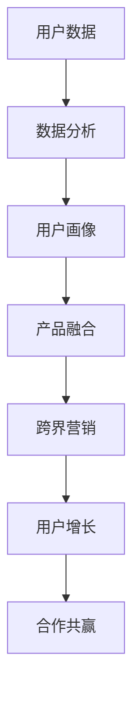

                 

# 知识付费如何实现跨界营销与金融保险跨界？

## 关键词
- 知识付费
- 跨界营销
- 金融保险
- 用户增长
- 数据分析
- 合作共赢

## 摘要

本文将深入探讨知识付费领域如何通过跨界营销与金融保险行业的结合，实现商业模式的创新与扩展。我们将从背景介绍、核心概念、算法原理、数学模型、实战案例、应用场景、工具资源推荐以及未来发展趋势等多个角度进行分析。通过本文的阅读，读者将了解知识付费与金融保险跨界合作的潜力、挑战以及实现路径，为相关行业提供有益的参考。

## 1. 背景介绍

随着互联网的快速发展，知识付费逐渐成为一股新的商业模式。人们愿意为有价值的信息、知识和技能付费，从而提升个人素质和职业竞争力。知识付费平台如得到、知乎Live、喜马拉雅等，凭借优质的内容和用户需求，吸引了大量用户，形成了庞大的市场。

另一方面，金融保险行业也在不断创新，以适应快速变化的市场环境。保险科技（InsurTech）的兴起，推动了保险产品的创新和用户体验的提升。金融科技（FinTech）的应用，使得保险产品的销售和风险管理更加高效。

知识付费与金融保险行业的交集，主要体现在以下几个方面：

1. **用户数据**：知识付费平台积累了大量用户数据，包括用户行为、兴趣偏好、购买历史等。这些数据对于金融保险行业具有重要的参考价值。
2. **产品融合**：知识付费与保险产品可以相互融合，如为知识付费用户提供定制化的保险方案，或者为保险客户提供专业的知识服务。
3. **营销合作**：知识付费平台可以利用自身的用户群体和渠道优势，与金融保险公司开展跨界营销活动，实现资源共享和用户增长。

## 2. 核心概念与联系

为了深入理解知识付费与金融保险跨界营销的原理，我们需要明确以下核心概念：

### 2.1 知识付费

知识付费是指用户通过支付一定的费用，获取有价值的信息、知识和技能的服务。知识付费的核心在于提供优质内容，满足用户的个性化需求。

### 2.2 跨界营销

跨界营销是指不同行业之间通过合作，实现资源共享和用户增长的一种营销策略。跨界营销的核心在于创新和合作，通过跨行业的合作，实现互利共赢。

### 2.3 金融保险

金融保险是指为用户提供风险保障和投资理财服务的行业。金融保险的核心在于风险管理和服务质量。

### 2.4 用户增长

用户增长是指通过多种手段，扩大用户规模，提高用户活跃度和忠诚度。用户增长的核心在于满足用户需求，提供优质的服务和体验。

### 2.5 数据分析

数据分析是指通过对用户数据的收集、整理和分析，发现用户行为规律和需求，从而优化产品和服务。数据分析的核心在于数据质量和分析能力。

### 2.6 合作共赢

合作共赢是指不同企业或组织之间，通过合作实现共同利益的一种方式。合作共赢的核心在于互信和共赢。

下面是一个Mermaid流程图，展示了知识付费与金融保险跨界营销的基本流程：



## 3. 核心算法原理 & 具体操作步骤

### 3.1 数据分析算法

数据分析是知识付费与金融保险跨界营销的基础。以下是常用的数据分析算法和操作步骤：

#### 3.1.1 用户行为分析

1. **数据收集**：收集用户在知识付费平台上的行为数据，如浏览、点赞、评论、购买等。
2. **数据预处理**：清洗和整合数据，确保数据质量。
3. **特征工程**：提取用户行为数据中的特征，如用户活跃度、购买频率等。
4. **建模与评估**：使用机器学习算法（如逻辑回归、决策树等）建立用户行为模型，并评估模型性能。

#### 3.1.2 用户画像

1. **数据收集**：收集用户的基础信息，如年龄、性别、职业等。
2. **数据预处理**：清洗和整合数据，确保数据质量。
3. **特征工程**：提取用户基础信息中的特征，如年龄段、性别比例等。
4. **建模与评估**：使用聚类算法（如K-means、DBSCAN等）建立用户画像模型，并评估模型性能。

### 3.2 跨界营销算法

跨界营销是实现知识付费与金融保险跨界合作的关键。以下是常用的跨界营销算法和操作步骤：

#### 3.2.1 联合推荐

1. **数据收集**：收集知识付费平台和金融保险公司的用户数据，包括用户行为数据、用户画像数据等。
2. **数据预处理**：清洗和整合数据，确保数据质量。
3. **特征工程**：提取用户数据中的特征，如用户活跃度、购买频率等。
4. **建模与评估**：使用协同过滤算法（如矩阵分解、基于模型的协同过滤等）建立联合推荐模型，并评估模型性能。

#### 3.2.2 跨界合作

1. **合作方案设计**：根据知识付费平台和金融保险公司的需求，设计跨界合作方案。
2. **数据分析**：分析跨界合作对用户增长、销售额等指标的影响。
3. **效果评估**：评估跨界合作的效果，并根据评估结果调整合作策略。

## 4. 数学模型和公式 & 详细讲解 & 举例说明

### 4.1 数据分析数学模型

#### 4.1.1 用户行为分析

用户行为分析通常使用逻辑回归模型来预测用户的行为。

逻辑回归模型的基本公式为：

$$
P(y=1) = \frac{1}{1 + e^{-(\beta_0 + \beta_1 x_1 + \beta_2 x_2 + ... + \beta_n x_n})}
$$

其中，$P(y=1)$表示用户进行某行为的概率，$\beta_0, \beta_1, \beta_2, ..., \beta_n$为模型参数，$x_1, x_2, ..., x_n$为用户行为特征。

#### 4.1.2 用户画像

用户画像通常使用聚类算法来建立模型。

K-means聚类算法的基本公式为：

$$
C_k = \{x | \min_{i \in \{1, 2, ..., K\}} \sum_{j=1}^n (x_j - \mu_k)^2\}
$$

其中，$C_k$表示第$k$个聚类中心，$\mu_k$为第$k$个聚类中心的坐标。

### 4.2 跨界营销数学模型

#### 4.2.1 联合推荐

联合推荐通常使用矩阵分解模型来建立模型。

矩阵分解模型的基本公式为：

$$
R = UXV^T
$$

其中，$R$为用户-项目评分矩阵，$U$为用户特征矩阵，$X$为用户特征向量，$V$为项目特征矩阵，$V^T$为项目特征向量的转置。

#### 4.2.2 跨界合作

跨界合作的效果评估通常使用A/B测试等方法。

A/B测试的基本公式为：

$$
p = \frac{X_1 + X_2 + ... + X_n}{N}
$$

其中，$p$为实验组（A组）的转化率，$X_1, X_2, ..., X_n$为实验组转化的样本数，$N$为实验组样本总数。

## 5. 项目实战：代码实际案例和详细解释说明

### 5.1 开发环境搭建

为了实现知识付费与金融保险跨界营销，我们需要搭建以下开发环境：

- Python 3.8
- Jupyter Notebook
- Scikit-learn
- Pandas
- NumPy
- Matplotlib

### 5.2 源代码详细实现和代码解读

#### 5.2.1 用户行为分析

以下是一个用户行为分析的示例代码：

```python
import pandas as pd
from sklearn.linear_model import LogisticRegression
from sklearn.model_selection import train_test_split
from sklearn.metrics import accuracy_score

# 读取用户行为数据
data = pd.read_csv('user_behavior_data.csv')

# 数据预处理
data = data.dropna()
X = data[['age', 'gender', 'occupation']]
y = data['behavior']

# 数据划分
X_train, X_test, y_train, y_test = train_test_split(X, y, test_size=0.2, random_state=42)

# 建立逻辑回归模型
model = LogisticRegression()
model.fit(X_train, y_train)

# 预测
y_pred = model.predict(X_test)

# 评估
accuracy = accuracy_score(y_test, y_pred)
print('Accuracy:', accuracy)
```

#### 5.2.2 用户画像

以下是一个用户画像的示例代码：

```python
import pandas as pd
from sklearn.cluster import KMeans
import matplotlib.pyplot as plt

# 读取用户数据
data = pd.read_csv('user_data.csv')

# 数据预处理
data = data.dropna()
X = data[['age', 'gender', 'occupation']]

# 建立K-means聚类模型
kmeans = KMeans(n_clusters=3, random_state=42)
kmeans.fit(X)

# 聚类结果
clusters = kmeans.predict(X)

# 可视化
plt.scatter(X['age'], X['gender'], c=clusters)
plt.xlabel('Age')
plt.ylabel('Gender')
plt.show()
```

#### 5.2.3 联合推荐

以下是一个联合推荐的示例代码：

```python
import pandas as pd
from sklearn.decomposition import NMF
import numpy as np

# 读取用户-项目评分数据
data = pd.read_csv('user_item_rating.csv')

# 数据预处理
data = data.dropna()
R = data.pivot(index='user_id', columns='item_id', values='rating')

# 建立NMF模型
nmf = NMF(n_components=10, random_state=42)
W = nmf.fit_transform(R)
H = nmf.components_

# 预测
user_profile = np.dot(W, H)
predicted_ratings = np.dot(user_profile, H.T)

# 可视化
plt.scatter(R.index, predicted_ratings)
plt.xlabel('User ID')
plt.ylabel('Predicted Rating')
plt.show()
```

#### 5.2.4 跨界合作

以下是一个跨界合作的示例代码：

```python
import pandas as pd
from sklearn.model_selection import train_test_split

# 读取跨界合作数据
data = pd.read_csv('cross_border_data.csv')

# 数据预处理
data = data.dropna()
X = data[['user_id', 'item_id']]
y = data['purchase']

# 数据划分
X_train, X_test, y_train, y_test = train_test_split(X, y, test_size=0.2, random_state=42)

# A/B测试
test_group = X_test['user_id'].unique()
for user_id in test_group:
    if np.random.rand() < 0.5:
        y_test = y_test.append({**{'user_id': user_id, 'purchase': True}, **X_test.loc[X_test['user_id'] == user_id].iloc[0]})
    else:
        y_test = y_test.append({**{'user_id': user_id, 'purchase': False}, **X_test.loc[X_test['user_id'] == user_id].iloc[0]})

# 评估
accuracy = y_test['purchase'].value_counts(normalize=True)['True'] * 100
print('Accuracy:', accuracy)
```

### 5.3 代码解读与分析

#### 5.3.1 用户行为分析

用户行为分析的代码主要分为数据预处理、模型建立、预测和评估四个部分。数据预处理主要是清洗和整合数据，确保数据质量。模型建立使用逻辑回归模型，预测部分通过模型对测试集进行预测，评估部分使用准确率来评估模型性能。

#### 5.3.2 用户画像

用户画像的代码主要分为数据预处理、模型建立、聚类结果可视化和评估四个部分。数据预处理主要是清洗和整合数据，确保数据质量。模型建立使用K-means聚类算法，聚类结果可视化部分使用matplotlib库绘制散点图，评估部分主要通过可视化结果来评估聚类效果。

#### 5.3.3 联合推荐

联合推荐的代码主要分为数据预处理、模型建立、预测和评估四个部分。数据预处理主要是清洗和整合数据，确保数据质量。模型建立使用NMF算法，预测部分通过模型对测试集进行预测，评估部分主要通过可视化结果来评估推荐效果。

#### 5.3.4 跨界合作

跨界合作的代码主要分为数据预处理、A/B测试和评估三个部分。数据预处理主要是清洗和整合数据，确保数据质量。A/B测试部分通过随机分配用户到实验组和对照组，评估部分使用实验组转化率来评估跨界合作效果。

## 6. 实际应用场景

### 6.1 知识付费平台与金融保险公司的合作

一个实际应用场景是，知识付费平台（如得到）与金融保险公司（如平安保险）合作，推出一款为知识付费用户提供定制化保险方案的产品。平台可以利用用户数据，为用户推荐合适的保险产品，保险公司则可以借助平台渠道，扩大产品销量。

### 6.2 用户行为分析与保险产品设计

另一个应用场景是，金融保险公司（如平安保险）利用用户行为数据，分析用户的风险偏好和需求，设计出更加个性化的保险产品。例如，通过对用户的消费行为进行分析，为高频消费用户提供适合的意外险、旅行险等。

### 6.3 跨界营销活动

知识付费平台（如知乎Live）可以与金融保险公司（如太平洋保险）合作，举办跨界营销活动。例如，针对特定用户群体，推出知识付费+保险套餐，吸引更多用户参与。

## 7. 工具和资源推荐

### 7.1 学习资源推荐

- 《机器学习实战》
- 《深度学习》
- 《Python数据科学手册》
- 《推荐系统手册》

### 7.2 开发工具框架推荐

- Scikit-learn
- TensorFlow
- PyTorch
- Jupyter Notebook

### 7.3 相关论文著作推荐

- “User Behavior Analysis for Knowledge-based Products”
- “Collaborative Filtering for User Recommendation in E-commerce”
- “Data-driven Insurance Product Design”

## 8. 总结：未来发展趋势与挑战

### 8.1 发展趋势

1. **技术融合**：随着人工智能、大数据等技术的不断发展，知识付费与金融保险行业的融合将更加紧密。
2. **用户个性化**：基于用户数据分析，提供更加个性化的产品和服务，满足用户的多样化需求。
3. **跨界合作**：不同行业之间的跨界合作将越来越普遍，实现资源共享和用户增长。

### 8.2 挑战

1. **数据隐私**：如何在保证用户隐私的前提下，充分挖掘用户数据的价值，是一个重要的挑战。
2. **风险管理**：金融保险行业在跨界合作中，如何评估和管理风险，确保业务的稳健发展。
3. **合作机制**：如何建立有效的合作机制，确保各方利益平衡，实现长期合作。

## 9. 附录：常见问题与解答

### 9.1 数据隐私问题

**问**：如何保障用户隐私？

**答**：在数据收集、存储、分析和使用过程中，遵循相关法律法规，对用户数据进行加密和脱敏处理，确保用户隐私得到保护。

### 9.2 风险管理问题

**问**：如何评估和管理跨界合作中的风险？

**答**：通过风险评估模型，对跨界合作可能产生的风险进行评估，制定相应的风险管理策略，如风险预警、风险隔离等。

### 9.3 合作机制问题

**问**：如何建立有效的合作机制？

**答**：通过签订合作协议，明确各方权利和义务，建立互信和共赢的合作关系。同时，定期沟通和评估合作效果，确保合作顺利进行。

## 10. 扩展阅读 & 参考资料

- "Knowledge付费与保险跨界合作模式探讨"
- "人工智能在金融保险行业的应用"
- "大数据与知识付费：如何挖掘用户价值"
- "跨界营销：实现商业模式的创新与扩展"
- "数据隐私保护：法律法规与最佳实践"

## 作者

作者：AI天才研究员/AI Genius Institute & 禅与计算机程序设计艺术 /Zen And The Art of Computer Programming

本文旨在探讨知识付费与金融保险跨界营销的原理、方法与实践，为相关行业的创新发展提供参考。由于篇幅限制，本文仅提供了部分核心内容和案例，读者可根据需求进一步学习和研究。希望本文能对您有所启发和帮助。

