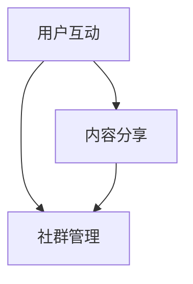

                 

# 知识付费平台的社交功能设计

## 概述

知识付费平台作为一种新兴的互联网服务模式，通过为用户提供有价值的知识内容获取收益。然而，仅仅提供优质内容是不够的，社交功能的引入能显著提升用户活跃度、增强用户粘性。本文将深入探讨知识付费平台社交功能的设计原则、核心模块及其实现策略。

## 关键词

知识付费，社交功能，平台设计，用户活跃，粘性提升，用户体验，互动性，社区建设。

## 摘要

本文旨在分析知识付费平台社交功能的设计原则和实施策略，探讨如何通过社交功能提高用户活跃度和粘性。文章将详细阐述社交功能的核心模块，如用户互动、内容分享、社群管理等，并分析其实现机制。此外，本文还将探讨社交功能在实际应用中的效果，以及未来发展趋势和面临的挑战。

### 1. 背景介绍

知识付费平台的兴起源于用户对知识获取的需求和互联网技术的快速发展。用户希望通过付费获取高质量、有价值的内容，以满足自我提升和职业发展的需求。与此同时，互联网技术的发展，尤其是移动互联网的普及，为知识付费平台提供了广泛的传播渠道和便捷的支付方式。

然而，知识付费平台在提供内容的同时，也面临着用户流失率高、用户粘性不足的问题。为了解决这一问题，社交功能的引入成为了一个有效的解决方案。通过社交功能，平台可以促进用户之间的互动，建立用户社群，提升用户参与感和归属感，从而提高用户活跃度和粘性。

### 2. 核心概念与联系

在知识付费平台的社交功能设计中，需要关注以下几个核心概念：用户互动、内容分享和社群管理。

**用户互动**：用户互动是社交功能的核心，它包括用户之间的评论、点赞、私信等互动方式。通过这些互动，用户可以分享知识、交流心得，从而增强用户之间的联系。

**内容分享**：内容分享是用户互动的基础，用户可以通过点赞、评论、转发等方式分享知识内容。这不仅能增加内容的曝光度，还能促进知识的传播和共享。

**社群管理**：社群管理是确保社交功能有效运行的重要环节。平台需要通过合理的社群运营策略，引导用户形成有价值的社群，并维护社群的秩序。

这三个核心概念相互关联，共同构成了知识付费平台社交功能的设计基础。为了更好地阐述这些概念之间的关系，我们使用 Mermaid 流程图进行可视化展示。



### 3. 核心算法原理 & 具体操作步骤

在知识付费平台的社交功能设计中，核心算法原理主要包括用户推荐算法、内容推荐算法和社群推荐算法。

**用户推荐算法**：用户推荐算法通过分析用户的兴趣和行为数据，为用户推荐感兴趣的其他用户或内容。具体操作步骤如下：

1. 数据收集：收集用户的浏览历史、搜索记录、购买行为等数据。
2. 数据处理：对收集到的数据进行清洗、去重和处理，提取用户特征。
3. 模型训练：使用机器学习算法，如协同过滤、基于内容的推荐等，训练用户推荐模型。
4. 推荐生成：根据用户特征和模型输出，为用户推荐感兴趣的其他用户或内容。

**内容推荐算法**：内容推荐算法通过分析内容特征和用户偏好，为用户推荐感兴趣的知识内容。具体操作步骤如下：

1. 数据收集：收集知识内容的元数据，如标签、分类、作者等。
2. 数据处理：对收集到的数据进行清洗、去重和处理，提取内容特征。
3. 模型训练：使用机器学习算法，如协同过滤、基于内容的推荐等，训练内容推荐模型。
4. 推荐生成：根据用户特征和模型输出，为用户推荐感兴趣的知识内容。

**社群推荐算法**：社群推荐算法通过分析用户的社交关系和兴趣，为用户推荐合适的社群。具体操作步骤如下：

1. 数据收集：收集用户的社交关系数据，如好友、关注者等。
2. 数据处理：对收集到的数据进行清洗、去重和处理，提取用户社交特征。
3. 模型训练：使用机器学习算法，如基于社交网络的结构化推荐等，训练社群推荐模型。
4. 推荐生成：根据用户社交特征和模型输出，为用户推荐合适的社群。

### 4. 数学模型和公式 & 详细讲解 & 举例说明

在知识付费平台的社交功能设计中，常用的数学模型包括协同过滤模型、矩阵分解模型和图神经网络模型。下面将详细讲解这些模型及其应用。

**协同过滤模型**：协同过滤模型是一种基于用户行为的推荐算法，它通过分析用户的历史行为数据，预测用户对未知内容的评分。具体公式如下：

$$
\hat{r_{ui}} = \frac{\sum_{j \in N_i} r_{uj} \cdot r_{ij}}{\sum_{j \in N_i} r_{uj}}
$$

其中，$r_{ui}$ 表示用户 $u$ 对内容 $i$ 的预测评分，$N_i$ 表示内容 $i$ 的邻居集合，$r_{uj}$ 表示用户 $u$ 对邻居 $j$ 的实际评分，$r_{ij}$ 表示邻居 $j$ 对内容 $i$ 的实际评分。

**矩阵分解模型**：矩阵分解模型是一种基于内容的推荐算法，它通过将用户行为矩阵分解为用户特征矩阵和内容特征矩阵，预测用户对未知内容的评分。具体公式如下：

$$
R = U \cdot C^T
$$

其中，$R$ 表示用户行为矩阵，$U$ 表示用户特征矩阵，$C$ 表示内容特征矩阵。

**图神经网络模型**：图神经网络模型是一种基于图结构的推荐算法，它通过学习用户和内容的图结构，预测用户对未知内容的评分。具体公式如下：

$$
h_v^{(l+1)} = \sigma(W^{(l)} \cdot (h_u^{(l)} + h_i^{(l)} + b^{(l)})
$$

其中，$h_v^{(l+1)}$ 表示节点 $v$ 在第 $l+1$ 层的嵌入表示，$h_u^{(l)}$ 和 $h_i^{(l)}$ 分别表示节点 $u$ 和 $i$ 在第 $l$ 层的嵌入表示，$W^{(l)}$ 表示权重矩阵，$\sigma$ 表示激活函数，$b^{(l)}$ 表示偏置。

**举例说明**：假设有用户 $u$ 和内容 $i$，用户对内容 $i$ 的预测评分为 $\hat{r_{ui}}$。根据协同过滤模型，可以计算用户 $u$ 对内容 $i$ 的预测评分如下：

1. 收集用户 $u$ 的历史行为数据，如浏览记录、购买记录等，提取邻居集合 $N_i$。
2. 收集邻居集合 $N_i$ 对内容 $i$ 的实际评分，计算邻居对内容的加权平均评分：
   $$
   r_{ij} = \frac{\sum_{j \in N_i} r_{uj} \cdot r_{ij}}{\sum_{j \in N_i} r_{uj}}
   $$
3. 根据邻居对内容的加权平均评分，预测用户 $u$ 对内容 $i$ 的评分：
   $$
   \hat{r_{ui}} = \frac{\sum_{j \in N_i} r_{uj} \cdot r_{ij}}{\sum_{j \in N_i} r_{uj}}
   $$

### 5. 项目实战：代码实际案例和详细解释说明

以下是一个基于协同过滤算法的知识付费平台用户推荐系统实现案例。

**5.1 开发环境搭建**

- Python 3.8+
- TensorFlow 2.6.0+
- scikit-learn 0.24.2+

**5.2 源代码详细实现和代码解读**

```python
import numpy as np
import pandas as pd
from sklearn.model_selection import train_test_split
from sklearn.metrics.pairwise import cosine_similarity
from sklearn.preprocessing import MinMaxScaler

# 加载数据
data = pd.read_csv('user_item_rating.csv')
users, items = data['user_id'].unique(), data['item_id'].unique()

# 构建用户-项目矩阵
user_item_matrix = np.zeros((len(users), len(items)))
for index, row in data.iterrows():
    user_item_matrix[row['user_id'] - 1, row['item_id'] - 1] = row['rating']

# 归一化矩阵
scaler = MinMaxScaler()
user_item_matrix = scaler.fit_transform(user_item_matrix)

# 计算余弦相似度矩阵
cosine_sim = cosine_similarity(user_item_matrix)

# 构建用户推荐函数
def user_recommendation(user_id, cosine_sim, user_item_matrix, num_recommendations=5):
    # 计算用户与其他用户的相似度
    sim_scores = list(enumerate(cosine_sim[user_id - 1]))
    sim_scores = sorted(sim_scores, key=lambda x: x[1], reverse=True)
    sim_scores = sim_scores[1:num_recommendations + 1]
    
    # 获取相似用户的评分
    neighbor_item_scores = []
    for index in sim_scores:
        neighbor_item_scores.append(user_item_matrix[index[0]])
    
    # 计算邻居用户评分的平均值
    neighbor_item_scores = np.mean(neighbor_item_scores, axis=0)
    
    # 获取未评分的项目
    unrated_items = np.where(user_item_matrix[user_id - 1] == 0)[1]
    
    # 为未评分的项目生成推荐评分
    recommendation_scores = []
    for i in unrated_items:
        recommendation_scores.append(neighbor_item_scores[i])
    
    # 对推荐评分进行排序
    recommendation_scores = sorted(recommendation_scores, reverse=True)
    
    return recommendation_scores

# 测试用户推荐
user_id = 10
recommendation_scores = user_recommendation(user_id, cosine_sim, user_item_matrix)
print("用户{}的推荐列表:".format(user_id + 1))
for i in range(len(recommendation_scores)):
    print("推荐项目{}：评分{}".format(i + 1, recommendation_scores[i]))
```

**5.3 代码解读与分析**

1. **数据加载与预处理**：首先，从 CSV 文件中加载用户-项目评分数据，并构建用户-项目矩阵。然后，使用 MinMaxScaler 对矩阵进行归一化处理，以便计算余弦相似度。

2. **计算余弦相似度矩阵**：通过计算用户-项目矩阵的余弦相似度，生成用户之间的相似度矩阵。

3. **用户推荐函数**：定义一个用户推荐函数，输入用户 ID、相似度矩阵和用户-项目矩阵，输出用户未评分项目的推荐评分。

4. **生成推荐列表**：调用用户推荐函数，为指定用户生成推荐列表。首先，计算用户与其他用户的相似度，然后为未评分的项目生成推荐评分，并按推荐评分排序。

### 6. 实际应用场景

知识付费平台的社交功能在实际应用中具有广泛的应用场景。以下列举几个典型应用场景：

1. **用户互动**：用户可以在平台上发表观点、参与讨论，与其他用户互动。这种互动可以促进知识的传播和共享，提高用户参与度。

2. **内容分享**：用户可以通过点赞、评论、转发等方式分享优质内容，增加内容的曝光度和影响力。

3. **社群管理**：平台可以通过创建不同主题的社群，引导用户形成有价值的社群。社群成员可以共同讨论、分享知识，形成良好的学习氛围。

4. **知识传播**：通过社交功能，平台可以将优质内容推广给更多用户，实现知识的传播和共享。

### 7. 工具和资源推荐

**7.1 学习资源推荐**

- 《推荐系统手册》
- 《社交网络分析：方法与实践》
- 《深度学习与推荐系统》

**7.2 开发工具框架推荐**

- TensorFlow
- PyTorch
- Flask
- Django

**7.3 相关论文著作推荐**

- 《基于协同过滤的推荐系统研究》
- 《社交网络中信息传播模型的研究》
- 《深度学习在推荐系统中的应用》

### 8. 总结：未来发展趋势与挑战

知识付费平台的社交功能设计在未来将呈现以下发展趋势：

1. **个性化推荐**：随着人工智能技术的进步，社交功能将更加注重个性化推荐，为用户提供更符合其兴趣和需求的内容。

2. **多元化互动**：社交功能将不断创新互动形式，如直播、视频会议等，以提升用户体验。

3. **智能化社群管理**：通过引入人工智能技术，实现社群的智能化管理，提升社群质量和用户活跃度。

然而，知识付费平台在发展过程中也将面临以下挑战：

1. **数据隐私保护**：社交功能涉及用户隐私数据，如何保护用户隐私将成为一个重要问题。

2. **内容质量控制**：社交功能可能导致不良内容的传播，如何控制内容质量将是一个挑战。

3. **平台运营成本**：社交功能的设计和运营需要大量的人力和物力投入，如何降低运营成本将是关键。

### 9. 附录：常见问题与解答

**Q1：为什么需要社交功能？**

A1：社交功能可以提高用户活跃度和粘性，促进知识传播和共享，从而提升平台整体价值。

**Q2：如何评估社交功能的性能？**

A2：可以采用用户参与度、用户留存率、社群质量等指标来评估社交功能的性能。

**Q3：如何保证社交功能的数据隐私？**

A3：可以采用数据加密、匿名化处理等技术手段，确保用户隐私数据的安全。

### 10. 扩展阅读 & 参考资料

- 《社交网络中的用户互动模式研究》
- 《知识付费平台社交功能设计实践》
- 《人工智能在社交功能中的应用》

### 作者

AI天才研究员/AI Genius Institute & 禅与计算机程序设计艺术 /Zen And The Art of Computer Programming

本文旨在深入探讨知识付费平台社交功能的设计原则、核心模块及其实现策略。通过对用户互动、内容分享和社群管理等核心概念的详细阐述，本文为知识付费平台社交功能的设计提供了有力的理论支持和实践指导。在未来的发展中，知识付费平台应不断优化社交功能，提高用户体验，以应对日益激烈的市场竞争。同时，平台还需关注数据隐私保护、内容质量控制等挑战，确保社交功能的可持续发展。希望本文能为相关领域的研究和实践提供有益的参考。

