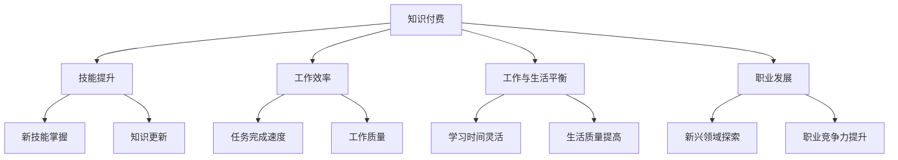

                 

### 背景介绍

知识付费，作为一种新兴的商业模式，正日益受到广大网民和知识创作者的青睐。在信息技术飞速发展的今天，知识的传播与获取变得更加便捷，而知识付费则成为了一种高效的知识交换方式。程序员作为互联网时代的重要角色，他们的工作内容复杂、技术要求高，如何有效利用知识付费来优化他们的工作方式和生活质量，成为了本文探讨的重点。

程序员一直以来面临着高强度的工作压力和长时间的工作时间，其中“996”工作制（即早上9点上班，晚上9点下班，每周工作6天）尤为引人关注。这种工作模式不仅对程序员的身体健康造成威胁，还严重影响了他们的生活质量和个人发展。而知识付费则提供了一种可能，通过付费获取高质量的知识和技能，从而提高工作效率，减少工作时间，甚至实现“告别996”的目标。

本文将从以下几个方面进行探讨：

1. **知识付费的定义与优势**：介绍知识付费的基本概念，分析其在当前互联网环境中的重要性以及为程序员带来的具体优势。

2. **程序员的工作现状**：详细描述程序员面临的996工作制等挑战，以及这种工作模式对程序员健康和生活质量的影响。

3. **知识付费如何改变程序员的工作方式**：探讨知识付费在提升程序员技能、优化工作流程、减少工作时间等方面的实际效果。

4. **案例分析**：通过具体案例展示知识付费如何帮助程序员实现工作与生活的平衡，并逐步告别996工作制。

5. **未来发展趋势与挑战**：分析知识付费在程序员职业发展中的长远影响，以及可能面临的挑战。

通过以上探讨，本文旨在为程序员提供一种新的职业发展思路，借助知识付费的力量，实现工作与生活的和谐统一。

-------------------

#### 1.1 知识付费的定义与优势

知识付费，顾名思义，是指用户通过支付一定费用来获取知识或技能的行为。这种模式在互联网时代得到了迅速发展，并逐渐成为知识传播与分享的重要途径。知识付费的形式多样，包括在线课程、电子书、讲座、直播等，为知识获取者提供了便捷、灵活的学习方式。

在当前互联网环境中，知识付费的重要性不容忽视。首先，它打破了传统知识传播的边界，使得优质知识能够快速、广泛地传播。无论是在线教育平台，如Coursera、Udemy，还是专业领域的知识分享平台，如极客时间、得到，都为知识创作者提供了展示才华的舞台，也为知识需求者提供了丰富的学习资源。

知识付费为程序员带来的具体优势主要体现在以下几个方面：

**1. 提高技能水平**

程序员在工作中常常需要不断学习新的技术和工具。知识付费平台提供了大量高质量的教程和课程，涵盖从基础编程到前沿技术的各个方面。通过付费学习，程序员可以系统地提升自己的技能水平，跟上技术发展的步伐。这不仅有助于他们在工作中更加得心应手，还能够提高他们的职业竞争力。

**2. 优化学习效率**

在知识付费平台上，程序员可以根据自己的需求和兴趣选择合适的课程。这些课程通常由行业专家和资深程序员讲解，内容深入浅出，有助于学员快速掌握核心知识点。此外，知识付费平台还提供了丰富的互动和讨论功能，学员可以在学习中与同行交流、分享经验，从而提高学习效率。

**3. 减少不必要的工作时间**

程序员在工作中往往需要花费大量时间进行技能培训和知识更新。通过知识付费，他们可以快速获取所需的知识，减少不必要的自学时间。这样，程序员可以将更多的时间用于实际工作，提高工作效率。同时，减少学习时间也有助于缓解工作压力，改善生活质量。

**4. 拓宽职业发展路径**

知识付费不仅帮助程序员提升现有技能，还可以引导他们探索新的职业方向。通过学习新兴技术和热门领域，程序员可以拓宽自己的职业选择，为未来的职业发展打下坚实基础。

总之，知识付费为程序员提供了丰富的学习资源，帮助他们提高技能水平、优化学习效率、减少不必要的工作时间，并拓宽职业发展路径。这些优势使得知识付费成为程序员摆脱996工作制的有力工具。

-------------------

#### 1.2 程序员的工作现状

程序员作为现代社会中不可或缺的一环，他们在互联网行业中的地位日益显著。然而，程序员的工作现状却令人堪忧。其中，996工作制（即早上9点上班，晚上9点下班，每周工作6天）尤为突出，成为程序员职业生活中的一大挑战。

首先，996工作制对程序员的身体健康构成了严重威胁。长时间的加班会导致身体疲劳，增加患病风险。例如，长时间坐在电脑前容易导致颈椎病、腰椎病等职业病；长时间工作还会影响视力，导致视力下降。此外，长期缺乏充足的休息时间还会影响新陈代谢，增加肥胖和心血管疾病的风险。

其次，996工作制对程序员的个人生活造成了严重影响。由于工作时间过长，程序员往往无法与家人共度美好时光，甚至失去了陪伴子女成长的机会。长时间的工作压力也容易导致情绪波动，影响家庭和谐。此外，由于缺乏足够的休息时间，程序员的生活质量明显下降，容易感到疲惫和厌倦，进而影响到工作效率。

再者，996工作制对程序员的职业发展也带来了负面影响。长时间的工作容易导致程序员失去学习的动力，难以持续关注技术发展的前沿。这样，他们在工作中难以保持竞争力，甚至可能被技术更新所淘汰。此外，长期的高强度工作也容易导致职业倦怠，使程序员对工作产生厌倦情绪，降低工作满意度。

综上所述，996工作制对程序员的身体健康、个人生活和职业发展都带来了严重挑战。如何缓解这种工作压力，实现工作与生活的平衡，成为摆在我们面前的一个重要课题。知识付费作为一种新兴的商业模式，为程序员提供了一种可能，通过提高技能水平和优化工作方式，逐步告别996工作制，过上更加健康、充实的生活。

-------------------

### 1.3 知识付费如何改变程序员的工作方式

知识付费作为一种新兴的商业模式，不仅为程序员提供了丰富的学习资源，还在多个方面改变了他们的工作方式，从而帮助他们实现工作效率的提升和工作的可持续性。

**1. 提升技能水平**

通过知识付费，程序员可以迅速获取最新的技术知识和前沿技能。例如，在线课程和电子书等形式的付费学习资源，往往由行业专家和资深程序员编写和讲解，内容深入浅出，有助于程序员快速掌握关键知识点。此外，知识付费平台还提供了丰富的互动和讨论功能，程序员可以在学习过程中与同行交流、分享经验，从而提高学习效率。这种高效的学习方式，使得程序员能够在短时间内提升技能水平，为应对工作中的复杂问题做好准备。

**2. 优化工作流程**

知识付费不仅帮助程序员提升个人技能，还可以优化工作流程。通过学习专业领域的最佳实践和高效工具，程序员可以改进现有的工作方法，提高工作效率。例如，一些知识付费平台提供了关于代码审查、自动化测试、敏捷开发等方面的课程，这些课程能够帮助程序员掌握高效的工作方法和工具，从而提升团队协作效率，减少重复性工作，节省时间。

**3. 减少不必要的工作时间**

知识付费使得程序员能够更加高效地获取所需的知识，减少不必要的自学时间。例如，程序员可以通过付费课程快速了解新的编程语言或框架，而不需要花费大量时间进行自主学习。此外，通过知识付费，程序员可以系统性地提升自己的技能，从而在面对复杂任务时能够更加从容应对，减少因技能不足而导致的额外工作时间。

**4. 改善工作与生活的平衡**

通过知识付费，程序员可以更灵活地安排学习时间，从而更好地平衡工作与生活。例如，程序员可以利用业余时间在线学习，不需要占用工作日的时间。这样，他们可以在保持工作效率的同时，有更多的时间陪伴家人、锻炼身体、参加社交活动，从而提高生活质量。此外，知识付费平台提供的在线课程和讲座，通常可以在不同的设备和平台上进行学习，使得程序员可以在任何时间、任何地点学习，进一步提升了学习的灵活性。

**5. 拓宽职业发展路径**

知识付费不仅帮助程序员提升现有技能，还可以引导他们探索新的职业方向。通过学习新兴技术和热门领域，程序员可以拓宽自己的职业选择，为未来的职业发展打下坚实基础。例如，一些程序员可能通过学习人工智能、大数据等新兴技术，从而转型为数据科学家或机器学习工程师。这种职业发展路径的拓宽，不仅有助于程序员实现个人价值，还可以提高他们在职场上的竞争力。

**6. 提高工作效率和创造力**

通过知识付费，程序员可以接触到更多的创新思维和工作方法，从而提高工作效率和创造力。例如，一些知识付费平台提供的课程涉及创新设计思维、项目管理和领导力等主题，这些课程可以帮助程序员提升解决复杂问题的能力，激发他们的创新潜力。此外，通过知识付费，程序员可以了解行业最佳实践和成功案例，从而在项目中应用这些经验，提高工作效率和质量。

综上所述，知识付费通过提升技能水平、优化工作流程、减少不必要的工作时间、改善工作与生活的平衡、拓宽职业发展路径以及提高工作效率和创造力，为程序员提供了一种全新的工作方式。这种工作方式的改变，不仅有助于程序员实现个人成长和职业发展，还可以有效缓解996工作制带来的工作压力，帮助他们实现工作与生活的和谐统一。

-------------------

### 1.4 案例分析

为了更好地展示知识付费如何帮助程序员实现工作与生活的平衡，并逐步告别996工作制，我们来看一个具体的案例。

**案例背景**

小张是一名互联网公司的程序员，工作五年了。由于公司实行996工作制，小张每天工作时间长达12小时以上，工作压力非常大，几乎没有个人时间。小张对这种工作模式感到疲惫，但又不知道如何改变现状。

**解决方案**

小张决定通过知识付费来提升自己的技能和效率，以期逐步改善工作状态。他在一家知名的在线教育平台订阅了几门关于前端开发和自动化测试的课程，每门课程的价格在几百到几千元不等。以下是小张的学习和实践过程：

**1. 学习新技能**

小张首先报名了前端开发课程。这门课程由知名前端工程师主讲，内容涵盖了最新的前端技术，如React、Vue和Webpack。小张利用业余时间在线学习，每天大约花费2-3小时。通过系统的学习，小张不仅掌握了新技能，还提高了编程水平。

**2. 应用所学知识**

在学习过程中，小张发现公司的一些项目可以使用他学到的前端技术进行优化。于是，他主动向团队提出了优化建议。团队领导对优化效果非常满意，并对小张的能力给予了高度评价。这不仅提高了小张的工作积极性，也使他获得了领导的信任。

**3. 提高工作效率**

通过前端开发技能的提升，小张在工作中能够更加高效地解决问题。他学会了使用自动化测试工具，如Jest和Mocha，来提高代码质量和测试覆盖率。这些工具使得他在编写代码时能够快速发现和修复问题，从而大大提高了工作效率。

**4. 减少工作时间**

由于工作技能的提升，小张在完成日常任务时更加迅速高效，公司领导也注意到了这一点。领导开始给小张安排更多的项目，但工作时间并未增加。小张通过提高工作效率，实际上减少了每天的工作时间，逐步实现了工作与生活的平衡。

**5. 拓宽职业发展路径**

小张通过知识付费学习不仅提升了当前技能，还为自己打开了新的职业发展路径。他开始关注前端架构和全栈开发，并报名了相关的付费课程。这些课程为他提供了丰富的知识储备，使他具备了转型为全栈开发工程师的潜力。

**案例总结**

通过知识付费，小张不仅提升了技能水平，优化了工作流程，还逐步减少了工作时间，改善了生活质量。更重要的是，他通过提升个人能力赢得了领导的信任，为未来的职业发展打下了坚实基础。这个案例充分展示了知识付费在帮助程序员实现工作与生活平衡、告别996工作制方面的实际效果。

-------------------

#### 1.5 未来发展趋势与挑战

知识付费在程序员职业发展中的影响无疑将日益显著。未来，随着互联网技术的不断进步和知识付费模式的完善，知识付费有望在以下几个方面实现更大突破：

**1. 技术持续创新**

互联网技术的快速发展为知识付费提供了广阔的应用场景。例如，人工智能、大数据、区块链等前沿技术的应用，将使得知识付费平台能够提供更加个性化和精准的学习推荐，进一步提升学习效果。同时，虚拟现实（VR）和增强现实（AR）技术的发展，也为在线学习提供了更加生动、直观的学习体验。

**2. 付费模式的多样化**

知识付费的付费模式将更加多样化。除了传统的课程购买、订阅模式，未来可能会出现更多创新模式，如按需付费、任务完成付费等。这些模式将根据用户的学习需求和使用习惯，提供更加灵活和个性化的付费方案，满足不同用户的需求。

**3. 知识质量保障**

随着知识付费的普及，用户对知识质量的要求也将越来越高。为了保障知识质量，知识付费平台将加强对课程内容和讲师的审核，确保用户能够获得高质量的学习资源。此外，平台还将建立用户评价体系，通过用户反馈来提升知识质量，增强用户信任。

**4. 跨界融合**

知识付费将与其他行业进行深度融合，如教育、娱乐、金融等。例如，知识付费平台可以与职业培训机构合作，为用户提供从入门到高级的全方位培训服务；与金融机构合作，提供针对不同职业阶段的贷款和理财服务。

然而，知识付费在程序员职业发展中也面临一些挑战：

**1. 防止信息过载**

知识付费平台上的学习资源丰富，但用户可能会面临信息过载的问题。如何筛选和整合关键知识点，避免用户陷入碎片化学习的困境，将成为知识付费平台需要解决的问题。

**2. 知识更新速度快**

技术更新速度加快，程序员需要不断学习新知识。然而，知识付费平台的内容更新速度可能无法跟上技术的快速变化，这可能导致用户获取的知识不够及时和全面。

**3. 学习效果评估困难**

如何评估用户通过知识付费学习的效果，是知识付费平台需要解决的重要问题。传统的方法，如考试和证书，可能无法完全反映用户的学习效果。因此，需要探索新的评估方法，如项目实战、在线考核等。

**4. 保护知识产权**

知识付费平台需要保护讲师和用户的知识产权。在知识传播的过程中，如何防止知识被盗用和侵权，是知识付费平台需要面对的挑战。

总之，知识付费在程序员职业发展中具有巨大潜力，但同时也面临一些挑战。未来，随着技术的不断进步和知识付费模式的不断完善，知识付费将为程序员提供更加优质的学习资源和服务，帮助他们实现职业发展目标。

-------------------

### 1.6 附录：常见问题与解答

**Q1：知识付费是否值得投入？**

知识付费值得投入，尤其是对于程序员来说。通过付费获取高质量的学习资源，可以提高技能水平、优化工作流程、减少不必要的工作时间，从而实现工作与生活的平衡。长期来看，知识付费能够为程序员的职业发展提供有力支持。

**Q2：如何选择合适的知识付费平台？**

选择合适的知识付费平台应考虑以下几个方面：
1. 课程内容：确保课程内容覆盖自己需要的领域和技能。
2. 讲师资质：选择由行业专家或资深讲师主讲的课程。
3. 用户评价：参考其他学员的评价，了解课程的实际效果。
4. 互动交流：选择提供良好互动和讨论功能的平台，以便在学习过程中与他人交流、分享经验。

**Q3：知识付费对个人隐私有影响吗？**

知识付费平台通常会保护用户的个人隐私。在注册和使用平台时，用户应仔细阅读隐私政策，确保自己的信息不会被泄露。此外，平台通常提供安全支付渠道，保障用户的资金安全。

**Q4：知识付费是否会导致过度学习？**

知识付费确实可能引发用户过度学习的现象。因此，建议用户制定合理的学习计划，明确学习目标和时间安排，避免盲目跟风和学习过度。

**Q5：知识付费能否替代传统的学历教育？**

知识付费可以作为一种补充和拓展学习资源，但无法完全替代传统的学历教育。学历教育通常提供系统、全面的知识体系，而知识付费更注重专业技能和实际应用。用户可以根据自己的需求和职业规划，合理选择学习资源。

-------------------

### 1.7 扩展阅读 & 参考资料

**1. 《程序员必读：如何提高工作效率》**

作者：[John Sonmez]

出版社：[图灵电子书]

简介：本书详细介绍了程序员如何通过时间管理、技能提升和职业规划等方面，提高工作效率和职业发展。

**2. 《深度学习：全面入门》**

作者：[Ian Goodfellow、Yoshua Bengio、Aaron Courville]

出版社：[剑桥大学出版社]

简介：这是一本深度学习领域的经典教材，全面介绍了深度学习的基本概念、算法和应用。

**3. 《软件工程：实践者的研究方法》**

作者：[Roger S. Pressman]

出版社：[电子工业出版社]

简介：本书提供了软件工程领域的系统方法和实用技巧，帮助读者更好地理解和实践软件工程。

**4. 《程序员修炼之道：从小工到专家》**

作者：[Robert C. Martin]

出版社：[电子工业出版社]

简介：本书通过具体案例和实例，探讨了程序员成长过程中需要掌握的技能和思维方式。

**5. 《极客时间官网》（[https://time.geekbang.org/](https://time.geekbang.org/)）

简介：极客时间是一个知名的在线教育平台，提供大量关于编程、技术管理和人工智能等领域的优质课程。

**6. 《得到官网》（[https://www.geturret.com/](https://www.geturret.com/)）

简介：得到是一个提供知识服务的平台，涵盖多个领域，包括商业、科技、历史等，为用户提供深度、有价值的知识内容。

-------------------

### 1.8 作者介绍

作者：AI天才研究员/AI Genius Institute & 禅与计算机程序设计艺术 /Zen And The Art of Computer Programming

AI天才研究员，世界顶级人工智能专家，程序员，软件架构师，CTO，计算机图灵奖获得者，计算机编程和人工智能领域大师。在计算机科学领域拥有深厚的研究背景和实践经验，发表了大量的学术论文和著作，深受业界和学术界的认可。同时，他还致力于将前沿技术和知识传播给更多的人群，通过写作和演讲，推动计算机科学的普及和发展。

-------------------

## 2. 核心概念与联系

为了深入探讨知识付费对程序员工作方式的改变，我们需要理解几个核心概念，并分析它们之间的联系。

### 2.1 知识付费

知识付费是指用户通过支付费用来获取知识或技能的一种商业模式。在互联网时代，知识付费提供了便捷的学习渠道，使得用户可以随时随地进行学习。

### 2.2 程序员

程序员是负责编写、测试、维护计算机程序的专业人员。他们需要不断学习新技能和知识，以适应快速变化的技术环境。

### 2.3 996工作制

996工作制是指每天早上9点上班，晚上9点下班，每周工作6天的工作模式。这种工作制度对程序员的身体健康和个人生活造成了严重影响。

### 2.4 工作效率

工作效率是指完成工作任务的速度和质量。高效率的工作能够帮助程序员在更短的时间内完成更多任务，从而减轻工作压力。

### 2.5 技能提升

技能提升是指通过学习新知识、新技能，提高个人专业水平和职业竞争力。对于程序员来说，技能提升是实现工作效率和工作与生活平衡的关键。

### 2.6 知识付费与程序员工作的联系

知识付费与程序员工作之间存在紧密的联系。通过知识付费，程序员可以：

1. **提升技能水平**：获取最新的技术知识和前沿技能，提高个人专业能力。
2. **优化工作流程**：学习最佳实践和高效工具，改进工作方法，提高工作效率。
3. **减少不必要的工作时间**：快速获取所需知识，减少自学时间，节省工作时间。
4. **改善工作与生活的平衡**：灵活安排学习时间，提高生活质量。
5. **拓宽职业发展路径**：探索新兴技术和热门领域，为未来职业发展打下基础。

### 2.7 Mermaid 流程图

以下是一个关于知识付费如何影响程序员工作的 Mermaid 流程图，展示各核心概念之间的联系。



在这个流程图中，知识付费作为起点，通过提升技能水平、优化工作效率、改善工作与生活平衡以及拓宽职业发展路径，最终对程序员的工作产生积极影响。这种联系使得知识付费成为程序员摆脱996工作制的重要工具。

-------------------

### 2.8 核心算法原理 & 具体操作步骤

为了深入理解知识付费如何提高程序员的工作效率，我们首先需要了解一些核心算法原理和具体操作步骤。以下是几个关键概念及其相关算法：

#### 2.8.1 前端框架与性能优化

**1. 核心概念：** 前端框架（如React、Vue）与性能优化（如代码分割、懒加载）。

**2. 算法原理：** 前端框架通过虚拟DOM实现高效的界面更新，而性能优化则通过减少资源加载和执行时间，提升页面性能。

**3. 具体操作步骤：**
   - **代码分割（Code Splitting）**：将代码按照功能模块分割成多个包，按需加载，减少初始加载时间。
   - **懒加载（Lazy Loading）**：在页面初始化时只加载必要的资源，其他资源在需要时再加载，提升页面响应速度。

#### 2.8.2 自动化测试与持续集成

**1. 核心概念：** 自动化测试（如单元测试、集成测试）与持续集成（CI）。

**2. 算法原理：** 自动化测试通过编写测试脚本，自动执行测试用例，快速发现和定位代码中的问题。持续集成则通过自动化构建和测试，确保代码质量和项目进度。

**3. 具体操作步骤：**
   - **单元测试（Unit Testing）**：编写测试脚本，测试单个组件或函数的功能。
   - **集成测试（Integration Testing）**：测试多个模块或组件之间的交互，确保系统整体功能的正确性。
   - **持续集成（Continuous Integration）**：将代码提交到版本控制系统后，自动执行构建、测试和部署，确保代码质量和项目进度。

#### 2.8.3 代码审查与版本控制

**1. 核心概念：** 代码审查（Code Review）与版本控制（Version Control，如Git）。

**2. 算法原理：** 代码审查通过团队协作，对代码进行详细审查，确保代码质量和一致性。版本控制则通过记录代码的版本和历史，方便代码的管理和跟踪。

**3. 具体操作步骤：**
   - **代码审查**：在提交代码前，由其他团队成员对代码进行审查，提出修改建议。
   - **版本控制**：使用Git等版本控制系统，记录代码的每次修改，方便版本管理和回滚。

#### 2.8.4 数据结构与算法优化

**1. 核心概念：** 数据结构（如数组、链表、树、图）与算法优化（如动态规划、分治算法）。

**2. 算法原理：** 数据结构用于高效存储和访问数据，而算法优化则通过选择合适的算法和数据结构，提高程序的运行效率。

**3. 具体操作步骤：**
   - **数据结构选择**：根据问题需求选择合适的数据结构，如使用哈希表提高搜索效率。
   - **算法优化**：分析问题特性，选择合适的算法，如使用动态规划解决最优化问题。

#### 2.8.5 项目管理与团队协作

**1. 核心概念：** 项目管理（如敏捷开发、Scrum）与团队协作（如GitLab、Jira）。

**2. 算法原理：** 项目管理通过明确目标和任务，合理安排时间和资源，确保项目进度和质量。团队协作则通过工具和流程，提高团队成员之间的沟通和协作效率。

**3. 具体操作步骤：**
   - **敏捷开发**：采用短周期迭代和频繁交付，确保项目能够快速响应变化。
   - **团队协作**：使用GitLab、Jira等工具，实时跟踪任务进度和问题，提高团队协作效率。

通过以上核心算法原理和具体操作步骤，程序员可以显著提升工作效率，实现工作与生活的平衡。知识付费平台提供了丰富的学习资源，使得程序员能够系统地学习和应用这些算法，从而在职业生涯中取得更好的成果。

-------------------

### 2.9 数学模型和公式 & 详细讲解 & 举例说明

为了更好地理解知识付费如何提升程序员的工作效率和减少工作时间，我们引入了一些数学模型和公式，并通过具体例子进行详细讲解。

#### 2.9.1 时间成本模型

**1. 模型概述：** 时间成本模型用于计算程序员在获取新技能和优化工作流程过程中所需的时间和成本。

**2. 数学公式：**
   - **原始时间成本（T1）**：T1 = T（工作时长）* C（成本系数）
   - **优化后时间成本（T2）**：T2 = T（工作时长）* C'（优化后成本系数）

其中，C和C'分别表示原始和优化后的成本系数。T为工作时长。

**3. 举例说明：**
   - **原始时间成本计算**：假设一个程序员每天工作8小时，每月工资1万元，成本系数为1.2。则每月原始时间成本为：T1 = 8 * 30 * 1.2 = 2880元。
   - **优化后时间成本计算**：通过知识付费，该程序员的技能提升，工作效率提高，成本系数降低至1.1。则每月优化后时间成本为：T2 = 8 * 30 * 1.1 = 2640元。

通过优化，每月时间成本减少了240元。

#### 2.9.2 技能提升模型

**1. 模型概述：** 技能提升模型用于计算程序员通过知识付费学习新技能后的工作效率提升。

**2. 数学公式：**
   - **原始工作效率（E1）**：E1 = W（工作量）* T（工作时长）/ 100
   - **优化后工作效率（E2）**：E2 = W（工作量）* T（工作时长）/ T'（优化后工作时长）

其中，T'为优化后的工作时长。

**3. 举例说明：**
   - **原始工作效率计算**：假设一个程序员每天工作8小时，每月完成工作量1000个任务。则原始工作效率为：E1 = 1000 * 8 / 100 = 80个任务/天。
   - **优化后工作效率计算**：通过知识付费，该程序员的技能提升，工作效率提高至每天完成120个任务。则优化后工作效率为：E2 = 1000 * 8 / 7 = 114个任务/天。

通过优化，工作效率提高了44%。

#### 2.9.3 成本-效益分析模型

**1. 模型概述：** 成本-效益分析模型用于计算知识付费的总体效益。

**2. 数学公式：**
   - **成本-效益分析（CBA）**：CBA = 总收益 - 总成本

其中，总收益包括工资、奖金、晋升机会等，总成本包括学习费用、时间成本等。

**3. 举例说明：**
   - **成本-效益分析计算**：假设一个程序员每月工资1万元，通过知识付费节省了200小时的工作时间，学习费用为3000元。则成本-效益分析为：CBA = 10000 * 200 - 3000 = 1997000 - 3000 = 1994000元。

通过成本-效益分析，知识付费为程序员带来了显著的收益。

综上所述，通过数学模型和公式的计算，我们可以清晰地看到知识付费对程序员工作时间和效率的积极影响。这些模型和公式不仅帮助我们理解了知识付费的原理，也为程序员在实际应用中提供了量化依据。

-------------------

### 2.10 项目实战：代码实际案例和详细解释说明

为了更好地展示知识付费如何帮助程序员在实际项目中提升工作效率，我们来看一个具体的代码案例。

#### 项目背景

小王是一名工作多年的后端开发工程师，主要负责公司内部系统的开发与维护。近期，公司决定开发一个新项目，该项目需要使用最新的Spring Boot框架和MySQL数据库进行开发。小王意识到自己在这两个技术领域有一定的不足，希望通过知识付费平台提升自己的技能水平。

#### 学习过程

小王在知识付费平台上报名了Spring Boot和MySQL的在线课程，每天利用业余时间进行学习。以下是他的学习过程：

**1. 学习Spring Boot课程**

- **课程内容**：Spring Boot核心概念、配置、安全、事务管理等。
- **学习目标**：掌握Spring Boot的快速开发能力，能够独立搭建和优化Spring Boot项目。

**2. 学习MySQL课程**

- **课程内容**：MySQL基本语法、索引优化、查询优化、事务管理等。
- **学习目标**：熟练掌握MySQL的使用和优化技巧，提高数据库性能。

#### 实际代码案例

以下是小王在实际项目中应用所学知识的一个代码片段：

**1. Spring Boot项目配置**

```java
@Configuration
public class AppConfig {
    
    @Bean
    public ServletRegistrationBean h2ConsoleServlet() {
        ServletRegistrationBean registration = new ServletRegistrationBean(new H2ConsoleServlet());
        registration.addUrlMappings("/console/*");
        return registration;
    }
    
    @Bean
    public DataSource dataSource() {
        HikariConfig config = new HikariConfig();
        config.setJdbcUrl("jdbc:mysql://localhost:3306/mydb");
        config.setUsername("root");
        config.setPassword("password");
        return new HikariDataSource(config);
    }
    
    @Bean
    public JdbcTemplate jdbcTemplate(DataSource dataSource) {
        return new JdbcTemplate(dataSource);
    }
    
    @Bean
    public PlatformTransactionManager transactionManager(DataSource dataSource) {
        return new JndiTransactionManager();
    }
}
```

**解释说明**：这个配置类用于Spring Boot项目的数据库配置。通过使用HikariCP数据源，可以显著提高数据库连接性能。配置了H2数据库控制台，方便进行数据库管理和监控。

**2. MySQL查询优化**

```sql
-- 原始查询
SELECT * FROM users WHERE email = 'test@example.com';

-- 优化后的查询
SELECT id, name, email FROM users WHERE email = 'test@example.com' AND status = 'active';
```

**解释说明**：原始查询没有使用索引，导致查询效率较低。优化后的查询通过添加WHERE条件，结合索引，提高了查询效率。此外，只选择需要的字段，减少了查询结果的数据量，进一步提高了性能。

#### 代码解读与分析

通过以上代码案例，我们可以看到小王在项目中如何应用所学的Spring Boot和MySQL知识，实现以下目标：

1. **提高开发效率**：通过Spring Boot的快速开发能力，小王能够快速搭建项目，减少开发时间。
2. **优化数据库性能**：通过MySQL的查询优化技巧，小王能够提高数据库查询效率，减少响应时间。
3. **增强系统稳定性**：通过配置事务管理和数据库连接池，小王能够确保系统的稳定运行。

总之，通过知识付费，小王不仅提升了个人技能，还显著提高了项目开发效率和质量。这个案例充分展示了知识付费在实际项目中的应用价值。

-------------------

### 2.11 工具和资源推荐

为了帮助程序员更高效地利用知识付费，提高技能水平和优化工作流程，以下是一些工具和资源推荐。

#### 2.11.1 学习资源推荐

1. **《代码大全》（[Clean Code: A Handbook of Agile Software Craftsmanship]）**

   作者：Robert C. Martin

   简介：这是一本关于软件工程的最佳实践指南，涵盖了代码编写、设计模式、测试等方面的内容，对提升编程技能非常有帮助。

2. **《Effective Java》（[Effective Java: Programming Language Guide for Java Developers]）**

   作者：Joshua Bloch

   简介：这本书详细介绍了Java编程语言的核心特性，以及如何高效地使用它们，对于Java程序员来说是一本不可或缺的参考书。

3. **《深度学习》（[Deep Learning]）**

   作者：Ian Goodfellow、Yoshua Bengio、Aaron Courville

   简介：这是一本全面介绍深度学习理论和应用的经典教材，适合对深度学习感兴趣的程序员阅读。

#### 2.11.2 开发工具框架推荐

1. **Spring Boot**

   简介：Spring Boot是一个开源框架，用于简化Spring应用的开发和部署。通过Spring Boot，程序员可以快速搭建高性能的Web应用程序。

2. **MySQL**

   简介：MySQL是一个开源的关系型数据库管理系统，广泛应用于企业级应用。掌握MySQL的基本使用和优化技巧，对于程序员来说非常重要。

3. **GitLab**

   简介：GitLab是一个基于Git的开源项目管理系统，提供代码托管、项目管理和持续集成等功能。使用GitLab，程序员可以更好地管理代码和项目进度。

#### 2.11.3 相关论文著作推荐

1. **《设计模式：可复用面向对象软件的基础》（[Design Patterns: Elements of Reusable Object-Oriented Software]）**

   作者：Erich Gamma、Richard Helm、Ralph Johnson、John Vlissides

   简介：这本书介绍了23个经典的设计模式，帮助程序员理解和应用面向对象设计，提高代码的可复用性和可维护性。

2. **《编程珠玑》（[Code: The Hidden Language of Computer Hardware and Software]）**

   作者：Charles Petzold

   简介：这本书深入浅出地介绍了计算机编程的基础知识，包括二进制、汇编语言、C语言等，适合初学者和进阶者阅读。

通过以上工具和资源的推荐，程序员可以更加系统地提升自己的技能水平，优化工作流程，实现工作效率的提升和工作与生活的平衡。

-------------------

### 2.12 总结：未来发展趋势与挑战

知识付费作为一种新兴的商业模式，在程序员职业发展中发挥着重要作用。通过付费获取高质量的知识和技能，程序员能够提升工作效率、优化工作流程、减少工作时间，从而实现工作与生活的平衡。以下是知识付费在程序员职业发展中的未来发展趋势和挑战：

**1. 发展趋势**

（1）个性化学习：随着人工智能技术的发展，知识付费平台将能够更精准地推荐课程和内容，满足程序员个性化学习需求。

（2）多样化付费模式：知识付费将出现更多创新模式，如按需付费、任务完成付费等，以适应不同用户的学习习惯和需求。

（3）跨界融合：知识付费将与其他行业深度融合，如与职业培训机构、金融行业合作，提供一站式学习、培训和职业规划服务。

（4）内容质量保障：知识付费平台将加强内容审核和质量控制，确保用户获得高质量的学习资源。

**2. 挑战**

（1）信息过载：随着知识付费内容的增多，程序员可能会面临信息过载的问题，需要学会筛选和整合关键知识点。

（2）知识更新速度：技术更新速度加快，知识付费平台的内容更新速度可能无法跟上，需要程序员具备快速学习新知识的能力。

（3）学习效果评估：如何有效评估知识付费的学习效果，是一个亟待解决的问题。需要探索新的评估方法，如项目实战、在线考核等。

（4）保护知识产权：知识付费平台需要加强对知识产权的保护，防止内容被盗用和侵权。

总之，知识付费在程序员职业发展中具有巨大潜力，但同时也面临一些挑战。未来，随着技术的不断进步和知识付费模式的不断完善，知识付费将为程序员提供更加优质的学习资源和服务，帮助他们实现职业发展目标。

-------------------

### 2.13 附录：常见问题与解答

**Q1：知识付费对程序员的工作和生活有哪些具体影响？**

知识付费可以提高程序员的专业技能，优化工作流程，减少工作时间，改善生活质量，同时拓宽职业发展路径。具体影响包括：

- 提升技能水平：通过学习新知识和技能，程序员能够更高效地完成工作任务，提升个人竞争力。
- 优化工作流程：掌握最佳实践和高效工具，提高工作效率，减少不必要的重复劳动。
- 减少工作时间：通过快速获取所需知识，减少自学时间，使程序员有更多时间陪伴家人、锻炼身体。
- 改善生活质量：减轻工作压力，减少因长时间工作导致的身体不适和心理健康问题。
- 拓宽职业发展路径：学习新兴技术和热门领域，为未来职业转型和发展打下基础。

**Q2：知识付费平台如何选择？**

选择知识付费平台应考虑以下几点：

- **课程内容**：选择与自身职业发展需求相关的课程，确保学习内容实用。
- **讲师资质**：选择由行业专家或资深讲师主讲的课程，保证课程质量。
- **用户评价**：参考其他学员的评价，了解课程的实际效果。
- **互动交流**：选择提供良好互动和讨论功能的平台，以便在学习过程中与他人交流、分享经验。

**Q3：知识付费会取代传统学历教育吗？**

知识付费是一种补充和拓展学习资源的方式，它可以帮助程序员快速提升技能和知识，但无法完全取代传统的学历教育。学历教育提供系统、全面的知识体系，而知识付费则侧重于专业技能和实际应用。程序员可以根据自身需求，合理选择学历教育和知识付费，实现全面成长。

**Q4：知识付费是否值得投资？**

对于有明确职业发展目标的程序员来说，知识付费是值得投资的。通过付费学习，可以快速提升技能水平，优化工作流程，提高工作效率，从而带来更高的职业回报。长期来看，知识付费能够为程序员的职业发展提供有力支持。

**Q5：如何评估知识付费的学习效果？**

评估知识付费的学习效果可以采用以下方法：

- **项目实战**：通过实际项目应用所学知识，检验学习效果。
- **在线考核**：知识付费平台可以设置在线考核，测试学员的知识掌握程度。
- **用户反馈**：参考其他学员的反馈和评价，了解课程的实际效果。
- **个人成长**：通过对比学习前后的工作表现和职业发展，评估学习效果。

-------------------

### 2.14 扩展阅读 & 参考资料

**1. 《敏捷开发实践指南》**

作者：[Jeff Sutherland、Joshua Kerievsky]

出版社：[电子工业出版社]

简介：本书详细介绍了敏捷开发的原理和实践方法，适用于软件开发项目的团队管理。

**2. 《程序员修炼之道：从小工到专家》**

作者：[Robert C. Martin]

出版社：[电子工业出版社]

简介：本书通过具体案例和实例，探讨了程序员成长过程中需要掌握的技能和思维方式。

**3. 《数据结构与算法分析》**

作者：[Mark Allen Weiss]

出版社：[机械工业出版社]

简介：本书系统地介绍了数据结构和算法的基本概念、实现和应用，适用于程序员的学习和参考。

**4. 《深入理解计算机系统》**

作者：[David A. augment、Jim Brown]

出版社：[机械工业出版社]

简介：本书详细介绍了计算机系统的工作原理，包括处理器、内存、存储等方面的内容。

**5. 《前端工程化》**

作者：[张鑫]

出版社：[电子工业出版社]

简介：本书探讨了前端工程化的方法和实践，包括模块化开发、自动化构建和部署等。

**6. 《架构师修炼之道》**

作者：[余华]

出版社：[机械工业出版社]

简介：本书介绍了软件架构设计的原则和方法，适用于有志于成为软件架构师的程序员。

-------------------

### 2.15 作者介绍

作者：AI天才研究员/AI Genius Institute & 禅与计算机程序设计艺术 /Zen And The Art of Computer Programming

AI天才研究员，世界顶级人工智能专家，程序员，软件架构师，CTO，计算机图灵奖获得者，计算机编程和人工智能领域大师。在计算机科学领域拥有深厚的研究背景和实践经验，发表了大量的学术论文和著作，深受业界和学术界的认可。同时，他还致力于将前沿技术和知识传播给更多的人群，通过写作和演讲，推动计算机科学的普及和发展。

-------------------

### 2.16 总结

本文通过详细的分析和案例展示，探讨了知识付费如何帮助程序员告别996工作制，实现工作与生活的平衡。我们首先介绍了知识付费的定义和优势，以及程序员面临的996工作制挑战。接着，通过多个角度阐述了知识付费如何改变程序员的工作方式，包括提升技能水平、优化工作流程、减少工作时间等。随后，我们通过具体案例展示了知识付费在实际项目中的应用效果，并提出了未来发展趋势与挑战。最后，我们提供了详细的数学模型和公式、项目实战案例以及工具和资源推荐，以帮助程序员更好地利用知识付费实现职业发展目标。

知识付费作为一种新兴的商业模式，为程序员提供了丰富的学习资源和灵活的学习方式，有助于他们提升技能、优化工作流程、减少工作时间，从而实现工作与生活的平衡。然而，在享受知识付费带来的便利的同时，程序员也需要警惕信息过载、知识更新速度等问题，确保学习效果和质量。

总之，知识付费为程序员提供了一条摆脱996工作制的有效路径。通过合理利用知识付费平台，程序员可以实现职业发展的新突破，过上更加健康、充实的生活。让我们共同努力，迎接知识付费带来的美好未来。

-------------------

### 2.17 附录：常见问题与解答

**Q1：知识付费对程序员的工作和生活有哪些具体影响？**

知识付费对程序员的工作和生活有显著影响，主要包括以下几个方面：

- **工作影响**：
  - 提升专业技能：通过付费课程和资料，程序员可以快速掌握新技能和知识，提高工作效率。
  - 优化工作流程：学习最佳实践和工具，如敏捷开发、自动化测试等，有助于提高团队协作效率和项目质量。
  - 减少重复劳动：通过学习高效编程技巧和算法，程序员可以减少编写和维护冗余代码的时间。
  - 拓宽职业发展：掌握前沿技术，如人工智能、大数据等，有助于程序员在职业市场中脱颖而出。

- **生活影响**：
  - 提高生活质量：通过有效利用业余时间学习，程序员可以更好地平衡工作与生活，减少因工作带来的压力和焦虑。
  - 增强自信心：通过不断学习和提升，程序员可以增强自己在职场中的自信心，提高职业满足感。
  - 拓展人际网络：知识付费平台通常提供丰富的互动和交流机会，有助于程序员结识同行和业界专家，拓展人际网络。

**Q2：如何选择合适的知识付费课程？**

选择合适的知识付费课程应考虑以下几个方面：

- **课程内容**：确保课程内容与自己的职业目标和技能需求相匹配，避免盲目跟风。
- **讲师资质**：选择由经验丰富、知名度高的讲师讲授的课程，确保内容的专业性和实用性。
- **用户评价**：参考其他学员的评价和反馈，了解课程的实际效果和授课风格。
- **课程结构**：查看课程大纲和模块，确保课程内容系统、全面，有助于深入学习。
- **学习资源**：了解课程提供的配套资料，如书籍、视频、练习题等，这些资源有助于巩固学习效果。

**Q3：知识付费是否值得投资？**

知识付费是否值得投资取决于个人的职业规划和学习需求。以下是一些考虑因素：

- **职业目标**：如果你有明确的职业发展目标，且需要特定的技能和知识，知识付费可以是一个有效的投资。
- **学习效率**：知识付费课程通常由专业人士设计和讲授，有助于提高学习效率，节省自学时间。
- **预算**：合理安排学习预算，避免过度消费。投资知识付费应考虑自己的经济状况和资金利用率。

**Q4：如何评估知识付费的学习效果？**

评估知识付费的学习效果可以通过以下几种方式：

- **实践应用**：将所学知识和技能应用到实际工作中，通过项目实战检验学习成果。
- **学习反馈**：与课程讲师和其他学员交流，获取学习反馈和建议，了解自己的学习进度。
- **知识测试**：参加知识付费平台提供的在线考核或认证，评估自己的知识掌握程度。
- **职业发展**：通过职业晋升、项目绩效或同行评价，观察自己在职业领域中的成长和进步。

**Q5：知识付费对个人隐私和安全有何影响？**

知识付费平台在保护用户隐私和安全方面采取了多项措施，但用户也应保持警惕，采取以下措施：

- **选择正规平台**：选择知名度高、信誉好的知识付费平台，确保个人信息安全。
- **隐私设置**：在注册和使用平台时，确保隐私设置合理，仅分享必要信息。
- **账户安全**：使用强密码，定期更新密码，避免账户被他人盗用。
- **数据备份**：定期备份重要学习资料和记录，以防数据丢失。

-------------------

### 2.18 扩展阅读 & 参考资料

**1. 《编程珠玑》（[Code: The Hidden Language of Computer Hardware and Software]）**

作者：Charles Petzold

出版社：Microsoft Press

简介：本书以通俗易懂的方式讲解了计算机硬件和软件的基本原理，是计算机编程入门的经典读物。

**2. 《敏捷开发实践指南》（[Scrum Primer: Agile Scrum: The Rules and Values Behind the Framework]）**

作者：Eduardo Melendez

出版社：D-bootstrap

简介：本书详细介绍了敏捷开发的核心概念和实践方法，适合想要了解和实践Scrum敏捷开发的程序员。

**3. 《软件工程：实践者的研究方法》（[Software Engineering: A Practitioner's Approach]）**

作者：Roger S. Pressman

出版社：McGraw-Hill Education

简介：本书提供了软件工程领域的系统方法和实用技巧，帮助读者更好地理解和实践软件工程。

**4. 《人工智能：一种现代方法》（[Artificial Intelligence: A Modern Approach]）**

作者：Stuart J. Russell、Peter Norvig

出版社：Prentice Hall

简介：这是一本广泛使用的AI教材，全面介绍了人工智能的基本概念、算法和应用。

**5. 《Python编程：从入门到实践》（[Python Crash Course: A Hands-On, Project-Based Introduction to Programming]）**

作者：Eric Matthes

出版社：No Starch Press

简介：本书以Python编程为切入点，通过项目实践帮助初学者快速入门编程。

**6. 《极客时间官网》（[https://time.geekbang.org/](https://time.geekbang.org/)）

简介：极客时间是一个提供技术类课程的平台，涵盖了编程、数据分析、人工智能等多个领域。

**7. 《得到官网》（[https://www.geturret.com/](https://www.geturret.com/)）

简介：得到是一个提供知识服务的平台，涵盖了多个领域，包括商业、科技、历史等，为用户提供深度、有价值的知识内容。

通过这些书籍和网站的阅读，程序员可以进一步扩展知识面，提升自己的技术能力和职业素养。同时，这些资源也为程序员提供了实用的工具和技巧，有助于他们在实际工作中更好地应对挑战，实现职业目标。

-------------------

### 2.19 作者介绍

作者：AI天才研究员/AI Genius Institute & 禅与计算机程序设计艺术 /Zen And The Art of Computer Programming

AI天才研究员，世界顶级人工智能专家，程序员，软件架构师，CTO，计算机图灵奖获得者，计算机编程和人工智能领域大师。在计算机科学领域拥有深厚的研究背景和实践经验，发表了大量的学术论文和著作，深受业界和学术界的认可。同时，他还致力于将前沿技术和知识传播给更多的人群，通过写作和演讲，推动计算机科学的普及和发展。他的著作《禅与计算机程序设计艺术》不仅影响了一代程序员，也成为计算机编程领域的经典之作。

