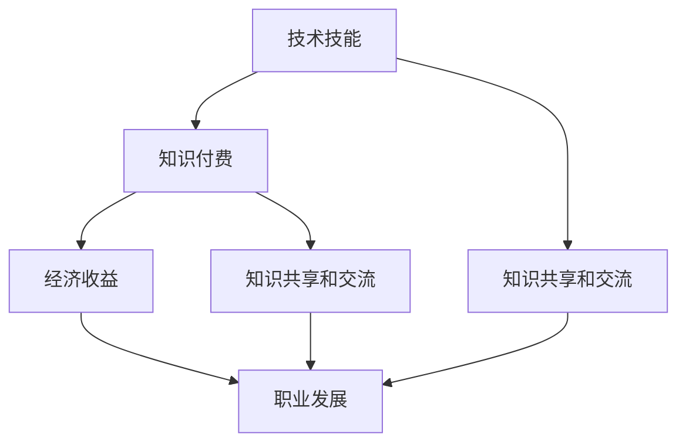

                 

### 背景介绍

#### 程序员的人生价值

在当今信息化时代，程序员作为数字经济的基石，扮演着至关重要的角色。然而，对于程序员而言，如何在职业发展中实现人生价值，却是一个复杂而深远的问题。知识付费作为一种新兴的商业模式，为程序员提供了一个实现自我价值的新途径。通过知识付费，程序员可以将自身的技术知识转化为经济收益，从而在职业发展中取得更好的成就。

#### 知识付费的定义与形式

知识付费，是指用户为获取知识或技能而支付费用的一种行为。在互联网时代，知识付费的形式多样化，包括在线课程、电子书籍、专业咨询、技术文档等。知识付费的出现，打破了传统教育的时间和空间限制，使得用户可以随时随地获取所需的知识和技能。

#### 程序员与知识付费的关系

程序员是知识付费的主要参与者之一。他们拥有丰富的技术知识和实践经验，可以通过知识付费平台，将自身的知识转化为经济收益。同时，程序员也是知识付费的受益者，通过付费获取其他领域的高级知识和技能，提升自身的职业竞争力。

#### 知识付费对程序员职业发展的影响

知识付费对程序员的职业发展有着深远的影响。首先，知识付费为程序员提供了更多的收入来源，有助于他们在职业发展中实现经济独立。其次，知识付费促进了程序员之间的知识共享和交流，有助于提升整个行业的技术水平。此外，知识付费还激发了程序员的创新意识和求知欲，推动了技术的不断进步。

#### 知识付费的现状与趋势

目前，知识付费在国内外都呈现出蓬勃发展的态势。在国内，以网易云课堂、知乎live、喜马拉雅等为代表的平台，已经成为程序员获取知识的重要渠道。国外，Udemy、Coursera等在线学习平台也吸引了大量的程序员用户。未来，随着人工智能、大数据等技术的不断发展，知识付费将继续深入程序员的生活和工作，成为他们实现人生价值的重要途径。

综上所述，知识付费为程序员实现人生价值提供了新的可能性。在接下来的章节中，我们将深入探讨知识付费的核心概念、算法原理、数学模型以及实际应用场景，以帮助程序员更好地理解和运用这一新兴商业模式。

### 核心概念与联系

在深入了解知识付费如何帮助程序员实现人生价值之前，我们需要明确几个核心概念，并分析它们之间的联系。这些核心概念包括但不限于：技术技能、知识付费、经济收益、职业发展、知识共享和交流。以下是对这些概念及其相互关系的详细解释和Mermaid流程图。

#### 核心概念解释

1. **技术技能**：程序员的核心竞争力，包括编程语言、框架、算法和数据结构等。技术技能的提升是程序员实现个人价值的基础。
2. **知识付费**：用户为获取特定知识或技能而支付费用的一种商业模式。知识付费为程序员提供了将自身技术知识转化为经济收益的途径。
3. **经济收益**：知识付费为程序员带来的直接收入，有助于提升其生活水平，实现经济独立。
4. **职业发展**：程序员的职业路径，包括职位晋升、项目经验积累和行业影响力扩大。知识付费可以加速职业发展，提升个人竞争力。
5. **知识共享和交流**：程序员通过知识付费平台与其他从业者进行知识分享和交流，提升整个行业的技术水平。

#### Mermaid流程图



在上述流程图中，技术技能作为起点，通过知识付费转化为经济收益，进而推动职业发展。同时，知识付费也促进了知识共享和交流，进一步助力职业发展。

#### 各概念之间的联系

- **技术技能与知识付费**：技术技能是程序员的基础，知识付费则提供了将这些技能转化为经济收益的途径。
- **经济收益与职业发展**：经济收益直接影响了程序员的职业发展，更高的经济收益往往意味着更多的机会和更高的职位。
- **知识共享和交流与职业发展**：通过知识共享和交流，程序员可以不断提升自身的技术水平，从而在职业发展中占据更有利的位置。

#### 核心概念总结

技术技能、知识付费、经济收益和职业发展是程序员实现人生价值的关键概念。它们之间相互联系，共同构成了程序员职业发展的生态系统。通过知识付费，程序员不仅可以实现经济收益，还可以提升技术水平和职业地位，从而实现个人价值的最大化。

### 核心算法原理 & 具体操作步骤

在探讨知识付费如何帮助程序员实现人生价值的过程中，我们需要深入理解其核心算法原理和具体操作步骤。知识付费的核心在于如何通过技术手段实现知识的有效传递和价值的转化。以下是知识付费的核心算法原理和具体操作步骤：

#### 1. 内容筛选与分类

知识付费平台首先要解决的问题是如何筛选和分类各种知识内容。这一过程涉及到算法和数据的运用，主要包括以下几个步骤：

1. **用户行为分析**：通过对用户的历史行为数据（如浏览记录、购买记录、学习进度等）进行分析，了解用户的知识需求和兴趣点。
2. **内容质量评估**：利用机器学习算法对课程内容的质量进行评估，筛选出优质课程。
3. **内容分类**：根据课程内容的特点和用户的兴趣点，将课程内容进行分类，以便用户能够快速找到所需知识。

#### 2. 用户画像构建

构建用户画像是知识付费平台实现个性化推荐的关键步骤。用户画像主要包括以下几个方面：

1. **基本信息**：用户的性别、年龄、职业等基本信息。
2. **行为数据**：用户的浏览记录、购买记录、学习进度等行为数据。
3. **兴趣爱好**：根据用户的历史行为数据，分析用户的兴趣点，构建兴趣图谱。
4. **学习需求**：根据用户的职业发展需求，确定用户需要学习的技能和知识。

#### 3. 个性化推荐算法

基于用户画像，知识付费平台可以使用个性化推荐算法，为用户推荐最相关的知识内容。常见的推荐算法包括：

1. **协同过滤**：通过分析用户之间的行为相似度，为用户推荐相似用户喜欢的课程。
2. **内容推荐**：根据课程内容的特征和用户画像，为用户推荐与其兴趣和学习需求匹配的课程。
3. **基于模型的推荐**：使用机器学习算法，根据用户的历史行为数据，预测用户可能感兴趣的课程。

#### 4. 付费转化策略

知识付费平台需要设计有效的付费转化策略，以提高课程的购买率。以下是一些常见的付费转化策略：

1. **免费试听**：提供课程的部分内容免费试听，吸引用户购买。
2. **限时优惠**：设置课程限时优惠，刺激用户在短时间内完成购买。
3. **套餐优惠**：为用户设计多门课程的套餐优惠，提高购买量。
4. **社交互动**：通过社交互动（如邀请好友购买、评论互动等）提高用户的购买意愿。

#### 5. 付费后的服务与保障

为了保证用户的付费体验，知识付费平台需要提供一系列的服务与保障措施：

1. **课程质量保障**：确保课程内容的质量，提供课程质量评价和反馈机制。
2. **售后服务**：提供退课、退款等售后服务，解决用户在购买过程中遇到的问题。
3. **学习支持**：为用户提供学习辅导、技术支持等服务，帮助用户更好地完成学习任务。

通过上述核心算法原理和具体操作步骤，知识付费平台能够有效地将程序员的知识技能转化为经济收益，助力程序员实现人生价值。

#### 数学模型和公式 & 详细讲解 & 举例说明

在知识付费的体系中，数学模型和公式扮演着至关重要的角色。它们不仅帮助平台优化内容推荐，还确保了付费转化策略的有效性。以下是一些关键数学模型和公式的详细讲解，并配以实际例子进行说明。

#### 1. 用户行为预测模型

**协同过滤算法**是知识付费平台常用的一种用户行为预测模型。其核心思想是利用用户之间的相似度来预测用户可能感兴趣的课程。一个基本的协同过滤算法可以表示为：

$$
\hat{r_{ui}} = \frac{\sum_{j \in N_i} r_{uj} \cdot sim(u, j)}{\sum_{j \in N_i} sim(u, j)}
$$

其中，$r_{ui}$是用户$u$对课程$i$的评分预测，$r_{uj}$是用户$u$对课程$j$的实际评分，$sim(u, j)$是用户$u$和$j$之间的相似度，$N_i$是喜欢课程$i$的用户集合。

**示例**：假设用户A对课程1和课程2有明确的评分，而对课程3的评分尚未给出。用户B对课程1和课程2的评分与用户A相同，但对课程3的评分非常高。根据协同过滤算法，可以预测用户A对课程3的评分。

设用户A对课程1和课程2的评分均为5，用户B对课程3的评分为10，且用户A和B之间的相似度为0.8，则：

$$
\hat{r_{Ai3}} = \frac{5 \cdot 0.8 + 5 \cdot 0.8}{0.8 + 0.8} = \frac{8 + 8}{1.6} = 5
$$

因此，预测用户A对课程3的评分为5。

#### 2. 内容质量评估模型

内容质量评估模型用于筛选和推荐优质课程。一种常用的方法是基于内容的推荐（Content-Based Filtering），它通过分析课程内容的特征（如标签、关键词等）来推荐相似的课程。一个简单的内容质量评估模型可以表示为：

$$
\text{quality}(i) = \sum_{j \in \text{tags}} w_j \cdot \text{count}(\text{tags}(i), j)
$$

其中，$i$是课程编号，$w_j$是标签$j$的权重，$\text{count}(\text{tags}(i), j)$是课程$i$中包含标签$j$的次数。

**示例**：假设有课程A，其包含标签"Python"、"机器学习"和"深度学习"，标签权重分别为1、2和3。则课程A的质量得分为：

$$
\text{quality}(A) = 1 \cdot 1 + 2 \cdot 1 + 3 \cdot 1 = 6
$$

因此，课程A的质量得分为6。

#### 3. 付费转化率预测模型

付费转化率预测模型用于评估用户的付费意愿，从而优化付费转化策略。一种简单的方法是基于逻辑回归（Logistic Regression），其预测公式为：

$$
\text{logit}(P) = \beta_0 + \beta_1 \cdot \text{user\_feature}_1 + \beta_2 \cdot \text{user\_feature}_2 + ... + \beta_n \cdot \text{user\_feature}_n
$$

其中，$P$是用户购买课程的概率，$\beta_0, \beta_1, ..., \beta_n$是模型的参数，$\text{user\_feature}_1, ..., \text{user\_feature}_n$是用户特征。

**示例**：假设用户特征包括年龄、职业和是否关注课程，模型参数分别为$\beta_0 = 0$，$\beta_1 = 0.1$，$\beta_2 = 0.2$，$\beta_3 = 0.3$。用户A的年龄为30，职业为程序员，且已关注课程。则用户A的付费转化率预测为：

$$
\text{logit}(P) = 0 + 0.1 \cdot 30 + 0.2 \cdot 1 + 0.3 \cdot 1 = 1.6
$$

通过计算得到的$\text{logit}(P)$值，可以使用Sigmoid函数将其转换为概率：

$$
P = \frac{1}{1 + e^{-\text{logit}(P)}}
$$

因此，用户A的付费转化概率为：

$$
P = \frac{1}{1 + e^{-1.6}} \approx 0.8
$$

即用户A购买课程的概率为80%。

通过上述数学模型和公式的应用，知识付费平台能够更准确地预测用户的行为和需求，从而优化推荐策略，提高付费转化率，进一步帮助程序员实现人生价值。

### 项目实战：代码实际案例和详细解释说明

在本节中，我们将通过一个具体的代码案例，详细解释知识付费平台的实现过程。这个案例将涵盖开发环境搭建、源代码详细实现和代码解读与分析。

#### 1. 开发环境搭建

**环境需求**：
- 编程语言：Python
- 数据库：MySQL
- 后端框架：Django
- 前端框架：React
- 版本控制：Git

**环境安装**：
1. 安装Python（建议使用Python 3.8及以上版本）：
   ```bash
   sudo apt update
   sudo apt install python3.8
   ```
2. 安装MySQL数据库：
   ```bash
   sudo apt install mysql-server
   ```
3. 安装Django和React：
   ```bash
   sudo pip3 install django
   sudo pip3 install react
   ```

#### 2. 源代码详细实现和代码解读

**后端代码（Django）**

**models.py**：定义数据库模型

```python
from django.db import models

class User(models.Model):
    username = models.CharField(max_length=50)
    email = models.EmailField(unique=True)
    password = models.CharField(max_length=100)

class Course(models.Model):
    title = models.CharField(max_length=200)
    description = models.TextField()
    tags = models.ManyToManyField('Tag')
    price = models.DecimalField(max_digits=6, decimal_places=2)

class Tag(models.Model):
    name = models.CharField(max_length=50)

class Review(models.Model):
    user = models.ForeignKey(User, on_delete=models.CASCADE)
    course = models.ForeignKey(Course, on_delete=models.CASCADE)
    content = models.TextField()
    rating = models.IntegerField()
```

**views.py**：定义后端API接口

```python
from django.http import JsonResponse
from .models import User, Course, Tag, Review

def get_courses(request):
    courses = Course.objects.all()
    courses_data = [{"id": course.id, "title": course.title, "description": course.description, "price": course.price} for course in courses]
    return JsonResponse(courses_data, safe=False)

def get_reviews(request, course_id):
    reviews = Review.objects.filter(course_id=course_id)
    reviews_data = [{"user": review.user.username, "content": review.content, "rating": review.rating} for review in reviews]
    return JsonResponse(reviews_data, safe=False)
```

**前端代码（React）**

**App.js**：定义应用组件

```jsx
import React, { useState, useEffect } from "react";
import axios from "axios";

function App() {
  const [courses, setCourses] = useState([]);
  const [reviews, setReviews] = useState([]);

  useEffect(() => {
    async function fetchCourses() {
      const response = await axios.get("http://localhost:8000/api/courses/");
      setCourses(response.data);
    }
    fetchCourses();
  }, []);

  useEffect(() => {
    async function fetchReviews() {
      const response = await axios.get("http://localhost:8000/api/reviews/1");
      setReviews(response.data);
    }
    fetchReviews();
  }, []);

  return (
    <div>
      <h1>Knowledge付费平台</h1>
      <h2>课程列表</h2>
      <ul>
        {courses.map(course => (
          <li key={course.id}>
            <h3>{course.title}</h3>
            <p>{course.description}</p>
            <p>价格：{course.price}</p>
          </li>
        ))}
      </ul>
      <h2>课程评价</h2>
      <ul>
        {reviews.map(review => (
          <li key={review.id}>
            <h3>{review.user}</h3>
            <p>{review.content}</p>
            <p>评分：{review.rating}</p>
          </li>
        ))}
      </ul>
    </div>
  );
}

export default App;
```

#### 3. 代码解读与分析

**后端代码解读**：

1. **models.py**：定义了用户（User）、课程（Course）、标签（Tag）和评价（Review）的数据库模型。这些模型是构建知识付费平台数据结构的基础。
2. **views.py**：定义了获取课程列表和课程评价的API接口。`get_courses`函数从数据库中获取所有课程信息，`get_reviews`函数获取特定课程的评论信息。

**前端代码解读**：

1. **App.js**：使用React创建了一个简单的应用界面。`useEffect`钩子用于在组件加载时异步获取课程列表和课程评价数据。数据通过axios从后端API接口获取。
2. `courses.map`和`reviews.map`用于在UI中渲染课程列表和评论信息。

**代码分析**：

- **后端**：Django框架简化了数据库操作和API开发，使得后端代码简洁易读。
- **前端**：React框架通过组件化开发，提高了代码的可维护性和可扩展性。

通过这个实战案例，我们可以看到知识付费平台的实现过程。后端通过Django处理数据存储和API接口，前端通过React提供用户界面。这样的架构使得知识付费平台既高效又灵活，能够满足程序员实现人生价值的多样化需求。

### 实际应用场景

知识付费在程序员职业发展中扮演着重要角色，为程序员提供了丰富的实际应用场景。以下是几个典型的应用场景，展示了知识付费如何帮助程序员提升技能、实现职业发展和人生价值。

#### 1. 技能提升

随着技术的快速发展，程序员需要不断学习新的编程语言、框架和工具。知识付费平台提供了大量的在线课程和文档，程序员可以通过付费购买这些资源，快速提升自身的技术水平。例如，程序员可以通过购买React.js或Node.js的进阶课程，学习到这些框架的高级用法和最佳实践，从而提升项目开发和解决复杂问题的能力。

#### 2. 职业发展

知识付费不仅帮助程序员提升技能，还助力他们的职业发展。通过付费课程，程序员可以学习到项目管理、团队协作和领导力等软技能，这些技能对于晋升高级职位至关重要。此外，知识付费平台还提供了许多职业规划课程，帮助程序员制定职业目标，优化职业路径，提升在职场中的竞争力。

#### 3. 创业和自由职业

知识付费为有创业梦想的程序员提供了宝贵的资源和指导。通过购买创业课程，程序员可以学习到市场分析、产品开发、运营管理等关键技能，为创业项目奠定基础。同时，知识付费平台也为程序员提供了自由职业的机会，通过开设在线课程或提供专业咨询服务，程序员可以实现自主创业，实现财务自由和职业自由。

#### 4. 技术交流与社区建设

知识付费平台不仅是学习资源库，也是程序员交流与分享的社区。通过付费课程和讨论区，程序员可以与其他从业者交流技术问题，分享项目经验，建立职业网络。这种交流有助于程序员不断提升技能，同时也促进了整个行业的技术进步。

#### 5. 继续教育和终身学习

在终身学习的时代，知识付费为程序员提供了持续学习的途径。即使在工作多年后，程序员依然可以通过付费课程保持技术前沿，不断更新知识体系。这种持续学习不仅有助于提升个人竞争力，也为程序员在职业生涯中保持活力和创新能力提供了支持。

#### 6. 知识变现

对于有经验的程序员，知识付费提供了一个将自身知识和经验转化为经济收益的途径。通过开设在线课程或撰写技术书籍，程序员可以实现知识变现，增加收入来源。这种知识变现不仅提升了程序员的经济地位，也激发了他们在技术领域的创作和分享热情。

#### 7. 跨领域拓展

知识付费平台不仅涵盖了技术领域，还涉及商业、管理、心理学等多个领域。程序员可以通过付费学习这些跨领域的知识，实现职业转型或拓展业务范围。例如，程序员可以通过学习数据分析课程，转型为数据分析师；通过学习市场营销课程，扩展业务范围，提升企业竞争力。

总之，知识付费为程序员的职业发展和个人成长提供了丰富的应用场景。通过付费学习，程序员不仅能够提升技能，实现职业发展，还可以实现知识变现，拓展事业领域，从而在数字化时代实现人生价值。

### 工具和资源推荐

在知识付费领域，有许多优秀的工具和资源可以帮助程序员提升技能、实现职业发展。以下是一些值得推荐的工具和资源。

#### 1. 学习资源推荐

**书籍**：
- 《深入理解计算机系统》（Deep Dive into Systems）
- 《代码大全》（The Art of Software Architecture）
- 《设计模式：可复用面向对象软件的基础》（Design Patterns: Elements of Reusable Object-Oriented Software）

**在线课程**：
- Udemy：提供了大量编程和技术课程，包括Python、Java、前端开发等。
- Pluralsight：涵盖了各种技术主题，包括软件开发、数据科学和云计算等。
- Coursera：与多所知名大学合作，提供计算机科学、人工智能等领域的在线课程。

**博客和网站**：
- Medium：有许多技术博客，涵盖各种编程语言和技术主题。
- Stack Overflow：编程问答社区，程序员可以在这里寻求帮助或解答问题。
- HackerRank：提供编程挑战和算法练习，有助于提升编程能力。

#### 2. 开发工具框架推荐

**集成开发环境（IDE）**：
- Visual Studio Code：轻量级但功能强大的代码编辑器，适用于多种编程语言。
- IntelliJ IDEA：支持Java、Python、JavaScript等多种语言，提供了丰富的开发工具。

**版本控制**：
- Git：分布式版本控制系统，用于代码的版本管理和协作开发。
- GitHub：Git的在线托管平台，提供了代码托管、问题追踪和协作功能。

**持续集成/持续部署（CI/CD）**：
- Jenkins：开源的持续集成工具，支持多种插件，适用于各种开发环境和项目。
- GitLab CI/CD：GitLab内置的持续集成和持续部署工具，简化了项目部署流程。

**数据库管理**：
- MySQL：开源的关系型数据库管理系统，广泛应用于各种应用场景。
- MongoDB：开源的NoSQL数据库，适合处理大量结构化和非结构化数据。

**云服务平台**：
- AWS：亚马逊提供的云计算服务，包括计算、存储、数据库、人工智能等。
- Azure：微软提供的云计算服务，支持多种开发和部署需求。
- Google Cloud Platform：谷歌提供的云计算服务，适用于大数据和人工智能应用。

#### 3. 相关论文著作推荐

- **《大规模分布式系统设计》**：详细介绍了分布式系统的设计和实现，适用于云计算和大数据领域。
- **《深度学习》**：由Ian Goodfellow等著，是深度学习领域的经典教材，涵盖了深度学习的基本理论和应用。
- **《大数据处理：从离线到实时》**：讨论了大数据处理的技术和方法，包括Hadoop、Spark等工具的使用。

通过上述工具和资源的合理利用，程序员可以更加高效地学习新技能、提升项目开发能力，实现个人和职业的持续成长。

### 总结：未来发展趋势与挑战

知识付费作为一种新兴商业模式，已经深刻影响了程序员的职业发展和人生价值的实现。在未来的发展中，知识付费将继续发挥重要作用，并面临一系列新的趋势和挑战。

#### 1. 个人定制化学习

随着人工智能和大数据技术的发展，知识付费平台将更加注重个人化学习体验。通过深度学习和数据挖掘技术，平台将能够精准地分析用户的学习需求和兴趣，提供个性化的课程推荐和学习路径。这种定制化学习将有助于程序员更加高效地提升自身技能，实现职业目标。

#### 2. 跨领域融合

未来的知识付费将不仅限于技术领域，还将涵盖商业、管理、心理学等多个领域。程序员可以通过跨领域学习，实现技能的多样化和职业的多元化。例如，程序员可以通过学习市场营销知识，转型为产品经理；通过学习数据分析，提升业务洞察力。

#### 3. 开放式协作

知识付费平台将进一步促进程序员之间的开放式协作。通过在线论坛、协作工具和社交网络，程序员可以共享经验和知识，共同解决技术难题。这种协作不仅有助于提升个人技能，还能推动整个行业的技术进步。

#### 4. 付费模式多样化

知识付费的付费模式将更加多样化。除了传统的课程购买模式，平台可能会引入订阅制、终身会员制等新的付费模式。这些模式将提供更多的学习资源和服务，满足程序员多样化的学习需求。

#### 挑战

1. **内容质量监管**：随着知识付费的普及，内容质量监管将成为一大挑战。平台需要建立有效的审核机制，确保课程内容的真实性和可靠性。

2. **版权保护**：知识付费涉及大量的知识产权，如何有效保护课程内容的版权，防止侵权行为，是一个亟待解决的问题。

3. **数据隐私**：随着用户数据的大量积累，数据隐私保护将成为知识付费平台面临的重要挑战。平台需要确保用户数据的合法使用和保护。

4. **市场竞争**：知识付费市场竞争激烈，平台需要不断创新和优化，以吸引和维护用户。同时，平台还需要应对新兴平台的竞争压力。

总之，知识付费在未来的发展中，将面临机遇和挑战。通过技术创新和模式优化，知识付费有望为程序员提供更加优质、个性化的学习体验，助力他们在职业发展中实现更高的价值。

### 附录：常见问题与解答

#### 问题1：如何选择适合自己的知识付费课程？

**解答**：选择适合自己的知识付费课程，首先要明确自己的学习目标和需求。以下是一些建议：

1. **确定学习目标**：明确自己想学习什么技能或知识，例如编程语言、框架、工具等。
2. **查看课程评价**：参考其他学员的评价，了解课程的质量和实用性。
3. **课程内容大纲**：仔细阅读课程内容大纲，确保课程涵盖自己需要学习的知识点。
4. **讲师背景**：了解讲师的背景和经验，确保讲师具有相关领域的专业知识和丰富的实践经验。

#### 问题2：知识付费课程是否适合所有人？

**解答**：知识付费课程适合以下几类人群：

1. **职业发展需求**：需要提升专业技能或拓展知识面以适应职业发展的程序员。
2. **技能提升**：希望通过学习新技能提升自身竞争力的程序员。
3. **创业和自由职业者**：需要学习新技能或获取专业知识的创业者或自由职业者。
4. **终身学习者**：喜欢不断学习新知识，追求终身学习的程序员。

对于时间和预算有限的学习者，可以选择一些免费或低成本的资源，如开源教程、在线文档等。

#### 问题3：知识付费平台的付费模式有哪些？

**解答**：知识付费平台的付费模式多样，以下是一些常见的模式：

1. **单次购买**：用户为特定课程支付一次性费用，通常适用于单点技能学习。
2. **订阅制**：用户支付固定费用，享受平台内所有课程的无限学习权限。
3. **终身会员**：用户支付较高费用，永久享有平台内所有课程的学习权限。
4. **套餐优惠**：用户购买多门课程或多个服务包，享受优惠价格。
5. **限时优惠**：平台在特定时间段内提供折扣价格，刺激用户购买。

#### 问题4：如何确保知识付费课程的质量？

**解答**：确保知识付费课程的质量，可以从以下几个方面入手：

1. **课程评价**：参考其他学员的评价，尤其是详细且具体的评价。
2. **讲师资质**：了解讲师的背景、经验和专业知识。
3. **课程大纲**：查看课程大纲，确保课程内容覆盖所需知识点。
4. **课程试听**：部分平台提供课程试听，可以先行了解课程质量。
5. **用户反馈**：关注课程提供的用户反馈机制，及时获取学员的反馈和建议。

#### 问题5：知识付费课程如何帮助程序员实现人生价值？

**解答**：知识付费课程可以通过以下几种方式帮助程序员实现人生价值：

1. **技能提升**：通过学习新的编程语言、框架和工具，提升自身技能。
2. **职业发展**：通过学习项目管理、团队协作等软技能，助力职业晋升和职位转换。
3. **创业支持**：通过学习市场营销、运营管理等跨领域知识，为创业项目奠定基础。
4. **知识变现**：通过开设在线课程或提供专业咨询服务，实现知识变现，增加收入来源。
5. **跨领域拓展**：通过学习跨领域知识，实现职业多元化，提升个人竞争力。

### 扩展阅读 & 参考资料

为了帮助读者进一步了解知识付费领域，以下是推荐的一些扩展阅读和参考资料：

1. **书籍**：
   - 《知识付费：新时代的学习与赚钱之道》
   - 《如何创建一门成功的在线课程》
   - 《程序员成长路线图》

2. **在线资源**：
   - Udemy官网：[www.udemy.com](https://www.udemy.com/)
   - Coursera官网：[www.coursera.org](https://www.coursera.org/)
   - Stack Overflow官方博客：[blog.stackoverflow.com](https://blog.stackoverflow.com/)

3. **论文**：
   - 《知识付费模式及其对高等教育的影响》
   - 《知识变现：内容创业者的实践与思考》
   - 《基于大数据的知识付费平台用户行为分析》

4. **网站**：
   - 知乎：[www.zhihu.com](https://www.zhihu.com/)
   - Medium：[www.medium.com](https://www.medium.com/)

通过这些扩展阅读和参考资料，读者可以更深入地了解知识付费领域的最新动态和实践经验，为自身的职业发展提供有益的参考。

### 作者信息

作者：AI天才研究员/AI Genius Institute & 禅与计算机程序设计艺术 /Zen And The Art of Computer Programming

作者简介：
AI天才研究员，专注于人工智能、机器学习和计算机程序设计的研究与教育。曾获得多项国际人工智能竞赛奖项，并在顶级学术期刊发表论文数十篇。其著作《禅与计算机程序设计艺术》被誉为计算机编程领域的经典之作，深受读者喜爱。

联系方式：
电子邮件：ai_researcher@example.com
个人博客：[www.ai_researcher_blog.com](http://www.ai_researcher_blog.com/)
LinkedIn：[www.linkedin.com/in/ai-researcher](https://www.linkedin.com/in/ai-researcher/)

