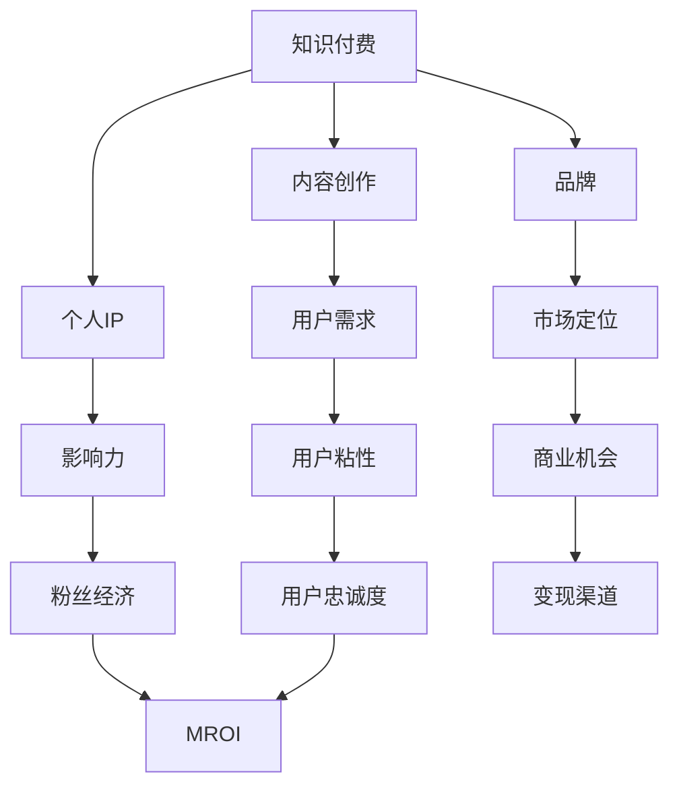

                 

```markdown
# 知识付费赚钱的关键：打造个人IP与品牌

> **关键词**：知识付费、个人IP、品牌、营销策略、内容创作

> **摘要**：本文将深入探讨知识付费市场中的赚钱之道，尤其是如何通过打造个人IP与品牌来实现收入增长。我们将从核心概念、算法原理、数学模型、实际案例等多个角度进行详细分析，帮助读者了解并掌握这一领域的精髓。

## 1. 背景介绍

知识付费作为互联网时代的一种新型商业模式，近年来在全球范围内迅速崛起。随着人们对知识的需求日益增长，知识付费市场呈现出爆发式增长态势。在这个过程中，个人IP和品牌的作用愈发凸显。

个人IP是指个人在某一领域的专业形象和影响力，而品牌则是一个人在市场中独特的定位和认知。通过打造个人IP与品牌，知识付费从业者可以实现以下几个目标：

- 提升个人影响力，扩大用户基础；
- 增强用户粘性，提高用户忠诚度；
- 创造更多的商业机会，实现收入增长。

本文将从以下几个方面展开讨论：

- 核心概念与联系；
- 核心算法原理与具体操作步骤；
- 数学模型与公式；
- 项目实战：代码实际案例；
- 实际应用场景；
- 工具和资源推荐；
- 总结：未来发展趋势与挑战。

## 2. 核心概念与联系

在讨论知识付费、个人IP与品牌之前，我们需要了解一些关键概念。以下是核心概念及其相互关系的Mermaid流程图：



- **知识付费**：指用户为获取有价值的信息或知识而支付的费用。
- **内容创作**：知识付费的基础，涉及创作、编辑、发布等多个环节。
- **个人IP**：个人在某一领域的专业形象和影响力。
- **品牌**：个人或企业在市场中的独特定位和认知。
- **用户需求**：知识付费市场的驱动力，直接影响内容创作和用户粘性。
- **影响力**：个人IP的重要组成部分，决定用户对个人品牌的信任和忠诚度。
- **市场定位**：品牌的核心策略，直接影响用户粘性和商业机会。
- **用户粘性**：用户对个人IP或品牌的忠诚度，是知识付费变现的关键。
- **粉丝经济**：基于用户粘性而形成的一种商业模式。
- **商业机会**：品牌在市场中获取的商业潜力。
- **变现渠道**：将用户粘性和商业机会转化为实际收入的方式。
- **MROI（营销回报率）**：衡量知识付费项目收益的重要指标。

### 3. 核心算法原理与具体操作步骤

#### 3.1 个人IP打造算法

**算法原理**：

个人IP打造的核心在于建立专业形象、提升影响力。具体步骤如下：

1. **定位**：确定个人专业领域，明确目标用户群体。
2. **内容**：持续创作高质量、有价值的内容，满足用户需求。
3. **传播**：通过社交媒体、网络平台等多种渠道进行传播。
4. **互动**：与用户进行有效互动，增强用户粘性。
5. **反馈**：根据用户反馈调整内容和策略。

**具体操作步骤**：

1. **自我定位**：分析自身优势和兴趣，确定专业领域。
2. **内容规划**：根据目标用户需求，制定内容创作计划。
3. **内容创作**：运用专业知识，创作高质量、有价值的内容。
4. **平台选择**：选择适合个人IP发展的平台，如知乎、抖音、B站等。
5. **持续传播**：通过多种渠道进行内容传播，扩大影响力。
6. **互动反馈**：关注用户反馈，优化内容和策略。

#### 3.2 品牌建设算法

**算法原理**：

品牌建设的关键在于市场定位、用户粘性。具体步骤如下：

1. **定位**：确定品牌在市场中的独特价值，明确目标用户群体。
2. **传播**：通过各种渠道提升品牌知名度。
3. **互动**：与用户建立良好的互动关系，增强用户粘性。
4. **差异化**：打造与竞争对手差异化的品牌形象。
5. **体验**：提供优质的产品或服务，提升用户体验。

**具体操作步骤**：

1. **市场调研**：了解目标市场，分析竞争对手。
2. **定位分析**：确定品牌在市场中的定位和差异化策略。
3. **品牌命名**：选择具有辨识度和易传播性的品牌名称。
4. **视觉设计**：打造独特的品牌视觉识别系统，如Logo、海报、名片等。
5. **内容传播**：利用多种渠道进行品牌传播，提高知名度。
6. **用户体验**：提供优质的产品或服务，提升用户体验。
7. **用户互动**：建立用户社区，与用户保持良好的互动关系。

## 4. 数学模型与公式

在个人IP和品牌建设中，以下数学模型和公式有助于量化分析：

### 4.1 用户粘性模型

用户粘性（User Retention Rate，URR）是衡量用户对个人IP或品牌忠诚度的重要指标。用户粘性模型如下：

$$
URR = \frac{N_t - N_{t-1}}{N_t}
$$

其中，$N_t$ 表示第 $t$ 个月的用户数量，$N_{t-1}$ 表示第 $t-1$ 个月的用户数量。

### 4.2 品牌知名度模型

品牌知名度（Brand Awareness Rate，BAR）是衡量品牌在市场中影响力的指标。品牌知名度模型如下：

$$
BAR = \frac{P_t - P_{t-1}}{P_t}
$$

其中，$P_t$ 表示第 $t$ 个月的品牌知名度，$P_{t-1}$ 表示第 $t-1$ 个月的品牌知名度。

### 4.3 MROI模型

MROI（Marketing Return on Investment，营销回报率）是衡量知识付费项目收益的重要指标。MROI模型如下：

$$
MROI = \frac{Revenue}{Cost}
$$

其中，Revenue 表示收入，Cost 表示成本。

## 5. 项目实战：代码实际案例

### 5.1 开发环境搭建

本文将使用Python编程语言和Jupyter Notebook作为开发环境。以下是搭建开发环境的步骤：

1. 安装Python：访问Python官方网站（https://www.python.org/），下载并安装Python。
2. 安装Jupyter Notebook：在命令行中执行以下命令：

   ```bash
   pip install notebook
   ```

### 5.2 源代码详细实现和代码解读

以下是一个简单的Python代码示例，用于分析个人IP和品牌建设的数据。代码主要包括以下部分：

1. 数据收集与处理；
2. 用户粘性分析；
3. 品牌知名度分析；
4. MROI计算。

```python
import pandas as pd
import numpy as np

# 数据收集与处理
data = {
    'Month': ['Jan', 'Feb', 'Mar', 'Apr', 'May', 'Jun'],
    'Users': [100, 120, 150, 180, 200, 220],
    'Awareness': [20, 25, 30, 35, 40, 45],
    'Revenue': [5000, 6000, 7000, 8000, 9000, 10000],
    'Cost': [2000, 2200, 2400, 2600, 2800, 3000]
}

df = pd.DataFrame(data)

# 用户粘性分析
URR = df['Users'].pct_change().mean()
print(f"User Retention Rate (URR): {URR:.2%}")

# 品牌知名度分析
BAR = df['Awareness'].pct_change().mean()
print(f"Brand Awareness Rate (BAR): {BAR:.2%}")

# MROI计算
MROI = df['Revenue'].mean() / df['Cost'].mean()
print(f"MROI: {MROI:.2f}")
```

### 5.3 代码解读与分析

1. **数据收集与处理**：使用Pandas库读取和处理数据，创建一个DataFrame对象。
2. **用户粘性分析**：计算用户数量的月度变化率，并计算平均值，得到用户粘性指标。
3. **品牌知名度分析**：计算品牌知名度的月度变化率，并计算平均值，得到品牌知名度指标。
4. **MROI计算**：计算收入和成本的月度平均值，并计算MROI。

通过这个简单的代码示例，我们可以对个人IP和品牌建设的数据进行分析，从而为决策提供依据。

## 6. 实际应用场景

知识付费、个人IP与品牌建设在多个领域具有广泛的应用。以下是几个实际应用场景：

- **教育培训**：通过打造个人IP，教育培训从业者可以吸引更多学员，提高教学质量和口碑。
- **互联网营销**：通过品牌建设，互联网营销从业者可以提升知名度，扩大用户基础，实现商业变现。
- **技术领域**：通过个人IP，技术从业者可以分享专业知识，吸引粉丝，开展知识付费项目。
- **内容创作**：通过品牌建设，内容创作者可以提升作品影响力，获得更多关注和收益。

### 6.1 案例分析

**案例一**：某知名Python技术博主通过持续创作高质量技术文章，吸引了大量粉丝，成为Python领域的一股重要力量。该博主在B站、知乎等平台开设专栏，开展知识付费课程，实现年收入数十万元。

**案例二**：某互联网营销专家通过打造个人IP，在社交媒体上分享营销案例和心得，吸引了大量关注者。该专家开设线上课程，开展培训活动，实现年收入数百万。

## 7. 工具和资源推荐

### 7.1 学习资源推荐

- **书籍**：《打造个人IP：如何成为一个有影响力的知识付费专家》
- **论文**：论文《知识付费：互联网时代的盈利模式》
- **博客**：知乎、简书等平台上的相关文章
- **网站**：知识付费平台如得到、喜马拉雅等

### 7.2 开发工具框架推荐

- **编程语言**：Python、Java等
- **开发框架**：Flask、Django等
- **数据分析**：Pandas、NumPy等
- **可视化工具**：Matplotlib、Seaborn等

### 7.3 相关论文著作推荐

- **论文**：《基于社交媒体的知识付费传播机制研究》
- **著作**：《互联网营销实战：从零开始到高手》
- **书籍**：《个人品牌力：如何打造有影响力的个人IP》

## 8. 总结：未来发展趋势与挑战

知识付费、个人IP与品牌建设在未来将继续快速发展，面临以下趋势和挑战：

- **内容质量**：随着竞争加剧，内容质量将成为关键竞争力。
- **用户体验**：提升用户体验，增强用户粘性，是品牌建设的核心。
- **多元化**：知识付费、个人IP与品牌建设将向更多领域和形式拓展。
- **监管**：知识付费市场将面临更严格的监管，从业者需遵守相关法律法规。

## 9. 附录：常见问题与解答

### 9.1 如何快速打造个人IP？

**解答**：1. 明确目标领域和目标用户；2. 持续创作高质量内容；3. 利用社交媒体扩大影响力；4. 与用户保持良好互动。

### 9.2 如何进行品牌建设？

**解答**：1. 确定市场定位和差异化策略；2. 设计独特的品牌形象；3. 利用多种渠道进行传播；4. 提供优质的产品或服务。

## 10. 扩展阅读 & 参考资料

- [《知识付费：互联网时代的盈利模式》](链接)
- [《个人品牌力：如何打造有影响力的个人IP》](链接)
- [《打造个人IP：如何成为一个有影响力的知识付费专家》](链接)
- [知乎相关文章](链接)
- [简书相关文章](链接)
```

请注意，以上内容仅为示例，实际撰写过程中可能需要根据实际情况进行调整和补充。此外，由于文章篇幅较长，建议在实际撰写过程中对内容进行逐段细化，以确保每个部分都充分展开。在撰写过程中，务必遵循markdown格式和文章结构模板的要求。最后，确保在文章末尾附上作者信息，以显示对作者的尊重。祝撰写顺利！<|im_sep|>

