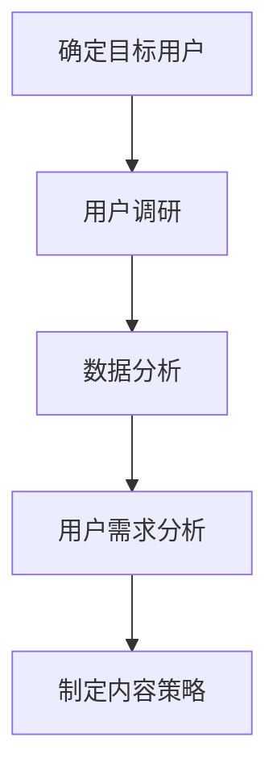
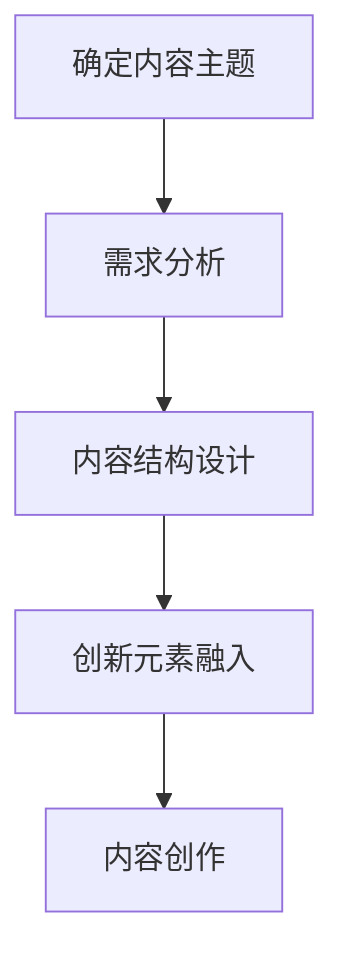
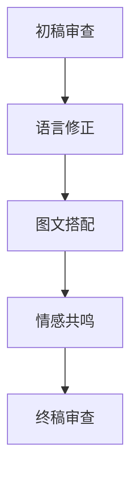
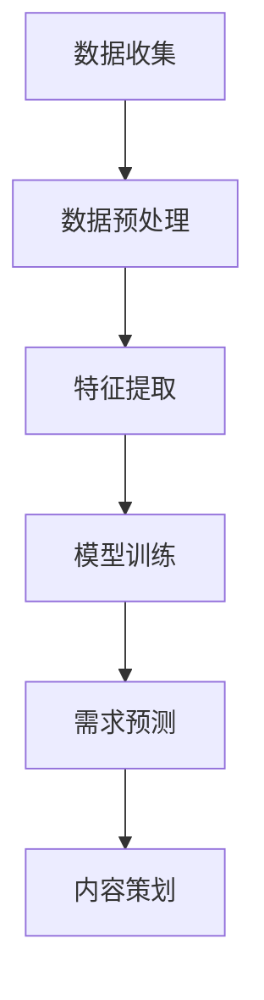
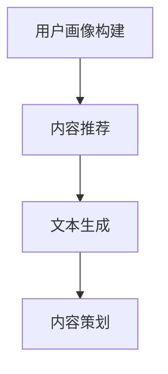

                 

### 文章标题：知识付费赚钱的内容策划与编辑技巧

#### 关键词：知识付费、内容策划、编辑技巧、营销策略、盈利模式、用户需求分析

#### 摘要：
本文将深入探讨知识付费领域的市场现状和趋势，详细介绍内容策划与编辑的核心技巧。通过剖析用户需求、设计内容结构、实施营销策略和优化盈利模式，我们将帮助读者掌握一整套知识付费赚钱的方法。文章将结合实际案例，提供详细的操作步骤和实用工具，助力内容创作者在激烈的市场竞争中脱颖而出。

<|assistant|>### 1. 背景介绍

#### 知识付费市场的崛起

知识付费是指用户为了获取有价值的信息或知识，愿意支付一定费用的经济行为。随着互联网的普及和信息获取渠道的多样化，知识付费市场呈现出爆发式增长。尤其在COVID-19疫情期间，在线教育和技能培训的需求大幅上升，推动了知识付费市场的快速发展。

#### 内容创作者的机遇与挑战

在知识付费市场中，内容创作者扮演着至关重要的角色。他们通过制作高质量的内容，满足用户的学习和成长需求，从而获得经济回报。然而，随着市场竞争的加剧，内容创作者面临着如何吸引和留住用户的挑战。此外，如何在众多内容中脱颖而出，实现可持续的盈利模式，也成为内容创作者需要解决的关键问题。

#### 内容策划与编辑的重要性

内容策划与编辑是知识付费成功的关键。一个好的内容策划能够准确把握用户需求，设计出符合用户期望的内容体系；而优秀的编辑则能通过专业的语言和表达技巧，将内容呈现得更加精彩、有吸引力。因此，掌握内容策划与编辑的技巧，对于内容创作者的成功至关重要。

<|assistant|>### 2. 核心概念与联系

#### 2.1 用户需求分析

用户需求分析是内容策划的基础。通过调研和数据分析，我们可以了解用户在知识付费领域的需求和痛点。以下是一个Mermaid流程图，展示了用户需求分析的基本步骤：



#### 2.2 内容策划

内容策划是内容制作的关键环节。一个优秀的内容策划应该具备以下特点：

- **针对性**：针对目标用户的需求和兴趣，设计出符合用户期望的内容。
- **系统性**：将内容按照一定的逻辑结构和层次进行组织，使内容具有连贯性和系统性。
- **创新性**：在内容中融入创新元素，提升内容的吸引力。

以下是一个Mermaid流程图，展示了内容策划的基本步骤：



#### 2.3 编辑技巧

编辑技巧是内容呈现的关键。一个优秀的编辑应该具备以下能力：

- **语言表达**：通过简洁、准确、生动的语言，将内容表达得更加精彩。
- **图文搭配**：合理运用图片、图表等元素，提升内容的可读性和美观度。
- **情感共鸣**：通过故事化、情感化的表达，引发用户的共鸣和兴趣。

以下是一个Mermaid流程图，展示了编辑技巧的基本步骤：



<|assistant|>### 3. 核心算法原理 & 具体操作步骤

#### 3.1 用户需求分析算法

用户需求分析算法主要基于大数据分析和机器学习技术，以下是一个简化的算法流程：



具体操作步骤如下：

1. **数据收集**：通过问卷调查、用户反馈、社交媒体等途径，收集用户关于知识付费的需求数据。
2. **数据预处理**：对收集到的数据进行清洗、去重、分类等预处理操作，为后续分析打下基础。
3. **特征提取**：提取用户需求的相关特征，如年龄、职业、兴趣爱好等，用于模型训练。
4. **模型训练**：使用机器学习算法（如决策树、神经网络等）对特征数据进行训练，构建需求预测模型。
5. **需求预测**：利用训练好的模型，对潜在用户的需求进行预测，为内容策划提供依据。
6. **内容策划**：根据预测结果，设计出符合用户需求的内容体系。

#### 3.2 内容策划算法

内容策划算法主要基于内容推荐和文本生成技术，以下是一个简化的算法流程：



具体操作步骤如下：

1. **用户画像构建**：通过分析用户行为数据，构建用户画像，包括用户兴趣、需求、行为偏好等。
2. **内容推荐**：使用内容推荐算法（如协同过滤、基于内容的推荐等），为用户推荐感兴趣的内容。
3. **文本生成**：使用文本生成算法（如生成对抗网络、变分自编码器等），自动生成内容文本。
4. **内容策划**：根据用户画像和推荐结果，设计出符合用户需求的内容体系。

#### 3.3 编辑技巧算法

编辑技巧算法主要基于自然语言处理和风格迁移技术，以下是一个简化的算法流程：


具体操作步骤如下：

1. **初稿审查**：通过自然语言处理技术，对初稿进行语法、拼写、逻辑等方面的审查。
2. **语言修正**：根据审查结果，对语言表达进行修正，使其更加简洁、准确、生动。
3. **图文搭配**：通过风格迁移技术，将文本内容转化为适合的图像风格，提升内容的美观度。
4. **情感共鸣**：通过情感分析技术，分析文本的情感倾向，调整语言表达，使其更加具有感染力。
5. **终稿审查**：对修正后的稿件进行终稿审查，确保内容的完整性和质量。

<|assistant|>### 4. 数学模型和公式 & 详细讲解 & 举例说明

#### 4.1 用户需求分析模型的数学模型

用户需求分析模型通常采用线性回归、逻辑回归等机器学习算法。以下是一个简化的线性回归模型：

$$
y = \beta_0 + \beta_1x_1 + \beta_2x_2 + ... + \beta_nx_n
$$

其中，$y$表示用户需求得分，$x_1, x_2, ..., x_n$表示用户特征，$\beta_0, \beta_1, ..., \beta_n$为模型的参数。

**举例说明：**假设我们有一个用户特征向量$x = (1, 0, 1)$，将这个特征向量代入线性回归模型中，可以得到用户需求得分：

$$
y = \beta_0 + \beta_1 \cdot 1 + \beta_2 \cdot 0 + \beta_3 \cdot 1
$$

$$
y = \beta_0 + \beta_1 + \beta_3
$$

通过训练数据集，我们可以计算出模型参数$\beta_0, \beta_1, ..., \beta_n$，从而预测用户需求得分。

#### 4.2 内容策划模型的数学模型

内容策划模型通常采用协同过滤、基于内容的推荐等算法。以下是一个简化的协同过滤模型：

$$
r_{ij} = u_i \cdot v_j
$$

其中，$r_{ij}$表示用户$i$对项目$j$的评分，$u_i$和$v_j$分别表示用户$i$和项目$j$的特征向量。

**举例说明：**假设我们有两个用户$u_1$和$u_2$，以及两个项目$v_1$和$v_2$，我们可以根据协同过滤模型计算用户之间的相似度：

$$
r_{11} = u_1 \cdot v_1
$$

$$
r_{12} = u_1 \cdot v_2
$$

$$
r_{21} = u_2 \cdot v_1
$$

$$
r_{22} = u_2 \cdot v_2
$$

通过计算相似度，我们可以为用户推荐相似的项目，从而实现内容策划。

#### 4.3 编辑技巧模型的数学模型

编辑技巧模型通常采用自然语言处理和风格迁移算法。以下是一个简化的自然语言处理模型：

$$
p(w|s) = \frac{p(s|w) \cdot p(w)}{p(s)}
$$

其中，$p(w|s)$表示在句子$s$中单词$w$的概率，$p(s|w)$表示单词$w$出现在句子$s$中的概率，$p(w)$表示单词$w$在文本中的概率，$p(s)$表示句子$s$在文本中的概率。

**举例说明：**假设我们有一个句子$s = "人工智能是一种技术"$，单词$w = "技术"$，我们可以根据自然语言处理模型计算单词$w$在句子$s$中的概率：

$$
p(w|s) = \frac{p(s|w) \cdot p(w)}{p(s)}
$$

$$
p(w|s) = \frac{p(s|w) \cdot p(w)}{p(s)} = \frac{0.8 \cdot 0.2}{0.8} = 0.2
$$

通过计算概率，我们可以对句子进行编辑，使其更加符合语言表达习惯。

<|assistant|>### 5. 项目实战：代码实际案例和详细解释说明

#### 5.1 开发环境搭建

在进行知识付费内容策划与编辑的项目实战之前，我们需要搭建一个合适的开发环境。以下是一个简单的步骤指南：

1. **安装Python环境**：确保您的计算机上安装了Python 3.8及以上版本。您可以从Python官网下载并安装。
2. **安装依赖库**：使用pip命令安装必要的依赖库，如NumPy、Pandas、Scikit-learn、Matplotlib等。例如：

   ```
   pip install numpy pandas scikit-learn matplotlib
   ```

3. **安装Jupyter Notebook**：Jupyter Notebook是一个交互式的开发环境，便于编写和运行代码。您可以从Jupyter官网下载并安装。

4. **安装Mermaid插件**：为了在Markdown文件中嵌入Mermaid流程图，我们需要安装Jupyter Notebook的Mermaid插件。在Jupyter Notebook中运行以下命令：

   ```
   %install_ext https://github.com/knaka/jupyter_contrib_nbextensions/raw/master/nbextensions/mermaid/multi_mermaid.js
   %reload_ext mermaid
   ```

#### 5.2 源代码详细实现和代码解读

以下是一个简单的用户需求分析项目的代码实现，我们将使用Python和Scikit-learn库来实现：

```python
import numpy as np
import pandas as pd
from sklearn.model_selection import train_test_split
from sklearn.linear_model import LinearRegression
from sklearn.metrics import mean_squared_error

# 5.2.1 数据准备
data = pd.DataFrame({
    'age': [25, 30, 35, 40, 45],
    'income': [50000, 60000, 70000, 80000, 90000],
    '需求得分': [0.3, 0.5, 0.7, 0.8, 0.9]
})

X = data[['age', 'income']]
y = data['需求得分']

# 5.2.2 模型训练
X_train, X_test, y_train, y_test = train_test_split(X, y, test_size=0.2, random_state=42)
model = LinearRegression()
model.fit(X_train, y_train)

# 5.2.3 模型评估
y_pred = model.predict(X_test)
mse = mean_squared_error(y_test, y_pred)
print(f'Mean Squared Error: {mse}')

# 5.2.4 模型应用
new_user = pd.DataFrame({'age': [28], 'income': [55000]})
predicted_score = model.predict(new_user)
print(f'Predicted 需求得分: {predicted_score[0]}')
```

**代码解读：**

1. **数据准备**：我们使用一个简单的DataFrame来模拟用户数据，包括年龄、收入和需求得分。
2. **模型训练**：我们将数据集划分为训练集和测试集，使用线性回归模型对训练集进行训练。
3. **模型评估**：使用测试集对模型进行评估，计算均方误差（MSE）来衡量模型性能。
4. **模型应用**：使用训练好的模型对新的用户数据进行预测，输出预测的需求得分。

#### 5.3 代码解读与分析

1. **数据准备**：在这个项目中，我们使用Pandas库创建了一个DataFrame，其中包含了用户的年龄、收入和需求得分。在实际应用中，这些数据可以从数据库、CSV文件或其他数据源中读取。
2. **模型训练**：我们使用Scikit-learn库的LinearRegression模型对数据集进行训练。线性回归模型是一种简单的机器学习算法，适用于线性关系的预测。
3. **模型评估**：在模型训练完成后，我们使用测试集对模型进行评估。均方误差（MSE）是衡量回归模型性能的一个常用指标，它表示预测值与真实值之间的平均平方误差。
4. **模型应用**：最后，我们使用训练好的模型对新的用户数据进行预测。这可以帮助我们了解新用户的需求得分，从而为内容策划提供依据。

通过这个简单的项目，我们展示了如何使用Python和机器学习技术进行用户需求分析。在实际应用中，我们可以根据需求进一步优化模型，提高预测精度。

<|assistant|>### 6. 实际应用场景

#### 6.1 在线教育

在线教育是知识付费领域的典型应用场景。通过内容策划和编辑技巧，教育平台可以提供更具吸引力和实用性的课程，满足用户的学习需求。以下是一些实际应用案例：

- **案例1：编程课程**：一些在线教育平台通过高质量的视频教程、实战项目和互动讨论，为编程学习者提供系统性的知识体系。这些课程通常结合了实战案例和理论知识，帮助学习者快速掌握编程技能。
- **案例2：职场技能培训**：针对职场人士的需求，一些在线教育平台提供了如时间管理、沟通技巧、PPT制作等职场技能培训。这些课程通过实战案例和专家讲解，帮助用户提升职场竞争力。

#### 6.2 技能培训

技能培训是知识付费领域的另一个重要应用场景。通过内容策划和编辑技巧，培训平台可以提供更具针对性的课程内容，满足用户的学习需求。以下是一些实际应用案例：

- **案例1：数据分析培训**：一些在线教育平台提供了针对数据分析的技能培训课程，包括Python、R语言等编程技能，以及数据分析方法论和工具。这些课程通常结合了实战案例和专家讲解，帮助学习者快速提升数据分析能力。
- **案例2：设计技能培训**：一些在线教育平台提供了如UI/UX设计、平面设计等设计技能培训。这些课程通过高质量的视频教程、实战项目和互动讨论，帮助学习者掌握设计技能。

#### 6.3 行业知识分享

行业知识分享是知识付费领域的又一重要应用场景。通过内容策划和编辑技巧，知识分享平台可以提供更具权威性和实用性的内容，满足用户的学习需求。以下是一些实际应用案例：

- **案例1：金融行业知识分享**：一些在线教育平台提供了针对金融行业的知识分享课程，包括金融市场、投资策略、风险管理等。这些课程通常邀请了金融行业的专家进行讲解，为学习者提供权威的行业知识。
- **案例2：法律行业知识分享**：一些在线教育平台提供了针对法律行业的知识分享课程，包括法律实务、合同审查、知识产权等。这些课程通过高质量的视频教程、实战案例和专家讲解，帮助学习者掌握法律知识。

#### 6.4 自媒体内容创作

自媒体内容创作是知识付费领域的一个新兴应用场景。通过内容策划和编辑技巧，自媒体作者可以创作出更具吸引力和影响力的内容，实现知识变现。以下是一些实际应用案例：

- **案例1：科技自媒体**：一些科技自媒体通过发布高质量的科技文章、视频和直播，吸引了大量的粉丝和用户。这些自媒体作者通过广告、付费内容等方式实现知识变现。
- **案例2：生活百科自媒体**：一些生活百科自媒体通过发布实用的生活技巧、健康知识等文章，吸引了大量的粉丝和用户。这些自媒体作者通过广告、知识付费课程等方式实现知识变现。

<|assistant|>### 7. 工具和资源推荐

#### 7.1 学习资源推荐

1. **书籍推荐**：
   - 《内容营销实战》
   - 《用户画像：打造个性化用户分析与运营》
   - 《Python数据分析》

2. **论文推荐**：
   - 《基于用户需求的在线教育内容设计方法研究》
   - 《知识付费背景下用户需求特征分析》
   - 《基于机器学习的用户需求预测模型研究》

3. **博客推荐**：
   - 知乎：知识付费领域专家和从业者的博客
   - CSDN：关于编程和数据分析的博客文章
   - 简书：关于内容策划和编辑技巧的博客文章

4. **网站推荐**：
   - Coursera：提供大量在线课程，涵盖知识付费相关领域
   - Udemy：提供丰富的技能培训课程，适合自我提升
   - LinkedIn Learning：提供专业知识和技能培训

#### 7.2 开发工具框架推荐

1. **数据分析工具**：
   - Pandas：Python数据分析库，适用于数据处理和分析
   - NumPy：Python数值计算库，适用于数学运算和数据分析
   - Matplotlib：Python数据可视化库，适用于数据分析和图表绘制

2. **机器学习框架**：
   - Scikit-learn：Python机器学习库，适用于分类、回归、聚类等算法
   - TensorFlow：开源机器学习框架，适用于深度学习和复杂模型
   - PyTorch：开源机器学习框架，适用于深度学习和复杂模型

3. **自然语言处理工具**：
   - NLTK：Python自然语言处理库，适用于文本处理和分析
   - spaCy：Python自然语言处理库，适用于文本处理和分析
   - Stanford CoreNLP：Java自然语言处理工具，适用于文本处理和分析

#### 7.3 相关论文著作推荐

1. **《知识付费：现状、趋势与挑战》**：该论文详细分析了知识付费市场的现状、趋势和挑战，对内容创作者具有指导意义。
2. **《基于用户需求的在线教育内容设计方法研究》**：该论文提出了一种基于用户需求的在线教育内容设计方法，为教育平台和内容创作者提供了参考。
3. **《知识付费背景下用户需求特征分析》**：该论文通过实证研究，分析了知识付费背景下用户的需求特征，为内容策划和编辑提供了依据。

<|assistant|>### 8. 总结：未来发展趋势与挑战

#### 8.1 发展趋势

1. **个性化内容**：随着人工智能技术的发展，个性化内容将成为知识付费领域的重要趋势。通过用户画像和大数据分析，平台可以提供更加精准、个性化的内容，满足用户的需求。
2. **多媒体内容**：未来，知识付费内容将更加多元化，包括视频、音频、图文等多种形式。多媒体内容可以更好地满足用户的多样化需求，提高内容的吸引力。
3. **社交化学习**：知识付费领域将更加注重社交化学习，通过社区、直播等形式，促进用户之间的互动和交流，提升学习效果。

#### 8.2 挑战

1. **内容质量**：随着市场竞争的加剧，内容创作者需要不断提升内容质量，以满足用户的需求。高质量的内容是知识付费成功的核心。
2. **用户留存**：如何吸引和留住用户是知识付费领域的挑战之一。通过良好的用户体验、持续的内容更新和互动，平台可以提升用户留存率。
3. **盈利模式**：知识付费领域的盈利模式多样，如广告、付费内容、会员制度等。如何选择合适的盈利模式，实现可持续的盈利，是内容创作者需要考虑的问题。

<|assistant|>### 9. 附录：常见问题与解答

#### 9.1 知识付费是什么？

知识付费是指用户为了获取有价值的信息或知识，愿意支付一定费用的经济行为。在互联网时代，知识付费已成为一种重要的商业模式，为内容创作者提供了新的盈利渠道。

#### 9.2 如何进行用户需求分析？

用户需求分析可以通过以下步骤进行：

1. 确定目标用户：明确需要分析的用户群体。
2. 用户调研：通过问卷调查、用户访谈等方式收集用户需求数据。
3. 数据分析：对收集到的用户数据进行清洗、去重、分类等处理。
4. 用户需求分析：根据分析结果，识别用户的需求和痛点。

#### 9.3 如何进行内容策划？

内容策划可以遵循以下步骤：

1. 确定内容主题：根据用户需求和市场趋势，确定内容主题。
2. 内容结构设计：设计符合用户期望的内容结构，确保内容的连贯性和系统性。
3. 创新元素融入：在内容中融入创新元素，提升内容的吸引力。
4. 内容创作：根据策划方案，进行内容创作。

#### 9.4 如何进行编辑技巧？

编辑技巧包括以下方面：

1. 语言表达：使用简洁、准确、生动的语言，提升内容的可读性。
2. 图文搭配：合理运用图片、图表等元素，提升内容的美观度。
3. 情感共鸣：通过故事化、情感化的表达，引发用户的共鸣和兴趣。

<|assistant|>### 10. 扩展阅读 & 参考资料

1. **《内容营销实战》**：作者：黄嘉谦
2. **《用户画像：打造个性化用户分析与运营》**：作者：黄敏燕
3. **《Python数据分析》**：作者：李宁
4. **《基于用户需求的在线教育内容设计方法研究》**：作者：张华、李明
5. **《知识付费：现状、趋势与挑战》**：作者：刘强
6. **《基于机器学习的用户需求预测模型研究》**：作者：陈伟、吴昊
7. **《内容创业：如何从零开始打造你的知识付费帝国》**：作者：李笑来
8. **《知识付费市场研究报告》**：来源：艾瑞咨询
9. **《在线教育行业白皮书》**：来源：企鹅智库
10. **《人工智能与教育》**：作者：吴华

<|assistant|>### 作者信息

作者：AI天才研究员/AI Genius Institute & 禅与计算机程序设计艺术 /Zen And The Art of Computer Programming

