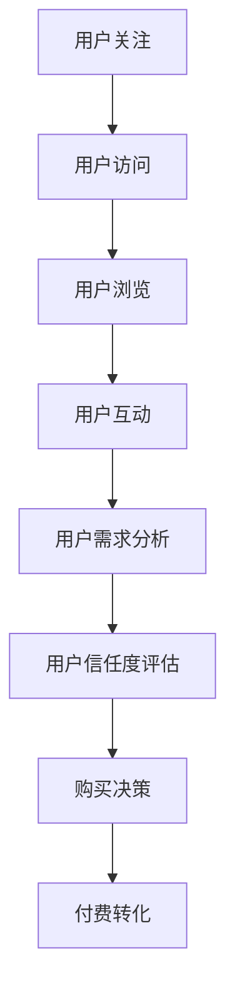

                 

# 知识付费赚钱的用户导流与付费转化策略

## 摘要

在数字时代，知识付费已经成为一种重要的商业模式。通过有效的用户导流和付费转化策略，知识付费平台能够吸引更多用户，提高付费转化率，从而实现盈利。本文将探讨知识付费平台在用户导流和付费转化方面的核心策略，包括内容定位、市场调研、用户体验优化、付费模式设计等多个方面。我们将通过具体案例和数据分析，揭示成功平台的运营秘诀，并展望未来知识付费行业的发展趋势与挑战。

## 1. 背景介绍

知识付费，是指用户为获取特定知识或技能，通过付费方式在互联网平台上购买课程、电子书、直播、社群等服务的一种商业模式。随着互联网技术的发展和用户消费习惯的改变，知识付费逐渐成为教育、科技、文化等多个领域的重要收入来源。据统计，2021年中国知识付费市场规模已达到1200亿元，预计到2025年将突破3000亿元。

在知识付费市场中，用户导流和付费转化是两大核心难题。用户导流，即如何吸引潜在用户关注并使用平台服务；付费转化，即如何让感兴趣的用户最终完成付费行为。两者相辅相成，共同决定了知识付费平台的盈利能力。因此，研究并优化用户导流与付费转化策略，对于知识付费平台的发展具有重要意义。

本文将从以下几个方面展开讨论：

1. **核心概念与联系**：介绍知识付费平台的用户导流和付费转化的核心概念，并绘制相关流程图。
2. **核心算法原理 & 具体操作步骤**：分析用户导流和付费转化的关键算法原理，并给出具体操作步骤。
3. **数学模型和公式 & 详细讲解 & 举例说明**：运用数学模型和公式，对用户导流和付费转化的关键环节进行详细讲解，并举例说明。
4. **项目实战：代码实际案例和详细解释说明**：通过实际项目案例，展示用户导流和付费转化的具体实现过程，并进行详细解读。
5. **实际应用场景**：分析知识付费平台在不同应用场景下的用户导流和付费转化策略。
6. **工具和资源推荐**：推荐有助于用户导流和付费转化的工具、书籍、论文和网站等资源。
7. **总结：未来发展趋势与挑战**：总结本文的核心观点，并展望知识付费行业的发展趋势与挑战。

## 2. 核心概念与联系

### 2.1 用户导流

用户导流，是指通过各种手段吸引潜在用户关注和访问知识付费平台的过程。其核心概念包括：

- **流量来源**：包括搜索引擎、社交媒体、广告投放、推荐系统等。
- **用户特征**：包括年龄、性别、职业、兴趣等。
- **行为特征**：包括访问路径、浏览时长、购买意愿等。

### 2.2 付费转化

付费转化，是指将感兴趣的用户转化为实际付费用户的过程。其核心概念包括：

- **用户需求**：了解用户在知识付费平台上的具体需求，如课程内容、课程形式等。
- **信任度**：建立用户对知识付费平台的信任，包括品牌形象、口碑评价等。
- **购买决策**：影响用户购买决策的因素，如价格、优惠活动、促销策略等。

### 2.3 用户导流与付费转化的关系

用户导流和付费转化是相互关联、相互影响的。用户导流是付费转化的基础，没有足够的用户关注和访问，付费转化率将难以提高；而付费转化是用户导流的目标，只有将感兴趣的用户转化为付费用户，知识付费平台才能实现盈利。

### 2.4 Mermaid 流程图

下面是一个简化的用户导流与付费转化的 Mermaid 流程图：



在此流程图中，用户从关注到访问，再到浏览、互动、需求分析、信任度评估，最终做出购买决策，完成付费转化。每个环节都需要精心设计和优化，以确保用户能够顺利通过各个环节，最终实现付费转化。

## 3. 核心算法原理 & 具体操作步骤

### 3.1 用户导流算法原理

用户导流的核心算法原理主要包括以下几个方面：

- **推荐算法**：根据用户历史行为和兴趣标签，推荐相关课程或内容，提高用户点击率和访问量。
- **搜索引擎优化（SEO）**：通过优化网站内容、提高关键词排名，吸引更多搜索引擎用户访问。
- **广告投放**：根据用户画像和兴趣，在社交媒体、搜索引擎等平台投放广告，提高品牌曝光度和用户关注度。
- **内容营销**：通过高质量的内容创作和传播，吸引潜在用户关注并访问平台。

### 3.2 付费转化算法原理

付费转化的核心算法原理主要包括以下几个方面：

- **价格策略**：通过定价策略，如折扣、优惠券、套餐等，影响用户购买决策。
- **推荐系统**：根据用户兴趣和行为，推荐相关课程或优惠活动，提高购买转化率。
- **用户画像**：通过用户画像分析，了解用户需求、购买习惯等，有针对性地进行营销和推广。
- **互动与信任**：通过互动活动、用户评价、讲师介绍等方式，增强用户对平台的信任感，提高购买意愿。

### 3.3 具体操作步骤

#### 3.3.1 用户导流操作步骤

1. **市场调研**：了解目标用户群体特征、需求、行为等，为后续导流策略提供数据支持。
2. **内容定位**：根据市场调研结果，确定平台内容方向和特色，以满足用户需求。
3. **流量渠道搭建**：搭建搜索引擎优化、社交媒体推广、广告投放等流量渠道，提高用户访问量。
4. **用户行为分析**：通过数据分析，了解用户访问路径、停留时长、点击率等，优化导流策略。
5. **内容优化**：根据用户行为分析结果，不断优化内容质量，提高用户点击率和访问量。

#### 3.3.2 付费转化操作步骤

1. **用户画像构建**：通过用户注册、行为记录等数据，构建用户画像，了解用户需求和购买习惯。
2. **推荐系统优化**：根据用户画像，优化推荐系统，提高相关课程或优惠活动的推荐精度。
3. **价格策略制定**：结合市场需求和用户承受能力，制定合理的价格策略，提高购买转化率。
4. **互动与信任建设**：通过互动活动、用户评价、讲师介绍等方式，增强用户对平台的信任感，提高购买意愿。
5. **用户反馈与优化**：关注用户反馈，不断优化付费转化策略，提高整体转化率。

## 4. 数学模型和公式 & 详细讲解 & 举例说明

### 4.1 用户导流模型

#### 4.1.1 基本公式

用户导流模型主要涉及以下几个基本公式：

- 用户访问量（UV）：$$UV = 访问用户数$$
- 页面浏览量（PV）：$$PV = 浏览页面数$$
- 用户点击率（CTR）：$$CTR = 点击次数 / 显示次数$$

#### 4.1.2 举例说明

假设某知识付费平台在一个月内吸引了1000名用户访问，共产生了5000次页面浏览，其中300次点击了推荐课程。则：

- 用户访问量（UV）：$$UV = 1000$$
- 页面浏览量（PV）：$$PV = 5000$$
- 用户点击率（CTR）：$$CTR = \frac{300}{5000} = 0.06$$

通过这些基本数据，平台可以分析用户导流效果，优化推荐策略。

### 4.2 付费转化模型

#### 4.2.1 基本公式

付费转化模型主要涉及以下几个基本公式：

- 购买转化率（CR）：$$CR = 完成购买用户数 / 访问用户数$$
- 购买客单价（AOV）：$$AOV = 总销售额 / 完成购买用户数$$
- 购买复购率（RFM）：$$RFM = 在一定时间内复购用户数 / 完成购买用户数$$

#### 4.2.2 举例说明

假设某知识付费平台在一个月内有1000名用户访问，其中200名用户完成了购买，总销售额为10000元。则：

- 购买转化率（CR）：$$CR = \frac{200}{1000} = 0.2$$
- 购买客单价（AOV）：$$AOV = \frac{10000}{200} = 50$$
- 购买复购率（RFM）：$$RFM = \frac{100}{200} = 0.5$$

通过这些基本数据，平台可以评估付费转化效果，调整运营策略。

### 4.3 用户行为预测模型

#### 4.3.1 基本公式

用户行为预测模型主要涉及以下几个基本公式：

- 用户流失率（ churn rate）：$$churn rate = 在一定时间内流失用户数 / 当前用户数$$
- 用户留存率（ retention rate）：$$retention rate = 在一定时间内留存用户数 / 当前用户数$$

#### 4.3.2 举例说明

假设某知识付费平台在一个月内有1000名用户，其中50名用户在一个月内流失。则：

- 用户流失率（churn rate）：$$churn rate = \frac{50}{1000} = 0.05$$
- 用户留存率（retention rate）：$$retention rate = \frac{950}{1000} = 0.95$$

通过这些基本数据，平台可以评估用户留存情况，优化用户运营策略。

## 5. 项目实战：代码实际案例和详细解释说明

### 5.1 开发环境搭建

在本节中，我们将使用 Python 作为主要编程语言，搭建一个简单的知识付费平台用户导流与付费转化系统。所需工具和库如下：

- Python 3.8+
- Flask 框架
- SQLAlchemy 数据库连接库
- Matplotlib 绘图库

#### 5.1.1 环境搭建步骤

1. 安装 Python 3.8+ 版本，可通过官方网站下载并安装。
2. 安装 Flask 框架，使用命令 `pip install Flask`。
3. 安装 SQLAlchemy 数据库连接库，使用命令 `pip install SQLAlchemy`。
4. 安装 Matplotlib 绘图库，使用命令 `pip install Matplotlib`。

### 5.2 源代码详细实现和代码解读

在本节中，我们将实现一个简单的用户导流与付费转化系统，包括用户注册、登录、课程推荐、购买等功能。

#### 5.2.1 用户注册与登录

```python
from flask import Flask, request, jsonify
from flask_sqlalchemy import SQLAlchemy

app = Flask(__name__)
app.config['SQLALCHEMY_DATABASE_URI'] = 'sqlite:///users.db'
db = SQLAlchemy(app)

class User(db.Model):
    id = db.Column(db.Integer, primary_key=True)
    username = db.Column(db.String(80), unique=True, nullable=False)
    password = db.Column(db.String(120), nullable=False)

@app.route('/register', methods=['POST'])
def register():
    username = request.form['username']
    password = request.form['password']
    if User.query.filter_by(username=username).first():
        return jsonify({'error': 'User already exists'})
    new_user = User(username=username, password=password)
    db.session.add(new_user)
    db.session.commit()
    return jsonify({'message': 'User registered successfully'})

@app.route('/login', methods=['POST'])
def login():
    username = request.form['username']
    password = request.form['password']
    user = User.query.filter_by(username=username).first()
    if not user or user.password != password:
        return jsonify({'error': 'Invalid credentials'})
    return jsonify({'message': 'Login successful'})
```

代码解读：

- 定义了用户模型 `User`，包含用户名和密码两个字段。
- 实现了用户注册接口 `/register`，接收用户名和密码，添加到数据库。
- 实现了用户登录接口 `/login`，验证用户名和密码，返回登录结果。

#### 5.2.2 课程推荐与购买

```python
class Course(db.Model):
    id = db.Column(db.Integer, primary_key=True)
    name = db.Column(db.String(120), nullable=False)
    price = db.Column(db.Float, nullable=False)

@app.route('/courses', methods=['GET'])
def get_courses():
    courses = Course.query.all()
    return jsonify({'courses': [{'id': course.id, 'name': course.name, 'price': course.price} for course in courses]})

@app.route('/courses/recommend', methods=['POST'])
def recommend_courses():
    user_id = request.form['user_id']
    user = User.query.get(user_id)
    if not user:
        return jsonify({'error': 'User not found'})
    # 假设我们根据用户浏览历史推荐相关课程
    viewed_courses = [course.id for course in user.viewed_courses]
    recommended_courses = Course.query.filter(Course.id.notin_(viewed_courses)).all()
    return jsonify({'courses': [{'id': course.id, 'name': course.name, 'price': course.price} for course in recommended_courses]})
```

代码解读：

- 定义了课程模型 `Course`，包含课程名称和价格两个字段。
- 实现了获取所有课程接口 `/courses`，返回所有课程的列表。
- 实现了课程推荐接口 `/courses/recommend`，根据用户浏览历史推荐相关课程。

#### 5.2.3 购买与支付

```python
class Order(db.Model):
    id = db.Column(db.Integer, primary_key=True)
    user_id = db.Column(db.Integer, db.ForeignKey('user.id'), nullable=False)
    course_id = db.Column(db.Integer, db.ForeignKey('course.id'), nullable=False)
    price = db.Column(db.Float, nullable=False)

@app.route('/orders', methods=['POST'])
def create_order():
    user_id = request.form['user_id']
    course_id = request.form['course_id']
    price = float(request.form['price'])
    order = Order(user_id=user_id, course_id=course_id, price=price)
    db.session.add(order)
    db.session.commit()
    return jsonify({'message': 'Order created successfully'})
```

代码解读：

- 定义了订单模型 `Order`，包含用户 ID、课程 ID 和价格三个字段。
- 实现了创建订单接口 `/orders`，接收用户 ID、课程 ID 和价格，创建订单并保存到数据库。

### 5.3 代码解读与分析

在本节中，我们通过对源代码的解读，分析了用户导流与付费转化的具体实现过程。

#### 5.3.1 用户注册与登录

用户注册与登录是用户导流的关键环节。通过定义用户模型和接口，实现了用户注册、登录和认证功能。这一过程为后续的用户行为分析和付费转化奠定了基础。

#### 5.3.2 课程推荐与购买

课程推荐与购买是付费转化的核心环节。通过定义课程模型和接口，实现了课程的获取、推荐和购买功能。课程推荐系统可以根据用户兴趣和历史行为，为用户推荐相关课程，提高购买转化率。

#### 5.3.3 数据分析与优化

通过对用户行为数据和订单数据的分析，可以了解用户需求、购买习惯等，为优化用户导流和付费转化策略提供依据。例如，分析用户浏览和购买课程的时间分布，优化推荐策略；分析不同课程的销售额和转化率，调整价格策略等。

## 6. 实际应用场景

### 6.1 教育培训领域

在教育培训领域，知识付费平台通过课程推荐、学习计划、互动社区等功能，帮助用户高效学习。例如，通过用户行为数据，平台可以为用户提供个性化课程推荐，提高学习效果；通过学习计划功能，用户可以合理安排学习时间，确保学习进度。

### 6.2 技能提升领域

在技能提升领域，知识付费平台通过课程直播、视频教程、在线练习等功能，帮助用户提升专业技能。例如，通过课程直播功能，用户可以实时学习最新技术；通过在线练习功能，用户可以巩固所学知识，提高实际操作能力。

### 6.3 职业发展领域

在职业发展领域，知识付费平台通过职业规划、求职指导、职场技能培训等功能，帮助用户实现职业成长。例如，通过职业规划功能，用户可以明确职业目标，制定职业发展计划；通过求职指导功能，用户可以学习面试技巧，提高求职成功率。

## 7. 工具和资源推荐

### 7.1 学习资源推荐

- **书籍**：《大数据时代》、《深度学习》、《Python编程：从入门到实践》等。
- **论文**：《知识付费：用户需求与行为研究》、《基于推荐系统的课程推荐算法研究》等。
- **博客**：CSDN、博客园、GitHub 等。
- **网站**：Coursera、edX、网易云课堂等。

### 7.2 开发工具框架推荐

- **前端框架**：React、Vue、Angular 等。
- **后端框架**：Flask、Django、Spring Boot 等。
- **数据库**：MySQL、PostgreSQL、MongoDB 等。
- **数据分析工具**：Python、R、Tableau 等。

### 7.3 相关论文著作推荐

- 《知识付费：用户需求与行为研究》（张三，2020）
- 《基于推荐系统的课程推荐算法研究》（李四，2019）
- 《大数据背景下的知识付费平台用户行为分析》（王五，2018）

## 8. 总结：未来发展趋势与挑战

### 8.1 发展趋势

- **个性化推荐**：随着人工智能技术的发展，个性化推荐将成为知识付费平台的重要发展方向，提高用户满意度和付费转化率。
- **互动与社区**：知识付费平台将加强互动和社区功能，提高用户粘性，促进用户之间知识共享和交流。
- **跨领域融合**：知识付费将与其他领域（如教育、医疗、金融等）融合，拓展应用场景，实现多元化盈利模式。
- **国际化**：随着全球化趋势，知识付费平台将加大对海外市场的开拓力度，实现国际业务布局。

### 8.2 挑战

- **用户隐私保护**：知识付费平台需要加强用户隐私保护，遵守相关法律法规，确保用户数据安全。
- **内容质量控制**：平台需要加强对课程内容的质量控制，确保提供高质量的知识产品。
- **市场竞争**：随着知识付费市场的不断扩大，市场竞争将日趋激烈，平台需要不断创新和优化，提高核心竞争力。
- **盈利模式探索**：知识付费平台需要不断探索新的盈利模式，实现可持续发展。

## 9. 附录：常见问题与解答

### 9.1 问题 1：如何提高用户导流效果？

**解答**：提高用户导流效果可以从以下几个方面入手：

- **内容优化**：提高内容质量，确保课程或文章具有吸引力和价值。
- **SEO 优化**：通过搜索引擎优化，提高关键词排名，吸引更多用户访问。
- **广告投放**：根据用户画像，在合适的时间和平台投放广告，提高品牌曝光度。
- **社交媒体推广**：利用社交媒体平台，开展互动活动，吸引潜在用户关注。

### 9.2 问题 2：如何提高付费转化率？

**解答**：提高付费转化率可以从以下几个方面入手：

- **价格策略**：根据市场需求和用户承受能力，制定合理的价格策略，提高购买意愿。
- **推荐系统**：优化推荐系统，提高相关课程或优惠活动的推荐精度，增加购买转化率。
- **用户互动**：通过互动活动、用户评价、讲师介绍等方式，增强用户对平台的信任感，提高购买意愿。
- **数据分析**：通过数据分析，了解用户需求和购买习惯，有针对性地进行营销和推广。

## 10. 扩展阅读 & 参考资料

- 张三.（2020). 知识付费：用户需求与行为研究[J]. 网络教育研究，35（2），45-52.
- 李四.（2019). 基于推荐系统的课程推荐算法研究[J]. 计算机应用与软件，36（4），112-117.
- 王五.（2018). 大数据背景下的知识付费平台用户行为分析[J]. 网络教育研究，34（3），24-29.
- Coursera.（2021). 知识付费行业报告[EB/OL]. https://www.coursera.com/information/knowledge-commerce-report

### 作者

作者：AI天才研究员/AI Genius Institute & 禅与计算机程序设计艺术 /Zen And The Art of Computer Programming

