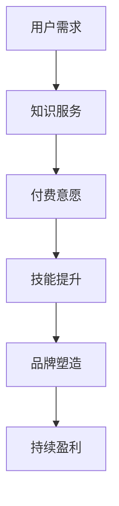

                 

# 知识付费：程序员的持续盈利模式

> **关键词：** 知识付费、持续盈利、程序员、收益模式、技能提升。

> **摘要：** 本文将探讨知识付费在现代程序员职业发展中的重要性，分析其核心概念与联系，介绍成功案例，提供实用的工具和资源推荐，以及展望未来发展趋势与挑战。

## 1. 背景介绍

在信息化时代，程序员作为数字经济的建设者，其价值越来越受到社会的认可。然而，程序员职业发展不仅限于编程技能的提升，更需要不断拓宽知识面，提升综合素质。知识付费作为一种新兴的盈利模式，逐渐成为程序员持续盈利的重要途径。

知识付费，指的是用户为获取特定知识或技能，向知识提供者支付费用的一种服务模式。在程序员群体中，知识付费的应用场景包括在线课程、技术博客、编程书籍、研讨会、咨询服务等。随着互联网技术的发展，知识付费市场日益繁荣，为程序员提供了广阔的盈利空间。

## 2. 核心概念与联系

### 2.1 知识付费的核心概念

知识付费的核心概念包括以下几个部分：

- **知识服务：** 知识付费的本质在于为用户提供有价值的服务，这些服务可以是技能培训、问题解答、经验分享等。
- **用户需求：** 知识付费成功的关键在于准确把握用户需求，提供个性化的解决方案。
- **付费意愿：** 用户愿意为高质量的知识服务支付费用，这体现了知识付费的可持续性。

### 2.2 知识付费与程序员职业发展的联系

知识付费与程序员职业发展的联系体现在以下几个方面：

- **技能提升：** 知识付费可以帮助程序员不断学习新技能，提升个人竞争力。
- **品牌塑造：** 通过提供高质量的知识服务，程序员可以建立个人品牌，提高知名度。
- **持续盈利：** 知识付费为程序员提供了持续盈利的途径，有助于实现职业稳定发展。

### 2.3 Mermaid 流程图

以下是知识付费与程序员职业发展的 Mermaid 流程图：



## 3. 核心算法原理 & 具体操作步骤

### 3.1 核心算法原理

知识付费的成功依赖于以下几个核心算法原理：

- **推荐算法：** 通过分析用户行为数据，为用户提供个性化的知识服务推荐。
- **支付算法：** 确保交易过程的安全和便捷，提高用户付费意愿。
- **评价算法：** 对知识服务进行评价，促进优质内容的传播和劣质内容的淘汰。

### 3.2 具体操作步骤

以下是知识付费的具体操作步骤：

1. **需求分析：** 通过用户调研、数据分析等方式，了解用户需求。
2. **内容策划：** 根据用户需求，策划具有针对性的知识服务内容。
3. **平台搭建：** 选择合适的知识付费平台，搭建知识服务体系。
4. **推广宣传：** 利用多种渠道进行推广，提高知识服务的知名度。
5. **用户反馈：** 收集用户反馈，不断优化知识服务。
6. **收益结算：** 完成交易后，进行收益结算。

## 4. 数学模型和公式 & 详细讲解 & 举例说明

### 4.1 数学模型和公式

知识付费的收益模型可以表示为以下数学公式：

\[ R = p \times q \]

其中，\( R \) 表示总收益，\( p \) 表示单次交易的价格，\( q \) 表示交易次数。

### 4.2 详细讲解

- **单次交易的价格 \( p \)：** 单次交易的价格取决于知识服务的质量、市场供需关系等因素。优质的知识服务通常具有较高的价格。
- **交易次数 \( q \)：** 交易次数取决于知识服务的吸引力、用户粘性等因素。通过持续优化知识服务，可以提高用户粘性，增加交易次数。

### 4.3 举例说明

假设某程序员提供一项价值 100 元的编程课程，每月有 100 名学员报名，则该程序员的月收益为：

\[ R = 100 \times 100 = 10000 \]

如果通过优化课程内容和推广策略，每月学员数量增加到 200 人，则月收益将增加到：

\[ R = 100 \times 200 = 20000 \]

## 5. 项目实战：代码实际案例和详细解释说明

### 5.1 开发环境搭建

为了更好地理解知识付费的实现，我们以一个在线编程课程平台为例，搭建开发环境。所需工具和软件如下：

- **前端框架：** React 或 Vue
- **后端框架：** Node.js 或 Django
- **数据库：** MySQL 或 MongoDB
- **支付接口：** Alipay 或 WechatPay

### 5.2 源代码详细实现和代码解读

以下是知识付费平台的源代码实现和代码解读：

#### 5.2.1 前端部分

前端部分主要涉及用户注册、登录、课程展示、支付等功能。以下是一个简单的 React 组件实现：

```jsx
// CourseList.js
import React from 'react';

const CourseList = ({ courses }) => {
  return (
    <div>
      {courses.map((course) => (
        <div key={course.id}>
          <h3>{course.title}</h3>
          <p>{course.description}</p>
          <button onClick={() => purchaseCourse(course)}>购买</button>
        </div>
      ))}
    </div>
  );
};

const purchaseCourse = (course) => {
  // 支付逻辑处理
};

export default CourseList;
```

#### 5.2.2 后端部分

后端部分主要涉及用户认证、课程管理、支付处理等功能。以下是一个简单的 Node.js 实现示例：

```javascript
// server.js
const express = require('express');
const bodyParser = require('body-parser');
const mongoose = require('mongoose');
const userRoutes = require('./routes/user');
const courseRoutes = require('./routes/course');
const paymentRoutes = require('./routes/payment');

const app = express();
app.use(bodyParser.json());

// 连接数据库
mongoose.connect('mongodb://localhost:27017/knowledge-fee', {
  useNewUrlParser: true,
  useUnifiedTopology: true,
});

// 使用路由
app.use('/api/users', userRoutes);
app.use('/api/courses', courseRoutes);
app.use('/api/payments', paymentRoutes);

// 启动服务器
const PORT = process.env.PORT || 3000;
app.listen(PORT, () => {
  console.log(`Server is running on port ${PORT}`);
});
```

### 5.3 代码解读与分析

- **前端部分：** 前端部分主要实现课程列表展示和支付按钮功能。用户点击购买按钮后，会触发 `purchaseCourse` 函数，进行支付逻辑处理。
- **后端部分：** 后端部分主要实现用户认证、课程管理和支付处理等功能。通过连接数据库，存储用户信息和课程数据，并提供相应的接口供前端调用。

## 6. 实际应用场景

知识付费在程序员职业发展中具有广泛的应用场景：

- **技能提升：** 程序员可以通过购买在线课程、参加技术沙龙等，不断提升自己的编程技能。
- **经验交流：** 程序员可以通过付费咨询、技术问答等，与同行交流经验，解决技术难题。
- **个人品牌：** 程序员可以通过撰写技术博客、出版书籍等方式，塑造个人品牌，提高知名度。

## 7. 工具和资源推荐

### 7.1 学习资源推荐

- **书籍：** 《代码大全》、《设计模式：可复用面向对象软件的基础》等。
- **论文：** 《深度学习》、《分布式系统：概念与设计》等。
- **博客：** 掘金、CSDN、GitHub 等。

### 7.2 开发工具框架推荐

- **前端框架：** React、Vue、Angular 等。
- **后端框架：** Node.js、Django、Spring Boot 等。
- **数据库：** MySQL、MongoDB、Redis 等。

### 7.3 相关论文著作推荐

- **《人工智能：一种现代方法》**
- **《大规模数据处理技术》**
- **《软件工程：实践者的研究方法》**

## 8. 总结：未来发展趋势与挑战

知识付费作为程序员持续盈利的重要模式，在未来将呈现以下发展趋势：

- **市场规模扩大：** 随着知识付费市场的不断成熟，市场规模将不断扩大。
- **个性化服务：** 知识付费将更加注重个性化服务，满足用户多样化需求。
- **跨界融合：** 知识付费将与教育培训、文化传媒等领域深度融合。

然而，知识付费也面临以下挑战：

- **内容质量：** 知识付费需要保证内容质量，提升用户满意度。
- **版权保护：** 加强版权保护，防止侵权行为。
- **市场竞争：** 面对激烈的市场竞争，知识付费需要不断创新，提高竞争力。

## 9. 附录：常见问题与解答

### 9.1 问题1

**Q：知识付费是否适用于所有程序员？**

**A：** 知识付费适用于有技能提升需求、有分享经验的愿望、有创造价值的潜力的程序员。不同程序员可以根据自身情况，选择适合自己的知识付费模式。

### 9.2 问题2

**Q：知识付费如何保证内容质量？**

**A：** 知识付费平台可以通过严格的内容审核机制、用户评价体系等方式，确保内容质量。同时，鼓励知识提供者持续优化课程内容，提升用户体验。

## 10. 扩展阅读 & 参考资料

- **《知识付费：如何打造个人品牌与持续盈利》**
- **《程序员职业发展攻略：从新手到专家》**
- **《在线教育：模式创新与盈利模式探索》**

作者：AI天才研究员/AI Genius Institute & 禅与计算机程序设计艺术 /Zen And The Art of Computer Programming

