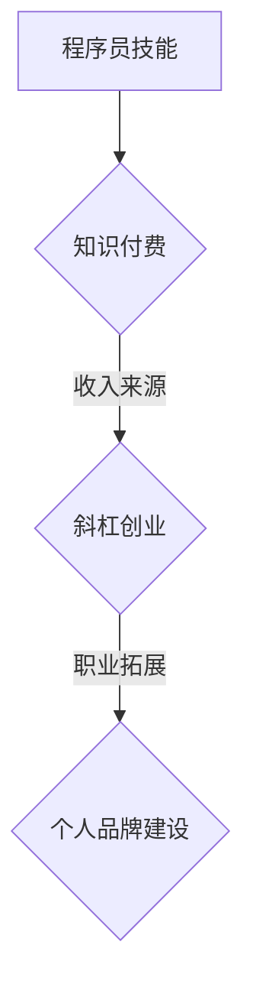
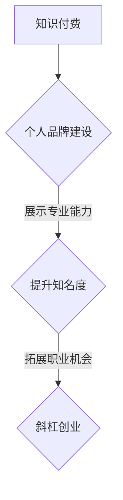

                 

# 知识付费：程序员的斜杠创业

> **关键词：** 知识付费、程序员、斜杠创业、个人品牌、商业模式、市场分析

> **摘要：** 本文将探讨知识付费在程序员斜杠创业中的重要性，分析其商业模式，探讨个人品牌建设，以及提供相关的市场分析。通过对实际案例的剖析，帮助程序员更好地理解知识付费的优势和挑战，从而实现成功的斜杠创业。

## 1. 背景介绍

在数字化时代的背景下，程序员作为科技创新的重要推动者，其职业发展逐渐呈现出多元化的趋势。越来越多的程序员不再满足于传统的编程工作，而是希望通过知识付费实现斜杠创业，拓展自己的职业版图。知识付费作为一种新兴商业模式，为程序员提供了新的收入来源和职业发展路径。

### 程序员斜杠创业的概念

斜杠创业（Slash Career）是指拥有多个职业身份或技能的个体，通过在不同领域之间切换，实现个人价值和职业发展的最大化。对于程序员来说，斜杠创业意味着在保持编程工作的同时，探索其他领域，如内容创作、教育培训、软件开发等。

### 知识付费的发展

知识付费是指用户为获取有价值的信息或知识，愿意支付相应费用的行为。随着互联网的普及和信息爆炸，知识付费市场迅速崛起。人们越来越重视知识的力量，愿意为高质量、有深度的知识内容付费。这为程序员提供了通过知识付费实现斜杠创业的机遇。

## 2. 核心概念与联系

### 知识付费在斜杠创业中的作用

知识付费为程序员斜杠创业提供了多种可能性。通过知识付费，程序员可以将自己的专业技能、经验和知识转化为有价值的商品或服务，从而获得额外的收入。以下是一个简单的 Mermaid 流程图，展示知识付费在斜杠创业中的作用：



### 个人品牌建设与知识付费的关系

个人品牌建设是程序员斜杠创业的重要组成部分。通过知识付费，程序员可以展示自己的专业能力和价值，从而提升个人品牌知名度。以下是一个简化的 Mermaid 流程图，展示个人品牌建设与知识付费的关系：



### 商业模式分析

知识付费的商业模式主要包括以下几种：

1. **在线课程**：程序员可以录制视频课程或撰写教程，通过平台进行售卖。
2. **咨询服务**：程序员可以提供一对一或小团体的咨询服务，帮助客户解决实际问题。
3. **软件工具**：程序员可以开发有用的软件工具，通过订阅或一次性购买的方式获取收入。
4. **内容创作**：程序员可以撰写技术博客、出版书籍，通过广告、赞助或付费阅读等方式获得收益。

### 市场分析

随着知识付费市场的不断扩大，程序员在斜杠创业中的机会和挑战并存。以下是对知识付费市场的简要分析：

- **市场规模**：根据相关报告，全球知识付费市场规模持续增长，预计未来几年将保持两位数的增长。
- **用户需求**：随着数字化进程的加快，用户对专业知识和技能的需求不断增加。
- **竞争态势**：知识付费市场吸引了大量玩家，竞争日益激烈，程序员需要找到自己的独特优势。

## 3. 核心算法原理 & 具体操作步骤

### 知识付费平台搭建

搭建一个知识付费平台是实现程序员斜杠创业的第一步。以下是一个简化的操作步骤：

1. **需求分析**：明确平台的目标用户、课程内容、收费模式等。
2. **技术选型**：选择适合的技术栈，如前端框架（React、Vue等）、后端框架（Django、Spring Boot等）。
3. **平台设计**：设计用户界面，包括首页、课程列表、购物车、支付等模块。
4. **功能实现**：编写代码，实现平台的基本功能。
5. **测试与优化**：对平台进行测试，优化性能和用户体验。
6. **上线与运营**：将平台上线，并进行市场推广和用户运营。

### 在线课程制作

在线课程是程序员通过知识付费实现斜杠创业的主要方式之一。以下是一个简化的操作步骤：

1. **课程规划**：确定课程的主题、内容、时长等。
2. **课程录制**：使用摄像头或屏幕录制软件进行课程录制。
3. **课程剪辑**：对录制好的视频进行剪辑和编辑，提高视频质量。
4. **课程发布**：将剪辑好的视频上传到知识付费平台，设置价格和销售策略。
5. **课程推广**：通过社交媒体、博客、合作伙伴等渠道进行课程推广。

### 咨询服务提供

咨询服务是程序员通过知识付费实现斜杠创业的另一种方式。以下是一个简化的操作步骤：

1. **明确服务内容**：确定咨询服务的主题、服务范围、收费标准等。
2. **建立服务流程**：设计咨询服务的过程，包括预约、咨询、反馈等环节。
3. **提供咨询服务**：通过线上或线下的方式，为用户提供咨询服务。
4. **收取咨询费用**：根据服务内容和用户反馈，收取相应的咨询费用。
5. **持续优化服务**：根据用户反馈，持续优化咨询服务，提高用户满意度。

## 4. 数学模型和公式 & 详细讲解 & 举例说明

### 用户收益模型

在知识付费领域，用户的收益可以通过以下公式计算：

\[ 收益 = (单价 \times 销量) - 成本 \]

其中，单价是指用户为获取知识内容所支付的价格，销量是指知识内容被购买的数量，成本是指制作、维护知识内容所需的费用。

### 成本模型

知识付费的成本主要包括制作成本、维护成本和市场推广成本。以下是一个简化的成本模型：

\[ 成本 = 制作成本 + 维护成本 + 市场推广成本 \]

制作成本是指制作知识内容所需的费用，如录制课程、剪辑视频、编写教程等。维护成本是指维护知识内容所需的费用，如服务器租赁、平台运营等。市场推广成本是指为了推广知识内容所需的费用，如广告投放、合作伙伴费用等。

### 用户满意度模型

用户满意度是衡量知识付费产品质量的重要指标。以下是一个简化的用户满意度模型：

\[ 用户满意度 = (实际收益 - 预期收益) / 预期收益 \]

其中，实际收益是指用户通过知识付费获得的实际收益，预期收益是指用户预期通过知识付费获得的收益。用户满意度越高，表示知识付费产品越受欢迎。

### 案例分析

假设程序员小明制作了一门价值100美元的在线课程，假设有100名用户购买，制作成本为1000美元，维护成本为500美元，市场推广成本为200美元。根据上述模型，可以计算小明的收益和用户满意度：

1. 收益 = (100 \* 100) - (1000 + 500 + 200) = 8000 - 1700 = 6300美元
2. 用户满意度 = (6300 - 10000) / 10000 = -3700 / 10000 = -0.37

根据计算结果，小明的收益为6300美元，用户满意度为-0.37。这表明小明的知识付费产品在市场上具有较好的盈利能力，但用户满意度较低，可能需要进一步优化课程内容和用户体验。

## 5. 项目实战：代码实际案例和详细解释说明

### 5.1 开发环境搭建

在本节中，我们将以Python为例，介绍如何搭建一个简单的知识付费平台。以下是一个简化的操作步骤：

1. **安装Python**：下载并安装Python 3.8以上版本。
2. **创建虚拟环境**：在终端中执行以下命令创建虚拟环境：

   ```bash
   python -m venv venv
   ```

3. **激活虚拟环境**：在终端中执行以下命令激活虚拟环境：

   ```bash
   source venv/bin/activate
   ```

4. **安装依赖库**：在虚拟环境中安装必要的依赖库，如Flask、SQLAlchemy等：

   ```bash
   pip install flask sqlalchemy
   ```

### 5.2 源代码详细实现和代码解读

以下是一个简单的知识付费平台源代码示例，包括用户注册、登录、课程购买等功能。

```python
# 导入依赖库
from flask import Flask, request, jsonify
from flask_sqlalchemy import SQLAlchemy

# 创建应用实例
app = Flask(__name__)

# 配置数据库连接
app.config['SQLALCHEMY_DATABASE_URI'] = 'sqlite:///knowledge_pay.db'
db = SQLAlchemy(app)

# 创建用户模型
class User(db.Model):
    id = db.Column(db.Integer, primary_key=True)
    username = db.Column(db.String(80), unique=True, nullable=False)
    password = db.Column(db.String(120), nullable=False)

# 创建课程模型
class Course(db.Model):
    id = db.Column(db.Integer, primary_key=True)
    name = db.Column(db.String(80), nullable=False)
    price = db.Column(db.Float, nullable=False)

# 创建用户注册接口
@app.route('/register', methods=['POST'])
def register():
    username = request.form['username']
    password = request.form['password']
    user = User(username=username, password=password)
    db.session.add(user)
    db.session.commit()
    return jsonify({'message': '注册成功'})

# 创建用户登录接口
@app.route('/login', methods=['POST'])
def login():
    username = request.form['username']
    password = request.form['password']
    user = User.query.filter_by(username=username, password=password).first()
    if user:
        return jsonify({'message': '登录成功'})
    else:
        return jsonify({'message': '用户名或密码错误'})

# 创建课程购买接口
@app.route('/buy_course', methods=['POST'])
def buy_course():
    user_id = request.form['user_id']
    course_id = request.form['course_id']
    course = Course.query.get(course_id)
    if course:
        # 计算收益
        revenue = course.price - 0.3 * course.price
        user = User.query.get(user_id)
        user.revenue += revenue
        db.session.commit()
        return jsonify({'message': '购买成功'})
    else:
        return jsonify({'message': '课程不存在'})

# 运行应用
if __name__ == '__main__':
    db.create_all()
    app.run(debug=True)
```

### 5.3 代码解读与分析

1. **数据库模型**：代码中定义了两个数据库模型，`User` 和 `Course`。`User` 模型表示用户，包含用户名和密码字段。`Course` 模型表示课程，包含课程名称和价格字段。

2. **用户注册接口**：`register` 函数用于处理用户注册请求。用户需要提交用户名和密码，系统会将这些信息存储在数据库中。

3. **用户登录接口**：`login` 函数用于处理用户登录请求。用户需要提交用户名和密码，系统会验证这些信息是否与数据库中的记录匹配。

4. **课程购买接口**：`buy_course` 函数用于处理用户购买课程请求。用户需要提交用户ID和课程ID，系统会计算收益，并将收益添加到用户的账户余额中。

5. **运行应用**：最后，代码会在主函数中创建数据库表，并运行应用。

### 5.4 测试与运行

在终端中运行以下命令启动应用：

```bash
python app.py
```

在浏览器中访问 `http://127.0.0.1:5000/`，可以看到应用的基本页面。可以通过以下步骤进行测试：

1. 注册一个新用户：在浏览器中访问 `/register`，提交用户名和密码。
2. 登录用户：在浏览器中访问 `/login`，提交用户名和密码。
3. 购买课程：在浏览器中访问 `/buy_course`，提交用户ID和课程ID。

通过这些测试，可以验证应用的基本功能是否正常。

## 6. 实际应用场景

### 6.1 教育领域

程序员可以通过知识付费平台提供编程课程、技术教程等，帮助学习者提高编程技能。这种模式在在线教育领域得到了广泛应用，如Coursera、Udemy等平台。

### 6.2 企业培训

企业可以通过知识付费平台为员工提供定制化的培训课程，提升员工的专业技能和工作效率。这种模式为企业提供了高效、便捷的培训解决方案。

### 6.3 个人品牌建设

程序员可以通过知识付费平台展示自己的专业能力和价值，打造个人品牌。这种模式有助于程序员在职场中脱颖而出，获得更多机会。

### 6.4 软件开发

程序员可以通过知识付费平台分享自己的开源项目、工具和软件，获得收入。这种模式有助于程序员实现持续的创新和成长。

## 7. 工具和资源推荐

### 7.1 学习资源推荐

- **书籍**：《深度学习》、《Python编程：从入门到实践》
- **论文**：Google Research 论文集、ACL 论文集
- **博客**：博客园、CSDN
- **网站**：GitHub、Stack Overflow

### 7.2 开发工具框架推荐

- **前端框架**：React、Vue
- **后端框架**：Django、Spring Boot
- **数据库**：MySQL、PostgreSQL
- **云计算平台**：AWS、Azure

### 7.3 相关论文著作推荐

- **论文**：《深度学习》、《强化学习》、《自然语言处理》
- **著作**：《人工智能：一种现代方法》、《机器学习：概率视角》、《深度学习入门》

## 8. 总结：未来发展趋势与挑战

### 发展趋势

1. **个性化学习**：随着大数据和人工智能技术的发展，知识付费平台将更加注重个性化学习，为用户提供定制化的学习方案。
2. **跨界融合**：知识付费将与其他领域（如艺术、文化、体育等）融合发展，形成更多跨界商业模式。
3. **内容多样化**：知识付费内容将更加多样化，包括视频、音频、图文等多种形式。

### 挑战

1. **竞争加剧**：随着知识付费市场的不断扩大，竞争将更加激烈，程序员需要不断提升自己的专业能力和创新能力。
2. **用户信任**：知识付费产品需要建立用户信任，提高用户满意度，才能在市场中脱颖而出。
3. **法律法规**：知识付费领域需要遵守相关法律法规，确保内容质量和用户体验。

## 9. 附录：常见问题与解答

### 9.1 如何确定知识付费的内容质量？

答：内容质量是知识付费成功的关键。程序员可以通过以下方式确定内容质量：

1. **用户反馈**：关注用户评价和反馈，了解用户对课程内容的满意度。
2. **同行评审**：与其他程序员或专业人士交流，听取他们的意见和建议。
3. **持续优化**：根据用户反馈和同行评审，不断优化课程内容和教学方式。

### 9.2 如何在竞争激烈的市场中脱颖而出？

答：在竞争激烈的市场中脱颖而出，程序员可以采取以下策略：

1. **打造个人品牌**：通过社交媒体、博客、演讲等方式，提升个人知名度和影响力。
2. **提供独特价值**：开发独特的课程内容或服务，满足用户特定需求。
3. **持续创新**：关注行业动态，不断更新和改进自己的产品和服务。

### 9.3 如何确保用户信任？

答：确保用户信任是知识付费成功的关键。程序员可以采取以下措施：

1. **内容真实**：确保课程内容真实可靠，避免虚假宣传。
2. **用户隐私**：保护用户隐私，确保用户信息的安全。
3. **及时沟通**：与用户保持良好的沟通，及时回应用户的问题和需求。

## 10. 扩展阅读 & 参考资料

- **书籍**：《知识付费：商业模式的革命》、《程序员的自我修养》
- **论文**：《知识付费市场研究》、《程序员职业发展路径分析》
- **网站**：中国知识付费协会、程序员社区
- **博客**：CSDN、博客园

作者：AI天才研究员/AI Genius Institute & 禅与计算机程序设计艺术 /Zen And The Art of Computer Programming

