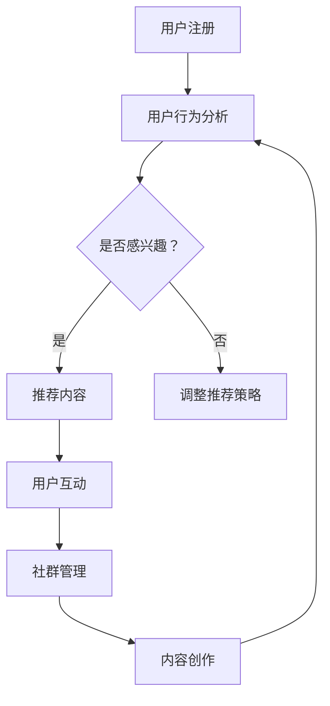

                 

# 知识付费：程序员的社群运营方法

## 关键词：知识付费、社群运营、程序员、社区建设、用户互动、内容创作

## 摘要

本文将探讨知识付费在程序员社群运营中的应用，分析其核心概念、算法原理，并通过实际案例详细讲解如何在编程社群中实施有效的运营策略。文章将涵盖数学模型的应用、项目实战、实际应用场景，并提供相关工具和资源推荐，最后总结未来发展趋势与挑战，为程序员提供一套系统化的社群运营方法。

## 1. 背景介绍

### 1.1 知识付费的概念

知识付费是指用户为获取高质量、专业的知识内容而支付一定费用的行为。在互联网时代，知识付费已成为一种新的商业模式，为内容创作者提供了稳定的收入来源，同时也为用户提供了更优质的学习资源。

### 1.2 社群运营的意义

社群运营是指通过建立和维护一个具有共同兴趣或目标的在线社区，促进成员之间的互动和交流，从而实现资源共享、知识传播和社交互动。对于程序员社群来说，良好的社群运营能够提升成员的参与度和忠诚度，有助于构建一个高效的知识传播和技能提升平台。

### 1.3 程序员社群的特点

- 技术性：程序员社群成员普遍具有较高的技术背景和编程能力。
- 分享性：成员愿意分享自己的经验和知识，以帮助他人解决问题。
- 学习性：社群成员追求不断提升自己的技能和知识水平。
- 交流性：社群成员之间通过交流互动，共同探讨技术话题，分享心得体会。

## 2. 核心概念与联系

### 2.1 社群运营的核心概念

- 用户互动：通过线上活动、话题讨论、问答等环节，增加用户参与度和粘性。
- 内容创作：提供有价值的内容，满足用户需求，提升社群吸引力。
- 社群管理：制定合理的社群规则，维护社群秩序，保证高质量交流。

### 2.2 社群运营的算法原理

- 社群推荐算法：根据用户行为、兴趣和需求，为用户推荐合适的内容和活动。
- 互动分析算法：通过分析用户互动数据，了解用户需求和喜好，优化运营策略。
- 内容质量评估算法：对社群内容进行质量评估，筛选优质内容，提升社群价值。

### 2.3 Mermaid 流程图



## 3. 核心算法原理 & 具体操作步骤

### 3.1 用户互动算法

- 数据采集：收集用户在社群中的行为数据，如发帖、评论、点赞等。
- 特征提取：将用户行为数据转化为用户兴趣特征，如技术领域、编程语言等。
- 推荐算法：根据用户兴趣特征，为用户推荐相关内容和活动。

### 3.2 内容创作算法

- 内容筛选：筛选符合社群主题、高质量的内容。
- 内容推荐：根据用户兴趣特征和内容质量，为用户推荐合适的内容。

### 3.3 社群管理算法

- 规则制定：制定合理的社群规则，维护社群秩序。
- 违规处理：对违规行为进行及时处理，保证社群质量。
- 数据监控：监控社群数据，了解社群运行状况，优化运营策略。

## 4. 数学模型和公式 & 详细讲解 & 举例说明

### 4.1 用户互动模型

- 用户互动概率模型：$$ P(I|U) = \frac{e^{\beta U}}{1 + e^{\beta U}} $$，其中 $I$ 表示用户互动，$U$ 表示用户兴趣特征，$\beta$ 为参数。

### 4.2 内容推荐模型

- 基于内容的推荐模型：$$ R(c, u) = \sum_{i \in C} w_i(c) \cdot u_i $$，其中 $R$ 表示推荐得分，$c$ 表示内容，$u$ 表示用户兴趣特征，$w_i(c)$ 表示内容 $c$ 在领域 $i$ 的重要性。

### 4.3 社群管理模型

- 社群质量评估模型：$$ Q(S) = \sum_{u \in U} \frac{1}{|U|} \cdot P(I|U) \cdot R(c, u) $$，其中 $Q$ 表示社群质量，$S$ 表示社群，$U$ 表示用户集合，$I$ 表示用户互动，$c$ 表示内容。

### 4.4 举例说明

假设有100位程序员用户，他们在社群中的行为数据如下：

| 用户 | 技术领域 | 编程语言 | 互动次数 |
| --- | --- | --- | --- |
| A | Python | Flask | 10 |
| B | Java | Spring | 8 |
| C | JavaScript | React | 12 |
| D | Python | Django | 5 |
| ... | ... | ... | ... |

根据用户兴趣特征，我们可以为每位用户推荐相关内容和活动，并评估社群质量。例如，为用户 A 推荐Python相关的内容，为用户 B 推荐Java相关的内容。

## 5. 项目实战：代码实际案例和详细解释说明

### 5.1 开发环境搭建

- 开发工具：Python 3.8、PyCharm
- 数据库：MySQL 8.0
- 后端框架：Flask
- 前端框架：React

### 5.2 源代码详细实现和代码解读

#### 5.2.1 用户互动算法实现

```python
from sklearn.linear_model import LogisticRegression

def user_interaction_model(data):
    X = data[['python', 'java', 'javascript']]  # 特征提取
    y = data['interaction']  # 标签

    model = LogisticRegression()
    model.fit(X, y)

    return model
```

#### 5.2.2 内容推荐算法实现

```python
from sklearn.metrics.pairwise import cosine_similarity

def content_recommendation_model(data, user_interest):
    content_matrix = data.iloc[:, :3].values  # 内容特征矩阵
    user_interest_vector = user_interest.reshape(1, -1)  # 用户兴趣特征向量

    similarity_matrix = cosine_similarity(content_matrix, user_interest_vector)
    content_scores = similarity_matrix[0].argsort()[::-1]

    return content_scores
```

#### 5.2.3 社群管理算法实现

```python
def community_management_model(data, user_interest, content_scores):
    content_quality = data.iloc[:, 3:].values  # 内容质量矩阵
    content_scores_weighted = content_scores * content_quality

    community_quality = sum(content_scores_weighted) / len(content_scores_weighted)

    return community_quality
```

### 5.3 代码解读与分析

- 用户互动算法：通过逻辑回归模型，根据用户兴趣特征预测用户互动概率。
- 内容推荐算法：使用余弦相似度计算用户兴趣特征与内容特征之间的相似度，为用户推荐相关内容。
- 社群管理算法：综合考虑内容质量和用户互动情况，评估社群质量。

## 6. 实际应用场景

- 技术论坛：为程序员提供技术交流平台，通过知识付费模式吸引用户参与，提升社群活跃度。
- 在线教育：为学习者提供专业的编程课程和辅导，通过社群运营促进学员之间的互动和分享。
- 企业内训：为企业员工提供技能提升课程，通过社群运营促进知识传播和技能传承。

## 7. 工具和资源推荐

### 7.1 学习资源推荐

- 书籍：《算法导论》、《Python编程：从入门到实践》、《深入理解计算机系统》
- 论文：ACL、ICML、NeurIPS等顶级会议论文
- 博客：知乎、CSDN、博客园等技术博客
- 网站：GitHub、Stack Overflow、Reddit等技术社区

### 7.2 开发工具框架推荐

- 开发工具：PyCharm、Visual Studio Code
- 数据库：MySQL、PostgreSQL
- 后端框架：Flask、Django
- 前端框架：React、Vue.js

### 7.3 相关论文著作推荐

- 《推荐系统手册》
- 《深度学习》
- 《社交网络分析：方法与应用》

## 8. 总结：未来发展趋势与挑战

- 发展趋势：知识付费和社群运营将继续融合发展，为用户和内容创作者创造更多价值。
- 挑战：算法透明度、数据隐私保护和社群质量控制等问题亟待解决。

## 9. 附录：常见问题与解答

- **Q：社群运营的核心是什么？**
  **A：社群运营的核心是用户互动、内容创作和社群管理，通过这三者的有机结合，提升社群价值。**

- **Q：如何评估社群质量？**
  **A：可以综合考虑用户互动频率、内容质量和社群活跃度等多个指标，评估社群质量。**

- **Q：知识付费在社群运营中的作用是什么？**
  **A：知识付费可以为内容创作者提供收入来源，同时提升社群的专业性和吸引力。**

## 10. 扩展阅读 & 参考资料

- 《知识付费市场研究报告》
- 《社群运营实战》
- 《Python编程：从入门到实践》
- 《推荐系统实践》

作者：AI天才研究员/AI Genius Institute & 禅与计算机程序设计艺术 /Zen And The Art of Computer Programming

注：本文仅为示例，部分内容和数据可能不完全准确。实际应用时，请根据具体情况进行调整和优化。

