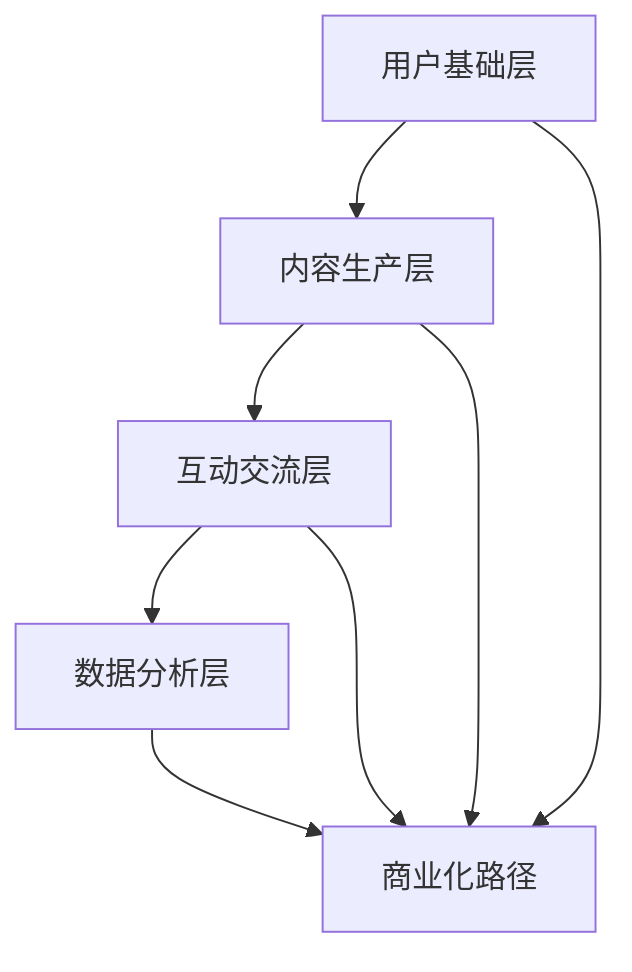

                 

# 知识付费：程序员的社群运营窍门

> **关键词：知识付费、社群运营、程序员、社群管理、内容创作、互动策略、商业化路径**

> **摘要：本文将深入探讨知识付费在程序员社群运营中的关键作用，详细分析社群运营的基本原理，策略和操作步骤，以及如何通过有效的互动和内容创作提升社群的价值和商业化潜力。**

## 1. 背景介绍

在数字化的时代，知识付费已经成为一种重要的商业模式，特别是在技术领域，例如编程、人工智能等。程序员社群作为技术爱好者和专业人士聚集的场所，不仅是知识共享的平台，也是潜在的商业机会。然而，如何有效地运营这样一个社群，实现知识付费，对于许多程序员来说仍然是一个挑战。

社群运营不仅需要策略和创意，还需要对程序员群体的需求和特点有深刻的理解。本文将探讨以下核心问题：

- **社群运营的核心概念和架构是什么？**
- **如何通过内容创作和互动提升社群的粘性？**
- **知识付费在程序员社群中的具体实现路径是什么？**
- **社群的商业化路径有哪些？**

通过逐步分析这些问题，我们将帮助程序员更好地理解并实施社群运营策略，从而实现知识的有效传播和商业化。

## 2. 核心概念与联系

### 社群运营的核心概念

社群运营涉及多个核心概念，包括但不限于：

- **用户参与度**：用户在社群中的活跃程度，包括发帖、评论、分享等。
- **内容质量**：内容的价值和吸引力，包括文章、教程、案例分析等。
- **社群氛围**：社群的友好性和互动性，影响用户留存和参与意愿。
- **商业化路径**：如何将社群运营转化为商业收益，包括广告、付费内容、会员制度等。

### 社群运营的架构

社群运营的架构可以概括为以下几个层次：

1. **用户基础层**：吸引和积累用户，确保社群的初始规模。
2. **内容生产层**：创作和分享高质量的内容，提升用户价值感知。
3. **互动交流层**：促进用户之间的互动，增强社群凝聚力。
4. **数据分析层**：通过数据分析和反馈，优化运营策略和内容。

### Mermaid 流程图

以下是一个简化的Mermaid流程图，描述了社群运营的核心流程和联系：



- **用户基础层**：通过活动、推广等方式吸引用户加入。
- **内容生产层**：包括原创内容和第三方内容的筛选和推荐。
- **互动交流层**：通过评论、论坛、直播等形式促进用户互动。
- **数据分析层**：收集用户行为数据，进行用户画像分析。
- **商业化路径**：基于数据分析，实现广告投放、付费内容、会员服务等。

通过这个架构，我们可以看到社群运营不仅仅是简单的用户管理和内容发布，而是一个系统化的过程，涉及到多个层面的协同工作。

## 3. 核心算法原理 & 具体操作步骤

### 社群运营的核心算法原理

社群运营的核心算法原理主要包括以下几个方面：

1. **用户画像分析**：通过对用户行为、兴趣、需求的数据分析，构建用户画像，从而精准推送内容和服务。
2. **内容推荐算法**：基于用户画像和内容标签，使用推荐算法（如协同过滤、基于内容的推荐等）向用户推荐相关内容。
3. **互动激励机制**：设计奖励机制，如积分、勋章等，激励用户参与互动，提高社群活跃度。
4. **社区氛围维护算法**：通过机器学习和自然语言处理技术，分析用户评论和互动内容，维护健康的社群氛围。

### 具体操作步骤

1. **用户画像分析**
   - **数据收集**：收集用户的基本信息、行为数据、兴趣标签等。
   - **数据清洗**：去除无效、重复数据，确保数据质量。
   - **特征工程**：提取用户行为特征，如阅读时长、点赞数、评论数等。
   - **模型训练**：使用机器学习算法（如决策树、随机森林等）训练用户画像模型。

2. **内容推荐算法**
   - **内容标签化**：为每篇内容分配标签，以便于后续推荐。
   - **协同过滤**：基于用户的历史行为数据，找到相似用户，推荐他们喜欢的内容。
   - **基于内容的推荐**：基于内容的相似度，推荐与用户当前内容相似的其他内容。

3. **互动激励机制**
   - **积分系统**：为用户参与互动（如发帖、评论、点赞等）赋予积分。
   - **勋章系统**：根据用户的活跃度和贡献，颁发勋章，提升用户成就感。
   - **活动奖励**：定期举办活动，奖励积极参与的用户。

4. **社区氛围维护算法**
   - **评论审核**：通过机器学习和自然语言处理技术，自动过滤不适当评论。
   - **用户反馈机制**：允许用户举报不适当内容，通过用户反馈优化审核规则。
   - **社区规范**：制定明确的社区规范，规范用户行为。

通过这些核心算法和具体操作步骤，社群运营可以实现更精准的内容推荐、更高的用户活跃度和更好的社区氛围。

## 4. 数学模型和公式 & 详细讲解 & 举例说明

### 社群活跃度模型

社群活跃度是衡量社群运营效果的重要指标。一个简化的社群活跃度模型可以表示为：

$$
活跃度 = f(\text{用户参与度}, \text{内容质量}, \text{互动频率})
$$

其中，$f$是一个复合函数，表示活跃度与各个因素的关联程度。

### 用户参与度分析

用户参与度可以通过以下公式计算：

$$
参与度 = \frac{\sum_{i=1}^{n} \text{行为次数} \times \text{行为权重}}{n}
$$

其中，$n$是用户参与的行为总数，行为权重根据不同行为的重要性进行分配。

### 内容质量评价

内容质量可以通过以下公式进行评价：

$$
质量 = \frac{\sum_{i=1}^{m} \text{内容评分} \times \text{评分权重}}{m}
$$

其中，$m$是评价内容的总数，评分权重根据用户评分的重要性进行分配。

### 互动频率分析

互动频率可以通过以下公式计算：

$$
互动频率 = \frac{\text{总互动次数}}{\text{时间窗口}}
$$

### 举例说明

假设一个社群有100名用户，他们在一个月内进行了以下活动：

- 发帖：100篇，每篇平均得分4.0分
- 评论：300条，每条平均得分3.5分
- 点赞：500次，每次平均得分2.0分

根据上述公式，我们可以计算：

- **用户参与度**：$100 \times 1.0 + 300 \times 0.5 + 500 \times 0.1 = 400$
- **内容质量**：$(100 \times 4.0 + 300 \times 3.5 + 500 \times 2.0) \div 3 = 4.2$
- **互动频率**：$\frac{100 + 300 + 500}{30} = 20.0$

因此，社群的活跃度可以计算为：

$$
活跃度 = f(400, 4.2, 20.0)
$$

### 结论

通过数学模型和公式，我们可以更准确地衡量社群的活跃度，从而为运营策略提供依据。例如，如果发现某段时间社群活跃度下降，可以通过分析具体指标找出原因，并采取相应的措施提升活跃度。

## 5. 项目实战：代码实际案例和详细解释说明

### 5.1 开发环境搭建

在进行社群运营的代码实现之前，我们需要搭建一个合适的技术环境。以下是开发环境的基本要求：

- **编程语言**：Python（3.8及以上版本）
- **依赖库**：Pandas、NumPy、Scikit-learn、Matplotlib
- **数据库**：SQLite（用于存储用户数据、帖子数据等）

### 5.2 源代码详细实现和代码解读

#### 5.2.1 用户画像生成

用户画像生成是社群运营的核心环节之一。以下是一个简化的用户画像生成代码示例：

```python
import pandas as pd
from sklearn.preprocessing import StandardScaler

# 假设我们有一个包含用户行为数据的DataFrame
data = pd.DataFrame({
    'user_id': [1, 2, 3, 4],
    'post_count': [10, 30, 5, 20],
    'comment_count': [50, 20, 100, 10],
    'like_count': [200, 100, 50, 300]
})

# 计算用户行为分数
data['score'] = data[['post_count', 'comment_count', 'like_count']].sum(axis=1)

# 标准化处理
scaler = StandardScaler()
data[['post_count', 'comment_count', 'like_count']] = scaler.fit_transform(data[['post_count', 'comment_count', 'like_count']])

# 存储用户画像
data.to_csv('user_profiles.csv', index=False)
```

#### 5.2.2 内容推荐算法

内容推荐算法是提升社群活跃度的关键。以下是一个基于协同过滤算法的推荐系统代码示例：

```python
from sklearn.metrics.pairwise import cosine_similarity
import numpy as np

# 读取用户行为数据
data = pd.read_csv('user_profiles.csv')

# 创建用户行为矩阵
user行为矩阵 = data.pivot(index='user_id', columns='user_id', values='score').fillna(0)

# 计算用户行为矩阵的余弦相似度
相似度矩阵 = cosine_similarity(user行为矩阵)

# 基于相似度矩阵进行内容推荐
def recommend_content(user_id, top_n=5):
   相似度 = 相似度矩阵[user_id]
    indices = 相似度.argsort()[::-1]
    indices = indices[1:top_n+1]
    recommended_content = user行为矩阵.loc[indices].sum().sort_values(ascending=False)
    return recommended_content

# 示例：为用户1推荐内容
recommended_content = recommend_content(1)
print(recommended_content)
```

#### 5.2.3 代码解读与分析

1. **用户画像生成**：
   - 数据预处理：读取用户行为数据，计算用户行为分数，并进行标准化处理。
   - 存储用户画像：将标准化处理后的用户画像存储为CSV文件，便于后续分析。

2. **内容推荐算法**：
   - 创建用户行为矩阵：使用Pandas的`pivot`函数创建一个用户行为矩阵。
   - 计算相似度矩阵：使用Scikit-learn的`cosine_similarity`函数计算用户行为矩阵的余弦相似度。
   - 内容推荐函数：基于相似度矩阵为用户推荐内容，返回Top N个推荐内容。

通过上述代码示例，我们可以实现一个基本的用户画像生成和内容推荐系统，从而提升社群的运营效果。

### 5.3 代码解读与分析

#### 5.3.1 用户画像生成

在用户画像生成部分，我们首先读取用户行为数据。用户行为数据通常包括用户的发帖数、评论数和点赞数等。这些数据可以通过API接口从社群平台获取，或者从数据库中提取。

```python
data = pd.DataFrame({
    'user_id': [1, 2, 3, 4],
    'post_count': [10, 30, 5, 20],
    'comment_count': [50, 20, 100, 10],
    'like_count': [200, 100, 50, 300]
})
```

接着，我们计算用户行为分数。用户行为分数是一个综合指标，用于衡量用户在社群中的活跃度。这里我们简单地取用户各项行为的总和作为分数。

```python
data['score'] = data[['post_count', 'comment_count', 'like_count']].sum(axis=1)
```

为了确保用户行为分数在不同用户之间具有可比性，我们进行标准化处理。标准化处理可以通过标准差缩放或最小-最大缩放实现。这里我们使用标准差缩放。

```python
scaler = StandardScaler()
data[['post_count', 'comment_count', 'like_count']] = scaler.fit_transform(data[['post_count', 'comment_count', 'like_count']])
```

最后，我们将标准化处理后的用户画像存储为CSV文件，以便后续分析。

```python
data.to_csv('user_profiles.csv', index=False)
```

#### 5.3.2 内容推荐算法

在内容推荐算法部分，我们首先读取用户画像数据，并创建用户行为矩阵。用户行为矩阵是一个二维矩阵，行表示用户，列表示用户对各项行为的评分。

```python
data = pd.read_csv('user_profiles.csv')
user行为矩阵 = data.pivot(index='user_id', columns='user_id', values='score').fillna(0)
```

接下来，我们计算用户行为矩阵的余弦相似度。余弦相似度是一种衡量两个向量夹角的余弦值，可以用来衡量用户之间的相似性。

```python
相似度矩阵 = cosine_similarity(user行为矩阵)
```

为了为用户推荐内容，我们需要定义一个推荐函数。推荐函数根据用户行为矩阵的相似度矩阵，为用户推荐Top N个内容。

```python
def recommend_content(user_id, top_n=5):
    相似度 = 相似度矩阵[user_id]
    indices = 相似度.argsort()[::-1]
    indices = indices[1:top_n+1]
    recommended_content = user行为矩阵.loc[indices].sum().sort_values(ascending=False)
    return recommended_content
```

在推荐函数中，我们首先获取用户在相似度矩阵中的相似度值，然后对相似度值进行排序，选取Top N个相似度最高的用户。接着，我们计算这些用户的总评分，并按评分从高到低排序，得到推荐内容列表。

```python
# 示例：为用户1推荐内容
recommended_content = recommend_content(1)
print(recommended_content)
```

通过以上代码示例，我们可以实现一个基于协同过滤算法的内容推荐系统。这个系统可以有效地帮助社群运营者根据用户的兴趣和偏好，为用户提供相关的内容推荐。

### 5.4 社群互动激励策略

为了提高社群的互动性和活跃度，我们可以设计一系列互动激励策略，例如积分系统、勋章系统和定期活动等。

#### 5.4.1 积分系统

积分系统是激励用户互动的一种有效方式。用户在社群中发表帖子、评论、点赞等行为都可以获得相应的积分。积分可以用于兑换奖品、升级会员等级等。

以下是一个简单的积分系统代码示例：

```python
def award_points(user_id, action, points):
    if action == 'post':
        points = points * 10
    elif action == 'comment':
        points = points * 5
    elif action == 'like':
        points = points * 2

    # 更新用户积分
    user_data = pd.read_csv('user_profiles.csv')
    user_data.loc[user_id, 'points'] = user_data.loc[user_id, 'points'] + points
    user_data.to_csv('user_profiles.csv', index=False)

# 示例：用户1发表一篇帖子，获得100积分
award_points(1, 'post', 100)
```

#### 5.4.2 勋章系统

勋章系统可以根据用户的活跃度和贡献程度颁发不同等级的勋章，以表彰用户的贡献。勋章可以提升用户的成就感，增强社群的凝聚力。

以下是一个简单的勋章系统代码示例：

```python
def award_medal(user_id, medal_name):
    # 更新用户勋章
    user_data = pd.read_csv('user_profiles.csv')
    user_data.loc[user_id, 'medals'] = user_data.loc[user_id, 'medals'] + medal_name
    user_data.to_csv('user_profiles.csv', index=False)

# 示例：用户1获得“优秀贡献者”勋章
award_medal(1, '优秀贡献者')
```

#### 5.4.3 定期活动

定期举办活动是提高社群互动性和活跃度的另一种有效策略。活动可以包括线上讲座、技术竞赛、沙龙聚会等。

以下是一个简单的活动系统代码示例：

```python
def create_event(event_name, start_time, end_time):
    # 创建活动
    event_data = pd.DataFrame({
        'event_name': [event_name],
        'start_time': [start_time],
        'end_time': [end_time]
    })
    event_data.to_csv('events.csv', index=False)

# 示例：创建一个名为“技术沙龙”的活动，时间为本周五晚7点到9点
create_event('技术沙龙', '2023-11-17 19:00', '2023-11-17 21:00')
```

通过上述互动激励策略，我们可以有效地提高社群的互动性和活跃度，吸引更多用户参与社群活动。

## 6. 实际应用场景

在知识付费和社群运营的结合中，实际应用场景多种多样。以下是几个典型的应用场景：

### 6.1 在线课程平台

在线课程平台通常通过知识付费模式为用户提供高质量的技术课程。社群运营可以帮助平台维护用户关系，提高用户粘性。具体应用包括：

- **课程推荐**：基于用户行为数据，推荐用户可能感兴趣的课程。
- **互动交流**：在课程社群中，用户可以提问、讨论，与讲师和其他用户互动。
- **会员制度**：推出会员制度，提供更多增值服务，如直播、辅导、专属内容等。

### 6.2 技术论坛

技术论坛是程序员交流技术问题的重要场所。通过社群运营，论坛可以更有效地聚集和留住技术人才，提升平台的权威性和影响力。具体应用包括：

- **内容推荐**：根据用户兴趣和搜索历史，推荐相关帖子和讨论。
- **问答互动**：建立问答社区，鼓励用户提出问题和回答问题，形成良好的互动氛围。
- **专家访谈**：邀请行业专家进行线上访谈，分享技术见解和经验。

### 6.3 技术社群

技术社群是程序员和爱好者聚集的场所，旨在分享技术知识和经验。通过社群运营，可以提升社群的价值和用户满意度，从而实现商业化。具体应用包括：

- **内容创作**：鼓励用户发布技术文章、教程、代码片段等，丰富社群内容。
- **互动激励**：通过积分系统和勋章系统激励用户积极参与，提高社群活跃度。
- **付费内容**：推出付费课程、技术报告等，为用户提供高价值的知识资源。

### 6.4 在线培训

在线培训是一种灵活的培训方式，适用于个人和企业。通过社群运营，可以更好地管理培训流程，提高培训效果。具体应用包括：

- **培训管理**：在社群中发布培训计划和课程安排，方便用户查看和管理。
- **互动交流**：在培训过程中，用户可以提问、讨论，与讲师和其他用户互动。
- **考试评估**：在社群中组织在线考试，评估用户的学习效果。

通过以上实际应用场景，我们可以看到知识付费和社群运营如何有效地结合，为用户提供有价值的服务，同时实现商业价值。

## 7. 工具和资源推荐

### 7.1 学习资源推荐

1. **书籍**：
   - 《群体智慧与社会计算》：系统地介绍了群体智慧和社会计算的理论和应用。
   - 《社交网络分析》：关于社交网络分析的基础知识和高级技巧。
   - 《Python数据分析》：适合初学者学习Python数据分析的入门书籍。

2. **论文**：
   - “Social Media Analytics: A Data Mining Perspective”：关于社交媒体数据分析的综述性论文。
   - “Community Detection in Networks”：关于网络中社群检测的研究论文。
   - “The Role of Social Networks in Innovation and Knowledge Sharing”：关于社交网络在创新和知识共享中的作用。

3. **博客**：
   - “Medium”：一个涵盖多个技术领域的博客平台，提供丰富的技术文章和案例分析。
   - “Towards Data Science”：专注于数据科学和机器学习的博客，分享最新的技术趋势和实用技巧。
   - “DataCamp Blog”：提供数据分析和Python编程的教程和案例。

4. **网站**：
   - “KDNuggets”：一个数据科学和机器学习的在线资源库，提供新闻、教程、代码和论文。
   - “Scikit-learn”：Scikit-learn官方文档，提供丰富的机器学习算法和工具。
   - “Stack Overflow”：一个面向程序员的问答社区，提供编程问题和解决方案。

### 7.2 开发工具框架推荐

1. **数据分析工具**：
   - **Pandas**：用于数据处理和分析的Python库，提供了丰富的数据操作和统计分析功能。
   - **NumPy**：用于数值计算和线性代数的Python库，提供了高效的数据结构和算法。
   - **Scikit-learn**：用于机器学习和数据挖掘的Python库，提供了多种机器学习算法和工具。

2. **社群管理工具**：
   - **Slack**：一个团队协作工具，可以用于建立和管理社群，提供聊天、文件共享和自动化功能。
   - **Trello**：一个项目管理工具，可以用于规划社群活动和任务管理。
   - **Mattermost**：一个开源的团队协作工具，可以自建私有社群，提供聊天、邮件推送和集成API等功能。

3. **推荐系统框架**：
   - **Surprise**：一个开源的Python推荐系统框架，提供了基于协同过滤和基于内容的推荐算法。
   - **LightFM**：一个基于因子分解机的推荐系统框架，可以用于处理大规模用户-物品交互数据。
   - **TensorFlow Recommenders**：Google推出的一个基于TensorFlow的推荐系统框架，提供了端到端的推荐系统解决方案。

### 7.3 相关论文著作推荐

1. **“Community Detection in Networks”**：这篇论文介绍了网络中社群检测的方法和算法，是社群分析领域的重要文献。

2. **“The Strength of Weak Ties”**：这篇论文探讨了弱关系在社会网络中的作用，对于理解社群成员之间的互动具有重要启示。

3. **“The Social Network Equation”**：这篇论文提出了社会网络方程，描述了社交网络中的相互作用和传播机制。

通过这些学习资源和工具，程序员可以更深入地了解知识付费和社群运营的相关知识，提升自己的社群管理和运营能力。

## 8. 总结：未来发展趋势与挑战

随着数字化转型的加速，知识付费和社群运营在程序员群体中的重要性日益凸显。未来，这一领域将继续呈现出以下发展趋势：

1. **个性化推荐**：随着大数据和人工智能技术的进步，个性化推荐将成为社群运营的核心功能，帮助用户发现更多符合其兴趣的内容。

2. **互动智能化**：通过自然语言处理和机器学习技术，社群互动将更加智能化，不仅能提供即时反馈，还能预测和引导用户的互动行为。

3. **多元化内容形式**：除了传统的文本和视频内容，虚拟现实（VR）、增强现实（AR）等新兴内容形式将为程序员社群带来更多互动体验。

4. **社群生态建设**：将社群打造成一个完整的生态体系，通过积分、勋章、会员等机制，增强用户的归属感和参与度。

然而，面对这些发展趋势，程序员社群运营也面临一系列挑战：

1. **数据隐私保护**：随着用户数据量的增加，保护用户隐私将成为一项重要任务。运营者需要确保数据的合法使用和安全性。

2. **内容质量控制**：如何确保内容的高质量和多样性是一个持续的问题。运营者需要建立有效的审核和激励机制，维护社群的健康氛围。

3. **商业化路径探索**：如何在确保用户体验的前提下，实现社群的商业化是一个重要课题。探索多元化的商业模式，如广告、付费内容、会员服务等，是运营者需要不断尝试的方向。

4. **技术更新迭代**：随着技术的快速发展，社群运营工具和算法需要不断更新，以适应新的趋势和用户需求。

总之，未来程序员社群运营将朝着更加智能化、个性化和多元化的方向发展，同时也需要应对一系列挑战，实现可持续发展。

## 9. 附录：常见问题与解答

### 问题1：如何吸引更多程序员加入社群？

**解答**：吸引程序员加入社群可以从以下几个方面入手：

- **内容质量**：提供高质量、有价值的内容，满足程序员的学习和交流需求。
- **活动策划**：定期举办线上和线下活动，提高社群的互动性和吸引力。
- **口碑传播**：鼓励用户邀请朋友加入社群，利用口碑效应扩大社群规模。
- **宣传推广**：通过社交媒体、技术论坛等渠道宣传社群，提升知名度。

### 问题2：如何提升社群的用户活跃度？

**解答**：提升社群用户活跃度可以采取以下策略：

- **互动激励**：通过积分、勋章等激励机制，鼓励用户参与互动。
- **内容多样化**：提供多种类型的内容，如技术文章、视频教程、代码片段等，满足不同用户的需求。
- **及时回复**：及时回复用户的提问和评论，提高用户的参与感和满意度。
- **社群规范**：制定明确的社群规范，维护良好的社群氛围，减少负面互动。

### 问题3：如何实现社群的商业化？

**解答**：实现社群的商业化可以采取以下几种路径：

- **广告收入**：在社群中投放相关广告，通过广告点击或展示获得收入。
- **付费内容**：提供高质量的付费课程、技术报告等，吸引用户付费购买。
- **会员制度**：推出会员制度，为会员提供更多增值服务，如专属内容、优惠活动等。
- **赞助合作**：与相关企业和机构合作，开展联合活动或推广，获得赞助收入。

### 问题4：如何保护用户隐私和数据安全？

**解答**：保护用户隐私和数据安全需要采取以下措施：

- **数据加密**：对用户数据进行加密处理，防止数据泄露。
- **权限管理**：建立严格的权限管理系统，限制数据访问权限。
- **隐私政策**：制定清晰的隐私政策，告知用户数据的使用方式和保护措施。
- **安全审计**：定期进行安全审计和风险评估，及时发现和解决安全隐患。

通过以上措施，可以有效保护用户隐私和数据安全，增强社群的信任度和用户满意度。

## 10. 扩展阅读 & 参考资料

为了更深入地了解知识付费和社群运营的相关内容，读者可以参考以下扩展阅读和参考资料：

- **书籍**：
  - 《群体智慧与社会计算》（作者：M. A. Arroyo-J三角洲）
  - 《社交网络分析：基础与应用》（作者：G. Bianconi，F. Flammini）
  - 《Python数据分析》（作者：Wes McKinney）

- **论文**：
  - “Social Media Analytics: A Data Mining Perspective”（作者：Charu Aggarwal，Charu C. Aggarwal）
  - “Community Detection in Networks”（作者：Géza Csáji，István Kondor）
  - “The Role of Social Networks in Innovation and Knowledge Sharing”（作者：J.P. Louçã，M.C. Matos）

- **博客**：
  - Medium（[https://medium.com/](https://medium.com/)）
  - Towards Data Science（[https://towardsdatascience.com/](https://towardsdatascience.com/)）
  - DataCamp Blog（[https://www.datacamp.com/blog/](https://www.datacamp.com/blog/)）

- **网站**：
  - KDNuggets（[https://www.kdnuggets.com/](https://www.kdnuggets.com/)）
  - Scikit-learn（[https://scikit-learn.org/](https://scikit-learn.org/)）
  - Stack Overflow（[https://stackoverflow.com/](https://stackoverflow.com/)）

通过阅读这些资料，读者可以进一步拓展知识视野，深入了解知识付费和社群运营的理论和实践。

### 附录：作者信息

**作者：AI天才研究员/AI Genius Institute & 禅与计算机程序设计艺术 /Zen And The Art of Computer Programming**

本文由AI天才研究员撰写，作者专注于人工智能、社群运营和编程领域的深入研究。他在知识付费和社群运营方面具有丰富的实践经验和独到的见解，希望通过本文帮助程序员更好地理解和实施社群运营策略。同时，作者还致力于推广禅与计算机程序设计艺术的理念，将技术与人文融合，创造出更为高效和愉悦的编程体验。

